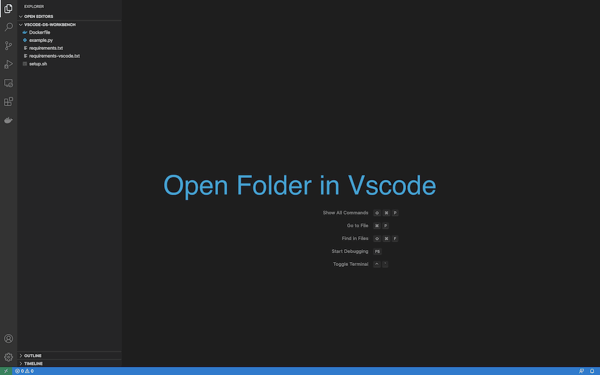

> Hear good things about docker but not sure where to get started? <br>
> Docker tutorials out there not useful as a data scientist / analyst? <br>
> Developing within docker environment! (Remote IDE) 

## Pre-requisites 

---

* Some basic understanding of terminal
    * Basic terminal knowledge of `mkdir`, `cd`, `ls`, `mv` etc is sufficient.   
* Have experience in common python packages, jupyter notebook.
    * Have launched jupyter notebook from terminal 
* [Docker installed](https://docs.docker.com/get-docker/)
    * Check that you can run in your terminal `docker --help` or `which docker`. 
    
## Problem Intro
---

As a data professional, 

* you want to make sure your work is reproducible. 
* Or if you are leading a team or is working on a project with a team,
* if you are developing your data products and want to make sure moving to production is as seamless as possible,
   
> How to you make sure the OS, system, packages installed are consistent across environments?  

On a personal note, i struggled with learning docker (as a math graduate only knowing R/Matlab).
I (personally) wished that there was a tutorial that could leverage on my existing skills set.

This is my attempt at explaining docker to a Data Scientist (DS) or Data Analyst (DA). 


## Hello-world! 
---
Something most DS/DA would be familiar with is jupyter notebooks. Lets use it as our Hello-world!

**Hands on!** (this might take a while to run)
```bash
docker pull continuumio/anaconda3
```

`output`:

```
68ced04f60ab: Pull complete
57047f2400d7: Pull complete
8b26dd278326: Pull complete
Digest: sha256:6502693fd278ba962af34c756ed9a9f0c3b6236a62f1e1fecb41f60c3f536d3c
Status: Downloaded newer image for continuumio/anaconda3:latest
docker.io/continuumio/anaconda3:latest
```

You have just downloaded a docker image!

## Docker images
---
**Hands on!** - In your terminal, run:
```bash
docker images
```

`output`:

```
REPOSITORY              TAG                 IMAGE ID            CREATED             SIZE
continuumio/anaconda3   latest              bdb4a7e92a49        3 months ago        2.7GB
```

In layman terms, an "image" is simply a "snapshot". Think of it this way, you bought a new computer,
and installed some software on it, and created a backup of the computer. That backup, is an "image".

## Docker containers 
---
A `docker container` is the instantiation of the docker image, you can think of it as a remote computer/server. In layman terms, you took your "image" (backup), installed it in a new computer and start running it. That new computer is your "container".

Now, we want to try to launch jupyter notebook and connect to our local machine, we need to connect the ports. 

**Hands on!** - In your terminal, run:
```bash
docker run -it -p 8888:8888 continuumio/anaconda3 
```

To check your containers that are running, open up a new terminal, run:
```bash
docker ps
``` 

`output`:

```
CONTAINER ID        IMAGE                   COMMAND             CREATED             STATUS              PORTS                    NAMES
948a08294e07        continuumio/anaconda3   "/bin/bash"         3 seconds ago       Up 3 seconds        0.0.0.0:8888->8888/tcp   strange_banzai
```

Notice the docker container id `948a08294e07`.

---

## Jupyter Notebook
---
In your docker terminal, create a new folder, change to that directory, and launch jupyter notebook like so:

```bash
mkdir workenv && cd workenv &&
jupyter notebook --ip 0.0.0.0 --port 8888 --no-browser --allow-root
```

output:

```
    To access the notebook, open this file in a browser:
        file:///root/.local/share/jupyter/runtime/nbserver-12-open.html
    Or copy and paste one of these URLs:
        http://948a08294e07:8888/?token=3ba6fa51fc63eea0f387e0d994fe7847e9efcbd799685234
     or http://127.0.0.1:8888/?token=3ba6fa51fc63eea0f387e0d994fe7847e9efcbd799685234

```

Try out your new remote docker development! 

To stop your jupyter notebook and exit out of docker container, either:

* close the terminal (Not recommended)
* stop the notebook (`control-c`) and run `exit` in the docker shell.
* In your other terminal, `docker stop 948a08294e07`. 

Now your docker container is no longer running, but still exists as a container that you can still restart it:

```bash
docker start 948a08294e07
```

And to access the bash terminal:

```bash
docker exec -it 948a08294e07 bash	
```

---

## Dockerfile 
---
In the earlier steps, we run command line by line, ideally we like to "script" it out. This is where `Dockerfile` comes in.

In layman terms, a `Dockerfile` is a set of instructions to follow when building the image. 

In addition, we will be switching to `miniconda` (to reduce the footprint). 

Create a file directory, with the following files and content:

* Directory
  
    ```text
    .
    ├── Dockerfile
    └── requirements.txt
    ```
    

* Contents of `Dockerfile`
  ```Dockerfile
  FROM continuumio/miniconda3:4.8.2
  EXPOSE 8888
  COPY requirements.txt $HOME
  RUN pip install -r requirements.txt
  WORKDIR $HOME/workenv
  CMD jupyter notebook --ip 0.0.0.0 --port 8888 --no-browser --allow-root
  ```
    
* Contents of `requirements.txt`
    ```text
    Flask==1.1.2
    jupyter==1.0.0
    python-dotenv==0.10.3
    matplotlib
    pandas
    numpy
    sklearn
    ```
    

<br>

### Dockerfile code

Every Dockerfile starts with a `FROM` statement. In this case, we pull/use an image from continummio as done previously. 

The `4.8.2` is pointing to a `docker tag`. To check the tags available, head over to `docker hub for continummio/miniconda3`
 [here](https://hub.docker.com/r/continuumio/miniconda3/tags).

For example, If you always want the latest image available, use `continuumio/miniconda3:latest`. 

After pulling the images, the rest is just the order of code to execute in building the image.
 
Below is a quick summary of the commands for reference. 

| Command    | Purpose                                         |
| :--------- | :---------------------------------------------- |
| FROM       | base image                                      |
| COPY       | copy files to docker                            |
| EXPOSE     | port to expose                                  |
| WORKDIR    | the base directory of docker                    |
| RUN        | run commands inside docker, <br> eg pip install |
| ENTRYPOINT | configure how container will run                |
| CMD        | last command to run                             |

Note: there are best practices[^1] for writing Dockerfiles.  

### Docker build

Now, instead of running step by step, you would use `docker build -t <image name> <directory of dockerfile>`

For example:

```bash
docker build -t docker_notebook .
```

You will notice that the downloading size is significantly smaller, and the logs for python installations.

### Docker run 

```bash
docker run -it -p 8888:8888 docker_notebook
```

`output`:

```
ll kernels (twice to skip confirmation).
[C 17:45:49.437 NotebookApp]

    To access the notebook, open this file in a browser:
        file:///root/.local/share/jupyter/runtime/nbserver-7-open.html
    Or copy and paste one of these URLs:
        http://3fd39bacaf20:8888/?token=f34ed4d8c57bd22e5f0a343657364100a9af983aac56a4a6
     or http://127.0.0.1:8888/?token=f34ed4d8c57bd22e5f0a343657364100a9af983aac56a4a6
```

Feel free to create your own notebook and run some simple code. Remember to exit your docker session. 

### Volumes mount 

Now, you might be wondering: 

* How do i access my training data? 
    * One way is to add / copy the data to the image, but what if your data changes?
    * Do you have to rebuild the docker image everytime your data changes? 
* How do i export the notebooks or python scripts locally to my machine (and then use git)?

This is where `volume -v` option comes in. 

* "Directory"
    Set up your directory as such:
    
    ```
    .
    ├── Dockerfile
    ├── requirements.txt
    └── workenv
        ├── anyfiles.csv
        └── hello_world.py
    ```
    
Run:

```bash
docker run --rm -it -p 8888:8888 \
-v $(pwd)/workenv:/workenv \
 docker_notebook
```    

Similarly, access the jupyter notebook and see your files there! Try to create a notebook. I named mine `create.ipynb`.
You will see that the notebook is also created in your local environment, including all changes.

Note: 

* The `--rm` flag tells your system to remove your container once you exit the session.
 This is to make sure you do not store data in your container to prevent 'mishaps'. 
* You also can have multiple mounts, including your credentials (example later).
 
Remember to exit your docker session.

---
 
### Managing secrets & env variables

Sometimes your local directory you have secret configs (such as db passwords) and you use `gitignore` 
to prevent the secrets from uploading to github. 

Similarly, in docker, you have `.dockerignore`.

As for env variables, during `docker run`, use the `-e` or `env-file` flag. 

Example:

* Create `.dockerignore` with the contents in the tab box below
* Create `secrets/env_vars` with the contents in the tab box below

* Directory
    ```text
    .
    ├── .dockerignore
    ├── Dockerfile
    ├── requirements.txt
    ├── secrets
    │   └── env_vars
    └── workenv
        ├── create.ipynb
        ├── anyfiles.csv
        └── hello_world.py
    ```
* `Dockerfile`
  
    ```Dockerfile
    FROM continuumio/miniconda3:4.8.2
    EXPOSE 8888
    COPY . $HOME
    RUN pip install -r requirements.txt
    WORKDIR $HOME/workenv
    CMD jupyter notebook --ip 0.0.0.0 --port 8888 --no-browser --allow-root
    ```        
* `.dockerignore`
    ```text
    **/secrets/*
    ```    
* `secrets/env_vars`
    ```bash
    dbname=superdb
    password=password
    ```    

Build the docker file again:

```bash
docker build -t docker_notebook .
```
and access the bash:
```bash
docker run --rm -it -p 8888:8888 \
--env-file ./secrets/env_vars \
-e db_table=hellothere \
-v $(pwd)/workenv:/workenv \
--entrypoint bash \
docker_notebook
```

and to check that the secrets is not copied even though your Dockerfile specified `COPY . $HOME`

```bash
cd ..
ls | grep secrets
```

There should be no `secrets` folder in your `ls` (or secrets folder is empty). 

As for the var variables, launch `ipython` and run the following: 

```python
import os
os.getenv('db_table') ##hellothere
os.getenv('password') ##password
os.getenv('dbname') ##superdb
```

Remember to exit your docker session after finishing up this section. 

### Using a json file

Suppose your docker service is using a service account or a json key,
 and you need that key in the docker container at development time,
 
You can place the `key.json` in the `secrets` folder mount it as a volume, like so:

```bash
docker run --rm -it -p 8888:8888 \
--env-file ./secrets/env_vars \
-e db_table=hellothere \
-v $(pwd)/workenv:/workenv \
-v $(pwd)/secrets:/secrets \
--entrypoint bash \
docker_notebook
```

Similarly, remember to exit your docker session.

---

## Additional Notes 
---

We used this command earlier, `entrypoint`. A common confusion/question is what is the difference between
`RUN`, `CMD` and `ENTRYPOINT`.  I found this[^2] to be a nice guide.

### Cleanup 

Run the following in order:

| Command                           | Description           |
| --------------------------------- | --------------------- |
| `docker stop $(docker ps -qa)`    | Stop all containers   |
| `docker rm $(docker ps -qa)`      | remove all containers |
| `docker rmi $(docker images -qa)` | remove all images     |

## Other Examples

### Docker Python runs

```Dockerfile
FROM continuumio/miniconda3:4.8.2
WORKDIR $HOME/src
COPY . $HOME/src
ENTRYPOINT ["python"]
CMD ["eg1.py"]
```

### Example1

Simple python script `eg1.py`.

```python
print("hello world!")
```
To run:
```bash
docker build -t dockerpy .
docker run -it dockerpy
```

output:
```
hello world!
```
    
### Example2 

Example2: Using `sys.args` in `eg2.py`: 

```python
import sys
##notice that when using sys.arg the index starts from 1
string = "This is my first arg {} and this is my second arg {}".format(sys.argv[1], sys.argv[2])
print(string)

##If you want to preserve the order of the messages
string ="This is the second arg {1} and this is the first arg {0}".format(sys.argv[1], sys.argv[2])
print(string)
```

To run: 

```bash
docker run -it dockerpy eg2.py hello there
```
output:
```
This is my first arg hello and this is my second arg there
This is the second arg there and this is the first arg hello
```
    
### Example3

Example3: Using `argparse` in `eg3.py`:

```python
import requests
import argparse

parser = argparse.ArgumentParser()

parser.add_argument(
    '--message', default='Hi there i have'
)

parser.add_argument(
    '--amount', default = 4, type=int
)
parser.add_argument(
    '--animal', default='cat'
)

known_args, other_args = parser.parse_known_args()

print(known_args)
print(other_args)
```
To run:

```bash
docker run -it dockerpy eg3.py --greet hello --name myname --animal beef
docker run -it dockerpy eg3.py --greet hello --name myname --animal beef --animal chicken --amount 10

```

output:

```
Namespace(amount=4, animal='beef', message='Hi there i have')
['--greet', 'hello', '--name', 'myname']

Namespace(amount=10, animal='chicken', message='Hi there i have')
['--greet', 'hello', '--name', 'myname']
```
    

### Docker Flask

Running a simple flask app in docker

Setup:

* `Dockerfile`

    ```Dockerfile
    FROM continuumio/miniconda3:4.8.2
    COPY . /app/
    EXPOSE 5000
    WORKDIR /app/
    RUN pip install flask
    CMD python app.py
    ```
    
* `app.py`
    ```python
    from flask import Flask, request
    
    app = Flask(__name__)
    ## wrapping the function up
    
    @app.route('/get_add_fuc')
    def get_add():
        a = request.args.get("a")
        b = request.args.get("b")
        return str(int(a) + int(b)), 200
    
    @app.route('/add', methods=['POST'])
    def add():
        data = request.get_json()
        a = data.get("a")
        b = data.get("b")
        return str(int(a) + int(b)),200
    
    
    @app.route('/multiply', methods=['POST'])
    def multiply():
        data = request.get_json()
        a = data.get("a")
        b = data.get("b")
        return str(int(a) * int(b)),200
    
    
    if __name__ == '__main__':
        app.run(host='0.0.0.0',port=5000, debug=True)
    ```

To run the docker image:

```bash
docker build -t flaskapp .
docker run -it -p 5000:5000 flaskapp 
```

For the `GET` request, go to your browser and enter the following url: `http://127.0.0.1:5000/get_add_fuc?a=1&b=10`.

For the `POST` request, either use postman or curl:

```bash
curl --location --request POST 'http://127.0.0.1:5000/multiply' \
--header 'Content-Type: application/json' \
--data-raw '{
    "a": 10,
    "b": 4
}'
```

## Remote Development IDE

---

[UPDATE! - There is now a realpython post on advance python usage with vscode, and it also mentiones about remote development with vscode using docker! ](https://realpython.com/advanced-visual-studio-code-python/##mastering-remote-development)

If you do not like notebooks, there are two IDE (that i am aware of) that allows for remote docker development.This allows you to use `.py` scripts in the docker container via an IDE.  

The most significant benefits (in my opinion) are:

* Allows you to use `.py` scripts which is better version control.
* The same docker file you used for development can be the same file you use for production - No more surprises! 
* Your environment can be reproducible across different platforms & individuals.

### Pycharm

Unfortunately, the remote docker development is only available in *professional* version.
Because of this, i will not cover on how to use it in this post, feel free to check it out 
[here](https://www.jetbrains.com/help/pycharm/2016.1/configuring-remote-interpreters-via-docker.html).

### Vscode

The `support remote intepreter` is one of the [top requested features](https://github.com/microsoft/vscode-python/issues/79).
The Vscode team released this in 2019, featuring on the [vscode blog](https://code.visualstudio.com/blogs/2019/05/02/remote-development)
and [ms devblog](https://devblogs.microsoft.com/python/remote-python-development-in-visual-studio-code/).

**Here is a short gist to illustrate**: 

> The remote containers is now called dev containers instead.
{: .prompt-info }




Below are resources i found useful:

* [Open a folder in container](https://code.visualstudio.com/docs/remote/containers##_quick-start-open-an-existing-folder-in-a-container)
* [Configuring .devcontainer](https://code.visualstudio.com/docs/remote/containers##_devcontainerjson-reference)
* [Interactive Python with Vscode](https://code.visualstudio.com/docs/python/jupyter-support-py)
* Microsoft examples
    * [Example one](https://github.com/microsoft/vscode-remote-try-python)
    * [Example two](https://github.com/microsoft/python-sample-tweeterapp)


---

### Vscode-Docker

Here is my walk-through at provide a "Data Science Workbench" with my mac as shown in the gist above.  

* Env Setup
  ```bash
  mkdir vscode-ds-workbench
  cd vscode-ds-workbench
  
  ##create requirements
  cat << "EOF" | pbcopy
  pandas==1.0.3
  numpy==1.18.1
  matplotlib==3.1.3
  EOF
  
  echo "$(pbpaste)" > requirements.txt
  
  ##create requirements for extra step in devcontainer
  cat << "EOF" | pbcopy
  black
  flake8
  pytest
  pylint
  mypy
  pydantic
  jupyter
  EOF
  
  echo "$(pbpaste)" > requirements-test.txt
  
  ##example.py file
  cat << "EOF" | pbcopy
  import matplotlib.pyplot as plt
  import numpy as np
  def hello(x):
      print(x)
  hello(10)
  x = np.linspace(0, 20, 100)
  plt.plot(x, np.sin(x)) 
  plt.show()
  EOF
  
  echo "$(pbpaste)" > example.py
  
  ##Dockerfile
  cat << "EOF" | pbcopy
  FROM continuumio/miniconda3:4.8.2
  WORKDIR $HOME/src
  COPY requirements.txt $HOME/src
  RUN pip install -r requirements.txt
  EOF
  
  echo "$(pbpaste)" > Dockerfile
  ```
* Download [Vscode here](https://code.visualstudio.com/download)
* Install the plugin `ms-vscode-remote.remote-containers` over [here](https://marketplace.visualstudio.com/items?itemName=ms-vscode-remote.remote-containers) or search for it in plugins.
* Open the folder in vscode. 
* Show all commands, and select `Dev-containers: Open Folder In Container`
* Select `From 'Dockerfile'` Option 
* Docker image will start building and reopen in remote container.  
* Open `.devcontainer` and replace the `devcontainer.json` with the following:
    ```json
    {
        "name": "Existing Dockerfile",
        // Sets the run context to one level up instead of the .devcontainer folder.
        "context": "..",
        // Update the 'dockerFile' property if you aren't using the standard 'Dockerfile' filename.
        "dockerFile": "../Dockerfile",
        // Set *default* container specific settings.json values on container create.
        "settings": {
            "terminal.integrated.shell.linux": null,
            "python.pythonPath": "/opt/conda/bin/python",
            "python.testing.unittestEnabled": false,
            "python.testing.nosetestsEnabled": false,
            "python.testing.pytestEnabled": true,
            "python.testing.pytestArgs": [
                "."
            ],
            "editor.formatOnSave": true,
            "python.linting.enabled": true,
            "python.linting.flake8Enabled": true,
            "editor.tabCompletion": "on",
            "python.dataScience.sendSelectionToInteractiveWindow": true,
            "python.formatting.provider": "black",
            "workbench.colorTheme": "Default Dark+",
            "python.linting.mypyEnabled": true,
            "python.linting.flake8Args": [
                "--max-line-length=88"
            ],
            "python.linting.pylintEnabled": true,
            "python.linting.pylintUseMinimalCheckers": false,
        },
        // Add the IDs of extensions you want installed when the container is created.
        "extensions": [
            "ms-python.python",
            "ms-python.vscode-pylance",
            "VisualStudioExptTeam.vscodeintellicode",
            "njpwerner.autodocstring"
        ],
        // Use 'forwardPorts' to make a list of ports inside the container available locally.
        "forwardPorts": [
            8888
        ],
        "postCreateCommand": "pip install -r requirements-test.txt &&apt-get update && apt-get install -y curl",
        // "runArgs": [
        // 	"--env-file=env_file"
        // ],
        "shutdownAction": "stopContainer",
    }
    ```
  
* Show all commands, and select `Rebuild Container`
* Try to run the python script in `example.py`. The output should appear in the `Python Interactive` panel on the right side. 

## Additional Readings

[Docker for python developers by Michael Herman](https://mherman.org/presentations/dockercon-2018/##1)
## References 

[^1]:[Best practices](https://docs.docker.com/develop/develop-images/dockerfile_best-practices/)
[^2]:[CMD/RUN/ENTRYPOINT?](https://goinbigdata.com/docker-run-vs-cmd-vs-entrypoint/)