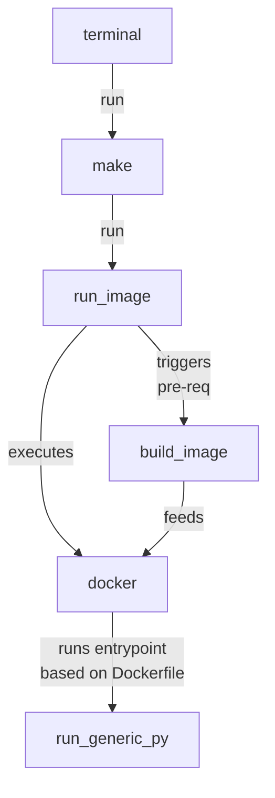

> Storing steps/procedures in README(s)? Keep copy and pasting commands to run? <br>
> Forgot your commands when revisiting your projects months ago? <br>
> Wish to hand over projects / commands / procedures to your team mates easily?

## TLDR!

Learning how to use Makefile greatly enhances your repository and productivity, and you will never forget how to get projects up and running ever again!

## Problem Statement!

If you are deploying data science projects, you might find yourself running multiple commands to get it into production. You end up writing in a readme:

* The commands to run.
* The order of commands to run. 
* The different parameters to use depending various factors (perhaps staging/production has a small difference in config or security )

Or, if you are joining a (tech) company, you might notice this `Makefile` with no file extensions - you wonder what does it exactly do?

### Additional Note

Most guides out there covers makefile with python scripts, I added a section with docker coverage. (Thus if your company support CI/CD pipelines or docker deployments it would be extremely useful)

## Pre-req

These are the following prerequisites, 

* Basic knowledge of terminal
* Running python scripts
* [Docker](../docker)

## Introduction

Typically thought in CS majors, `Make` is a build automation tool that allows you to build from source. If you are installing [Xgboost](https://xgboost.readthedocs.io/en/latest/build.html) from source, you are already using make! 

In the context of using Makefiles with python, it makes it easy to automate projects and sharing build (or execute) steps or re-using commands. 

## Setup

If you are using mac with brew,

```bash
brew install make
```

If you are using linux, 

```bash
apt-get install build-essential
```

If you only need make,

```bash
apt-get install make
```

## Using Makefile

To start, create a file named `Makefile`. It must be with a capital `M` and spelt correctly like so:

```bash
touch Makefile
```

### Hello World!

Using your favorite text editor, and add the following:

```makefile
echo_cmd:
	echo hello
```
>:exclamation:
> <br>
> Note, **four spaces** does not make a tab. You need to explicitly type out tab. When copying the examples below make sure to convert your spaces to tabs! 

Alternatively, if you are using mac, you can just run the following command instead:

```bash
cat << "EOF" | pbcopy
echo_cmd:
\techo hello
EOF
echo "$(pbpaste)" > Makefile
```

> The `\t` actually represents `tab`. 

### Rule

The entire blob / chunk, is a called a [Rule](https://www.gnu.org/software/make/manual/html_node/Rules.html).

In general, a rule looks like this:

```makefile
targets : prerequisites
        recipe
        …
```

### Target

In the earlier blob, `echo_cmd` would represent the target. 

### Running make

With this, you are now ready to run your first make command! 

```bash
make echo_cmd
```

Output:

```bash
❯ make echo_cmd
echo hello
hello
```

The first line is to show the rendered command which is `echo hello`, followed by the actual output! 

### Commenting

Commenting in makefile is easy, just place a hex `#` at the front. There is no multi line commenting in Makefile, so either use # for each line, or use `\` to wrap the first line. 

[Stackoverflow - how to add multi line comments in makefiles](https://stackoverflow.com/questions/4493291/how-to-add-multi-line-comments-in-makefiles)

### Variables

[Variables](https://www.gnu.org/software/make/manual/html_node/Using-Variables.html#Using-Variables) can be useful when you want to assign custom values.

This is a trivial example:

```makefile
VARIABLE=hello there

echo_var_cmd:
	echo $(VARIABLE)
```

Note, in Makefiles, `()` or `{}` serves the same purpose. 

To run, 

```bash
make echo_var_cmd
```

To run it with different default values,

```bash
make echo_var_cmd VARIABLE=hi\ there
```

output:

```bash
❯ make echo_var_cmd VARIABLE=hi\ there

echo hi there
hi there
```

### Inheritance/prerequisites

Let's assume that you have a project that you need to deploy, which will require 

1. Different number of nodes 
2. Different environment (dev/stg/prod)

For the purpose of understanding, we will just echo the `nodes` and `env` before adding python scripts + docker later on.

```bash
NODES=1
ENV=dev
run_test_command:
	echo $(NODES)
	echo $(ENV)
```

To run,

```bash
make run_test_command
```

Depending on different environments you might have different configurations,

```bash
make run_test_command ENV=prod NODES=10
```

### Over writing defaults

If you want to pre-specify the nodes/env depending on the environment, you can do this:

```makefile
stg_child:ENV=stg
stg_child: run_test_command

prod_child:ENV=prod
prod_child:NODES=10
prod_child: run_test_command
```

Example output:

```bash
❯ make prod_child
echo 10
10
echo prod
prod
```

Unfortunately, each new variable default overwrites must be specified by a new line (multi overwrites in a single line is not supported - at least to my best knowledge). 

## Makefile with Python

Now, instead of printing commands, let's execute a python file.

### Python argparse 

Create a python script named `app.py` in the same directory with `Makefile` with the following code (take a while to understand the code) 

```python
import argparse

# todo
# makefile with python
print("starting python script")

parser = argparse.ArgumentParser()

parser.add_argument("--environment", default="dev")

parser.add_argument("--num_nodes", default=1, type=int)

known_args, other_args = parser.parse_known_args()

print(known_args.environment)
print(known_args.num_nodes)
print("done with python code")

```

### Running with make

Add the following commands to `Makefile` 

```makefile
run_specific_py:
	python app.py \
	--environment=stg \
	--num_nodes=2

run_generic_py:
	python app.py \
	--environment=$(ENV) \
	--num_nodes=$(NODES)
```

The execution & output can be seen below:

```bash
❯ make run_generic_py ENV=prod NODES=123
python app.py \
	--environment=prod \
	--num_nodes=123
starting python script
prod
123
done with python code
```

## Adding Docker

Adding [Docker](../docker) is useful for various reasons, such as making the execution environment consistent or moving into a cluster /  container runner in the cloud. 

### Define dockerfile 

Define a Dockerfile, in my case, I named it `Df_Mkfile` with the following content:

```Dockerfile
FROM continuumio/miniconda3:4.8.2

RUN apt-get update -y \
    &&  apt-get install -y build-essential make pkg-config

WORKDIR $HOME/src
COPY requirements.txt Makefile app.py $HOME/src/
RUN pip install -r requirements.txt

ENTRYPOINT ["make", "run_generic_py"]
CMD ["ENV=dev","NODES=123"]
```

And `requirements.txt` (just an example - you do not actually need the libraries):

```bash
pandas==1.2.4
numpy==1.20.2
matplotlib==3.1.3
```

### Docker run with make

Edit `Makefile` with these additional lines 

```makefile
IMAGE_NAME=my_image
build_image:
	docker build -t $(IMAGE_NAME) --file Df_Mkfile .

run_image: build_image
run_image:
	docker run --rm -it $(IMAGE_NAME) ENV=$(ENV) NODES=$(NODES)
```

This is the output when running:

```bash
make run_image ENV=prod NODES=567
```

output:

```bash
docker build -t my_image --file Df_Mkfile .
docker run --rm -it my_image ENV=prod NODES=567
python app.py \
--environment=prod \
--num_nodes=567
starting python script
prod
567
done with python code
```

## Visual Representation



# Docker entrypoint

Sometimes when running a docker application (such as a flask app) and you encounter errors which requires debugging in the container, you can introduce a new rule in the makefile: 

```makefile
run_image_bash:
	docker run --rm -it --entrypoint bash $(IMAGE_NAME)
```

That way, you can alternate between running docker with different entrypoints or deployments pending on your use-case/cotnext.

## Other examples

In one of the [references](https://krzysztofzuraw.com/blog/2016/makefiles-in-python-projects.html), you can also set commands that are often used in python projects, such as cleaning `pyc` or running `tests`, `black`, or `flake8` etc. 

```makefile
clean-pyc:
	find . -name '*.pyc' -exec rm --force {} +
	find . -name '*.pyo' -exec rm --force {} +
	name '*~' -exec rm --force  {} 

clean-build:
	rm --force --recursive build/
	rm --force --recursive dist/
	rm --force --recursive *.egg-info

lint:
	flake8 --exclude=.tox

test: clean-pyc
	py.test --verbose --color=yes $(TEST_PATH)
```

## Additional topics

There are additional topics that are not covered that are useful, such as (but not limited to), perhaps it will be added in the future. 

* PHONY
    * Useful when your directory intersects with certain keywords. 
    * Check out the gnu documentation if your makefile targets intersect with directories over [here](https://www.gnu.org/software/make/manual/html_node/Phony-Targets.html)
* CMake
    * Useful to generate makefile with other benefits. 
    * Check out stackoverflow for quick explanation over [here](https://stackoverflow.com/questions/43653582/cmake-or-make-do-i-need-both)
* Wildcards
* Running bash commands within Makefile rules
* Setting defaults makes 

## References 

* [Entire GNU make software documentation](https://www.gnu.org/software/make/manual/html_node/index.html#SEC_Contents)
* [101 with makefile - makefiletutorial](https://makefiletutorial.com/)
* [Make tutorial notes from upenn](https://www.sas.upenn.edu/~jesusfv/Chapter_HPC_6_Make.pdf)
* [Makefiles in python projects](https://krzysztofzuraw.com/blog/2016/makefiles-in-python-projects.html)
* [Simple Makefile to automate python projects](https://medium.com/@habibdhif/simple-makefile-to-automate-python-projects-e233af7681ad)
* [Makefile - python example](https://blog.horejsek.com/makefile-with-python/)
* [What is a makefile with advance sections](https://opensource.com/article/18/8/what-how-makefile)