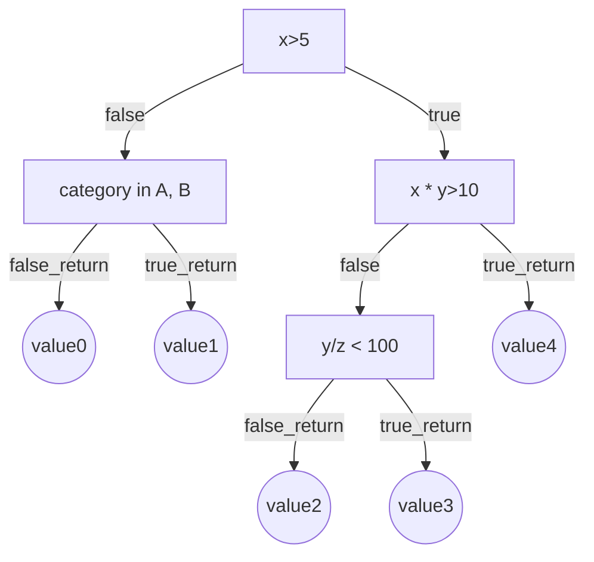

# Problem intro

As a data scientist (or analyst), we spend a significant chunk of time to gather & clean data. Sometimes as we are doing feature engineering, we build functions and iterate the functions based on the objective. 

After a while, you deploy your models along with the feature engineering functions into production, (or data analysis for a dashboard output) and your stakeholder / product manager spots a mistake:

>:exclamation:
><br>
> How do you identify the failure point as soon as possible? Is it the code, or the data being sent to you in production?

This is where testing becomes important from a data scientist point of view! 

In addition, it also helps to:

* provide context + documentation
* safeguards against yourself when making changes or pre-deployment! 

# Pre-Req

* Basic terminal, Python
* [Typed python - Pydantic](../typed-python)

## Good to have

* [Docker](../docker)
* Knowledge of remote development with vscode
* [Makefile](../makefile)

# Quick Setup

In a rush? All the (completed) examples are available in github. Git clone the repo with:

```bash
git clone https://github.com/Freedom89/pytest-tutorial.git
```

Changes at 2nd Aug 2021: I moved the content to `introduction` folder, hence some of the output might change from `src/pytest-tutorial` to `src/pytest-tutorial/introduction`. 

Nevertheless, the content remains the same, please navigate to the `introduction` folder and refer to the README for setup. There are 3 options:

* Local setup with terminal.
* Accessing the Docker bash.
* Inside vscode remote development.

For the purpose of this repo, it is recommended to use either vscode remote development terminal, or your normal terminal accessing the docker bash entry point. 

  * The [docker guide](../docker) might be useful in understanding the README.


# Actually..

Most data scientist are already doing testing when cleaning data / building features!

Let's consider one of a data scientist most popular tool, [pandas](https://pandas.pydata.org/). 

You would attempt some aggregations, and run some sample data and check the values

```python
import pandas as pd

df_dummy = pd.DataFrame(dict(id=[1, 1, 2, 2, 3, 3, 3], values=[3, 5, 6, 7, 8, 9, 15]))

df_stats = (
    df_dummy.groupby(["id"])
    .agg(
        count=pd.NamedAgg(column="values", aggfunc="count"),
        sum=pd.NamedAgg(column="values", aggfunc="sum"),
        max=pd.NamedAgg(column="values", aggfunc="max"),
    )
    .reset_index()
    .assign(pct_value=lambda df: round(100 * df["sum"] / sum(df["sum"]), 2))
)

"""
df_stats
id	count	sum	max	pct_value
0	1	2	8	5	15.09
1	2	2	13	7	24.53
2	3	3	32	15	60.38
"""
# To double check - you might sample a column or specific rows

df_temp = df_dummy.loc[lambda x: x["id"] == 1][["values"]]
df_temp.sum().values #8
df_temp.max().values #5
```

Now lets visit a simpler example for now!

# Introduction

Suppose you have implemented a function, say computing the number of combinations:

$$ ^nC_r = \frac{n!}{r! \times (n-r)!}$$

You would break down the function into a few parts into units (In reality you might do it in one pass, but let's go along with it)

* implementing the factorial function
* implementing the multiplication function
* implementing the division function 

## Assert

Before we proceed, we need to learn the `assert` statement: `assert <statement>, <reason if failure>`. 

```python
x: int = 100
y: int = 200

assert x == y, "values are not the same!"
```

Output:

```bash
assert x ==y, "values are not the same!"
---------------------------------------------------------------------------
AssertionError                            Traceback (most recent call last)
/workspaces/pytest-tutorial/src/simple_math.py in 
----> 8 assert x ==y, "values are not the same!"

AssertionError: values are not the same!
```

If the assert statement is correct, e.g `assert x == y-100` then no error message will occur.

## Example

Now, lets start with a Hello World example!

Assuming you are using [anaconda distribution](https://www.anaconda.com/) with mac/linux/docker etc, 

Define a python script such as `simple_math.py` with `pytest` (via pip) installed as follow:

```python
def factorial(x: int) -> int:
    if x == 0:
        return 1
    else:
        return x * factorial(x - 1)


def test_factorial():
    assert factorial(3) == 6, "response is incorrect"
```

In the same directory where `simple_math.py` is: 

```bash
pytest simple_math.py 
```

```bash
======================= test session starts ========================
platform linux -- Python 3.7.6, pytest-5.4.3, py-1.9.0, pluggy-0.13.1
rootdir: /workspaces/pytest-tutorial/src
plugins: mock-3.3.0
collected 1 item                                                   

simple_math.py .                                             [100%]

======================== 1 passed in 0.03s =========================
```

If you encounter `ModuleNotFoundError: No module named 'src'` and you are running in your local environment, you can:

* Understand why and refer to the [references section](#references)
* Try running `python -m pytest`
* Or `make localtest` if you understand `Makefile`. 
   
# Naming convention

Quoted from the [docs](https://docs.pytest.org/en/reorganize-docs/new-docs/user/naming_conventions.html), 

>Test method names or function names should start with “test_”, as in test_example. Methods with names that don’t match this pattern won’t be executed as tests.

You will notice that some scripts beginning with `eg_` will not run unless specifically invoked!

# Folder structure 

There are also [certain recommended ways to structure your test layout](https://docs.pytest.org/en/reorganize-docs/new-docs/user/directory_structure.html). 

I personally follow this layout which is the first structure suggested in the docs above:

```
.
├── Dockerfile
├── README.md
├── requirements.txt
├── setup.py
├── src
│   ├── __init__.py
│   └── simple_math.py
└── tests
    └── test_simple_math.py
```

[Best practices / Extra readings in references](#references)

# Use-Case

We now look at common use cases that a data scientist/analyst will encounter:

* [Regex](#regex)
* [Decision trees](#decision-tree)
* [Dataframes](#pandas)

## Regex

Perhaps as a data scientist working in a e-commerce platform and launching a marketing campaign, you want to detect emails that are associated to each other. One way this could be done is by string similarity. Your users would start creating emails such as:

* string12352@gmail.com
* string23522@gmail.com

Or by using multiple free email providers:

* string@gmail.com
* string@outlook.com
* string@yahoo.com

In `src/regex.py`:

* 
    ```python
    import re
    from typing import Optional


    def eval_none_str(x: Optional[int]) -> str:
        if x is None:
            return ""
        else:
            return str(x)


    def remove_trailing_numbers(
        input_email: str, lb: int = 1, ub: Optional[int] = None
    ) -> str:
        """[A function to remove the numbers behind the username of an email address]

        For example, a1234@gmail.com will be a@gmail.com with default values
        a1234@gmail.com will remain as it is if ub < 4. 
        
        Args:
            input_email (str): [A valid email]
            lb (int): [upper bound]
            ub (int): [lower bound]

        Returns:
            str: [email stripped]
        """
        preceding_token: str = "{" + str(lb) + "," + eval_none_str(ub) + "}"
        regex_string: str = r"[~0-9]{0}(?=@[a-zA-Z0-9-]+\.[a-zA-Z0-9-.]+$)".format(
            preceding_token
        )

        return re.sub(regex_string, "", input_email)


    def extract_username(input_email: str) -> str:
        """[extract username]

        a@gmail.com will become a
        Args:
            input_email (str): [a valid email]

        Returns:
            str: [the username portion]
        """
        return re.search(r"(.*)(?=@[a-zA-Z0-9-]+\.[a-zA-Z0-9-.]+$)", input_email).group()


    ```

In `tests/regex.py`:

* 
    ```python
    from src.regex import regex as regex


    def test_rm1():
        assert regex.rm_trailing_numbers("a1234@gmail.com", 1) == "a@gmail.com"


    # Or test multiple emails


    def test_rm2():
        assert regex.rm_trailing_numbers("a1234@gmail.com", 5,) == "a1234@gmail.com"
        assert regex.rm_trailing_numbers("a1234@gmail.com", 1, 3) == "a1@gmail.com"


    def test_extract():
        assert regex.extract_username("a@gmail.com") == "a"

    ```

To run:

```bash
pytest tests/regex
```

Output:

```bash
====================== test session starts ======================
platform linux -- Python 3.7.6, pytest-5.4.3, py-1.9.0, pluggy-0.13.1
rootdir: /workspaces/pytest-tutorial
plugins: cov-2.10.1, mock-3.3.0
collected 3 items                                               

tests/regex/test_regex.py ...                             [100%]

======================= 3 passed in 0.06s =======================
```

There are some problems with this testing in terms of best coding practices, such as:

* Multiple namings trying to figure out different function paramters `test_rm1`, `test_rm2` - The naming convention cannot be the usual `test_function` format,
* Multiple asserts doing the same thing within `test_rm2` but will only show 1 pass. 
* multiple copy/pasting, yikes!

There is a better way to do this with [parametrize](#parametrize) which will be re-visited later. 

## Decision Tree

Data scientist/analyst sometimes implements rule based engine / or performs feature engineering! When creating a function or the rule engine, a data scientist would enter some mock values to test that his function is working as expected! 

Aside: Another purpose of this is to demonstrate with [pydantic](../typed-python)! 



In `src/dtree/dtree.py`:

* 
    ```python
    from src.dtree.types import RawData, IntFeat, Response


    def compute_int_feat(input: RawData) -> IntFeat:
        val_x = input.x
        val_xy = input.x * input.y
        val_y_div_z = input.y / input.z
        val_in_AB = input.category.value in ["A", "B"]
        return IntFeat(x=val_x, x_times_y=val_xy, y_div_z=val_y_div_z, cat_in_AB=val_in_AB)


    def compute_response(input: IntFeat) -> Response:
        if input.x > 5:
            if input.x_times_y > 10:
                return Response.value4
            else:
                if input.y_div_z < 100:
                    return Response.value3
                else:
                    return Response.value2
        else:
            if input.cat_in_AB:
                return Response.value1
            else:
                return Response.value0

    ```

In `src/dtree/types.py`:

* 
    ```python
    from pydantic import BaseModel
    from enum import Enum


    class Category(str, Enum):
        A: str = "A"
        B: str = "B"
        C: str = "C"


    class RawData(BaseModel):
        x: int
        y: int
        z: int
        category: Category


    class IntFeat(BaseModel):
        x: int
        x_times_y: int
        y_div_z: float
        cat_in_AB: bool


    class Response(Enum):
        value0: str = "value0"
        value1: str = "value1"
        value2: str = "value2"
        value3: str = "value3"
        value4: str = "value4"

    ```

In `tests/dtree/test_dtree.py`:

* 
    ```python
    from src.dtree import dtree
    from src.dtree.types import RawData, IntFeat, Response, Category

    sample_input = RawData(**dict(x=6, y=2, z=100, category=Category.A))
    sample_feat = IntFeat(**{"x": 6, "x_times_y": 12, "y_div_z": 0.02, "cat_in_AB": True})
    sample_response = Response.value4


    def test_compute_int_feat():
        assert dtree.compute_int_feat(sample_input) == sample_feat, "something went wrong"


    def test_compute_response():
        assert (
            dtree.compute_response(sample_feat) == sample_response
        ), "something went wrong"

    # parametrize left as an exercise
    ```

Similarly, to test for the other values / sample inputs, you can make use of the pytest [parametrize](#parametrize). 

To run:

```bash
pytest tests/dtree/
```

## Pandas

In the earlier pandas example, this is what you could have done:

```python

df_check = pd.DataFrame(
    {
        "id": {0: 1, 1: 2, 2: 3},
        "count": {0: 2, 1: 2, 2: 3},
        "sum": {0: 8, 1: 13, 2: 32},
        "max": {0: 5, 1: 7, 2: 15},
        "pct_value": {0: 15.09, 1: 24.53, 2: 60.38},
    }
)

pd.testing.assert_frame_equal(df_stats, df_check)

```

:raising_hand:

Now, a question you may start asking:

> What if i want to reuse this data frame for multiple tests?

This is where [fixtures](#fixtures) will be useful! 

Aside: `conftest.py` will be covered in another posts: essentially it allows you to share fixtures with all your tests! 

# Pytest Libraries

This section talks more about the other features of pytest which will solve some of the pain points above. 

They are mainly:

* [Fixtures](#fixtures)
* [Parameterize](#pandas)
* [Mock](#mocking)

## Fixtures

In a data scientist context, a fixture is essentially an object you can access in the test.

```python
import pytest

@pytest.fixture
def put_whatever_name_you_wish():
    return "anyvalue"

def test_value(put_whatever_name_you_wish):
    assert put_whatever_name_you_wish == "anyvalue", "something went wrong"
```

Now, lets take a look at the pandas example. 

In `src/pd_df.py`:

* 
    ```python
    import pandas as pd


    def calc_features(df_input: pd.Dataframe) -> pd.DataFrame:
        df_out = (
            df_input.groupby(["id"])
            .agg(
                count=pd.NamedAgg(column="values", aggfunc="count"),
                sum=pd.NamedAgg(column="values", aggfunc="sum"),
                max=pd.NamedAgg(column="values", aggfunc="max"),
            )
            .reset_index()
            .assign(pct_value=lambda df: round(100 * df["sum"] / sum(df["sum"]), 2))
        )
        return df_out


    def calc_size(df_input: pd.DataFrame) -> int:
        return df_input.shape[0]

    ```

In `tests/pd_df.py`:

* 
    ```python
    import pandas as pd
    import pytest
    from src.pd_df import calc_features, calc_size


    @pytest.fixture
    def dummy_dataframe():
        df_dummy = pd.DataFrame(
            dict(id=[1, 1, 2, 2, 3, 3, 3], values=[3, 5, 6, 7, 8, 9, 15])
        )
        return df_dummy


    @pytest.fixture
    def dummy_results():
        df_check = pd.DataFrame(
            {
                "id": {0: 1, 1: 2, 2: 3},
                "count": {0: 2, 1: 2, 2: 3},
                "sum": {0: 8, 1: 13, 2: 32},
                "max": {0: 5, 1: 7, 2: 15},
                "pct_value": {0: 15.09, 1: 24.53, 2: 60.38},
            }
        )
        return df_check


    def test_calc_features(dummy_dataframe, dummy_results):
        pd.testing.assert_frame_equal(
            calc_features(dummy_dataframe), dummy_results
        ), "something went wrong"


    def test_calc_size(dummy_dataframe):
        assert calc_size(dummy_dataframe) == 7, "something went wrong"


    ```


To know more, you can find the [docs here](https://docs.pytest.org/en/stable/fixture.html).
## Parametrize

In the earlier [regex](#regex) example, you might have a few emails to test. Similarly in the [decisiontrees](#decision-tree) you would need to provide sample values to verify that each branch is working as expected.

Think of parametrize as different values you can input to get different desired outputs. 

The syntax may seems weird at first:

```python
import pytest


@pytest.mark.parametrize(
    "input,another_input,output",
    [((1, 1), 2, 4), ((2, 4), 4, 10), ((4, 10), 100, 114)],
)
def test_addition(input, another_input, output):
    assert sum(input) + another_input == output, "something went wrong"

```

Essentially, you envision what variables you need in the functions, e.g `A,B,C` and you concat them in a string `"A,B,C"` separated by commas. After which, you define a list of tuples, with each element in the tuple representing the value of each variable. 

In the earlier [regex](#regex) example in `tests/regex/test_regex.py`, it would be simplified to the following:

```python
@pytest.mark.parametrize(
    "input_email,lb,ub,output_email",
    [
        ("a1234@gmail.com", 1, None, "a@gmail.com"),
        ("a1234@gmail.com", 5, None, "a1234@gmail.com"),
        ("a1234@gmail.com", 1, 3, "a1@gmail.com"),
    ],
)
def test_rm_trailing_numbers(input_email, lb, ub, output_email):
    assert (
        regex.rm_trailing_numbers(input_email, lb, ub) == output_email
    ), "something went wrong"

```

> Note, to use fixtures with parametrize would require [pytest-cases](https://smarie.github.io/python-pytest-cases/) which is not covered here! But just so you are aware!
<br>
>  :smile:

## Mocking

Mocking is generally used in two cases (in my experience):

The first case is when the value or feature is `time` dependent or is `random` in nature. This is assuming that setting a `CONSTANT` value or `Set Seed` or a fixture is not possible. 

The second case is when:

  * a function or process takes too long to return, such as a complicated function, or
  * making a call to an external system and you would like to by-pass it so that your tests are independent of the external system. (you could use docker-compose, but that is a separate discussion altogether)

[More suggested readings available at references, do check them out!](#references)

The full [docs for pytest-mock can be found here](https://pypi.org/project/pytest-mock/). The most 2 common mocks i use are:

* `mocker.patch`
* `mocker.patch.object`
  
To demonstrate, in `src/demo_mock.py`:

* 
    ```python
    import time as time

    # define a constant
    CONSTANT = 100
    # define a function
    def get_constant():
        return CONSTANT * 2


    def get_time_now() -> int:
        return int(time.time())


    def add(x: int, y: int) -> int:
        return x + y


    def add_minus_10(x: int, y: int) -> int:
        value = add(x, y)
        return value - 10
    ```

In `tests/eg_demo_mock.py`:

* 
    ```python
    import pytest
    import src.demo_mock
    from src.demo_mock import add_minus_10, get_constant, DummyClass

    # Constants


    def test_replace_constant(mocker):
        mocker.patch.object(src.demo_mock, "CONSTANT", 123)
        expected = 246
        actual = get_constant()  # you would expect 200
        assert actual == expected, "something went wrong"


    def test_replace_function(mocker):
        mocker.patch("src.demo_mock.add", return_value=200)
        actual = add_minus_10(10, 20)  # you would expect 20
        expected = 190
        assert actual == expected, "something went wrong"

    ```

# Pytest commands

The full pytest commands in terminal can be found by `pytest -h` or `pytest -help`. These will get you started:

| command                               | example                                      | description                                           |
| :------------------------------------ | :------------------------------------------- | :---------------------------------------------------- |
| `pytest`                              | as is                                        | run all tests,  by default look for `tests` directory |
| `pytest <dir>`                        | `pytest tests`                               | execute all tests in directory                        |
| `pytest <dir>/<script>`               | `pytest tests.eg_demo_mock.py`               | execute specific script                               |
| `pytest <dir>/<script>::<func>`       | `pytest tests/regex/test_regex.py::test_rm2` | execute specific function within script               |
| `pytest --collect-only`               | as is                                        | shows all tests that will be executed                 |
| `pytest -k <string>`                  | `pytest -k "rm_trailing"`                    | execute tests with matching string                    |
| `pytest -k` <br>`<string not string>` | `pytest -k` <br> `rm and not numbers`        | execute tests with string excluding not string        |
| `pytest -x`                           | as is                                        | stop after first failure                              |
| `pytest -v`                           | as is                                        | verbose                                               |


# Skipping tests

There are cases where you would want

* Deliberately fail a test  
    * To show that how the function should not be used 
    * or is expected to fail based on certain inputs
* to skip a test, 
    * Generally I use this when I have no idea how to test something but i tried my best, in that case I leave it as it is to show what I have attempted. (Hopefully someone or the future me will figure it out!)
* or skip a test under certain conditions,
    * Such as specific Operating Systems!

[Refer to the docs for more on the various types of skipping!](https://docs.pytest.org/en/latest/skipping.html). The below 3 examples illustrates the above! 

## Xfail

```python
@pytest.mark.xfail(strict=True)
def test_function():
    assert 1==2, "something went wrong"
```
## skip

```python
@pytest.mark.skip(reason="no way of currently testing this")
def test_the_unknown():
    ...
```

## skipif

```python
import sys


@pytest.mark.skipif(sys.version_info < (3, 7), reason="requires python3.7 or higher")
def test_function():
    ...
```

## Pytest Cov

Helps to check the coverage to know your testing percentage! [Docs here](https://pytest-cov.readthedocs.io/en/latest/)

```bash
pytest --cov
```

```bash
----------- coverage: platform linux, python 3.7.6-final-0 -----------
Name                        Stmts   Miss  Cover
-----------------------------------------------
src/__init__.py                 0      0   100%
src/dtree/__init__.py           0      0   100%
src/dtree/dtree.py             17      6    65%
src/dtree/types.py             22      0   100%
src/pd_df.py                    6      0   100%
src/regex/__init__.py           0      0   100%
src/regex/regex.py             12      0   100%
src/simple_math.py              4      0   100%
tests/dtree/test_dtree.py       9      0   100%
tests/regex/test_regex.py      11      0   100%
tests/test_pd_df.py            13      0   100%
tests/test_simple_math.py       5      1    80%
-----------------------------------------------
TOTAL                          99      7    93%

```

# References 
* Understanding pytest path
    * [encounter MODULENOTFOUNDERROR?](https://stackoverflow.com/questions/10253826/path-issue-with-pytest-importerror-no-module-named-yadayadayada)
* Good practices
    * [Official docs on good practices](https://docs.pytest.org/en/latest/goodpractices.html)
* More examples on Mocking
    * [Official docs on mocking](https://pypi.org/project/pytest-mock/)
    * [More on mocking](https://changhsinlee.com/pytest-mock/)
* Additional guides
    * [From realpython](https://realpython.com/pytest-python-testing/#when-to-create-fixtures)