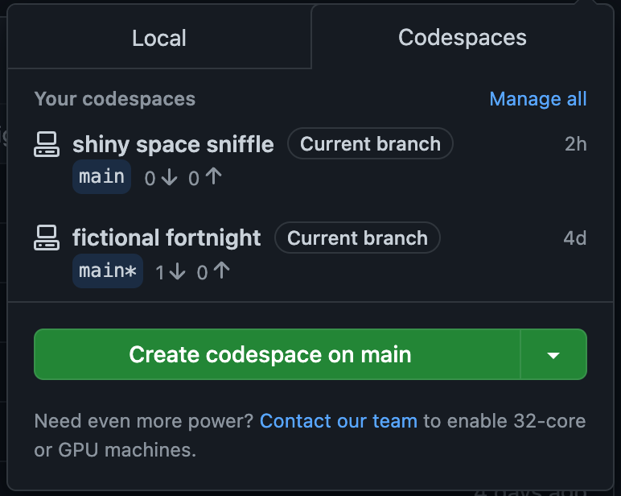
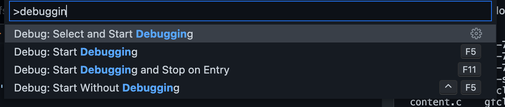
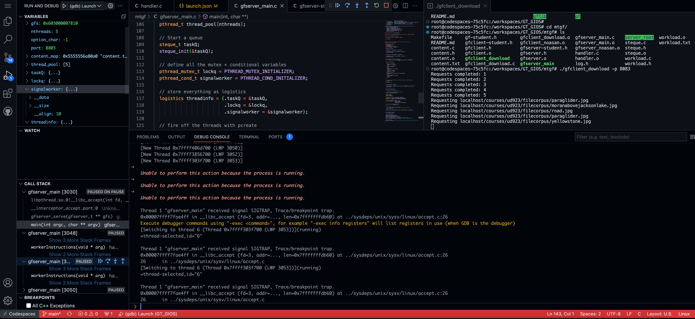

## Overall review

I took [introduction in operating systems](https://omscs.gatech.edu/cs-6200-introduction-operating-systems) during fall 2022 as my first course in OMSCS. My only preparation / experience with C is from [CS50X by harvard](https://cs50.harvard.edu/x/2023/). 

> If you are completely new to C, I suggest you to do CS50X until Week 5. You should at least understand pointers, types, malloc, queues. Understanding [Makefile](../makefile) will also be useful.
{: .prompt-tip }

This is my first exposure of an operating system with a complied language such as C. There are 3 projects worth 15% each, 2 exams (fully mcq) worth 25% each and 5% participation points.

Overall, I would recommend this course to gain a better understanding of computers. The main takeaways for me are the usage handlers and grpc section since I do encounter or use them quite often at work. Programming with C has also helped me my understanding of other languages, such as golang. This course is also recommended if you intend to take advance operating systems, which happens to be a pre-req for distributed systems and/or system design for cloud computing.

## Time requirement

Overall I found the assessment of 20hours/week accurate, perhaps more during the project weeks. This course is almost like drinking from a fire hose, just when you finish the first project, is time to prepare for midterms. After that it hits you with another project, and once done you have to study a different language with GRPC/Protobuf. Right after, it is time to prepare for finals.

## M1 Mac

M1 Mac will struggle a little with this, since address sanitizer does not work on M1 Mac. I overcame this by using [github codespaces](./#github-codespaces).
## Lectures

Personally, I am not a fan of lectures and usually prefer reading. I watch the lectures once and revisit occasionally as I refer to notes provided by previous students instead:

> * [ocmcs-notes](https://www.omscs-notes.com/operating-systems/welcome/)
> * [notes provided by pmoore64 - requires login](https://github.gatech.edu/pmoore64/notes)
>  
> Also, the book [linux programming interface](https://man7.org/tlpi/) is pretty good. The course covers:
{: .prompt-info }

First half of the semester:

* What defines a operating system (OS)? What are the different types of OS?
  * What are design/ principles or elements of a OS?
* What is a process?
  * How are addresses handled in the operating system?
  * What about caches, I/Os, schedules.
  * Process lifecycle.
* The relationship between a process and a thread.
  * Multi threading, concurrency, mutexes.
  * Reader/Writer problem, deadlocks, workers, queues, conditional variables.
  * Different design patterns.
  * Improving thread performances.
* Kernel level threads vs user level threads
  * Signal handling, Interrupts, Masks.

Before the drop date, I received my project 1 scores and midterm scores.

Second half of the semester:

* Scheduling
* Memory management (IPC)
* Sync between memory operations, I/O management
* Virtualization
* RPC
* Distributed systems, data centers.

## Exams

I got slightly below median for the midterms (because I screw up a calculation question) and above median for the finals. My overall comments in terms of preparation:


>* Be able to understand all the quizzes and be able to reproduce all calculations.
>* Understand race conditions and mutexes!
>* Take the mock exam (provided for midterm) seriously.
>* Try to understand the underlying concepts instead of memorizing them.
>* Read the notes provided by previous students. The notes provides summary of the papers discussed in lectures.
>   * [omscs-notes](https://www.omscs-notes.com/operating-systems/welcome/)
>   * [notes provided by pmoore64 - requires login](https://github.gatech.edu/pmoore64/notes)
>* Then, if you still have time or really interested in certain particular topics, read the papers.
{: .prompt-tip }

## Projects

The projects can be quite time intensive, luckily I took their advice and start as early as I could.
### Pr1

The project starts of with you diving into the book [Beej's guide to network programming](https://beej.us/guide/bgnet/). It will probably be a futile attempt to avoid this step unless you are already familiar with the internals of linux/c.

The project then moves on with you implementing a file transfer protocol (reader/writer problem) by setting up your own client and server using sockets. I struggled a little at the start because I could not understand the concept of a [handler](https://www.baeldung.com/cs/handlers-programming). 

Afterwards, you are required to implement the handler yourself, and is required to make multi threaded implementation. You will need to make use of "locks" and make sure there are no race conditions.


>This is my personal explanation for `handler`:
>
>* Imagine you are working with a large team, and this team gives you a library  that will perform task A for you, as long you supply it with the right information.
>* Do you really care how the library is implemented? 
>* That is exactly what a handler is, you can treat it like a black box!
>* Understand double pointers well, you will need it in Pr3!
{: .prompt-tip }

### Pr3

The project builds on top of project1, where now instead of using sockets for file transfer, you are going to use memory segments instead. You will also be required to clean up all the resources you have provisioned.

Personally, this project was my favorite, since it involved design components and making trade offs.


>* Understand [flexible sized arrays in C](https://www.geeksforgeeks.org/flexible-array-members-structure-c/). This is because the required memory segsize is given in as a parameter.
>* Use POSIX. It is easier, trust me.
  * [POSIX Shared Memory in linux tutorial](https://www.softprayog.in/programming/interprocess-communication-using-posix-shared-memory-in-linux)
  * [POSIX Message queue in linux tutorial](https://www.softprayog.in/programming/interprocess-communication-using-posix-message-queues-in-linux)
>* Use multiple shared memory segments and each segment should only be used by 1 server and 1 client worker.
{: .prompt-tip }

### Pr4

In the previous two projects, you were coding your own transfer protocol. Clearly this does not scale if every programmer invents their own framework. This is when you will use [grpc](https://grpc.io/) and [protobuf](https://protobuf.dev/) and try to build a simple distributed file system (think dropbox). This project will be done in C++ instead of C.


> * If you finish pr3 ahead of time, you are better off spending your time studying protobufs and grpc. 
> * Implement `Delete`, `List`, `Store`, `Fetch`, then `Stat` in this order.
> * [lock_guard](https://en.cppreference.com/w/cpp/thread/lock_guard) is your friend.
{: .prompt-tip }

---

The section below are just additional content that may be useful for the course.
## Environment setup

### Docker M1

I made a piazza post about it, and thought I share it over here as well.

First, clone the environment you are given. Although you really just need the Dockerfile. If you are new to docker, feel free to check out my [docker](../docker) post.

This was the dockerfile setup for fall 2022. (You also need the setup.sh provided by them).

```Dockerfile
FROM gradescope/auto-builds:ubuntu-20.04
LABEL maintainer="fsgeek@gatech.edu"

ENV DEBIAN_FRONTEND=noninteractive
COPY setup.sh /root/setup.sh
WORKDIR /root
RUN /bin/bash setup.sh
RUN rm /root/setup.sh

RUN unset DEBIAN_FRONTEND

CMD /bin/bash
```

If you are also new to makefile, feel free to check out other [makefile](../makefile) post as well.

In the spirit of using makefile, create a Makefile with the following command.

```makefile
imagename=gt_env
db:
	docker build -t $(imagename) .
	docker run -it \
		--platform linux/amd64 \
		-v $(shell pwd)/:/root/ \
		-p 8888:8888 \
		$(imagename) 
```

You should be in your terminal like so:

```text
❯ make db
docker build -t gt_env .
[+] Building 3.0s (11/11) FINISHED
 => [internal] load build definition from Dockerfile                                                             0.0s
 => => transferring dockerfile: 37B                                                                              0.0s
 => [internal] load .dockerignore                                                                                0.0s
 => => transferring context: 2B                                                                                  0.0s
 => [internal] load metadata for docker.io/gradescope/auto-builds:ubuntu-20.04                                   2.8s
 => [internal] load build context                                                                                0.0s
 => => transferring context: 30B                                                                                 0.0s
 => [1/6] FROM docker.io/gradescope/auto-builds:ubuntu-20.04@sha256:9ac8c5c6ba790924ef29d4e148448269d752d7bbc7e  0.0s
 => CACHED [2/6] COPY setup.sh /root/setup.sh                                                                    0.0s
 => CACHED [3/6] WORKDIR /root                                                                                   0.0s
 => CACHED [4/6] RUN /bin/bash setup.sh                                                                          0.0s
 => CACHED [5/6] RUN rm /root/setup.sh                                                                           0.0s
 => CACHED [6/6] RUN unset DEBIAN_FRONTEND                                                                       0.0s
 => exporting to image                                                                                           0.0s
 => => exporting layers                                                                                          0.0s
 => => writing image sha256:736f3abe227a7edc92ab28c8afce36ee739c563533500e23538d691b040667a1                     0.0s
 => => naming to docker.io/library/gt_env                                                                        0.0s
docker run -it \
		--platform linux/amd64 \
		-v /Users/yx/Desktop/gatech/environment/:/root/ \
		-p 8888:8888 \
		gt_env
root@c7d12d95cb6d:~#
```

After this you can clone munit with git clone and then:

```bash
root@c7d12d95cb6d:~/munit# make test
./example
Running test suite with seed 0xc6051448...
/example/compare                     [ OK    ] [ 0.00027817 / 0.00025867 CPU ]
/example/rand                        [ OK    ] [ 0.00036675 / 0.00034229 CPU ]
/example/parameters
  foo=one, bar=red                   [ OK    ] [ 0.00017883 / 0.00015825 CPU ]
  foo=one, bar=green                 [ OK    ] [ 0.00017075 / 0.00014537 CPU ]
  foo=one, bar=blue                  [ OK    ] [ 0.00016629 / 0.00014654 CPU ]
  foo=two, bar=red                   [ OK    ] [ 0.00034321 / 0.00033383 CPU ]
  foo=two, bar=green                 [ OK    ] [ 0.00022671 / 0.00019042 CPU ]
  foo=two, bar=blue                  [ OK    ] [ 0.00024617 / 0.00022200 CPU ]
  foo=three, bar=red                 [ OK    ] [ 0.00025038 / 0.00023442 CPU ]
  foo=three, bar=green               [ OK    ] [ 0.00021221 / 0.00019312 CPU ]
  foo=three, bar=blue                [ OK    ] [ 0.00029142 / 0.00027217 CPU ]
11 of 11 (100%) tests successful, 0 (0%) test skipped.
root@c7d12d95cb6d:~/munit#
```

### Using vscode

This is somewhat easier - you just need to install this extension: https://code.visualstudio.com/docs/remote/containers

After doing so, open the command palette and select Remote container: Open folder in container, and choose the Dockerfile option`.

Let vscode works it’s magic and you can open the integrated terminal. For this part you will need to install cmake yourself with apt-get -y install cmake. You can do so within the integrated terminal.

However, do note that every time you rebuild/restart this container the installation will disappear. There are a few strategies. My personal strategy if I wish to avoid this step in the future but maintain the same dockerfile as the course github is to make use of the .devcontainer with Vscode:

```bash
    // Uncomment the next line to run commands after the container is created - for example installing curl.
    // "postCreateCommand": "apt-get update && apt-get install -y curl",
```

This is the result after running the instructions in INSTALL.md .


```bash
root@529dae585384:/workspaces/environment/cmocka/build/example# make test
Running tests...
Test project /workspaces/environment/cmocka/build/example
    Start 1: simple_test
1/6 Test #1: simple_test ......................   Passed    0.05 sec
    Start 2: allocate_module_test
2/6 Test #2: allocate_module_test .............   Passed    0.06 sec
    Start 3: assert_macro_test
3/6 Test #3: assert_macro_test ................   Passed    0.04 sec
    Start 4: assert_module_test
4/6 Test #4: assert_module_test ...............   Passed    0.04 sec
    Start 5: waiter_test_wrap
5/6 Test #5: waiter_test_wrap .................   Passed    0.04 sec
    Start 6: test_uptime
6/6 Test #6: test_uptime ......................   Passed    0.04 sec

100% tests passed, 0 tests failed out of 6

Total Test time (real) =   0.48 sec
```

I also tried inotify and it works nicely as well. If anyone needs extra help feel free to reach out or is interested to learn more about docker, happy to provide screenshots / pointers!

```bash
root@529dae585384:/workspaces/environment/inotify# ./hello .
Press ENTER key to terminate.
Listening for events.
IN_OPEN: ./haha.txt [file]
IN_CLOSE_NOWRITE: ./haha.txt [file]
IN_OPEN: ./haha.txt [file]
IN_CLOSE_WRITE: ./haha.txt [file]
IN_OPEN: ./haha.txt [file]
IN_CLOSE_NOWRITE: ./haha.txt [file]
IN_OPEN: ./ [directory]
IN_CLOSE_NOWRITE: ./ [directory]

Listening for events stopped.
```

I gotten a endorsement from one of the TA as well, that was neat.


### Github codespaces

* Unable to use address-sanitizer due to M1 Macs, which means logs might not be as verbose when they are testing locally.
* In addition, these users would not be able to use the half test provided by this [piazza post](https://piazza.com/class/l6yc7g0rnle1cu/post/77).
* They might not be able to use gdb.
* The addition of an UI when using gdb will be ideal.

To overcome these issues, can consider [github codespaces](https://github.com/features/codespaces). It is currently free and the workflow is identical to the [piazza post on setting up docker with vscode](https://piazza.com/class/l6yc7g0rnle1cu/post/64). These are also valid for users with 64 bit hardware.

1. Setup any git repo.
2. Put Dockerfile and setup.sh provided in the main folder
3. Create two hidden folders, .devcontainer and .vscode
4. In .devcontainer, create a file named devcontainer.json
5. In .vscode create launch.json

In `launch.json`:

```json
{
  "version": "0.2.0",
  "configurations": [
      {
          "name": "(gdb) Launch",
          "type": "cppdbg",
          "request": "launch",
          // "program": "/workspaces/GT_GIOS/gflib/gfclient_download",
          // "program": "/workspaces/GT_GIOS/mtgf/gfserver_main",
          "program": "/workspaces/GT_GIOS/mtgf/gfclient_download",
          "envFile": "/workspaces/GT_GIOS/gflib/debug.env",
          "args": ["-p 8803"],
          "stopAtEntry": false,
          "cwd": "${fileDirname}",
          "environment": [],
          "externalConsole": false,
          // "console": "internalConsole", 
          // "outputCapture": "std",
          "MIMode": "gdb",
          "setupCommands": [
              {
                  "description": "Enable pretty-printing for gdb",
                  "text": "-enable-pretty-printing",
                  "ignoreFailures": true
              },
              {
                  "description": "Set Disassembly Flavor to Intel",
                  "text": "-gdb-set disassembly-flavor intel",
                  "ignoreFailures": true
              }
          ]
      }
  ]
}
```

In `.devcontainer.json`:

```json
{
	"name": "Existing Dockerfile",
	"context": "..",
	"dockerFile": "../Dockerfile",
	"postCreateCommand": "pip install numpy",
	"runArgs": [
		"--cap-add=SYS_PTRACE",
		"--security-opt",
		"seccomp=unconfined"
	],
	"extensions": [
		"GitHub.codespaces",
		"GitHub.github-vscode-theme",
		"GitHub.vscode-pull-request-github",
		"ms-vscode.cmake-tools",
		"ms-vscode.cpptools",
		"ms-vscode.cpptools-extension-pack",
		"ms-vscode.cpptools-themes",
		"twxs.cmake",
		"ms-vscode.hexeditor"
	]
}
```

The rest of the steps are straightforward, create codespace on main:



Start the debugging process by opening the command palette:



And start debugging!



All the gdb commands can be used in the `debug console`, exit in/out of each step, access each thread, and what are the values of each variable. Break points can be setup by clicking on specific lines interested and "play" the code to better understand what the code is doing.

```
-exec print(nthreads)
$1 = 5
```