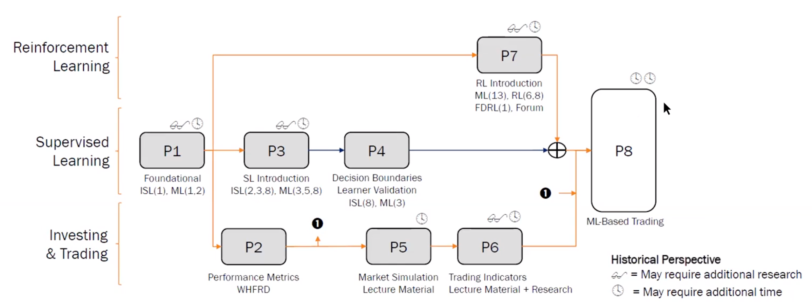

## Overall review

Given my prior experience in ML, I pair this course with [IIS](https://omscs.gatech.edu/cs-6035-introduction-to-information-security). My intention in taking this course is to reduce my learning curve in future courses:

* Python refresher (Pandas, Numpy, Scipy, Matplotlib)
* Academic writing with [LaTeX](https://www.latex-project.org/) with [JDF](https://github.com/iamjakewarner/jdf) format.
* Get introduced to Reinforcement Learning.

Personally, in the end it is not so much about the code itself for the projects but the methodology and how you structure your code.

The surprising bit was the finance knowledge was quite useful, I started to observe more information on yahoo/google finance, and observe how different stocks moves when the snp500 moves. It also provided me insight as to why during company earnings or news can result massive stock movements in a very short period of time. Overall I would say my take back is more on the finance side rather than the programming side.

But, if this is your first ML course and first encounter with LaTeX, I would say its a great introduction to ML and academic writing!

## Time requirements

I would say 10-15 hours per week is fair, more so when working on the projects and especially writing the reports. 

If you have experience in python (numpy/pandas) most projects can be finished within a couple of days less project 3 and 8 (those have the most significant weights as well).

## M1 Mac

I had no issues with using M1 Mac for the projects, although emulation is required since you are using Rosetta.
## Lectures

In terms of python / Machine learning
  * Cleaning / using financial data.
  * How to structure your dataframes.
  * Various python libraries.
  * Various Learning algorithms (ML).
  * Bagging, Boosting, Ensembling.
  * Q Learning / Dyna.
  * How to build a ML/RL model for trading

In terms of financial knowledge :
* Sharpe Ratio,
* Beta $\beta$, Alpha $\alpha$ of a stock,
* CAPM,
* Efficient market hypothesis, 
* Efficient frontier, 
* Options 
* Trading technical indicators,
* How hedge fund works.


## Quiz & Surveys

Quizzes had 2 attempts each, while surveys is mainly participation. Each contributes 2% to the final grade.
## Exams 

There are two exams with equal weightage. The midterm had 30 questions while the final had 25 questions. The exam had an overall weight of 25%.

Re-watching the lectures is largely unnecessary, for notes I used:

> * [teapowered notes by George Kudrayvtsev ](https://teapowered.dev/assets/ml4t-notes.pdf)
> * [ocsms notes - ML4T](https://www.omscs-notes.com/machine-learning-trading/welcome/)
{: .prompt-tip }

For mid terms prep, probably sufficient to do the sample midterm and understand the content above. 

For finals, I find that the question bank has alot of dubious questions and/or wrong answers. Luckily there was this [quizlet](https://quizlet.com/348217964/ml4t-questions-4-rating-3-votes-flash-cards/) that provided a filtered set of questions.


## Projects


[All project requirements can be found here.](https://lucylabs.gatech.edu/ml4t/) Altogether they provide the remaining 71% grade.

> * Make sure you hit all requirements and be as explicit as you can.
> * Have buffer whenever possible, such as run time.
> * There were students who gotten 0 for the entire assignment (e.g 100% is graded on the report but if you did not submit your code you get 0)
> * The regrading process will probably not be done until the final project grades is out.
{: .prompt-danger }

In addition, the projects are mostly related to one another. During TA office hours, the TA(s) shared this particular slide to show how they are related:



### Project 1 - MARTINGALE

The first project is called [martingale](https://en.wikipedia.org/wiki/Martingale_(betting_system)) which is to analysis an american roulette wheel. The project is to get you familar with statistics, running simulations and experiments and draw conclusions. It also tries to get you to generate plots as well as writing the report in jdf format.

> Spoilers: The [math](https://www.reddit.com/r/AskStatistics/comments/br5r4p/what_is_the_probability_of_winning_80_within_1000/) may be of interest!
{: .prompt-info }

A report of max 7 pages is required.

### Project 2 - OPTIMIZE SOMETHING

Project 2 is basically an exercise where you learn how to read in financial data with pandas and then try to formulate an optimal portfolio with [scipy optimize](http://docs.scipy.org/doc/scipy/reference/generated/scipy.optimize.minimize.html).

Basically, a linear programming problem where you have an objective function and constraints.

The report just requires a chart to show the optimal portfolio.
### Project 3 - ASSESS LEARNERS

Project 3 requires you to implement:

* Decision / Random trees
* Bagging (they call this bag learner)
* Boosting (Optional)
* "insane" learner which is a combination of bag learner and linear regression learner that they provided

The project then requires you to study the different learners under different situations, and whether there is signs of under/over fitting.

> * The gradescope testing does not tell you the output files, so i suggest the output files to be super explicit. E.g they should start with figure_xxx.png
> * Somehow I got penalized very significantly but based on my own testing the files are there, just with different starting names. I did not manage to get a regrade back since it did not affect my final letter grade.
> * Be very specific on where the under or over fitting occurs.
{: .prompt-warning }

A report of max 7 pages is required.

### Project 4 - DEFEAT LEARNERS

Project 4 builds on top of 3, where you are required to "break" your algorithms by creating datasets that strongly favors one algorithm over the other. If you understand the math behind regression and decision trees, this should not take you more than one night.

A report is *not* required! :smile:
### Project 5 - MARKETSIM

Project 5 requires you to build a market simulator, where given a csv of orders, to execute it and report the portfolio metrics.

> * Please watch the youtube videos
> * It is a good idea to reproduce the example results provided in the project brief.
{: .prompt-info }

A report is *not* required! :smile:
### Project 6 - INDICATOR EVALUATION

There are two parts of the project, the first part of the project requires you to explore various technical indicators.

> * Strongly suggest using SMA/Price and BBP % at the very least
> * Have your functions output a single vector/column
> * Parameterize all values your technical indicators can take in your function
> * This will significantly save your time.
{: .prompt-tip }

The second part of the project requires you to calculate a a Theoretically Optimal Strategy portfolio where you can peak into the future price.

A report of max 10 pages is required.
### Project 7 - Q-LEARNING ROBOT

This is mostly a standalone project to use reinforcement learning. I did not use it in the final project.

I do have some testing code I wish to share:

* Adding seed and log it to a print output in the test script provided:
  
    ```python
    # At the start of the script...
    my_np = np.random.randint(0,2**32-1)
    robot_qlearning_testing_seed = my_np
    # At the function...
    print(f"My current seed is {robot_qlearning_testing_seed}")
    ```
* This helps you to run 4 tests at a time, for 2000 times and outputs to `testxxxx.txt`
    ```bash
    N=4
    (
    for j in $(seq 1 1 2000) 
    do
    echo "Running $j time" &
    ((i=i%N)); ((i++==0)) && sleep 1 && wait
    PYTHONPATH=../:. python grade_robot_qlearning.py > test$(printf %04d $j).txt &
    done
    )
    ```
* And using any text searcher, in my case I am using [the sliver searcher](https://github.com/ggreer/the_silver_searcher) to sniff out test cases that failed:

    ```bash
    ag "seconds ====" | grep "seconds ===="  | sort | grep fail | grep test
    test0675.txt:131:===================== 1 failed, 10 passed in 9.39 seconds ======================
    test0867.txt:131:===================== 1 failed, 10 passed in 8.25 seconds ======================
    test1238.txt:131:===================== 1 failed, 10 passed in 8.10 seconds ======================
    test1578.txt:131:===================== 1 failed, 10 passed in 8.25 seconds ======================
    test1672.txt:131:===================== 1 failed, 10 passed in 8.37 seconds ======================
    ```

A report is *not* required! :smile:

### Project 8 -  STRATEGY EVALUATION

With the technical indicators you build in project 6, the last project requires you to use these indicators and build:

* Manual strategy with hand crafted rules.
* A model either utilizing random forest or reinforcement learning.
  * I mainly used RF since I intend to take the RL in the future.

> * During my semester there were a good bunch of students who got F grade (or even 0) for their final project.
> * In my case, I failed 3 tests cases that took 50 seconds (limit 25) but when testing in my machine it was 12 seconds and I manage to pass the test cases.
> * I implemented grid search within the learn evidence method. Luckily in my context none of my other testing rubrics had issues so I only gotten a -3 penalty.
> * **Overall, I'll suggest to keep things as simple as possible.**
{: .prompt-danger }

A report of max 10 pages is required.

### Extra credit

I did not attempt the extra credit for this project, largely because it significant work for 2 % and I was better of focusing on the last project and making sure I am not missing out any rubrics.