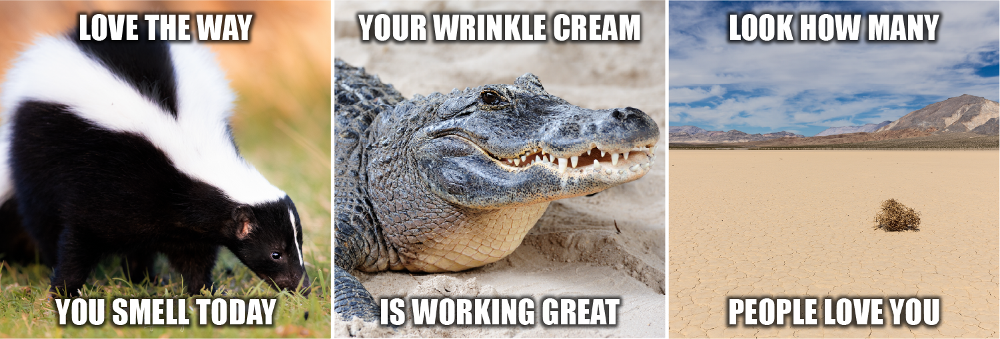

## Overall review

Given the recent rise of LLMs, I decided to switch the order of my courses and take deep learning as soon as I can (I originally intended to do Machine Learning first). I took this course along with [Computer Networks](../gt-cn). 

Overall, the has taught me quite a few things:

* Computational Graph and how it applies to Neural Network and back propagation.
* "Vanilla", Convolutional, Recurrent, Long short term memory, and transformer Neural Networks. 
  * As well as the motivating factors and their architectures
* A deeper understanding of PyTorch.

The module also ~~forces~~ encourages you to read relatively recent research papers, including the famous paper [attention is all you need](https://arxiv.org/abs/1706.03762), and required to implement some of their algorithms in the assignments.

Generally I find the course to be one of the better ones (**but extremely time consuming and can be quite excruciating at times** :smile:) and would recommend it! As an aside, the course also had Meta office hours but I did not attend (nor) watch any of them due to the lack of time.

> Access to GPU will be significantly beneficial, especially for two assignments (A2 & A4) as well as potentially the group project depending on your scope! The course staff does provide tips/guidances on using Google Colab. 
> 
> When I took the course, they also provided GPU resources from Georgia Tech's lab that students can use (it was the first semester they  did it so your mileage may vary)
>
> Personally, I setup my own Deep Learning rig for [reasons explained in a separate post!](../deep-learning-rig).
{: .prompt-tip}

## Lectures & Quizzes

The entire course is being split up to 4 modules, with each module being split up to multiple lessons.For more information about each lesson, feel free to refer to [my notes](../gt-dl-notes/). Each lesson also might have some recommended readings as well! (One of the quizzes had materials directly from the readings)

|Module|Description|
|:--|:--|:--|
| Module 1:   Introduction to Neural Networks| Lesson 1: Linear Classifiers and Gradient Descent   Lesson 2: Neural Networks   Lesson 3: Optimization of Deep Neural Networks   Lesson 4: Data Wrangling  
|Module 2:   Convolutional Neural Networks| Lesson 5: Convolution and Pooling Layers   Lesson 6: Convolutional Neural Network Architectures   Lesson 7: Visualization   Lesson 8: Scalable Training   Lesson 9: Advanced Computer Vision Architectures   Lesson 10: Responsible AI and Bias and Fairness
|Module 3:   Structured Neural Representations| Lesson 11: Introduction to Structured Representations   Lesson 12: Language Models   Lesson 13: Embeddings   Lesson 14: Neural Attention Models   Lesson 15: Neural Machine Translation   Lesson 16: Advanced Topics: Translation at Facebook and Automated Speech Recognition (ASR)  
|Module 4:   Advanced Topics|Lesson 17: Deep Reinforcement Learning   Lesson 18: Unsupervised and Semi-Supervised Learning   Lesson 19: Generative Models  |

Approximately a few days before the quiz starts, the TA team will give a list of topics to focus on, be sure to watch out for them!

|Quiz|Lessons|
|:--|:--|
|Quiz one| Covers L1, L2|
|Quiz two| Covers L3, L5|
|Quiz three| Covers L6, L7, L9|
|Quiz four| Covers all of module 3|
|Quiz five| Covers all of module 4|

> The quizzes are quite brutal and sometimes can be a bit of a memory work. The general consensus (or my opinion) is that the quizzes are used to separate the B and the As. It is reasonable to get close to 95% for all the assignments and group project based on the Median scores published.
> 
> Also, the quizzes increases in difficulty, it is highly encouraged for you to do as well as you can for the first few quizzes! Having said that, each quiz only contributes to 3.75% of your final grade.
{: .prompt-info}

There will be 4 Assignments and 1 Group Project, for each assignment there are generally 2 deliverables

* Code
  * This will be assessed by Gradescope
* Report, which consists of a few things
  * Some Deep Learning Math related questions
  * Explain certain results based on your Code (such as choice of parameters, choice of architecture etc)
  * Paper review

More information can be found in the later sections!

> The lecture materials gives you a very "high level" idea of the various things, but they do not necessarily help you to finish the assignments.
> 
> For the assignments, you are better off watching the (recorded) office hours, or find your own learning materials.
{: .prompt-tip}

Each assignment is worth 15% while the Group project is worth 20%.

## Time requirements

Based on omscentral, the workload is estimated to be approximately 20 hours, I would say that is probably a little bit of understatement. Both the projects and assignments are a huge time sink. For example for A4, I probably spent over 60 hours on it.

### Preparation Materials    

These are the preparation materials that were recommended. 

* [Deep Learning book by Ian Goodfellow and Yoshua Bengio and Aaron Courville](https://www.deeplearningbook.org/)
* [Matrix Calculus you need for deep learning](https://explained.ai/matrix-calculus/)

Extra Materials

* [Matrix Calculus Summary](http://www.ee.ic.ac.uk/hp/staff/dmb/matrix/calculus.html)
* [Matrix Calculus cookbook (full of formulas and derivations)](https://www.math.uwaterloo.ca/~hwolkowi/matrixcookbook.pdf)

If you like to front load before the semester, the TAs suggested that:

1. Read the [Linear Algebra section of the book](https://www.deeplearningbook.org/contents/linear_algebra.html)
2. Read the [probability and information theory of the book](https://www.deeplearningbook.org/contents/prob.html)
3. [Coursera - Math for ML: Linear Algebra](https://www.coursera.org/learn/linear-algebra-machine-learning?specialization=mathematics-machine-learning)
4. [Coursera - Math for ML: Multivariate Calculus](https://www.coursera.org/learn/multivariate-calculus-machine-learning?specialization=mathematics-machine-learning)

### Student Notes

* [Deep Learning notes by Monzersaleh](https://monzersaleh.github.io/GeorgiaTech/CS7643_DeepLearning.html) 
* [My own deep learning notes!](../gt-dl-notes/)

## Assignments

As mentioned, all assignments come with paper reviews as well as some mathematical questions. The mathematical sections are relatively straight forward (since it is open book).

### Assignment 1

For the coding section, You will be implementing basics Neural Network (by hand, using numpy) on the MNIST dataset.
* This includes forward pass & back propagation.
  * Various "neurons" such as ReLU, Softmax, Sigmmoid etc
* Loss function / Objective function
  * Cross entropy, Accuracy etc
* Optimizer using SGD (stochastic gradient descent)
  * Including regularization

You will also be required to conduct a few experiments including hyperparameter tuning and visualize your learning curves / findings.

### Assignment 2

In assignment two, it is all about convolutional neural networks!

In the first part of the assignment, you will code CNN using numpy to perform forward and back propagation, this includes:

* Convolutional layer
* Max Pooling layer
* ReLU (from a CNN perspective)

You will also need to take care of other parameters, such as striding or kernel size.

These three resources helped me significantly 

* [Stanford cs231 for CNN](https://cs231n.github.io/convolutional-networks/)
* [Medium article - Convolutions and backpropagations](https://pavisj.medium.com/convolutions-and-backpropagations-46026a8f5d2c)

As well as this youtube video:



In the second part of the assignment, you will implement the same things but with PyTorch! I felt that this part of the assignment was more to gain familiarity of PyTorch more than anything else. You will also be required to implement a loss function with pytorch based on one of the research papers.

### Assignment 3

Starting from assignment3, you will no longer need to calculate/implement back propagation! (Thank goodness!)

In assignment3, you will be implementing methods to visualize CNNs to understand how CNNs learn, as well as [style transfer](https://en.wikipedia.org/wiki/Neural_style_transfer). You will also be trying out ways that you can fool the CNNs (something like "hacking" the model by providing it with the exact pixels it is looking for)!

I found assignment3 to be the easiest and least time consuming! 

### Assignment 4

The last assignment is all about sequences! 

You will be implementing 
* RNN, 
* LSTM, 
* Seq2Seq 
* transformer models (both the encoder and decoder)

{: width='200' height='200'}
*The transformer architecture*

In the LSTM/RNN layers, you will also be asked to alter them with attention! You will also explore other transformer related algorithms, such as:

* Multi-head self attention
* Attention masks 
* Embeddings (BERT)

In the final part of the assignment, you will attempt to train a translation model to translate German to English. You will compare them with Seq2Seq against transformers!

## Group Project

For the group project, me and my group mates decided on this project provided by meta - [Hateful Memes Challenge on harmful multimodal content](https://ai.meta.com/blog/hateful-memes-challenge-and-data-set/). We mainly wanted to get more experience with Multi Modal problems as well as generative models / large language models. 

On top of reproducing the results from the research paper (such as MMBT, VisualBert), we explored other approaches such as [LLava](https://llava-vl.github.io/) as well as [CLIP](https://openai.com/research/clip).

In retrospective, I might have picked something easier (or more manageable), the learning curve was very steep, and the existing frameworks/models can be quite daunting to understand. In addition, my PC was 24/7 running models for 2 weeks :sweat_smile:. However I am still happy with how it turned out, I learnt a few things about [hugging face](https://huggingface.co/) and a little about multi modal models :smile:!
