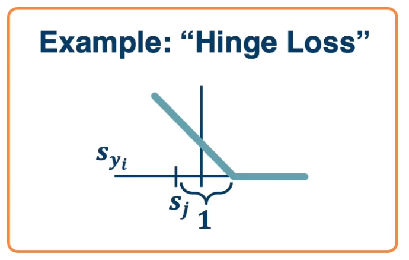
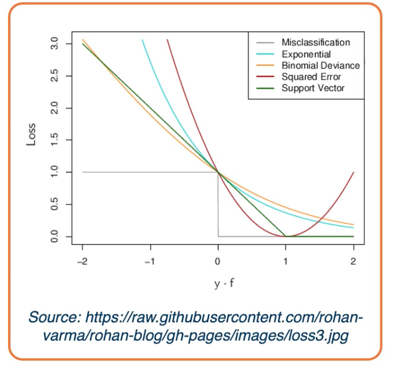
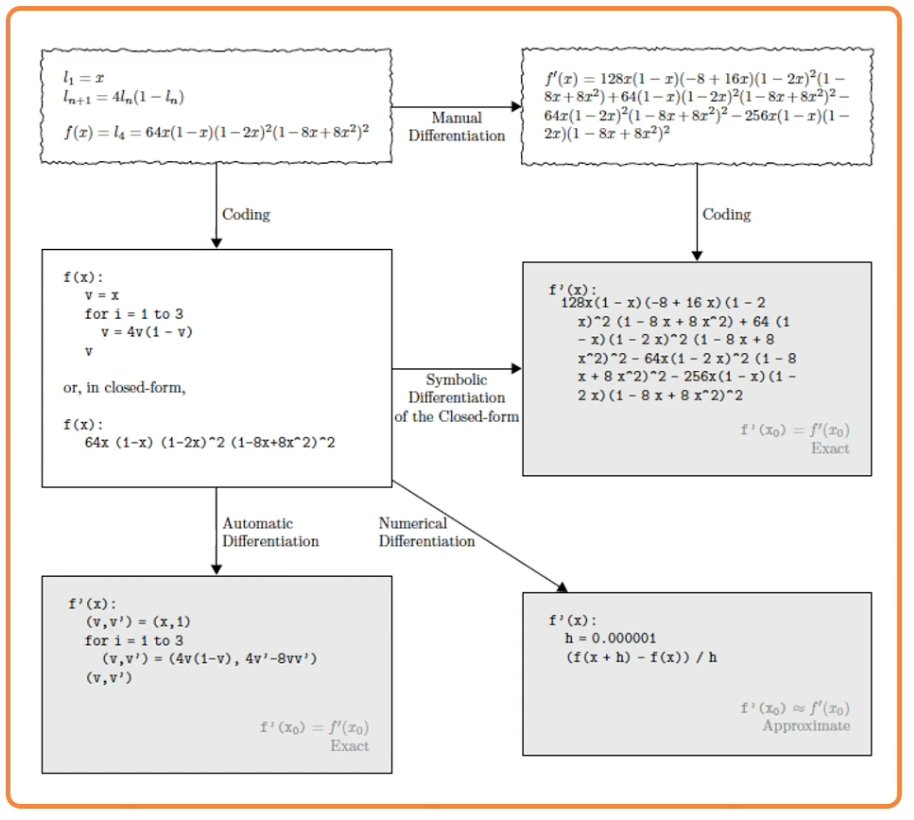
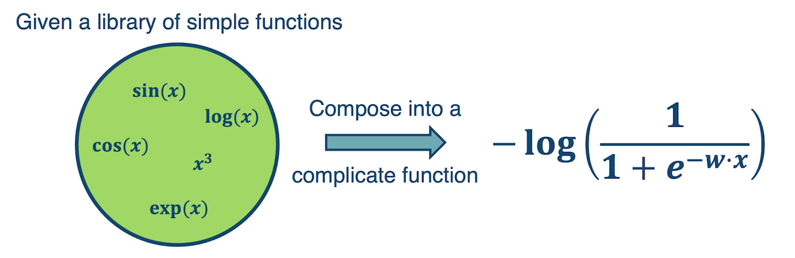
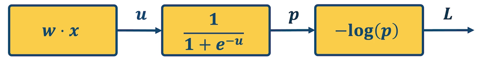
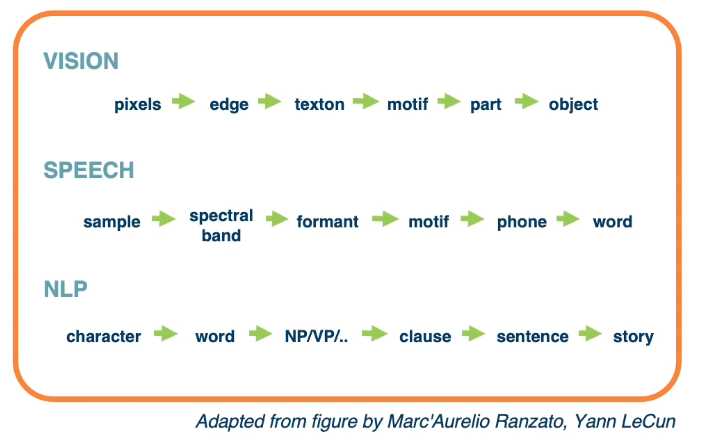

### Readings

*  [DL book: Linear Algebra background](https://www.deeplearningbook.org/contents/linear_algebra.html)
*  [DL book: Probability background](https://www.deeplearningbook.org/contents/prob.html)
*  [DL book: ML Background](https://www.deeplearningbook.org/contents/ml.html)
*  [LeCun et al., Nature '15](http://ieeexplore.ieee.org/stamp/stamp.jsp?reload=true&arnumber=1056774)
*  [Shannon, 1956](http://www.nature.com/nature/journal/v521/n7553/pdf/nature14539.pdf)

### Performance Measure

For a binary classifier:

$$
y =
\begin{cases}
1,  & \text{if $f(x,w)$ > 0} \\
0, & \text{otherwise}
\end{cases},
f(x,W) = W * x + b
$$

But we often want **probabilities**, we can use **softmax**:

$$
s = f(x,W) \tag{Scores}
$$

$$
P(Y=k|X=x) = \frac{e^{s_k}}{\sum_j e^{s_j}} \tag{Softmax}
$$

We need a performance measure to **optimize** known as the **objective** or **loss function**. Given a set of examples ${(x_i,y_i)}^{N}_{i=1}$, the loss can be defined as:

$$
L = \frac{1}{N} \sum L_i (f(x_i,W),y_i)
$$

For example, the SVM loss has the form:

$$
\begin{aligned}
L_i &= \sum_{j\neq y_i}
\begin{cases}
0, & \text{if $s_{y_i} \geq s_j +1$} \\
s_j - s_{y_i} + 1, & \text{otherwise}
\end{cases} \\
&= \sum_{j\neq y_i} max (0, s_j - s_{y_i} + 1)
\end{aligned}
$$

For a particular data point $x_i, y_i$, if the model is accurate, then $s_{y_i}$ will be large and $s_j$ will be small. This will make $max (0, s_j - s_{y_i} + 1)$ be equal to 0 (there is no loss). This is called a **hinge loss**.

{: width="400" height="400"}

For example:

|cat| 3.2|1.3|2.2|
|car| 5.1|4.9|2.5|
|frog|-1.7|2.0|-3.1|

In the case of the cat:

$$
\begin{aligned}
L_{cat} &= \sum_{j\neq y_i} max (0, s_j - s_{y_i} + 1) \\
&= max(0,5.1-3.2+1) + max(0, -1.7, -3.2 + 1) \\
&= max(0,2.9 ) + max(0, -3.9) \\
&= 2.9 + 0 \\
&= 2.9
\end{aligned}
$$

We can see that in this case the model thinks that the car is most likely even though the truth is cat. This contributed a loss of 2.9. In the case of cat versus frog, there is a score of 0 since the model thinks it is most likely a cat instead of a frog.

If we use the softmax function to convert scores to probabilities, the right loss function to use is **cross entropy**:

$$
L_i = - log P(Y=y_i|X=x_i)
$$

This can be derived from various ways:

*  **KL divergence** - looks at distance between two probability distributions. 
* **Maximum Likelihood Estimation** - Choose probabilities to maximize the likelihood of the observed data.

Back to the cat example:

$$
\underbrace{\begin{pmatrix}
3.2 \\ 5.1 \\ -1.7
\end{pmatrix}}_{\text{Unnormalized logits}}
\overset{\mbox{exp}}{\longrightarrow}
\underbrace{\begin{pmatrix}
24.5 \\ 164 \\ -0.18
\end{pmatrix}}_{\text{Unnormalized probabilities}}
\overset{\mbox{normalize}}{\longrightarrow}
\underbrace{\begin{pmatrix}
0.13 \\ 0.87 \\ 0.00
\end{pmatrix}}_{\text{Unnormalized probabilities}}
$$

So, $L_{cat} = - log(0.13)$.

There are other forms of loss functions, such as:

In the case of a regression problem:

* L1 loss : $L_i = \|y-Wx_i\|$
* L2 loss : $L_i = \|y- Wx_i\|^2$

For probabilities:

* Logistics: $L_i = \|y-Wx_i\| = \frac{e^{s_k}}{\sum_j e^{s_j}}$

We can also add **regularization** to the loss function to prefer different models over others based on the complexity of the model. For example in L1 regularization: $L_i = \|y-Wx_i\|^2 + \|W\|$.

{: width="400" height="400"}

### Linear Algebra View

$$
W = \begin{bmatrix}
w_11 & w_12 & ... & w_1m & b1 \\
w_21 & w_22 & ... & w_2m & b2 \\
     &      & \ddots &   &    \\
w_c1 & w_c2 & ... & w_cm & bc \\
\end{bmatrix}_{c \times (d+1)},
X = \begin{bmatrix}
x_1 \\ x_2 \\ \vdots \\ x_m \\ 1
\end{bmatrix}_{(d+1) \times 1}
$$

Where:
* $c$ is the number of classes
* $d$ is the dimensionality of input

Conventions:
* size of derivatives for scalars, vectors and matrices: 
  Assume we have scalar $s \in \mathbb{R}^1$, vector $v \in \mathbb{R}^m$ i.e. $v = [v_1, v_2, ..., v_m]^T$ and matrix $M \in \mathbb{R}^{k \times l}$, 
* What is the size of $\frac{\partial v}{\partial s}$?
  * $\mathbb{R}^{m\times 1}$ - column vector of size m
  $[\frac{\partial v_1}{\partial s}, ... , \frac{\partial v_m}{\partial s}]^T$
* What is the size of $\frac{\partial s}{\partial v}$?
  * $\mathbb{R}^{1\times M}$ - row vector of size m
  $[\frac{\partial s}{\partial v_1}, ... , \frac{\partial s}{\partial v_m}]$
* What is the size of $\frac{\partial v^1}{\partial v^2}$?
  * A matrix called a **Jacobian** with each index as $\frac{\partial v_i^1}{\partial v_j^2}$
* What is the size of $\frac{\partial s}{\partial M}$
  * A Matrix with each index as $\frac{\partial s}{\partial m_{[i,j]}}$
  * all the elements in the matrix essentially give sus the partial derivastive of the scalar with respect to each element in the matrix.
* What is the size of $\frac{\partial L}{\partial W}$? Note, this is the partial derivative of the loss with respect to the weights W.
  * Remember that loss is a *scalar* and *W* is a matrix, and the Jacobian is also a matrix, thus:

$$
\begin{bmatrix}
\frac{\partial L}{ \partial w_{11}} & \frac{\partial L}{ \partial w_{12}} & ... & \frac{\partial L}{ \partial w_{1m}} & \frac{\partial L}{ \partial b_1} \\
\frac{\partial L}{ \partial w_{21}} & \frac{\partial L}{ \partial w_{22}} & ... & \frac{\partial L}{ \partial w_{2m}} & \frac{\partial L}{ \partial b_2} \\
\vdots & \vdots & \ddots & \vdots & \vdots \\
\frac{\partial L}{ \partial w_{c1}} & \frac{\partial L}{ \partial w_{c2}} & ... & \frac{\partial L}{ \partial w_{cm}} & \frac{\partial L}{ \partial b_c}
\end{bmatrix}
$$

As mentioned, gradient descent works in batches of data. These are referred to as matrices or tensors (multi-dimensional matrices)..

Examples:
* Each instance of a vector of size m, our batch is of size $[B\times m]$
* Each instance is a matrix (e.g grayscale image) of size $W \times H$, our batch is $[B \times W \ times H]$
* Each instance is a multi-channel matrix (e.g color image with RGB channels) of size $C \times W \ times H$, our batch is $[B \times C \times W \times H]$
  
**Jacobians becomes tensors which is complicated**
* Instead, flatten input into a vector and get a vector of derivatives.
* This can also be done for partial derivatives between two vectors, two matrices or two tensors.

$$
\begin{bmatrix}
x_{11} & x_{12} & \cdots & x_{1n} \\
x_{21} & x_{22} & \cdots & x_{2n} \\
\vdots & \vdots & \ddots & \vdots \\
x_{n1} & x_{n2} & \cdots & x_{nn} \\
\end{bmatrix}
\overset{\mbox{flatten}}{\longrightarrow}
\begin{bmatrix}
x_{11} \\ x_{12} \\ \vdots \\ x_{21} \\ x_{22} \\ \vdots \\ x_{n1} \\ \vdots \\ x_{nn}     
\end{bmatrix}
$$

### Gradient descent

Given a model and loss function, finding the best set of weights is a **search problem**, which is to find the best combination of weights that minimizes our loss function. Several classes of methods can be used:

* Random Search
* Genetic Algorithms (population-based search)
* Gradient-based optimization

In deep learning, **gradient-based methods are dominant** although not the only approach possible. 

The key idea is **as weights change, the loss changes as well**. We cna therefore think about **iterative algorithms** that can take the **current values of weights and modify them** a bit.

The **derivative** is defined by

$$
f'(a) = lim_{h \rightarrow 0} \frac{f(a+h)-f(a)}{h}
$$

Intuitively, steepest descent direction is the **negative gradient** and **intuitively** measures how the function changes as the argument a changes by a small step size. In **machine learning** we want to know how the **loss function** changes **as weights** Are varied. We can consider each parameter separately by taking **partial derivative** of loss function with respect to that parameter.

This idea can be turned into an **algorithm (gradient descent)**

* Choose a model: $f(x,W) = Wx$
* Choose loss function: $L_i = \|y-Wx_i\|^2$
* Calculate partial derivative for each parameter: $\frac{\partial L}{\partial w_j}$
* Update the parameters: $w_j = w_j - \frac{\partial L}{\partial w_j}$
* Add learning rate to prevent too big of a step: $w_j = w_j - \alpha \frac{\partial L}{\partial w_j}$

Often, we only compute the gradients across a small subset of data

* Full Batch Gradient Descent: $L = \frac{1}{N}\sum L(f(x_i,W),y_i)$
* Mini-Batch Gradient Descent $L = \frac{1}{M}\sum L(f(x_i,W),y_i)$
  * Where $M$ is a subset of data
* We iterate over mini-batches
  * Get mini-batch, compute loss, compute derivatives, and take a step. The mini-batch can be sampled randomly or taken iteratively.
  * Another thing to note we often average the loss across the mini batches and therefore your gradients also get averaged across the size of the mini batch.
  * This is to prevent large changes in the learning rate if your batch size changes, so if you choose a batch size of 32 examples to calculate the loss over, but then the next day choose 128 examples, then you'll be taking much larger steps and you'll have to change the learning rate or tune their learning rate again. 

Gradient descent is **guaranteed to converge** under some conditions:

* For example, learning rate has to be appropriately reduced throughout training
* It will converge to a **local** minima
  * small changes in weights **would not** decrease the loss
* It turns out that some of the local minima that it finds in practice (if trained well) are **still pretty good!**

We know ow to compute the **model output and loss function** and there are several ways to compute $\frac{\partial L}{\partial w_i}$:

* Manual differentiation
  * Often labour intensive and in some cases cannot really compute the closed form solution.
* Symbolic differentiation
  * Only work for some classes of functions and is also labour intensive
* Numerical differentiation
  * Can do for any function but it is very computationally intensive.
* Automatic differentiation
  * Deep learning frameworks mostly use automatic differentiation
  
An Example:

For some functions, we can analytically derive the partial derivative, example:

$$
f(w,x_i) = w^T x_i, Loss = (y_i-w^Tx_i)^2
$$

Assume $w$ and $x_i$ are column vectors, so same as $w \cdot x_i$. Then the update rule: 

$$
\begin{aligned}
w_j &= w_j - \eta \frac{\partial L}{\partial w_j }\\
&= w_j + 2\eta \sum_{i=1}^N (y_i - w^T x_i) x_{ij} 
\end{aligned}
$$

Proof:

$$
\begin{aligned}
L &= \sum_{i=1}^N (y_i - w^T x_i)^2 \\
\frac{\partial L}{\partial w_j} &= \sum_{i=1}^N \frac{\partial}{\partial w_j} (y_i - w^T x_i)^2 \\
&= \sum_{i=1}^N 2(y_i - w^T x_i)\frac{\partial}{\partial w_j}(y_i - w^T x_i) \\
&= -2 \sum_{i=1}^N (y_i - w^T x_i) \frac{\partial}{\partial w_j}(w^T x_i) \\
&= -2 \sum_{i=1}^N (y_i - w^T x_i) \frac{\partial}{\partial w_j} \sum_{k=1}^m w_kx_{ik} \\
&= -2 \sum_{i=1}^N (y_i - w^T x_i) x_{ij}
\end{aligned}
$$

If we add a **non linearity (sigmoid)**, derivation is more complex:

$$
\begin{aligned}
\sigma(x) &= \frac{1}{1+e^{-x}} \\
\sigma'(x) &= \sigma(x)(1-\sigma(x))
\end{aligned}
$$

Then:

$$
\begin{aligned}
f(x) &= \sigma \bigg(\sum_k w_kx_k \bigg) \\
L &= \sum_i \bigg( y_i - \sigma \big(\sum_k w_kx_k \big)\bigg)^2 \\
\frac{\partial L}{\partial w_j} &= 2 \sum_i \bigg( y_i - \sigma \big(\sum_k w_kx_k \big)\bigg)\bigg( -\frac{\partial}{\partial w_j} \sigma\bigg( \sum_k w_k x_{ik}\bigg)\bigg) \\
&= -2 \sum_i \bigg( y_i - \sigma \big(\sum_k w_kx_k \big)\bigg)\sigma'\bigg(\sum_k w_k x_{ik}\bigg) \frac{\partial}{\partial w_j} \sum_k w_kx_{ik}\\
&= \sum_i -2\delta_i \sigma(d_i)(1-\sigma(d_i))x_{ij}
\end{aligned}
$$

where:

* $\sigma_i = y_i-f(x_i)$
* $d_i = \sum w_kx_{ik}$

So the sigmoid perception update rule:

$$
\begin{aligned}
w_j &= w_j + 2\eta \sum_{i=1}^N \delta_i \sigma_i (1-\sigma_i)x_{ij} \\
\sigma_i &= \sigma \bigg( \sum_{k=1}^m w_kx_{ik}\bigg) \\
\delta_i &= y_i - \sigma_i
\end{aligned}
$$

Now if you noticed, even analytically deriving the partial derivative of the loss with respect to particular parameters, for a pretty simple simple function, a sigmoid of a linear function is actually not that nice. Wht we want to do is rather than have to by hand derive this partial derivative, we are going to try to simplify the problem. We are going to decompose the complicated function into modular sub blocks, and this will allow us to develop a generic algorithm that can work on these sub blocks to derive the partial derivative.

So given a library of simple functions, including addition, subtraction, multiplication, sin, cosin, log and exponential, we are going to compose it into a more complicated function, for example negative log of sigmod function. This is just the typical logistic machine learning algorithm and so what we are going to do is decompose that complex function into a set of modular sub blocks. 

Under the left side, we have the innermost part of the function, w transpose x, that gets output into an intermediate variable u, which goes into the next sub block which is, again the logistic or sigmoid function. That gets output into another immediate variable p, and then we compute the negative log of p, which is our loss function and that is the final output of the model. 

This will allow us to develop a generic algorithm to perform the differentiation that we want which is the partial derivative of the loss with respect to intermediate variables here. For example we may want the partial derivative of the loss with respect to $u$, or at the end we want the partial derivative of the loss with respect to $w$ because that is ultimately what gradient descent wants to update. 

### How is deep learning different?

#### Hierarchical Compositionality
  
* Cascade of non-linear transformations
* Multiple layers of representations 

For example:

{: width='400' height='400'}

This can be done by linear combinations $f(x) = \sum_i \alpha_i g_i (x)$ or composition functions $f(x) = g_1(g_2(...(g_n(x))))$. They key is we can use any of this as long as the function is differentiable.

#### End-to-End learning
  
* Learning (goal-driven) representations
* Learning feature extraction

Entire spectrum from raw data to feature extraction to classification.

#### Distributed Representations

* No single neuron "encodes" everything
* Groups of neurons work together

<!--  -->
