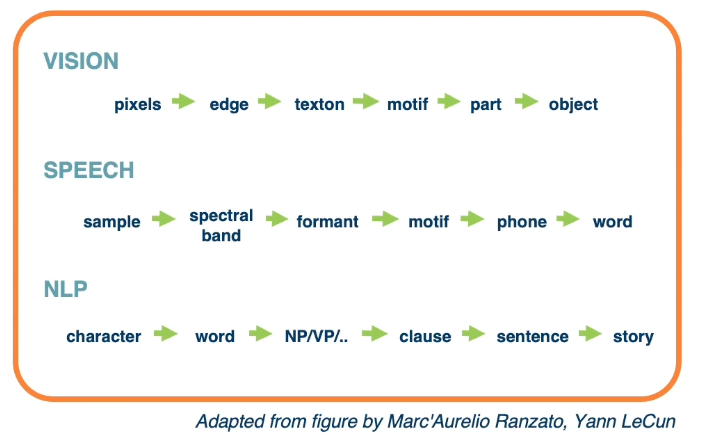
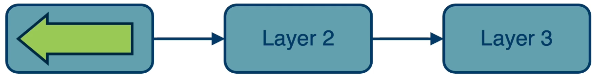
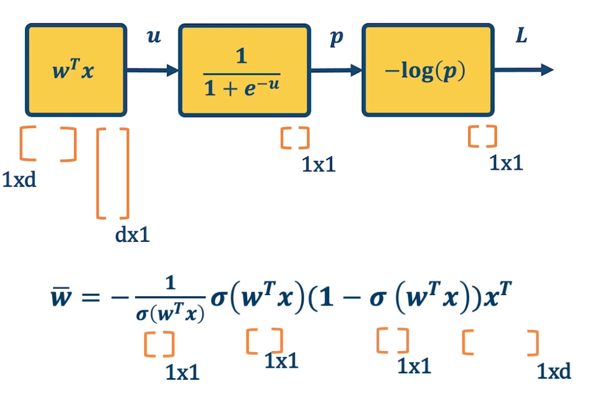

### Readings

* [DL book: Deep Feedforward Nets](https://www.deeplearningbook.org/contents/mlp.html)
* [Automatic Differentiation Survey, Baydin et al.](https://arxiv.org/abs/1502.05767)
* [Matrix calculus for deep learning](https://explained.ai/matrix-calculus/index.html)

### Neural Network View of a linear classifier

A **linear classifier** can be broken down into: 

* input
* a function of the input
* a loss function

It is all just one function that can be **decomposed** into building blocks:

{: width="400" height="400"}

A simple **neural network** has similar structure as our linear classifier:

* A neuron takes inputs (firing) from other neurons (-> input into linear classifier)
* The inputs are summed in a weighted manner (-> weighted sum)
  * Learning is through a modification of the weights (gradient descent in the case of NN)
* If it receives enough inputs, it "fires" (if it exceeds the threshold or weighted sum plus bias is high enough)

{: width="400" height="400"}

The output of a neuron can be modulated by a non linear function (e.g sigmoid).

We can have **multiple** neurons connected to the same input:

{: width='200' height='200'}

Note, often in these visual depictions, you do not see the activation function. it is assumed that each node in the output layer contains both the weighted sum and the sigmoid activation.

* Each output node outputs the score for a class.
    $$
    f(x,W) = \sigma(Wx+b) = \begin{bmatrix}
    w_{11} & w_{12} & \cdots & w_{1m} & b_1 \\
    w_{21} & w_{22} & \cdots & w_{2m} & b_2 \\
    w_{31} & w_{32} & \cdots & w_{3m} & b_3 \\
    \end{bmatrix}
    $$
* Often called fully protected layers (also called a linear **projection layer**)
* Each input/output is a **neuron (node)**
* A linear classifier is called a **fully connected** layer. 
* Connections are represented as **edges**
* Output of a particular neuron is referred to as **activation**
* This will be expanded as we view computation in a neural network as a **graph**.

With this, it is possible to **stack** multiple layers together where the input of the second layer is the first layer. The middle layers are also known as **hidden** layers and will see that they end up learning effective features. This **increases** the representation power of the function, and two layered networks can represent any continuous function.

{: width='400' height='400'}

The same two layered neural network **corresponds to adding another weight matrix**, as seen above as $W_1$ and $W_2$. **Large (deep) networks** can be built by adding more and more layers, and three-layer networks can represent **any function**. 
  * However, the number of nodes could grow unreasonably (Exponential or worse) with respect to the complexity of the function.
  * So it is not clear how to learn such a function and the weights, as well as the architecture of the neural network.

### Computation Graph

Our goal is to generalize our viewpoint of multi-layered neural networks as computation graphs. Functions can be made **arbitrarily complex** (subject to memory and computational limits).

$$
f(x,W) = \sigma(W_5\sigma(W_4\sigma(W_3\sigma(W_2\sigma(W_1x)))))
$$

We can use **any time of differentiable function (layer)** as well. The reason to use a differentiable function is to be able to use gradient descent to optimize these functions. At the end, **add the loss function**.

Composition can have **some structure**! Empirical and  theoretical evidence that it makes **learning complex functions easier**. Note that **prior state of the art engineered features** often had this compositionality as well.

{: width='400' height='600'}

The key with deep learning is to employ this compositionality through the architecture of the neural network.

* we are learning **complex models** with significant amount of parameters (millions or billions).
* If so, how do we compute the gradients of the **loss** (at the end) with respect to internal parameters?
* Intuitively, want to understand how **small changes** in weight deep inside **Are propagated** to affect the **loss function** at the end.

To develop a general algorithm for this, we will view the function as a **computation graph**. Graph can be any **directed acyclic graph (DAG)**; it can have any structure as long as there are no cycles. 
  * Modules must be differentiable to support gradient computations for gradient descent. 

A *training algorithm** will then process this graph, **one module at a time**, to calculate the singular value that we want, which is the change in loss with respect to parameters of that module. 

Here is an example of the computational graph notion (note that this might not be the only possible representation):

{: width='400' height='400'}
* The function $f(x_1,x_2) = ln(x_1) + x_1 x_2 - sin(x_2)$ as a graph*

The most important thing are the edges so that we know which order when we compute the function forward.

To repeat, any arbitrarily complex function can be decomposed in this manner and this will become clear in the next few lessons.

{: width='400' height='400'}

### Backpropagation

Backpropagation allows us to compute the important gradient information that we need for gradient descent when we have a deep neural network. 

Given this computation graph, where we decompose a complicated function into its constituent parts, the training algorithm will perform the following computation:

{: width='200' height='200' }

* Calculate the current model's output (called the **forward pass**)
  * So in the diagram, will feed in the input of $h^{\ell-1}$ which is the layer before this model. Then will compute whatever function that this modules performs. For example $W^Tx$ and so it could have some parameters. Although note that some modules may not have any any parameters. Then we will be able to compute $h^\ell$ which is the output of this module.
* Calculate the gradients for each module (called the **backward pass**)

The backward pass is a recursive algorithm that:
* Start at **loss function** where we know how to calculate the gradients. (We seen examples in Lesson1)
* Progresses back through the modules. We do this by passing back key pieces of information in the form of gradients.
* Ends in the **input layer** where we do not need gradients (no parameters)

{: width='400' height='400'}
*Note, sometimes we call them modules, sometimes layers.*

#### Forward Pass (Step 1)

First, compute loss on mini-batch: forward pass
* E.g calculate L1, pass the output to L2, and repeat again to L3.
* Note that we must store the intermediate outputs of all layers because we will need it in the backwards computation to **compute the gradients**
  * The gradient equation will have terms with the output values in them.

{: width='200' height='200' }

In the **backward pass**, we seek to calculate the gradients of the loss with respect to the module's parameters. So take a generic module any point in the computation graph, we will have three different terms here. 

* Partial derivative of the loss with respect to the input of the module $\frac{\partial L}{\partial h^{\ell -1}}$
* Partial derivative of the loss with respect to our output, $\frac{\partial L}{\partial h^{\ell}}$
* Partial derivative of the loss with respect to our weights: $\frac{\partial L}{\partial W}$

For gradient descent, this is the key thing that we need, we need to know how the loss changes, no matter where it is. A particular module may not be connected to that loss function, it may go through a whole series of other modules afterwards and then be connected to a loss function. But we still need to know in the end, how the loss will change at the end if we change our parameters within this module. 

* We are going to assume in this recursive algorithm is that we have the gradient of the loss with with respect to the **module's outputs** (given to us by upstream module). This is the change in loss with respect to $h^\ell$
* Also going to pass the gradient of the loss with respect to the **module's input**.
  * This is not required for update the module's weights, but passes the gradients back to the previous module. (This is really just passing back information so the previous layer also can calculate this gradient)

Problem:

* We can compute the local gradients as the input changes or the change in output as the weights change. This is because we know the actual function this module computes, for example $W^Tx$.
  
  $$
  \bigg\{ \frac{\partial h^\ell}{\partial h^{\ell-1}}, \frac{\partial h^\ell}{\partial W} \bigg\}
  $$
* We are given: $\frac{\partial L}{\partial h^\ell}$
  * This is from the assumption
* Compute the change in loss with respect to our weights in order to perform gradient descent and take a step in the weights. In other words, update the weight through the negative gradient. We also need to compute the change in loss with respect to our inputs. This is not required for the gradient descent update for this particular module but it is required so we can pass this gradient to the previous module.

  $$
  \bigg\{ \frac{\partial L}{\partial h^{\ell-1}}, \frac{\partial L}{\partial W} \bigg\}
  $$

Recall that we can compute the local gradients $\\{ \frac{\partial h^\ell}{\partial h^{\ell-1}}, \frac{\partial h^\ell}{\partial W} \\}$. This is just the **derivative of our function** with respect to its parameters and inputs! 

For example, if $h^\ell = Wh^{\ell-1}$, then $\frac{\partial h^\ell}{\partial h^{\ell-1}} = W$ and $\frac{\partial h^\ell}{\partial W} = {h^{\ell-1}}^T$.

Now, we want to compute: $\\{ \frac{\partial L}{\partial h^{\ell-1}}, \frac{\partial L}{\partial W} \\}$, we need to use chain rule! 

{: width='400' height='400'}

Zooming in to the particular module: 

{: width='200' height='200' }

**Gradient of loss w.r.t. inputs**: $\frac{\partial L}{\partial h^{\ell-1}} = \underbrace{\frac{\partial L}{\partial h^\ell}}_{\text{given}} \frac{\partial h^\ell}{\partial h^{\ell-1}}$

**Gradient of loss w.r.t. weights**: $\frac{\partial L}{\partial W} = \frac{\partial L}{\partial h^\ell} \frac{\partial h^\ell}{\partial W}$

#### Backward Pass (Step 2)

{: width='400' height='400'}

We start at the loss function where we actually know how to compute the gradient of the loss with respect to this module. This is just the exercise that we did earlier where we had a classifier that is directed connected to the loss. We just compute the change in loss with respect to the inputs of the function or with respect to the parameters. So we will compute the gradients with respect to the parameters to perform gradient descent and then we will compute the gradient of the loss with respect to our inputs in order to send this back to the previous layer. 

{: width='400' height='400'}

And now the previous layer knows how the loss changes if its output changes and it uses the chain rule to compute how does the loss change if our inputs change, and how does the loss change if our weights or parameters change. Similarly, it will then pass back that upstream gradient to the first layer. 

{: width='400' height='400'}

And again, the first layer can compute the change in loss way at the end of the computation graph with respect to its own parameters. In this case, it does not really need to send back any gradients because there is no previous layer. 

#### Update all parameters (step 3)

Use **gradient** to update **all parameters** at the end. 

And then, once we have these terms the change in loss with respect to all the weights for all the layers, we are just going to use gradient descent. We pdate the weights by subtracting the gradient going into the negative gradient direction multiplied by some learning rate. 

$$
w_i = w_i - \alpha \frac{\partial L}{\partial w_i}
$$

So, Backpropagation is just the application of gradient descent to a computation graph via the chain rule. 

### Backpropagation and Automatic Differentiation

Backpropagation tells us to use the chain rule to calculate the gradients, but it does not really spell out how to **efficiently** carry out the necessary computations. But the idea can be applied to **any directed acyclic graph (DAG)**.
* Graph represents an **ordering constraining** which paths must be calculated first.

Given an ordering, we can then iterate from the last module backwards, **applying the chain rule**.
* We will store, for each node, its **gradient outputs for efficient computation**
  * Such as the activations for the forward pass as well as the gradient outputs. 

This is called reverse-mode **automatic differentiation**
* The key idea here is that we will decompose the function into very simple primitive functions where we already know what the derivatives are.

#### Computation = Graph

* Input = Data + Parameters
* Output = loss
* Scheduling = Topological ordering (defined by the graph)

**Auto-Diff** (Auto differentiation)
* A family of algorithms for implementing chain rule on computation graphs. 

An example: 

{: width='200' height='200'}

We want to find the **partial derivative of output f** with respect to all **intermediate variables**.
* Assign some intermediate variables such as $a_1 = sin(x_2)$ and $a_2 = x1 \times x2$ and $a_3$ is the final output.
* To simplify notation, denote $\bar{a_3} = \frac{\partial f}{\partial a_3}$
  * In gradient descent as well as in these examples, you want the partial derivative of the output, the final output of the function with respect to all the intermediate variables. The intermediate variables in a machine learning computation graph will be the weight matrices. 
* Start at the **end** and move backwards.

One thing to note is gradient from multiple paths have to be accounted for, and the way we do this is by just summing them up together. So in the case of $\bar{x_2}$ there is path 1 and path 2. This makes intuitive sense since if we want to understand how the change in $x_2$ affects the final output of the function, we need to basically propagate it across all paths that occur from it to that function.

One interesting thing that we can notice as we analyze this is that different operations have different effects on the gradient.

{: width='400' height='400'}

For example, in the addition operation, we will notice that $\bar{a_1}$ and $\bar{a_3}$ is the same. This is because the plus operation is actually a **gradient distributor**. It takes the partial derivative of $f$, the function output with respect to it and distributes it back across all the paths. 

{: width='400' height='400'}

Multiplication, on the other hand, does something different with the gradients. $\bar{x_2} = \bar{a_2}x_1$. So it is the upstream gradient times the other inputs. Where else $\bar{x_1} = \bar{a_2}x_2$ which is the same thing but in reverse. So multiplication operation is a **gradient switcher**, it multiplies it by the value of the other term.

Why is this important? Gradients are the key things that gradient descent work on. If the gradients have a particular property such as they become too small or become degenerate, then learning will not happen. So one of the key considerations that we will use as we design these computation graphs for machine learning is how gradients flow back through the entire computation graph or model that we will have. This is a key piece of information that we will want to analyze and understand in order to ensure that the model is going to be learning properly. 

There are **several other patterns** as well, 

{: width='200' height='200'}
* The gradient is passed back through the original path taken*

Max operation **selects** which path to push the gradients through.
* Gradient flows along the path that was "selected" to be the max
* This information must be recorded in the forward pass.

The **flow of gradients** is one of the **most important aspects** in deep neural networks. So for example in the example of $max(5,1) = 5$, we need to remember we used the left side. So when we pass back the gradient, we only pass through that particular element that was selected to be the maximum.

* If the gradients **do not flow backwards properly**, learning slows or stops!

#### Key Idea

{: width='400' height='400'}

* Key idea is to **explicitly store computation graph** in memory and **corresponding gradient functions**. For example the derivative of sine is cosine. 
* **Nodes** broken down to **basic primitive computations** (addition, multiplication, log, ...) for which **corresponding derivative is known.**

#### Forward mode automatic differentiation

{: width='400' height='400'}

There is also something called forward mode automatic differentiation. This is computing exactly the same terms that we want, which is the partial derivative of the function output with respect to all the intermediate variables. Unlike reverse mode automatic differentiation that has a forward pass and backward pass. Here we start from **inputs** and propagate gradients forward. So we have many forward passes one for each input. The complexity is proportional to input size because run forward across each input. 

In deep learning, most of the times **inputs** (images) are large and **outputs** (loss) are small. 

One of the powerful things about automatic differentiation is it allows deep learning frameworks to basically build out these computation graphs as we code. So frameworks like pytorch runs this generic algorithm that works on any computation graph.

{: width='400' height='400'}
*This is an older version of pytorch which is more complex*

The last line computes the backwards gradient all in one line of code.

* Computation graphs are **not limited to mathematical functions**
* Can have **control flows** (if statements, loops) and **backpropagate** through **algorithms**!
* Can be done **dynamically** so that **gradients are computed**, then **nodes are added, repeat**.
* Concept is called **differentiable programming**

### Computation Graph example for logistic regression

* Input $x \in \mathbb{R}^D$
* Binary label $y \ in \\{-1,+1\\}$
* Parameters $w \in \mathbb{R}^D$
* Output prediction: $p(y=1\|x) = \frac{1}{1+e^{-w^Tx}}$
* Loss $L = \frac{1}{2} \lVert w \rVert^2 - \lambda log(p( y \lvert x))$

{: width='400' height='400'}

$$
\begin{aligned}
\bar{L} &= 1 \\
\bar{p} &= \frac{\partial L}{\partial p} = - \frac{1}{p}
\end{aligned}
$$

where $p = \sigma(w^Tx)$ and $\sigma(x) = \frac{1}{1+e^{-x}}$

$$
\begin{aligned}
\bar{u} &= \frac{\partial L}{\partial u} = \frac{\partial L}{\partial p}\frac{\partial p}{\partial u } = \bar{p}\sigma(w^Tx)(1-\sigma(w^Tx))\\
\bar{p} &= \frac{\partial L}{\partial w} = \frac{\partial L}{\partial u}\frac{\partial u}{\partial w} = \bar{u}x^T
\end{aligned}
$$

We can do this in a combined way to see all the terms together:

$$
\begin{aligned}
\bar{p} &= \frac{\partial L}{\partial p} \frac{\partial p}{\partial u}\frac{\partial u}{\partial w}\\
 &= - \frac{1}{\sigma(w^Tx)} \sigma(w^Tx)(1-\sigma(w^Tx))x^T \\
 &= - (1-\sigma(w^Tx))x^T
\end{aligned}
$$

This effectively shows the gradient flow along path from $L$ to $w$

### Vectorization and Jacobians of simple layers

{: width='400' height='400'}

The chain rule can be computed as a **series of scalar, vector, and matrix linear algebra operations**. These are **extremely efficient** in graphics processing units (GPU).

Lets take a look at specific neural network layer types and see what their matrices and vectors look like as well as the resulting gradients or jacobian. This is also the simple fully connected linear layer. 

{: width='300' height='300'}

We have $h^\ell = Wh^{\ell-1}$ which is the previous layer multiplied by $w$. 

* $h^\ell$ has dimension $\lvert h^\ell \rvert \times 1$
* $W$ has dimension $\lvert h^\ell \rvert \times \lvert h^{\ell-1} \rvert$
  * Note that each row of the matrix belongs to one classifier denoted as $w^T_i$
* $h^{\ell-1}$ has dimension $\lvert h^{\ell-1} \rvert \times 1$..

Now, lets take a look at the sizes of the Jacobians (or gradients).

On the left we have the local gradients the partial derivative of the output with respect to the input, which is just $w$ for linear layer. The partial derivative of the output with respect to one particular row in our $w$ matrix, which is equal to the output vector transposed. This is not actually what we need though, what we want is the partial derivative of the loss with respect to our input. We can use chain rule to compute this. 

This is equal to the partial derivative of the loss with respect to our output times the partial derivative of the output with respect to our input. This is what we get when we look at the particular sizes of these matrices and vector. The input vector $h^{\ell -1}$ is a column vector. So according to our convention, the partial derivative of a scalar the loss with respect to this column vector is a row vector of size one by the input dimensionality. This is equal to the partial derivative of the loss with respect to our output vector, which also ahs a size of row vector one by our output dimensionality. 

We then have the partial derivative of our output with respect to our input. This is a partial derivative of a vector with respect to another vector and so the resulting Jacobian is a matrix whose size is our output dimensionality by the input dimensionality. If you notice the size is all worked out and everything can be reduced into a series of vector to matrix or eventually matrix to matrix multiplications and this can be computed efficiently.  

In order to compute our partial derivative of the loss with respect to our weight matrix, we actually boil it down to a particular weight vector rather than doing the whole matrix itself. What we have is the partial derivative of the loss with respect to a particular row in the weight matrix. The row is $w_i$ which according to the last slide is a column vector. And so the resulting size, again, to our convention, is one by the input dimensionality, which is a row vector. This is equal to the chain rule, which is the partial derivative of the loss with respect to our output vector, whose size is again a row vector one by the output dimensionality.

We have the partial derivative of our output with respect to a particular row in the weight matrix. This is a Jacobian matrix but what is interesting is that it has a sparse structure. That is we are looking at a particular row of $w$ which actually affects a particular output node in the output vector. That is, a particular output node $h_i$, because all the other weight rows do not actually affect this particular node, output node $h_i$, all the Jacobians are actually zero expect for that particular row which is equal to the partial derivative of $h^\ell$ with respect to $w_i$. 

If we did the partial derivative of the output which is a vector with respect to the entire $w$ matrix, you will have a partial derivative of a vector with respect to a matrix and that is a tensor. We wish to avoid that complexity. It is interesting to note that there is this sparse structure inside the partial derivative of the output with respect to each row in the weight matrix.   

#### Other Functions

As previously mentioned, we can employ **any differentiable (or piecewise differentiable function)**. A common choice is the **Rectified Linear Unit (ReLU)**.
* The ReLU provides non-linearity but better gradient flow than sigmoid so it is preferable over the sigmoid.
* It is also performed element wise. So the function is $h^{\ell} = max(0, h^{\ell-1})$.
  * This is not quite differentiable, because there is a discontinuity, but it turns out that there are sub gradients here. We can essentially just take the gradient as being if it is to the left, then zero. If it is exactly to the right, then one. If it is exactly zero, then we can just choose either left or right.
* **How many** parameters for this layer?
  * The answer is none! It is just taking a max operation and so there are no parameters here. 

Now, lets take a look at the Jacobians of gradients for this layer. 

The forward pass is just $max(0,h^{\ell-1})$.

The backward pass can be computed using the chain rule. But if you remember, the max function funnels gradients through the selected max. So the gradient will be zero if the output is $\leq 0$. You can view this as if it is picking the zero part as the maximum then it is not going to funnel the gradients at all, it will have zero gradients.

The full Jacobian of the ReLU is actually large. Its input dimensionality by output dimensionality and actually both dimensionality are the same. However,

* It is **sparse**
* Only **diagonal values non-zero** because it is element-wise.

Max Function **funnels gradient through selected max**
  * Gradient will be **zero** if input $\leq 0$
  * This is because an output value is affected only by the corresponding input values. Intuitively, you can think of this as a particular input dimensionality, and $h^{\ell-1}$ only affects the same dimension of the output. It does not affect any of the other ones. And so the non-diagonal entires will all be 0. In other words, changing the particular input dimensionality will have no effect on those outputs. So this is going to be the final Jacobian.

$$
\frac{\partial h^\ell}{\partial h^{\ell-1}} =
\begin{cases}
1,  & \text{if $h^{\ell-1}$ > 0} \\
0,  & \text{otherwise}
\end{cases}
$$

<!--  -->
