### Readings

* [DL book: Regularization for Deep Learning](https://www.deeplearningbook.org/contents/regularization.html)
* [DL book: Optimization for Training Deep Models](https://www.deeplearningbook.org/contents/optimization.html)

### Optimization of Deep Neural Networks Overview

A network with two or more hidden layers is often considered a **deep** model. 

Now **depth** is important for various reasons.
* Structure the model to represent an inherently compositional world.
* Theoretical evidence that it leads to parameter efficiency. 
* Gentle dimensionality reduction (if done right)

The world is compositional, we have characters and words and paragraphs and documents in NLP. Or we have object shapes and object parts and scenes in computer vision. So the better that your model reflects this nature or structure in the world, the easier it will be to learn. In other words, you will require less data to learn this function. There are some theoretical evidence that leads to parameter efficiency. For example, there are some functions where if you learn them using a two layered neural network, you will need exponentially more nodes to learn this function than if you just had a three layered neural network. That is, adding **depth** gives you some parameter efficiency. And as we know in machine learning, dimensionality reduction is crucial. We often start with very high dimensional data such as images or text and what we want to do is gently reduce this dimensionality in order to slowly pick out more and more abstract capable features that are more discriminative for our target classes. 

---


There are still many design decisions that must be made (and this can make or break your model): 
* Architecture.
  * Often makes learning much easier and need less labeled data``
* Data Considerations 
  * In ML we know normalization is important.
* Training and Optimization
  * Starting with millions or parameters, and we want to start some smart Initialization.
* Machine Learning Considerations.
  * Bias vs variance, over fitting etc. We usually have more parameters than data.

We must design the **neural network architecture**:

* What **modules (layers)** should we use?
  * For example in CV we want different layers compared to NLP.
  * In reality alot of these layers are shared across many applications. 
  * Yet there are still specialized transformations specific to tasks, such as geometric transformation for CV.
* How should **they be connected together**?
  * How the gradient should flow backwards and some can bottle neck the gradient flow?
* Can we use our **domain knowledge** to add architectural biases?


Lets take a look at some example architectures:


* **Fully Connected Neural Network**
  * Take an input such as an image, convert it to a vector and  feed it through a series of linear and nonlinear transformation. There are hidden layers in the middle and these hidden layers are expected to extract more and more abstract features from high dimensional raw input data. We often reduce their dimensionality or size as we get deeper into the network. At the end, we have a layer that represents our class scores. We have a node that outputs a score for each class and then we combine these to produce probabilities to make our prediction. This architecture is not well suited for several things. For example, images have a lot of input pixels, lets say a million pixels and the number of parameters is equal to the number of input times the number of outputs for a particular layer. IF you think about it, we are not really leveraging the spatial structure in the images. And so they are better suited architectures called convolution neural networks. 
* **Convolution neural network**
  * Rather than tie each node into all pixels in the input, these will reflect only feature extractors for small local windows in the image, that is, will stride a local window across the entire image and each local window will have features extracted from it, such as little shapes, corners or circles or object parts such as eyes or car wheels. We will keep doing this such that at the end we will have features that represent where object parts or entire objects are located in the image. These will be fed to fully connected layers as classifiers. 
* **Recurrent Neural Network**
  * Another downside of fully connected layers is that they represent very fixed size inputs. And so for text where we do not know how many words we will have in a paragraph will actually build a dynamic neural network. We will have a layer for each word in the paragraph and the output of this layer will be dependent on both the input from previous layer that is the vector representing the sentence thus far and the new input that is the new word. 

The key point is different architecture are suitable for different applications or different types of input data and it is not always clear what architecture to apply. For example CNN were first developed for images but applied actually to sentences as well. Same for RNN but better architecture came along called transformers. 
 
Similar to traditional machine learning, and actually even more so in deep learning, **data** is key. So the first step in ML or DL is to really understand your data and go through it. There is also a bunch of design considerations, for example:

* How do we **pre-process** the raw high dimensional data?
* Should we **normalize** it?
* Can we **augment** our data by adding noise or other perturbations? 
 
Even given a good neural network architecture, we need a **good optimization algorithm to find good weights**.

* What **optimizer** should we use?
  * We talked about gradient descent, but really a specific form of gradient descent which is steepest gradient descent. If we take the negative of the gradient and multiply it by a learning rate, we are taking the direction that is the steepest direction towards the minimum.
  *  However, there are different optimizers make **different weight updates** depending on the gradients. 
     *  They still depend on gradients but they might depend on them differently. 
* How should we **intialize** the weights?
  * If you start very close to a local minima, getting close to it is not hard and maybe you do not need a great optimizer, just an okay one will be good enough.
  * However if your initialization is poorly behaved, then your learning will be much more difficult and you need a much better optimizer.
* What **regularizers** should we use?
* What **loss function** is appropriate?
  * Talked about cross entropy, RMSE, but there are lots of other things we can apply. We can even design specific loss functions for specific problem.

The **practice of machine learning is complex**. For your particular application you have to **trade off** all of the considerations together. 
* Trade off between **model capacity** (measured by number of parameters) and **amount of data**. 
  *  This is not a straight forward task and there is not really a lot of theory that tells you exactly what to do here.
  * Unfortunately in neural network you often want a high capacity, this is why neural networks have failed in the pass because researchers only tried low capacity networks.
*  Adding **appropriate biases** based on domain knowledge will make learning faster. 
   *  However this can be a double edge word if your domain knowledge turns out to be incorrect.

### Architectural Considerations

In this lesson, we will talk about architectural consideration and specifically, what types of non-linearities you should use. 

Determining what modules to use, and how to connect them is part of the **architectural design**
* Should be guided by the **type of data used** and its **characteristics** and your application.
  * Understanding your data is always the first step!
* Fortunately, there are **lots of data types (modalities)** already have good architectures that researchers that have already look at.
  * Start with what others have discovered is one of the key ways that you can speed up the deep learning process.
* **The flow of gradients** is one of the key principles to use when analyzing layers.
  * Backpropagation lives or dies by gradient.
  * You can have modules that accidentally bottleneck or stop gradient flow thats effective. 


Deep neural networks consist of a **sequence/combination** of linear and non linear layers. 

* Combination of **only** linear layers has the same representational power as one linear layer.
  * This is is because you can just take the $W$ matrix and multiply them together. 
* **Non-linear layers** are crucial.
  * They increase the representational power of DNN and they allow you to **perform complex transformations of the data.**
  *  This complexity comes at a cost, the gradient flow across non-linearities heavily depends on their shape. 

There are several aspects that we can analyze to see how a particular **non-linearity** will behave. We can take a look at:

* Min/Max
* Correspondence between input and output statistics. 
* **Gradients**
  * At initialization
    * For example, it depends on what the non-linearity looks like and specifically the derivative look like. In order to understand that when we have small weight values, how we initialize these weights, what will the actual gradients look like? Will it vanish? or explode?
  * At extremes
    * For example some gradients flatten out to be 0 at the end when you have large values fed into it. Others stay linear at all portions of the function. 
* Computational complexity 
  * Some piece-wise linear functions are super fast to compute because they're just max functions. Others require computing exponentials or division, and so those might be more complex. 


Lets look at some examples of **non-linearity** functions and their behavior:

#### sigmoid

{: width='400' height='400'}

* **Sigmoid**
  * Min 0, Max 1
  * Output is **always positive**
  * Saturates at **both ends**
  * gradients 
    * Vanishes at both end (converging to 0)
    * Always positive
  * **Computation: exponential term**

When we have an upstream gradient, and then we multiply that by the local gradient, the gradient of our function. Now if we received very high values as input, then our gradients are going to be very small, vanishingly small. This will cause issue for two reasons.

First, this partial derivative of the loss with respect to the weights, which is what we use to update the weight using gradient descent will become a very small number because you're multiplying a very small gradient by the upstream gradient. The worse issue is that we are also passing back the gradient, and the change in loss with respect to our inputs is what we pass back, and that is the upstream gradient for the previous module. If we pass back a small learning gradient, then the previous module will also have a lower learning rate essentially, and it won't learn very much. This **vanishing gradient problem** is not only one that is a problem for this module, but it accumulates as it goes backward.

Note that the fact that it is also minimum of 0 and maximum of 1 means that it can also explode going forward. So if we pass a higher value, meaning that we always pass positive values, so we keep passing higher values, and those higher values will then be fed into the next non-linearity potentially and become even larger if its the same non-linearity.

So, there are alot of issues with the sigmoid function, both going forward and backward. 

#### TanH

{: width='400' height='400'}

* **tanh**
  * Min -1, Max 1
    * **Centered**
  * Saturates at **both ends**
  * gradients 
    * Vanishes at both end
    * Always positive
  * Still somewhat Computationally heavily

Same shape as sigmoid but -1 to 1 which means it is a balanced or centered function. It can also provide negative outputs, meaning it can flip the sign of different features. However it is still saturated at both ends, so it has the same issue as sigmoid.

#### ReLU

{: width='400' height='400'}

* **ReLU**
  * Min 0, Max infinity
  * Output is **always positive**
  * **No saturation on positive end**
  * gradients 
    * 0 if $x \leq 0$ (dead ReLU)
    * Constant otherwise (does not vanish)
  * **cheap to compute (max)**

The gradient flow is much better as there is no saturation on the positive end. However, if it ls less than 0, the gradients are again 0 and this is an issue and have the issue what is called a dead ReLU which is a ReLU that has inputs coming to it with negative values and then it will not really learn anything because its gradients are 0. However notice that it is never the fact that there is only one ReLU tied to any input. You have inputs tied to many ReLUs and so those other ReLUs can maybe push the values of the inputs to become more positive. 

On the positive side of the curve, it is a constant gradient and so it does not vanish, which is a good thing. 

#### Leaky ReLU

{: width='400' height='400'}

* **leaky ReLU**
  * Min -infinity, Max infinity
  * Learnable parameter!
  * **No saturation**
  * gradients 
    * No Dead neuron
  * **cheap to compute (max)**

Leaky ReLU tries to address the dead ReLU problem. It is the same thing on the positive side but on the negative side it has a slight slope. You can even add a parameter to learn the slope. 

Whenever you want the neural network to have some flexibility to learn something beyond what you are actually programming in terms of the functions, then you should parameterize those functions so that it can have a little bit of flex and can learn those parameters. 

One thing you might notice that this is not a differentiable function, but it turns out to be actually ok. We can have what are called subgradient, which means as long as there is a finite number of components to the function that have gradients that we can compute, its fine. For example in this function if $f$ is $0$ we can choose either side in terms of computing the gradient. 

#### Conclusion

Unfortunately, **no one activation function is best** for all applications. 

* **ReLU** is most common starting point
  * sometimes leaky ReLU can make a big difference
* **Sigmoid** is typically avoided unless clamping to values from $[0,1]$ is needed.

### Initialization

In this lesson, we will talk about intelligent initialization of the parameters for DNN. This is important because if you initialize the weights to values that are degenerate in some way, for example for very close to bad local minima or lead to poor gradient flow during backward pass, then learning is not going to be effective. 

The parameters of our model must be **initialized to something**. 

* initialization is **extremely important**
  * It determines how the **statistics of our output** given the input behave behave. 
  * Determines how well **Gradients flow** in the beginning of training.
  * Could **limit use of full capacity** of the model if done improperly. 
* Initialization that is **close to a good (local minima)** will converge faster and to a better solution.

For example, if you initialize the weights such that the activations tend to statistically be large, and these large activations are fed to non-linearities such as the tnaH function, then you will start in the saturation range of these non-linearities which causes ineffective learning (or worse, none).

However, if you initialize your weights such that the inputs to these activations are actually very small values, you will be in the linear regime or close to it of these non-linearities in the space where the inputs are close to zero. Then you will have strong gradient to work with.

#### Poor initialization

Lets take a look at an example of bad initialization.


For example, initializing values to a constant value leads to a **degenerate solution**.

* What happens to the **weight updates?**
* Each node has the same input from previous layers so gradients **will be the same**
* As a result, **all weights will be updated** to the same exact values.

These are bad initialization unless for some reason you want the weight to move together. We will see applications of this later on.

#### Normal Initialization

A common approach is to initialize your model is using **small normally distributed random numbers.**

{: width='400' height='400'}

* E.g $N(\mu, \sigma), \mu = 0, \sigma = 0.01$
* **Small weights** are preferred since no feature/input has prior importance.
* Keeps the model within the **linear region of most activation functions**.

This is a very safe and reasonable approach that is still widely used.

**Deeper networks (with many layers) are more sensitive to initialization**

{: width='400' height='400'}
*As seen, layer 5 has activations has very small standard deviation but layer one has a larger standard deviation and a much smaller set of values*

* With a deep network, **activations (outputs of nodes) get smaller**
  * Standard deviation reduces significantly
* **Leads to small updates** - smaller values multiplied by upstream gradients
* Larger initial values lead to **Saturation**

Recall, if your non-linearity is tanh or sigmoid, then you will have gradients that are very small at the end and we don't want either too small or too large of values. We do not want this distribution to really change across the depth of the neural network. What we want to do is to finally balance this. Unfortunately, balancing this is not easy and it depends on specific modules you pick. 

#### Xavier Initialization

**Ideally, we'd like to maintain the variance at the output to be similar to that of input!**

{: width='400' height='400'}

Specifically, we do not want the variance to shrink as we get deeper into the network. There is no reason to start using a smaller variation or range of values in our activation outputs, which is what that means. We also do not want to increase the variance, we just want to maintain the variance to be the same at initialization. 

For example, this shows the activation functions across a range of different layers in a deep neural network using the Xavier initialization. You can see that unlike the previous plot across all the different layers, the distribution is very similar which is what we want. The derivation of the actual weight initialization so this condition is omitted, but it actually leads to a very simple initialization. 

What we do is we sample from a uniform distribution between a negative positive value.

$$
U\bigg(-\frac{\sqrt{6}}{\sqrt{n_j+n_{j+1}}}, + \frac{\sqrt{6}}{\sqrt{n_j+n_{j+1}}}\bigg)
$$

* Where $n_j$ is **fan-in** (number of input nodes)
* and $n_{j+1}$ is **fan-out** (number of output nodes).

This makes sense intuitively, because we are dividing by these values. For example if a particular node has a large number of inputs, then we probably want to tune down the weights, because we are summing up the weighted summation of the inputs. Conversely, if a node has very few inputs, then we may want to increase the weight. 

#### (Simpler) Xavier and Xavier2 Initialization

In practice, **simpler versions** perform empirically well:

$$
N(0,1) * \sqrt{\frac{1}{n_j}}
$$

* This analysis holds for **tanh or similar activations**
* Similar analysis for **ReLU activations** leads to:

$$
N(0,1) * \sqrt{\frac{1}{n_j/2}}
$$

Typically for each activation function you like to try, you need to do a similar analysis, either theoretical or empirical. In the case of ReLU, it is very similar to Xavier and infact it is called Xavier2 and more details can be found in the [paper](https://arxiv.org/abs/1502.01852). 

In summary, **Initialization matters!**

* Determines the **activation** (output) statistics, and therefore **Gradient statistics**
* If the gradients are **small*, no learning will occur and no improvement is possible.
* Important to reason about **output/gradient statistics** and analyze them for new layers and architectures. 

### Preprocessing, Normalization, and Augmentation

In deep learning, **data drives learning** of features and classifier.

* Its **characteristics** are therefore extremely important. 
* Always **understand your data**
* **Relationship** between output statistics, layers such as non-linearities, and gradients is important. 

{: width='400' height='400'}

Just like initialization, **normalization** can **improve gradient flow and learning**.

Typically, **normalization methods** apply:

* Subtract mean, divide by standard deviation (most common)
  * This can be done **per** dimensional
* Whitening, e.g through PCA (not common, and often not necessary)

We can try to come up with a layer that c an normalize the data across a network.

**Given**: A mini-batch of data $[\textbf{B} \times \textbf{D}]$ where $\textbf{B}$ is batch size,

Compute mean and variance for **each dimension $d$**:


Note that $\hat{x_i}$ denominator has a small $\varepsilon$ so that it does not blow up incase the variance is small. This part does not involve new parameters. 

* We can give the model flexibility through **learnable parameters $\gamma$ (scale) and $\beta$ (shift)**
* Network can learn to **not normalize** if necessary.
* This layer is called a **Batch Normalization (BN) layer**.

There are **some complexities of BN**:

During training, we compute mean and variance over your mini batch each iteration. So you are normalizing by a different amount each time because your number of samples might be small in each batch compared to large amount of data you have. So there is some noise in the estimation of the means and variances. 

However **during inference**, stored mean/variances calculated across the entire training set are used. So this means:

**Sufficient batch sizes** must be used to get stable per-batch estimates during training
* This is especially an issue when **using multi-GPU or multi-machine training**
* Use `torch.nn.SyncBatchNorm` to estimate batch statistics in these settings.

Normalization especially important before **non-linearities**.

{: width='400' height='400'}

Very low/high values (un normalized/imbalanced data) can cause **saturation**.

There are **many variations of batch normalization**, we will see some in CNN later.


### Optimizers

So far we only talked about SGD, namely steepest descent which is only one way to update the weights. We will talk about more sophisticated methods. 

Deep learning invovles **complex, compositional, non-linear functions**. This means that the **loss landscape** is extremely **non-convex** as a result. There is **little direct theory** and a **lot of intuition/rules of thumbs** instead. Some insight can be gained via theory for simpler cases (such as convex settings)

It used to be thought that **Existence of local minima is the main issue** in optimization. There are other **more impactful issues**:

* Noisy gradient estimates
  * Could be because we take mini batches of data
* Saddle points
* Ill-conditioned loss surface. 

#### Noisy gradients 

In practice, we use a **subset of the data at each iteration** to calculate the loss (and gradients).

This is actually an **unbiased** estimator, meaning that the expectation is equal to the true non-stochastic full batch value (value of the gradients if we just calculate them on our entire training set). However that is only on expectation, in reality we will have **high variance**.

This results in **noisy steps** in gradient descent. 


#### Loss surface Geometry

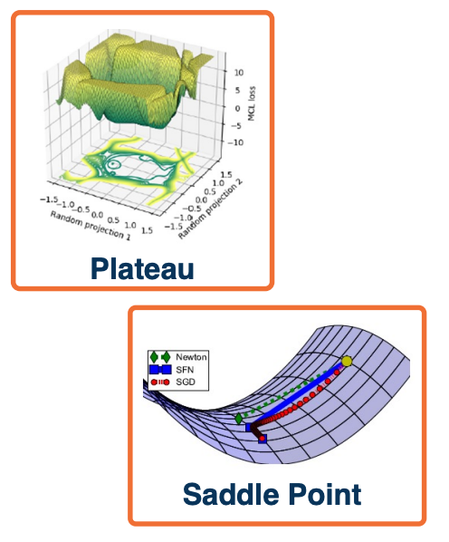{: width='200' height='200'}

Several **loss surface geometries** are difficult for optimization. 

**Several types of minima**: Local minima, plateaus, saddle points

**Saddle points** are those where the gradient of orthogonal directions are zero but they **disagree** (its min for one, max for another). In other words, its a minimum for one direction but a maximum for another. 

Saddle points are much more common in these high dimensional optimization problems that are induced by deep learning. 

#### Adding momentum

* Gradient descent takes a step in the **steepest direction** (negative gradient) $w_i = w_{i-1} - \alpha \frac{\partial L}{\partial w_i}$ doesn't necessarily behave very well in these saddle point regions. They will either get stuck or learn very slowly.
* **Intuitive idea***: Imagine a ball rolling down loss surface, and use **momentum** to pass flat surfaces.

Rather than just update the negative gradient, we first calculate a velocity term, where $v_0 = 0$ and $\beta$ starts at $0.99$. So Beta is almost like decaying your velocity and adding your current gradient. 

Your weights $w_i$ will then be updated by the velocity term and not by the local gradient that you have now. This can pop you out of local plateaus or saddle points as long as gradients remains in the same direction. 
  
$$
\begin{aligned}
   v_i &= \beta v_{i-1} + \frac{\partial L}{\partial w_{i-1}} & \text{(Update Velocity)}\\
   w_i &= w_{i-1} - \alpha v_i & \text{(Update Weights)}
\end{aligned}
$$

This is a generalization of SGD where $\beta = 0$.


#### Accelerated Descent methods

Velocity term is an exponential moving average of the gradient, notice the recurrent relationship:

$$
\begin{aligned}
v_i &= \beta v_{i-1} + \frac{\partial L}{\partial w_{i-1}}\\
&= \beta \bigg( \beta v_{i-2} + \frac{\partial L}{\partial w_{i-2}} \bigg) + \frac{\partial L}{\partial w_{i-1}}\\
&= \beta^2v_{i-2} + \beta \frac{\partial L}{\partial w_{i-2}} + \frac{\partial L}{\partial w_{i-1}}
\end{aligned}
$$

There is a **general class of accelerated gradient methods**, with some theoretical analysis (under certain assumptions) 


#### Equivalent Momentum Update

Another form can be re-written as (where $v_0 = 0$):

$$
\begin{aligned}
   v_i &= \beta v_{i-1} - \alpha \frac{\partial L}{\partial w_{i-1}} & \text{(Update Velocity)}\\
   w_i &= w_{i-1} - \alpha v_i & \text{(Update Weights)}
\end{aligned}
$$


#### Nesterov Momentum

Rather than combining velocity with current gradient, go along velocity **first** and then calculate gradient at new point since we know velocity is probably a **reasonable direction**

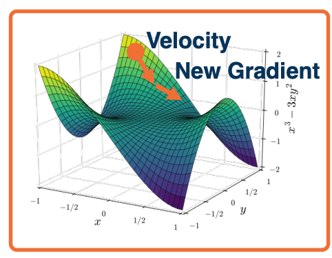{: width='400' height='400'}


$$
\begin{aligned}
  \hat{w}_{i-1} &= w_{i-1} - \beta v_{i-1} \\
   v_i &= \beta v_{i-1} - \alpha \frac{\partial L}{\partial \hat{w}_{i-1}} \\
   w_i &= w_{i-1} - \alpha v_i
\end{aligned}
$$

[Extra reference for this topic](https://medium.com/the-artificial-impostor/sgd-implementation-in-pytorch-4115bcb9f02c)


#### Hessian and loss curvature

* Various mathematical ways to **characterize the loss landscape**
* The jacobian (first order) only tells you the steepest direction but leads to some limitations such as what step size to take which is why we have things like learning rate.
* The hessian gives us information about the **curvature of the loss surface**

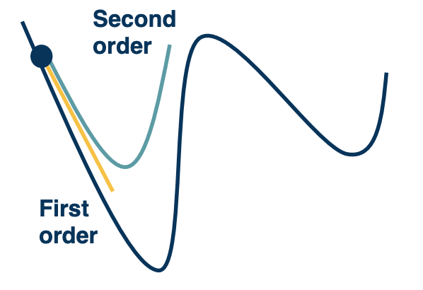{: width='400' height='400'}

(Remember where the second derivative tells you if its the maximum or minimum?)

We can use tricks like Taylor series expansion, we can actually perform a quadratic approximation of the loss surface around the current weights in the weight space. The advantage of this is that we can just jump directly to the minima of that approximation.

In practice these methods are not used very frequently thats because computing the hessian is expensive but actually things like momentum actually approximate this to some degree. 


#### Condition number 

**Condition number** is the ratio of the largest and smallest eigenvalue of the **Hessian** matrix.
* Tells us how different the curvature is along different dimensions.

If this condition number is high, that means that different directions actually point to very different curvatures. **SGD** will make big steps in some dimensions and **small** steps in other dimensions. This is a problem, because what you will have is what you see below:

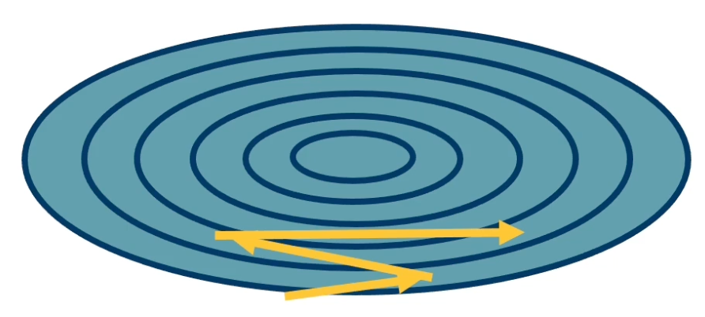{: width='400' height='400'}

You will have large jumps in certain directions because the curvature is very high and that means that along the directions that the curvature is not so high, you actually will not get very effective learning.

Second-order optimization methods divide steps by curvature, but expensive to compute. So we will look at alternative methods that are much more efficient. 

#### Per parameter learning rate

Have a dynamic learning rate for each weight, there are several flavors of **optimization algorthims**:

* RMSProp
* Adagrad
* Adam
* ...

**SGD can achieve similar results** in many cases but with much more tuning. Again certain methods works well under certain conditions or may not generalize as well as SGD plus momentum. However, SGD with momentum takes a lot of tuning to get it right. 
 
For most applications DL do pretty well without requiring tuning so that is why algorthims such as Adam are typically preferred to start with. 

#### Adagrad

Idea: Use gradient statistics to reduce learning rate across iterations. We are going to have a gradient accumulator $G_i$ which takes the previous accumulation plus our gradients squared. 

Now, when we perform a weight update, unlike doing the normal negative alpha times the gradient, which we do in the steepest gradient descent, we are going to divide the learning rate by the square root of $G_i$ plus some epsilon. What we are effectively doing is for each weight, basically toggling the learning rate down based on how much gradient or how strong the gradients are for that weight. And if you have some weights that have very strong gradients where very high curvature probably along that dimension, then we are going to tone down the learning rate. 

Where as if there are other weights that have smaller grading, then we are going have a smaller value in the denominator and then a higher effective learning rate. 

$$
\begin{aligned}
G_i &= G_{i-1} + \bigg( \frac{\partial L}{\partial w_{i-1}} \bigg)^2 \\
w_i &= w_{i-1} - \frac{\alpha}{\sqrt{G_i + \varepsilon}} \frac{\partial L}{\partial w_{i-1}}
\end{aligned}
$$

* **Denominator**: Sum up gradients across iterations
* Directions with **high curvature will have higher gradients** and learning rate will reduce.

However there is one problem with this, as gradients are accumulated $G_i$ gets bigger and bigger, the learning rate $\frac{\alpha}{\sqrt{G_i + \varepsilon}} $ will go to zero. 
#### RMSProp

**Solution**: Keep a moving average of the squared gradients! This does not saturate the learning rate - the gradient does not go to zero as the gradients $G_i$ accumulates higher and higher. 

$$
\begin{aligned}
G_i &= \beta G_{i-1} +  (1-\beta) \bigg( \frac{\partial L}{\partial w_{i-1}} \bigg)^2 \\
w_i &= w_{i-1} - \frac{\alpha}{\sqrt{G_i + \varepsilon}} \frac{\partial L}{\partial w_{i-1}}
\end{aligned}
$$

#### Adam

**Combine ideas** From RMSProp and Adagrad. **Maintains both first and second moment** statistics for gradients.

$$
\begin{aligned}
v_i &= \beta_1 v_{i-1} + (1-\beta_1) \bigg( \frac{\partial L}{\partial w_{i-1}}\bigg)\\
G_i &= \beta_2 G_{i-1} + (1-\beta_2)\bigg( \frac{\partial L}{\partial w_{i-1}} \bigg)^2 \\
w_i &= w_{i-1} - \frac{\alpha v_i}{\sqrt{G_i + \varepsilon}}
\end{aligned}
$$

The initial values for $v_i$ and $G_i$ typically start out as 0. So these are going to be pretty small values and you are going to update them using the current gradient at whatever initialization you start out with. Then you will essentially have this tiny gradient and these values will be very small. So you are multiplying alpha by some arbitrary small value and dividing by some arbitrary small value. Also, the $G_i$ is a squared term so it depends on what the gradient will be. In some cases it could be much higher or in some cases if its less than 1,then it will be lower.

In order to address this **instability**, we are going to do some time varying smoothing of these values such that in the beginning we will try to perform less biased estimates and then over time, we will just converge to these actual values that are shown here.

So, this is the **final Adam algorithm** with new terms $\hat{v} \text{ and } \hat{G}$.The purpose of these is really to stabilize the initial values. The **solution** will be a time-varying bias correction. Typically $\beta_1 = 0.9, \beta_2 = 0.999$.

$$
\begin{aligned}
v_i &= \beta_1 v_{i-1} + (1-\beta_1) \bigg( \frac{\partial L}{\partial w_{i-1}}\bigg)\\
G_i &= \beta_2 G_{i-1} + (1-\beta_2)\bigg( \frac{\partial L}{\partial w_{i-1}} \bigg)^2 \\
\hat{v_i} &= \frac{v_i}{1-\beta_1^t}\\
\hat{G_i} &= \frac{G_i}{1-\beta_1^t}\\
w_i &= w_{i-1} - \frac{\alpha \hat{v}_i}{\sqrt{\hat{G}_i + \varepsilon}}
\end{aligned}
$$

So $\hat{v}_i$ will be small number divided by (1-0.9 = 0.1) resulting in more reasonable values (and $\hat{G}_i$ larger). As $t$ increases then the denominator will become 1 and $\hat{v}_i$ will take their actual values, similar for $\hat{G}_i$.

One thing to note is that even though Adam changes the learning rate per parameter or weight, and actually still has some learning rate $\alpha$. So its not like you are escaping the fact that you still need to hyper parameter tune the learning rate.

#### Behavior of Optimizers

Optimizers behave differently **depending on landscape**. Different behaviors such as **overshooting, stagnating etc**.

**Plain SGD+momentum** can generalize better than adaptive methods, but require more tunning.

#### Learning rate schedules

First order optimization methods have **learning rates**

Theoretical results rely on **annealed learning rate**

**Several schedules that are typical:**
* Graduate student! (lol)
* Step scheduler
  * Change the learning rate say divided by 10 every few epochs or n epochs. 
* exponential scheduler
* Cosine scheduler
  * Continuously reduce and increase the learning rate up again works quite well in practice. You can think of this as popping the model out of that local minima to find maybe a better local minima. Then you can figure out which model gave you the best results and figure out which local minima was the most generalizable to the validation.

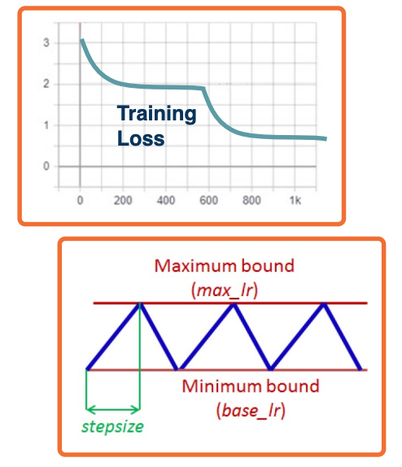{: width='400' height='400'}

### Regularization

Many **standard regularization methods** still apply!


* L1 : $L= \lvert y - Wx_i \lvert ^2 + \lambda \lvert  W \lvert $
  * L1 encourages sparsity - alot of values close to zero and only a few non zeros 
* L2 : $L = \lvert  y-Wx_i \lvert^2 + \lambda  \lvert  W \lvert ^2$ 
  * L2 encourages weights to be small 
* Elastic Net: $L = \lvert y - Wx_i \lvert ^2 + \alpha \lvert  W \lvert ^2 + \beta \lvert W \lvert$


#### Dropout

**Problem:** Neural network can learn to rely strong on a few features that work really well. 
* may cause **overfitting** if not representative of test data

**An idea:** For each node, keep its output with probability $p$.

So at each node, determine whether to keep the activations from that node or not. If I do not keep it, activations of deactivated nodes are essentially zero. So computing the forward and backward function is not affected by that node. 

In practice, it is implemented with a **mask** calculated each iteration:

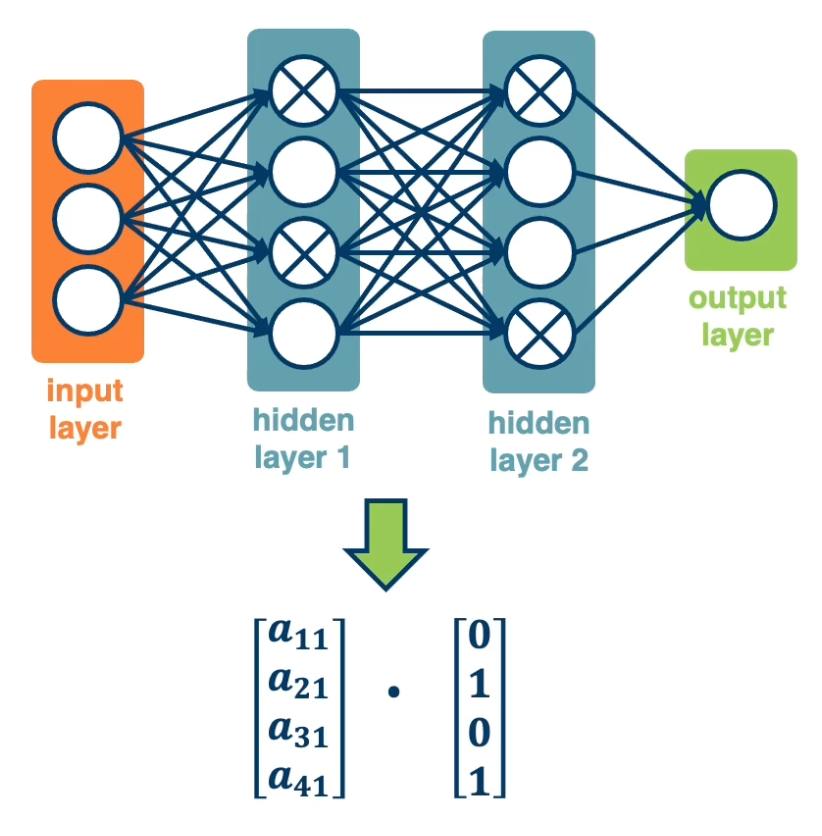{: width='400' height='400'}

During testing, no nodes are dropped (during testing all nodes are used).

However, this presents a problem:

* During training, each node has an expected $p \times \text{fan_in}$ nodes
* During test all nodes are activated.
* **Principle**: Always try to have similar train and test-time input/output distributions. 
* This violates the above principle, how?

**Solution:** During test time, scale outputs (or equivalently weights) by $p$.

* $W_{test} = pW$
* alternative: Scale by $\frac{1}{p}$ at train time.
  * Then during testing time you do not need to do anything else.

#### Why Dropout works

* **Interpretation 1**: The model should not rely too heavily on particular features. 
  * It it does, it has probability $1-p$ of losing that feature in an iteration.
  * During backpropagation, it will update the weights of other features. 
  * Equalizing the weights across all of the features such that it does not rely too heavily on any specific subsets.
* **Interpretation 2**: Training $2^n$ networks
  * That is, if you think about the number of masks that you can create, the number of configurations that there are for $n$ node neural network is $2^n$.
  * Most are trained with 1 or 2 mini batches of data.
  * Essentially having an ensembling effect - you are training many simpler networks (due to drop out) and trying to combine them together at the end.


### Data Augmentation

Performs a range of **Transformations** to the data. 
* This essentially "**increases**"your dataset.
* Transformations should not change meaning of the data (or label has to be changed as well)

* Flipping:
  * {: width='200' height='200'}
* Random Crop
  * Can also do it during testing
  * For example, average the probabilities over all of these different crops.
  * 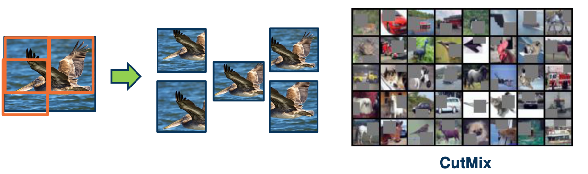{: width='400' height='400'}
* CutMix
  * Cutting and mixing different images together.
  * 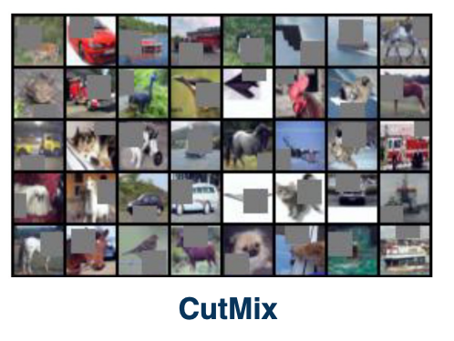{: width='200' height='200'}
* Color Jitter
  * Add or subtract RGB pixels from the image.
  * 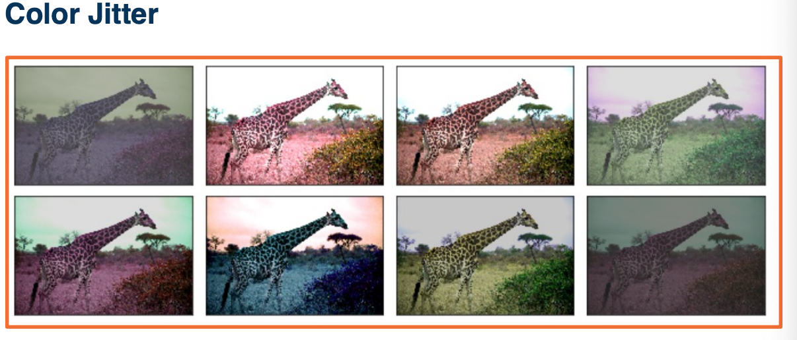{: width='200' height='200'}
* Generic affine transformation such as **Translation, rotation, scale, shear**
  * {: width='200' height='200'}

Can be combined:

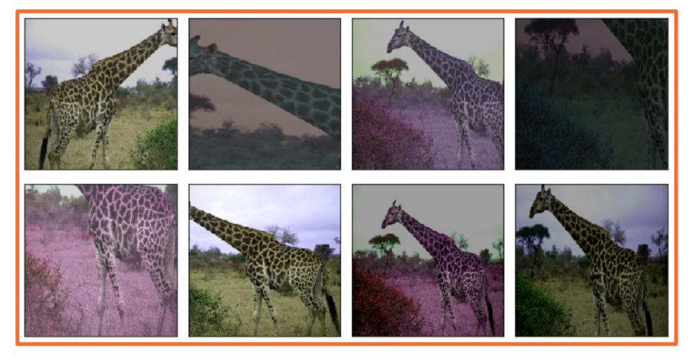{: width='400' height='400'}

**CowMix:**

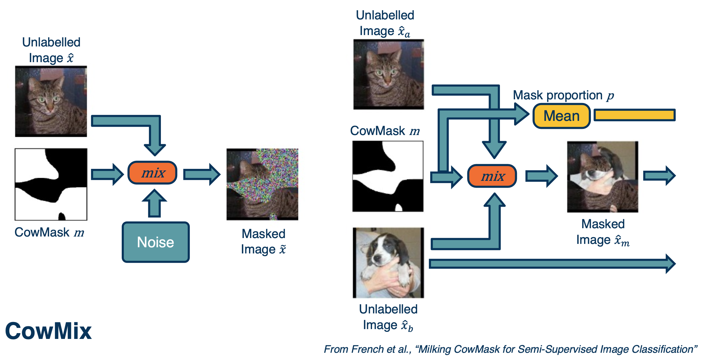{: width='400' height='400'}

On the left, you are combining an image of a cat with some kind of cow looking pattern in terms of a mask. These masks determine whether to take pixels from the image, which is the cat, or to take pixels from the noise. This forces the neural network to be very robust to things like occlusion.

On the right side you can see a more complicated example. The question is what should the ground truth be over here? You can actually make the ground truth label proportional to how many pixels you took from the cat and dog. 

### The Process of Training Neural Networks


* Training deep neural networks is more of an art form than science.
* Lots of things matter and they matter together
  * The key is to find a magical combination that works and allow it to learn a really good function for your application.
* **Key principle**: Monitoring everything to understand what is going on.
  * Can print out every gradient, activation and every loss value that happens across your entire optimization.
  * Loss and accuracy curves
  * Gradient statistics / characteristics
  * Other aspects of computation graph


Analyzing what is going on in your particular Deep Learning application always starts with **proper methodology**. 
* **Not uncommon** even in published papers to get this wrong.

Separate data into: Training, validation, test set 
* **Do not look** at test set performance until you have decided on everything (including hyper parameters)

Use **cross-validation** to decide on hyper parameters if amount of data is an issue.

#### Sanity check

Check the bounds of your loss function

* e.g cross entropy ranges from $[0, \infty]$
* Check initial loss at small random weight values
  * e.g $-log(p)$ fro cross-entropy where $p=0.5$

Another example: Start without regularization and make sure loss goes up when added

**Key principle**: Simplify the dataset to make sure your model can properly (over)-fit before applying regularization.

#### Loss and Not a Number (NaN)

* **Changes in loss indicates speed of learning**
  * Tiny loss change -> too small of a learning rate
  * Loss (and then weights) turn into `Nans` -> too high of a learning rate
* **Other bugs can also cause this:**
  * Divide by zero
  * Forgetting the log!

In pytorch, use autograd's detect anomaly to debug:

```python
with autograd.detect_anomaly():
  output = model(input)
  loss = criterion(output, labels)
  loss.backward()
```

#### Overfitting

* Classic machine learning signs of under/overfitting still apply
* **Over-fitting** - validation loss/accuracy starts to get worse after a while
* **Under-fitting** - validation loss very close to training loss or both are high
* Note, you can have higher training loss!
  * Validation loss has no regularization
  * Validation loss is typically measured at the end of an epoch. So it may not be surprising if your validation loss is better than your training loss.

{: width='400' height='400'}

#### Hyper-parameter tuning 

Many high-parameters to rune!
* **learning rate, weight decay crucial**
* Momentum, others more stable 
* **Always tune** hyper parameters, even a good idea will fail untuned.

Start with coarser search:

* E.g learning rate of `0.1, 0.05, 0.003, 0.01, 0.003, 0.001, 0.0005,0.0001`
* Perform finer search around good values

Note that hyper-parameters and even module selection are **interdependent!**

Examples:
* Batch norm and dropout **maybe not be needed together** and sometimes the combination is worse
* The learning rate should be **changed proportionally to batch size** - increase the learning rate for larger batch sizes
  * **One interpretation**: Gradients are more reliable/smoother

#### Relationship between loss and other metrics

Note that we are optimizing a **loss function**

What we actually care about is **typically different metrics that we cannot differentiate**

* accuracy
* Precision/Recall
* other specialized metrics

**The relationship between the two can be complex!**


#### Simple example: Cross-entropy and accuracy

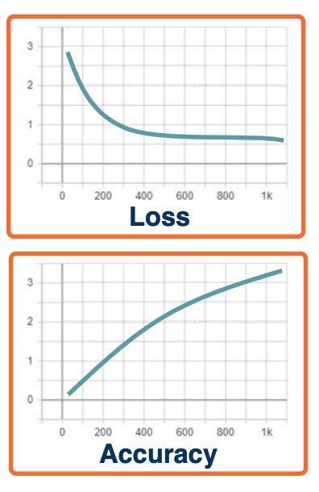{: width='200' height='200'}


* Example: Cross entropy loss $L=-log(P=y_i \lvert X=x_i)$
* Accuracy is measured based on $argmax_i (P(Y=y_i \lvert X=x_i))$
* Since the correct class only has one to be slightly higher, we can have **flat loss curves but increasing accuracy!**

<!--  -->

#### Precision/Recall or ROC curves

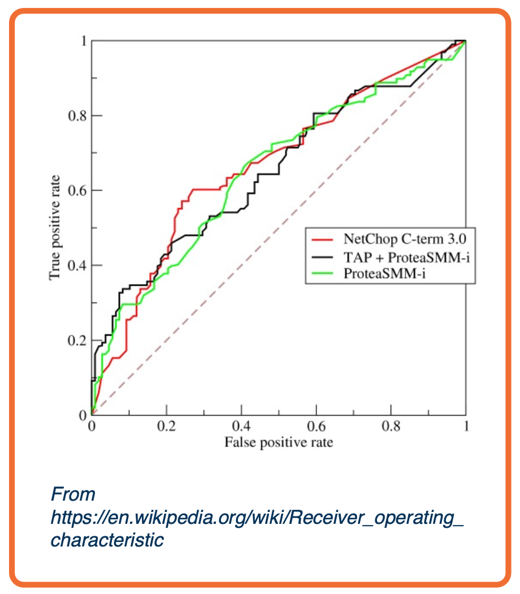{: width='300' height='300'}


* **TPR/FPR curves** represent the inherent tradeoff between number of positive predictions and correctness of predictions
  * Receiver operating characteristics ([ROC](https://en.wikipedia.org/wiki/Receiver_operating_characteristic)) curves similar, plot precision/recall instead.
* **Precision/recall curves** represent the inherent tradeoff between number of positive predictions and correctness of predictions
  

**Definitions**:
* True positive rate: $TPR = \frac{tp}{tp+fn}$
  * Also known as recall
* False positive rate: $FPR = \frac{fp}{fp+tn}$
* Accuracy = $\frac{tp+tn}{tp+tn+fp+fn}$
* Precision = $\frac{tp}{tp+fp}$

We can obtain a curve by varying the probability threshold and plot out TPR, FPR to get AUC:
* **Area under the curve (AUC)** common single number metric to summarize
* Mapping between this and loss is **not simple!**

[Extra resource - A disciplined approach to neural network hyper-parameters: Part 1 -- learning rate, batch size, momentum, and weight decay](https://arxiv.org/abs/1803.09820)

<!--  -->