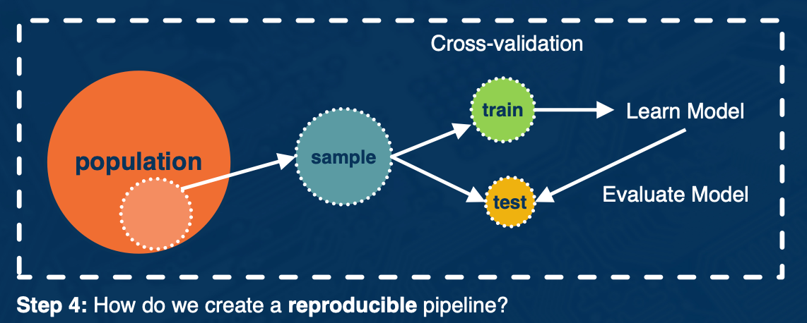

### Readings

* General preprocessing: [Preprocessing for deep learning: from covariance matrix to image whitening](https://hadrienj.github.io/posts/Preprocessing-for-deep-learning/)
* General preprocessing: [cs231n on preprocessing](https://cs231n.github.io/neural-networks-2/)
* Optional: Khetarpal, Khimya, et al. [Re-evaluate: Reproducibility in evaluating reinforcement learning algorithms](https://openreview.net/pdf?id=HJgAmITcgm). (2018). See related [blog post](https://neuripsconf.medium.com/behind-the-program-for-reproducibility-at-neurips-2019-8a020e57bfd9)

### Data Cleaning for Machine Learning

* Clean
* Transforma
* Pre-Process

Missing Data Mechanisms
* **Missing completely at random**: likelihood of any data observation to be missing at random
  * if someone forgot to fill out a depression survey answer, that would be missing completely at random.
* **Missing at random**: likelihood of any data observation to be missing depends on observed data features
  * Males tend to not fill up a depression survey, so this would be missing at random.
* **Missing not at random**: likelihood of any data observation to be missing depends on unobserved outcome. 
  * Someone did not fill up as a direct causation of their depression

Cleaning data - Ways to fill up missing data:
* Discard missing rows  
  * loses information
* Imputation
  * Numerical Data
    * Mean, mode, most frequent, zero, constant
  * Categorical Data
    * Hot-deck imputation, K-nearest neighbors, deep learning embeddings

Transforming
* Image
  * Color conversation
    * Maybe from RGB to grayscale
* Text
  * Index:
    * (Apple, Orange, Pear) -> (01,2)
  * Bag of Words
  * Term-frequency times inverse document frequency (TF-IDF)
    * L1 normalization of the rows of a matrix
  * Embedding

Pre-preprocessing
  * Normalize / Zero-center 
  * {: width='400' height='400'}

#### Case Study - depth estimation

For depth estimation, we are predicting at every pixel in the image the distance from the camera. 

{: width='400' height='400'}

Usually, depth sensors predict very noisy data. You can see the holes in the depth images in the second row here. So the first step we need to do is clean these holes, clean the data.  

There are **many ways to fill in the missing depth values (black pixels in depth map)**
* Nearest Neighbor (naive)
* Colorization (NYU Depth V2)
  * Uses inpainting to find the missing results 

{: width='400' height='400'}

This is how the depth map looks like after we hae filled in all the missing values:

{: width='400' height='400'}

The next step is to transform our data. Learning rich features from RGB-D images for object detection and segmentation found that instead of using a single channel depth map, they see improved performance by using 3 channels as the input. 

Transform the 1-channel depth map into 3 channels:
1. Horizontal disparity 
2. Height above ground
3. Angle with gravity

{: width='400' height='400'}

The final step is pre processing, for depth estimation, inverse depth helps to:
* improve numerical stability 
* Gaussian error distribution 

For example, see in the chart below without normalization, training quickly collapses and our mean depth goes to zero. However with normalization we are able to train for long periods of time without our depth collapsing to zero.

{: width='400' height='400'}

### Managing Bias 

There are many mathematical definitions of fairness in machine learning

* **Anti-classification**: protected attributes, like race, gender and their proxies are not explicitly used. 
* **Classification parity**: Common measures of predictive performances... are equal across groups defined by protected attributes.
  * Example of this are default rates
  * Should expect that the model predicts similar false negative rates for both white and black applicants
* **Calibration**: Conditional on risk estimates, outcomes are independent on protected attributes
  * If for instance we look at all loan applicants who are expected to have a 10% chance of default, then we would expect that the false negative rates of white applicants and black applicants are similar. 

### Data Wrangling (optional)

The data wrangling process:

* First, you have some target population of observations
* Next, you think about sampling from that entire population because it is often not possible to work with the entire population.
* Here, we will be focused on building prediction models.
  * So we then implement a cross validation step where a portion of the data called the train split is used for building a learning model. 
  * And the test split is used for model evaluation

{: width='400' height='400'}

Next, we will walk through each step of the data wrangling process in more detail. So we will first step through what is the population of interest and what sample s are we evaluating and is sample s representative of the population. 

{: width='400' height='400'}

So there are many ways to define target population of interest, here are some examples:

* All Users on Facebook
* All U.S. Users on Facebook
* All U.S users on Facebook that joined in the last month

Next, there are many ways to sample the data and here are just **Two sample probability sampling methods**

* **Simple Random Sampling**: every observation from the population has the same chance of being sampled
* **Stratified Random Sampling**: population is partitioned into groups and then a simple random sampling approach is applied within each group.

### Cross Validation and Class imbalanced (optional)

In this portion, we will discuss step 2
* How do we **cross validate** to evaluate our model? How do we avoid over fitting and data mining?

{: width='400' height='400'}

Solution: Use cross-validation. 

Best practices
* Random search vs Grid Search for hyper parameters (Bergstra and Bengio)
  * Hyperparameter in deep belief networks that random searching can find models at least as good if not better than a grid search in a fraction of the computation time. 
* Confirm Hyperparameter range is sufficient (See as an [example](https://scikit-learn.org/stable/auto_examples/ensemble/plot_ensemble_oob.html))
* Temporal (time series) cross-validation considerations
  * Future data cannot be used as part of cross validation
* Check for overfitting

#### Class imbalanced

Class imbalance may occur in binary class prediction settings where one class outnumbers the other class.

{: width='400' height='400'}

Two general ways to address class imbalance in your dataset:
* Sampling base methods 
  * One popular method is called the synthetic minority over sampling technique or **SMOTE**.
    * Over sampling with replacement the minority class.
    * So for each observed minority observation, SMOTE identifies nearest neighbors and feature space will randomly select a subset of these nearest neighbors based on some desired amount of over-sampling. And when we will uniformly sample from the line segment connecting the minority observation and the selected nearest neighbor.
    * {: width='200' height='200'}
* Cost sensitive learning methods

**Region CNN (R-CNN) and Single Shot Dector (SSD)** are models that can localize and classify many objects in an image.They densely sample many boxes of different sizes at different "anchor" locations in the image. 

{: width='400' height='400'}

Then for each anchor point, we sample many boxes of different sizes and aspect ratios. These boxes are called proposal boxes. In object detection:

* **Goal**: Classify a proposal box into foreground or background
* **IoU**: Intersection over union
* A **proposal box** is assigned a **ground truth label of**:
  * **Foreground**, if IoU with ground truth box $> 0.5$
  * **Background**, otherwise.

{: width='400' height='400'}

**Cross entropy** is a popular loss use for bounding box regression. Easy examples incur a non-negligible loss, which in aggregate mask out the harder, rate examples

$$
CE(p,y)
\begin{cases}
& -log(p), &\text{ if $y=1$} \\
& -log(1-p), &\text{otherwise}
\end{cases}
$$

**Focal Loss**: down-weights easy examples, to give more attention to difficult examples

$$
FL(p_t) = - (1-p_t)^\gamma log(p_t)
$$

{: width='400' height='400'}

What we mean by easy examples are well classified examples with high probability from the model. The blue line here represents cross entropy, the baseline. You can see, even for higher probability predictions, we still incur a non-zero loss. Compare this to focal loss, where for higher probability predictions, we incur a much smaller loss. 

**Cross validation done right in class imbalanced settings**

{: width='400' height='400'}

At the top we have our original imbalanced data set. So in red are the minority class, units A through E and in gray, we have our majority class units 1 through 10. 

On the left is an illustration of cross-validating after oversampling and this is incorrect. This is because we first over sampled so that we have equal representation of both classes then we cross validate. Lets focus on the k equals 1 split. In both the training and test split, we observe A appearing as indicated by the asterisk. Thats because we oversampled first. So this will lead to an overoptimistic error estimate, since you have data leakage on the same observation appearing on both the train and test split. 

Instead the right side illustrates the correct approach to implement cross-validation during oversampling. First the original data is divided into k partitions and only the training split is over sampled. So this is important because it means that no data from the training split will become part of the testing split and we can ensure a fair evaluation.

### Prediction and Evaluation (optional)

**Model evaluation statistics**

* Confusion matrix, metrics
* For regression, you have RMSE etc
  
{: width='400' height='400'}

**Classification and calibrated Models**

For classification models, sometimes it matters not only predicting the class label, but predicting the associated probability. If we care about the classification score that corresponds to a probability score then it can be help to examine calibration plots. 

A calibration plot, as shown here, plots on the x-axis the mean predicted value and on the y-axis the fraction of positives. So a perfectly well calibrated plot is shown by the black dotted line where mean predictions are exactly equal to the fraction of positives. A miscalibrated plot is one that deviates from the dotted line. In this plot here we see a logisticregression model as well calibrated, this makes sense since logistic regression is aimed at optimizing the log loss. Meanwhile, we see a support vector classification model is very miscalibrated. 

If you find your model is miscalibrated, then there are a variety of options for calibrating such as isotonic regression. 

{: width='400' height='400'}

It is important to ask what are we measuring our model performance against?

The importance of baseline - the baseline can be anything:
* **Random guessing**?
* **Current model** in production?
* Useful to **compare predictive performance** with curre**nt and proposed model**. 

#### summary

* Clearly define your population,
* Understand the representativeness of your sample
* Cross validation can go wrong in many ways; understand the relevant problem and prediction task that will be done in practice 
* Know the prediction task of interest (regression vs classification)
* Incorporate model checks and evaluate multiple predictive performance metrics. 

{: width='400' height='400'}

{: width='400' height='400'}

<!--  -->
