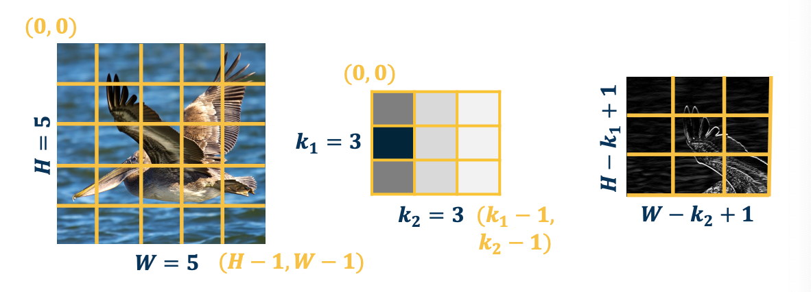
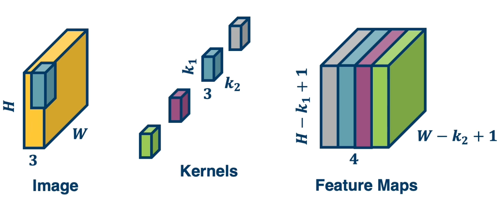

### Readings

* [DL book: Regularization for Deep Learning](https://www.deeplearningbook.org/contents/convnets.html)

### Convolution layers

Backpropagation and automatic differentiation, allows us to optimize any function composed of differentiable blocks. 
* **No need to modify** the learning algorithm dependent on what the blocks are
* The complexity of the function is only limited by **computation and memory**

The connectivity in linear layer doesn't always make sense. Take images for example, suppose that an image has 1024 by 1024 pixels, when we convert this into a vector, we will roughly have a million parameters. If we put a fully connected layer after it with N nodes, lets say N equals to 1000. 

The total parameters is  M*N (weights) + N (bias). Hundreds of millions of parameters **for just one layer**. There are several issues in machine learning with having so many parameters. 
* More parameters you have the more data you require
  * is this necessary?

#### Locality of Features

**Images features are spatially localized**

* Smaller features repeated across the image
  * Edges
    * Dark pixels vs light pixels tells us whether there are edges in the image. Can repeat this across entire image to extract features. 
  * Color 
  * Motifs (corners, etc)
    * Small corners, small circular shapes and things like that
    * Anything you can detect with a patch of the image and not the entire image itself.
* No reason to believe one feature tends to appear in one location vs another (stationary)
  * e.g a bird can appear anywhere in the image.

Can use these properties to induce a bias in the design of a neural network to reflect this. By bias, will explore specific connectivity patterns that are more appropriate to images and that will reduce the number of parameters that these layers will have.  

#### Idea 1 - Receptive Fields

Specifically, each node in the neural network only receives input from $\textbf{K_1} \times \textbf{K_2}$ window (image patch).
* Region from which a node receives input from is called its **receptive field**.
* This node will output the existence of a particular type of feature in that little window for example an edge. 

{: width='400' height='400'}

The **advantages** to this:
* The number of parameters will be reduced to $(K_1 \times K_2 + 1) * N$ where $N$ is the number of output nodes. So we can toggle this by controlling the number of output nodes. This will allow us to have only a certain number of output nodes, each of which only takes input from $K_1$ by $K_2$ image patches. 
* Explicitly maintain spatial information.

What about location-specific features?

#### Idea 2 - Shared weights 

{: width='400' height='400'}

Nodes in different locations can **share** features or weights. Weight sharing means that the specific weights for example, $W_{11}$ for example the left most node is the same for the right most node. The way you can accomplish this is by just having the same variable in the computation graph feed into both of these nodes. So we will have several nodes across the entire output all share weight. 

* No reason to think the same feature (e.g edge pattern) can't appear elsewhere. That edge detection feature will be run across the entire image. 
* Using same weights/parameters in computation graph (shared weights)

The **advantages**:
* Further reduce the number of parameters to $(K_1 \times K_2 +1)$.
* Explicitly maintain spatial information. 

#### Idea 3: Learn many features

We can **learn** many such features for this one layer. So we may not want to be limited to one type of feature. We can have vertical edges or horizontal edges of lots of things inbetween. At the same time we also want to represent different color features or texture features or corner features or other shapes. And so we will want to have multiple types of features. 

{: width='400' height='400'}

We will have one channel of output, for example on the upper left, that represent locations of features, say edges or a particular edge orientation. This output channel will have nodes with high values in the locations that have such features very strongly. And then on the lower left, we will have another channel of output that represents the location of a different feature.

The weights are **not** shared across different feature extractors. The weights themselves will represent what type of features we extract from these little windows. But for one particular type of feature on the upper left, all of the nodes are sharing their weights. In other words they are extracting the same type of feature over different locations in the image.

The number of parameters now is $(K_1 \ times K_2 + 1) * M$ where $M$ is the number of features we want to learn.

#### Convolution

This operation is **extremely common** in electrical/computer engineering!

In mathematics and, in particular, functional analysis, **convolution** is a mathematical operation on two functions $f$ and $g$ producing a third function that is typically viewed as a modified version of one of the original functions, giving the area overlap between the two functions as a function of the amount that one of the original functions is translated.

Convolution is similar to **cross-correlation**.

It has **applications** that include probability, statistics, computer vision, image and signal processing, electrical engineering, and differential equations.

**Notation**: 

$$
F \bigotimes (G \bigotimes I ) = (F \bigotimes G ) \bigotimes I
$$

**1D convolution**:

$$
y_k = \sum_{n=0}^{N-1} h_n \cdot x_{k_n}
$$

e.g $y_3 = h_3 \cdot x_0 + h_2 \cdot x_1 + h_1 \cdot x_2 + h_0 \cdot x_3$

**2D Convolution**:

{: width='400' height='400'}

We are mainly interested in 2D convolution.

We will have an image that is fed through what is called a kernel or a filter and get an output or what is called a filter/feature map. In DNN, it is sometimes called an activation map. The output is spatially relevant and maintains spatial information of where the particular kernel or filter is highly expressed in the original image. 

Above image is an example to the particular kernel, if we visualize it in grayscale where dark values are very low negative values, and light values are high/positive values. You can see this looks like an edge and this is not a coincidence. This filter will be convolved with image patches, so portions of the image have very dark locations on one side, and very light locations on the other side, this filter will activate very highly. This results in very high values in the corresponding region in the output map. 

In Deep learning, we will make this convolution **a layer** in the neural network.

* Initialize kernel values randomly and optimize them!
* These are our parameters (plus a bias term per filter)

**The object is to learn the kernel itself.** The output maps after the operation will allow us to classify what is in the image. 

#### Intuitive explanation

What convolution layer is doing is very simple. 

We take the kernel and flip/rotate it by 180 degrees. And then take the dot product that kernel with all the different images patches or locations in the image, and add a bias term later. 
 
{: width='400' height='400'}

This dot product will result in the value output of the first pixel in the output map, depicted as what that white circle is. Now if you notice if we do it across the entire image, at some point we will run out of room.  

#### Mathematics of Discrete 2D Convolution

Even though the description of what we are doing in the convolution operation is pretty simple, mathematically describing it gets a little hairy. And that is because we need to define coordinate systems for the image and the kernel. And somehow describe mathematically this operation of flipping the kernel as well as striding over the image. 

{: width='400' height='400'}

Suppose that we take the image here, simplify it into a 5 by 5 grid, and we will represent a coordinate system where the center pixel is $(0,0)$. And so the upper left is going to be $(-\frac{H-1}{2}, -\frac{W-1}{2})$ and the bottom right is $(\frac{H-1}{2}, \frac{W-1}{2})$.

The kernel coordinate system will be a little different, we will have the upper left defined as $(0,0)$ and the lower right defined as $(k_1-1,k_2-1)$. So lets look at the equation that describes this convolution operation

{: width='400' height='400'}

Let's take the output map $y$, so $y$ represents our output and $(r,c)$ will represent the pixels that are in the output. So $r$ represents the row, and $c$ represents the column, and $(0,0)$ is going to be on the upper left in this case. What we are going to do is $y$ of $(0,0)$ will equal to the summation over the entire image where we dot product or multiply the input pixel the image pixel times the kernel value.  But if you look we are summing over the upper left to the lower right all of the pixels in the image, and we are multiplying $x(a,b)$. 

So $(a,b)$ is the current pixel in the input image, and multiplying pixel $(a,b)$ in the input image with the kernel value, but the kernel value is not $a,b$ but it is actually $(r-a, c-b)$. This is what is representing mathematically that operation of flipping the kernel. 

For example, $y(0,0)$, we iterate over all the pixels in the input image and lets say the upper left which is $x(-2,-2)$. So now $a=-2,b=-2$ And because we are looking at $y(0,0)$ so $(r,c) = (0,0)$. So if you work it out the actual kernel pixel that we are multiplying by is by $r-a$ which is $0-2 = -2$ and the same for the other coordinate. We continue to do this for $x(-2,-1)$ and multiply it by $k(2,-1)$ and so on. 

If you notice, at some point you will have negative values for the kernel, and of course you cannot have that since there is no value there. For those cases we just throw those values away. 

#### Convolution and cross correlation

As we have seen:

* **Convolution**: Start at the end of the kernel (lower right) and move back towards $(0,0)$
  * This is intuitively described as a flipping operation. 
* **Cross-correlation**: Start in the beginning of the kernel and move forward (Same as for image).
  * Very similar to convolution except its applied with the flipped kernel.

An **intuitive interpretation** of the relationship:

* Take the kernel, and rotate 180 degrees along center (sometimes referred to as "flip") 
* Perform cross-correlation
* Just dot-product filter with image.

$$
K = 
\begin{bmatrix}
1 & 2 & 3 \\
4 & 5 & 6 \\
7 & 8 & 9
\end{bmatrix},

K' = 
\begin{bmatrix}
9 & 8 & 7 \\
6 & 5 & 4 \\
3 & 2 & 1 
\end{bmatrix}
$$

#### Cross-correlation

{: width='400' height='400'}

So this is the mathematics of cross-correlation. It is actually a little bit nicer because if you notice rather than having this weird $r-a$, we are now adding things which is a lot more intuitive. And we can have the coordinate systems be the same for both the image and the kernel. 

So specifically for the image, we have the coordinate system $(0,0)$ on the upper left, and $(H-1,W-1)$ on the low right and the same thing for the kernel. 

One interesting thing is that essentially the pixels is moving in the same direction. That is, the indexing is moving the same direction which makes things a lot more intuitive. This will make backprop equation much simpler.

One interesting thing is that since we are learning these kernels anyway, essentially those kernels are going to be randomly initialized and some learned thing that gradient descent tells us to optimize to. It does not really matter whether you flip the kernel or not. And so, with respect to a learned kernel, there is no real difference between convolution and cross-correlation. 

An example:

$$
X(0:2, 0:2) =
\begin{bmatrix}
200 & 150 & 150 \\
100 & 50 & 100 \\
25 & 25 & 10
\end{bmatrix},
K' = 
\begin{bmatrix}
1 & 0 & -1 \\
2 & 0 & -2 \\
1 & 0 & -1
\end{bmatrix}
$$

$$
X(0:2, 0:2) \cdot K' = 65 + \text{bias}
$$

#### Why Bother with Convolutions?

Convolutions are just **simple linear operations**

Why bother with this and not just say it is a linear layer with small receptive field? Why are we bothering with all this mathematical formulation of what a convolution is, as well as describing the relationship between the convolution and cross-correlation?

* There is a **duality** between convolution and cross-correlation during backpropagation
  * It turns out that when you do the forward pass as a cross-correlation, which is actually how we will implement it, because that is the easy thing to implement, and it is also easy to vectorize. It turns out when we compute the gradients which we will go through, it actually will be a convolution
  * If you forward pass a convolution, the backwards pass will be a cross-correlation. So it is good to know the relationship just because of that. 
* Convolutions have **various mathematical properties** that people care about
  * For example we can take the kernels that are learned when we do cross-correlation, and we can then flip them and describe them as a convolution and maybe do some analysis.
* This is **historically** how it was inspired.

### Input and Output Sizes

A convolution layer as we described is taking a kernel of a particular size and striding it over the image and doing a dot product across all the locations to produce a spatially organized output map. 

{: width='400' height='400'}
*https://pytorch.org/docs/stable/generated/torch.nn.Conv2d.html*

Now there are several design decisions or hyper parameters that exists for these layers. 

* Input Channels - For example in an image, we can have three channels - the RGB
* Output channels - how many kernels we use.
* Kernel size - we can have 3 by 3 as shown or any size you want. They do not have to be square either
* Stride -  We also have the stride that is we will move the kernel along the image, not one pixel at a time but a few pixels at a time.
* Padding - can pad the image or surround by zeros in order to change the output size.

#### Valid Convolution

The output size of a vanilla convolution operation is just the dimension of the image minus the dimension of the kernel plus one $(H-k_1+1) \times (W - k_2 + 1)$

{: width='400' height='400'}

So in the above example, we will have a three by three output map. To repeat, the reason it is smaller is because if we move that kernel over more than three times, for example the fourth time, the kernel goes off the image. 

So a **valid convolution** is only when the kernel is fully on the image. 

#### Adding Padding 

We can also **pad the images** to make the output the same size. In some cases, we want to have one input size and then have the same output size. What we can do is just surround the image with zeros but there are also other things that we can do, for example we can mirror the image.

For example the pixels at the border will be reflective of the pixels in the actual image across the border.

{: width='400' height='400'}

Note that padding often refers to adding **one dimension**, so $P=1$ or padding size of one here is shown but actually you are adding two to the height because you are going to add a padding to the bottom as well as the top  

#### Stride

We can also move the filter along in larger step sizes than just one (stride).

{: width='400' height='400'}

* This can potentially result in **loss of information**.
* Can be used for **dimensionality reduction** (not recommended)

Note that some combinations are not going to be valid and cna result in skip pixels at the edge. For example a stride of 3 for 5x5 input with a 3 by 3 kernel.

#### Multi Channel inputs

We talked about one channel inputs, such as greyscale images, but in reality they have three channels (red green blue). So we will have a tensor of size height by width by three. So in that case, how do we design the kernel for the convolution operation?

It turns out we can just have a three channel kernel, i.e the depth of the kernel extended to be equal to the depth of the input. 

{: width='400' height='400'}

We actually do the same dot product operation, except rather than do it with three by three values, instead do it with three by three by three values. 

The following image depicts how we can do this:

{: width='400' height='400'}

We can also have **multiple kernels per layer**. This is because we want multiple feature extractors for each image. These kernels could represent things like edges of a particular orientation so it is good to have many of them. We will also want kernels that represent extraction of color features or texture features and so on. Remember, it is gradient descent that will learn these kernels. 

{: width='400' height='400'}
*stack the feature maps together at the output, remember the number of channels in output is equal to the number of kernels*

Then there is a question of why you will not learn the same exact type of features? It turns out the reason is we initialize them to different values so all of these kernels will initialize the different values and their local minima in their local weight space will be different and so they will end up learning different features. 

The gradient for each kernel will be different because we initialize them differently and they will move in different directions. You might have redundancy in this case and we will see this when we visualize what this network will learn. 

Now let's take a look at the number of parameters (recall that the idea of using convolution is to reduce the number of parameters.). In the above image, assume that each filter is $k_1 \times k_2 \times 3$, that is how many parameters we will have because each of those values in the kernel is the parameter that we are learning and initialize randomly. We will have a plus 1 here again for the bias. So if we have $n$ kernels, then the total parameters is $N * (k_1 * k_2 * 3 + 1)$

#### Vectorization of Convolution

Just as before, in practice we can vectorize this operation.

* Step1: Lay out images patches in vector form. 
  * {: width='400' height='400'}
* Step 2: Multiply patches by kernels
  * {: width='400' height='400'}

### Pooling layers

In this lesson we will introduce a new layer called the pooling layer that can perform dimensionality reduction. That is down sampling things like images. 

* **Dimensionality reduction** is an important aspect of machine learning.
  * As we know, we often have very high dimensional input and we do not actually need to characterize those high dimensional inputs in as much information.
  * That is we can compactly represent the important information, for example, for the task of classifying within the image. 
* Can we make a layer to **explicitly down-sample** image or feature maps?
* Yes! We call one class of these operations **pooling** operations

{: width='400' height='400'}
*https://pytorch.org/docs/stable/generated/torch.nn.MaxPool2d.html*

#### Max pool layer

Example: Max pooling

* Stride window across image but perform per-patch **max operation**

$$
X(0:2, 0:2) =
\begin{bmatrix}
200 & 150 & 150 \\
100 & 50 & 100 \\
25 & 25 & 10
\end{bmatrix}
\rightarrow
max(X(0:2,0:2)) = 200
$$

How many learned parameters does this layer have? **None!**

**Not restricted to max**: can use any differentiable function, such as average (Not very common in practice), typically we use max operation. You will see in much later neural network architectures we might get rid of the pooling layer all together and perform dimensionality reduction using convolutions themselves. 

$$
X(0:2, 0:2) =
\begin{bmatrix}
200 & 150 & 150 \\
100 & 50 & 100 \\
25 & 25 & 10
\end{bmatrix}
$$

$$
avg(X(0:2,0:2)) = \frac{1}{N}\sum_i \sum_j x(i,j) = 90
$$

#### Combining convolution and pooling layers

Since the **output** of convolution and pooling layers are **(multi channel) images** (i.e a tensor), we can sequence them just as any layer. For example, we can take an image, perform a convolution to get an output channel or image and then apply pooling to that same output. We can continue to sequence these layers over and over again.

{: width='400' height='400'}

#### Invariance

This combination where we perform a convolution and then a pooling actually has a powerful feature. Specifically it results in what is called **invariance**

* if the feature (for example a beak) translated a little bit, output values may still **remain the same**
  * This is because the kernel - the feature that picks out beak will have a high value that moves a little bit in the output map. 
  * But if we move within the pooling window, that is as long as the movement is not much larger than the size of the pooling window, then the max across that window will still be the same. And so if there is a high value there because there was a beak there, then we will still have a high value after pooling.
  * So movements, at least slight movements of the features themselves in the input image will result in the same exact value in the output map.
  * This is what is called **invariant**

{: width='400' height='400'}

#### Invariance vs Equivariance 

Convolution by itself has the property of **equivariance**. This is something that convolution operations naturally have even without pooling.

* If feature (such as beak) translated a little bit, output values **move by the same translation**

{: width='400' height='400'}

For example if the beak feature or pixels move a little bit, then the kernel will st ill stride across the entire image and pick it up in that new location. So it will have high output value in that new location. This means that in the output map, the high value moves in the same direction as the actual feature in the image.

Both of these types of features are actually quite important, for example in terms of invariants, we want various transformations or things like translation or rotation to not affect the output very much. Eventually at least deep in the network when we start to do classification we do not want the classification outputs to change very much. We still want this bird to be classified as a bird even though the beak feature moved. So, having these equivariance and invariance properties are actually very important. 

<!--  -->
