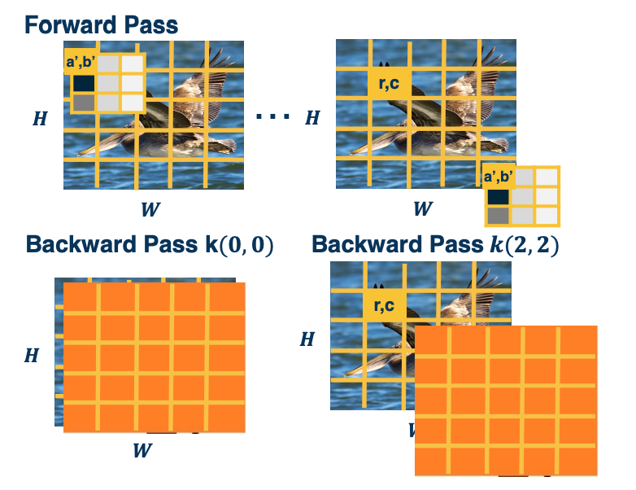
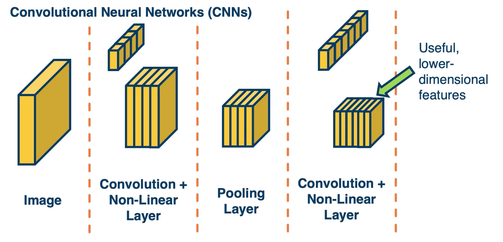

### Readings

None!

### Backwards Pass for Convolution Layer

It is instructive to calculate **the backwards pass** of a convolution layer even though in practice, automatic differentiation will do it for us. 
* Similar to fully connected layer, will be a **simple vectorized linear algebra operation**!
* We will see a **duality** between cross-correlation and convolution

As a reminder: here is the cross correlation operation:

$$
y(r,c) = (x*k)(r,c) = \sum_{a=0}^{k_1-1} \sum_{b=0}^{k_2-1} x(r+a,c+b)k(a,b)
$$

{: width='400' height='400'}

Some simplifications: 1 channel inp ut, 1 kernel (channel output), padding (here 2 pixels on right/bottom) to make output the same size. 

The output map $\lvert y \lvert = \textbf{H} \times \textbf{W}$ is going to be height by width, this is the same size as the input. So the upstream gradient, the partial derivative of the loss with respect to our output for this convolution layer is given by whatever layer is after this one and we are going to assume some things about it.  

* $\frac{\partial L}{\partial y}$ - Assume size $H \times W$ (add padding, change convention abit for convenience)
* $\frac{\partial L}{\partial y(r,c)}$ - to access element of a particular pixel of the jacobian.

Just like any other layer, we will define the convolution layer as some black box that has an input, output nad a set of parameters. 

{: width='400' height='400'}

Specifically it has an input $h^{l-1}$, typically some tensor, an output $h^l$ where the depth is equal to the number of kernels in the layer, and $w$, the learnable parameters. In this case, the parameters are the kernel values themselves. 

We want to compute the partial derivative of the loss, with respect to our input, $h^{l-1}$ as well as with respect to our weights (kernel values) in order to update them. While we want to do this based on the upstream gradient that were given from whatever module exists after this one. That is the partial derivative of the loss, with respect to our output and is something we are given.  

If you remember, we will use the chain rule to compute this, the partial derivative of the loss with respect to our input will just be equal to the partial derivative of the loss with respect to our output times the partial derivative of the output with respect to our input. This is saying that if we know how the loss changes as our output changes in small ways and we know how our output changes if our input changes in small ways, then we can multiply those contributions and get the ultimate change of the loss with respect to our inputs. Similarly, the partial derivative of the loss with respect to our weights, again uses this chain.

### Gradient for Convolution Layer

In this lesson, we will derive the gradients for the convolution layer and show interesting characteristics derived from it, and how it can be implemented efficiently just like any other layer using linear algebra operation. 

#### What a Kernel Pixel Affects at Output

Let's start with the gradients for the weight update. Specifically we can do this one pixel at a time. That is, the partial derivative of the loss with respect to $W(a,b)$ or $\frac{\partial L}{\partial k(a,b)}$

{: width='400' height='400'}

So what does this weight affect at the output? Because if you remember, the forward paths induces a computation graph where this particular pixel $W(0,0)$ performs some effect on the output. This can be multiple outputs, you can see it as multiple edges coming from this pixel in the kernel to the output map. And so for each edge that is outgoing from this pixel, we want to have a corresponding backwards edge through which gradients flow. 

So, what do you think this weight affects at the output? Which of the pixels in the output does it affect? The answer is **Everything!!**. This is because we are striding the kernel across the input image. So in the first location, the first pixel in the input $x(0,0)$ is multiplied by $W(0,0)$. And that gets summed with the other contributions to result in that output map $y(0,0)$. But then we move the kernel over one spot and again it is weight shared, so there is another out going edge where we are now multiplying $W(0,0)$ with $x(0,1)$ and that gets contributed to the output of $y(0,1)$ and so on. As we continue to do this, if you think about it, that one kernel pixel is affecting the entire output. IF we change that one kernel pixel, it will actually change the entire output map, at least by a little bit. 

#### Chain Rule over all Output pixels

Because this one kernel value affects all of the pixels on the output, we actually need to incorporate all of the upstream gradients. That is, partial derivative of loss with respect to $y(0,0), (0,1)$ and so on all the way to the end:

$$
\bigg\{ \frac{\partial L}{\partial y(0,0)}, \frac{\partial L}{\partial y(0,1)}, ..., \frac{\partial L}{\partial y(H,W)}\bigg\}
$$

The way we can do this is through the chain rule. Again, if you have an outgoing arrow in the computation graph from a particular variable, and that variable affects multiple things at the output, then we will just sum the gradients where we perform the backwards pass. That is, you will have a corresponding backwards edge back to the same variable and you will add all the gradients across all the edges. And so this is what it looks like: 

$$
\frac{\partial L}{\partial k(a',b')} = \sum_{r=0}^{H-1} \sum_{c=0}^{W-1} \frac{\partial L}{\partial y(r,c)} \frac{\partial y(r,c)}{\partial k(a',b')} 
$$

We will have the partial derivative of the loss with respect to $W(a',b')$ is equal to the summation across the entire output map. And for each pixel, we will use the chain rule locally. We will do the partial derivative of the loss with respect to that pixel (this is given to us via upstream gradient) times the partial derivative of the output pixel with respect to particular kernel. 

$$
\frac{\partial L}{\partial k(a',b')} = \underbrace{\sum_{r=0}^{H-1} \sum_{c=0}^{W-1}}_{\text{sum over pixels}} \underbrace{\frac{\partial L}{\partial y(r,c)}}_{\text{known}} \underbrace{\frac{\partial y(r,c)}{\partial k(a',b')}}_{\text{compute}}
$$

So, how do we calculate this term? You can do this analytically or visually. In this case, let's do it visually. On the bottom, you can actually see that when we have a pixel $(r,c)$ at the output and we are applying a particular kernel pixel, $(a',b')$, and actually there is a question of what is the input pixel that is multiplied by it? 

{: width='400' height='400'}

When we actually have the kernel pixel, $(a',b')$, which input pixel is multiplied by it? The reason we want to know is we are trying to take the derivative. 

#### Gradients and Cross-Correlation

$$
\frac{\partial y(r,c)}{\partial k(a',b')} = x(r+a', c+b')
$$

We are looking at the output pixel $(r,c)$ and a particular arbitrary kernel $(a',b')$, the actual input pixel which gets multiplied by and hence is the derivative is $x(r+a', c+b')$. One way to easily do this is just think of the extremes, when $a',b'$ are both 0, then we just get $x(r,c)$ which is visually what is depicted here. If we move it one to the right and one down, then we get $r+1, c+1$ and so on. 

$$
\therefore \frac{\partial L}{\partial k(a',b')} = \sum_{r=0}^{H-1} \sum_{c=0}^{W-1} \frac{\partial L}{\partial y(r,c)} x(r+a', c+b')
$$

This equation is actually a cross-correlation between upstream gradient and input until $k_1 \times k_2$ output. 

#### Forward and Backward Duality

{: width='400' height='400'}
*Orange picture is $\frac{\partial L}{\partial y}$*

In the forward path, we are striding this kernel across the image and we have some particular kernel value that we care about $(a',b')$ and we want to compute the backward pass for that. When $(a',b')$ is $(0,0)$, this is showing the cross-correlation that we will be doing. We are actually just cross-correlating literally the input and the upstream gradient, partial derivative of the loss with respect to our output (which is a matrix of size H by W). For the backward pass of $k(2,2)$, this is showing what we are cross-correlating. 

#### What an Input Pixel Affects at Output

Now that we have the gradients with respect to our weights, let's calculate the gradients with respect to our input. The reason we need this is not to update the weights for this layer, but to pass back to whatever previous layer occurred before this one. 

$$
\frac{\partial L}{\partial x } = \frac{\partial L}{\partial y } \frac{\partial L}{\partial x }
$$

What we want to do is let's calculate this pixel one at a time, $\frac{\partial L}{\partial x(r',c') }$. We can try to think what does this input pixel affect at the output? If you think about it and visualize striding the kernel around the input image producing the output, what you will notice is that there is several positions where the particular kernel touches this pxiel. And whenever the kernel touches the pixel that means that the pixel gets incorporated into the output through the summation. That means if I change this particular input pixel then the output pixel will change. Which means that there should be a gradient. So, I can try to reason, about what the neighborhood is affected at the output. This is because I need to chain rule it with the partial derivative of the loss with respect to the particular pixel. 

#### Extents at the Output

{: width='400' height='400'}

We can try to reason at these four extremes and the input side which parts of the output does it touch. The reason we care about this is we are applying the chain rule and we need to know which elements of the upstream gradient that we get. Should we actually use it in the chain rule? 

The four extreme points on the input correspond to these four extreme points on the output. That is point four, which is where the kernel position $(0,0)$ touches $r',c'$. It actually corresponds to $r',c'$ on the outputs. And so again, these are the four points on the output where the corresponding locations are for these particular pixel. 

#### Summing Gradient Contributions

Now that we know all the positions on the output map that are affected, we can compute the chain. That is we can compute the partial derivative of the loss with respect to this particular input pixel $r',c'$ as the summation of all the affected pixels on the output and sum all the chain rules. That is, partial derivative of the loss with respect to y of the affected pixel times the partial derivative of the affected pixel at the output with respect to this particular input pixel $r',c'$. Again, the reason we are summing up all the gradients us because you can see this as a computation graph where this particular pixel in the input $(r', c')$ has an outing edge to multiple output pixels. And so for each of those output pixels, we want to calculate it's effect and calculate the backwards gradient going through that edge. And so we can try to figure out what should these actual pixels be? 
 
$$
\begin{aligned}
\frac{\partial L}{\partial x(r',c')} &= \sum_{\text{pixels p}} \frac{\partial L}{\partial y(p)} \frac{\partial y(p)}{\partial x(r',c')} \\
&= \sum_{a=0}^{k_1-1}\sum_{b=0}^{k_2-1} \frac{\partial L}{\partial y(r'-a, c'-b)} \frac{\partial y(r'-a, c'-b)}{\partial x(r',c')}
\end{aligned}
$$

This shows the particular pixels that are affected on the output. Specifically, if you think about it, when you have kernel pixel $(a,b)$ equal to $(0,0)$, then you have the output pixel $y(r',c')$ . That is, when the input pixel $r',c'$ touches the kernel pixel $(0,0)$, that kernel is all the way to the right and all the way to the bottom. Similarly, when the kernel is all the way to the upper left, that means you are multiplying the input pixel $r',c'$ times the lower right of the kernel. So that is why you subtract $(r'-a, c'-b)$. And so this is the final chain rule or set of chain rules that we are going to sum in order to compute the gradient with respect to this particular input pixel. Again, the partial derivative of $\frac{\partial L}{\partial y(r'-a, c'-b)}$ is given to us, we are given the entire matrix or jacobian. And so all we need to compute is the right side, partial derivative $\frac{\partial y(r'-a, c'-b)}{\partial x(r',c')}$...

Lets drive it analytically this time ( as opposed to visually)

#### Calculating the Gradient

Definition of cross-correlation (use $a',b'$) to distinguish from prior variables. The reason is that we already define $a$ and $b$ as iterators over the kernel in the previous section.

$$
\begin{aligned}
y(r',c') &= (x*k)(r',c') \\
 &= \sum_{a=0}^{k_1-1}\sum_{b=0}^{k_2-1} x(r'+a',c'+b')k(a',b')
\end{aligned}
$$

Plugin what we actually wanted: 

$$
\begin{aligned}
y(r'-a,c'-b) &= (x*k)(r',c') \\
&= \sum_{a=0}^{k_1-1}\sum_{b=0}^{k_2-1} x(r'-a +a',c'-b+b')k(a',b')
\end{aligned}
$$

Then,

$$
\frac{\partial y(r'-a,c'-b)}{ \partial x(r',c')} = k(a,b)
$$

The reason is that we want the term with with $x(r',c')$ in it and this happens when $a = a', b=b'$. 

#### Backwards is Convolution

Plugging in to earlier equation:

$$
\begin{aligned}
\frac{\partial L}{\partial x(r',c')} &= \sum_{a=0}^{k_1-1}\sum_{b=0}^{k_2-1} \frac{\partial L}{\partial y(r'-a, c'-b)} \frac{\partial y(r'-a, c'-b)}{\partial x(r',c')} \\
&= \sum_{a=0}^{k_1-1}\sum_{b=0}^{k_2-1} \frac{\partial L}{\partial y(r'-a, c'-b)} k(a,b)
\end{aligned}
$$

This is actually just a convolution between the upstream gradient and the kernel. This can be implemented efficiently rather than performing the convolution we can actually just perform the cross-correlation, but we need to flip the kernel here. And so we can just implement the kernel flipping and cross correlation and all of these operations can be implemented via matrix multiplication. 

If we perform a cross-correlation in the forward path, then the particular gradient with respect to the input is actually a convolution which is pretty interesting. 

### Simple Convolutional Neural Networks

Since the **output** of convolution and pooling layers are **(multi-channel) images**, we cna sequence them just as any other layer.

{: width='400' height='400'}

Take the last few layers, and if we optimize to reduce some loss, will hopefully represent more abstract features the deeper we go in this neural network. 

{: width='400' height='400'}

Typically, we will take these last feature maps and feed them through fully connected layer and eventually feed it to a loss function (such as cross entropy). 

One interesting aspects of alternating these types of layers is that you will have an increasing receptive field for a particular pixel deep inside the network. Again the receptive field defines what set of input pixels in the original image affect the value of this node or activation deep inside the network. If you see the depiction here, a particular pixel in the output map, in the last convolution layer here is affected by a small window around it in the previous layer. But each of those pixels in this small window are affected by some window around it in the previous layer before that, and you can keep going back over and over. 

This will be important later when we start designing interesting convolution neural network architecture. 

{: width='400' height='400'}
*(Gaussian connections just corresponds to a mean squared error loss function - this was back then when we did not use cross entropy)*

CNN that existed since 1980 and these have been processing bank checks to perform optical character recognition for quite a while now. 

We will now look at other more advance architectures.

### Advanced Convolutional Networks

As data availability increases, so does complexity increases and hence more complicated neural networks. An example was the ImageNet competition where neural network blew the competition away. 

#### AlexNet

{: width='400' height='400'}

The first architecture that performed really well, is AlexNet. 

Here we can see each layer laid out in terms of its dimensionality:

{: width='400' height='400'}

Key aspects:

* ReLU instead of sigmoid or tanh
* Specialized normalization layers
* PCA-based data augmentation
* Dropout
* Ensembling 

#### VGG

VGG neural network that was very popular for a while. 

{: width='400' height='400'}

Key aspects:

* Repeated application of 
  * 3x3 conv (stride of 1, padding of 1)
  * 2x2 max pooling (stride 2)
* Very large number of parameters 

Most memory usage in convolution layers.

#### Inception

{: width='400' height='400'}
  

* Has repeated blocks that are repeated over and over again to form the neural networks.

{: width='400' height='400'}

They have interesting aspects:

* They use parallel filters, that is, filters of different sizes in parallel. 
  * So that you can get features at multiple scales.
  * Downsides is this increases computational complexity

The key idea here is we want to pick up complex features at multiple scales. 
  
#### ResNet

Key idea: Allow information from a layer to propagate to any future layer (forward)
* Same is true for gradients!

**Motivation behind resnet**: 

Eventually, as the depth of the neural networks increased, the ability to optimize them became a bottle neck. That is, as we increased the depth, we actually obtained higher error. So, researchers investigated why that was the case and it turns out that a simple modification you can make to these network architectures is to add a skip or residual connection. 

{: width='400' height='400'}

That is you can see here a path that goes from the in put x through some set of transformation, some weight layers and for example a relu and that transformation is added to the identity function. That is rather than having to output a completely new thing, given the input, you are just adding residual residual elements to the original input. You are just optimizing the weights such that you make small changes to the input rather than each layer having to output something completely new. 

#### Evolving architecture and AutoML

* Evolutionary learning and reinforcement learning
* Prune over parameterized networks
* Learning of repeated blocks typical

###  Transfer Learning & Generalization

#### Generalization

Many types of errors can happen when training neural networks:

* Optimization error
  * Even if your neural network can perfectly model the world, your optimization algorithm may not be able to find the good weights that model that function.
* Estimation error
  * Even if we do find the best hypothesis, this best set of weights or parameters for our neural network that minimizes the training error, that does not mean necessarily that you will be able to generalize to the testing set. 
* Modeling error
  * Given a particular neural network architecture, your actual model that represents the real world may not be in that space. For example there may be no sets of weights that model the real world. (For example your model vs reality)

(Note, testing error usually is done for validation which is slightly different from estimation error)

As models gets more complicated,

* Modeling error will decrease
  * higher chance of predicting the real world with a complex model
* Estimation error will increase
  * over fitting more and more 
* Optimization error will increase 
  * dynamics of our optimization will get more difficult to handle. 

* Optimization error 
#### Transfer learning 

What if we do not have enough data?

* Step1: Train on large-scale dataset
* Step2: Take your custom data and **initalize** the network with weights trained in step 1
  * {: width='400' height='400'}
* Step3: Continue to train on new dataset
  * **Finetune**: update all parameters
  * **Freeze** feature layer: Update only last layer weights (used when not enough data)

This works extremely well! Features learned for 1000 objects will also work well for 1001!. Generalizes even across tasks (classification to object detection).

But, his works well only if:

* If the **source** Dataset you train on is very different from the **target** dataset, transfer learning is not as effective
* If you have enough data for the target domain, it just results in faster convergence.

#### Effectiveness of more data

Another interesting finding is that we still have not reached a bottleneck in terms of amount of data, if we do have it. That is if we continue to add more and more data beyond the millions that we already have, performance continues to improve. 

{: width='400' height='400'}

On the left, you can see that as we get to 300 million examples compared to the one million in image net, our performance on object detection as measured by a metric called mean average precision on the y axis continues to improve. You could see this both for fine tuning from image net classifier or weights to no fine tuning. In both cases you get significant improvement and the curve is still linear. 

On the right, we can see some exploration where there is some irreducible error that we get to eventually, again in the log scale but this is for a particular domain. What is interesting is that there are different regimes that were identified. For example if you have too little data, then at some point, it is very difficult to decrease the error. Then you enter a power law region where essentially the training data set size in log scale continues to linearly improve the error again in log scale. And then again, at the end, you might get into some regime where you cannot reduce the error further.

#### Dealing with low labeled situations

Active research is still happening in terms of how far we can push in terms of reducing the number of labelled data. Unfortunately, in this field there is alot of different settings.

{: width='400' height='400'}

<!--  -->
