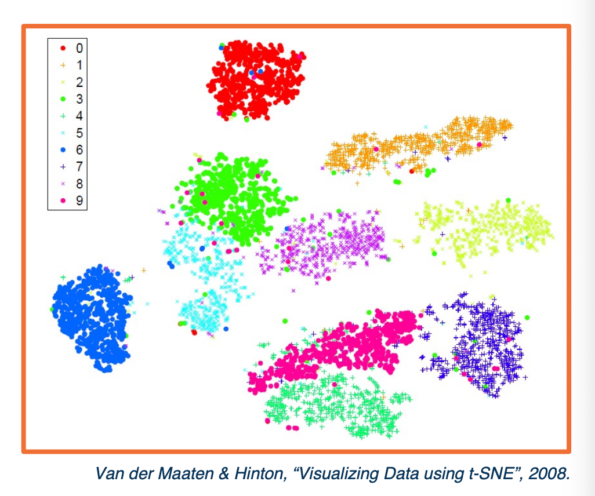
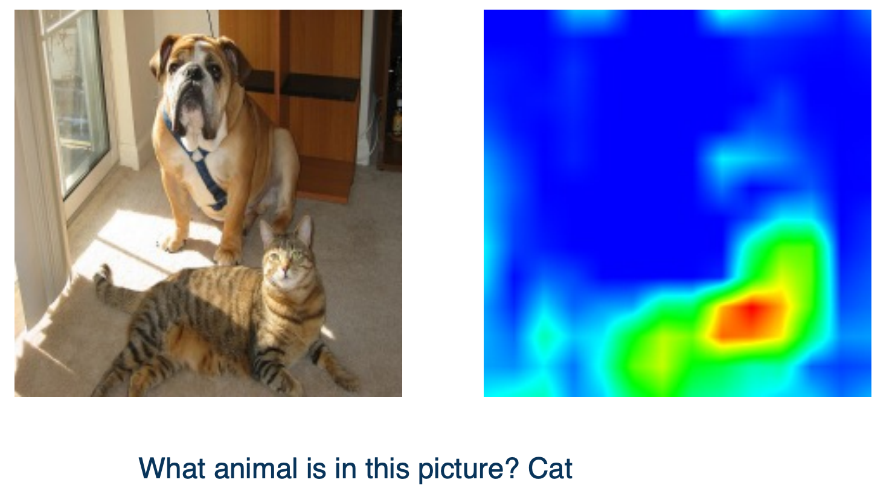
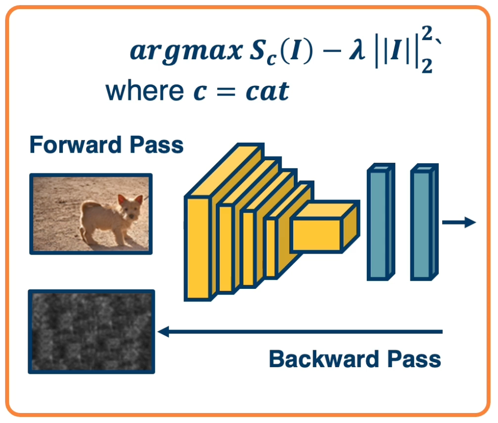
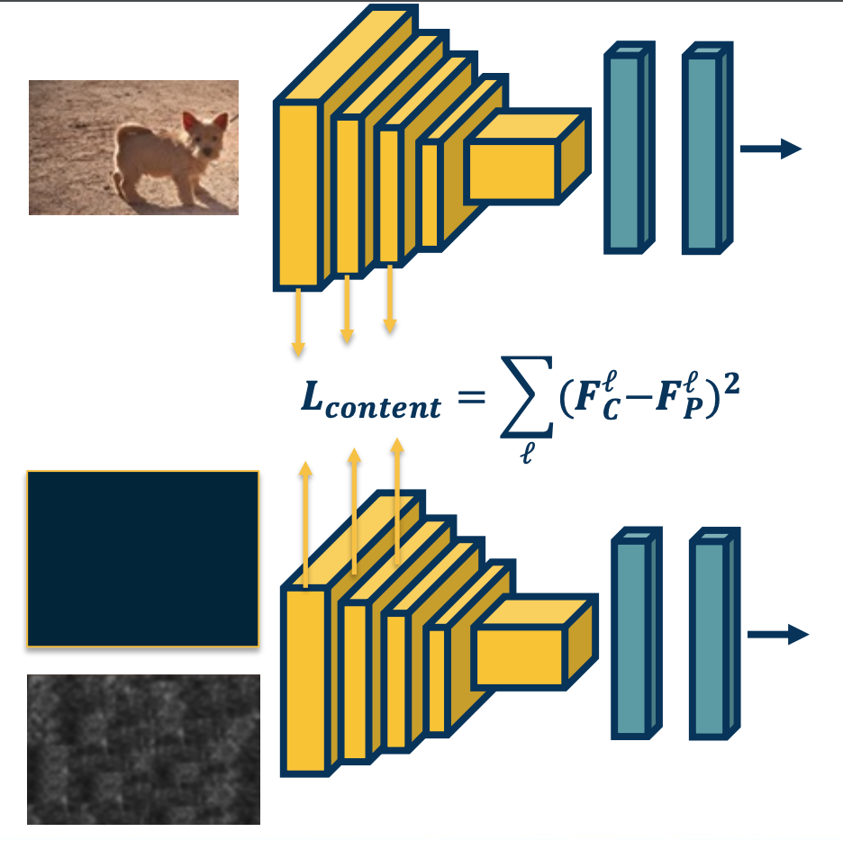

### Readings

* [Understanding Neural Networks Through Deep Visualization](https://arxiv.org/abs/1506.06579)
* [Grad-CAM: Visual Explanations from Deep Networks via Gradient-based Localization](https://arxiv.org/abs/1610.02391)

### Visualization of Neural Networks

Given a **trained** model, we like to understand what it learned. If you remember, all of the parameters of the neural network, both the convolution kernels as well as the fully connected layer weights, are all initialized to random values. After optimization, it should have found some set of good parameters that perform well on whatever task you trained it on.  

{: width='400' height='400'}

There are several ways to understand what is learned, even for simple linear classifiers. We have shown that we can take the learned weights, reshape them into images, and then plot them in a normalized way from zero to 255. This allows us to see rough templates of the objects, such as a car or a plane. 

{: width='200' height='100'}

For convolution layers, we can actually do a little bit better. The convolution layers parameters are the kernel weights themselves, and so we can visualize what the kernels look like. Again these kernels are strided across an image, and high responses mean that the image patches have roughly similar types of features as the kernel. Here we see one example where linear features such as different oriented edges are learned. 

{: width='200' height='200'}

We can also plot the activations after running a kernel across an image, you get an output/feature/activation map. These activation maps represent spatial locations with high values that are highly correlated with the kernel - we can plot them in a visual manner and try to understand what kind of features the neural network has learned. 

{: width='200' height='200'}

We can do more interesting things, gradients are the key bread and butter of deep neural networks. These are what is used to optimize the networks themselves. Using gradients or gradient statistics, will allow us to better understand what the network is learning. 

{: width='200' height='200'}

Finally, we can test various aspects of robustness for neural networks. For example we can try to see what are the weaknesses or biases of the neural network and use that to improve the performance. 

{: width='400' height='400'}

For fully connected layers, if the nodes are connected to the image itself, then you can actually just take the weights, and reshape them into the images. Since you have one weight per pixel, we know that the number of weights should be equivalent to the number of pixels, and we can reshape it and scale the values between zero to 255 which are valid pixel images. We can then visualize the results and you will see various rough templates for each of the objects. For example for a car, you can roughly see the bottom of the car which tends to have dark pixels. The hood which have reflections, the windows which have darker pixels again and so on. However if you have a complicated CNN, the fully connected layers at the end are not connected to the pixels. They are connected to output or feature maps from the last convolution layer - so you cannot visualize them as easily. 

Problem:

* 3x3 filters and small conv outputs are hard to interpret. 

Theres a link build by other students in gatech to visualize cnn found [here](https://poloclub.github.io/cnn-explainer/). 

#### Dimensionality Reduction: t-SNE

{: width='400' height='400'}

We can also take the activations of any layer (FC, conv) and **perform dimensionality reduction** and convert them into vectors. 

* Often reduce to two dimensions for plotting
* Can also use PCA
* or t-SNE
  * Performs non linear mapping to preserve pair-wise distances. 
  * Features vectors that are very similar according to some distance metric are shown together here in the two dimensional plot whereas feature vectors that are very different will end up very far apart. 

The above visualization is for the MNIST example where you have digits from 0 to 9, we can plot the different points in the two dimensions according to their categories based on their color. What you can see is they are pretty well separated after training - probably means we are able to learn a really good classifier. 

#### Summary and Caveats

While these methods provide **some** visually interpretable representations, they can be 
misleading or uninformative.

Assessing interpretability is difficult
* Requires user studies to show usefulness
* E.g. they allow a user to predict mistakes beforehand

Neural networks learn distributed representation
* (no one node represents a particular feature)
* This makes interpretation difficult

### Gradient-Based Visualizations

Backward pass gives us **Gradients** for all the layer that is the gradient of the loss with respect to that particular layer. This shows us how the loss changes as we perform small perturbations on those layers. While during optimization, we have only computed this for all the layers in the neural network, we can also do it with respect to the input as well. 

In other words, if we make small pixel changes in the image, how does the loss change? This can be **useful not just for optimization** but also to understand what was learned.
* Gradient of **loss** with respect to **all layers** (including input)
  * This allows us to understand the sensitivity of those particular features with respect to the loss function. 
  * Gradient of **any layer** with respect to **input** (by cutting off computation graph)

#### Gradient of loss w.r.t Image

{: width='400' height='400'}

**Idea**: We can back propagate all the way to the image. 
* Gives us some information about the sensitivity of the loss to individual pixel changes.
* Large sensitivity that is larger gradients implies important pixels
  * Because if we change these pixels in small ways, then it causes a change in the loss function
* These are often called **Saliency Maps** 
  * Because it shows us what we think the neural network might find important in the input.

In practice:
* Instead of finding the partial derivative of the loss with respect to the input, we will actually find the partial derivative of the classifier scored before the softmax with respect to the input. 
  * Why might this be the case?
    * Applying the softmax function and then the loss function actually adds some complexity. For example the neural network can actually reduce the scores of the other classes in order to increase the scores of the correct class after softmax. So this might introduce some weird effects in terms of the gradient. 
* Take the absolute value of the gradient.
  * We do not care which direction the loss function changes, all we care about is that the loss changes.
* We can also sum across all of the channels as well. 
  * So we do not care that a particular red channel in the image has this effect. What we care about is one particular pixel that represents parts of objects. 

#### Object segmentation for Free!

We can actually take the gradients and visualize them across the image as shown here, where darker values are smaller gradients and lighter values are larger gradient. 

{: width='400' height='400'}

What we will find is that higher gradients tend to corresponds to parts of the object that we are trying to classify. So we can actually apply traditional computer vision segmentation algorithms and try to find regions within this gradient image of values that are similar. (Try to group similar values together). When we apply this, we can actually get a segmentation mask of the object - we obtain which pixels in the image actually the object or correspond to the object.

This is a little surprising because during our supervision, we never gave it the segmentation masks. All we gave it was there is a particular type of object in this image, and out of that we actually get **object segmentation for free**, which is surprising because it is **not part of supervision**. 

#### Detecting Bias

We can use this to debug various issues, such as **detect dataset bias**. For example snow used to misclassify as wolf.
  * **Incorrect predictions** are also informative!

{: width='400' height='400'}
*The wolf white skin is detected as snow*

In the above example, the neural network just learn to classify the object based on the background, and when we plot the gradients, we see that the gradients and segmentation that results really focus on the snow, rather than an object we care about. 

#### Gradient of Activation with respect to Input

Rather than the derivative of the loss with respect to the input, we can also find the partial derivative of some random **activation** that we choose (at random) inside the network with respect to the input. We can run forward function only up until that layer and when we run backpropagation, we will actually get the gradient of this particular activation with respect to the input. This is the magic of back propagation and gradient descent across an arbitrary computation graph. 

Steps:
* Pick a neuron
* Find gradient of its activation w.r.t. input image
* Can first find highest activated image patches using its corresponding neuron (based on receptive field)

#### Guided Backprop

Now, the way we backpropagate gradient is obviously the right way to do it for things like optimization gradient but may not actually be the best for things like visualization.

For example, for visualization, we do not really necessarily care about negative influence. That is, you might have parts of an image that **decrease** feature activation and so when we find the gradients of the feature activations with respect to the image, we will get negative gradients 
* But there is probably many parts of the image that if perturbed will decrease particular features. 

So we may not want to visualize this aspect, we may only want positive influence visualized. So there is alot of different methods such as **guided backprop** that tried to approve this. Here is a visual depiction:

{: width='400' height='400'}

* On the top, you can see the forward pass. This is through a ReLU. 
* You can see that the negative values are zeroed out while the positive values are just passed as is. 
* When you do a backwards pass for the values that were negative in the input, you zeroed out those gradients. 

However, you can also change this a little bit by what is called a **deconvnet**.

Rather than just pass back the gradients as we described, we will take the gradients and only pass back the positive gradient. In other words we will remove the negative gradients (in yellow boxes) or negative influence because we may not want to visualize them. This changes the way we do backpropagation so we do what is called the **guided backpropagation** which combines both of these ideas (orange and yellow boxes). 
* Zero out both the forward pass and negative backwards gradient. 
* So only positive influences will be propagated. 

Here we see some examples of guided backpopgation:

{: width='400' height='400'}

First find the maximally activated patches as we described - find image patches that really activate particular features or kernels in the neural network that we care about. We can then visualize the gradients of the activations with respect to the input. 

We can see is a much nicer, clear results that really focus on the objects or the interesting parts of the image themselves. You can also see on the bottom when you do this for deeper parts of the network as you get larger receptive fields. 

So now let's use these methods to visualize the features that we learn across the different parrts of a network.  We will take VGG as an example and perform layer by layer visualizations.

{: width='400' height='400'}

Here we can see that layer one in the neural network learns very low level features such as edge orientation. Sometimes it also learn things like color or texture patterns such as repeated dots. 

{: width='400' height='400'}

In layer two, we see that actually these low level features such as edges are combined in order to find higher level features such as motifs. We also have more interesting color, texture or pattern.

{: width='400' height='400'}

In layer three, we get even more high level and abstract, we find things like wheels of a car or different parts of people.

{: width='400' height='400'}

Finally, in very deep convolution layers, it is actually finding entire object parts or entire objects themselves. 

#### Grad-CAM

As researchers began plotting saliency maps, more and more sophisticated methods were developed to understand what the neural network considers important. Here is one such method called **Grad-CAM**:

{: width='400' height='400'}
 
Given an image, we can feed it through a convolution neural network. We will take the feature maps of the last convolution layer. We do this because we think that the feature maps at end of the network will have more abstract or high level features that are important.  We can then have task specific networks such as fully connected layers for image classification. 

{: width='400' height='400'}

Given a particular class C, we can then back propagate to get the partial derivative of the class output that is the class score. We don't use probability with respect to the feature maps that care about. So we only backpropagate to the feature maps that we want. 

This results in a set of gradients in a set of gradients in the same shape as feature maps. If you remember in the feature maps, each channel corresponds to a particular kernel or filter. We try to weight them to find particular important channels as represented by high gradients and we will assign higher weights to those channels. Specifically we will use methods similar to attention mechanisms (that will learn later in the class). We will have a per channel waiting that is represented here as alpha. 

{: width='400' height='400'}

The way we will compute this is very simple, we will just do a global average pooling for each channel of the gradients. In other words, for each channel, we will sum up all the gradients across the channel of the gradients of the score with respect to the activations and normalize it. This results for each channel K a particular weighting. 

We will multiply the forward activations the feature maps by this weighting. So each channel will be multiplied by its corresponding weight.

{: width='400' height='400'}

We will also feed a ReLU activation function because we only care about positive features. This will result in this particular output where values that are important as represented by high gradients or channels that have high gradient will have higher values here.  

{: width='400' height='400'}

Note that this is not a method that specific to what the task is. We can calculate this for any task. And so what we actually also do is combine this grad cam output, which essentially is the feature maps weighted by their importance as represented by high gradients by the guided backpropagation output. 

So guided backpropagation as we discussed will result in again this output representing the gradients. When we multiply these together element wise, we will be doing is we are emphasizing parts of the guided backpropagation that are important - will reemphasize parts that corresponds to things like objects that are highly representative or affect the loss function greatly. This is called **guided Grad-CAM**. 

Here are some example outputs:

{: width='400' height='400'}

When the answer for the NN is a dog, the Grad-CAM shows the dog in the image.

{: width='400' height='400'}

But if the NN output cat since there are multiple animals in the picture, the Grad-CAM will emphasize the cat. 

So in summary,

* Gradients are important **not just for optimization**, but also for analyzing what neural networks **have learned**
* Standard backprop **not always the most informative** for visualization purposes
* Several ways to **modify the gradient flow** to improve visualization results

### Optimizing the Input Images

We can also optimize the image itself and get some interesting results. 

The key idea here is since we have already the gradients of the scores with respect to the inputs, can we *optimize the image itself to maximize the score*?
* We can perform gradient descent (or ascent) and modify the image using these gradients. 

Why?
* We can generate images from scratch. 
  * Start with a random image, apply the gradients over and over again, and actually generate interesting looking images.
* Adversarial examples
  * We can also start with a real image and apply the gradient.
  * We can actually do this for the score of the class that is not in the image. 
  * For example, we can choose elephant in this particular image and we can actually optimize the image in order to maximize this particular class.
    * It turns out that we can make a small number of modification to really fool the network. In the sense that the image will still look like a dog to humans, but with respect to the network it will confidently say that it is an elephant.

{: width='400' height='400'}

#### Gradient Ascent on the Scores

We can do this by performing **Gradient ascent** on the image. We can compute the gradient of the score for a particular class that we care about with respect to the input image. 

Rather than subtracting the learning rate times the gradient, we will add the learning rate times the gradient. This has the effect of maximizing the score.  

We can also have a regularization term ($-\lambda \lvert\lvert I \lvert\lvert^2$) - for example preferring smaller pixel values. Note that we are subtracting the regularization because we are performing ascent.

The full procedure:

* Start from a random/zero image, compute the forward pass, gradients, perform ascent and then iterate. 
* Note that we are using scores here so that we do not minimize other class scores after we compute softmax probabilities.
  * Here because we are using the raw scores themselves, the network is forced to directly increase the score for the class that we care about.  

Often we need some form of **regularization** to induce statistics of natural imagery
* e.g small pixel values, spatial smoothness.

{: width='400' height='400'}

You can observe that the particular objects that we wanted to maximize the score of appears in many different locations across the generated image, but it is cool that we can automatically generate images from scratch.

We can improve the results with **various tricks**:
* Perform clipping of small values and gradients.
* Can apply Gaussian blurring at various points in time across this optimization.

{: width='400' height='400'}

We can do this across the entire neural network - does not have to be maximizing particular output scores, we can maximize any activation anywhere in the neural network and try to see what are the images that maximize this. 

Here, we can see the particular types of features that the filters or kernels might be representing. 

In summary,

* We can optimize the input image to generate examples to increase class scores or activations
* This can show us a great deal about what examples (not in the training set) activate the network

### Testing Robustness

We will now focus on testing the robustness of neural networks to particular things like perturbation.
* We will also show how to generate adversarial images by optimizing the input. 

#### Gradient Ascent on the Scores Gone Wrong!

Rather than starting from zero image, what if we start from a real image? What if, in addition we optimize the score of an arbitrary incorrect class? 

{: width='400' height='400'}
*The image is a dog but we want to optimize for a cat*

Surprising result: You need very small amount of pixel changes to make the network confidently Wrong!

#### Example of Adversarial Noise

{: width='400' height='400'}

Here is an example of the perturbation that we can apply to make it confidently wrong - by adding the random noise and the network thinks with 99% confidence whereas to a human the image looks completely the same. 

Note, this problem is not specific to deep learning!
* Other methods also suffer from it
* Can show how **linearity** (even at the end) are susceptible to this as well.
  * For example, you can think about adding across a high dimensional set of values very small values per dimension such at the end when you add up the weighted summation, it actually ends up the wrong class. 

#### Variation of attacks

{: width='400' height='400'}

There is actually a range of attacks you can apply to attack deep learning. For example, researchers have shown that actually you can have single pixel attacks where literally you change one pixel in a ay to make the neural network wrong. 

There is also a range of types of information that you might or might not have available as an attacker. For example the method that we have talked about requires performing gradient ascent on the image using neural network. Clearly you have to know the architecture and the learned weights in order to do this. 

There are other black-box attacks where maybe all you can see are the predictions of the neural network and you can still try to generate or find images that fool it. There is also methods that poison the training data set and so on. 

Similar to other security-related areas, it’s an active cat-and-mouse game

Several defenses such as:
* Training with adversarial examples
* Perturbations, noise, or reencoding of inputs
  * therefore perturbations that have been found to work are no longer as effective.

There are **not universal methods** that are robust to all types of attacks. Unfortunately we still do not know how to make NN robust across all these types of attacks.

#### Other forms of robustness testing

We can also see how different types of perturbations affects performance and we can see this for different types of architectures. 

{: width='400' height='400'}

On the left you see a specialized corruption error metric that sums up the contributions across all the different types of corruption and shows this in a relative and non relative manner for many different types of architectures. The key point here is that the relative mean corruption error is actually relatively flat or slightly increasing, meaning that some of the architectures such as ResNet perform much better overall, but maybe are not as improved in terms of corruption. 

#### Shape vs Texture Bias

We can also try to understand the biases of CNN. 

{: width='400' height='400'}

An example of this is the shape and texture bias. We can take an image of a cat but change the texture to an elephant and humans will inevitability say that this is a cat. 
* However, CNN are much more bias toward saying that it is an elephant. 
  * meaning that they weigh more heavily towards texture and shapes. 

{: width='400' height='400'}

Something interesting is that all the NN are biased towards texture especially the ones that are much more effective such as ResNet are much more heavily bias towards textures compared to things like AlexNet which does not perform as well but have a much s tronger shape. 

In Summary, 

* Various ways to test the **robustness** and **biases** of neural networks
* Adversarial examples have **implications** for understanding and trusting them
* Exploring the **gain of different architectures** in terms of robustness and biases can also be used to understand what has been learned

### Style Transfer

Style transfer - Generate images that match the content of one particular image (based on the content) but also maintaining the overall style or texture of a style image. 

We can **generate images** through backpropagation. We can just forward pass through the network and then compute the gradients in the backward pass and apply those gradients. 
* Can apply **regularization** to ensure that we match image statistics.

But what if we want to preserve the content of some specific image during this generation process? One idea that we will be using is matching the features of **different layers** across the forward pass of this generated image as well as some content image that we want to replicate. We can also have a **loss** function for this in order to improve the generation. 

#### Matching Features to Replicate Content

We have an image, lets say of a dog that we want to replicate. We will feed that image through a CNN to extract the forward activations or the feature values across all the layers. We will then do for the image generation what we did before, we will take an image, let's say a zero image or a random image and also feed it through the convolutional neural network - and then we will try to have a loss that optimizes the image to minimize the difference between the features for the generated image and the features for the content image that we care about.

{: width='400' height='400'}

Here, we are showing the first layer, let's say we extract FC which is the content features for layer 1 and then we will subtract it from the features of the  generated image at layer 1. We will use that loss to back propagate - we will update the actual image, compute the gradients of this loss w.r.t to the image apply those gradients to the image.

If we are doing gradient descent, we are going to try to reduce this loss (minimize the difference in the feature space).

#### Multiple Content Losses

{: width='400' height='400'}

We can actually do this for many different layers - We just sum up the losses.

Because this is in a computation graph, when there are multiple backwards edges coming to the same node then you sum up the losses. Tus, we can just perform this loss function across all the different layers or whatever layers we choose and perform gradient descent. In other words, optimize or generate an image that minimizes this loss - thereby matching the image content and features across the entire neural network. 

#### Replicating Content and Style

What if we want to perform the same optimization - except that we want a content of one image and texture of another image? 

For example, we can take the dog image, compute the features, we can then take the generated image (or also taking a zero/random image and also compute the features). At the same time, we can take a style image, and also compute those features. Then, we just generate an image in the middle - compute the gradient of the loss with respect to the input for both losses and try to minimize both losses at the same time. We essentially want to match the content of the content image, and style of the style image. 

{: width='400' height='400'}

However, it is not clear what this loss function should be - We cannot just use the same loss that we did for the content because it is going to match the content of the second image as well. 

#### Representing Texture

* How do we represent similarity in terms of textures (and not content?). 
* There is a long history in image processing looking at these types of problems, specifically around texture generation.
  * Key ideas typically revolve around summary statistics.
    * For example higher order histograms  
  * Whatever statistics you use should remove most of the spatial information. 
    * Because we are interested in not the specific contours or shapes within the image,but just the texture or the style.

Deep Learning researchers have come up with what is called a **Gram matrix** and specifically it **features correlations** across different layers in the neural network. It turns out that these will be sufficiently represent something about texture such that if we match it during our image generation, we can actually  generate images with that style. 

#### Gram Matrices

{: width='400' height='400'}

Here how it works - We will take a particular layer in a convolutional neural network and have some set of feature maps. Here, this layer has 64 kernels, so the depth is 64. We will take a pair of channels within this feature map (represented here as i, j) and we will compute the correlation or dot product between the two feature maps.  
* Perform an element wise multiplication and  then sum it up across the entire channel. 

This single value will feed into a larger matrix that represents the correlation between all pairs of channels across this feature map. So the size of this matrix will be 64 by 64. 

In mathematical terms:

$$
G^l_S(i,j) = \sum_k F^l_S (i,k)F_S^l(j,j)
$$

Where $i,j$ are particular **channels** in the output map of layer $l$ and $k$ is the position (convert the map to a vector).

Then, we define a loss function that tries to minimize the difference of the squared difference between the gram matrices themselves. Here we will have a loss with respect to the style where we compute the difference between the gram matrix of the style image with respect to the gram matrix of the generated image.

$$
L_{style} = \sum_l (G_S^l - G_P^l)^2
$$

We will have two losses here, we will have the content loss which tries to match the feature themselves of the content image and the generated image - as well as the style which tries to match the Gram matrix between the style image and the generated image.  

$$
L_{total} = \alpha L_{content} + \beta L_{style}
$$

Like all cases when we have multiple losses, we will assign weights between them $\alpha,\beta$. The content loss and the style loss can be across multiple layers in the neural network not just one. 

{: width='400' height='400'}

Here is an example of a style transfer - you can see here it is really picking out the details. So the generated image does not have the details of the content but the actual texture or style is matching the particular style image that we have.

In summary,

* Generating images through optimization is a powerful concept!
* Besides fun and art, methods such as stylization also useful for understanding what the network has learned.
* Also useful for other things such as data augmentation
  
<!--  -->
