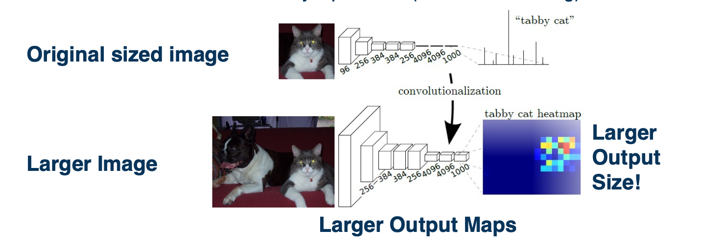
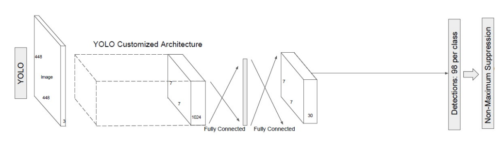

### Readings

* [Fully Convolutional Networks for Semantic Segmentation](https://arxiv.org/abs/1605.06211)

### Image Segmentation Networks

We will start moving beyond image classification where we take an image and output a probability distribution over the classes or categories. We will start talking about other computer vision tasks such as image segmentation or object detection. 

#### Computer Vision Tasks

{: width='400' height='400'}

Other tasks we may want to perform is semantic segmentation - we want the same probability distribution but for each particular pixel. Note that we are not distinguishing instances here (does not care whether the pixel belongs to same or different cars, we only care the pixel belongs to a car). 

{: width='400' height='400'}

We might want to do instant segmentation where we actually have a unique ID for each instance as well. 

{: width='400' height='400'}

Another task is object detection. We are not looking at individual pixels, but rather looking at bounding boxes. That is for each object in the scene, we want a bounding box around that object and a probability distribution over the categories. 

These are not always independent, sometimes network can combine to estimate all or some subset of 
them. 

#### Segmentation tasks

Given an image, we really want output another image.
* Each output contains the same width and height, but a class distribution per pixel. 
* This is more generally referred to as an image to image problem.
  * We have an input tensor with width and a height and a number of channels (typically 3 for regular RGB) and we want the output to essentially be another tensor with the same width and height because we are trying to classify each pixel and the depth is the number of categories. 

Here is a depiction of it looks like:

{: width='400' height='400'}

This is drastically different from what we have done before - thus far we have applied a CNN to an image and this creates downsampled feature maps at the end of the convolution layers and are then fed into fully connected layers. 

{: width='100' height='100'}

The CNN performs some dimensionality reduction both through convolution operations and also through pooling operation. The question is, how can we perform up sampling here? 
* We want to still extract meaningful, abstract high level features. 
* However, we want then convert those features into some estimates for these tensors.

#### Idea 1: Fully-Convolutional Network

One reason fully connected layers are not applicable to segmentation problems is that they throw away explicitly spatial information. The output of FC layers is in the form of vectors! They are no longer spatially organized, similar to how the images were. 

{: width='400' height='400'}

The neural network can still retain some spatial information, for example by learning weights that are specific to different regions of the output feature maps at the last convolution layer. But it certainly not an explicitly spatial representation.

Thus, one idea is just to get rid of fully connected layers all together - perhaps we can devise a fully convolutional neural network that does not have fully connected layers and maybe still output something resembling segmentation outputs.  

#### Converting FC Layers to Conv Layers

 
It turns out you can convert fully connected layers into a convolution operation. This is because convolution operations are very similar linear operations to fully connected layers as we have discussed before. 

What we can do is just take the fully connected output nodes and reshape them back into the same sizes. This can be seen as a convolution operation because we can just have the kernel be the same exact size of the input. 

{: width='400' height='400'}

If you see here there are some sets of output feature maps at the end of the last convolution layer. And then we will have kernels which are shown in blue with **the same exact size** as that input to the next layer. So rather than have a fully connected layer, we will have a fully connected convolutional hidden layer where each kernel is essentially representing each output node. 

This can be thought of just taking that kernel just dot product it was the entire input, and for that we get one scalar output. This is exactly equivalent to $Wx+b$ in the fully connected layer that we talked about. We can also do this for other layers as well. 

#### Same Kernel, Larger Input

Mathematically, the representation of a fully connected layer or a convolution layer where the kernel is the same size as the input are equivalent.

**Why would we want to do this trick?**

It turns out that this allows us to be no longer dependent on a particular input size and we will show how this is useful for segmentation. 

{: width='400' height='400'}

For example, suppose that we have an original input size here 5 by 5 image, and we have a kernel that we have learned a 3 by 3 image - and this results in an output size of 3 by 3. When we have a fully connected layer after this, or after we have converted it to a fully convolutional layer. We will have a kernel that is exactly the size of this output. So we will have a fully convolutional layer kernel that dot producted with that to produce one output node in the fully connected or fully convolutional layer. We can have multiple of these if we want multiple output nodes.

It turns out that if we feed it a larger input, as we know it, since it is normal convolution, the output map at the last convolutional layer will be bigger. This is because the convolution operation is defined by the striding operation and has nothing to do with a particular input size. So if we retain the same fully convolutional layer as before, we will now have a smaller classifier with respect to the new larger output sides. You could see that now we will have a larger output - a 3 by 3 from this fully convolutional layer kernel being strided across this new larger input. 

#### Inputting Larger Images

{: width='400' height='400'}

This matters because we actually just see this as striding a classifier across the larger outputs. We can actually use this to get a segmentation output. Specifically, we can take a smaller sized, lets say the normal image net classifier sizes which are typically 224 by 224, shown here where it says original size image and we just learn a normal CNN. It can have normal fully connected layers. 

We now feed it a larger image and we convert the fully connected layers to fully convolutional layers. We will just reshape those weights to be the size of the inputs. When we run this larger image through the CNN, we will get a larger output at the last convolutional layer and we will stride this original classifier that we learned and we will get multiple outputs. This corresponds to applying the classifier at different positions in the image. This is a very segmentation like output, that is for each position in the image, we get an output of what the class label is. Of course, the size of this heat map that is shown here on the right is going to be dependent on how much you are enlarging the input image size. 

If you only enlarge the input image size by a little bit,you will get a very tiny heat map. If we use much larger images, then we will get much larger heat maps -> Then we will essentially get a segmentation output, where each pixel in the image we can get what class or category in that image. 

Notice that we do not quite get every pixel here, since it is still down sampled, the output is still going to be smaller than the actual image. You could do various tricks such as upsample, apply normal image processing methods to take this heat map and resize it to the larger image size and achieve some probability distribution across the original image. 

#### Idea 2: “De”Convolution and UnPooling

Now, the fully convolutional neural network that we devised for segmentation is perhaps still not ideal. Even though it gets us some coarse segmentation output that we can then up sample, it is still not going to be that high resolution and we also have to feed in much larger images to get that output. 

{: width='400' height='400'}
*We can develop learnable or non-learnable up sampling layers!*

Instead, we could try a different idea. Here, we might think about how we can devise layers that actually perform up sampling rather than down sample? Traditionally when we looked at the convolution and max pooling layer, these resulted in smaller images at the output. We continue to apply this and got small feature maps by the end. This is called an **encoder** - we are encoding the image into highly relevant abstract features that are important for whatever task we want. 

{: width='400' height='400'}

So, we could try to think about how to develop what is called a decoder. That is, we want to take in those small feature maps, which represents very important features and try to use them to up sample - to generate more and more high resolution outputs that eventually are the size of the original input image. This is called an encoder-decoder architecture. We will see these both in computer vision as well as natural language processing and other applications.

Now, how can we actually do this? It turns out we can actually do some sorts of inverses of the traditional layers that we had. 
* **transpose convolution** or loosely termed deconvolution
* unpooling layer
  * does something slightly similar but results in a larger output rather than a smaller output.

#### Max Unpooling

Remember this is max pooling:

$$
X = \begin{bmatrix}
120 & 150 & 120 \\
100 & 50 & 110 \\
25 & 25 & 10 \\
\end{bmatrix} 

\xrightarrow{\text{2x2 max pool}}

Y = \begin{bmatrix}
150 & 150 \\
100 & 110
\end{bmatrix}
$$

The idea in unpooling, we copy the value to position chosen as max in encoder, fill reset of this window with zeros. For example:

*  $y(0,0)$ is from $x(0,1)$
*  $y(0,1)$ is from $x(0,1)$
*  $y(1,0)$ is from $x(1,0)$
*  $y(1,1)$ is from $x(1,2)$

At the decoder step:

$$
X = \begin{bmatrix}
300 & 450 \\
100 & 250 \\
\end{bmatrix} 

\xrightarrow{\text{2x2 max unpool}}

Y = \begin{bmatrix}
0 & 300+450 & 0 \\
100 & 0 & 250 \\
0 & 0 & 0 \\
\end{bmatrix}
$$

Notes:
* For windows that overlap that have the sam max indices in the same spot, we will just sum them up.

#### Symmetry in Encoder/Decoder

{: width='400' height='400'}

You might wonder - What does it mean to have a pooling and unpooling layer correspond? What we are going to do is we are going to have an encoder, which may consist of multiple convolution and pooling layers and then have a decoder that are symmetric to the encoder. In other words, the architecture of the decoder will be completely the reverse of the architecture of the encoder. 

The result is essentially an architecture that allows us to do unpooling across the layers by remembering the locations of the corresponding Boolean. 

#### “De”Convolution (Transposed Convolution)

One issue with max unpooling layer is there are no learnable parameters. So we are not really learning how to upsample. All we are doing is taking the max indicies in the encoder stage and applying them at the decoder stage to upsample images. The next question is, can we actually apply a similar operation as a convolution where you have a learnable kernel and perform upsampling? 

**Transposed Convolution (also known as "deconvolution", fractionally strided conv)** - Take each input pixel, multiply by learnable kernel and "stamp" it on output.

(Note, deconvolution is not a great name because it means something very specific mathematically that is different from what we are doing here)

#### Transposed Convolution Example

Given the following:

$$
X = \begin{bmatrix}
120 & 150 & 120 \\
100 & 50 & 110 \\
25 & 25 & 10 \\
\end{bmatrix} 

K = \begin{bmatrix}
1 & -1 \\
2 & -2
\end{bmatrix}
$$

After we incorporate $X(0,0)$ - i.e we take the $X(0,0) \cdot K$ and "stamp" it on the output.

$$
\begin{bmatrix}
120 & - 120 & 0 & 0 \\
240 & -240 & 0 & 0 \\
0 & 0 & 0 & 0 \\ 
0 & 0 & 0 & 0 \\ 
\end{bmatrix}
$$

and we incorporate $X(0,1)$, take $X(0,1) \cdot K$ and also stamp it:

$$
\begin{bmatrix}
120 & - 120+150 & -150 & 0 \\
240 & -240 + 300 & -300 & 0 \\
0 & 0 & 0 & 0 \\ 
0 & 0 & 0 & 0 \\ 
\end{bmatrix}
$$

and so on. Again, contributions from multiple windows are also summed.

#### Symmetry in Encoder/Decoder Part 2

{: width='400' height='400'}

Because we have a symmetric encoder and decoder, we can actually do two variants of this. 

* The first is to have the kernel learned and the kernel values will be learnable parameters and we can backpropagate through them.
* The other alternative is actually to not learn the kernels at the deconvolution or decoder stage. What we can do is take for each deconvolution layer, take the corresponding mirrored convolution layer in the encoder and then take that kernel that was learned or those kernels that were learned and flip them 180 degrees and then apply them in the decoder. 

These two variants exists but typically the kernels are learned. 

#### Transfer Learning

{: width='400' height='400'}

Because we are using a normal convolution neural network for the encoder, we can actually use transfer learning here again. We can train a convolutional neural network for image classification, let's say on a large dataset such as image net (which has 1 million examples over 1000 object categories), and optimize those weights for the image classification loss. We can then take those learned weights and copy them to the encoder and we can mirror the architecture for the decoder and initialize those randomly. 

Then we can jointly optimize the encoder and decoder given ground truth if we have it, for a segmentation task. Note that we will also use cross entropy, except that we have a probability distribution over the categories for each pixel. So we will have that many losses that all get into the optimization during backpropagation. 

#### U-net

You can also use alot of the ideas that we had for image classification. For example, residual neural networks use the idea of skip connections. We can also do this for encoder-decoder networks. This is what is called a U-net.

{: width='400' height='400'}

It is the same thing as what we had before, we have an encoder part and then some bottleneck features and then we have a decoder part. Except here we are not using only the bottleneck features. We can have skip connections where you take the feature maps from various parts of the encoder and actually concatenate them with various parts of the decoder. What you are doing here is combining information both from the encoder at multiple scales that is at multiple resolutions of information because the feature maps get smaller and smaller and you are combining that with the upsampling that we do for the decoder. This is a very successful architecture for various types of segmentation tasks. 

In summary,

* Various ways to get image-like outputs, for example to predict segmentations of input images
* Fully convolutional layers essentially apply the striding idea to the output classifiers, supporting arbitrary input sizes
  * (without output size requiring particular input size)
* We can have various upsampling layers that actually increase the size
* Encoder/decoder architectures are popular ways to leverage these to perform general image-to-image tasks

### Single-Stage Object Detection

We will talk about Object detection and specifically single stage methods, that take images try to directly output a set of bounding boxes with predictions for each of them. 

#### Object Detection Tasks

Given an image and we want to output a list of bounding boxes with probability distribution over classes per box. 

There are several problems here: 
* Variable number of boxes
  * Do not know how many objects will appear in these images.
* Need to determine candidate regions first
  * Where are they in positions and scales of the different possible object location in the image

We can make architectural changes in order to make this happen. For example, we can use the same idea of fully-convolutional neural networks
* Use imageNet pre-trained models as backbone (e.g taking in 224 x 224 image)
* And then we can feed in a larger image and classifications for different windows in the image.

But we are only getting the probability distribution over the classes at the end! We are not looking for a probability distribution over the classes for each pixel. What we want is actually an estimate of the bounding box. (A bounding box is where the upper left corner of this object starts and the width and height of the object which is one representation for a bounding box). You can have four numbers representing this bounding box, x,y,h,w. 

{: width='400' height='400'}

What we can do is to have a multi-headed architecture. 
* One part predicting distribution over class labels (classification)
* One part predicting a bounding box for each image region (regression)
  * Refinement to fit the object better (outputs 4 numbers)
* Both heads share features! Jointly optimized (summing gradients)
  * We can tie these things in the same joint computation graph and optimize for both the classification task and regression task for bounding boxes.
  * This will imply that we have two loss function.
    * For regression we can use MSE.
    * We can then use a weights to average the two loss function.

This is what it will look like:

{: width='400' height='400'}

We will actually feed in multiple images of the same thing, but at different scales. That is will take the same image and either downsample or upsample it, using traditional image processing methods. We will feed all of these into the fully convolutional neural network. For each of those, it will give us across some gridded pattern, a set of predictions for each grid element, which has classification probability distribution, as well as regression to a bounding box that is x,y, width and height. 

What you will notice here is first of all it is gritted because of the fact that we are using a fully convolutional neural network and it results in small feature maps at the last convolution layer, and we are essentially striding a classifier or regressor across that small feature map. Thus, by definition, it will essentially lead to grids in the input image, when we figure out what receptive field each of those convolution feature maps have. Another thing oyu will notice is that this may again low resolution similar to before, the output is really going to be a set of heat maps. This may be too low resolution for things like object detection. 

There is going to be a bunch of tricks in this [paper](https://arxiv.org/abs/1312.6229) that you can look at that actually tries to make this higher resolution outputs (decrease subsampling ratio). Another thing to mention is that you will have lots of different bounding boxes and many of them may have low probabilities for different objects, so you might be able to filter them out. But in the end you will have multiple bounding boxes, especially around actual object.

In computer vision, there is a whole set of techniques that take a lot of different predictions in similar locations all with probabilities associated with them, and combines it into one or few actual boxes. This is called **Non-Maximal Suppression (NMS)**.

#### Single-Shot Detector (SSD) 

Over the years, a number of refinements have been made over these architectures. For example the single shot detector or SSD. SSD use a similar idea of **grids** as anchors, with different scales and aspect ratios around them. 

SSD will impose a grid over the input image, and this corresponds to some grid over the convolutional feature maps at that last convolution layer. And then for each position in that grid will actually estimate some set of bounding boxes of particular shapes or aspect ratios. (This is a pure hyperparameter).

{: width='400' height='400'}

In the image above, there is four different bounding boxes here as dotted lines that we estimate. Then, for each of those bounding boxes, we estimate refine bounding box (x,y,width,height) as an output of a neural network as well as a confidence that is probability distribution over classes. Because we have a fixed number of these, because the grid is a fixed number of elements, and each grid location has a fixed number of bounding boxes around which we estimate this. You can actually just have one big neural network that outputs this directly: 

So there is various tricks that you can use to increase the resolution of this, such as skip connection or multi resolution idea as well. Here you will notice you actually estimate these across a number of bounding boxes in different layers. You do not actually impose this grid on one particular feature maps but actually impose this on multiple feature maps across the depth of  the network. So closer to the input you will have higher resolution one since the larger size outputs allow you to do that. Whereas deeper inside the network,  your convolutional neural output maps are much smaller, and so your predictions are going to be smaller as well. You then combine all of the predictions that the neural network makes across all of the different layers and then you perform non maximal suppression. In this case if you notice you will have 8732, a fixed number of prediction and you can apply NMS to that to produce a small number of bounding boxes, for example around the cat and the dog. 

#### YOLO

{: width='400' height='400'}

There are also other architectures such as YOLO (you only look once) that has a similar idea. You have an input image and you want to essentially make predictions for each grid location across those images or across the feature maps. In this case, the only difference is that we are going to use some customized architecture. SSD actually uses a convolutional neural network backbone that is pre trained on ImageNet such as resnet, but in yolo there is a custom architecture that eventually leads to a fully connected layer, making predictions for a fixed number of grid locations. 

{: width='400' height='400'}

There are various trade offs between accuracy and computation across all of these architectures.

#### Datasets

The way we evaluate these through large data sets. There is a dataset called COCO which has a lot more objects per image. Imagenet typically just has one while COCO have somewhere between 3 to 7 objects per image. There are  alot more data and categories in COCO, 80 compared to prior object detection datasets such as Pascal VOC. 

{: width='400' height='400'}

Here you can see a distribution or histogram across all of these different categories.
#### Evaluation – Mean Average Precision (mAP)

There is also various ways to perform evaluation. In the case of bounding boxes the metrics are much more complicated.

{: width='400' height='400'}

Here is one example:

*  For each bounding box, calculate intersection over union (IoU)
*  Keep only those with IoU > threshold (e.g. 0.5)
*  Calculate precision/recall curve across classification probability threshold
*  Calculate average precision (AP) over recall of [0, 0.1, 0.2,…, 1.0]
  *  e.g at each recall point, calculate the precision and store them in an array and average input.
*  Average over all categories to get mean Average Precision (mAP)
   *  Higher is better

Over many years, many different architectures have been developed - there is lots of trade offs that you can make. Typically these represent on the x-axis some form of computation complexity either flops floating operation per second (FLOPS) or frames per second (FPS). On the Y-axis you could show the mean average precision. 

{: width='400' height='400'}

There is various types of architectures such as the YOLOs which have pretty good trade offs. There is a new variant called PP-YOLO which came out in 2020 that also has a pretty good trade off, you can go up to 130 frames per second on a good GPU. There is also new architectures based on efficient net.

### Two-Stage Object Detectors

#### R-CNN

#### Extracting Region Proposal

#### Inefficiency of R-CNN 

#### Fast R-CNN

#### ROI Pooling

<!--  -->
