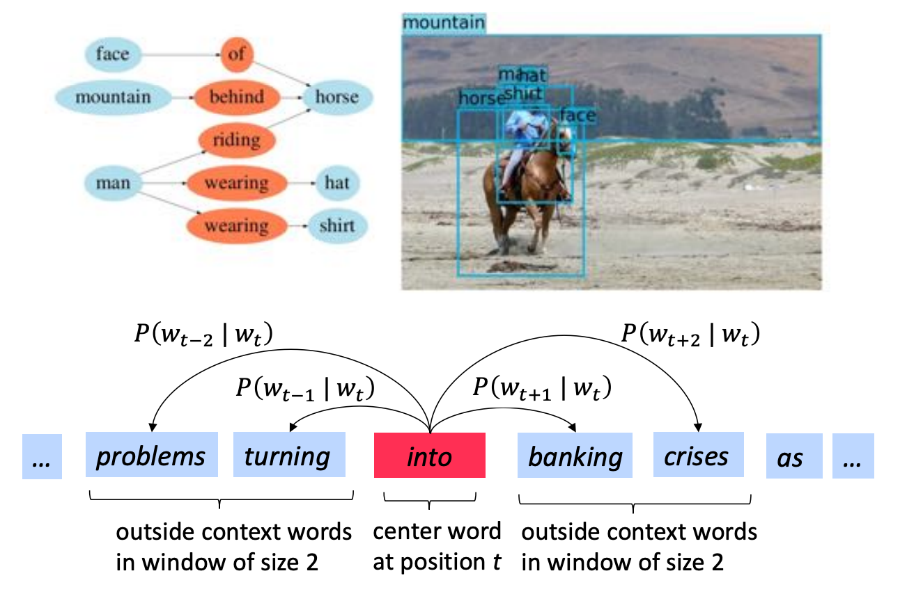
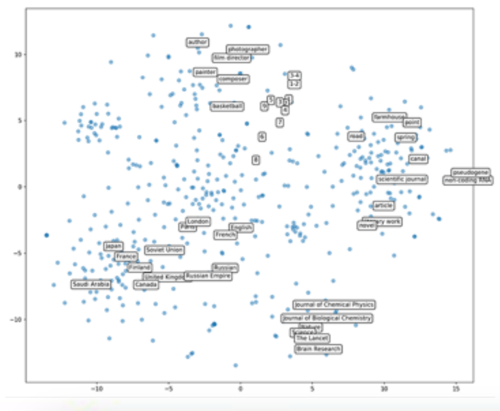
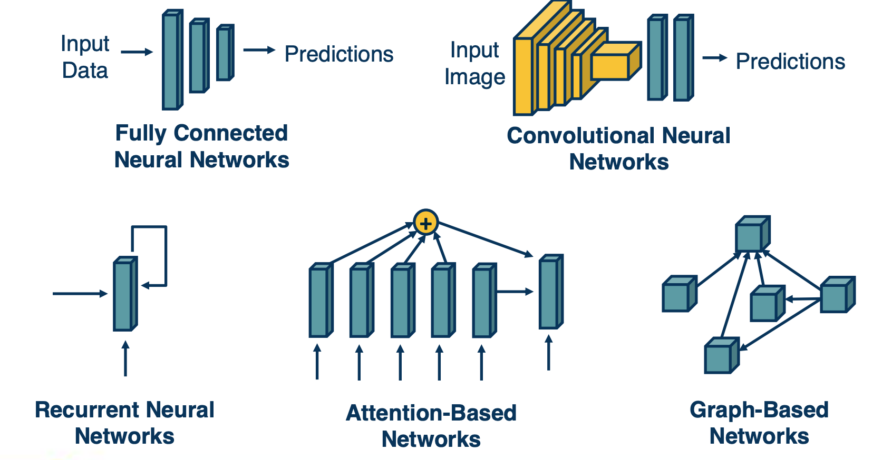
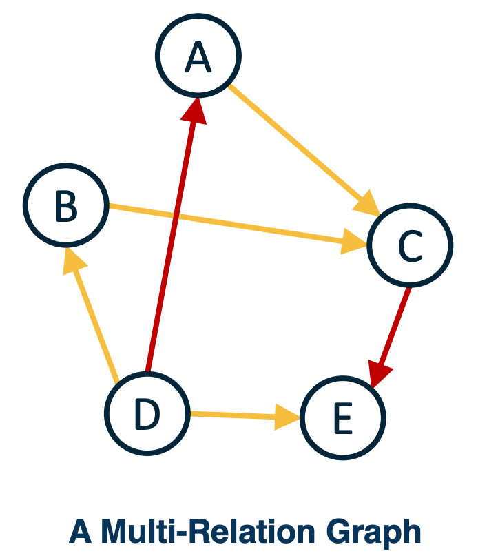
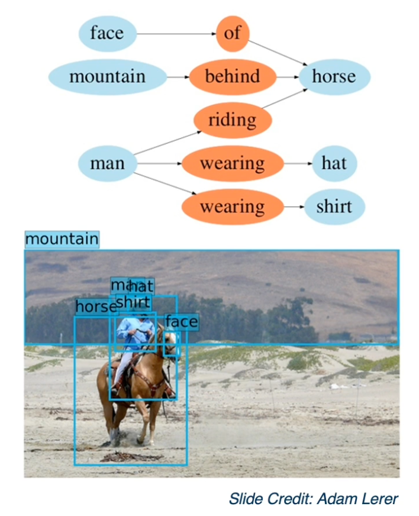
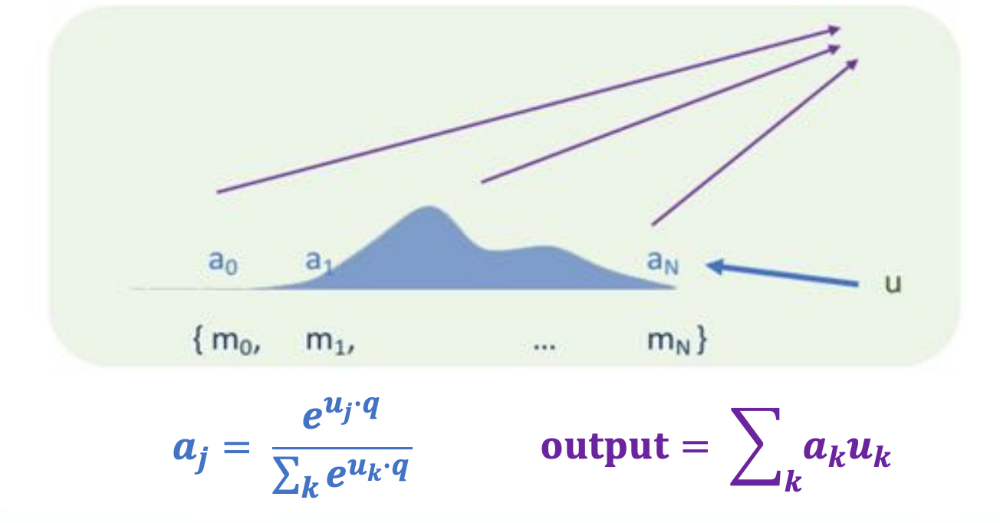
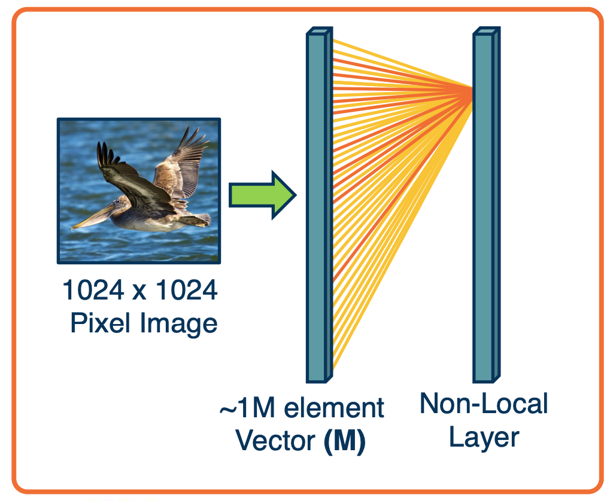
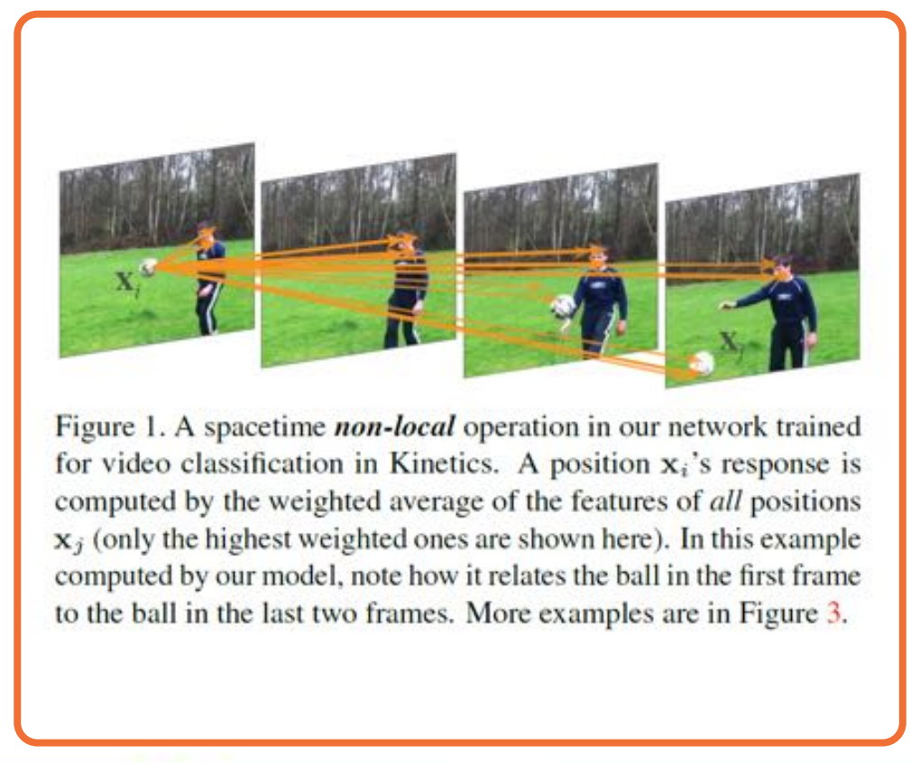

### Readings

None!

### Structures and Structured Representations

#### Relationships are important

The structures that we want to model, such as relationships between different elements, may be higher level than each different modality. For example, we may want to model the relationship between different elements in a scene. 

{: width='400' height='400'}
*This is a scene graph*

We want a graph representation where each node can be an object or an object part and we want to model the spat al or other types of relationship between them, in this case showing that the man is wearing a hat and and the mountain is behind the horse. 

This similarly occurs in language, where we may want to model more than just the sequential structure in a particular sentence. We may want to model different interrelationships between the words, for example being able to model which words come across which contexts, or being able to model things like parse trees or grammatical structures.

#### Relationships are Everywhere

The structures that we want to represent may go even higher level than that. We may want to represent all concepts in the world.

{: width='400' height='400'}
*https://github.com/facebookresearch/PyTorch-BigGraph*

This shows a data set called Wikidata, which has elements such as people, places, occupations and so on and maybe even has information about relationships such as a person can be an author. We may want to learn feature vector representations for each nodes in this. For example each element here, each data point might have an associated feature vector representation. And this feature vector should represent the structure in some way. For example, things that are conceptually similar should also be similar or close by in terms of their feature vectors. Maybe we can also explicitly represent this as a graph. That is we can have nodes and edges, where edges represent some sorts of relationships or similarity. 

#### The Space of Architectures

If you think about it, the current architectures we have discussed, fully connected layers and convolution neural networks, cannot really represent these kind of structures. In some case, convolution layers do add architectural biases in terms of connectivities. That is based on our knowledge of computer vision, we add some bias in terms of how nodes are connected to the image. But what we want is something more general, that is a general method to represent relationships between different items, and we want to do this in a learnable way. That is we do not want to impose connectivity patterns for particular domains. We want to just have some representation that can hopefully learn this connectivity pattern, given the particular data and the structure in it. 

{: width='400' height='400'}

And so we will talk about various forms of architectural biases that researchers have developed. Ranging from recurrent neural networks, which are typically designed for things like sequential data to more general attention-based mechanisms that can up or downweight a whole range of elements in a set. And this can be an ordered set, such as language, or it can be arbitrary set of different unordered items. And we can generalize this even further to a graph representation, where we explicitly model nodes in this graph and their feature vectors, and then represents the neighborhood of that node and we are able to use that structure to refine the features to represent not just local features, but also features of the neighborhood.

#### Graph Embeddings

In other words, graphs are the more general way to look at this. 

{: width='300' height='300'}
 
* **Embedding**: A learned map from entities to vectors of numbers that encodes similarity:
  * We can have embeddings or vectors, for each node - we already know how to do this for images, we feed it through a pre-trained CNN, we can also do this for things like words. In general we can come up with embeddings or vector representations for anything. 
  * Once we have these embeddings, we can represent them as a graph where the nodes are feature vectors and the edges represent some sort of connectivity or similarity. 
* **Graph Embedding**: Optimize the objective that connected nodes have more similar embeddings than unconnected nodes via gradient descent.
  * For example C we can find the input nodes (A,B in the above graph) that are similar in terms of some type of relationship, and this can be multiple types of edges. For example we can represent in that computer vision image example, something being on top of the horse, or something being in front or behind and these can be different types of edges. 

#### Propagating Information

When representing structured information, several things are important:

* **State**: Compactly representing all the data we have processed thus far. 
  * In the beginning this is just the different nodes or elements that occur in this image. For example the mountain, the man, the horse can all have features associated with them extracted from a CNN and a object detector. So each of these regions of interest have associated features to them.
* **Neighborhoods**: What other elements to incorporate?
    *  We have things like neighborhoods, which represent what other elements to incorporate, these are edges in the graph. For example should a man and a horse be connected for this image, and if so, through what relationship? Typically, we do things like similarity relationships, although in this case, you can also see other things like spatial relationships or verbs that one element is performing on the other.
    *  Once we have the nodes and the relationships (edges), we can propagate information. What we want to do is represent as a vector the notion that the man is riding a horse. Its not just a man or a horse, it is two interconnected objects and we may want to have a representation vector that represents that relationship.
  * Can be seen as selecting from a set of elements
  * Typically done with some similarity measure or attention
* **Propagation of information**: How to update information given selected elements
  *  And so what we will do is through the nodes and the edges, perform some functions or computations in the computation graph that combines these different vectors together in a special way that we will see. For example, a weighted summation in order to come up with a new vector that represents not just individual terms but also the items as seen through their relationships. This is essentially a problem of **propagating the information**.

{: width='200' height='300'}

The above is an example of an image. Similarly, in language you will have a set of words that will read through the document, and we will have a state representation that will track through the sentence. And in that case, it is not a complex graph structure, its just a flat linear sequential structure. But concepts that we will learn actually will relate to all of these different types of forms of structures.

#### Differentiably Selecting a Vector from a Set

One of the key elements for how to update the representation of a particular node based on its neighborhood,  or some other sets of elements is what is called an **attention** mechanism. And since we want to have a differentiable attention mechanism, typically, we will use things like softmax functions. Specifically, given a set of other vectors that we want to weight up down based on the current node that we are representing, we will essentially do a dot product between our current node and all the other nodes, and then have a softmax function on top of that to convert it to a probability distribution. In that way, you are weighting all the nodes, and  and then we will actually compute a weighted summation of all the other nodes and use that to refine this particular node's representation.  

{: width='400' height='400'}

* Given a set of vectors $\{u_1,...,u_N\}$ and a "query vector $q$,
* We can select the most similar vector to $q$ via $p = softmax(Uq)$

This notion of attention is extremely powerful, because it allows you to represent some arbitrarily sets of information, and this set can be any size. You can apply the softmax function to any sized set, and you can then automatically use that to weight and combine information. And so, again, this can be applied to all manners of structures. this can be applied to sequential structures, where, you are reading a sentence, and translate it to a different language. You can essentially look at arbitrary past words and weight them up and down every time you are converting it to a new word in the target language. 

Similarly, you can apply this to graph structure, such that every time you process a node, you can find the weighting or similarity to all its neighbors and use a k-nearest neighbor-type refinement, except in a fully learnable way.  

#### Example: Non-Local Neural Networks

Now we have talked pretty generally about structured representations and relationships between different item. And so, we will make this much more concrete as we move forward and we will talk about specific structures, representations and application such as natural language processing.  

However, lets start with a simple example that relates nicely to convolution layers:

{: width='200' height='200'}

If you remember, convolution layers were developed because it did not make sense to connect an output pixel to all input pixels across a high-dimensional image or feature map. This is because we know that we will probably want to extract local features, edges, and so on, and that does not require tying it to the entire set of pixels. 

However, we can actually generalize this and allow the network to learn its own connectivity pattern through an attention-like mechanism. This is what is called a non-local neural network. This is called non-local because unlike convolution layers, you do not have for each output node a very specific local receptive field. Instead, what you will have is the equations on the upper as follows:

Specifically, to compute the output $y_i$ - that is the pixel $i$ and the output $y$, we will sum up over all possible inputs g. So this is very similar to a fully connected neural network. Except that inside the summation, we will have a weighted summation, we will have a weighting factor, a multiplication factor, between two functions $f$ and $g$. 

$$
y_i = \frac{1}{C(x)}\sum_{\forall_j} f(x_i,x_j)g(x_j)
$$

Now, $g(x_j)$ is just extracting some set of features from the input $x_j$. The function $f$ is a binary function that takes both $x_i,x_j$ because we are computing the output at $y_i$. What we are going is we are going to compute a similarity between $x_i, x_j$ and we are going to modulate the contribution of the features from $x_j$ by that similarity.  

* Examples:
  * $f(x_i,x_j) = e^{x_i^T x_j}$
  * $g(x_j) = W_gx_j$

Specifically for $f(x_i,x_j)$, what we will have is just a Gaussian around the similarity, in this case, just a dot product. A dot product is just an unnormalized cosine similarity. And so what we are doing is we are saying how similar are $x_i$ and $x_j$, and then we are exponentiating. High values means that $x_i$ and $x_j$ are very similar, and low values will mean that they are not that similar. The function $g(x_j)$ is just extracting features, in just a linear way. You just have a $W_g \times x_j$, will be modulated by the similarity function. The output $y_i$ is just the weighted summation across all $j$ and the weighting is dynamically computed based on the data. That is you are computing the similarity function $f(x_k,x_j)$ dynamically. 

You might wonder, why is this different from a fully connected layer? The fact that you are doing this dynamically is the key part that makes it different, because when you are doing a fully connected layer, the weights are not dynamic. That is, you learn the weights, and then you apply those weights regardless of the input, they are not data-dependent. In this case, the similarity function $f(x_i,x_j)$ is data-dependent. So you are modulating the inputs in a data-dependent manner, and this makes all the difference. 

It allows the network to, in effect, learn the connectivity pattern, learn for each piece of data what is important, and then sum up the contribution across those pieces of data in order to form the output representation. 

{: width='400' height='400'}

Here is an example from the paper showing what was learned. This shows arrows across, not just space but also time. One of the interesting things is this summation across j can be not just for the current input, but it can also be the input across time. 

And so what we can see is that the arrows with high weights are visualized, whereas all of the connectivity that is ignored is not shown here.  And so the red arrows represent high similarity function. What you will want to see  if you want to, for example, take a video, which consists of many different frames, and you want to extract what activity is being performed in the video such as playing soccer or kicking, then you allow the neural network to automatically figure out which pixels to pull from across space and time in order to combine those features into an overall representation that at the end, you can use to classify. 

Again, this shows the power of attention-based mechanisms to automatically and dynamically in a data-dependent way, figure out what's important in the input. And it can do this in a way thats not specific to how many there are. If you notice, this function does not actually depend on anything about how many of $x_j$'s we choose from. And so, if you learn this particular neural network, non-local neural network, you can actually apply it to all sorts of other image sizes and so on. This is the power of attention mechanisms in representing relationships between different types of things and we can apply the same type of ideas for representing the relationships between words in a piece of text or between different nodes in a large graph. 

<!--  -->
