### Readings

[DL Book: Sequential Modeling and Recurrent Neural Networks (RNNs)](https://www.deeplearningbook.org/contents/rnn.html)

### Language Modeling: Part 1

Language modeling is the task of determining a probability distribution of a sequence of words, such as the one in the example: $p(\text{"I eat an apple"})$. A language model would also let us compare  probabilities between different sequences of words, allowing us to determine which of the two sequences is more likely: 

$$
p(\text{"I eat an apple"}) > p(\text{"Dromiceiomimus does yoga with T-rex"})
$$

But still, even assuming we managed to do this with real text, instead of with the silly examples, what would that achieve? 

Before we explore real world applications, let us drive abit deeper into how we would mdoel this probabilities mathematically, which will help us motivate the applications. 

Let us define the problem abit more rigorously given a sequence s of words, which we can decompose into $w_1, ..., w_n$.  We are seeking to estimate its probability, We can expand this into a product of many terms, namely the probability of the first word times the probability of the second given the first times the probability of the third, even the first two and so on:

$$
\begin{aligned}
p(s) &= p(w_1,...,.w_n) \\
&= p(w_1)p(w_2|w_1)p(w_3|w_1,w_2)\dots p(w_n|w_{n-1},\dots,w_1)\\
&= \prod_i p( \underbrace{w_1}_{next word} | \underbrace{w_{i-1}, ..., w_1}_{history})
\end{aligned}
$$

Note that all is done is to simply apply the chain rule of probability, so this is very general. In other words, all we have is a product of conditional probabilities over the variable $i$, which indexes our words. After the first term which trivially reduces to the probability of the first word, these terms can be interpreted as the probability of the following word given all of the previous words. 

The sequential construction helps us see how language models are, infact generative models of language. Indeed, we can easily new sequences of words with it, starting from a history of past words, which could simply be empty, if we are at the beginning of a sentence. 

We can repeatedly generate new ones by randomly sampling from the conditional probability of the next word, given the history. 

#### Applications of Language Modeling

* Predictive typing
  * In search fields
  * For keyboards
  * For assisted typing, e.g sentence completion
* Automatic Speech recognition
  * How likely is the user to have said `My hair is wet` vs `My hairy sweat`?
* Basic grammar correction
  * $p(\text{They're happy together}) > p(\text{their happy together})$

#### Conditional Language Models

Standard language Modeling:

$$
p(\textbf{s}) = \prod_i p(w_i|w_{i-1},\dots,w_1)
$$

A related problem - **Conditional language modeling**, and it is extremely useful and has a ton of applications. 

$$
p(\textbf{s} | c) = \prod_i p(w_i|c, w_{i-1},\dots,w_1)
$$

Like a language model, but conditioned on extra context $C$.

Some examples:

* Topic-aware language model: c = the topic, s = text.
* Text summarization: c = a long document, s = its summary
* Machine translation: c = French text, s = English Text
* Image Captioning: c = an image, s = its computation.
* Optical character recognition: c = image of a line, s = its content
* Speech recognition: c = a recording, s = its content

### Recurrent Neural Networks: Part 1

RNN is a class of neural architectures which are designed to model sequences.

Why Model Sequences?
* Audio Signal
* Optical Character Recognition (OCR)
* Sentiment analysis

#### Sequence Modeling

* Many to Many: Speech recognition, OCR
* Many to one: Sentiment analysis, topic classification
* One to many, many to one. 

#### How to feed words to an RNN?

As a first approach, we can just use a **one-hot** vector representation, where all entries of a vector are **zero**, except for the entry corresponding to the word's index, which is **one**. 

#### Modeling Sequences with MLPs

So how do we build a neural network that can process inputs which are sequences? We can try using a multi layer perception, the input would be the word vectors and we would train the network to perform sentiment analysis.

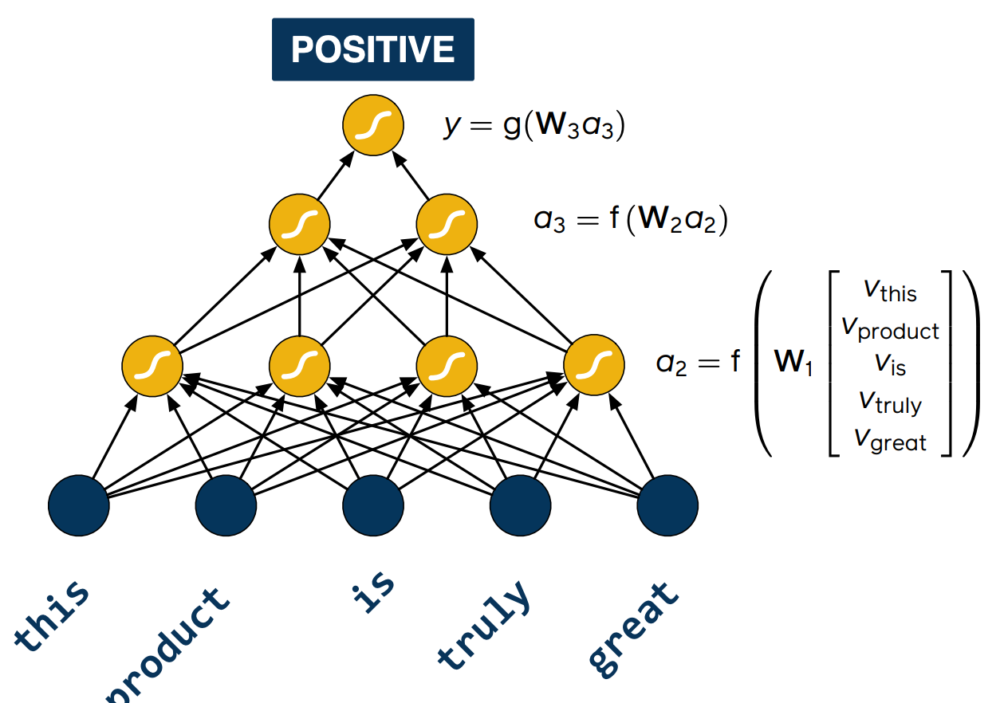{: width='400' height='400'}

However, we quickly run into problems the moment we try to feed in a different sentence to a network. The sentence here is the wrong length for the network, so what do we do with the words that do not fit?

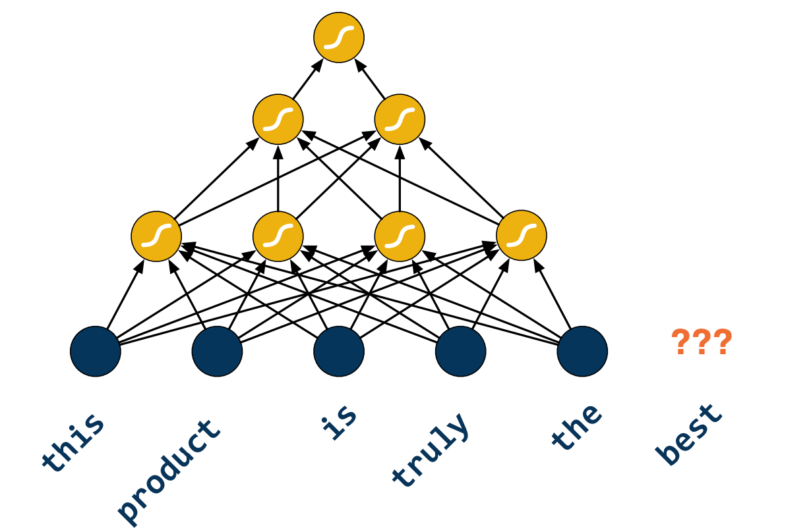{: width='400' height='400'}

Pain points:

* Cannot easily support variable-sized sequences as inputs or as outputs.
* No inherent temporal structure.
  * The order of words matters, e.g a word coming before another word
* No practical way of holding state.
  * e.g I am inline at the bank vs I am by the river bank means two different things of the word "Bank". 
* The size of the network grows with the maximum allowed size of the input or output sequences.

### Recurrent Neural Networks: Part 2

RNNs are a family of neural architectures which has been designed to model sequences. At every time step they will receive an input and use that to update a state $h_t$. In order to do so, they also have access to the state and the previous time step $h_{t-1}$

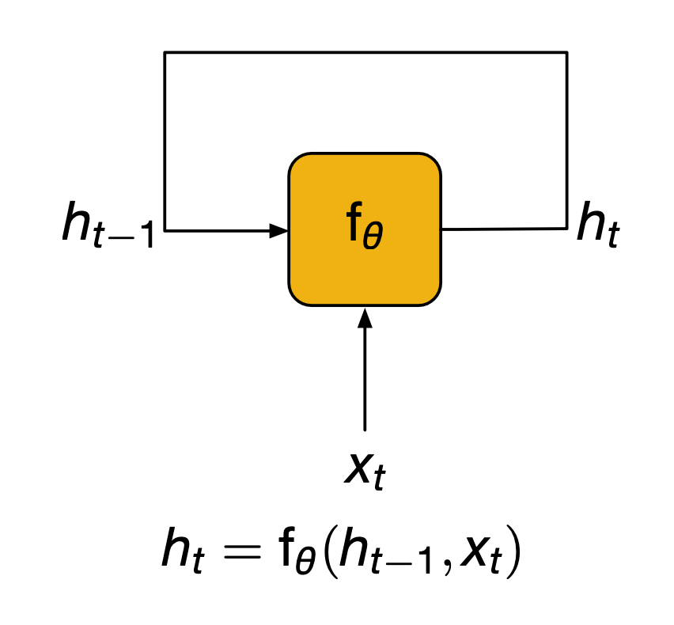{: width='200' height='200'}

We can draw the arrow a little differently to illustrate the recursive nature of this process. the yellow box $f_\theta$ which we will call the cell gets repeatedly called to update the state. This also explains why these models are called recurrent. Mathematically we can just model this as a function $f_\theta$, where $\theta$ is used to represent the set of training weights of the network. 

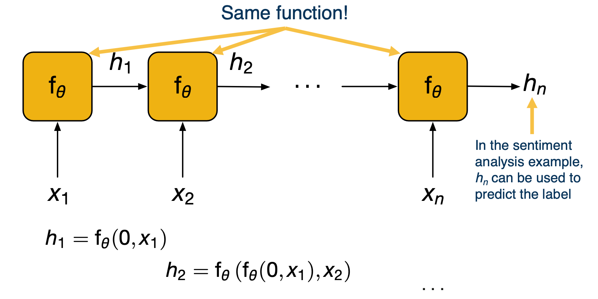{: width='400' height='400'}

We can expand this picture along the time axis, by unrolling the previous diagrams for n time steps. At time step one, the network receives the first input in the sequence, compute the states and passes that on. At time step two, the state is again updated by looking at both the new input and previous state, and so on until the last time step. Crucially, the function $f_\theta$ that is called repeatedly, it is always the same, giving rise to the recursive nature of RNNs. Going back to our example of sentiment analysis, the final state $h_n$ can be used to predict our label as the network has now seen the whole text. 

#### Backpropagation through time

* Outputs are either directly the states $h_t$ or are computed as a function of those.
* Backpropagation works as normal, by "unrolling" the network (sometimes this is called backporp through time)
  * Run the network and compute all the outputs
  * Compute the loss (typically a function of all the outputs).
  * Perform the backward step to compute gradients
  * Can use "truncated backpropagation through time"
    * If you have too much history it becomes expensive to backprop. 
    * The states are carried forever, but we only backpropagate for a fixed number of time steps backward. 

#### “Vanilla” (Elman) RNN

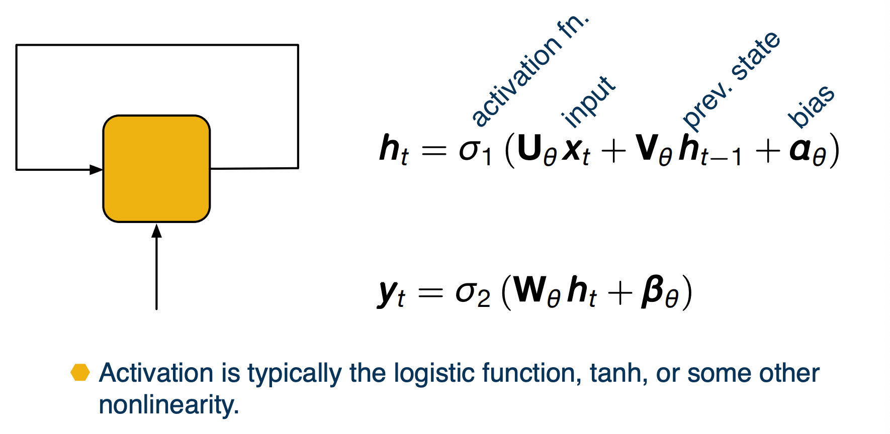{: width='400' height='400'}
 
The status update is obtained by performing an offline transformation of the input and the previous state. That is, we multiply the input by a learn matrix, do the same for the state and add a bias term (also learnt).

We then apply an activation function and another affine transformation of this plus an application of a potentially different activation function $\sigma_2$ to get the output. The activations used for these networks are typically the logistic function (also known as sigmoid), or the hyperbolic tangent or some other functions with similar properties.  

The term RNN is somewhat used colloquially here without giving a precise definition. The examples have shown you here are what people will commonly understand if you say RNN. Sometimes though the term is also used more formally, to indicate any neural network whose information flow does not follow a directed acyclic graph. 

#### The Vanishing Gradient Problem

RNN in practice can be difficult to train due to a problem known as **vanishing gradients****.**

Let's discuss this by looking at a simple example:

$$
x_t = \sigma(w_\theta x_{t-1})
$$

Consider this trivial RNN which takes an input at timestamp 0 and then repeatedly updates itself by multiplying its state by learned weights. If we look at the gradient of the state at time t with respect to the state at time 0, we see that this is proportional to the weight $w_\theta^t$ 

$$
\frac{\partial x_t}{\partial x_0 } \propto w_\theta^t
$$

Now this is a quantity that we have to deal with in the update rule to train this RNN and the power of t is a problem. The reason is that for large T, is the magnitude of $w_\theta$ is greater than one, then the gradient will get very large and the update steps will get erratic.  On the other hand, if the magnitude isl ess than one,  then the gradients get vanishingly small and the model does not get trained at all. 

#### Long Short-Term Memory (LSTM) Networks

An idea to attempt to alleviate these problems came in the 90s in the form of a different architecture. It is known as the LSTM network or long short term memory network and these are its object roles. 

$$
\begin{bmatrix}
f_t \\
i_t \\
u_t \\
o_t 
\end{bmatrix}
= 
\begin{bmatrix}
\sigma \\
\sigma \\
tanh \\
\sigma
\end{bmatrix}
\bigg(w_\theta
\begin{bmatrix}
x_t \\
h_{t-1}
\end{bmatrix} + b_\theta \bigg)
$$

The first four values defined here are the gates and intermediate values:

* $f_t$ forget gate
* $i_t$ input gate
* $u_t$ candidate update
* $o_t$ output gate

The main update rules: 

$$
\begin{aligned}
c_t &= f_t \odot c_{t-1} + i_t \odot u_t \\
h_t &= o_t \odot tanh(c_t)
\end{aligned}
$$ 

* $c_t$ cell state (new!)
* $h_t$ hidden state

Notice that on top of the state $h_t$ which we already had before, we have an additional cell state $c_t$. This definition is important in avoiding the vanishing gradient problem. Know that it is updated in an additive way by adding something to its previous value $c_{t-1}$. This is different from the multiplicative update rule of RNNs which as we saw got us into trouble. 

Also we should note that this is fundamentally different from the element RNN we covered previously, and many RNNs when unrolled are essentially just feed forward neural networks with affine transformations and nonlinearities. Instead, this is completely new. With the idea of gating we are now taking parts of the input to the cell and multiply them together. 

To get a better feel for how LSTM works, lets look at how an update is performed step by step. 

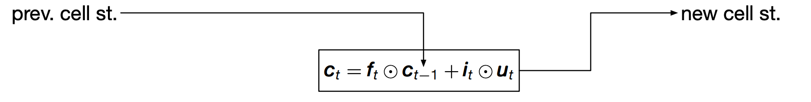{: width='400' height='400'}

We start with the previous cell state $c_{t-1}$ which is used along with some other values to compute the new cell state $c_t$

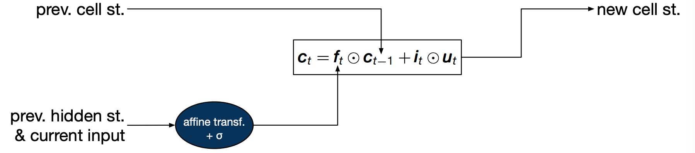{: width='400' height='400'}

The first value is the forget gate $f_t$ is the result of an affine transformation of the previous hidden state and the current input, pass through a sigmoid so that it lies between zero and one. Intuitively, this gate decides how much of the previous cell state we want to keep around. The two extremes when its value is 0 in which case we forget everything, and when its value is 1, in which case we will remember everything. 

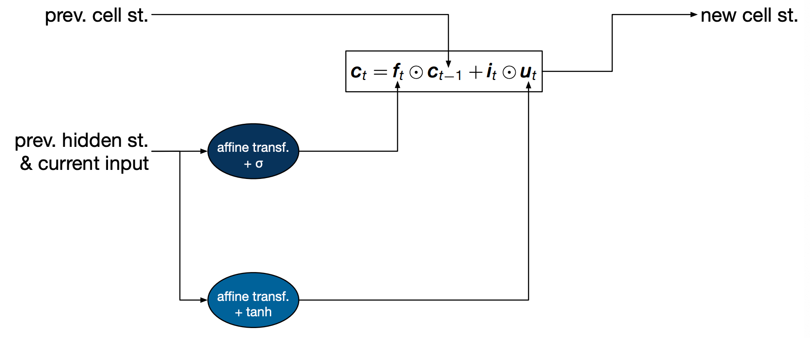{: width='400' height='400'}

But the old cell state is not all we use to compute the new cell state. We also have a cell called candidate update, $u_t$. Intuitively, this is the new information coming from the input we've just seen. 

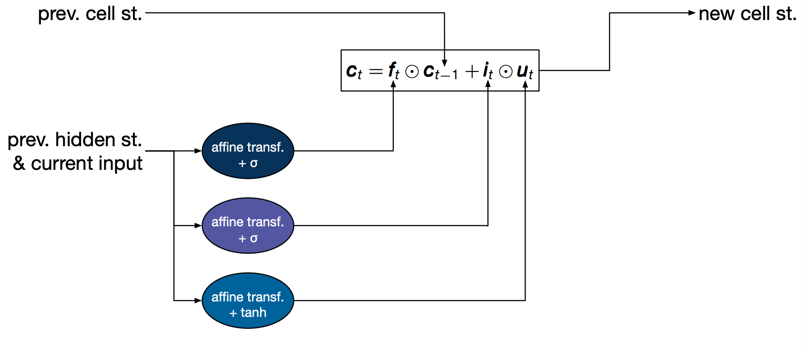{: width='400' height='400'}

This is also modulated by a gate the input gate $i_t$. Intuitively this decides how much we should let this particular input affect the cell state. 

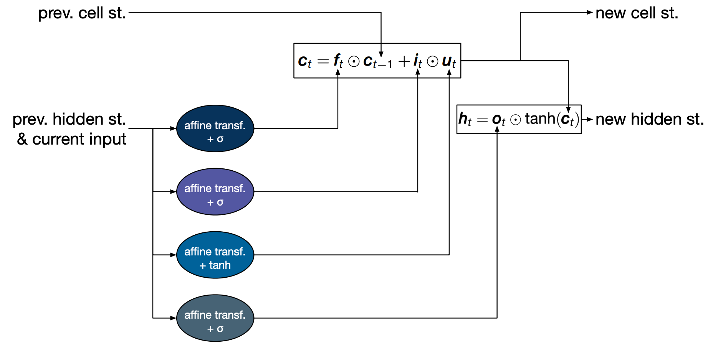{: width='400' height='400'}

Finally, the update state is used to compute the hidden state, which is the value that can then be used to compute an output. The value of the hidden state is modulated by an output gate $o_t$ which decides how much of the cell state we want to service.

### Language Modeling: Part 2

The way a language model would work is as follows, assume that we want compute the probability of a word, given the ones that came before. As we saw previously, the scan of conditional probabilities are central to language modeling. In order to do this, we will input the words in the history one by one, then make use of the output of the RNN at the final time step, to perform a prediction. 

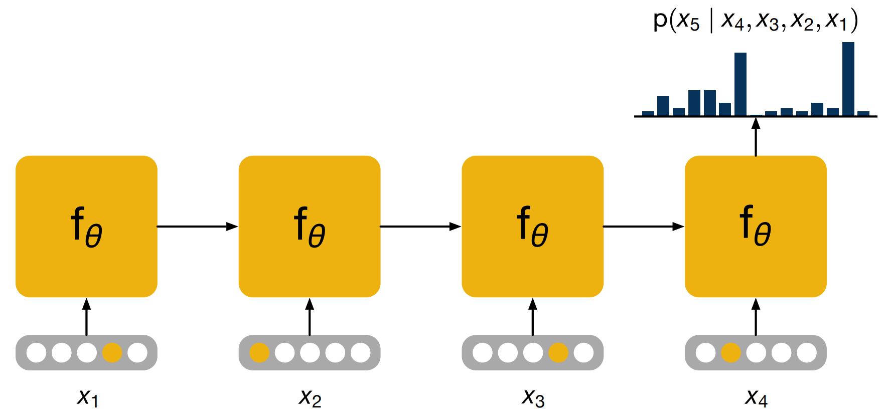{: width='400' height='400'}

The yellow dots in the inputs are used here to indicate one hot representations which is just one choice of representations. 

Let's look at this process step by step. This is the inference part, that is, we are running the model in forward mode only to perform a prediction, assuming it has already been trained. 

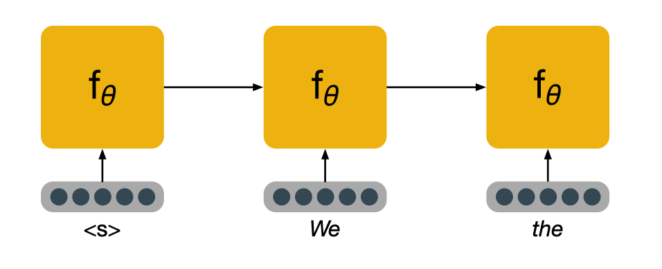{: width='400' height='400'}

We start with the first word, in the form of a vector representation of a word. In practice, it is often useful to have a special symbol, to be the first word to indicate to the model that a new sentence is starting. We then feed the words in the history until we run out of history and then we take the hidden state age, perform a transformation of it to project it to a very high dimensional space that has the same dimension as the number of words in our vocabulary. And then we normalize this vector using a softmax, which leaves us with a probability distribution of what the model believes could be the next word. 

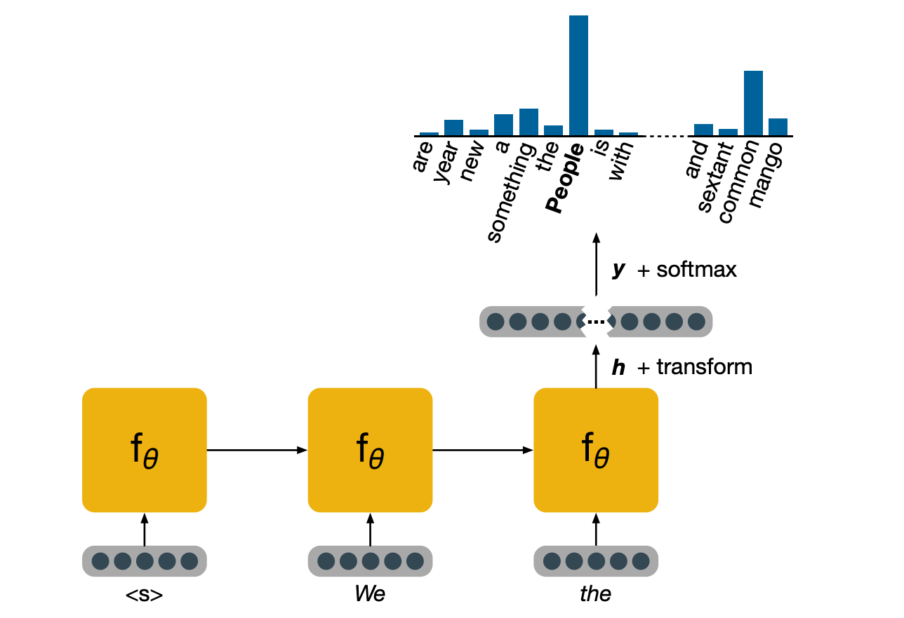{: width='400' height='400'}

In this case, people is the word that the model feels the most confident about. 

#### Evaluating LM performance

Before we look at training, it is useful to be able to measure how well a model is doing at language modeling. If our model is good, it will assign high probabilities to real sentences. In order to get a measure of performance, we can use a quantity from information known as cross-entropy. 

Given a reference distribution $p^*$ and the proposed distribution $p$, cross is defined as: 

$$
H(p^*,p) = - \sum_{x \in X} p^* (x) log p(x)
$$

Intuitively, this can be seen as the expected number of bits required to represent an event, drawn from the reference distribution $p^*$, when using a coding scheme optimal for $p$.   

Per word cross entropy:

$$
H = - \frac{1}{N} \sum_i log p(w_i | w_{i-1}, ...)
$$

This is the cross entropy averaged over all the words in a sequence. When the reference distribution is the empirical distribution of the words in the sequence. This is commonly used as a loss function, as it is an effective way of measuring how good the model is at estimating probabilities. 

Another value that is seen in language modeling is **perplexity**, and is defined as the geometric mean of the inverse probability of a sequence of words according to the model.

$$
\begin{aligned}
Perplexity(s) &= \prod_i^N \sqrt[n]{\frac{1}{p(w_i | w_{i-1}, ...)}} \\
&= b^{- \frac{1}{N} \sum_i^N log_b p(w_i|w_{i-1},...)}
\end{aligned}
$$

Note that we can expand this definition by using the law of logarithms, and we see that the exponent is just the per word cross entropy. Perplexity is commonly used as an evaluation metric. The lower the perplexity, the better our model is. Now this formula can look fairly hostile, and talking about geometric means of inverse probabilities isn't particularly helpful either. So you may find the following intuition useful. 

The perplexity of a discrete uniform distribution of a k events is k. So if you flip a coin and asked me to guess, I'll get it right about half the times and my perplexity there is two. If you throw a fair die and ask me to guess, i'll get it right 1/6 and my perplexity there is six. 

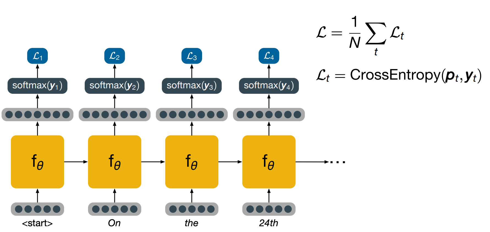{: width='400' height='400'}

To train a model, we feed the words one by one, using again the special symbol first to indicate the start of a new sequence. After eery time step, we've projected a high dimensional space like we did during inference, turn that into a probability distribution and calculate the loss using cross-entropy. Note that at the following time step, that we input into the network is not the word predicted at the previous time step, but the actual word that is present in the training data. This practice is known as teacher forcing and allows the model to keep training effectively even if it would have made a mistake in the previous time steps. Once the whole sentence has been fed, the overall loss is computed as the average of the losses for each word and backpropagation can be used to calculate the values necessary to perform an update step. 

### Masked Language Models

Intro to Masked language modeling, a task which has been used very effectively in NLP to greatly improve performance in a variety of tasks. You will remember that language models estimate the probability of sequences.

**Masked language modeling** is a related **pre-training task** – an auxiliary task, different from the final task we’re really interested in, but which can help us achieve better performance by finding good initial parameters for the model. 

By pre-training on masked language modeling before training on our final task, it is usually possible to obtain higher performance than by simply training on the final task.

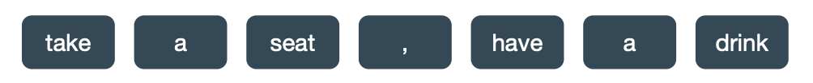{: width='400' height='400'}

Masked language models take as input a sequence of words, they add special symbols to mark the start and the end of the sequences similarly to language models. 

{: width='400' height='400'}

But they also cover up some of the original words with special tokens that are marked below with the word `mask`.

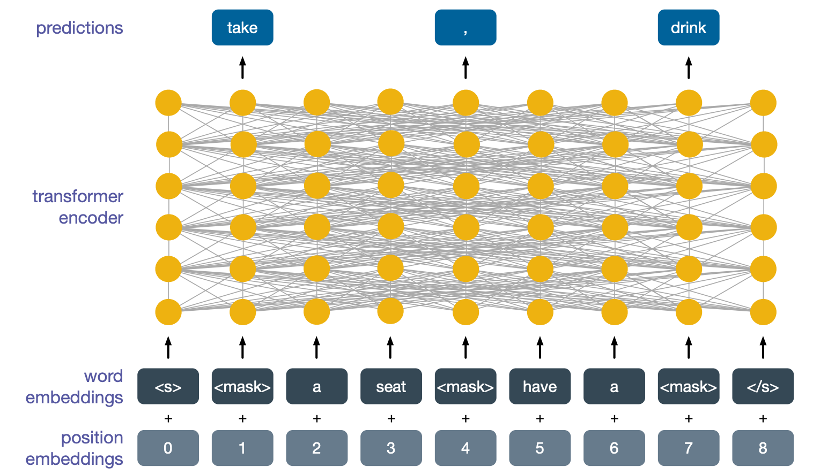{: width='400' height='400'}

We then take the word embeddings corresponding to these words and we feed them into a transformer encoder. Since transformer encoders have no inherent notion of position of their inputs, and this is useful for language, we also add to the input some special positional embeddings. The final task is to predict what the masked words are. This is abit of a strange and difficult task but it is quite difficult.

A model that learns to solve it well will have not only learned a lot about the structure of language, but also about common sense knowledge. And indeed, this knowledge is quite useful. If we take this model and then train it again to perform some tasks we are actually interested in, the model will not learn to perform the new task but it will also retain part of the knowledge it learned to perform masked language modeling, and this will often give a significant boost in performance. Let's see how this model can then be trained to perform other tasks. 

#### Token-level Tasks

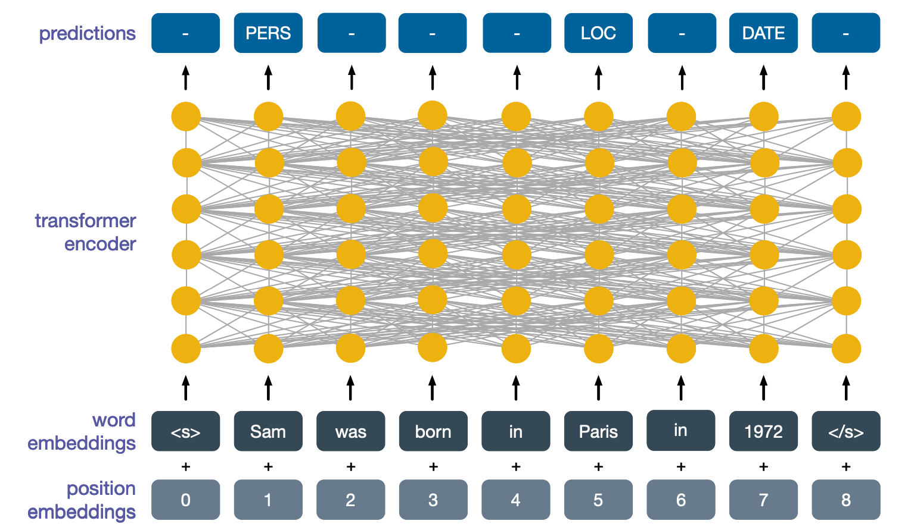{: width='400' height='400'}

One type of tasks we might want to perform are token-level tasks, where for each output we want to perform a classification. An example is named entity recognition, which involves identifying which input tokens identify entities such as persons, dates, locations and so on. Here we would simply input a sentence without any masked tokens, and for the outputs at each position, we would train the network to perform the correct classification. The labels at the top present the various types of entities, so persons locations, date. 

#### Sentence-level tasks

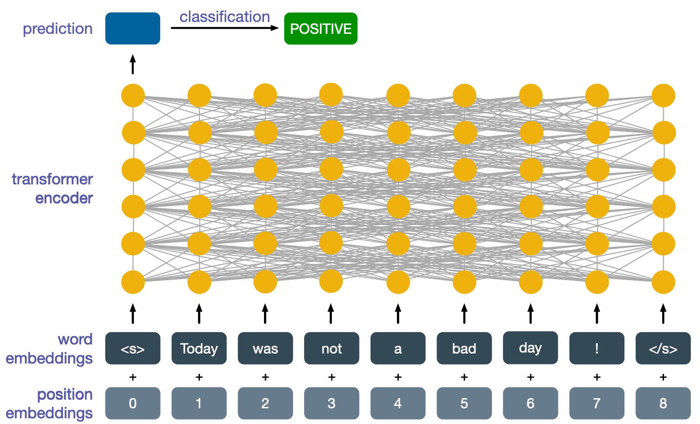{: width='400' height='400'}

Another type of tasks is sentence-level tasks, where we are more interested in the global meaning of a sentence. An example is sentence classification. Conventionally here we take the first output of the transformer encoder at the top layer and use that to classify the sentence. In this example, we are performing sentiment analysis again. 

#### Cross-lingual Masked Language Modeling

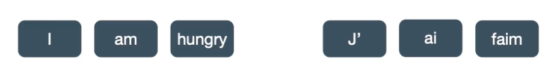{: width='400' height='400'}

An interesting development of masked language modeling came when people realized that we did not have to stick to a single language. Considering the following two sentences, the first is in english and the second one is its translation in French. 

{: width='400' height='400'}

We can join them in a single sequence by using a special separator token and then add start and end special tokens again, and similarly to before, also add masked tokens. 

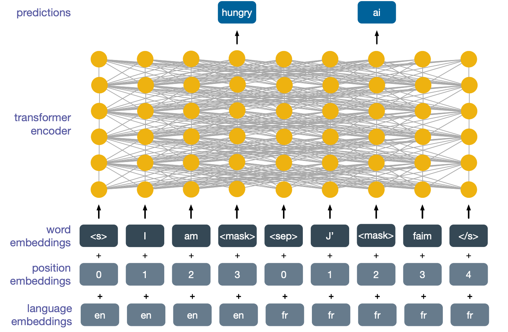{: width='400' height='400'}

We can then perform masked language modelling of this sequence and the model will learn to look at the two translations simultaneously in order to better predict what the masked words are. Now a model pre-trained with cross-lingual masked language modelling can be used in the same way as a model trained with normal mask language modeling, but the real strength of these models comes from cross-lingual transfer. Imagine we took this pre-trained model and further trained it to perform classification using english training data, because of the cross-lingual nature of its pre-training task, this model would also then be able to perform classification in other languages, even though its training data only covered English. 

#### Cross-lingual Task: Natural Language Inference

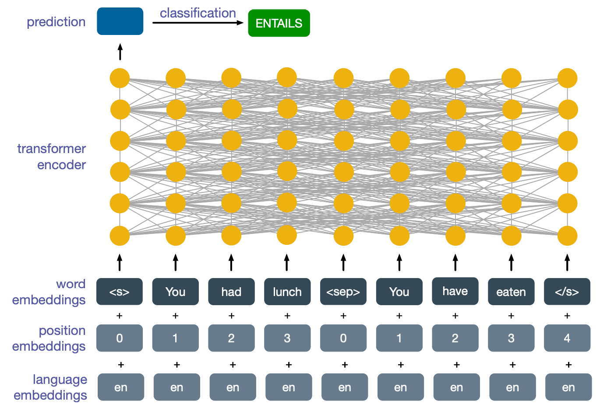{: width='400' height='400'}

Let's look at another popular cross-lingual task which this model can perform with further training. This is a classic NLP task known as natural language inference (NLI), which we are seeing here and its cross-lingual version. The task is to decide whether the first implies the second one or whether it contradicts it or whether the two sentences are completely unrelated. In this case, the first sentence entails the second one, since if you have had lunch, then you must necessarily have eaten. So far nothing special and this is all monolingual and we are only looking at English data. What makes this interesting is cross-lingual transfer. 

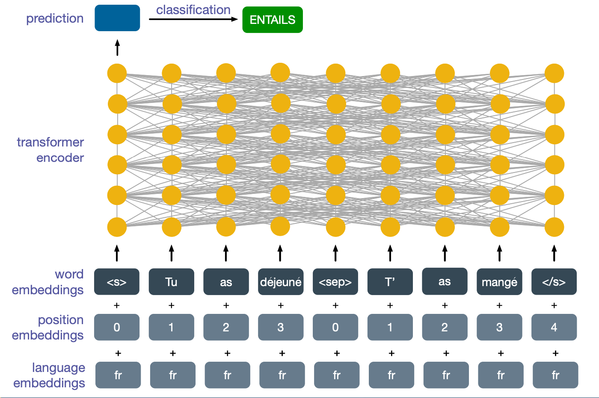{: width='400' height='400'}

So for instance, even if we train the model on a natural language inference dataset that only contain English data, we would find that at inference time the model is also able to work on French data. In this case, the above image depicts the model correctly predicting entailment for these two French sentences, `dejeune` which means you had lunch, `mange` implies you ate. 

#### Model Size in Perspective

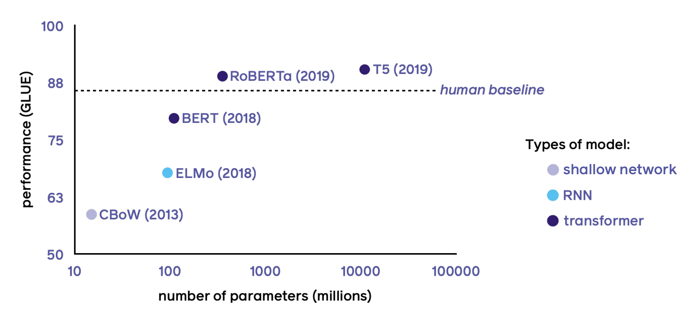{: width='400' height='400'}

This class of models, which are all based on pre-trained transformers, have been truly revolutionary for NLP. The y-axis is the performance of the GLUE benchmark - GLUE is a set of tasks which are meant to cover aspects of NLP. The nature is not important, and just using it as a proxy for measuring roughly how well a model is at performing language-based tasks on average. The graph shows how well various models perform on GLUE, with the dashed line showing human performance. On the x-axis, is the number of model parameters to give an indication of how large these models are and how expensive they are to run. 

As you can see, while transformer-based models have led to an incredible boost in performance, often beating the human baseline, they are also getting incredibly big - and this means they are slower, more expensive to run in terms of computation, memory which leads to higher energy costs and a bigger environmental impact. As an aside, the fact that these models beat the human baseline does not mean much, as these tasks often have very small flaws that machines are very good at exploiting. So while performance on the GLUE task in general is certainly correlated with the ability of a model to understand language, performance relative to the human baseline is not particularly meaningful. 

In any case, the problem remains that these models are too big. Fortunately, there are ways to reduce their size while still maintaining most of their performance. Perhaps the most important is known as knowledge distillation. 

#### Knowledge Distillation to Reduce Model Sizes

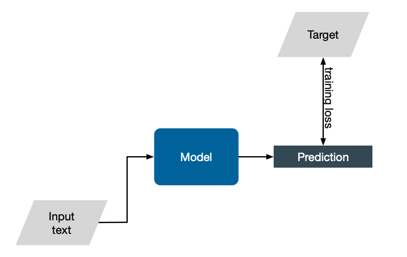{: width='400' height='400'}

Consider the standard way of training a generic NLP model. We give some input text, the model performs a prediction. We know that the target answer is from the training data, and so we can use a loss function to encourage the model to learn. 

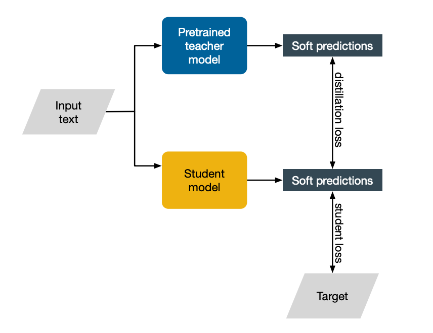{: width='400' height='400'}

Knowledge distillation works slightly differently. Assume that we have at the top a pre-trained model which we will call the teacher. This model works amazingly well. However it is too slow or expensive to run. We will use this big model to teach a smaller model, which we will call the student. The input text from the training data will be passed to both models and both will make a prediction. Since we know the target that we want the model to predict, we can use a loss like before. We will call this the student loss, as it only involves the student model, and this is just standard training.

Additionally, though, we will also encourage the student model to align its predictions with those of the larger teacher model. Why should this be useful, you might wonder. After all, training using the student loss should provide us with all the training signal we need. Why knowledge distillation works as well as it does is still an open research question. We currently do have some ideas.

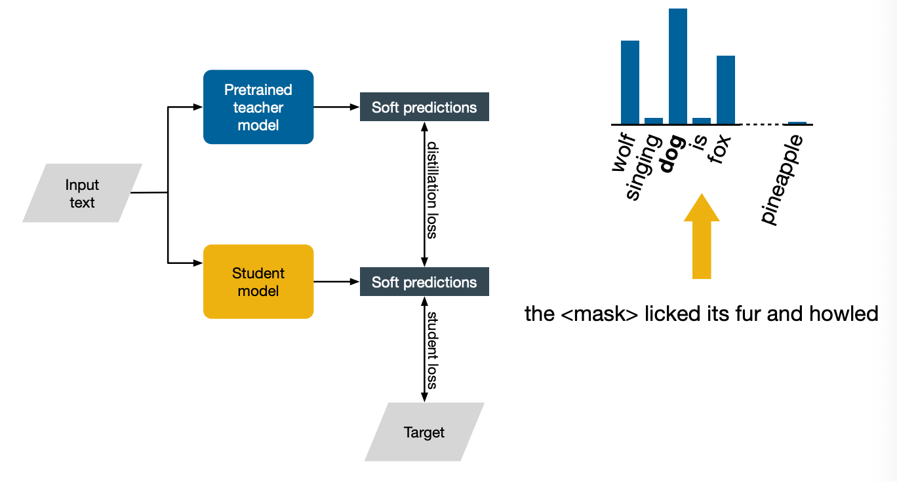{: width='400' height='400'}

First, notice that the image specifically says soft predictions. ASsume that the task is to predict a word that has been masked. Let's say that the input sentence is the dog licked its fur and howled, and we mask dog. Now if we look at the predictions made by the teacher model, which has been pre-trained on a lot of text and is very advanced, you will see that it correctly predicts the word dog. The final prediction, the hard prediction, is not the only bit of interesting bits there though. 

Notice how wolf and fox also have a fair amount of probability mass, presumably because the teacher model, having been exposed to alot of text, gained some knowledge of the fact that wolves and foxes also lick their fur and also howl. This is why the distillation last between the teacher and the student, which aims to align these probability distributions rather than just the hard predictions, is a useful addition. Instead of just telling us that the right answer is a dog and that's it, it also tell us that we want to rank wolf and fox highly. And that contains useful information for the student to learn about the world. Another advantage of knowledge distillation compared to just training the student from scratch is that once we have teacher, we can go beyond the labeled training data that we have. We could just take any unlabeled text and use the teacher to make predictions on it, which can then be used to augment the training for the student. 

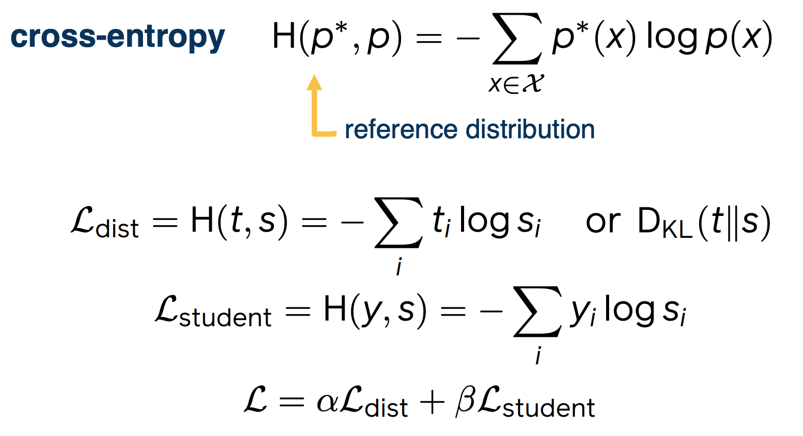{: width='400' height='400'}

Now let's look concretely at what the distillation loss would be like for a classifier. Recall that cross-entropy H when talking about evaluating language models. Now, the cross-entropy between two distributions takes its minimum value when the two distributions are the same. For this reason, it is often used as a loss function for distillation, where the aim is to bring as close as possible the target and student models' predictive distributions. So then for a given example for which the teacher has predictive distribution $t$ and the student model $s$, the distillation loss is simply the cross-entropy between them. 

The other common loss function here is the very closely related KL divergence $D_{KL} (t\lvert \lvert s)$. For the other term of the loss, the student loss, this would just be a classification loss. A standard choice here would be again the cross-entropy loss. Although this time, it would be between the empirical distribution y, which is just one for the true label and zero everywhere else, and the student model's predictive distribution s. For the total loss, this is simply given by a linear combination of these two terms.

<!--  -->
