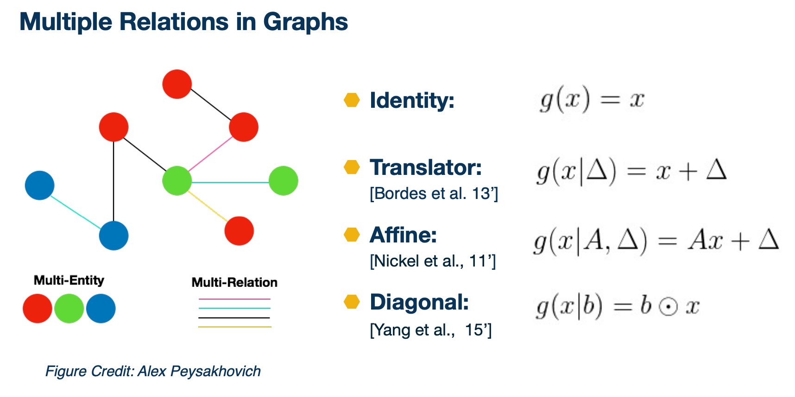
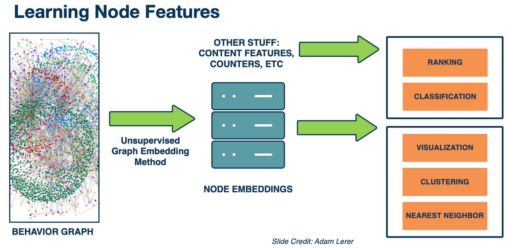

### Readings

* [word2vec tutorial](http://mccormickml.com/2016/04/19/word2vec-tutorial-the-skip-gram-model/)
* [word2vec paper](https://arxiv.org/pdf/1301.3781.pdf)
* [StarSpace paper](https://arxiv.org/pdf/1709.03856.pdf)

### Embeddings Introduction

* Word embeddings
  * Can be used as the initialization of lookup table in LSTM.
* Graph embeddings
  * A generalization of words embeddings. 
* Applications, word2vec, including ranking, recommendation, classification, and tagging
  * Can we actually embed everything? E.g piece of content, relationships etc.

#### Introduction to Embeddings

In a nutshell, embeddings can be viewed as mapping objects to vectors through a trainable function. 

For example, in CNN where it maps an image into a vector in real space. We can also map other things such as text into a vector. Typically the neural net can be seen in RNN or a transformer for text, or simply a shallow one, such as word2vec. 

{: width='400' height='400'}

Above is a picture illustrating mapping different objects into the same space. Usually the distance between the vectors in the space is used as a similarity function for different objects. For instance, we want to map similar objects closer in the space. In this case, at the upper right, there is a video about a birthday cake and then it is mapped to close to the text happybirthday and hashtag iamold. 

We will be talking about how we are going to learn the vectors of different objects. You will have an idea of what are word embeddings and graph embeddings and how they are learned. You will also learn to use those embeddings in applications and what kind of tasks can benefit from it such as recommendation, tagging, search, etc. You will also get an idea of how large scale computing words for learning embeddings. 

### Word Embeddings

The search for good representation of words has been a long term pursue in NLP.

* **Distributional semantics**: A word’s meaning is given by the words that
frequently appear close-by
  * “You shall know a word by the company it keeps” (J.R.Firth 1957:11)
  * One of the most successful ideas of modern statistical NLP!
* When a word w appears in a text, its **context** is the set of words that appear nearby (within a fixed-size window).
* Use the many contexts of **w** to build up a representation of **w**.

For example, looking at the word `banking`:

* Government debt problems turn into `banking` crises as happened
* Saying that europe needs unified `banking` regulation to replace the hodgepodge
* India has just given its `banking` system a shot in the arm... 

#### Natural word Embeddings 

There is a series of work based on idea of learning word representations using neural networks. The work proposed by Bengio in 2003, a neuro probabilistic language model proposes the following. It associated h word in the vocabulary a distribution word feature vector. It uses a neural network model essentially tried to predict the next word. 

And later the work by Ronarld Collobert and Jason Weston and other collaborators using convolution neural net to know word embeddings. The word word vectors and other parameters of the neural nets is chained on several different asks including language model entity recognition, and part of speech tag accenture was sharing the word vectors and it showed that it is useful for all these tasks. And they also looked at the nearest neighbor of the word vectors and find that it displays the same tactic and semantic properties of words. 

More recently, Thomas Mikolov proposed a relatively simple model called word2vec, which is really efficient to compute, where the word vectors are the only parameters to be known in the model because of its efficiency in powerful performances, it gets wider adoptions in both NLP Research and applications. 

#### Collobert & Western vectors

The idea comes from that a word and its context is a positive training example and a random word in the sample context gives a negative example. 

{: width='400' height='400'}

So, in this example, the positive example is the phase "cat chills on a mat" and if we take a random word "Ohio", the negative example becomes "cat chills Ohio a mat", obviously that doesn't make much sense. Then the score is calculated by the neural network built on top of the word word vectors, and we want to penalize the score of "chat chills Ohio a mat" and optimize the score of a "cat chills on a mat", the positive example. 

So here we use a margin loss on it, this is similar to the ideas in support vector machine where you want to increase the margin between the positive and negative examples. Is also notice both that we only need positive examples in the training and negative examples are drawn from random words, so in this case, a random word from the dictionary. In the later part of the lecture we will talk more about finding negative samples or negative sampling as it plays a very important role in different embedding models. 

#### Word2vec: The skip-gram model

The idea is to use words to **predict** the context words. This is the skip gram model, there is also the continuous bag of words model in word2vec which will not be covered. 

The context is a fixed window of size $2m$, lets take a look at this following example:

{: width='400' height='400'}

Here is the example the context window is size 2 and we'll have part of the sentence as problems turn into banking crisis. ASsuming the word "into" is the center word, so we hope to use the vector representation of the word "into" to predict, what would be the context in "into". 

We are trying to make those predictions and change the vector representations in a way that we can do the prediction better. 

{: width='400' height='400'}

Similarly, we go on to the next word banking and essentially would do the same thing.

More formally, we write in the following formula a skip gram objective function. For each position T predicting the context word within a window of fixed size M, given a central word $w_j$, we multiply all those probabilities to be our likelihood. And here $\theta$ is all the parameters to be optimized.

$$
L(\theta) = \prod_{t=1}^T \prod_{-m \leq j \leq m, j\neq 0} p(w_{t+j} | w_t ; \theta)
$$

The objective function is the (average) negative log likelihood:

$$
J(\theta) = \frac{1}{T} log L(\theta) = - \frac{1}{T} \sum_{t=1}^T \sum_{-m \leq j \leq m, j\neq 0} log p(w_{t+j} | w_t ; \theta)
$$

Notice that in this particular model, the parameters to optimize are only the word vectors and this is simpler than the earlier neural net models and also enables very fast computation. 

The question then becomes how to calculate the probability $p(w_{t+j}\lvert w_t;\theta)$. In the word2vec model:

* We have two sets of vectors for each word in vocabulary:
  * $u_w$ when $w$ is the center word
  * $v_o$ when $o$ is the context word
* Use inner product $(u_w,v_o)$ to measure how likely $w$ appears with context word $o$

$$
p(w_{t+j}|w_t) = \frac{exp(u_{w_t} \cdot v_{w_{t+j}})}{\sum_{k\in V} exp(u_{w_t} \cdot v_k)}
$$
* This is the softmax!
* $\theta = \\{u_k\\},\\{v_k\\}$ are all the parameters in the model!

So we can do stochastic gradient descent on softmax function but the problem is that it is very expensive to compute because the size of vocabulary is very big, making it impossible to compute.

There are two solutions to this problem:
* Hierarchical softmax
* Negative sampling 

#### Other word embeddings 

There are other family of word embeddings which also have been widely used. They differ in several aspects such as algorithms, text corpora, dimensions etc. For instance GloVe where the training of the embedding is performed on aggregated global word co-occurrence statistics from a corpus and fastText which is also from facebook AI and has wide adoptions. It adds some more information in addition to word2vec, which better handles auto vocabulary words and it is also available in more than 200 different languages. It is shown to be very efficient for text classification tasks, so you can find pertained word vectors weights below, and a common way of using the embeddings is to use it as features in downstream ML models, or as initialization of neural net models for NLP such as RNN, LSTM. Finally more recently the context tries the word embedding has becoming very popular such as ELMo and BERT, which will be covered in detail in later lectures. 

* [GloVe](https://nlp.stanford.edu/projects/glove/)
* [FastText](https://fasttext.cc)

#### How to evaluate word embeddings?

There are mainly two categories of evaluations, namely: 

* Intrinsic
  * Evaluation on a specific/intermediate subtask
    * Such as taking the nearest neighbor of a particular word or vector
  * Fast to compute
    * Can check quality of word embeddings during training
  * Helps to understand the system
  * Not clear if really helpful unless correlation to real task is established
* Extrinsic
  * Evaluation on real task (i.e text classification)
  * Can take a long time to compute
  * Unclear if the subsystem is the problem or its interaction
  * If replacing exactly one subsystem with another improves accuracy $\rightarrow$ (Winning)
    * Also use this approach to evaluate other embeddings such as graph embeddings

One interesting example of intrinsic word embedding is the word analogy task. 

{: width='400' height='400'}

In this task, we have a pair of words, man and woman and the word king. We wanted to know which word to king has the same relation to men to women to men. We observe that the train word embeddings have the following property:

{: width='200' height='200'}

* Evaluate word vectors by how well their cosine distance after addition captures intuitive semantic and syntactic analogy questions
  * If you find that the vector satisfy the formula on the top you will find the vector as queen. ( King - man + woman = Queen )
* More examples: http://download.tensorflow.org/data/questions-words.txt

We will talk about Extrinsic in the later sections.

### Graph Embeddings

Graphs are networks of entities and connections between them. They can be used to present stuff like protein structures or map data or networks of people's interactions. Multi relation graph embeddings are typically studied in the context of knowledge graphs. 

{: width='400' height='400'}

So you can have these graphs structured wikipedia data, and there are other similar graphs like word ontologies. There are also related areas of study such as a recommender system and embedding  methods like Deep Work that were primarily designed to operate on social graphs. From previous section we talked about word embeddings, and you can think of it as defining a graph where each word to be a node and the node has an edge to its context word in sentences. And word embedding models like Word2vec are essentially learning the embeddings of the graph node, which is the word. 

#### Graph Embedding and Matrix Completion 

{: width='400' height='400'}

Let's take a look at an example here. This is also known as matrix completion, where you have a big matrix and you know some neighbors, labels, between persons and items. For instance you know that person one likes item two and do not like item one. There are also missing entires in the matrix, whether there are relations between items and people, and the items can be people, movies, pages, products, word sequences, and you like to predict if someone likes an item or a word, or follow a word sequence. 

So you can know the vector representation of people and items here such that some simple form of the function between these two vectors will fit the existing value in the matrix and predicting the unknowns. So that is a particular case that we want to use graphing embeddings for. 

#### Why Graph Embeddings?

We define embeddings as a learned map from entities to vectors of numbers that encodes similarity. 
A mapping is just an algorithm that convert entities with relations to vectors or features that include similarities. For word embeddings, you enter features such that the features of a word is similar to the features of the words surrounding it. 

For graph embeddings, you enter features that connected nodes are more similar than unconnected nodes and enter these embeddings by optimizing this objective by stochasic gradient descent. In other words we are talking about graph node embeddings here, and note that you can also do path embedding in the graph structure embedding which will not be covered.  

Just as word embeddings, graph embeddings are a form of unsupervised learning on graphs. It can be used as **task agnostic** entity representations. The features are useful on downstream tasks without much data. And the nearest neighbors are semantically meaningful. 

#### One family of graph embeddings

This is from the open source project pytorch BigGraph where several graph embeddings were implemented in a large scale setting. Here we are going to talk about a family of graph embeddings that we spurred in PyTorch BigGraph and essentially the way we trained those embeddings. 

So given that we have a multi relation graph like the one below, where different colors of the edge representing different relations, we want to optimize the loss function L such that for a simple function of an edge e, and a negative sampled edge, $e'$, we want to minimize the margin loss as similar to the loss in the Collobert & Western vectors. 


digraph {

    rankdir=LR;

    node [shape = circle];
    A -> C [color = orange]
    B -> C [color = orange]
    C -> E [color = red]
    D -> A [color = red]
    D -> B [color = orange]
    D -> E [color = orange]
}


Margin loss between the score for an edge $f(e)$ and a negative sampled edge $f(e')$:

$$
L - \sum_{e \in G} \sum_{e' \in S'_e} max (f(e) - f(e') + \lambda , 0)
$$

The score for an edge is a similarity (e.g. dot product) between the source embedding and a transformed version of the destination embedding, e.g.

$$
f(e) = cos(\theta_s, \theta_r + \theta_d)
$$

* $\theta_s$ is the source, $\theta_r$ relation vector and $\theta_d$ is the destination node vector. 

Negative samples are constructed by taking a real edge and replacing the source or destination with a random node

$$
S'_e = \{(s',r,d) \lvert s' \in V \} \cup \{ s,r,d' \lvert d' \in V \}
$$

Let's take a particular edge here as the edge b to c. So essentially the loss function is saying that we want the distance between the vector b and the transformed vector of c to be close and the distance between vector b and transformed vector of a and e to be large as there is no edge between them. 


digraph {

    rankdir=LR;
    node [shape = circle];

    A -> C [color = white]
    B -> C [color = white]
    C -> E [color = white]
    D -> A [color = white]
    D -> B [color = white]
    D -> E [color = white]
    B -> E [color = orange, style=dotted]
    B -> A [color = orange, style=dotted]
    B -> C [color = orange]
}


Similarly we do this again for positive edge b to c and negative edges a to c and d to c. So the loss can be again optimized by $S_{dge}$, and this is how the graph node embeddings and parameters of the relation's transformations learned. 


digraph {

    rankdir=LR;

    node [shape = circle];
    A -> C [color = white]
    B -> C [color = white]
    C -> E [color = white]
    D -> A [color = white]
    D -> B [color = white]
    D -> E [color = white]
    A -> C [color = orange, style=dotted]
    D -> C [color = orange, style=dotted]
    B -> C [color = orange]
}


#### Multiple Relations in Graphs

So here are the different types of relations that we spurred in PyTorch Biggraph. 

{: width='400' height='400'}

The first one is the identity where we treat every edge to be the same. The second one is a translator where we use a vector to represent a particular edge type and then we add the edge type vector to the node vector. So we can also do a fine translation where we have a matrix A and a translator vector delta for each edge type, and we do multiplication of the matrix A and node vector plus this translator, where it allows more complicated transformation than the translator model. It also has more parameters to be learned. And then we could also have the diagonal transformation, where we have a vector b edge type and we multiply each dimension of b with the corresponding dimension of x. 

#### Embedding a knowledge base

{: width='400' height='400'}

Here is an example from embedding a knowledge base. So we have a subgraph from Freebase, where it has the entities like CLooney, actor, male, and the relations between the entities. We can enter a graph embedding on the knowledge graph, then for question like "who did Clooney marry in 1987" you also have embeddings of the question through the word embedding table. You can then detect the entity in the question and find the corresponding entity in the freebase subgraph and to find the relevant entity to answer for this question through entity embeddings, so that is the high level idea.

We are going to talk more about examples of how to use graph embeddings in the applications section. 

{: width='400' height='400'}

Let's take a look at two dimensional disney visualization of the entire wikipedia graph from the pytorch biggraph project. So we follow the method in transient, but we scale it to 55 mini entities in 3 billion edges with 5000 different relations. 

This picture above is the visualization of the top 500 popular entities on wikidata projected in two dimensions. There are several clusters which is quite meaningful. For instance the lumbers are clustered together and from the top cluster in the middle you can see different occupations. And there is a cluster of countries on the left bottom and the entity embeddings learn on the knowledge graph exhibit certain behaviors in the vector space and you can usually find meaningful clusters. We will see those properties again in the application section.

#### Optimized Negative Sampling

{: width='400' height='400'}

So in order to train embeddings fast on a giant graph like wikidata, we need to optimize alot of things. 

One thing that is particularly helpful is that we called optimized negative sampling. Recall that in the previous section that we are talking about sampling negative nodes to construct fake edges, but the training time is dominated by computing the scores for fake edges. But how can we speed that up? So what if we cropped a sub batch of 100 edges with the same set of random nodes. In other words when you do like batch training, you use the same set of hundred edges without redoing the sampling. This obviously reduces random access memory bandwidth by 100x, and if the similarity matrix is dot product, a batch of negative scores can be computed as a matrix multiplication and that could further help in efficiency. We find this trick to be really useful in practice and the graph above shows how you can increase the number of edges present per second with doing batch and negatives comparing doing unbatched negatives. We also build techniques to enable distributed training for graph embeddings. That further enables us to train really giant graph embeddings. 

### Applications, world2vec

* TagSpace
  * Input: Restaurant has great food
  * Label: #yum, #restaurant 
  * Use-cases - You wanted to inquire proper hashtags for tags without hashtags. So this is quite similar in the word embedding case. You can have edges between words and hashtags, given those words and hashtags appear in the same post and learn embeddings for both of them, then oyu can use the embeddings to:
    * Labeling posts
    * Clustering of hashtags
* PageSpace
  * Input: (user,page) pairs
  * Use-cases
    * Clustering of pages
    * Recommending pages to users

#### PageSpace

HEre is a example of news and page embeddings. If we search for nearest neighbor for the page, the new york times, we can get pages such as washington posts, bloomberg politics. They are all close in the embedding space. Obviously, we can use it to recommend users who follow the new york times other similar pages. 

From practical point of view, how do you search the nearest neighbors best efficiency from millions, billions of vectors is a very important issue. So for this we use [faiss](https://github.com/facebookresearch/faiss), a library for efficient similarity search and cost sharing both dense vectors. Now we only use the users engagement data or behavioral data for learning the page embeddings, we have not use any content information yet. So for instance the title and description of the page often tell you a lot and images or videos on the page is also informative. 

#### VideoSpace

{: width='400' height='400'}

In the example of videospace, we started considering more relations information in the graph. We have pages, which published videos. The video contains words in its title and description and we also have visual content. We also know information about the video, for instance certain users have engaged with the video and we have human labels on the topics and subtopics of the video. Now we would like to get a representation of the video by the following:

First, for pages we have a giant lookup table initialized with the trained page embeddings. Similarly we also have a word lookup table and word embeddings and we aggregate all the words in the title and description as the text representation. For visual content we took snapshots of video as images and fitted into a classic visual model such as CNN, and use the last layer of each image as the visual embedding. Finally, the embedding features are fed into MLP with other features on top. Now if we use it for classification such as to predict the topic of the video, we add softmax for multi classes classification and if we use it for recommendation, we use ranking loss as similar in the pagespace case where it good at capturing precious information. The entire system is trained end to end with stochastic gradient descent. 

{: width='400' height='400'}

So from the video space example, we already seen that different behavioral data and content data is helpful for a bunch of tasks. So what about hte idea that we just embed everything into a vector space? So this leads to the idea of world2vec. Where world is everything in the graph. ng and we want to embed them into vector representations. so here is a simplified version of world2vec where we have the graph. In the center we have users engaging with pages groups and posts and pags can create posts and links from different domains, and so on. So again, this graph is huge, especially if you want to embed a power user in the graph. Embedding all these different entities in single space is pretty powerful. Because you can say things like, which topic is the user interested in? Or which topic does this post belong to? We can also use these embeddings for some other tasks that has very little labeled data like suppose you have a list of 10 videos that in French and want to find more videos in French. 

{: width='400' height='400'}

Here is an example of behavior data. IF we can take this behavioral graph and convert it into features that describes the similarity of all these entities based on their interactions, we can use traditional machine learning systems to answer lots of important questions, such as what pages or topics might you be interested in? Which posts contain misinformation, hate speech, election interference? Is this person's account fake or hijacked? And what songs might you like and even if you have never provided any song information before. 

{: width='400' height='400'}
*example of visualization of the embeddings, where the green nodes are misinformation without knowing that it is misinformation*

* users
  * Bad Actor Cluster
* groups
  * 'for sale' group prediction
* pages
  * recommendation
  * page category prediction
  * identify spam / hateful pages
* domains
  * domain type prediction
  * Identify mis-information

#### world2vec

{: width='400' height='400'}

Here is a summary of world2vec. We take a giant behavior graph of different types of entities and different types of interactions between them. We use unsupervised graphing embedding to convert them to node embeddings. Then possibly we combine them with other features such as content features, counters etc. Then we use it for all kinds of different kinds of downstream tasks such as ranking, classification, clustering, finding nearest neighbors and so on.  

{: width='400' height='400'}

Let's dive in a bit deeper in technical details. We released the platform we used to train world2vec, which is the pytorch big graph library mentioned earlier. Now let's go to the overall workflow of training a giant graph embedding model. As the first step, you need to prepare the line graph, that is going to be a list of ideas of the source , destination, and relation types. Then you fit into the pytorch-biggraph workflow, which does some pre processing in the database to shared everything then you run the pytorch-biggraph and then do some post processing.  

so you end up with a database table of IDs and their embeddings, which you can use in all different ways as mentioned above. For example, people use it a lot to look for nearest neighbors, so this support very large scale computations. 

Here are some techniques on how to scale the graph embedding training algorithms to handle really bigger graphs.

{: width='400' height='400'}

The key idea is to partition the graph, we use **matrix blocking** to subdivide the graph. First we divide the nodes uniformly into N shards and then according to show the nodes are divided, the edges between the nodes are divided into $N^2$ buckets by the source and destination node. 

So the benefit of partitioning the graph into smaller chunks is that we could handle one chunk at a time. In the single machine training, we only take one bucket of edges and then train on those edges. So only two partitions of the model are held in memory and others are swept to disk. This could save alot of memory usage and allows it to train really big models. 

In the **distributed training**, buckets with disjoint partitions can be trained simultaneously without synchronizing model parameters. So this allows us to train models in parallel with multiple machines and be really efficient. 

{: width='400' height='400'}

Here is the overview of the distributed training system, it requests similar types of communication. First we need to synchronize the bucket access and we need to exchange model predictions once you have done training a particular bucket. There is also some common shared parameters across different machines, those are the parameters of the relation types and is stored in a shared file system. Because of the number of shared parameters is relatively small compared to the giant embedding tables that we are learning, this scales almost linearly by the number of machines or trainers in the system. So if we train this on say 40 machines, you almost get 40x speed up for larger embedding tables as well. So overall this enables us to chain on giant embeddings efficiently. 

### Embeddings: Additional Topics

<!--  -->
