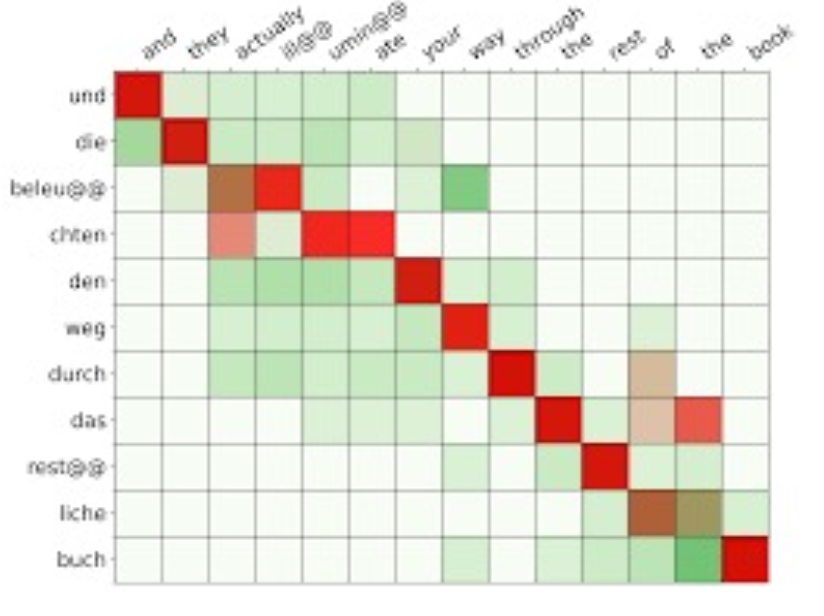
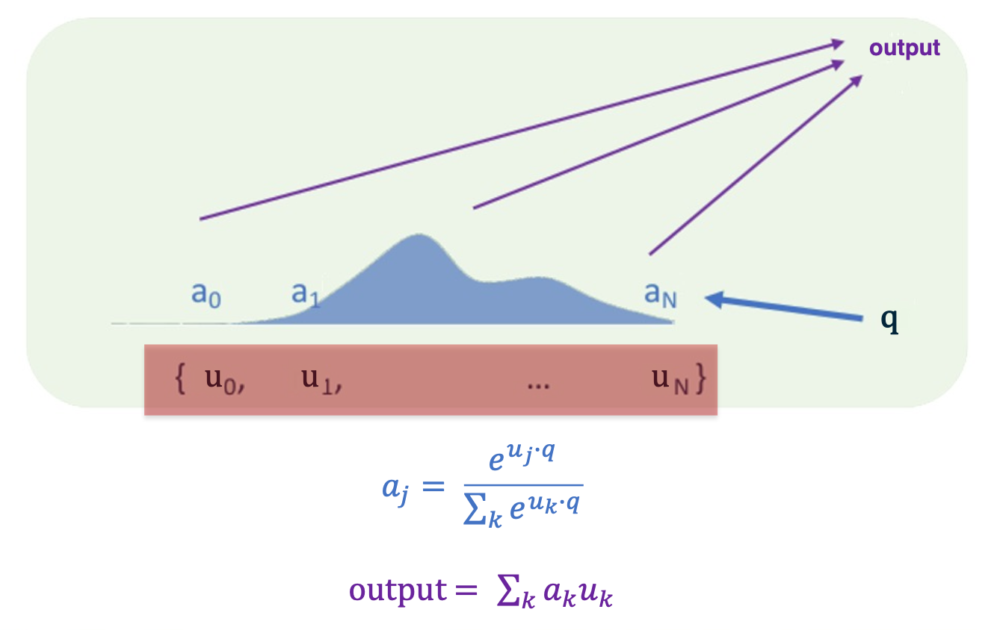
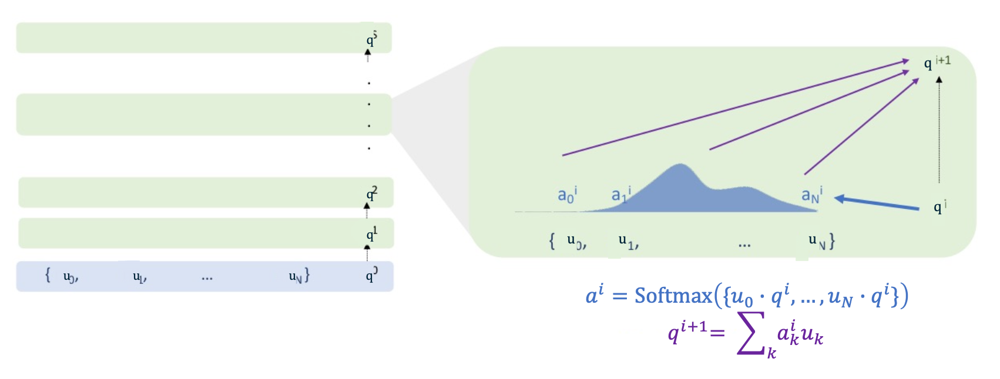
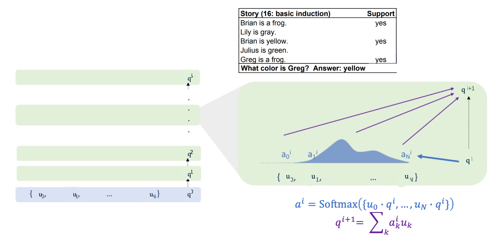
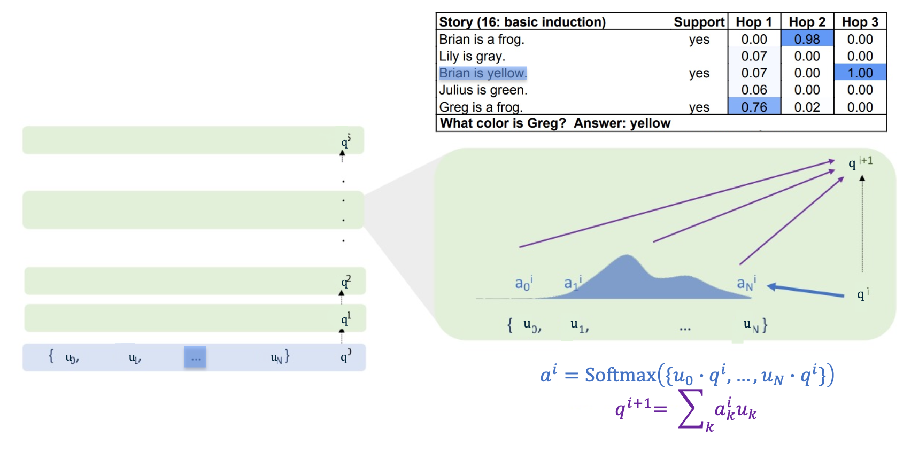
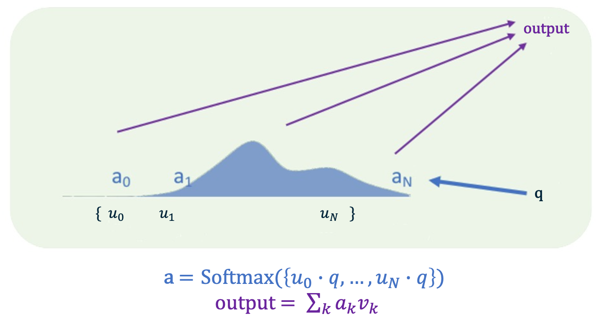
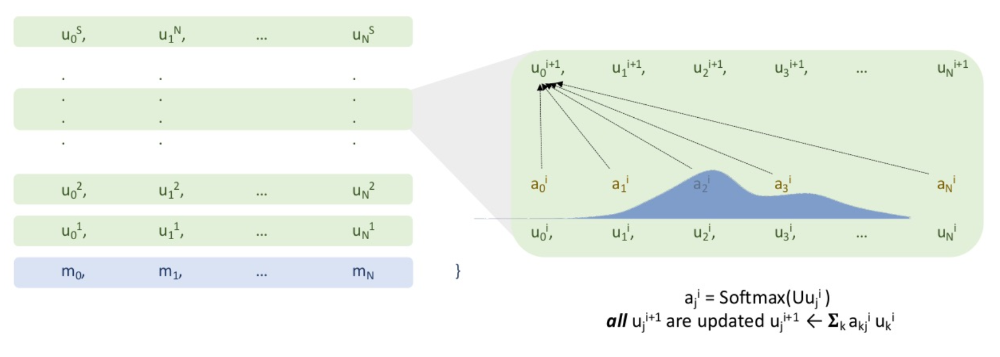
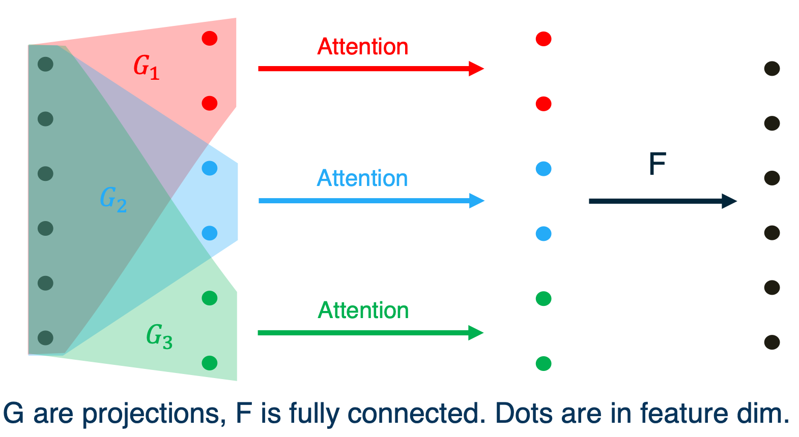
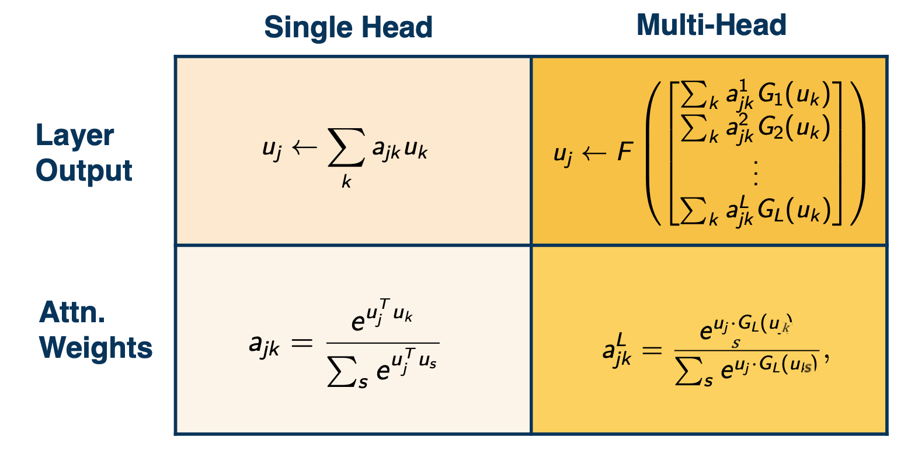

### Readings

* [Attention is all you need](https://arxiv.org/pdf/1706.03762.pdf)
* [BERT Paper](https://arxiv.org/pdf/1810.04805.pdf)
* [The Illustrated Transformer](http://jalammar.github.io/illustrated-transformer/)

### Softmax and Preview of Attention

We are going to a review of softmax function, because we are going to use the softmax function as a mechanism for neural attention.

* Attention: Weighting or probability distribution over inputs that depends on computational state and inputs
* Attention allows information to propagate directly between "distant" computational nodes while making minimal structural assumptions.
* The most standard form of attention in current neural networks is implemented with softmax. 

Softmax:

* For any inputs the softmax returns a probability distribution.
* Softmax is permutation equivalent (a permutation of the input leads to the same permutation of the output)

Recall that for softmax, the most mass of probability distribution lies on the largest input. So the softmax should be ArgSoftmax, so because it gives you a distribution, it is selecting from the inputs: 

* Softmax interpolates between a distribution that selects an index uniformly at random
* And a distribution that selects the argmax index with probability 1
* softmax is differentiable

We can make this a little bit more relevant to attention by taking about vectors by making these vectors instead of real numbers, what we want to do is select vectors by how similar they are to a query:

* Given a set of vectors $\\{u_1,...,u_N\\}$ and a "query" vector $q$,
* We can select the most similar vector to $q$ via $p = Softmax(Uq)$
  * We cannot use argmax because it is not differentiable
* $U$ is the vectors arranged as rows in a matrix
  * This is the "softmax attention"

When softmax is applied at the final layer of a MLP:
* $q$ is the last hidden state, $\\{u_1,...,u_N\\}$ is the embeddings of the class labels
* Samples from the distribution corresponding to labelings (outputs)
In softmax attention:
* $q$ is an internal hidden state, $\\{u_1,...,u_N\\}$ is the embeddings of an "input" (e.g previous layer)
* The distribution correspond to a summary of $\\{u_1,...,u_N\\}$

### Attention

More generally, attention in the context of a neural network is a distribution over the inputs of that layer that depends on the computational state of the layer and the inputs themselves. We can talk about hard attention, which means you select one of the inputs or you select some of the inputs explicitly. Or soft attention where you compute some summary over the inputs.

The most common form of neural attention nowadays is softmax potential. In computer vision, a natural way of using attention is saccades, or deciding where to look based on what you have seen before and what is in the image currently. In these works, attention is over the set of spatial locations in an image - given current state/history of glimpses, where and at what scale should we look next? 

Attention also ahs a pretty long history in NLP, in particular in translation there is a notion of alignment. 

{: width='400' height='400'}

Native alignment is if you are translating a sentence from one language to another. In the picture there we are translating german to english. If you are translating a sentence from oen language to another, you might expect that there is some loose correspondence between the words in the sentences. So it doesn't necessarily need to be exactly one to one, its just for each english word in the target sentence, maybe there is some german word in the source sentence that maps to it. And the order isn't going to be preserved and it doesn't, again, even need to be an exact correspondence. Maybe one word in English corresponds to a set of words in German. And so a soft alignment is a way of making this notion precise. It is for each word in the target, you have a distribution over words in the source, it is for each word in the target, you have a distribution over words in the source. If you think about it, that is attention just as we have talked about it before. The computational state is where you are in the sequence as you are translating and the input is the source sentence. So you have a distribution over the input, which is the source sentence, that depends on the computation state which is where you are in the translation, and the input itself. 

Attention as a neural network layer explicitly seems to be pretty surprisingly new and it only became popular, very, very recently, and part of that is just due to the hardware we had and the training techniques we had. Making things train successfully with neural attention is a little bit more tricky than training conv nets or fully connected networks. 

#### Current (Standard) Approach to (Soft) Attention

{: width='400' height='400'}

The way it works is you input to the layer a set of vectors which are highlighted here in red, the $U$. We are going to take this set of vectors and inner product each one of these vectors with a controller $q$. The controller is part of the layer's state. We will talk about where that might come from in a little bit. you take that controller state and you inner product against each of the $U$, which again is a set of vectors, not a sequence of a list or anything ordered. 

So when you inner product the controller state against $U$, you then take the softmax of that set of numbers and that gives you weights a:

$$
a_j = \frac{e^{u_j \cdot q}}{\sum_k e^{u_k \cdot q}}
$$ 

So now we have this set of weights, that have been obtained by softmax of the controller against the inputs, and the output for the module is summing up the inputs with the weights given by the softmax function that we computed previously. This is soft attention in its simplest form. There are other more complicated things you could do, for example you could have the inputs $U$ be stacked as $Us$ and $V_s$ where the $Us$ are called the keys. The keys would be used to compute the softmax weight and the $Vs$, the values, would be used to compute the output. There are other transformation you can apply other than just summing the things up. 

An important property of softmax attention as a layer, or attention as a layer more generally, is that the representational power grows with the size of the input. So in contrast to, for example, a fully connected layer, which can just take an input of a fixed size or a classical recurrent network, in which case the representational size is the same, independent of the length of the sequence that you feed into it. A softmax has a hidden state that grows with the input and and that is one of the secrets of its power. 

#### Multi-Layer Soft Attention

{: width='400' height='400'}

Here we are showing one example of a multi-layer neural attention model. And in this model, the hidden state of the model is the controller, q. And so the controller at $q^0$, the initial controller state, comes from somewhere (we can talk about where that might come from or it might be set all to 0). Then the inputs to the network are the same as in the previous parts where the inputs to the layer were a set of vectors. So we have the inputs to the network being a set of vectors and some initial controller state $q^0$. And we update $p^1$ via the softmax attention exactly as we saw before, and that is described on the right. And after one layer of softmax attention we get a new controller state $q^1$. The new controller state is used to compute the next softmax attention layer with the inputs being the $U$ as before, and keep repeating that over and over again. So each layer of the network is softmax attention and the hidden state is the controller. 

{: width='400' height='400'}

Watch this in action for an example, so the example comes from baby tasks, and what we have is a little story to guess. So the story is Brian's a frog, Lily is gray, ... , Greg is a frog. And then the model is expected to answer a question about the story. So here the question is what color is Greg?

And the idea is that well, the model should recongnize that Brian's a frog and Brian is yellow. So if Greg is a frog, Greg should maybe also be yellow. (You may not buy the logic of the problem but thats how the model is being trained to do that kind of induction) 

The inputs to the network, the $U$, are going to be the encodings of each sentence in the story. So for example $u_0$ is some encoding of Brian is a frog, $u_1$ is encoding of Lily is gray and so on. The initial controller state is going to be an encoding of the query "What color is Greg?" using similar sort of encoding to the previous sentences. 

Now once we have done this encoding, then $q^0$, which ahs the encoding of what color is greg in it, has the largest inner product with "Greg is a frog" amongst all the sentences in the story because it has the word Greg in it, and "Greg is a frog" has the word Greg in it, and none of the other sentences have any word overlap or any kind of other overlap with what color is Greg. Thus, $u_4$ gets the bulk of the attention weights. So $a^4$ has the largest attention weight. And then when we compute the updated controller state as a weighted sum of the encoded sentences, the updated controller state is mostly the encoding of Greg is a frog. Then, we take that updated controller state, and, again, inner product it against all the inputs. (We do not directly use the weighted sum, we make a rotation of a transformation projection of it so that you do not want Greg is a frog to have the biggest inner product with Greg is a frog, so the rotation is there to stop it from happening). After that, the encoding Greg is a frog which is what is sitting in the controller state or $q^1$, has highest inner product with Brian is a frog. The same story unfolds and most of the attention weight is going to be on Brian is a frog, and when you make a weighted sum of all the sentences encodings with that weight, then as you update the controller state $q^2$, the controller state is basically going to have Brian is a frog. (Similar rotation is applied so you do not attend to the memories you have attended to before) 

{: width='400' height='400'}

Continuing in the same way, the controller state now has the encoding of Brian is a frog in it and has been rotated so you cannot hit inputs that you have hit before, so the maximum inner product is on Brian is yellow, because you have the Brian and the Brian. So when we repeat the same update to the controller state, we end up with Brian is yellow in the controller state. Finally, we want to output something and so the machine knows enough what a color is and can match the color to the yellow that is in the controller state. And so the final output layer when it looks at the controller state can pick out the yellow and answer yellow. And this is how this kind of multi-layer attention can do reasoning over a set of inputs, reasoning over a set of quotes. 

So everything we have talked about has kind of taken the input set as a set, as a pure set, and a lot of times that is not ideal. Even in these baby stories just discussed, it can be useful to know the order of sentences if there is some temporal information there. More generally:

If inputs have an underlying geometry, can include geometric information in the weighted "bags". The most standard piece of geometric information you have is sequence order, if the inputs have a temporal structure or casual structure, you can use that. The most standard way people use that is with position embedding. Position embedding is simply a vector that depends only on the location in the sequence which is added to an input that is placed at that location in the sequence.

Example: For sequential data, use position encoding, given the "location" in the sequence of that inputs.
* For each input $m_j$ add it to vector $l(j)$
* $l(j)$ can be fixed during training or learned
* For example, a sinusoid of varying frequency in each coordinate 

### Transformers

Transformers are a multi-layer neural attention model that is currently state of the art in most language tasks and beyond their state of art in some audio tasks even, and some vision tasks. Has superior performance compared to previous attention-based architectures via

* Multi-query hidden state propagation (or known as self-attention)
* Multi-head attention
* A bunch of things that improved the performance such as Residual connections, LayerNorm, other things that stabilize the training of neural networks.
  * These benefit most networks and not just transformers. 

{: width='400' height='400'}

Recall that we can do more complicated things, such as using $u$ to calculate the softmax weights, and Values $v$ are used to compute the output.  

#### Self-attention

{: width='400' height='400'}

In the previous section, we showed how a multi layer softmax attention network works. Self attention like in a Transformer improves on this by having a controller state for every input. And in the same way, attention has an advantage over say recurrent neural networks, and that the hidden state grows with the size of the input. A transformer or other self attention style network has an advantage over the previously shown simpler multi layer attention network and there is a controller for every input, so the size of the controller state grows with the size of the inputs.

The way it works is each input has a controller state living over it, those are the $u^j$ and those controller states, each one of them are updated with softmax attention just as the multi layer attention network shown previously did. 

#### Multi-head attention

Multi head attention splits up the controller states into chunks and operates the self attention on each chunk separately and then recombines with a fully connected network. 
* Multi-head attention combines multiple attention "heads" being trained in the same way on the same data - but with different weight matrices, yielding different values
* Each of the L attention head yields values for each token - these values are then multiplied by trained parameters and added.

{: width='400' height='400'}

So it looks like this, on the left, we see the input controller state. We take some projections which we will call G and take the full state and map it down to smaller sub states. On each of the sub states, we run attention, we get attention weights for each of them, and then sum up as normal. So we do our weighted sums with the attention that was computed on each chunk and then we take a fully connected network, that is the mapping from the colored dots to the black dots. We take a fully connected network to combine all of the chunks. 

{: width='400' height='400'}

In equations this looks like this, where as for the attention weights of the single head attention that is the bottom left corner. We take the inner product of each input with its controller state and take the softmax of that. In multi-head attention we first project the controller state to L different chunks and we compute L different sets of weights. And for the recombination in the top left, we see single head attention, we just sum up the weights against those inputs. In multi head attention (on the top right) we first sum up each head independently. And then we apply a fully connected network to recombine. 

#### Residual connections, LayerNorm

Nothing much other than how these has helped all kinds of neural networks, and not just transformers.

As a last point, 
While Transformers operate on sets of vectors (or graphs), because you can mask out certain locations of the attention based on a graph structure. However in this notes, they were introduced in the setting of text so they became famous in the context of state and are really state of the art as NLP models. 

There is a bunch of things that people tend to do specifically for NLP:

* Position encodings depending on the location of a token in the text
* For language models: “causal attention”
  * e.g in language, we mask out attention weights that do not go from left to right. (since you only read text from left to right)
* Training code outputs a prediction at each token simultaneously (and takes a gradient at teach token simultaneously)
  * By not inputting a sequence and outtpuing a single output to be checked, but rather over each input token, you output token at the same time.
  * For example for language model, instead of reading the context and outputting the next word, at every word in the context, you output the next word simultaneously. This multiplies the speed of your training by the size of the context. In order to do that, for language modeling, you have to use the casual attention described above. 
  * For math language models like BERT, you do not need casual attention and you can make an output at every token simultaneously without using casual attention. 

<!--  -->
