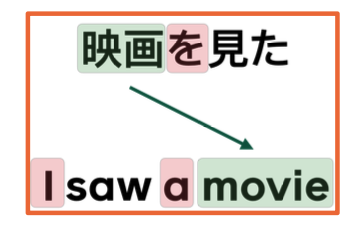
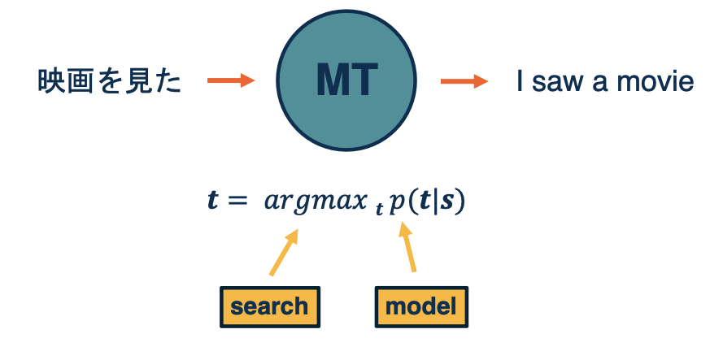
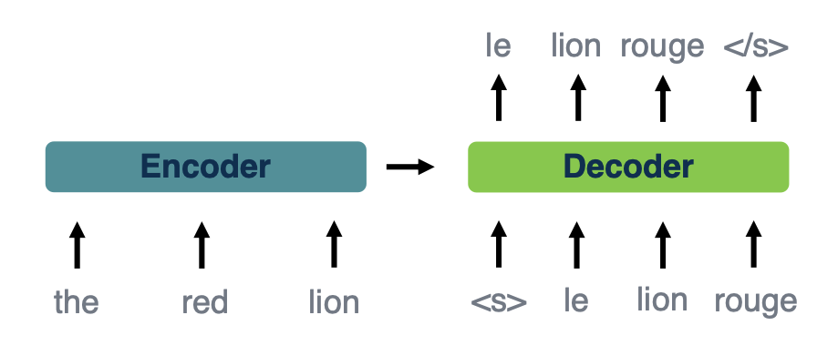
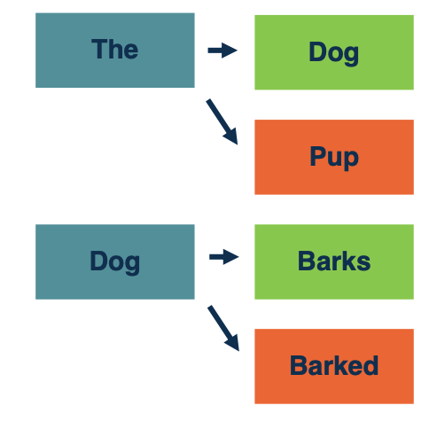
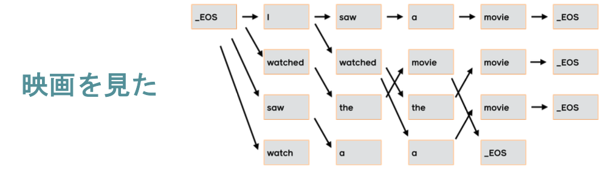
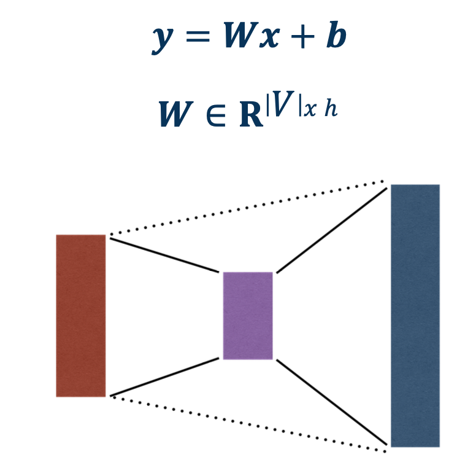
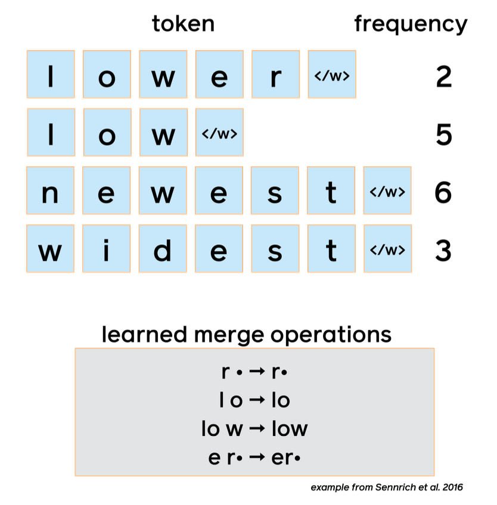
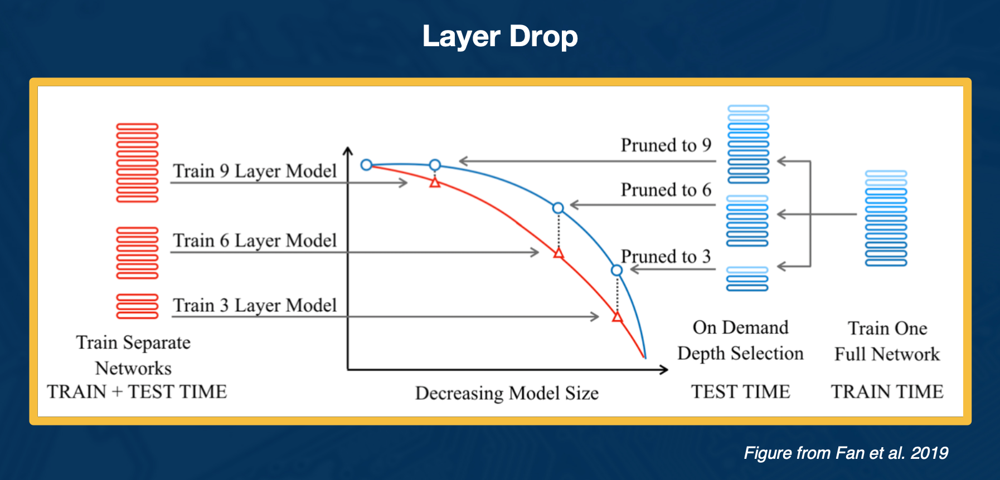
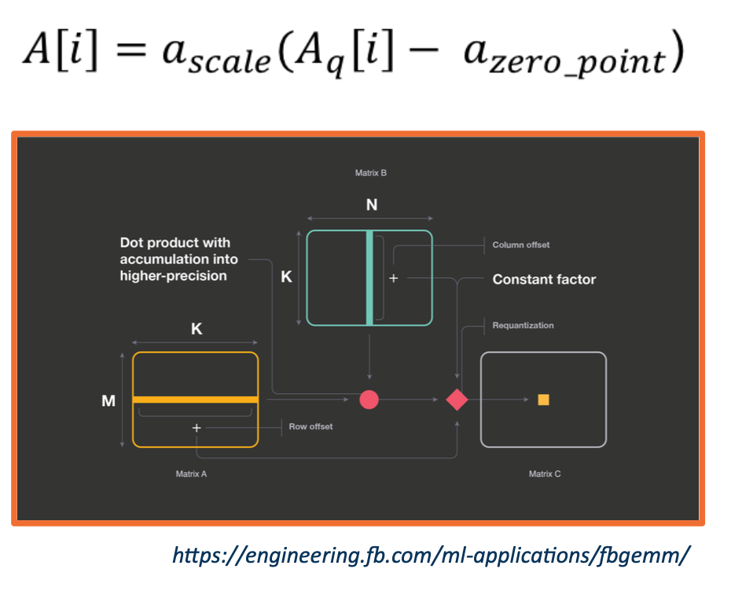
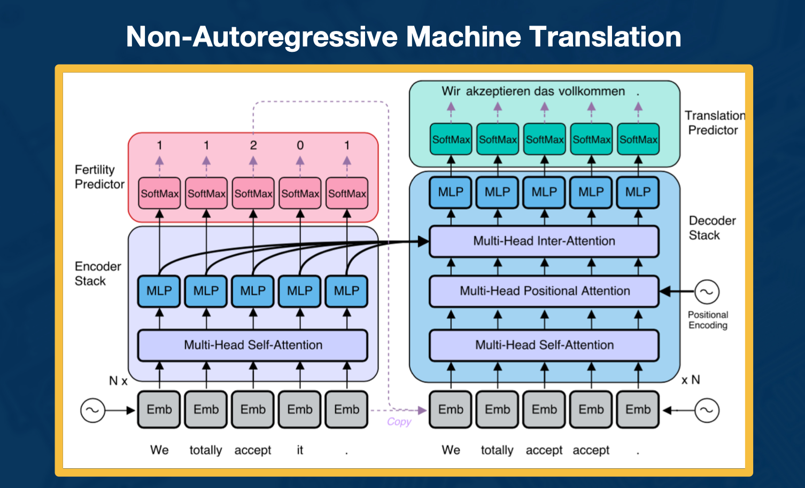

### Readings

None!

### Neural Machine Translation

#### Translation is hard problem

There are **many correct translations** for a typical input sentence. 

**Language is ambiguous**
* The professor said on Monday we would have an exam

**Language depends on context**

* I saw her duck 🙇
* I saw 👁 her duck 🦆 
* I saw :smile: her duck 🦆

Languages are very different in structure which can sort of make it particularly different to go from one to another. 

{: width='400' height='400'}

Here we see an example of simple sentence both Japanese and English where we can see the object word for movie are in very different parts of the sentence. And each language uses particular types of function, which might not be explicitly used like the object marker in japanese and the pronoun and article in English. 

#### Machine Translation

{: width='400' height='400'}

Let's take a look at how Machine translation approaches the problem of translating automatically. So the general structures, is you want a sentence in one language t o come in, e.g In Japanese and want to output English. The way we are going to break this down as a machine learning problem is, will represent the probability of the target sentence, the English sentence here. Given the four particular source sentence, since the sentences the output is composed of a sequence of tokens, probably each word, I saw a movie the decision is not as simple as a simple classification.  so we are going to need some way of doing search over the exponential space of possible output tokens, that is what is represented by this argmax here. We want to approximate the best target sentence for a given input.  

#### Sequence Generation is Autoregressive

Translation is often modeled as a **conditional language model** where you have a language model over target tokens and is conditioned on the source sentence.

$$
p(t\lvert s) = p(t_1\lvert s) \times p(t_2\lvert t_1,s) \times ... \times p(t_n \lvert t_1, ..., t_{n-1}, s)
$$

Probability of each output token **estimated separately** (left to right) based on:
* Entire input sentence (encoder outputs)
* All previously predicted tokens (decoder "state")
* Language has a left to right property, we will see in a ML model leads to what we call auto-regressive generation.

The other problem is exact search $argmax p(t\lvert s)$ is **intractable**
* Exponential search space of possible sequences
* Estimated by beam search (covered shortly)
* Typical beam sizes: 4 to 6

#### Seq-to-Seq Models

{: width='400' height='400'}

This image models the sort of overall structure,that sort of overall framework and two, which will fit our neural network models to do what we call sequence to sequence learning. Where in some way we will get an intermediate representation of the entire source sentence, and what will be called the encoder. And then the decoder will be using that input predict output tokens one at a time. So you will have some notion of that each step is putting the previously predicted token in addition to considering the encoder, which you see here. And these tokens will be represented by word embeddings which you have seen before. 

#### Beam search

{: width='200' height='200'}

So the way we are going to approximate the argmax, so the most likely target sentence is using beam search. Very simply, that means we are going to explore a limited number of hypothesis at a time, that number will be called the beam size $k$. So here, we see a simple model where the beam size is two. So at each step, we are considering two possible total sequences. And the first step we have the two most likely top words, the D, and dog. Now, we are going to expand each of those into most likely tokens, so here, we are seeing in the next step, we have the top four most likely sequences expanded just by taking hte top two of each, and then we will take the top two overall to expanded it in the next step. 

In a nutshell:

* Search exponential space in linear time
* Beam size $k$ determines "width" of search
* At each step, extend each $k$ elements by one token
* Top $k$ overall then becomes the hypothesis for next step

To make it more concrete, this is what beam search might look like for a full translation example, again translating that same JApanese sentence into English. So you can see that based on the overall probabilities at each step, the different hypothesis can be expanded into the next step. 

#### Neural Machine Translation Architectures

Finally, this is an overview of the sort of specific types of neural networks you might see plugged into that encoder decoder spot.

* RNN (typically LSTM) (When neural machine translation gained traction, these were typically recurrent neural network models, which makes sense when you consider language is fundamentally a sequence)
  * Bi-directional encoder
    * Since you know the entire sentence at once, and then a unidirectional left to right decoder. 
  * Major breakthrough: encoder-decoder attention
* Convolutional
  * Encoder and decoder based on fixed-width convolutions
    * Here we would be dealing with a 1D convolution over the sequence length.
  * Simple activation function (Gated linear units)
* Transformers
  * Architecture used in most recent work
  * Originally proposed for machine translation
    * full self attention on the encoder and casual self attention on the decoder.
  * Though now especially well known due to BERT and friends

### Inference Efficiency

Inference Efficiency is an important topic because these sequence to sequence models for state of the art translation can be very large in particular while training it can be expensive.

Whats expensive?:
* Step by step computation (Auto-regressive inference)
* Output prediction: Θ($\lvert$ vocab $\lvert$ * output length * beam size)
* Deeper models

Strategies:
* Smaller vocabularies
* More efficient computation
* Reduce depth/increase parallelism

#### Vocabulary Reduction

{: width='200' height='200'}

* Large vocabulary makes output projection expensive
  * Can address this by subsetting the vocab, e.g taking out uncommon words. 
* However not all tokens likely for every input sequence
* IBM alignment models use statistical techniques to model the probability of one word being translated into another
* Lexical probabilities can be used to predict most likely output tokens for a given input
* Achieved up to 60% speedup

#### Byte-pair encoding

{: width='200' height='200'}

* Languages have very large (or open-ended) vocabularies
* Problem: how to model rare or unseen words
* Character models are general but can be too slow in practice
* Subword models solve this by breaking up words based on frequency
* One widely used algorithm is byte- pair encoding (BPE), illustrated at right

Example of byte-pair encoding:

* Byte-pair encoding comes from **compression**, where the **most frequent adjacent pair is iteratively replaced**
* **Example** consider this string `abcdeababce`
* **Step 1** replace most frequent pair "ab" by "X" (and add replacement rule), `XcdeXXce`
* **Step2** replace next most frequent pair (e.g Y=Xc) yielding `YdeXYe`, so `X=ab` and `Y=Xc`

#### Layer Drop

{: width='400' height='400'}

So you can think of this analogous in some way to drop out, at least for training. You are not going to use every layer for training so you drop them with some probability and then at the end to get a faster network for inference time, you can select layers to prune. This gives you a smaller model with a good trade off with only slight decrease in performance and accuracy, but much faster because you are not doing every decoder layer. 

#### Hardware Considerations

Inference is **faster on specialized hardware** (GPUs, TPUs, etc.) 

**Batched vs. on-demand:** average efficiency can be increased by
translating multiple inputs at once
*  Especially with accelerators (GPUs, TPUs, etc.)
* However may not be practical for real-time systems

Big speedup from **parallel computation**
* Especially with accelerators
* Autoregressive inference time dominated by decoder

#### Quantization

{: width='300' height='300'}

* Computation time is dominated by matrix multiplication
* Inference can be sped up by performing operation in lower precision domain
* Training quantization also possible (e.g, FP16 on current Nvidia GPUs)

#### Non-autoregressive Machine Translation

{: width='400' height='400'}

One of the big sort of bottlenecks that slows down computation is the need to predict each token in the output sentence one after another. So the idea here is to get around this by predicting all of the tokens at once. So that is challenging and not quite state of the art yet. The reason for that is because you have to figure out some way of coordinating all the sequences. You are doing structured prediction, right? Each token has to work together rather than be predicted in isolation. But there has been a lot of varied work on this recently and it is exciting new direction for future research and sequence generation.

<!--  -->
