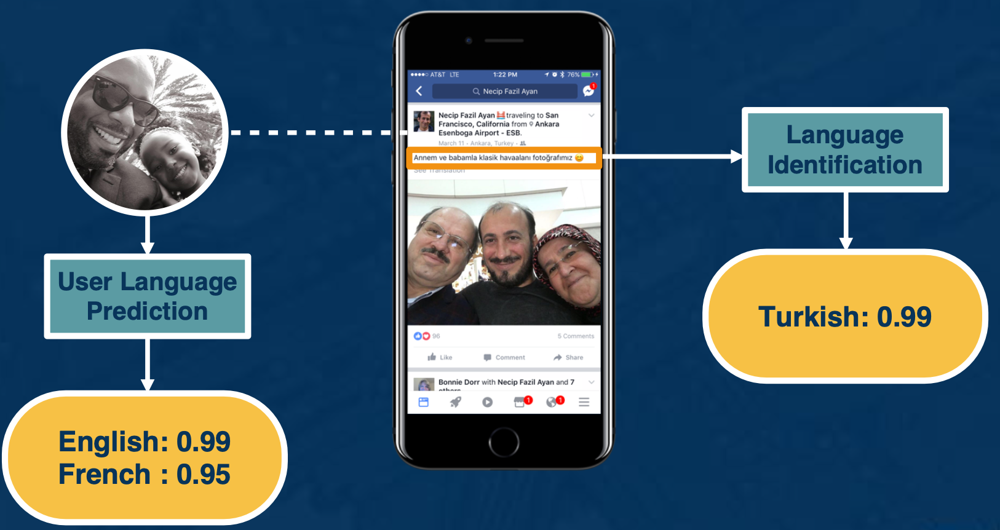
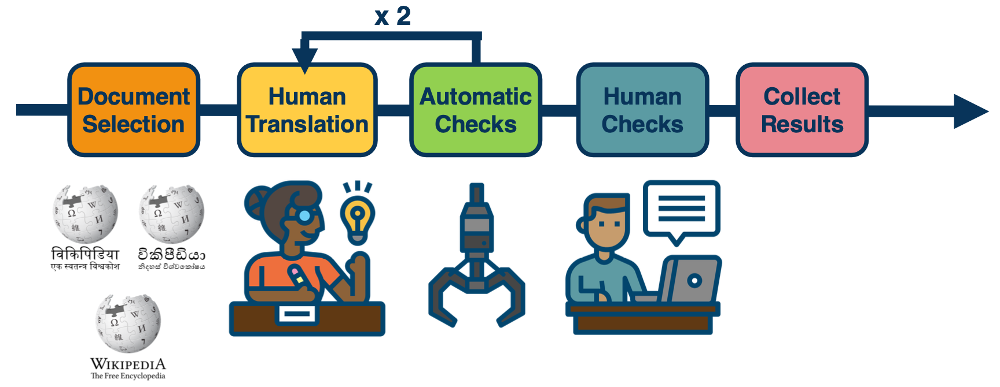
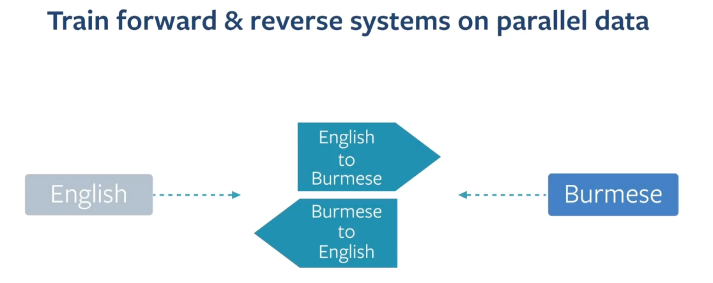
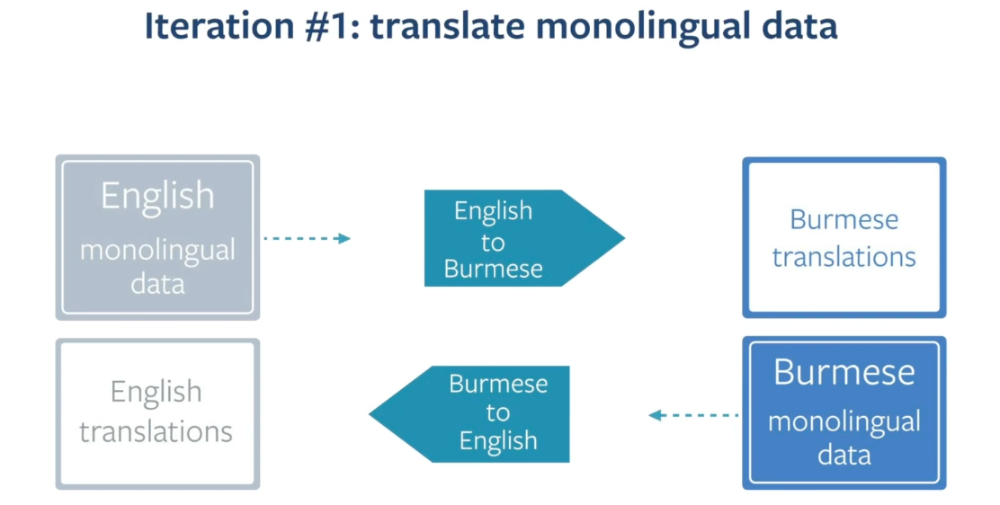
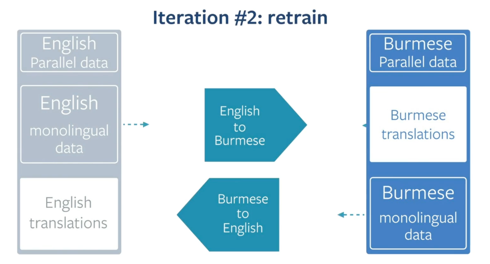
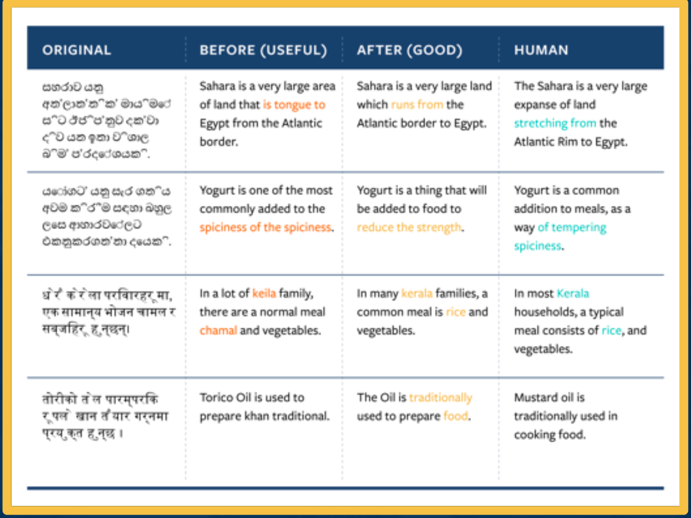
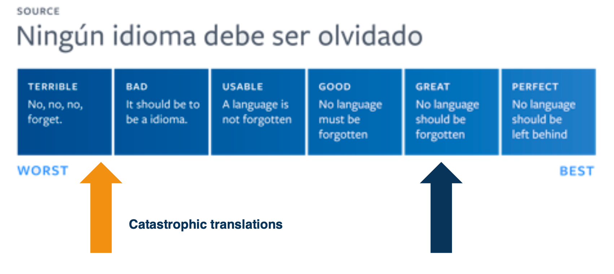

### Readings

* CTC based ASR Systems: [Connectionist Temporal Classification: Labelling Unsegmented Sequence Data with Recurrent Neural Networks (Links to an external site.)](https://www.cs.toronto.edu/~graves/icml_2006.pdf)
* RNN-T based ASR System: [Sequence Transduction with Recurrent Neural Networks (Links to an external site.)](https://arxiv.org/pdf/1211.3711.pdf)
* RNN-T Contextualization with Biasing and Attention Module: [Contextual RNN-T For Open Domain ASR (Links to an external site.)](https://arxiv.org/abs/2006.03411)
<!--  -->

### Translation at Facebook

* Have a language identification module that runs for every single piece of text that is produced by Facebook and it assigns it. 
  * Language score - the most likely language that this piece of text is in. 
* Have a user language model that tells us what are the likely language a certain user understands. 
  * Based on the history on how much they communicate in a certain language or how much they consume content in a certain language. 

{: width='400' height='400'}

The tricky part when we detect that a certain user cannot understand the content because it is in a different language, we provide the option to see translation. There is a little button where if the user clicks it, the user is accessing the translation in their language of preference. 

### Translation Challenges: Low Resource

Challenge 1: Social media text can be short, error phone, new words, hashtags etc. Emerging languages are also a challenge, this brings about a lack in data.

NMT (Neural Machine Translations) systems have a steeper learning curve with respect to the amount of training data , resulting in worse quality in low-resource settings, but better performance in high- resource settings. For example if you to go rarely used languages, you barely have 10,000 sentences to train on. 

Challenge 2: Language similarity 

Languages that tend to be linguistically very close to each other say English and Spanish or English and French. And in reality, many of the languages that we need to learn to translate are not very well related to English. 

Challenge 3: Domain

Even if we have some availability of data, it is quite possible that it is not in the right domain, is not geared towards our needs. So for example if you want to learn to translate news, you may have available data that is related to baboons to manuals or that is related to medical terms, but not necessarily in the area that you want to learn. 

Challenge 4: Evaluation

For many of the language pairs that we will like to improve, we do not have access to a real test set. It is often emulated by ablating or reducing high resource language pairs which they do not correctly represent the reality of a low resource situation. 

The team mainly worked on challenge 4, which gave birth to the **Flores project**.

{: width='400' height='400'}

* started with open source data, wanted to have a rich combination of different domains in test set; choose wikipedia nad sampled different domains coming from science, religion, business, sports, etc. 
* Then, send these sample documents to translation. Due to low resource, automatic checks are required and then 2 Human translations is required to audit the translations.
* Then run human checks again, those with poor quality is sent back
* Finally collect the results which enables a high quality benchmark set together with some training data that we publish so researchers could actually start making process in solving the low resource language. 

One of the most powerful techniques is Multilingual Training. It exploits the relatedness between certain languages, if one is resource poor and another one is resource rich, we can do some transfer learning. For example when you have languages like Ukrainian and Belarsian which belong to the same language family, lexical to semantic etc. Nowadays you have modern models like the G sharp which are actually embedding 100 languages into a single model to be able to translate to English. 

Another technique that has been used quite extensively is back translation. This same supervised technique allows us to leverage large quantities of monolingual data, which we then use to train a larger model. This works very well for languages like German and English, and has helped to bring equality to a level that has won several translation competitions.

How does this work? You have some small amount of training data say from German to English, you train the small model, German to English, you then use to annotate large quantities of German data into fake English data, or translated English data. And now, you use this pair, you reverse the order and you use it in conjunction to your previous data. So now you can train a better English to German system. This has worked well for high resource languages but not so for low resource language. Because in the low resource condition, the intermediate model is so weak that the data that you generated is not good enough. 

So here comes iterative back translation, 

{: width='400' height='400'}

We take the same idea by constellation, but do it in several stages. 

{: width='400' height='400'}

First, you train intermediate English to Burmese and vice versa, which you then use to translate large quantities of monolingual Burmese and English data. 

{: width='400' height='400'}

Then you repeat this operation, you take this, the data that was generated by these models and train at second iteration intermediate model that you then use to translate more monolingual Burmese and more monolingual english data and so on. 

Another way to do this can be:
* Language Agnostic Sentence Representations
* Web scale mining

{: width='400' height='400'}

### Rethinking Translation Quality

It is possible that translations goes horribly wrong. e.g when we translate "good morning" into "attack them" or names of public figures have been misunderstood, resulting in offense translations. 

One idea is to use a quality scale:

{: width='400' height='400'}

The problem is this scale is not continuous, and sometimes a small mistake can led to a catastrophic translations. Those are the ones that would lead to a terrible experience for users. 

So what are catastrophic translations? Here are some examples:

* Bad Named Entity translation (El Centro, CA -> The Center, CA)
* Wrong pronouns (it, he instead of she)
* False profanities ( Mr sh*thole)
* Implausible translations (a water
treadmill)
* Introduction of violent terms (“attack them”) 

One possible solution is to design the modeling and the measurement of translations quality centered around user experience. 

* Catastrophic-aware translation systems
  * Able to explain the type of mistakes they believe and what reasons they believe so
* Quality metrics that account for critical mistakes
* AI Systems with more transparency and control

### Different Approaches for ASR: Readings and Additional Resources

Look at one type of ASR (Automatic Speech Recognition) which is the RNN-T.  For the remainder of this lesson (16) RNN-T stands for recurrent neural network transducer based ASR systems. 

These Sections are not covered as they are not related to the assignment + your time is better spend on reading the "attention is all you need paper"!

* Introduction to Different Approaches for ASR
* Task of Automatic Speech Recognition (ASR) System
* Modularized (Hybrid) ASR
* Non Modularized (End2End) ASR
* RNN-T Training
* RNN-T Decoding: How to Utilize RNN-T Model at Test Time
* RNN-T Greedy Decoding
* RNN-T Beam Search Decoding
* RNN-T Personalization
* Different Approaches to ASR Conclusion

<!--  -->

