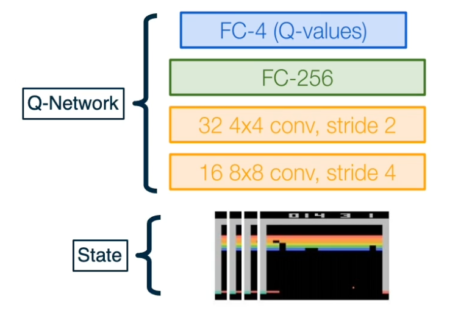

### Readings

* [MDP Notes](https://courses.cs.washington.edu/courses/cse579/22au/Lectures/MDP_notes.pdf)
* [Notes on Q-learning](https://courses.cs.washington.edu/courses/cse579/22au/Lectures/TD_notes.pdf)
* [Policy iteration notes](https://courses.cs.washington.edu/courses/cse579/22au/Lectures/PI_notes.pdf)
* [Policy gradient notes](https://courses.cs.washington.edu/courses/cse579/22au/Lectures/PG_notes.pdf)

### Reinforcement Learning Introduction

Reinforcement learning is the Sequential decision making in an environment with evaluative feedback.

{: width='400' height='400'}

* Environment may be unknown, non-linear, stochastic and complex.
* Agent learns a policy to map states of the environments to actions.
  * Seeking to maximize cumulative reward in the long run.

**Evaluative Feedback**
* Pick an action, receive a reward (positive or negative).
* No supervision for what the “correct” action is or would have been, unlike supervised learning

**Sequential Decisions**
* Plan and execute actions over a sequence of states.
* Reward may be delayed, requiring optimization of future rewards (long-term planning).

**Signature Challenges in Reinforcement Learning:**
* Evaluative feedback: Need trial and error to find the right action
* Delayed feedback: Actions may not lead to immediate reward
* Non-stationarity: Data distribution of visited states changes when the policy changes
* Fleeting nature of time and online data

For RL to work, it needs a environment interaction API. In other words:

* At each time step $t$, the agent:
  * Receives observation $o_t$
  * executes action $a_t$
* At each time step $t$, the environment:
  * receives action $a_t$ 
  * Emits observation $o_{t+1}$
  * Emits scalar rewards $r_{t+1}$

### Markov Decision Processes

* MDPs: Theoretical framework underlying RL
* An MDP is defined as a tuple $(S,A,R,T,\gamma)$
  * S - set of all possible states 
  * A - set of possible actions
  * $R(s,a,s')$ - distribution of reward
  * $T(s,a,s')$ - Transition probability distribution 
  * $\gamma$ - Discount factor
* Interaction trajectory: $... s_t, a_t, r_{t+1}, s_{t+1}, a_{t+1}, r_{t+2}, s_{t+2}, ...$
* Markov property: Current state completely characterizes state of environment 
* Assumption: Most recent observation is a sufficient statistics of history

$$
P(S_{t+1} = s' \lvert S_t = s_t, A_t = a_t, S_{t-1} = s_{t-1}..., S_0 =s_0) = P(S_{t+1} = s' \lvert S_t = s_t, A_t)
$$

In Reinforcement learning, we assuming MDP with unknown transition probability distribution T, and reward distribution R.

Evaluating feedback comes into play, and trial and error necessary.

For this lesson,  assume that we know the true reward and transition distribution and look at algorithms for solving MDPs i.e. finding the best policy
* Rewards known everywhere, no evaluative feedback
* Know how the world works i.e. all transitions

#### A Grid World MDP

Let's take a look at a simple environment 

{: width='400' height='400'}

The 2D environment above is a grid world, where there is an agent indicated by a blue triangle, where the state of the environment is the agent right now is at $(2,3)$. The actions that the agent can take is either move one cell north, east, south, or west. The rewards are either +1 or -1 at the absorbing states shown in the figure above. 

With this setup, it is easy to see that the optimal policy is to head east twice in order to reach the +1 absorbing state. However, let's assume that there is some noise in how the agent transitions to next state. This noise is in the form of a 20% chance, of the agent drifting once a left or right of the direction of motion. 

Now, things get a bit complicated the policy will now have to prescribe an action, for the states that the agent could land up in as it is not guaranteed to always move in the direction of east. One way to describe such a policy would be in the form of a 2D matrix of the same shape as this 2D grid, with each matrix element is prescribing an action to take if the agent is at that cell. This leads us to the formal definition of a policy, that we will use for solving MDP. 

#### Solving MDPs: Optimal Policy

Formally, a policy is a mapping from states to actions in which a single action is prescribed at each state. 

* Deterministic - $\pi(s) = a$
  * This is defined by a $n \times 1$ tensor.
    * Because there is only 1 action possible at each state. 
* Stochastic $\pi(a \lvert s = P(A_t = a \lvert S_t = s))$
  * This is defined by a $n \times m$ tensor. 
    * finite set of n states and finite set of m actions

so, what makes a good policy?

* Maximize current rewards? Sum of all rewards?
* Discounted sum of future rewards?

{: width='400' height='400'}

For this lecture we are going to use the discounted method, which is the factor $\gamma$. 

{: width='400' height='400'}

There are three random variables involved, the distribution over initialization states, $s_0$, actions across policy $a_t$ and the transition distributions over next states $s_{t+1}$

Sum of discounted rewards prefers rewards now to rewards later (with preference increasing with smaller $\gamma$ ), where $\gamma \in [0,1]$ 

{: width='400' height='400'}

Let's now look at how the optimal policy is sensitive to changes in the MDP. The three figures shown here are for the same 2D grid world environment with stochastic transitions as earlier but with a small modification. There is now a constant reward value at all non absorbing states, and this constant is set to three different values, corresponding to the three different figures shown here.  

We can see that as this constant rewards decreases to $-0.4$, going from the left to the middle figure,  the optimal policy starting from the bottom right of the grid, stops taking the longer route to get to the +1 absorbing state and instead a risker shorter path. Further, decreasing this constant to -2 in the right most figure, shows the agent directly jumps to -1 instead to incur a lesser cost. 

#### Discounting Future Rewards

{: width='400' height='400'}

For example consider this, what would you do if $\gamma = 1$ or $\gamma = 0.1$? 

Clearly if the discount factor is low, you would go and get the reward of 10 before going to 1. if the discount factor is high, you will just get the 1 immediately. 

#### Value Function

Now that we have looked at how to map state to actions with the policy, let's introduce a new quantity that will help measure the performance of a policy, at various states.

A value function can be intuitively thought of as a prediction of discounted sum of future rewards. First, we will introduce a state value function or V function as a mapping from states to real values. $V : S \rightarrow R$

That will provide information about how good a state is, in terms of future rewards. Similarly, a state action function or a Q-function, $Q :S \times A \rightarrow R$, which will inform us of how good is taking a particular action at a state. 

Formally, the value function $V$ of a policy $\pi$ at state $s$ is defined as the expected sum of the discounted awards. 

{: width='400' height='400'}

Similarly, The Q-function of the policy at state s and action a, is the expected cumulative
reward upon taking action a in state s (and following policy thereafter):

{: width='400' height='400'}

### Algorithms for Solving MDPs

Recall in the previous lecture, we define $P_\pi$ and $Q_\pi$ for a particular policy $\pi$. Now we can also define the V and Q functions corresponding to the special policy or the optimal      $\pi^\*$ as $V^\*$ and $Q^\*$, in which cases we have just replaced the $\pi$ with $\pi^\*$ in the definitions

$$
\begin{aligned}
V^*(s) &= \mathbf{E}\bigg[ \sum_{t \geq 0 } \gamma^t r_t \lvert s_0 = s , \pi^* \bigg] \\
Q^*(s,a) &= \mathbf{E}\bigg[ \sum_{t \geq 0 } \gamma^t r_t \lvert s_0 = s, a_0 = a , \pi^* \bigg]
\end{aligned}
$$

With these definitions in mind, here are some identities relating to the optimal quantities introduced so far. 

$$
\begin{aligned}
V^*(s) &= max_a Q^* (s,a) \\
\pi^*(s) &= arg max_a Q^* (s,a)
\end{aligned}
$$

The first says that the optimal value at a state is the same as the max Q value over possible actions at that state. The second relation says that the optimal policy at state s will choose the action that maximizes the optimal Q function at that state. 

#### Bellman Optimality Equations

$$\begin{aligned}
Q^* (s,a) =\mathbf{E}_{a_t,s_{t+1}}\bigg[ \sum_{t \geq 0 } \gamma^t r_t \lvert s_0 = s, a_0 = a \bigg]  \\
a_t \sim \pi^* (\cdot \lvert s_t), s_{t+1} \sim p(\cdot \lvert s_t, a_t)
\end{aligned}
$$

This expression can now be seen as the expected return starting from state s and action a. If we were to separate this summation into the first time step plus the remaining time steps, we will get the reward at the first time step, plus gamma times the return from the expected state at $t=1$. 

$$\begin{aligned}
Q^* (s,a) &=\mathbf{E}\bigg[ \sum_{t \geq 0 } \gamma^t r_t \lvert s_0 = s, a_0 = a \bigg]\\
&= \gamma^0 r(s,a) + \mathbf{E}_{s'} \bigg[ \mathbf{E}_{a_t, s_{t+1}} \bigg[ \sum_{t \geq 1 } \gamma^{t-1} r_t(s_t,a_t) \lvert s_1 = s' \bigg]  \bigg] \\
s' &\sim p(\cdot \lvert s,a), a_t \sim \pi^* (\cdot \lvert s_t), s_{t+1} \sim p(\cdot \lvert s_t, a_t)

\end{aligned}
$$
 
With this expansion, we can now identify the second term as the the optimal value function in the next state. With this recursive relation, we can now use the identity we saw earlier to replace $V^\*$ with the max over actions of $Q^\*$, while also converting the expectation to a summation. 

$$\begin{aligned}
Q^*(s,a) &= \mathbf{E}_{s' \sim p(s' \lvert s,a)} [r(s,a) + \gamma V^* (s')] \\
&= \sum_{s'} p(s' \lvert s,a)[r(s,a) + \gamma V^* (s')] \\
&= \sum_{s'} p(s' \lvert s,a)[r(s,a) + \gamma max_{a'} Q^* (s',a')] \\
\end{aligned}
$$

Similarly, we can derive a recursive relation for V star as follows where the expression on the right now has a max over actions outside the summation. 

$$
V^*(s) = max_a \sum_S p(s' \lvert s,a) [ r(s,a) + \gamma V^* (s')]
$$

#### Value iteration update 

Based on the bellman optimality equation based on a dynamic programming method called value iteration. 

Algorithm:

* Initialize values of all states
  * Starts with an n dimensional vector of zeros where n is the number of states 
  * Will hold the value estimates for each state at the current iteration of the algorithm. 
* While not converge,
  * For each state, calculate $V^{i+1}(s)$ with $max_a \sum_S p(s' \lvert s,a) [ r(s,a) + \gamma V^i (s')]$
* Repeat until convergence until no change in values
  * Time complexity per iteration is $O(\lvert S \lvert ^2 \lvert A \lvert)$

#### Q iteration

Similar to the value iteration update, we can derive an update rule for Q functions which will form the basis of the Q iteration algorithm. 

$$
Q^{i+1} (s,a) \leftarrow \sum_{s'} p(s' \lvert s,a)[r(s,a) + \gamma max_{a'} Q^i (s',a')] \\
$$

#### Policy iteration

Start with arbitrary $\pi_o$, $\pi_0 \rightarrow \pi_1 \rightarrow ... \rightarrow \pi^*$

Involves repeating two steps:
* Policy evaluation : Compute $V^\pi$ (similar to value iteration)
* Policy refinement: Greedily change actions as per $V^\pi$ at next states 

$$
\pi_i(s) \leftarrow argmax_a \sum_{s'} p(s' \lvert s,a)[r(s,a) + \gamma V^{\pi_i}(s')]
$$

This values will eventually converge to $\pi^\*$ and $V^{\pi^\*}$

Why do policy iteration?
* In practice,  $\pi_i$ often converges to $\pi^\*$ much sooner than $V^{\pi_i}$ to $V^{\pi^\*}$, thus requiring fewer iterations. 

As we can see, the complexity can be in the order of $n^3$, so, we will explore deep learning concepts to be able to work with such large space to reduce the time required.

### Deep Q-Learning

Let's start by looking at a demo of a deep learning Q-learning agent learning to play Atari games. Recall that for Atari games, the state of the environment is the RGB image of the game window and the reward at each time step is the increase or decrease in the game score. 

{: width='400' height='400'}

Deep Q-learning assumes a parameterized Q function that is optimized to match the optimal Q function, from a define state of $\\{ (s,a,s',r)_i \\}^N_i$

The simplest example of such a parameter network, is a linear Q-network with one network vector and a Bias

$$
Q(s,a;w,b) = W_a^T s + b_a
$$

Alternatively, the Q-network can also be a deep neural network. $Q(s,a;\theta)$

{: width='400' height='400'}

Q-network can take in RGB images, with a CNN that was used to play Atari with deep Q-learning. The input to this network is a concatenation of the last four states as RGB images, and the output is a set of key values for each possible action. 

Given that we have collected N data points,

$$
\{(s,a,s',r)_i \}^N_{i=1}
$$

The update for our Q network, will again be inspired by the recursive bellman optimality equation. 

We want a Q function that satisfies the bell man optimally (Q-value)

$$
Q^*(s,a) = \mathbf{E}\bigg[ \sum_{t \geq 0 } \gamma^t r_t \lvert s_0 = s, a_0 = a , \pi^* \bigg]
$$

We can introduce a regression objective that will minimize this mean squared error as follows:

* Predicted Q value as $Q_{new} (s,a)$
* Target Q value as $r + \gamma max_a Q_{old} (s',a)$

Then, the MSE loss can be define as:

$$
(Q_new(s,a) - (r+ max_a Q_{old} (s',a)))^2 
$$

However, in practice, it has been observed that using a single Q-network, makes the loss minimization unstable. Instead, two copies of the Q-network are maintained at all times during training.  One is called $Q_{old}$ while the other is called $Q_{new}$, which start with the same parameters.

* Freeze $Q_{old}$ and update $Q_{new}$ parameters.
* Set $Q_{old} \leftarrow Q_{new}$ at regular intervals. 

In practice, we will:

* Compute the loss for a mini batch of size B
* The forward pass will feed in the current state to the Q-network, giving us output a batch of Q-values of size B, the number of actions. 

    {: width='400' height='400'}

    {: width='400' height='400'}

* The loss that we will compute as an average of the MSe loss for the current batch, where the predictions are obtained by a forward pass on the $Q_{new}$ network and a forward pass on the $Q_{old}$ network. 

    {: width='400' height='400'}

* The backward pass of gradients, will compute the derivative of this loss with respect to the new parameters $\frac{\partial L}{\partial \theta_{new}}$

We now know how to update a deep Q-network to convergence, given a fixed data set. Note that there exists an algorithm called fitted Q-iteration, whose purpose is to learn a Q-function given a fixed data set, by simply minimizing the MSE loss seen earlier. However, for our current deep Q-learning algorithm, we still haven't answer the question of how the deep Q agent is interacting with the environment to gather experience or data? Answering this question will reveal the most challenging aspects of reinforcement learning.

{: width='400' height='400'}

Let's imagine that we start with a random data gathering policy called $\pi_{gather}$. We will let it interact with the environment. Initially, the data collected will be random and a few data points will inform the agent, that keeping the ball in play is rewarding. We can then use the dpn update seen earlier, to update our Q-network and obtained a greedy policy with respect to this Q-network, and we can called it $\pi_{trained}$. Now that we have a better policy that the one we started with, it is natural to also start collecting data with these better policy, i.e update $\pi_{gather}$. With this thought experiment, we have come up with our first naive strategy for interacting with the environment to collect data. 

However, this is challenging because firstly, we are always updating the $\pi_{gather}$ policy with the greedy $\pi_{trained}$, it will not have incentive to explore other less rewarding states, that may eventually lead to an overall higher reward. 

Secondly, if we are setting a policy with data, and then gathering data with this new policy. The data naturally will be biased by the policy, creating a feedback loop that the data will consist of only states that the policy currently believes to be rewarded. This means that the data set will no longer be i.i.d (linearly independently distributed ) but highly correlated. 

#### Exploration Problem

Now that we know that setting the data gathering policy to be the same as the greedy train policies is a bad idea, let's look at how the deep Q-learning algorithm solves this first challenge. 

In order to always have some probability of exploration, the following $\epsilon$ greedy strategy is used for data gathering 

{: width='400' height='400'}

Where a random action is chosen with a typically small epsilon probability and hte greedy action is selected otherwise. 

#### Correlated Data Problem

For the second challenge, we know that if we let our data to be highly correlated, the gradients we will obtained will have higher variance and led to inefficient training. To further elaborate on this issue, consider the one D environment that we saw with a discount factor $\gamma =1$:

{: width='400' height='400'}

If the best strategy started off by going to the right endpoint, achieving the plus one reward, the data gathering policy will then be dominated by trajectories going to the right. And even if by random chance the policy ends up reaching, the left endpoint due to exploration, the amount of data collected for the right end point will dominate the gradient update step and will prevent any changes to this sub optimal strategy. 

In order to address this, deep Q-learning employs an experienced replay buffer, which is a queue of past experiences from which a mini batch is randomly sampled. The buffer is a finite size and older sample are discarded in favor of new ones. In practice, increasing the size of this buffer, will lower the correlation between data points sampled in a mini batch. 

* A replay buffer stores transitions $(s,a,s',r)$
* Continually update replay buffer as game (experience) episodes are played, older samples discarded
* Train Q-network on random minibatches of transitions from the replay memory, instead of consecutive samples

Larger the buffer, lower the correlation.

Now, we have all the tools at hand to understand the original deep Q-learning algorithm as it appeared in this paper titled playing Atari games with deep RL. 

{: width='400' height='400'}

The algorithm boils down to three key mechanisms, the epsilon greedy data gathering policy in green, the experience replay buffer to store transitions in blue, and the Q-network update step in orange. 

### Policy Gradients, Actor-Critic

Among the types of methods using RL value based methods learn q functions, while model based methods learn the transition and reward function. In the end, both these methods provide an optimal policy that is used to perform a task with high reward. 

Policy based methods on the other hand directly parameterize a policy and optimize it to maximize returns. 

{: width='400' height='400'}

Our classes of policies will be parameterized functions that map states to actions

$$
\pi_\theta (a \lvert s) : S \rightarrow A
$$

$\theta$ can be parameters of linear transformation, deep network etc.

The objective function $J$ measures the performance of an input policy $\pi$ as the sum of rewards over a finite time horizon T. For this lecture, we will assume that the discounting factor of gamma is one and excluded from the objective function due to the episodic or finite nature of our trajectories.

$$
J(\pi) = \mathbf{E} \bigg[  \sum_{t=1}^T R(s_t,a_t) \bigg]
$$

Now, we can translate the original definition of optimal policy which involve this abstract maximization over all possible policies into a maximization over all parameter values $\theta$. 

{: width='400' height='400'}

We will also write our objective as $J(\theta)$ instead of $J(\pi)$, as the parameters $\theta$ fully described the policy. 

#### Policy Gradient: Loss Function

{: width='400' height='400'}

Let's first look at an intuitive explanation of how an RL algorithm will define the gradient update step for such a policy. Recall that in supervised learning specifically, image classification, a neural network comprised of differentiable blocks used to process an image in the backward pass and produce log probability of classes. 

The backward pass then propagate its gradients of the loss with respect to the parameters for each parameter in the differentiable block. Due to the presence of supervision in the form of the correct label, or let's say the correct action, the loss can be used to maximize the log probability of the correct action. 

In reinforcement learning, a parameterized policy will have a similar neural network that takes an input, the RGB image of the environment state and computes log probabilities of every action. Further, an action must be selected by sampling from this categorical distribution, and due to the fact that the reward is only provided as feedback for the selected action. A simple strategy can be to increase or decrease the log probability of the chosen action depending on the sign and magnitude of the reward obtained for selecting that action. 

#### Gathering Data/Experience

With this intuition at hand, we will soon derive the formal policy gradient update step. 

Before looking into that, let us first look at the data gathering phase of such policy based algorithms. First, let us define a finite trajectory $\tau$ are the sequence of state and actions from time steps $0 \rightarrow t$. 

$$
\tau = (s_0, a_0, ... , s_T, a_T)
$$ 

The probability of $\tau$ given a policy $\pi_\theta$ which is also written as $p_\theta (\tau)$ is simply the probability of the sequence of state and actions and this probability can be broken down into the probability of each state or actions given previous states or actions resulting in this expression. 

$$
\begin{aligned}
\pi_\theta(\tau) &= p_\theta (\tau) \\
&= p_\theta (s_0, a_0, ..., s_T, a_T) \\
&= p(s_0) \prod_{t=0}^T p_\theta (a_t \lvert s_t ) \cdot p(s_{t+1} \lvert s_t, a_t)
\end{aligned}
$$

Further, we will write our objective as finding the parameters $\theta$ that maximizes the expected sum of rewards over trajectories $\tau$

$$
argmax_\theta \mathbf{E}_{\tau \sim p_\theta (\tau) [R(\tau)]}
$$

Thus,

$$
\begin{aligned}
J(\theta) &= \mathbf{E}_{\tau \sim p_\theta (\tau) [R(\tau)]} \\
&= \mathbf{E}_{a_t \sim \pi (\cdot \lvert s_t), s_{t+1} \sim p(\cdot \lvert s_t, a_t)} \bigg[\sum_{t=0}^T R(s_t,a_t)\bigg]
\end{aligned}
$$

Now, our strategy for gathering data is going to be simple in comparison to what we saw in deep q learning. 

We simply need to collect a small batch of trajectories using the current $\pi_\theta$ which can be used as a sample based approximation of our reward objective. 

{: width='400' height='400'}

#### The REINFORCE Algorithm

So far, we have seen how to gather data with the current policy parameters $\theta$, and an intuitive explanation for what the policy update step will look like. What we have described so far are the components of a policy gradient algorithm, known as reinforce. This algorithm performs three tasks at each iteration, gathering data with the current policy, computing the policy gradient update and taking a gradient step to obtained the policy parameters for the next iteration. Let us now fill in the missing piece of the algorithm which is the exact expression for the policy gradient. 

#### Deriving The Policy Gradient

Our goal is now to derive the gradient of our objective $J$ with respect to the policy parameters $\theta$. We will write first, the definition of our objective as the expected sum of rewards over trajectories $\tau$, then we can write the expectation as integral of probability density $\pi(\tau)$ and exchange the gradient and integral operator. 

{: width='400' height='400'}

Now, we just multiply and divide the probability density $\pi(\tau)$ in order to apply a relation known as the log derivative trick, which simply uses uses the fact that the derivative of the log of a function is $\triangledown_\theta log \pi(\tau) = \frac{\triangledown_\theta \pi (\tau)}{\pi(\tau)} $ which now appears in the above expression. Substituting this ratio, we now obtained an integral of a probability density $\pi$ and some other terms. This integral can now be written as an expectation over probability density $\pi$ with the remaining terms kept the same. We started out in the second line with the gradient of an integral, but we cannot compute because we do not know the integral expression in closed form. However, what we have in the last line is an expectation of some function, which can be approximated with finite samples of trajectories gathered using $\pi$. 

{: width='400' height='400'}

Now, we must compute the expression inside the expectation. Recall that with our definition of trajectory $\tau$, we can expand it again into a sequence of states and actions. Resulting in three types of terms that depend on the initial state distribution, the actual distribution of $\pi$ and the transition distribution. We can discard the first and the last terms as they do not depend on $\theta$ when taking the gradient shown outside. The final expression now involves the gradient of log probabilities of individual actions, which we can obtain with a simple forward pass for policy neural network at each state. The sum of these gradients is now greater with the total reward of the trajectory on the right, implying that the gradient update will push the probability of the chosen actions ot be either higher or lower depending on the sign and magnitude of the total reward for the trajectory. This is the true essence of trial and error. Only after attempting a sequence of actions will the policy know the payoff of those actions. 

{: width='400' height='400'}

#### Drawbacks of Policy Gradients

The gradient update expression of this algorithm either increases or decreases the likelihood of a sequence of actions depending on the reward outcome for the entire trajectory. This means that we cannot assign credit to any particular set of actions that were good or bad. Instead, we are left with a coarse level feedback for the entire sequence of action taken.  

With this credit assignment problem, new variants of this algorithm have been proposed that aim to reduce variance of policy gradient updates. The key idea behind these variations is that subtracting some baseline b shown in red below, that does not depend on actions will preserve the mean of the gradient expectation while possibly reducing the variance for specific choices of B. 

{: width='400' height='400'}

#### Policy Gradient Variants 

The different choices of this baseline have resulted in two important variants of the policy gradient algorithm. The first is known as the actor-critic algorithm that replaces rewards with the Q function of the policy that is learned from data. The second algorithm is known as advantage actor-critic that substitutes the reward with the advantage of the policy. It is defined as the Q function minus the V function. 

{: width='400' height='400'}

<!--  -->

