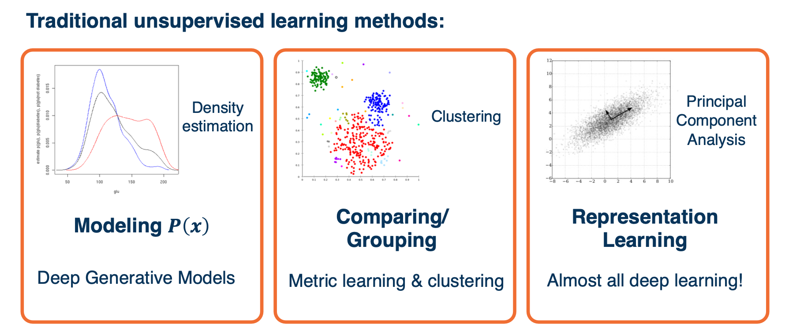
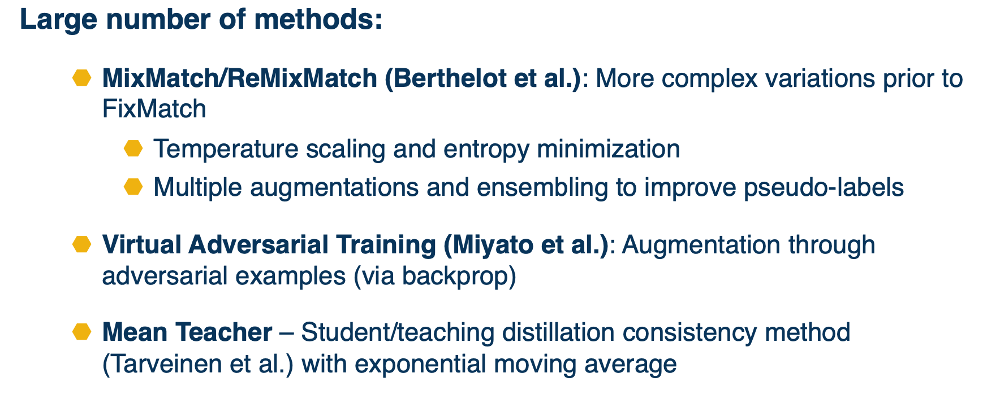
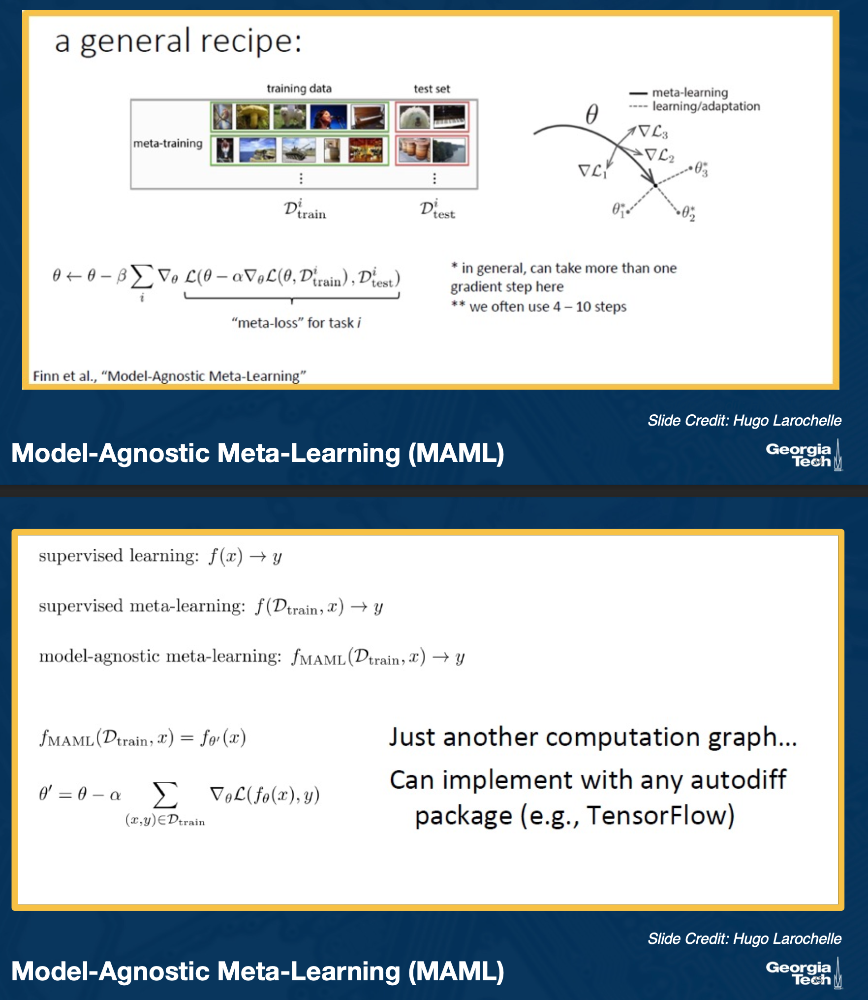
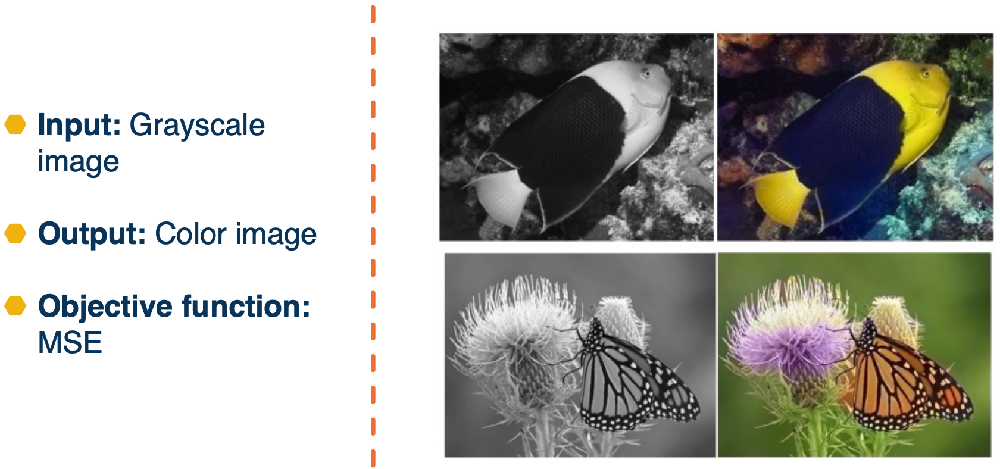

### Readings

None!

### Introduction

Comparing with the traditional way of machine learning, there is a deep learning equivalent for each of them.

{: width='400' height='400'}

For this lesson, we will mainly focus on the representation learning part. 

Dealing with unlabeled data? When we only have unlabeled data though, it is not clear what to do. There are several different considerations that we might have.

* Loss function (especially for unlabeled data)
* Optimization / Training procedure
* Architecture
* Transfer Learning

{: width='400' height='400'}

The above image shows the common ideas that keep occurring to solve these unlabeled data problem. 

### Semi-supervised learning

{: width='400' height='400'}

* It is often much cheaper to get large-scale unlabeled datasets
* Ideally would like to improve performance all the way to highly-labeled case

There are also old ideas:

* Simple idea: Learn model on labeled data, make predictions on unlabeled data, add as new training data, repeat.
* Combine idea with co-training: Predicting across multiple views

In a deep learning context, we can just train as normal omn the labeled data using losses such as cross entropy, and then we can perform the pseudo-labeling approach across multiple views across the image. 

#### Pseudo-Labeling

{: width='400' height='400'}

We can take an unlabeled example and perform augmentation on it. Specifically two types of augmentation, a weak type and a strong type. On the weak type, we just apply the model and get predictions and then threshold the examples by confidence. On the strong augmentations on the bottom, we will make it much more challenging for the model, and that is actually what we are going to use for backpropagation. We will use the weak version as the ground truth to train the bottom branch. This is an algorithm called **fixmatch**. This has proven to be extremely effective in the semi-supervised learning context.

{: width='400' height='400'}

The beauty of deep learning is we do not actually have to do this in stages, we can have this entire pipeline trained in an end to end manner. Specifically, we can have the mini batch consist of both labeled and unlabeled examples. For the labeled part of the mini batch, it goes through the traditional pipeline. We will extract features, make predictions and then use cross-entropy loss because we have ground truth labels annotated by humans. For the unlabeled examples, we will apply the two types of augmentations, do feature extraction and prediction and then use the predictions obtained on the weakly augmented labeled data, not in its own loss function but really as ground truth for the loss from the strongly augmented data. 

The equation above is what the loss function looks like for the unlabeled part. 

{: width='200' height='200'}

Early researchers took quite a while to get this right, the above image shows some of the important details.

There are also other newer methods as well:

{: width='400' height='400'}

There are also other methods besides pseudo labeling such as label propagation. They allow to essentially learn feature extractors and take those extractors and apply on unlabeled data. This is similar to a clustering approach that nearby elements should be labeled similarly. 

### Few shot learning

In few shot learning, you have a lot of labels in a base set of categories, but very small few labels in new categories. 

{: width='400' height='400'}

One way to do this is by fine tuning

* Train classifier on base classes 
* Optionally freeze feature extractors
  * In other words you are using the classifier to learn how to extract features 
* Learn classifier weights for new classes using few amounts of labeled data 
  * If you can find the right hyperparameter you can actually do quite well. 

#### Cosine classifier  

Other than using a fully connected layer, we can use a cosine classifier

{: width='400' height='400'}

Here we still have a set of weights, but we can interpret each weight vector as as set of prototypes. That is, what the classes might look like. We perform some similarity computation between these prototypes and the query, and the output of that is also fed to a softmax. 

Because we are only separating a small number of classes, this ends up working better than a normal linear layer.

Cons:
* The training we do on the base classes does not factor the task into account
* No notion that we will be performing a bunch of N- way tests

#### Meta Training

We take our large base dataset that has many categories, and simulate a set of smaller tasks which better mirror what will happen during testing, specifically the N-way K-short tasks, where N is the number of categories, K is the number of examples per category. 

{: width='400' height='400'}

In other words, we train using the meta-train set, and we perform a meta-test and feed that gradient back as part of back propagation.

* Can optionally pre-train features on held-out base classes
* Testing stage is now the same, but with new classes. 

So, what can we learn from these meta learning tasks? How do we learn a model condition on support set $M(\cdot \lvert S)$.

{: width='400' height='400'}

On the image you see what is called a matching network, which just learn a feature extractor, such that when we feed the support set into those feature extractors and extract the features and then similarly extract features for the query set, some hand coded metric actually allows you to find the most similar class for each query item. There are other types of networks such as the proto net or relation net. 

We cna view this as parameterizing an actual learning algorithm itself. That is, we are taking the meta-training task 1, we have a support set and we want to perform some learning on that support set, and perform predictions on some query set. 

Two approaches to defining a meta-learner:
* Take inspiration from a known learning algorithm
  * kNN/kernel machine: Matching networks (Vinyals et al. 2016)
  * Gaussian classifier: Prototypical Networks (Snell et al. 2017)
  * Gradient Descent: Meta-Learner LSTM (Ravi & Larochelle, 2017) , Model-Agnostic Meta-Learning MAML (Finn et al. 2017)
* Derive it from a black box neural network
  * MANN (Santoro et al. 2016)
  * SNAIL (Mishra et al. 2018)

Meta-learner Lstm:

{: width='400' height='400'}

Model-Agnostic Meta-Learning (MAML)

{: width='400' height='400'}

Comparison:

{: width='400' height='400'}

### Unsupervised and self supervised learning

This is when we have no labeled data, and we are only interested to learn feature representations for downstream tasks.

#### Autoencoder 

{: width='400' height='400'}

One such way is to use auto encoder, i.e to reproduce the input. and then, use the input for a classifier. This forces the neural network to learn important low dimensional features to capture important aspects of the input. 

{: width='400' height='400'}

#### Deep clustering

{: width='400' height='400'}

Use the outputs of the convnet and run classic clustering algorithms, and use them as labels for classifications.

Possible problems:
* Empty cluster
* Trivial parameterization 

#### Surrogate tasks

We can also "trick" or "force" the neural network to learn feature representation, such as :

* Reconstruction
* Rotate images,predict if image is rotated or not
* Colorization
* Relative image patch location (jigsaw)
* Video: Next frame prediction
* Instance Prediction

Colorization example:

{: width='400' height='400'}

Jigsaw example:

{: width='400' height='400'}

All this sounds good, but, how do we evaluate the Model?

* Train the model with a surrogate task
* Extract the ConvNet (or encoder part)
* Transfer to the actual task
  * Use it to initialize the model of another supervised learning task
  * Use it to extract features for learning a separate classifier (ex: NN or SVM)
  * Often classifier is limited to linear layer and features are frozen

In other words, use the features learn and feed it through a simple model where you have labeled data to measure the performance. 

There are other methods such as:

* Instance discrimination
* momentum encoder
* memory banks

In summary,

Large number of surrogate tasks and variations!
  * E.g. contrastive across image patches or context
  * Different types of loss functions and training regimes

Two have become dominant as extremely effective:
  * Contrastive losses (e.g. instance discrimination with positive and negative instances)
  * Pseudo-labeling (hard pseudo-label) and knowledge distillation (soft teacher/student)

Data augmentation is key
  * Methods tend to be sensitive to choice of augmentation

<!--  -->
