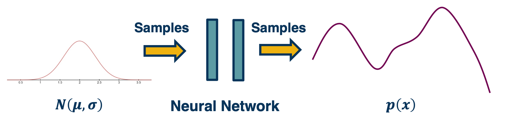
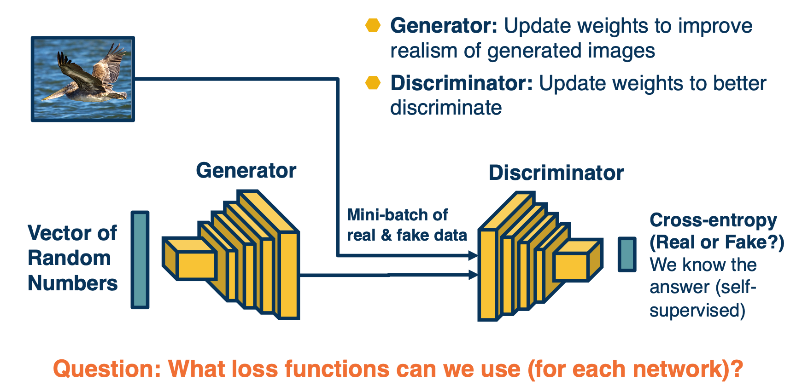

### Readings

* [Tutorial on Variational Autoencoders](https://arxiv.org/abs/1606.05908)
* [NIPS 2016 Tutorial: Generative Adversarial Networks](https://arxiv.org/abs/1701.00160)

### Generative Models Introduction

In this lecture we will focus on  density estimation, that is producing a model of the probability distribution over the input space. Or in some case, we may want to just have the ability to generate samples from this distribution. 

These has some history, such as Gaussian mixture models.

{: width='400' height='400'}

There are many various methods,

{: width='400' height='400'}

We will cover the most popular methods, highlighted in the yellow boxes.

### PixelRNN & PixelCNN

We can use chain rule to decompose the joint distribution

* Factorizes joint distribution into a product of conditional distributions
  * Similar to Bayesian Network (factorizing a joint distribution)
  * Similar to language models!

$$
p(x) = \prod_{i=1}^{n^2} p(x_i \lvert x_1,...,x_{i-1})
$$

* Requires some ordering of variables (edges in a probabilistic graphical model)
* We can estimate this conditional distribution as a neural network

Language modeling involves estimating a probability distribution over sequences of words, and we can do something similar with images:
 

{: width='400' height='400'}

Rather than the basic unit being words, the basic units are pixels. We can factorize the joint distribution as the product of conditionals, where we define some ordering over the pixels. For example, we could start with just the upper left pixel, and have some prior probability distribution over that pixel value. We can then move to the subsequent pixels from left to right and top to bottom, we can then model the probability of x as equal to the probability of $x_1$, the upper left pixel times the probability of $x_2$ given $x_1$ times the probability of $x_3$ given $x_1$ times the rest of the product.

{: width='400' height='400'}

We can also use techniques such as teacher forcing, MLE approach etc. Once we have trained the model, we can actually generate new images, just sample from $p(x_1)$ that is the prediction of the model for the first pixel and then use that as input to predict the next pixels and sample from that. There is a lot of downsides to this, such as doing this sequentially in the particular order that we came up with across the entire image. This can be really slow, unlike convolution layers it is not parallelized. Also, we are only considering a few context pixels, that is given one particular pixels, we are considering a few adjacent pixels that are connected to it. 

{: width='400' height='400'}

One idea is to represent the conditional distribution as a convolution, that is rather than conditional on just the adjacent pixels, we have a receptive field or a window and then we have a learnable convolution filter that output this distribution. The downside is that there's some future pixels that is part of the convolution window that we may not know. And so we have to use things like masking in order to mask out the future pixel and only consider the previous pixel in whatever ordering that we defined here. 

### Generative Adversarial Networks (GANs)

Generative adversarial networks or GANS did not learn an explicit density function $p(x)$, rather they fit under the implicit density category. What that means is rather than learn a parameterized density function We will instead learn a parameterized generation process that can give us samples from the joint distribution.

We won't have an explicit density though, to perform things like classification or things like that. But we'll still be able to use the unlabeled data to learn how to generate new samples that fits that distribution of the unlabeled data, or even learn features that might be good for downstream tasks.

Implicit generative models do not actually learn an explicit model for $p(x)$
Instead, learn to generate samples from $p(x)$
* Learn good feature representations
* Perform data augmentation
* Learn world models (a simulator!) for reinforcement learning

How?
* Learn to sample from a neural network output
* Adversarial training that uses one network’s predictions to train the other (dynamic loss function!)
* Lots of tricks to make the optimization more stable.

{: width='400' height='400'}

For example, we can generate random numbers then feed in with a neural network (Which can model any complex function) to generate the images.

{: width='400' height='400'}

* Goal: We would like to generate realistic images. How can we drive the network to learn how to do this?
* Idea: Have another network try to distinguish a real image from a generated (fake) image
  * Why? Signal can be used to determine how well it’s doing at generation

{: width='400' height='400'}

So we can just feed in at once, and train both the generator and discriminator at once. (basically try to get them to trick each other)

* Since we have two networks competing, this is a mini-max two player game 
  * Ties to game theory
  * Not clear what (even local) Nash equilibria are for this game

{: width='400' height='400'}

* Generator minimizes while discriminator maximizes.
  * Where $D(x)$ is the discriminator outputs probability $([0,1])$ of real image
  * $x$ is a real image and $G(z)$ is a generated image

* The generator wants to minimize this:
  * $1-D(G(z))$ is pushed down to 0 (so that $D(G(z))$ is pushed to 1)
  * This means that the generator is fooling the discriminator, i.e. succeeding at generating images that the discriminator can’t discriminate from real
* The discriminator wants to maximize this:
  * $D(x)$ is pushed to 1 because $x$ is a real image
  * $1-D(G(z))$ is also pushed to 1 (so that $D(G(z))$ is pushed down to 0)
  * In other words, discriminator wants to classify real images as real (1) and fake images as fake (0)

{: width='400' height='400'}

The generator part of the objective does not have good gradient properties
* High gradient when $D(G(z))$ is high (that is, discriminator is wrong)
* We want it to improve when samples are bad (discriminator is right)

The alternative objective, rather than having a minmax, we will have a maxmax:

$$
max_{\theta_g} \mathbf{E}_{z \sim p(z)} log (D_{\theta_d} (G_{\theta_g}(z)))
$$

{: width='400' height='400'}

GANs are very difficult to train due to the mini-max objective
* Advancement include:
  * More stable architectures
  * REgularization methods to improve optimization
  * Progressive growing/training scaling

Architecture guidelines for stable Deep convolutional GANs:
* Replace nay pooling layers with strided convolutions (discriminator) and fractional-strided convolutions (generator)
* Use batchnorm in both the generator and discriminator
* Remove fully connected hidden layers for deeper architectures
* Use ReLU activation in generator for all layers except for the output, which uses Tanh
* Use LeakyReLU activation in the discriminator for all layers. 

For Regularization - training GANs is difficult due to:
* minmax objective - For example, what if generator learns to memorize training data (no variety) or only generates part of the distribution?
* Mode collapse - capturing only some nodes of distribution

Several theoretically-motivated regularization methods
* Simple example: Add noise to real samples!

{: width='400' height='400'}

Generative Adversarial Networks (GANs) can produce amazing images!

* Several drawbacks
  * High-fidelity generation heavy to train
  * Training can be unstable
  * No explicit model for distribution 
* Larger number of extensions
  * GANs conditioned on labels or other information
  * Adversarial losses for other applications

### Variational Autoencoders (VAEs)

Recall in our auto encoders:

{: width='400' height='400'}

Where the input is fed through an encoder, in order to generate a low-dimensional embedding. And this low dimensional embedding or bottle neck is then used in the decoder in order to reconstruct the image. 

A loss function such as mean squared error can be used in order to minimize the difference between the input and the reconstruction. 

{: width='400' height='400'}

The actual bottle neck features are hidden or latent variables. What we like them to be is disentangled factors of variation that produce an image.  

We can actually write down an equation for the likelihood that involves these latent variables which we call $z$, specifically we can marginalize out the $Z$. So $P(x)$ can be just the integral of $P(X\lvert Z;\theta)$, since it is  the parametric model that we will use times $P(Z)$. 

If we can directly maximize this, then we are essentially maximizing the likelihood and optimizing the materials, but we cannot really do this because:
* We cannot maximize this likelihood due to the integral
* instead, we maximize a variational lower bound (VLB) that we can compute.

#### Variational Autoencoder: Decoder

{: width='200' height='200'}

* We can combine the probabilistic view, sampling, autoencoders, and approximate optimization
* Just as before, sample 𝑍 from simpler distribution
* We can also output parameters of a probability distribution!
  * Example: 𝜇, 𝜎 of Gaussian distribution
  * For multi-dimensional version output diagonal covariance

* How can we maximize $P(X) = \int P(X\lvert Z;\theta) P(Z) dZ$

 
#### Variational Autoencoder: encoder

{: width='200' height='200'}

* Given an image, estimate $z$
* Again, output parameters of a distribution.

Given x, it will output not a particular $z$ but it will output the parameters of a Gaussian distribution $\mu$ and $\sigma$. If we want to generate an actual $z$ we can just sample from the parameters. 

#### Putting it together

{: width='400' height='400'}

We can tie the encoder and decoder together into a probabilistic autoencoder
* Given data $X$, estimate $\mu_z, \sigma_z$ and sample from $N(\mu_z,\sigma_z)$
* Given $Z$, estimate $\mu_x,\sigma_x$ and sample from $N(\mu_x,\sigma_x)$

#### Maximizing likelihood

How can we optimize the parameters of the two networks?

Now equipped with our encoder and decoder networks, let’s work out the (log) data likelihood:

{: width='400' height='400'}

Recall that for KL-divergence (distance measure for distributions), always $\geq 0$,

$$
KL(q(z) \lvert\lvert p(z\lvert x)) = \mathbf{E}[log q(z)] - \mathbf{E} [log p(z\lvert z)]
$$

Then the above equations can be re-written as:

{: width='400' height='400'}

Note that the right hand side is actually intractable, so we are going to just ignore it. We know that KL divergence is always greater or equal to 0, and so if we just maximize the first two terms, we know that we will still be making progress.  

{: width='400' height='400'}

This is something called the variational lower bound or elbo, and it is actually a powerful technique that is used in many different places. The key idea is that if you are able to compute 

#### Putting it together (again)

{: width='400' height='400'}

First, we will have a mini batch of unlabeled data x, and we will run it through our encoder $Q(Z \lvert X; \phi)$, this will be used to output parameters of a Gaussian distribution. This will be used to output parameters of a Gaussian distribution. Again, this is an assumption we make $\mu_z$ and $\sigma_z$. And so we're going to make the approximate Posterior distribution close to the prior. That is we are going to take the KL divergence between $Q(Z\lvert X)$ , which is what we are computing here, and $P(z)$. Again this can be assumed to be a normal distribution, let's say with a $\mu=0, \sigma=1$, and this is a KL divergence between two Gaussian distributions which actually can be computed in closed form.

We can then sample from this and generate a bunch of Z. And then we feed it through our decoder, which feeds it through $P(X\lvert Z;\theta)$ and generates $\mu_x,\sigma_x$. And now we can essentially maximize the likelihood of the original data being reconstructed. That is we are going to maximize the $log p(X\lvert Z)$, which is what our decoder is computing here.

However there are some problems, that can be addressed by reparameterization.

{: width='400' height='400'}

In summary,

Variational Autoencoders (VAEs) provide a principled way to perform approximate maximum likelihood optimization
* Requires some assumptions (e.g. Gaussian distributions)

Samples are often not as competitive as GANs

Latent features (learned in an unsupervised way!) often good for downstream tasks:
* Example: World models for reinforcement learning (Ha et al., 2018)

<!--  -->

