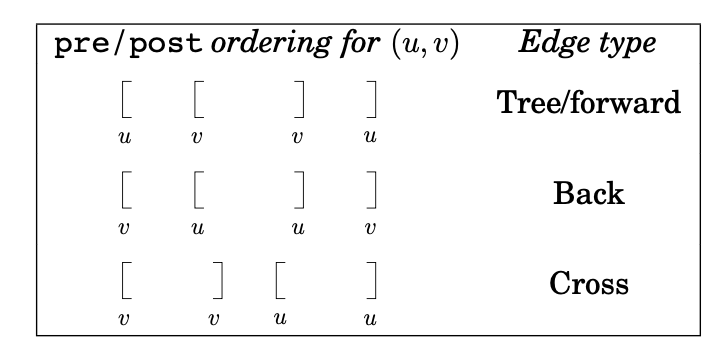

# Graphs 

## Graph Operations

| Operation                                                                                      | Time complexity  |
| :--------------------------------------------------------------------------------------------- | :--------------- |
| Traversing, reversing, copying, subgraph or working on full graph                              | $O(n+m)$         |
| Iterating, checking, reading, removing, <br> or otherwise working on all edges (or subset):    | $O(n+m)$         |
| Checking, reading, or removing one vertex:                                                     | $O(1)$           |
| Checking, reading, or removing one edge:                                                       | $O(n)$ or $O(m)$ |
| Iterating, checking, reading, removing, <br> or otherwise working on all vertices (or subset): | $O(n)$           |

Special call out:

* When the graph is connected, meaning $m \geq n-1$, $O(n+m)$ can be simplified to $O(m)$
* Similarly in a cases where the graph could be fully connected (such as Kruskal), $m \leq \frac{n(n-1)}{2} \leq n^2$. So in these cases $log m = log n^2 = 2 log n = log n$

## Graph terminologies

For the following `directed` graph:


digraph { 
    bgcolor="lightyellow"
    rankdir=LR;
    node [shape = circle];
    A -> B
    A -> C
    B -> C
}


* `A` is adjacent to `B,C`
* `B,C` are neighbors of `A`
* `A` is the parent of `B,C`

## Tree edges

* Tree edges are actually part of the DFS forest.
* Forward edges lead from a node to a nonchild descendant in the DFS tree.
* Back edges lead to an ancestor in the DFS tree.
* Cross edges lead to neither descendant nor ancestor; they therefore lead to a node that has already been completely explored (that is, already postvisited).

{: width='200'}

Here is another summary:

{: width='300'}

## Graphs Algorithms Overview

* DFS which outputs connected components, topological sort on a DAG. You also have access to the prev, pre and post arrays.
* BFS on unweighted graphs to find the shortest distance from a source vertex to all other vertices and a path can be recovered backtracking over the prev labels
* Dijkstra’s algorithm on weighted graphs to find the shortest distance from a source vertex to all other vertices and a path can be recovered backtracking over the prev labels
* Bellman-Ford and Floyd-Warshall to compute the shortest path when weights are allowed to be negative
* SCC which outputs the strongly connected components, and the metagraph of strongly connected components.
* Kruskal’s and Prim’s algorithms to find an MST
* Ford-Fulkerson and Edmonds-Karp to find the max flow on networks.
* 2-SAT which takes a CNF with all clauses of size $\leq$ 2 and returns a satisfying assignment if it exists

Heres a table (Sorry for the scroll bar!)


|                Algorithm                 |                                  Input                                   |                 Output Data Structures                  |                             Complexity                              |                           Graph Types                            |                                             Output Description                                              |                Algorithm                 |
| :--------------------------------------: | :----------------------------------------------------------------------: | :-----------------------------------------------------: | :-----------------------------------------------------------------: | :--------------------------------------------------------------: | :---------------------------------------------------------------------------------------------------------: | :--------------------------------------: |
|      Depth-First <br> Search (DFS)       |                      G = (V, E),<br> start vertex v                      |   ccnum, prev, <br>  pre, post,<br>  toposort arrays    |                              O(m + n)                               |               Unweighted, <br> undirected/directed               |   connected component nums,<br> pre/post nums,<br> previously visited nodes, <br>topological sorting list   |      Depth-First <br> Search (DFS)       |
|     Breadth-First <br> Search (BFS)      |                     G = (V, E), <br> start vertex v                      |             dist\[\], <br> prev\[\] arrays              |                              O(m + n)                               |               Unweighted, <br> undirected/directed               |                     distances from source to other nodes,<br> previously visited nodes                      |     Breadth-First <br> Search (BFS)      |
|           Dijkstra's Algorithm           |                     G = (V, E), <br> start vertex v                      |             dist\[\], <br> prev\[\] arrays              | O(m log n)<br> (connected) <br>  O((m + n) log n)<br> (unconnected) |    Weighted,<br> undirected/directed,<br> NO negative weights    |                      distances from source to other nodes,<br>previously visited nodes                      |           Dijkstra's Algorithm           |
|            Bellman-Ford (BF)             |                     G = (V, E), <br> start vertex s                      |  T\[n, v\] <br> (for -ve weight <br> cycle detection)   |                                O(mn)                                | Weighted,<br> undirected/directed,<br> CAN have negative weights |               Shortest path from s to all other vertices, <br>negative weight cycle detection               |            Bellman-Ford (BF)             |
|           Floyd-Warshall (FW)            |                                G = (V, E)                                | T\[n, v, v\] <br> (for -ve weight <br> cycle detection) |                               O(n^3)                                | Weighted,<br> undirected/directed,<br> CAN have negative weights |              Shortest paths between all pairs of vertices, <br>negative weight cycle detection              |           Floyd-Warshall (FW)            |
| Strongly Connected <br> Components (SCC) |                                G = (V, E)                                |  meta-DAG G'=(V', E'),<br>  ccnum\[\], toposort array   |                              O(m + n)                               |                             Directed                             | Meta-graph (DAG) of connected components, <br>topological sort order,<br> connected components from 2nd DFS | Strongly Connected <br> Components (SCC) |
|           Kruskal's Algorithm            | Connected, <br> undirected graph<br> G = (V, E) <br>  with edge weights  |                      MST  T=(V, E)                      |                             O(m log n)                              |             Connected, <br>undirected,<br> weighted              |            Minimum Spanning Tree (MST) T<br> in regular graph format<br> (weights don't matter)             |           Kruskal's Algorithm            |
|             Prim's Algorithm             | Connected, <br>  undirected graph<br> G = (V, E) <br>  with edge weights |                      MST  T=(V, E)                      | O(m log n) <br>(connected) <br> O((m + n) log n) <br>(unconnected)  |             Connected, <br>undirected,<br> weighted              |            Minimum Spanning Tree (MST) T <br>in regular graph format<br> (weights don't matter)             |             Prim's Algorithm             |
|      2-Satisfiability <br>  (2-SAT)      |                         Boolean formula in 2-CNF                         |   True if satisifiable, <br> list of assignment pairs   |                              O(m + n)                               |                             Directed                             |                        Boolean value (satisfiable or not), <br>satisfying assignment                        |      2-Satisfiability <br>  (2-SAT)      |
|         Ford-Fulkerson <br> (FF)         |          G = (V, E), <br> flow capacity c,<br> source s, sink t          |             Maxflow,<br>  Residual network              |                    O(C \* m) <br> (C = max flow)                    |                Directed with<br> edge capacities                 |                                 Maximum flow f\*,<br> residual network G^f                                  |         Ford-Fulkerson <br> (FF)         |
|          Edmonds-Karp <br> (EK)          |         G = (V, E), <br>  flow capacity c,<br> source s, sink t          |             Maxflow, <br> Residual network              |                               O(nm^2)                               |                Directed with <br>edge capacities                 |                                 Maximum flow f\*, <br>residual network G^f                                  |          Edmonds-Karp <br> (EK)          |


### DFS

DFS is an algorithm for traversing or searching tree or graph data structures. It starts at the root or an arbitrary node of a graph and explores as far as possible along each branch before backtracking.

`input`:
* $G=(V,E)$
 * Start vertex $v \in V$


`output`:
* Pre, Post, Prev, Visited
* ccnum (vertex being assigned to a connected component)
  * Becareful when using this on **directed graphs** because you cannot choose which vertex in the next iteration.
* In the case of a DAG (no cycles)
  * Topological order / sorting

`runtme`:

* $O(n+m)$

`Graphs Accepted`:
* Unweighted graphs
* Undirected/Directed graphs
* DAGS

`More information`: 

**Toplogical sorting**

Topologically sorting a DAG (directed acyclic graph that has no cycles): order vertices so that all edges go from lower $\rightarrow$ higher. Recall that since it has no cycles, it has no back edges. So the post order numbers must be $post(z) > post(w)$ for any edge $z \rightarrow w$. 

So, to do this, we can order vertices by decreasing post order number. Note that for this case, since we have $n$ vertices, we can create a array of size $2n$ and insert the nodes according to their post order number. So, our sorting of post order numbers runtime is $O(n)$.

### BFS

BFS is an algorithm for traversing or searching tree or graph data structures. It starts at the tree root (or some arbitrary node of a graph) and explores the neighbor nodes at the present depth before moving on to nodes at the next depth level.

`input`:

* $G=(V,E)$
  * Start vertex $v \in V$

`output`:

* dist[]
  * For all vertices u reachable from the starting vertex v, dist[u] is the shortest path distance from v to u. If no such path exists, infinity otherwise.
* prev[]
  * Vertex preceding u in the shortest path from v to reachable vertex u. 

`runtime`:
* $O(n+m)$

`Graphs Accepted`:
* Unweighted graphs
* Undirected/Directed graphs
* DAGS

`More information`:

if you only want connectivity from a specific vertex, use BFS instead.

### Dijkstra 

Dijkstra's algorithm is used to find the shortest distance from a source vertex to all other vertices. A path can be recovered by backtracking over all of the pre-labels.

`input`:
* $G=(V,E)$
* start vertex $s \in V$

`output`:

* dist[]
  * Shortest distance between vertex v and reachable vertex u or infinity otherwise if not reachable.
* prev[]
  * Vertex preceding u in the shortest path from v to reachable vertex u


`runtime`:
* $O((m+n)log n)$
* $O(mlogn)$ if graph is **connected** so $m \geq n-1$

`Graphs Accepted`:
* weighted graphs
* Undirected/Directed graphs
  * Edges weights cannot be negative!

`More information`:
* Uses a binary min heap
* Edges **must not be negative**

### Bellman-Ford 

Bellman-Ford is used to derive the shortest path from s to all vertices in V. It does not find a path between all pairs of vertices in V. To do this, we would have to run BF $\lvert V \lvert$ times. Negative weights are allowed.

`input`:
* $G=(V,E)$
* start vertex $s \in V$

`output`:
* The shortest path from vertex s to all other vertices.


`runtime`:
* $O(mn)$

Initially, you might think that there the complexity is $O(m^2n)$ because of the 3 nested for loops. But, in the 2nd and 3rd nested for loop, it is actually going through all edges (If you go through all nodes and all the edges within each node, it is actually going through all the edges). So the time complexity is actually $O(mn)$.

`Graphs Accepted`:
* weighted graphs
* Undirected/Directed graphs
  * Edges weights can be negative.

`More information`:

**How to find negative cycle?**

Now, how can you use bellman ford to detect if there is a negative cycle? Notice that the algorithm runs until n-1. Run it for one more time, and compare the difference. If the solution is different, then, some negative weights must exists.

In other words, check for:

$$
D(n,z) < D(n-1,z), \exists z \in V
$$


### Floyd-Warshall

FW is primarily used to find the shortest path from ALL nodes to all other nodes where negative weights are allowed.


`input`:
* $G=(V,E)$

`output`:
* The shortest path from all vertices to all other vertices
* `T[i,s,t]` is for the first $i$ vertices, the distance from $s \rightarrow t$.
* Final output is `T[n, s,t]`

`runtime`:
* $O(n^3)$


`Graphs Accepted`:
* weighted graphs
* Undirected/Directed graphs
  * Edges weights can be negative.

`More information`:

**Checking negative cycles**

To detect negative weight cycles, can check the diagonal of the matrix D. 
* If there is a negative cycle, then there should be a negative path length from a vertex to itself, i.e $T(n,y,y) < 0, \exists y \in V $. 
  * This is equivalent to checking whether there is any negative entries on the diagonal matrix $T(n,:,:)$.

### SCC 

The SCC algorithm is used to determine the strongly connected components as well as the meta-graph of connected components in a given directed graph.

`input`:
* $G=(V,E)$, G must be **directed**

`output`:
* meta-graph (DAG) that contains the connected components
* Reverse Topological sorting of the meta-graph
  * So the sink SCC will have order 1 while source SCC will have $n$ as its entries. (multiple sink and/or source SCC is possible)
* ccnum[] - strongly connected components produced from the 2nd DFS run


`runtime`:
* $O(m+n)$


`Graphs Accepted`:
* Directed graphs

`More information`:

SCC algorithm:

```
SCC(G):
  input: directed G=(V,E) in adjacency list
  1. Construct G^R
  2. Run DFS on G^R
  3. Order V by decreasing post order number
  4. Run undirected connected components alg on G based on the post order number
```

*Why do we compute the reverse graph G?*

What about the other way around? Does v with the highest post order always lie in a source SCC? Turns out, this is true! How can we make use of this? Simple, just reverse it! So the source SCC of the reverse graph is the sink SCC!

So, for directed $G=(V,E)$, look at $G^R = (V,E^R)$, so, the source SCC in $G$ = sink SCC in $G^R$. So, we just flip the graph, run DFS, take the highest post order which is the source SCC in $G^R$, that will be the sink in $G$.

### 2-SAT

The 2-SAT problem is to determine whether there exists an assignment to variables of a given Boolean formula in 2-CNF (conjunctive normal form) such that the formula evaluates to true. The algorithm for solving 2-SAT uses graph theory by constructing an implication graph and then checking for the existence of a path that satisfies the conditions.

`input`:

* A Boolean formula in 2-CNF is represented as a set of clauses where each clause is a disjunction of exactly two literals.

`output`:

* A Boolean value indicates whether the given 2-CNF formula is satisfiable. If it is satisfiable, the algorithm may also provide a satisfying assignment of variables.


`runtime`:

* O(m + n) - m is the number of clauses in the 2-CNF formula, n is the number of literal or variables.
  * This runtime stems from the linear runtime of SCC finding algorithms and the construction of the implication graph.

`More information`:

2-SAT algorithm

```
2SAT(F):
  1. Construct graph G for f
  2. Take a sink SCC S 
    - Set S = T ( and bar(S) = F)
    - remove S, bar(S)
    - repeat until empty
```

In general:

* If for some $i$, $x_i, \bar{x_i}$ are in the same SCC, then $f$ is not satisfiable. 
* If for some $i$, $x_i, \bar{x_i}$ are in different SCC, then $f$ is satisfiable. 

Graphs that can use 2-SAT:

* Directed graphs
  * The implication graph is inherently directed since each implication $(\neg x \rightarrow y)$ has a direction.


### Krusal (MST)

Kruskal's is one of the two algorithms used to find the Minimum Spanning Tree (MST) discussed in class.


`input`:
* Connected, Undirected Graph G = (V, E) with edge weights $w_e$

`output`:
* An MST defined by the edges E

`runtime`:

* $O(m log n)$

`Graphs Accepted`:
* Weighted graphs
* Connected graphs
* Undirected graphs

`More information`:

```
Kruskals(G):
  input: undirected G = (V,E) with weights w(e)
  1. Sort E by increasing weight
  2. Set X = {null}
  3. For e=(v,w) in E (in increasing order)
    if X U e does not have a cycle:
      X = X U e (U here denotes union)
  4. Return X
```

### Prim (MST)

Prim's algorithm is the second and final algorithm used to find the MSTs as discussed in class.


`input`:
* Connected, Undirected Graph G = (V, E) with edge weights $w_e$


`output`:
* An MST defined by the prev[] array


`runtime`:

* O(m log n) if graph is connected
  * This is because if the graph is connected then $m \geq n-1$
* O((m + n) log n) if graph is not connected

`Graphs Accepted`:
* Weighted graphs
* Connected graphs
* Undirected graphs

`More information`:

MST algorithm is akin to Dijkstra's algorithm, and use the cut property to prove correctness of Prim's algorithm.

The prim's algorithm selects the root vertex in the beginning and then traverses from vertex to vertex adjacently. On the other hand, Krushal's algorithm helps in generating the minimum spanning tree, initiating from the smallest weighted edge.

## MST properties 

* Property 1 Removing a cycle edge cannot disconnect a graph.
* Property 2 A tree on n nodes has n − 1 edges.
* Property 3 Any connected, undirected graph $G = (V, E)$ with $\lvert E \lvert = \lvert V \lvert − 1$ is a tree.
* Property 4 An undirected graph is a tree if and only if there is a unique path between any pair of nodes.

## Cut property 

The **cut property** asserts if (and only if) an edge is of minimum weight on any cut, then the edge is part of some MST.
* Used to include edges
* if all edge weights are unique, then the **cut property** assets if (and only if) an edge is the minimum across any cut, then the edge is part of every MST. 

**From the textbook**

Cut property Suppose edges X are part of a minimum spanning tree of G = (V, E). Pick any subset of nodes S for which X does not cross between S and V − S, and let e be the lightest edge across this partition. Then X ∪ {e} is part of some MST.

## Cycle property 

The **cycle property** states if $e$ is the unique heaviest edge in any cycle of G, then $e$ cannot be part of any MST
* Used to exclude edges 

## Maxflow

### Valid flow

A flow is valid if:
  * Capacity constraints: * $\forall e \in E, 0\leq f_e \leq c_e$
  * Conversation of flow: $\forall v \in V - \{S \cup T\}$, flow-in to $v$ = flow-out of $v$
  * $\sum_{\overrightarrow{wv} \in E} f_{wv} = \sum_{\overleftarrow{vz} \in E} f_{vz}$

### Residual Network

In general, the residual network $G^f = (V,E^f)$, for flow network $G=(V,E)$ with $c_e : e \in E$, and flow $f_e : e \in E$, 
* if $\overrightarrow{vw} \in E\ \&\ f_{vw} < c_{vw}$, then add $\overrightarrow{vw}$ to $G^f$ with capacity $c_{vw} - f_{vw}$ (remaining available)
* if $\overrightarrow{vw} \in E\ \&\ f_{vw} > 0$, then add $\overrightarrow{wv}$ to $G^f$ with capacity $f_{vw}$

In other words, if you flow is below capacity provided, add another edge in parallel with edge weight as the flow. If your flow is greater than 0 (and all capacity is used), add a backward edge with the capacity flow. Also, because we remove the parallel edges, we are allowed to add the forward edge and backward edge without inequalities. 

### Ford-Fulkerson 

A greedy algorithm to find max flow on networks. The algorithm continually sends flow along paths from the source (starting node) to the sink (end node), provided there is available capacity on all edges involved. This flow continues until no further augmenting paths with available capacity are detected.

`input`:

* $G = (V, E)$
* Flow capacity c
* Source node s
* Sink node t

`output`:

* Max flow
* Can trivially create the final residual network with G

`runtime`:
* $O(mC)$
  * $C$ is the maximum flow in the network

`Graphs Accepted`:
* Directed graphs with capacity edges

`More information`:
* NP complete, pseudo-polynomial
* requires integer values

### Edmonds-Karp

The Edmonds-Karp (EK) algorithm is utilized to determine the maximum flow in a network. This is analogous to the Ford-Fulkerson method but with one distinct difference: the order of search for finding an augmenting path must involve the shortest path with available capacity (BFS for G where all edge weights equal 1).

`input`:

* $G = (V, E)$
* Flow capacity c
* Source node s
* Sink node t

`output`:
* Can trivially create the final residual network with G
* Max flow of G

`runtime`:
* $O(nm^2)$

`Graphs Accepted`:
* Directed graphs with capacity edges

`More information`:
* Choice of Augmenting Path
  * Uses BFS, always finds the shortest path possible to $t$.
* EK algorithm always terminates compared to Ford-Fulkerson. 

### Max-flow Min Cut

Lemma: For a flow $f^\ast$ if there is no augmenting path in $G^{f\ast}$ then $f^\ast$ is a max-flow.

Theorem: Max-flow == Minimum st-cut (if and only if)

### Max-flow Generalization

For flow $f'$ in $G'$, size($f'$) $\leq D$, $f'$ is **saturating** if size($f'$) = $D$. This means that the flow $f'$ is of maximum size. 

Lemma: $G$ has a feasible flow if and only if $G'$ has a saturating flow

To calculate the maxflow with demands, first construct the graph $G'$ as follows:

* for $e \in E$, let $f'(e) =f(e) - d(e)$
* for $v \in V$:
  * $f'(\overrightarrow{s'v}) = d^{in}(v)$
  * $f'(\overrightarrow{vt'}) = d^{out}(v)$
  * $f'(\overrightarrow{ts}) = size(f)$

Find a feasible flow $f$ for $G$, if one exists by checking whether the size of the max-flow equals $D$ and if it is a saturating flow. If it is, then there must be a feasible flow. Then we transform $f' \rightarrow f$.

Then, we can augment in residual graph of $G^f$ as follows:

$$
\begin{aligned}
c_f({\overrightarrow{vw}})&= \begin{cases}
c({\overrightarrow{vw}}) - f({\overrightarrow{vw}}) & \text{if } \overrightarrow{vw} \in E \\
f({\overrightarrow{wv}}) - d({\overrightarrow{wv}}), & \text{if } \overrightarrow{wv} \in E \\
0, & \text{otherwise } 
\end{cases}
\end{aligned}
$$

## RA

### Modular arithmetic

if $x \equiv y \bmod N $ and $a \equiv b \bmod N$ then $x+a \equiv y+b \bmod N$ and $xa \equiv yb \bmod N$

### Modular Exponentiation

$$
\begin{aligned}
x \bmod N &= a_1 \\
x^2 \equiv (a_1)^2 \bmod N &= a_2 \\
x^4 \equiv (a_2)^2 \bmod N &= a_4 \\
x^8 \equiv (a_4)^2 \bmod N &= a_8 \\
\vdots \\
\end{aligned}
$$

### Multiplicative Inverse

Theorem: $x^{-1} \bmod N$ exists if and only if $gcd(x,N)=1$, gcd stands for greatest common divisor. This also means x and N are relatively prime.


### Euclid GCD 


For integers x,y where $ x \geq y > 0$:

$$
gcd(x,y) = gcd(x \bmod y ,y)
$$

Lemma: if $x \geq y$ then $x \bmod y < \frac{x}{2}$.

```
Euclid(x,y):
  input: integers (x,y) where x >= y >= 0
  output: gcd(x,y)

  if y = 0:
    return(x)
  else:
    return (Euclid(y, x mod y))
```

Runtime analysis:

* `x mod y` takes $O(N^2)$ time to compute where $N$ is the number of bits, and this is for a single round.
* Total of $2n$ rounds
* Total of $O(n^3)$ runtime. 


### Euclid Extended 

This is to compute the inverse of $x \bmod y$. Suppose $d = gcd(x,y)$ and we can express $d=x\alpha+y\beta$ and we have the following:

$$
d = gcd(x,y) = d=x\alpha+y\beta
$$

if $gcd(x,N) =1$ then $x^{-1} \bmod N$ exists and we have the following:

$$
\begin{aligned}
d = 1 &= x\alpha + N\beta \\
1 &\equiv x\alpha + \underbrace{N\beta}_{0} \bmod N \\
x^{-1} &\equiv \alpha \bmod N
\end{aligned}
$$

Similarly, 

$$
\beta = N^{-1} \bmod X
$$

```
Ext-Euclid(x,y)
  input: integers, x,y where x >= y >= 0
  output: integers d, α,β where d = gcd(x,y) and d = xα+yβ

  # remember gcd(x,0) = x, so we just set α = 1,β = 0
  if y = 0:
    return (x,1,0)
  else:
    d,α',β' = Ext-Euclid(y, x mod y)
    return (d, β', α' - floor(x/y)β')
```

Runtime analysis:

* Similarly, $O(n^2)$ to compute $x \bmod y$ and calculating $\lfloor \frac{x}{y} \rfloor$
* $n$ rounds
* Total of $O(n^3)$


## RSA 

* Choose primes $p,g$ let $N=pg$
* Find $e$ where $gcd(e,(p-1)(q-1))=1$
  * This means we want $e$ that is relatively prime to $(p-1)(q-1)$
  * This means $e$ has an inverse by Fermat's little theorem.
* Let $d \equiv e^{-1} \bmod (p-1)(q-1)$
  * Use the extended Euclid algorithm
  * Keep this private key $d$ secret
* Publish public key $(N,e)$
* Given a message $m$, Encrypt $m$ by $y \equiv m^e \bmod N$
  * Send over message $y$
* Decrypt $y$ by $y^d \bmod N = m$

### Fermat's little theorem

If p is prime then for every $1 \leq z \leq p-1$, so $gcd(z,p) = 1$ then:

$$
z^{p-1} \equiv 1 \bmod p
$$

### Euler's theorem

Euler theorem is the generalization of Fermat's little theorem    

For any $N,z$ where $gcd(z,N) =1$ then:

$$
z^{\phi(N)} \equiv 1 \bmod N
$$

### Euler's totient function 

So, for primes $p,g$ where $N=pq$, this implies that $\phi(N) = (p-1)(q-1)$

* Consider $N=pq$ as $1p, 2p, ... , qp$ so there are $q$ multiples of $p$.
* Likewise, $q, 2q, ..., pq$ there are $p$ multiples of $q$.
* So, we need to exclude all these numbers!
* Therefore we get $pq - p - q + 1$ which equals to $(p-1)(q-1)$
  * The $+1$ comes from $pq = pq$ which is a duplicate so we need to add 1 back.

With this, we can re-write Euler theorem as the following:

$$
z^{(p-1)(q-1)} \equiv 1 \bmod pq
$$

### Fermat Witnesses

Fermat witness for $r : z \text{ if } 1 \leq z \leq r-1 \text{ & } z^{r-1} \cancel{\equiv} 1 \bmod r$, then the number $r$ is composite. 

$z$ is a nontrivial Fermat witness for $f$ if $z^{r-1} \cancel{\equiv} 1 \bmod r$ and $gcd(z,r)=1$.

Lemma: if $r$ has $\geq 1$ non trivial Fermat witness, then $\geq \frac{1}{2}$ that $z \in \{1,2,..,r-1\}$ are Fermat witness.

* Trivial Fermat witness : $z$ where $gcd(z,r) > 1$
* Non-trivial Fermat witness is where $gcd(z,r) = 1$
  * Some composite numbers have no non-trivial fermat witnesses, these are called pseudo primes, but those are relatively rare. 
  * For all other composite numbers, they have at least one non-trivial Fermat witness, and if they have at least one, they in fact have many Fermat witnesses.
  * Therefore, it will be easy to find a Fermat witness 
* Trivial Fermat witnesses always exists! 
  * Every composite number has at least two trivial Fermat witnesses!
  * They are dense and therefore easy to find 

### Primality test

```
For n-bit r

choose z randomly from {1,2,...,r-1}
Compute pow(z, r-1) === 1 mod r
if pow(z, r-1) === 1 mod r:
  then output r is prime 
else
  output r is composite (z is a witness to the fact that r is composite)
```

Instead of choosing a particular $z$, we choose $k-z$ and run the algorithm k times.

Then Pr(algorithm outputs $r$ is prime) $\leq (\frac{1}{2})^k$. You can think of it as a coin toss each with probability $\frac{1}{2}$. So the probability that the coin toss is all tails with k flips is $(\frac{1}{2})^k$.

So you can take $k=100$, so $(\frac{1}{2})^{100}$ is a very small number and you will be willing to take the risk on that. 
* Again we assume that the numbers are not Carmichael
* to deal with these Carmichael, it is not that much more complicated of an algorithm

### Carmichael

So we know it is composite if there is a non trivial square root of $1 \bmod x$. Trivial square root of 1 means 1 or -1 since $1^2 , -1^2 = 1$.

For example, $x = 1729$ and choose $z = 5$, and note that $x-1 = 1728 = 2^6 \times 27$

$$
\begin{aligned}
5^{27} &\equiv 1217 \bmod 1729 \\
5^{2\times27} &\equiv 1217 \equiv 1065 \bmod 1729 \\
5^{2^2\times27} &\equiv 1065^2 \equiv 1 \bmod 1729 \\
5^{2^2\times27} &\equiv 1^2 \equiv 1 \bmod 1729 \\
&\vdots \\
5^{1728} &\equiv 1 \bmod 1729
\end{aligned}
$$

So, when Fermat tests fail, we see if there is a non trivial square root of 1 exists.

It turns out that for a composite number $X$, even if its Carmichael, for at least three quarters of the choices of $Z$, this algorithm works. 

### Breaking RSA

**Attack number one**
When $gcd(m,N) >1$, and $gcd(m,N) = p,  N=pq$

* $(m^e)^d \equiv \bmod N $ by the chinese remainder theorem
* $y \equiv m^e \bmod N$
* If $P$ divides $m, N$ since $gcd(m,N) = p$
  * Then it is also going to divide $y$
  * This means that $gcd(y,N) = p$
  * The attacker can then reverse engineer $q$

**Attack number two**
when $gcd(m,N) > 1$ and $m$ not too large, $m < N$ but $m < 2^n, N \geq 2^n$

But in this case, we $m$ cannot be too small, for example if $e=3$, then $m^3 < N$, we simply have $y = m^3$ since $\bmod N$ does nothing! To reverse the message we can simply just take the cube root.
* To avoid this we can choose a random number $r$, $m\oplus r$ or $m+r$, and we can send the padded message, as well as a second message that is r itself. 
  * As long as r is not too small, you will be fine.
  * Imagine you're the receiving user, you receive $m+r$ and $r$, you can then reverse engineer it to get $m$

**Attack number three**

Send the same $m$ for $e$ times, then we have $(N_1,3), (N_2,3), (N_3,3)$.

Then we have $Y_i, \equiv m^3 \bmod N_i$ and they can figure out $m$ by using the chinese remainder theorem. (DPV 1.44)


<!--  -->