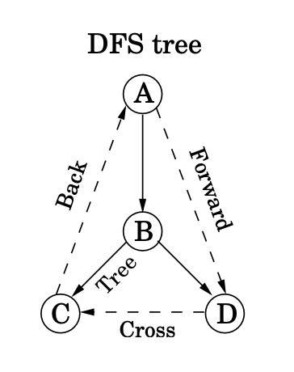

# Graphs 

## Graph Operations

| Operation                                                                                      | Time complexity  |
| :--------------------------------------------------------------------------------------------- | :--------------- |
| Traversing, reversing, copying, subgraph or working on full graph                              | $O(n+m)$         |
| Iterating, checking, reading, removing,   or otherwise working on all edges (or subset):         | $O(n+m)$         |
| Checking, reading, or removing one vertex:                                                     | $O(1)$           |
| Checking, reading, or removing one edge:                                                       | $O(n)$ or $O(m)$ |
| Iterating, checking, reading, removing,   or otherwise working on all vertices (or subset): | $O(n)$           |

Special call out:

* When the graph is connected, meaning $m \geq n-1$, $O(n+m)$ can be simplified to $O(m)$
* Similarly in a cases where the graph could be fully connected (such as Kruskal), $m \leq \frac{n(n-1)}{2} \leq n^2$. So in these cases $log m = log n^2 = 2 log n = log n$

## Graph terminologies

For the following `directed` graph:


digraph { 
    bgcolor="lightyellow"
    rankdir=LR;
    node [shape = circle];
    A -> B
    A -> C
    B -> C
}


* `A` is adjacent to `B,C`
* `B,C` are neighbors of `A`
* `A` is the parent of `B,C`

## Tree edges

* Tree edges are actually part of the DFS forest.
* Forward edges lead from a node to a nonchild descendant in the DFS tree.
* Back edges lead to an ancestor in the DFS tree.
* Cross edges lead to neither descendant nor ancestor; they therefore lead to a node that has already been completely explored (that is, already postvisited).

{: width='200'}

Here is another summary:

{: width='300'}

## Graphs Algorithms Overview

* DFS which outputs connected components, topological sort on a DAG. You also have access to the prev, pre and post arrays.
* BFS on unweighted graphs to find the shortest distance from a source vertex to all other vertices and a path can be recovered backtracking over the prev labels
* Dijkstra’s algorithm on weighted graphs to find the shortest distance from a source vertex to all other vertices and a path can be recovered backtracking over the prev labels
* Bellman-Ford and Floyd-Warshall to compute the shortest path when weights are allowed to be negative
* SCC which outputs the strongly connected components, and the metagraph of strongly connected components.
* Kruskal’s and Prim’s algorithms to find an MST
* Ford-Fulkerson and Edmonds-Karp to find the max flow on networks.
* 2-SAT which takes a CNF with all clauses of size $\leq$ 2 and returns a satisfying assignment if it exists

## DFS

## BFS

## Dijkstra 

## Bellman-Ford 

## Floyd-Warshall

## SCC 

## 2-SAT

## MST

### Krusal

### Prim

### Cut property 

# Maxflow

## Ford-Fulkerson 

## Max-flow Min Cut

## Edmonds-Karp

## Max-flow Generalization

# RA

## Modular arithmetic

## Modular Exponentiation

## Multiplicative Inverse

### Existence 

## Euclid 

### Euclid GCD 

### Euclid Extended 

# RSA 

## Fermat's little theorem

## Euler's theorem

### Euler's totient function 

## Fermat tests 

## Fermat Witnesses

## Primality test

## Carmichael

## Breaking RSA

<!--  -->