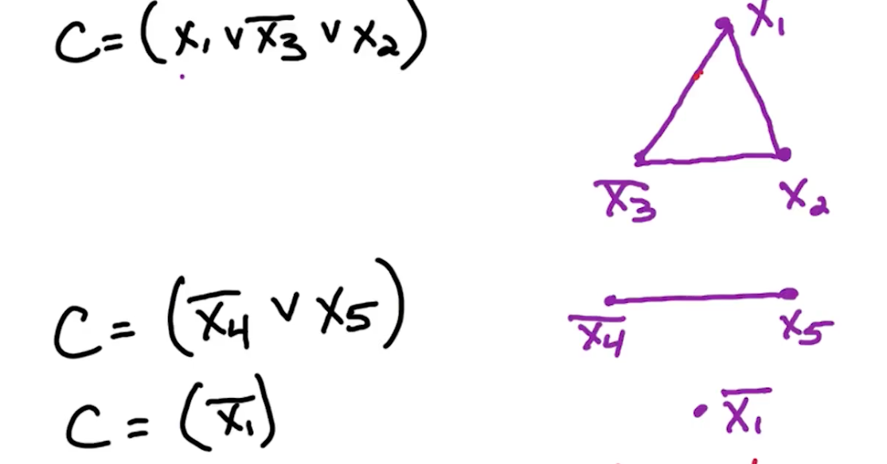
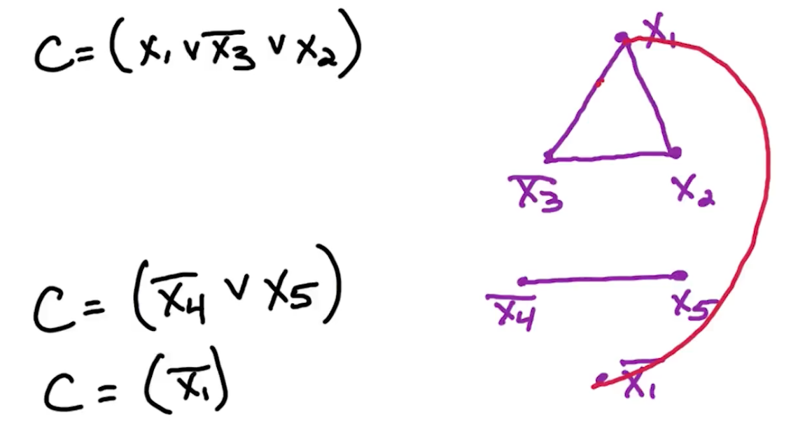

# NP

* P stands for polynomial time. 
* NP stands for nondeterministic polynomial time 
  * problems that can be solved in poly-time on a nondeterministic machine
  * By nondeterministic time, it means it is allowed to guess at each step 

NP = class of all search problems. (In some courses it talks about decision problems instead which has a need for a witness for particular instances, but thats out of scope)

P = class of search problems that are solvable in polynomial time. 

What is a search problem?
* Form: Given instance I (input),
  * Find a solution $S$ for $I$ if one exists
  * Output NO if I has no solutions
* Requirement: To be a search problem,
  * If given an instance I and solution S, then we can verify S is a solution to I in polynomial time (Polynomial in $\lvert I \lvert$)

## SAT 

SAT is the first problem that was proven to be NP-complete. This is the Cook–Levin theorem. This means that all problems in the complexity class NP, which includes a wide range of natural decision and optimization problems, are at most as difficult to solve as SAT.

If $P\neq NP$ then SAT $\notin$ $P$, then we know that there are some problems in NP which cannot be solved in polynomial time, and therefore we cannot solve SAT in poly-time. 
* Because if we can solve SAT in poly-time then we can solve all problems in NP in polynomial time. 
* Or if you believe that nobody knows how to prove that $P=NP$ then nobody knows a polynomial time algorithm for SAT. 

## NP-Complete 

A search problem is NP-complete if all other search problems reduce to it.

To prove something is NP complete:

{: width='400'}

* Prove that it in NP
  * Any polynomial time is sufficient
* Prove that it is NP hard -Reduction from a NP-complete problem to the unknown problem
  * Input transformation $f$ in polynomial time
  * Output transformation $h$
  * Correctness. Show that if a solution for $B$ exists $iff$ a solution for $A$ exists.

## SAT -> 3SAT 

`Input`:

Boolean formula in CNF with n variables and m clauses 

`Output`:

Satisfying assignment if one exists, NO. 

`3SAT is in NP`:

To verify this assignment is a Satisfying assignment:
* For each clause $C\in f$ in $O(1)$ time can check that at least one literal in $C$ is satisfied. 
  * Order $O(1)$ time per clause, there are $M$ clauses so takes total $O(m)$ time.
  * It is $O(1)$ because fixed number of literals per clause.

`Input Transformation`:

Given $C=(a_1 \lor a_2 \lor ... \lor a_k)$ where $a_1, ..., a_k$ are literals:
* Create $k-3$ new variables, $Y_1, Y_2, ..., Y_{k-3}$
* Note that these variables are distinct for each clause, so if you have 2 clauses you will have two sets of new variables
  * So if you have $n$ clauses with $m$ literals then you have have order $nm$ new variables

$$
C' = (a_1 \lor a_2 \lor y_1) \land (\bar{y_1} \lor a_3 \lor y_2) \land  (\bar{y_2} \lor a_4 \lor y_3) \land \\
...  \land (\bar{y_{k-4}} \lor a_{k-2} \lor y_{k-3}) \land (\bar{y_{k-3}} \lor a_{k-1} \lor a_k)
$$

`Output Transformation`:

NO if 3SAT returns NO. 

If satisfying assignment exists, we can ignore the assignment for the new variables and keep the assignment for the original variables the same, then we get a satisfying assignment for $f$.

`Correctness`:

Now we need to show that $C$ is satisfiable $\iff$ $C'$ is satisfiable.

Forward implication: Take assignment to $a_1,...,a_k$ satisfying $C$.

Let $a_i$ be minimum $i$ where $a_i$ is satisfied. 
* Since $a_i = T \implies (i-1)^{st}$ clause of $C'$ is satisfied.
  * e.g if $a_i = a_4$ then $(\bar{y_2} \lor a_4 \lor y_3)$ is satisfied
    * It has $i=4$ which is the $i-1=3$ term
* Set $y_1=y_2=...=y_{i-2} = T$ to satisfy $1^{st} (i-2)$
* Set $y_{i-1} = y_i = ... = y_{k-2} = F$ to satisfy rest 

Reverse implication, take assignment to $a_1, ..., a_k, y_1, ..., y_{k-3}$ satisfying $C'$ 

* Suppose at least one $a_i = T$, then we can just use the original $a_i$
* Suppose otherwise $a_1 = a_2 = ... = a_k = F$, we will show it is not possible to satisfy $C$.
  * From clause $1 \implies y_1 = T$ 
  * From clause $2 \implies y_2 = T$ 
  * $...$
  * From clause $k-3 \implies y_{k-3} = T$ 
* $(\bar{y_{k-3}} \lor a_{k-1} \lor a_k)$ but this last literal is not set to true, it is all False. So the entire C is evaluated to be False.

## Independent Set 

For undirected $G=(V,E)$, subset $S \subset V$ is an independent set if no edges are contained in $S$. i.e for all $x,y \in S, (x,y) \notin E$

{: width='200'}

### Max Independent Set

Theorem: The Max-Independent Set problem is NP-hard

NP-hard means it is at least as hard as everything in the class NP. So there is a reduction from everything in the class NP to this problem max independent set. So if we can solve max independent set in polynomial time, then we can solve everything in NP in polynomial to be NP-complete. 

## 3SAT -> IS

`Input`: undirected $G=(V,E)$ and goal g

`Output`: independent set $S$ with size $\lvert S \lvert \geq g$ and NO otherwise.

`LS is in NP`:

* Given input $G,g$ and solution $S$, verify that $S$ is a solution in polynomial time.
* in $O(n^2)$ time can check all pairs $x,y \in S$ and verify $(x,y) \notin E$
* in $O(n)$ time can check $\lvert S \lvert \geq g$

`Input Transformation`:

Consider 3SAT input $f$ with variables $x_1,...,x_n$ and clauses $C_1,...,c_m$ with each $\lvert C_i \lvert \leq 3$. Define a graph G and set $g=m$.

Idea: For each clause $C_i$, create $\lvert C_i \lvert$ vertices.
* Since there are $m$ clauses, there is at most $3m$ vertices in graph $G$
* Going to add edges to encode this clause.
* Add additional edges between vertices in different clauses in order to ensure consistent assignment

Clause $C = (x_1 \lor \bar{x_3} \lor x_2)$

**Clause Edge:**

{: width='400'}

If another vertices shares $x_2$, we will have another vertex corresponding to $x_2$, multiple vertices corresponding to the same literal.

**Variable edge**

{: width='400'}

For each $x_i$, add edges between $x_i$ and all $\bar{x_i}$

Example:

{: width='400'}

Now an example independent set of size four in this graph:

{: width='400'}

Note that $z$ has no constraints.

Now lets prove that in general, that an independent set of size $m$ in this graph corresponds to a satisfying assignment of this formula, and a satisfying assignment of this formula corresponds to an independent set of size $m$.

`Output Transformation`:

If NO, return NO. 

If IS returns a solution, one vertex per clause will correspond to this satisfied literal in that clause. 

`Correctness`:

$f$ has a satisfying assignment $\iff$ $G$ has an independent set of size $\geq g$

Forward direction: Consider a satisfying assignment for $f$ and we will construct an independent set in this graph of size at least $g$. 

For each clause $C$ at least one of the literals and that clause is satisfied, take 1 of the satisfied literals, add corresponding vertex to $S$. 
* $S$ contains exactly one vertex per clause.
* So $\lvert S \lvert =m = g$, and our goal $g$ is met. 

Since $S$ contains exactly one vertex per clause, and it never contains both $x_i, \bar{x_i}$. It cannot contain both since it corresponds to an assignment $f$, which sets either $x_i$ to be true or false. Because there is at most one vertex per clause, we know that there is no clause edges contained in this set $S$ and because we never include a vertex $x_i, \bar{x_i}$ in the assignment, we know that there are no variable edges contained in this set $S$.

Therefore, S is an independent set of size equal to $g$, our goal size. So we have constructed an independent set of size equal to $g$ in this graph. 

Backward direction: Take independent set $S$ of size $\geq g$ has exactly one vertex in each of the clauses, actually in each of the triangles corresponding to the clauses. 
* Now this vertex corresponds to a literal in the original formula so we set that corresponding literal to true. 
* Since every clause has a satisfied literal then we know every clause is satisfied and therefore the formula is satisfied. But does this clause belongs to an assignment?

Notice we have no contradicting literal in this set since we added edges between $x_i, \bar{x_i}$ so we can never include $x_i$ and a $\bar{x_i}$ in an independent set. Therefore we never attempt to set $x_i$ to be true and false at the same time. So this assignment we constructed corresponds to a valid assignment. 

So we taken an independent set of size at least $g$ and we construct a satisfying assignment. 

This proves that a reduction from 3SAT to independent set is correct and it shows how to take an independent set and construct a satisfying assignment. And if there is no independent set of size at least $g$ then there is no satisfying assignment. 

This completes the proof that the independent set problem is NP-complete. 

## IS -> Clique 

`Input`: 

`Output`:

`Clique is in NP`:

`Input Transformation`:

`Output Transformation`:

`Correctness`:

## IS -> Vertex Cover

`Input`: 

`Output`:

`VC is in NP`:

`Input Transformation`:

`Output Transformation`:

`Correctness`:

## 3SAT -> Subset Sum

`Input`: 

`Output`:

`Subset Sum is in NP`:

`Input Transformation`:

`Output Transformation`:

`Correctness`:

# Linear Programming

<!--  -->
