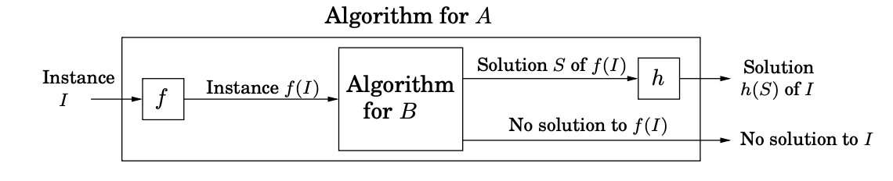
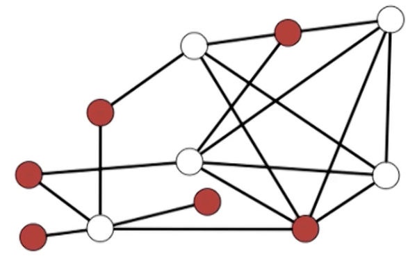
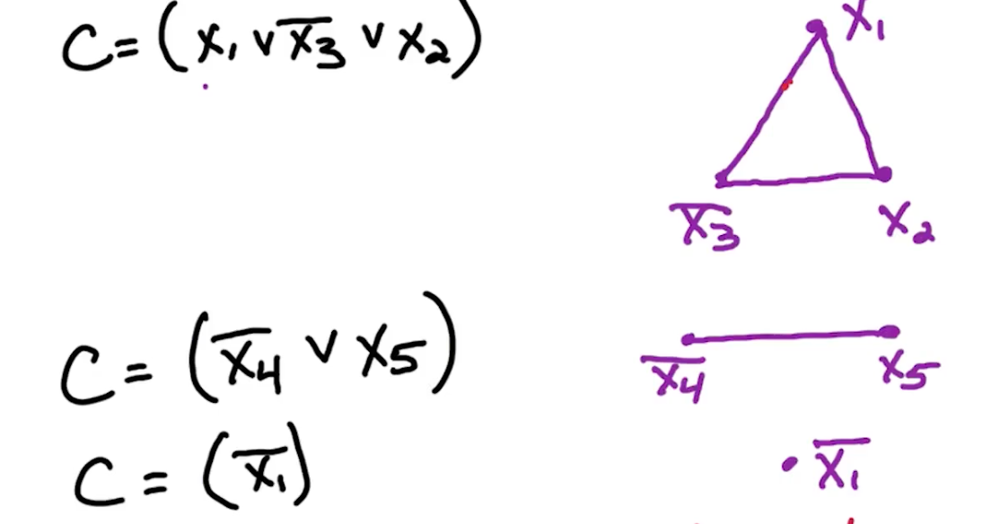
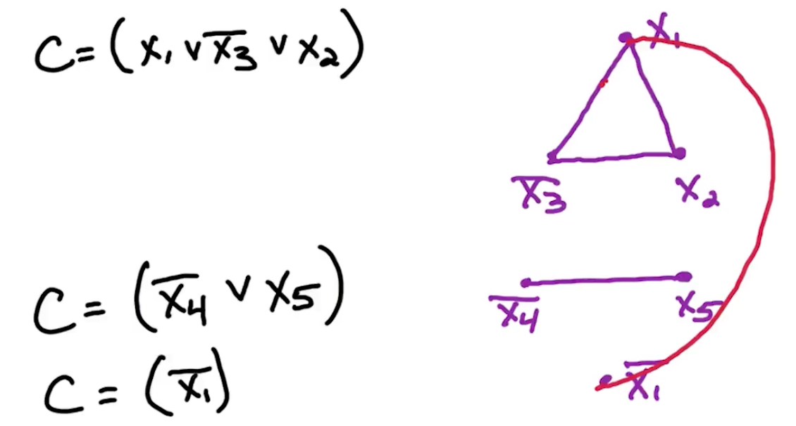
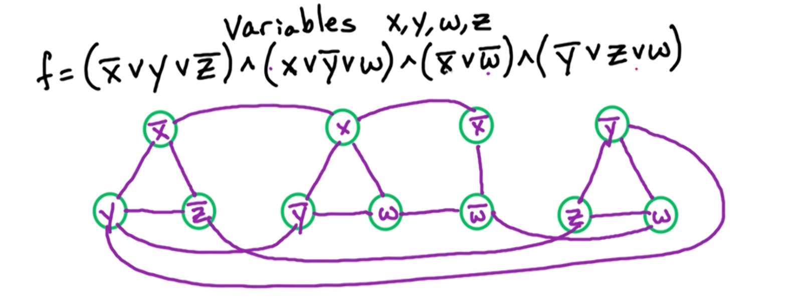
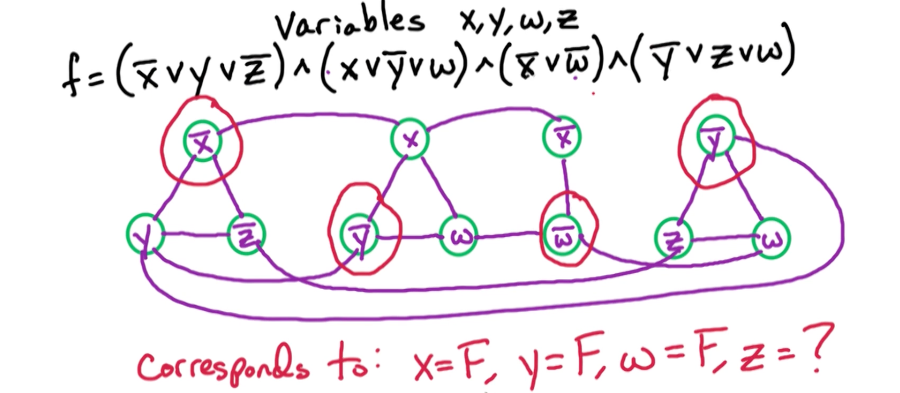
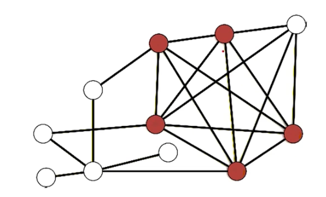
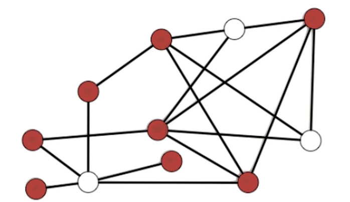
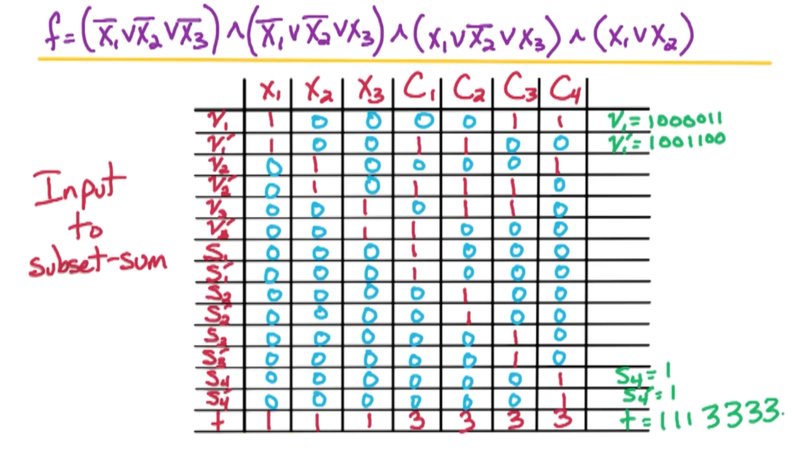

## NP

### P=NP

* P stands for polynomial time. 
* NP stands for nondeterministic polynomial time 
  * problems that can be solved in poly-time on a nondeterministic machine
  * By nondeterministic time, it means it is allowed to guess at each step 

NP = class of all search problems. (In some courses it talks about decision problems instead which has a need for a witness for particular instances, but thats out of scope)

P = class of search problems that are solvable in polynomial time. 

What is a search problem?
* Form: Given instance I (input),
  * Find a solution $S$ for $I$ if one exists
  * Output NO if I has no solutions
* Requirement: To be a search problem,
  * If given an instance I and solution S, then we can verify S is a solution to I in polynomial time (Polynomial in $\lvert I \lvert$)

### SAT 

SAT is the first problem that was proven to be NP-complete. This is the Cook–Levin theorem. This means that all problems in the complexity class NP, which includes a wide range of natural decision and optimization problems, are at most as difficult to solve as SAT.

If $P\neq NP$ then SAT $\notin$ $P$, then we know that there are some problems in NP which cannot be solved in polynomial time, and therefore we cannot solve SAT in poly-time. 
* Because if we can solve SAT in poly-time then we can solve all problems in NP in polynomial time. 
* Or if you believe that nobody knows how to prove that $P=NP$ then nobody knows a polynomial time algorithm for SAT. 

### NP-Complete 

A search problem is NP-complete if all other search problems reduce to it.

To prove something is NP complete:

{: width='400'}

* Prove that it in NP
  * Given a solution, you can check that it is correct in polynomial time.
  * Any polynomial time is sufficient.
* Prove that it is NP hard -Reduction from a NP-complete problem to the unknown problem
  * Input transformation $f$ in polynomial time
  * Output transformation $h$
  * Correctness. Show that if a solution for $B$ exists $iff$ a solution for $A$ exists.

### 3SAT 

`Input`:

Boolean formula in CNF with n variables and m clauses 

`Output`:

Satisfying assignment if one exists, NO. 

#### SAT -> 3SAT 

`3SAT is in NP`:

To verify this assignment is a Satisfying assignment:
* For each clause $C\in f$ in $O(1)$ time can check that at least one literal in $C$ is satisfied. 
  * Order $O(1)$ time per clause, there are $M$ clauses so takes total $O(m)$ time.
  * It is $O(1)$ because fixed number of literals per clause.

`Input Transformation`:

Given $C=(a_1 \lor a_2 \lor ... \lor a_k)$ where $a_1, ..., a_k$ are literals:
* Create $k-3$ new variables, $Y_1, Y_2, ..., Y_{k-3}$
* Note that these variables are distinct for each clause, so if you have 2 clauses you will have two sets of new variables
  * So if you have $n$ clauses with $m$ literals then you have have order $nm$ new variables

$$
C' = (a_1 \lor a_2 \lor y_1) \land (\bar{y_1} \lor a_3 \lor y_2) \land  (\bar{y_2} \lor a_4 \lor y_3) \land \\
...  \land (\bar{y_{k-4}} \lor a_{k-2} \lor y_{k-3}) \land (\bar{y_{k-3}} \lor a_{k-1} \lor a_k)
$$

`Output Transformation`:

NO if 3SAT returns NO. 

If satisfying assignment exists, we can ignore the assignment for the new variables and keep the assignment for the original variables the same, then we get a satisfying assignment for $f$.

`Correctness`:

Now we need to show that $C$ is satisfiable $\iff$ $C'$ is satisfiable.

Forward implication: Take assignment to $a_1,...,a_k$ satisfying $C$.

Let $a_i$ be minimum $i$ where $a_i$ is satisfied. 
* Since $a_i = T \implies (i-1)^{st}$ clause of $C'$ is satisfied.
  * e.g if $a_i = a_4$ then $(\bar{y_2} \lor a_4 \lor y_3)$ is satisfied
    * It has $i=4$ which is the $i-1=3$ term
* Set $y_1=y_2=...=y_{i-2} = T$ to satisfy $1^{st} (i-2)$
* Set $y_{i-1} = y_i = ... = y_{k-2} = F$ to satisfy rest 

Reverse implication, take assignment to $a_1, ..., a_k, y_1, ..., y_{k-3}$ satisfying $C'$ 

* Suppose at least one $a_i = T$, then we can just use the original $a_i$
* Suppose otherwise $a_1 = a_2 = ... = a_k = F$, we will show it is not possible to satisfy $C$.
  * From clause $1 \implies y_1 = T$ 
  * From clause $2 \implies y_2 = T$ 
  * $...$
  * From clause $k-3 \implies y_{k-3} = T$ 
* $(\bar{y_{k-3}} \lor a_{k-1} \lor a_k)$ but this last literal is not set to true, it is all False. So the entire C is evaluated to be False.

### Independent Set 

For undirected $G=(V,E)$, subset $S \subset V$ is an independent set if no edges are contained in $S$. i.e for all $x,y \in S, (x,y) \notin E$

{: width='200'}

#### 3SAT -> IS

`Input`: undirected $G=(V,E)$ and goal g

`Output`: independent set $S$ with size $\lvert S \lvert \geq g$ and NO otherwise.

`LS is in NP`:

* Given input $G,g$ and solution $S$, verify that $S$ is a solution in polynomial time.
* in $O(n^2)$ time can check all pairs $x,y \in S$ and verify $(x,y) \notin E$
* in $O(n)$ time can check $\lvert S \lvert \geq g$

`Input Transformation`:

Consider 3SAT input $f$ with variables $x_1,...,x_n$ and clauses $C_1,...,c_m$ with each $\lvert C_i \lvert \leq 3$. Define a graph G and set $g=m$.

Idea: For each clause $C_i$, create $\lvert C_i \lvert$ vertices.
* Since there are $m$ clauses, there is at most $3m$ vertices in graph $G$
* Going to add edges to encode this clause.
* Add additional edges between vertices in different clauses in order to ensure consistent assignment

Clause $C = (x_1 \lor \bar{x_3} \lor x_2)$

**Clause Edge:**

{: width='400'}

If another vertices shares $x_2$, we will have another vertex corresponding to $x_2$, multiple vertices corresponding to the same literal.

**Variable edge**

{: width='400'}

For each $x_i$, add edges between $x_i$ and all $\bar{x_i}$

Example:

{: width='400'}

Now an example independent set of size four in this graph:

{: width='400'}

Note that $z$ has no constraints.

Now lets prove that in general, that an independent set of size $m$ in this graph corresponds to a satisfying assignment of this formula, and a satisfying assignment of this formula corresponds to an independent set of size $m$.

`Output Transformation`:

If NO, return NO. 

If IS returns a solution, one vertex per clause will correspond to this satisfied literal in that clause. 

`Correctness`:

$f$ has a satisfying assignment $\iff$ $G$ has an independent set of size $\geq g$

Forward direction: Consider a satisfying assignment for $f$ and we will construct an independent set in this graph of size at least $g$. 

For each clause $C$ at least one of the literals and that clause is satisfied, take 1 of the satisfied literals, add corresponding vertex to $S$. 
* $S$ contains exactly one vertex per clause.
* So $\lvert S \lvert =m = g$, and our goal $g$ is met. 

Since $S$ contains exactly one vertex per clause, and it never contains both $x_i, \bar{x_i}$. It cannot contain both since it corresponds to an assignment $f$, which sets either $x_i$ to be true or false. Because there is at most one vertex per clause, we know that there is no clause edges contained in this set $S$ and because we never include a vertex $x_i, \bar{x_i}$ in the assignment, we know that there are no variable edges contained in this set $S$.

Therefore, S is an independent set of size equal to $g$, our goal size. So we have constructed an independent set of size equal to $g$ in this graph. 

Backward direction: Take independent set $S$ of size $\geq g$ has exactly one vertex in each of the clauses, actually in each of the triangles corresponding to the clauses. 
* Now this vertex corresponds to a literal in the original formula so we set that corresponding literal to true. 
* Since every clause has a satisfied literal then we know every clause is satisfied and therefore the formula is satisfied. But does this clause belongs to an assignment?

Notice we have no contradicting literal in this set since we added edges between $x_i, \bar{x_i}$ so we can never include $x_i$ and a $\bar{x_i}$ in an independent set. Therefore we never attempt to set $x_i$ to be true and false at the same time. So this assignment we constructed corresponds to a valid assignment. 

So we taken an independent set of size at least $g$ and we construct a satisfying assignment. 

This proves that a reduction from 3SAT to independent set is correct and it shows how to take an independent set and construct a satisfying assignment. And if there is no independent set of size at least $g$ then there is no satisfying assignment. 

This completes the proof that the independent set problem is NP-complete. 

#### Max Independent Set

Theorem: The Max-Independent Set problem is NP-hard

NP-hard means it is at least as hard as everything in the class NP. So there is a reduction from everything in the class NP to this problem max independent set. So if we can solve max independent set in polynomial time, then we can solve everything in NP in polynomial to be NP-complete. 

### Clique 

For undirected graphs, $G=(V,E)$, $S\subset V$ is a clique if:
* for all $x,y \in S, (x,y) \in E$
  * All pairs of vertices in the subset $S$ are connected by an edge.

{: width='200'}

`Input`: 

$G=(V,E)$ and goal $g$

`Output`:

$S \subset V$ where $S$ is a clique of size $\lvert S \lvert \geq g$ if one exists, No otherwise. 

#### IS -> Clique 

`Clique is in NP`:

* Given input $(G,g)$ and solution $S$.
* For all $x,y \in S$, check that $(x,y) \in E$ 
    * $O(n^2)$
* Check that $\lvert S \lvert \geq g$ 
  * Order $O(n)$ time

`Input Transformation`:

The key idea is for clique, it is all edges within $S$, while independent set is no edges within $S$. So, they are actually opposite of each other. 

For $G=(V,E)$ transform the input for the independent set for the clique problem. We can take the opposite of $G$, denoted as $\bar{G}$

Let $\bar{G} = (V, \bar{E})$ where: $\bar{E} = \{ (X,y) : (x,y) \notin E\}$

`Output Transformation`:

* If we get NO, then return NO.
* If we get solution $S$ for clique, then return $S$ for IS problem

`Correctness`:

Observation: $S$ is a clique in $\bar{G} \iff$ $S$ is an independent set in $G$

Recall that for independent sets, all pairs of vertices are not connected by an edge, which is the opposite for a clique. 

### Vertex Cover 

$S \subset V$ is a vertex cover if it "covers ever edge"

{: width='200'}

`Input`: 

$G=(V,E)$ and budget $b$

`Output`:

vertex cover $S$ of size $\lvert S \lvert \leq b$ if one exists, NO otherwise.

#### IS -> Vertex Cover

`VC is in NP`:

* Given input $(G,b)$ and proposed solution $S$, can we verify this in polynomial time? 
  * For every $(x,y) \in E, \geq 1$ of $x$ or $y$ are in $S$
    * Can be done in $O(n+m)$ time 
  * Check that $\lvert S \lvert \leq b$ 
    * Can be done in $O(n)$ time 


`Input Transformation`:

For input $G=(V,E)$ and $g$ for independent set
* Let $b=n-g$
  * Run vertex cover on $G,b$ 

$(G,g)$ for independent set $\rightarrow$ $(G,b)$ for vertex cover.

`Output Transformation`:

* Given solution $S$ for vertex cover, return $\bar{S}$ as solution to independent set problem
  * We know that if $S$ is a vertex cover of size at most $b$, then we know that $\bar{S}$ is an independent set of size at least $g$
* If NO solution for VC return NO for IS problem. 

`Correctness`:

Vertex Cover is the compliment problem of Independent Set.

Forward direction: 

Take vertex cover $S$, for edge $(x,y) \in E: \geq 1$ of $x$ or $y$ are in $S$. 

* Therefore $\leq 1$ of $x$ or $y$ in $\bar{S}$
  * $\implies$ no edge contained in $\bar{S}$ since it only contains $x$ or $y$, so does not have the edge $(x,y)$
* Thus $\bar{S}$ is an independent set

Reverse direction: 

Take independent set $\bar{S}$
* For every $(x,y)$, $\leq 1$ of $x$ or $y$ in $\bar{S}$
  * implies that $\geq 1$ of $x$ or $y$ in $S$
  * $\therefore S$ covers every edge

### Subset Sum

`Input`: 

positive integers $a_1, ..., a_n, t$

`Output`:

Subset $S$ of $\{1, ..., n\}$ where $\sum_{i \in S} a_i = t$ if such a subset exists, NO  otherwise.

#### 3SAT -> Subset Sum

`Subset Sum is in NP`:

Given inputs $a_1,...,a_n, t$ and $S$, check that $\sum_{i \in S} a_i = t$. 

To compute this sum, there are are most $n$ numbers, and each number is at most $log t$ bits, so the total takes $O(nlogt)$. This is polynomial in input size.

`Input Transformation`:

For each $x_i$: in $i^{th}$ digit of $v_i, v_i', t$, put a $1$ and all other numbers put a 0. 

From here, Digit $n+j$ corresponds to clause $C_j$.
* if $x_i \in C_j$ put a 1 in digit $n+j$ for $v_i$.
* if $\bar{x_i} \in C_j$ put a 1 in digit $n+j$ for $v_i'$.
* Put a 3 in digit $n+j$ of $t$
* Use $s_j,s_j'$ to be buffer
  * put a 1 in digit $n+j$ of $s_j, s_j'$
* Put a 0 in digit $n+j$ of other numbers

{: width='600'}

Take $C_1$ for example, we set $S_1, S_1'$ to also be $1$. 
* So to get 3, we need at least one $v_i$ to be $1$. 


`Output Transformation`:

* If $v_i \in S$ then $x_i = T$
* If $v_i' \in S$ then $x_i = F$

`Correctness`:

Now is to prove that subset-sum has a solution $\iff$ 3SAT $f$ is satisfiable

Forward direction:

Take solution $S$ to subset sum:
* For digit $i$ where $1\leq i \leq n$, to get a 1 in digit $i$, to include $v_i$ or $v_i'$ but not both (or neither)
* So the only way to get a sum of exactly 1 in digit $i$ is to include exactly 
  * If $v_i \in S$ then $x_i = T$
  * If $v_i' \in S$ then $x_i = F$
* $\implies$ get an assignment 

Now we need to show that this assignment is a satisfying assignment 
* For digit $n+j$ where $1\leq j \leq m$
  * Corresponds to clause $C_j$
  * To get a sum of 3 in digit $n+j$:
    * Need to use $\geq 1$ literal of $C_j$ and include $S_j, S_j'$
      * If we have two $C_j$ we just need to use either $S_j$, $S_j'$ and so on. 
      * If we satisfy all three $C_j$ then don't need either
      * If none are satisfied there is no way to achieve a sum of 3, therefore no solution exists
  * $\implies C_j$ is satisfied 

Backward direction:

Take a satisfying assignment for $f$ and construct a solution to the subset-sum instance in the following manner:
* If $x_i = T$, add $v_i$ to $S$
* If $x_i = F$, add $v_i'$ to $S$ 
  * $\implies i^{th}$ digit of $t$ is correct 
* For clause $C_j$, at least 1 literal in $C_j$ is satisfied 
  * The numbers corresponding to these literals gives us a sum one, two or three in the digit $n+j$. 
    * To get a sum of $3$ in digit $n+j$, use the numbers corresponding to these literals use $S_j,S_j'$ to get up to the sum of three. 
  * This ensures that digit $n+j$ is correct and therefore the last $m$ digits are correct and the first $n$ digits are correct. 
* Therefore we have a solution to the subset-sum instance

### Knapsack

Knapsack (Search version) is also NP-complete, you can use subset-sum to show it.


## Linear Programming

### Standard Form

Given n variables $x_1, x_2, ..., x_n$

Objective function:

$$
\text{max } c_1x_1 + c_2x_2 + ... + c_nx_n
$$

Constraints:

$$
\begin{aligned}
a_{11}x_1 + a_{12}x_2 + ... + a_{1n}x_n &\leq b_1\\
&\vdots \\
a_{m1}x_1 + a_{12}x_2 + ... + a_{mn}x_n &\leq b_m \\
x_1, ..., x_n &\geq 0
\end{aligned}
$$

This can be re-written as:

$$
\text{max } c^T x : Ax \leq b, x\geq 0
$$

### Conversions

* from max to min can just multiplying everything by $-1$
* If we want a constraint $f(x) = b$, we can define $f(x) \leq b$ and $f(x) \geq b$
* Unconstrained $x$, replace $x$ with $x^+ - x^-$ and the following constraints:
  * $x^+ \geq 0, x^- \geq 0$

Note, for Linear programming, **strict inequalities** are not allowed so there is no way to convert this. 

### Optimal Point 

* Optimal point at vertex
* If a vertex is better than its neighbors, it is the global optima 
  * Because the feasible region is convex

### Simplex

Simplex alg:
```
Start at x = 0
  Check that this is feasible (If it is not just return not feasible)
Look for neighboring vertex with higher objective value
  (Worse case we check all nm neighbors)
  Move to vertex with higher objective value
  Repeat
Else: (No better neighbors)
  output x

```

### Feasibility check 

* Objective: max $z$
* $Ax+z \leq b$, $x \geq 0$

if $z$ is negative, then the LP is infeasible. Otherwise if there exists such a $z$, the LP is feasible.

### Dual

Primal LP:

$$
\text{max } c^T x : Ax \leq b, x\geq 0
$$

This has $n$ variables and $m$ constraints so matrix $A$ 

Dual LP:


$$
\text{min } b^T y : A^T y \geq c, y \geq 0
$$

The dual LP has $m$ variables and $n$ constraints. 

Note that for the the primal LP has ot be in canonical form:
* Constraints must be $\leq \geq$ and not $\le, \ge$

|             | Primal | Dual   |
| :---------- | :----- | :----- |
| objective   | max    | min    |
| equality    | $\leq$ | $\geq$ |
| variables   | n      | m      |
| constraints | m      | n      |

### Weak Duality 

**Theorem**: Given Feasible $x$ for primal LP and Feasible $y$ for dual LP

$$
c^Tx \leq b^T y
$$

**Corollary**: If we find feasible x and feasible y where $c^Tx = b^Ty$ then $x,y$ are both optimal.

**Corollary**: If the primal LP is unbounded, then dual is infeasible and vice versa. If dual is unbounded, then primal is infeasible. 


### Strong Duality 

**Theorem**:

Primal LP is feasible and bounded if and only if dual LP is feasible and bounded. 

Primal has optimal $x^\ast$ if and only if dual has optimal $y^\ast$ where $c^Tx = b^Ty$


### Duality Relationship

Here is a summary of the of the various relationships:

| Dual       |               | Primal                  |
| :--------- | :------------ | :---------------------- |
| Unbounded  | $\rightarrow$ | Infeasible              |
| Infeasible | $\rightarrow$ | Unbounded OR infeasible |
| Bounded    | $\rightarrow$ | Bounded and Feasible    |

So, if dual LP is infeasible, then primal is unbounded or infeasible. We can do so by checking whether it is feasible to rule out. In other words:

Likewise, you can switch the table around:

| Primal     |               | Dual                    |
| :--------- | :------------ | :---------------------- |
| Unbounded  | $\rightarrow$ | Infeasible              |
| Infeasible | $\rightarrow$ | Unbounded OR infeasible |
| Bounded    | $\rightarrow$ | Bounded and Feasible    |

### Max-SAT

Recall SAT which is NP-complete.

* Input: Boolean formula $f$ in CNF with $n$ variables and $m$ clauses.
* Output: Assignment satisfying $f$, NO if no satisfying assignment.

Above is a search problem, and if we change it to the optimization problem, it is the Max-SAT problem:

* Input: Boolean formula $f$ in CNF with $n$ variables and $m$ clauses.
* Output: Assignment maximizing number of satisfied clauses

Max-SAT is NP-hard, it is no longer a search problem so it is no longer in the class NP, because we have no way of verifying that the number of clauses satisfied is maximum. But clearly this max-SAT problem is at least as hard as the SAT problem. 
* aim to approximate Max-SAT and use linear programming

#### Approx Max-SAT 

For a formula $f$ with $m$ clauses, let $m^\ast$ denote the max number of satisfying clauses.

Construct algorithm A on input $f$ and outputs $\ell$
* An assignment which satisfies $\ell$ clauses of $f$ 
* Going to guarantee that the output $\ell$ is at least $\geq \frac{m^\ast}{2}$

If this holds for every $f$, then this is a $\frac{1}{2}$ approx algorithm.

### Simple Method 

Consider input $f$ with $n$ variables $x_1, ... , x_n$ and $m$ clauses $C_1, ...,C_m$. 

Random assignment: Set $x_i = T/F$ with probability $\frac{1}{2}$.

Let $w$ be the number of satisfied clauses, and $w_j$ be 1 if $C_j$ is satisfied and 0 otherwise. 

Note, given a unit clause $C_j$ of size $k$, the probability of success is  1- Failure, and failure is when all of them are set to False. So the probability is $1-\frac{1}{2}^{k} = 1-2^{-k}$. Since $k \geq 1$, $E[w_j] \geq \frac{1}{2}$.

$$
\begin{aligned}
w &= \sum_{j=1}^m w_j \\
E[w] &= \sum_{j=1}^m \underbrace{E[w_j]}_{\geq 1/2} \\
&\geq \frac{m}{2}
\end{aligned}
$$

So this randomized algorithm has $\frac{1}{2}$ approx in expectation. We can modify this to be a deterministic algorithm guaranteed to find a $\frac{1}{2}$ in approximation to the the number of satisfied clauses.

This uses the method of conditional expectations:

```
for i = 1 -> n:
  Try x_i = T and x_i = F,
  compute expected performance for each 
  Take better 
```

### Ek-SAT

Instead of max-SAT, let's consider max-Ek-SAT, so every clause has size exactly k. 

What if every clause has size 3? In that case Pr($C_j$ is satisfied) = $\frac{7}{8}$, therefore for the special case of max-E3-SAT, we achieve a $\frac{7}{8}$ approximation algorithm.

What if $size =k$? Then the probability its $(1-2^{-k})$ approx for max-Ek-SAT.

For max-E3-SAT, it is NP-hard to do any better than 7/8 for this case. If we achieve an algorithm which has guaranteed performance >  7/8, then that implies P=NP. Thus the hard case is when the formula has varying size clauses. If all the clauses are of the same size and they happen to be of size three, then we can achieve the best possible algorithm by just a random assignment.

### Integer Linear Programming

$$
\text{max } c^T x : Ax \leq b, x\geq 0, x \in \mathbb{Z}^n
$$

So now this becomes a grid, and we want to find the best grid point which maximizes this objective function. 

LP $\in$ P but ILP (integer linear programming) is NP-hard. We are going to reduce Max-SAT to ILP. 

### max-SAT -> ILP

#### Input Transformation:

For clause $C_j$:
* Let $C_j^+, C_j^-$ denote the positive and negative literals respectively.

For CNF $f$ with $n$ literals and $m$ clauses: define ILP:

* Objective: max $\sum_{j=1}^m z_j$
* Constraints:
* $\forall i \in [1,n], 0\leq y_i \leq 1$
* $\forall j \in [1,m], 0\leq z_j \leq 1$
* $\forall j \in [1,m], \sum_{i\in C_j^+} y_i + \sum_{i\in C_j^-} (1-y_i)  \geq z_j$
* $y_i, z_j \in \mathbb{Z}$

In fact, this ILP is equivalent to the original max SAT problem. 

For example:

Given $C = (\bar{x_1} \lor x_3 \lor x_2 \lor \bar{x_5})$, if $y_1=1, y_3=0, y_2=0, y_5 = 1$ then $z_j=0$. 
* This can be re-written as $(1-y_1) + y_3 + y_2 + (1-y_5) \geq z_j$


### ILP (relaxation)

Given ILP solution $y^\ast, z^\ast$, then:

* $\hat{y^\ast}, \hat{z^\ast}$, want integer $y_i, z_j$ which is close to $\hat{y^\ast}, \hat{z^\ast}$. 

Note, $0\leq \hat{y^\ast} \leq 1$ then we can:

$$
\begin{aligned}
\text{Set } y_i 
&= \begin{cases}
1, & \text{with prob. } \hat{y^\ast} \\
0, & \text{with prob. } 1-\hat{y^\ast} \\
\end{cases}
\end{aligned}
$$

This is known as randomized rounding. If $y_i = 1$, then set $x_i$ to be True and vice versa, thus we have a true-false assignment for $x$.

### Expectation of rounding

The Arithmetic - Geometric mean gives us this identity:

$$
f(\alpha) = 1 - \bigg(1-\frac{\alpha}{k}\bigg)^k \geq \bigg(1-\big(1-\frac{1}{k}\big)^k\bigg)\alpha
$$

$$
\begin{aligned}
\text{Pr($C_j$ is satisfied)} &= 1- \prod_{i=1}^k (1-\hat{y_i^\ast}) \\
&\geq 1 - \bigg[\frac{1}{k}\sum_{i=1}^k  1 -  \hat{y_i^\ast} \bigg]^k \\
&= 1- \bigg[ 1- \frac{1}{k} \underbrace{\sum_i  \hat{y_i^\ast}}_{\hat{y_1^\ast}+...+ \hat{y_k^\ast} \geq \hat{z_j^\ast}} \bigg]^k\\
&\geq 1 - \bigg(1 - \frac{\hat{z_j^\ast}}{k} \bigg)^k \\
&\geq \bigg[1 - \bigg(\underbrace{1 - \frac{1}{k}}_{\leq e^{-\frac{1}{k}}} \bigg)^k\bigg] \hat{z_j^\ast} \\
&\geq (1-\frac{1}{e})\hat{z_j^\ast}
\end{aligned}
$$


* The taylor series for $e^{-x} = 1 - x + \frac{x^2}{2!} - \frac{x^3}{3!} + ...$ so $e^{-x} \geq 1-x$
* So we can re-write it as $(1-\frac{1}{k}) \leq e^{-\frac{1}{k}}$

Therefore, we have a $(1-\frac{1}{e})$ approximation algorithm.

### Best of 2

| k    | simple        | LP-based                          |
| :--- | :------------ | :-------------------------------- |
| 1    | $\frac{1}{2}$ | $1$                               |
| 2    | $\frac{3}{4}$ | $\frac{3}{4}$                     |
| 3    | $\frac{7}{8}$ | $1-(\frac{2}{3})^3 \approx 0.704$ |
| k    | $1-2^{-k}$    | $1-(1-\frac{1}{k})^k$             |

* For k at least three, the simple scheme beats LP scheme.
* But for small clauses, the LP scheme is at least as good or even better. 

Given $f$:

* Run simple algorithm - get $m_1$
* Run LP scheme - get $m_2$
* Take better of 2

So:

$$
E[\text{max}\{m_1, m_2\}] \geq \frac{3}{4} m^\ast
$$

This combine algorithm gives a $\frac{3}{4}$ approximation algorithm for Max-SAT even when the formula has clauses of some small and some big. So even with formulas with varying length clauses, we achieve a $\frac{3}{4}$ approximation algorithm.


<!--  -->
