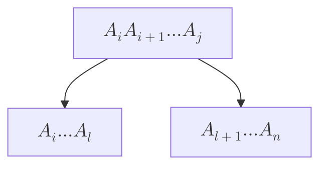
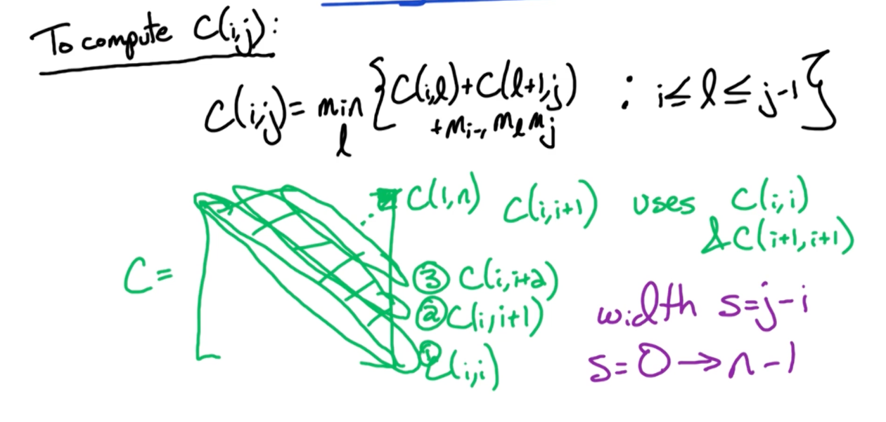
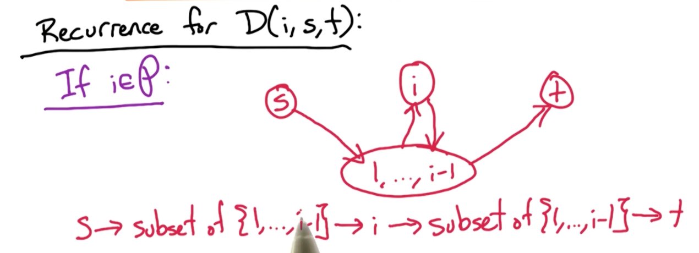

### Introduction

* Step1: State the subproblem, i.e define what $D[i][j][k]$ represents. In general:
  * Try prefix (or suffix)
  * Then try substrings
    * If you figured out a problem using substrings, think whether it can be solved with prefix/suffix.
    * At least for this course, we are not testing suffix.
* Step2: Express the subproblem in the form of a recurrence relation, including the base cases.
* Step3: Write out the pseudocode.
* Step4: Time complexity analysis.


### Longest increasing subsequence (LIS) (DP1)

Given a following sequence, find the length of the longest common subsequence. For example, given Input: 5, 7, 4, -3, 9, 1, 10, 4, 5, 8, 9, 3, the longest subsequence will be -3, 1, 4, 5, 8, 9, and the answer will be 6.

Extra Information:


When considering the LIS, the key question to ask is given a subsequence $x_1, ..., x_{n-1}$, when will $x_n$ affect the LIS. When does this happen? Is only when $x_n$ is appended to the LIS of $x_1,...,x_{n-1}$. 

Concretely, suppose the $LIS(x_1,...,x_{n-1}) = x_{1^*},...,x_j$, then LIS of $x_1,...,x_{n-1}, x_n$ will only change if $x_n$ is included, otherwise the LIS remains the same. This can only happen if $x_n > x_j$.

`Subproblem`:

Define the subproblem $L(i)$ to be be the length of the LIS on $x_1,...,x_i$. The important point is $L(i)$ must include $x_i$.

`Recurrence relation`:

$$
L(i) = 1 +\underset{1 \leq j \le i}{max} \{ L(j) \lvert x_j < x_i\  \}
$$


`Pseudocode`:

Note, $L(i)$ must be at least 1, where the LIS is just itself.
```
S = [x1,...,xn]
L = [0, ..., 0]
for i = 1-> n:
  # Stores the current best of L[i], which must be at least 1
  L[i] = 1 
  for j = 1 -> i-1:
    if S[i] > S[j] and L[j] + 1 >= L[i]:
       L[i] = L[j] + 1 # Update current best

return max(L)
```

`Complexity`:

There is a double for loop with $i$ taking up to the value $n$. Hence, the time complexity is $O(n^2)$ and space complexity is $O(n)$.

### Longest Common Subsequence (DP1)

Given two sequences, $x_1,..,x_n$ and $y_1,...,y_m$, find the longest common subsequence. For example given X = BCDBCDA and Y = ABECBAB, then the longest subsequence is BCBA.

Extra information:

Note that X and Y can be of different lengths, so, given a $X[:i]$ and $Y[:j]$. Let $L(i,j)$ denote the LCS of $X[:i]$ and $Y[:j]$, then there are two cases to consider:

if $x_i \neq y_j$, then either of the 3 cases can occur:

* $x_i$ is not used in the final solution, $L(i-1,j)$
* $y_j$ is not used in the final solution, $L(i, j-1)$
* Both is not used in the final solution 
  * If the last character of both is not used, we can get there by dropping the last character and then dropping the last character of Y (or vice versa).

So, we can just consider the first two cases and take the max, i.e max$(L(i-1,j), L(i,j-1))$

if $x_i = y_j$, again there are 3 cases to consider:

* $x_i$ is not used in the final solution, $L(i-1,j)$
* $y_i$ is not used in the final solution, $L(i, j-1)$
* Both $x_i$ and $y_j$ are used in the final solution, $1+L(i-1,i-j)$.
  * Note this means that the LCS $X[:i],Y[:j]$ ends with both $x_i$ and $y_j$ respectively

This is equal to max$\\{L(i-1,j), L(i,j-1), 1+L(i-1,i-j)\\}$. 

However, we only need to consider the last case $1+L(i-1,i-j)$. This is because if the final solution must contain either $x_i$ or $y_j$ - otherwise we can just simply append them to the end. It may be possible that $x_i = y_{j-c}$, where it corresponds to some earlier occurrence in Y. But if this is true, that means $y_{j-c} = y_j$ and it does not matter.

`Subproblem`:

Let $L(i,j)$ denote the LCS of $X[:i],Y[:j]$, where $1 \leq i\leq n, 1\leq j \leq m$

`Recurrence relation`:

Firstly, $L(0,j) = 0, L(i,0) = 0$, then:

$$
L(i,j) =
\begin{cases}
max(L(i-1,j), L(i,j-1)),  & \text{if } x_i \neq y_j\\
1+L(i-1,j-1), & \text{otherwise}
\end{cases}
$$

`Pseudocode`:

```
for i = 1->n:
  L[i][0] = 0
for j = 1->m:
  L[0][j] = 0
for i = 1->n:
  for j = 1->m:
     if X[i] == Y[j]:
       L[i][j] = 1+ L[i-1][j-1]
     else:
       L[i][j] = max(L[i-1][j], L[i][j-1])

return L[n][m]

```

`Complexity`:

Two loops, $n$ and $m$, so $O(nm)$

Backtracking

After the matrix L is constructed, we can backtrace to find out the common subsequence until we reach $L[1][1]$ - (note, this might be 0,0 depending on the indexing you use).

We consider the following cases:

* If $x_i = y_j$, this means that a character was added and then we move diagonally up.
* Else, we check to the left and top of coordinates (i,j).
  * The left coordinate is (i-1,j)
  * The top coordinate is (i,j-1)
  * If the left coordinate is greater or equal to the top coordinate, we move left.
    * This means we ignored $x_i$
  * Else, we move top.
    * This means that we ignored $y_j$
* Repeat until converge to initial starting point. 

```
i=n, j=m
string = ""
while i > 1 and j>1:
  if X[i] == Y[j]:
    string = string + X[i]
    i = i - 1
    j = j - 1
  if L[i-1][j] >= L[i][j-1]:
    i = i - 1
  else:
    j = j - 1  

return reverse(string)
```

Extra note - the steps of $i = i - 1$ and $j = j - 1$ can be reversed, and may lead to different results if there are multiple valid LCS.

### Contiguous Subsequence Max Sum (DP1)

A contiguous subsequence of a list S is a subsequence made up of consecutive elements of S. For instance, if S is 5, 15, −30, 10, −5, 40, 10, then 15, −30, 10 is a contiguous subsequence but 5, 15, 40 is not. Give a linear-time algorithm for the following task:

Input: A list of numbers, a1, a2, . . . , an.

Output: The contiguous subsequence of maximum sum (a subsequence of length zero
has sum zero).

For the preceding example, the answer would be 10, −5, 40, 10, with a sum of 55.

(Hint: For each j ∈ {1, 2, . . . , n}, consider contiguous subsequences ending exactly at position j.)

Extra notes:

Considering $S(i)$ which includes $x_i$. Since $x_i$ is part of the solution, then, the max sum is either itself, or the optimal max sum before itself, i.e $S(i-1)$.

`Subproblem`:

Let $S(i)$ denote the max sum of the sequence $x_1,...,x_i$.

`Recurrence relation`:

$$
S(i) = a_i + max \{ 0, S(i-1) \}
$$

`Pseudocode`:

```
seq = [s0,s1,...,sn]
S = [0,...,0]
for i -> 1 to n:
  S[i] = seq[i] + max(0,S[i-1])
return max(S)
```

`Complexity`:

Only one for loop, hence $O(n)$.

### Knapsack (DP2)

Given $n$ items with weights $w_1,w_2,..., w_n$ each with value $v_1,...,v_n$ and capacity $W$, we want to find the subset of objects S, such that we maximize values max($\sum_{i\in S} v_i$ ) but $\sum_{i \in S} w_i < W$..

Extra notes:

Problem 1:

Obviously, a greedy approach is bad, and the time complexity is $O(2^n)$, where each bit represents whether the object is included or not included.

Problem 2:

Consider the following problem, where we have 4 objects, with values 15,10,8,1 and weights 15,12,10,5 with total capacity 22. The optimal solution is items 2,3.

Then, K(1) = $x_1$ with $V=15$, K(2) is also $x_1$ with $V=15$. But, how do we express K(3) in terms of K(2) and K(1) which took the first object? So there is no real way to define K in terms of its previous sub problems!

Consider this new approach $K(I,W)$ where we also consider w as part of the sub problem - that is what is the optimal set of items given capacity w, for $ 1 \leq I \leq N, 1 \leq w \leq W$. Then by doing so, when we consider $K(3,22)$, there are two cases to consider:

* If $x_3$ is part of the solution, then we look up $K(2,22-v_3) = K(2,12)$
  * Notice that $K(2,12)$ will give us item 2 with $w_2 = 12$.
* If $x_3$ is not part of the solution, then we look up $K(2,22)$

`Subproblem`:

Define $K(i,w)$ to be the optimal solution involving the first $i$ items with capacity $w$, $\forall i \in [1,N], w \in [1,W] $

`Recurrence relation`:

The recurrence can be defined as follows:

$$
K(i,w) = max(v_i + K(i-1, w - w_i), K(i-1,w))
$$

The base cases will be $K(0,w) = 0, K(i,0) = 0 \forall i, w$

That is, if item $x_i$ is included, then we add the corresponding value $v_i$ and subtract the weight of item i $w_i$. If it is not included, then we simply take the first $i-1$ items.


`Pseudocode`:

```
K = zeros(N,W)
weights = [w1,...,wn]
values = [v1,...,vn]
for i = 1 to N:
  K[i,0] = 0
for w = 1 to W:
  K[0, w] = 0
for i = 1 to N:
  for w = 1 to W:
    K[i,w] =  max(values[i] + K[i-1, w - w_i], K[i-1,w])

return K(N,W)
```

`Complexity`:

There is two loops, N, and W, so, $O(NW)$.

However, note that W is an integer which can be represented with $2^m$ bits, so the complexity can be rewritten as $O(N2^m)$ which is exponential runtime. 
* Knapsack is also known as a Pseudo-polynomial time problem
* [Why is knapsack problem pseudo polynomial?](https://stackoverflow.com/questions/4538581/why-is-the-knapsack-problem-pseudo-polynomial)

To do backtracking,

```
# Starting from index 1
included = [0] * N

for i = 1 to N:
  if K[i,w] != K[i-1,W]:
    # this means item i is included 
    included[i] = 1
    W = W - weights[i]
```

Then, included will be a binary representation of which items to be included.

### Knapsack with repetitions (DP2)

This problem is a variant of the earlier problem, but you can add an infinite amount of $x_i$ in your knapsack.

Subproblem and `Recurrence relation`::

We can do the same as the above problem, whether $x_i$ is in your final solution or otherwise:

$$
K(i,w) = max(v_i + K(i-1, w-w_i), K(i-1,w))
$$

But notice that this can be further simplified, we do not need to take into consideration of item $x_i$. We can just simply at each step, iterate through all the possible items to find the best item to add to the knapsack.

$$
K(w) = \underset{i}{max} \{ v_i + K(w - w_i): i \leq i \leq n, w_i \leq W \}
$$

`Pseudocode`:

```
for w = 1 to W:
  K(w) = 0
  for i = 1 to N:
    # if item x_i is below the weight limit and beats the current best
    if w_i <= w & K(b) < v_i + K(w-w_i):
      K(w) = v_i + K(w-w_i)
return K(W)
```

`Complexity`:

The complexity does not change, but the space complexity is now based on W.

Backtracking

To do backtracking, we have a separate array (multiset) $S(b) = [[],...,[]]$ so whenever an item $x_i$ get added, simply set $S(w) = S(w-w_i) + [i]$. 

Note, if we find a better solution to add item $x_i$, then $S(w)$ will be overwritten.

### Chain Multiply (DP2)

Consider two matrices $X_{a,b}$ and $Y_{b,c}$, the computation cost of calculating $XY$ is $O(abc)$.

Suppose we have 3 matrices $A_{2,5}, B_{5,10}, C_{10,2}$, 

* Calculating $((AB)C)$ will require $\underbrace{2 \times 5 \times 10}_{AB} + 2\times 10\times 2 = 140$ computations
* While calculating $(A(BC))$ will require $\underbrace{5\times 10\times 2}_{BC} + 2\times 5\times 2 = 120$ computations

So, the point here is that the order of multiplication matters. 

The problem now is given an initial sequence of matrices $A_1...,A_n$, suppose the optimal point to split is at $k$, then the left sequence will be $A_1....A_k$. Then, for this left sequence, what will be the optimal split? So, the point at which the split occurs is dynamic. 



Remember, for a dynamic programming solution, each of the subtrees must also be optimal.

`Subproblem`:

So, we denote $C(i,j)$ be the optimal cost of multiplying $A_i...A_j$

For an arbitrary matrix, $A_i$, the dimensions is $m_{i-1},m_{i}$

`Recurrence relation`:

$$
C(i,j)=\underset{l}min\left\{ C(i,l)+C(l+1,j) +(m_{i-1} m_l m_j) \; i \le l \le j-1  \right\}
$$

where $C(i,l)$ is the cost of the left subtree, $c(l+1,j)$ is the right substree and $m_\{i-1\} m_l m_j$ is the cost of combining the two sub trees.

`Pseudocode`:



So, $C(i,i) = 0, \forall i$. Then, we calculate $C(i,i+1), C(i, i+2), ..., C(1,n)$ which is the solution that we are looking for. 

* Start at the diagonal and move up, to index this, consider $C(i,i+2)$ and $C(i,i)$, the difference is $i+2$, and $i$. Let's call this the width, $s = j-i$.
  * Then, $j$ can be calculated with $j = i+s$
  * So we do this until we get width = $n-1$, so $s=0\rightarrow n-1$.

To rephrase this, given that we fill the diagonal first, we move one step to the right of the diagonal, i.e $C(2,i+1),.., C(n, i+1). Then, how many elements do we need to compute? n-1 elements.

Now, suppose we move $s$ steps to the right of the diagonal, then, there will be $n-s$ elements to compute.


```
# This step will populate the diagonals
for i=1 -> n:
  C(i,i)=0
# How many steps we move to the right of the diagonal
for s=1 -> n-1:
    # How many elements we need to compute
    for i=1 -> n-s:
      # Compute the j coordinate    
      Let j=i+s                                              
      C(i,j) = infinity
      for l=i -> j-1:                                          
        curr = (m[i-1] * m[l] * m[j]) + C(i,l) + C(l+1,j)
        if C(i,j) > curr:
          C(i,j) = curr
return C(1,n)
```

`Complexity`:

The time complexity is 3 inner for loops, so, $O(n^3)$.


Backtracking

To perform backtracking, we need another matrix, to keep track for each $i,j$, what is the corresponding $l$ in which the best split took place. Then, backtracking can be done via recursion. Here is an example:


```
def traceback_optimal_parens(s, i, j):
    if i == j:
        return f"A{i+1}"  # Single matrix, no parenthesis needed
    else:
        k = s[i][j]
        # Recursively find parenthesization for the left and right subchains
        left_part = traceback_optimal_parens(s, i, k)
        right_part = traceback_optimal_parens(s, k + 1, j)
        return f"({left_part} x {right_part})"

```

This divides each step into two subproblems, and the combine steps is a constant function, so, $T(n) = 2 T ( n/ 2) + 1$. Using master theorem, the time complexity is $O(n)$.

Extra notes on chain multiply:

```python
# this is how far away from the diagonals
for width in range(1,n):
  """
  For example if you are 2 away from the diagonal,
  means you need n-2 x coordinates
  """
  for i in range(n - width):
    """
    This is the corresponding y coordinate,
    which is just adding the width to the x coordinate 
    From the current x-coordinate, move width steps.

    For example, lets look at the diagonal 2 points away

    (0,0), (0,1), (0,2), (0,3), (0,4)
    (_,_), (1,1), (1,2), (1,3), (1,4)
    (_,_), (_,_), (2,2), (2,3), (2,4)
    (_,_), (_,_), (_,_), (3,3), (3,4)
    (_,_), (_,_), (_,_), (_,_), (4,4)

    which is (0,2), (1,3), (2,4)
    so, x runs from 0 to 2 
    while y runs from 2 to 4 which is adding the width
    """
    j = i + width
    for l in range(i,j):
      """
      This l is the split, suppose i = 0, j = 5
      0|1234, 01|234, 012|34, 0123|4 which is considering
      all combinations
      """
      # D[i][j] = Operation(D[i][l],D[l+1][j])
```


### Bellman-Ford (DP3)

Given $\overrightarrow{G}$ with edge weights and vertices, find the shortest path from source node $s$ to target node $z$. We assume that it has no negative weight cycles (for now).

`Subproblem`:

Denote $P$ to be the shortest path from $s$ to $z$. If there are multiple $P$ possible, we can assume any one of them. Since $P$ visits each vertex at most once, then:

$$
\lvert P \lvert \leq (n-1)\text{edges}
$$

DP idea: Condition on the prefix of the path. Use $i = 0 \rightarrow n-1$ edges on the paths. 

For $0 \leq i \leq n-1, z \in V$, let $D(i,z)$ denote the length of the shortest path from S to Z using $\leq i$ edges.

`Recurrence relation`:

Base case: $D(0,s) = 0 \forall z \neq s, D(0, z) = \infty$

$$
D(i,z) = \underset{y:\overrightarrow{yz}\in E}{min} \{D(i-1,y) + w(y,z), D(i-1,Z) \}
$$

If there is no solution, then, it will still be $\infty$.

Otherwise, suppose the edge z is reachable from y, then there are two cases to consider. Consider the intermediate edge from y to z, if this edge $\overrightarrow{yz}$ is in the solution, add $w(y,z)$. The other case is a solution already exists without $\overrightarrow{yz}$, which will be denoted by $D(i-1,Z)$. We simply take the minimum of the two.

`Pseudocode`:

```
For z = 1 to length(V):
  D(0, z) = infinity
for i = 1 to n-1:
  for all z in V:
    D(i,z) = D(i-1,z)
      for all edges(y,z) in E:
        if D(i,z) > D(i-1,y) + w(y,z):
          D(i,z) = D(i-1,y) + w(y,z)
# Return the last row
Return D(n-1,:) 
```

Note, the last row basically returns all paths at most length $n-1$ from source node $s$ to all other vertex $z \in V$

`Complexity`:

Initially, you might think that there the complexity is $O(N^2E)$ because of the 3 nested for loops. But, in the 2nd and 3rd nested for loop, it is actually going through all edges (If you go through all nodes and all the edges within each node, it is actually going through all the edges). So the time complexity is actually $O(NE)$.

Now, how can you use bellman ford to detect if there is a negative cycle? Notice that the algorithm runs until n-1. Run it for one more time, and compare the difference. If the solution is different, then, some negative weights must exists.

In other words, check for:

$$
D(n,z) < D(n-1,z), \exists z \in V
$$


Suppose we wanted to find all pairs, and use bellman ford, what will the solution look like? 

Given $\overrightarrow{G} = (V,E)$, with edge weights $w(e)$. For $y,z \in V$, let $dist(y,z)$ be the legnth of shortest path $y \rightarrow z$..

Goal: Find $dist(y,z), \forall y,z \in V$

The time complexity in this case will be $O(N^2M)$. Also, if $\overrightarrow{G}$ is a fully connected graph, it means there are $M=N^2$ edges, making it a $O(N^4)$ algorithm. What can we do about this? Look at [Flord Warshall](#floyd-warshall)!


A side note about Dijkstra algorithm, it is a greedy algorithm with time complexity $O(N + E log(N))$, so it is better than Bellman Ford if you know that there are no negative edges

### Floyd-Warshall (DP3)

`Subproblem`:

For $0 \leq i \leq n$ and $1 \leq s, t \leq n$, let $D(i,s,t)$ be the length of the shortest path from $s\rightarrow t$ using a subset $\{1, ..., i\}$ as intermediate vertices. Note, the key here is intermediate vertices.

So, $D(0,s,t)$ means you can go to t from s directly without any intermediate vertices.

`Recurrence relation`:

The base case is when $i = 0$, then there are two cases, either you can go to t from s, in which case it is $w_{s,t}$, else $\infty$.

What about $D(i,s,t)$? There are again two cases to consider, either the intermediate vertex $i$ is in the path $P$ or otherwise.

If it is not in the optimal path $P$, then the $D(i,s,t) = D(i-1,s,t)$.

If it is in the optimal path $P$, then this is the scenario where it can happen.



Notice that you go from $S$ to a subset (can be an empty set) or vertices $\{1,...,i-1\}$, go to vertex $i$, back to the subset before reaching vertex $t$. So there is this 4 paths to consider.

So, the first two paths can be represented by $D(i-1, s,i)$, that is using the subset of vertices $\{1,...,n-1\}$ to reach vertex $i$, and, the next two paths can be represented by $D(i-1,i,t)$, that is reaching vertex $t$ from $i$ using subset of vertices $\{1,...,n-1\}$

`Pseudocode`:

```
Inputs: G, w

for s=1->n:
    for t=1->n:
        if (s,t) in E 
            then D(0,s,t)=w(s,t)
        else D(0,s,t) = infty

for i=1->n:
    for s=1->n:
        for t=1->n:
            D(i,s,t)=min{ D(i-1,s,t), D(i-1,s,i) + D(i-1,i,t) }

# return the last slice, has N^2 entries.
Return D(n,:,:)
```

`Complexity`:

The complexity here is clearly $O(N^3)$.

To detect negative weight cycles, can check the diagonal of the matrix D. 
* If there is a negative cycle, then there should be a negative path length from a vertex to itself, i.e $D(n,y,y) < 0, \exists y \in V $. 
  * This is equivalent to checking whether there is any negative entries on the diagonal matrix $D(n,:,:)$.

For bellman ford algorithm, it depends on the s and z to determine if a negative weight path exists, a single source shortest path algorithm. But for Floyd Warshall, it does all pair shortest path, and hence it is guaranteed to find the negative cycle, if it exists. 

----

Other Problems (TODO?)

* Edit Distance
* Electoral College

<!--  -->