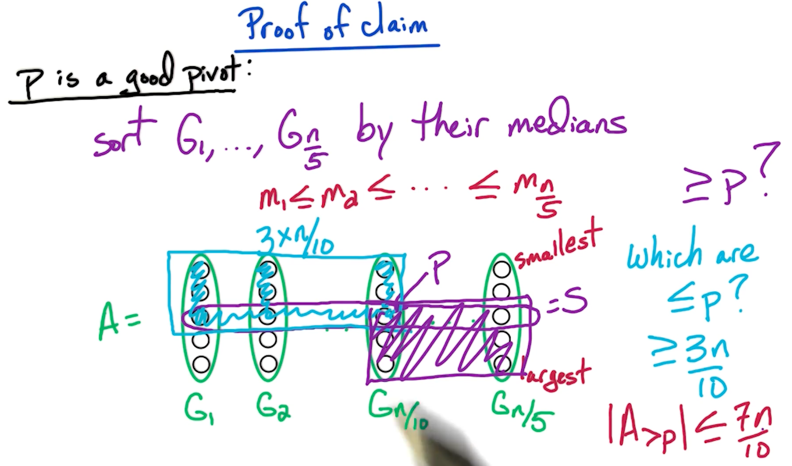
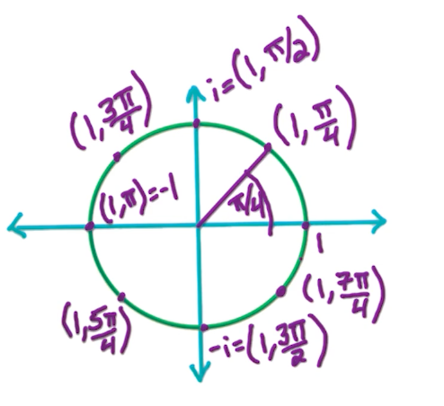
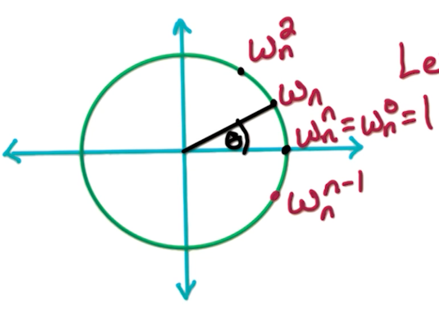
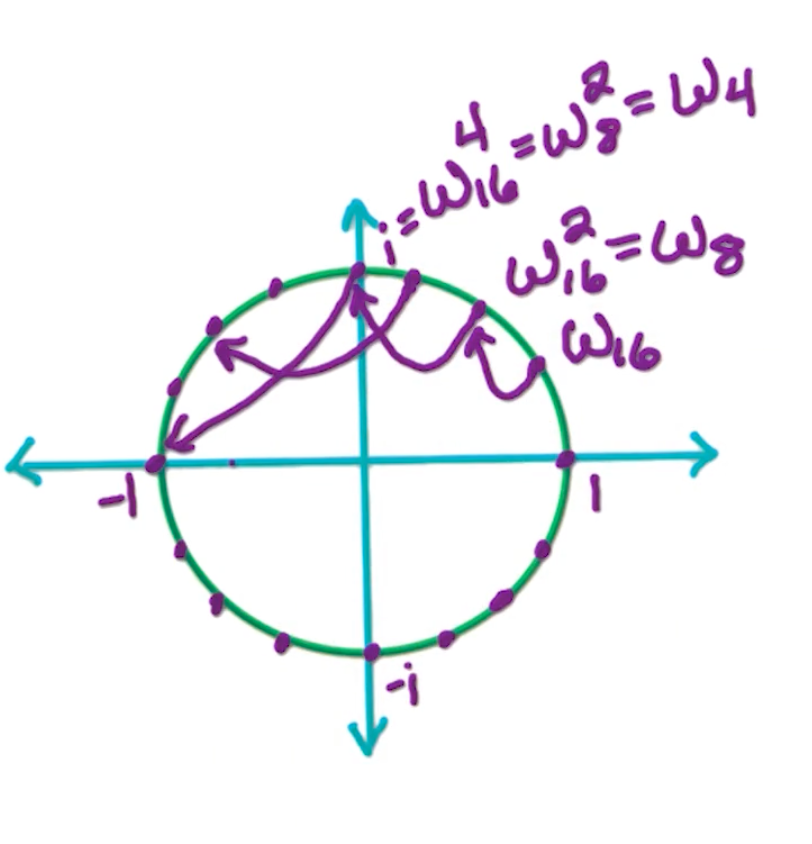
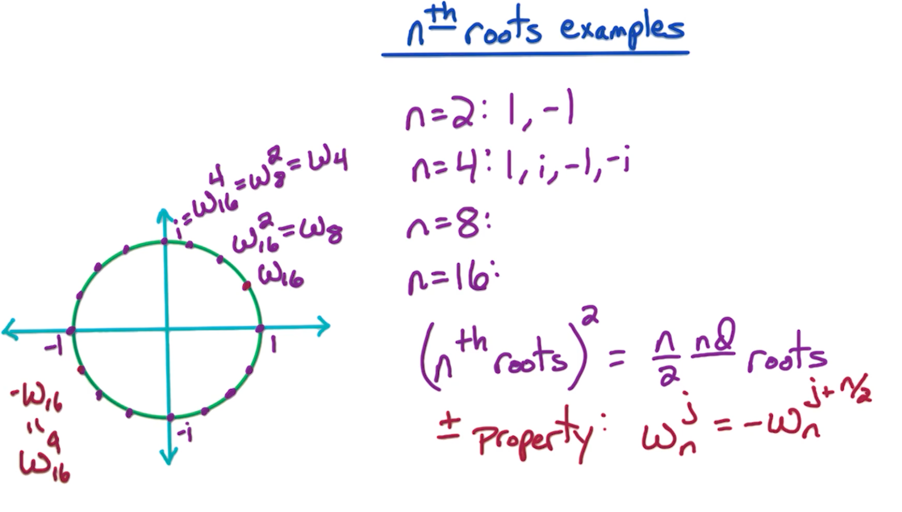

### Master theorem

Note, this is the simplified form of the Master Theorem, which states that:

$$
T(n) =
\begin{cases}
O(n^d), & \text{if } d > \log_b a \\
O(n^d \log n), & \text{if } d = \log_b a \\
O(n^{\log_b a}), & \text{if } d < \log_b a
\end{cases}
$$

For constants $a>0, b>1, d \geq 0$.

The recurrence relation under the Master Theorem is of the form:

$$
T(n) = aT\left(\frac{n}{b}\right) + O(n^d)
$$


where:

* $a$: Number of subproblems the problem is divided into.
* $b$: Factor by which the problem size is reduced.
* $O(n^d)$: Cost of work done outside the recursive calls, such as dividing the problem and combining results.

**Understanding the Recursion Tree**

To analyze the total work, think of the recursion as a tree where:

* Each level of the tree represents a step in the recursion.
* The root of the tree represents the original problem of size $n$.
* The first level of the tree corresponds to dividing the problem into $a$ subproblems, each of size $\frac{n}{b}$.
* The next level corresponds to further dividing these subproblems, and so on.

**Cost at the $k-th$ level:**

* Number of Subproblems:

  $$
  \text{Number of subproblems at level } k = a^k
  $$

  At each split, it produces $a$ sub problems, after $k$ splits, hence $a^k$.

* Size of Each Subproblem:

  $$
  \text{Size of each subproblem at level } k = \frac{n}{b^k}
  $$

  During each step, the problem is reduced by $b$. E.g in binary search, each step reduces by half, $\frac{n}{2}$. After $k$ steps, it will be $\frac{n}{2^k}$

* Cost of Work at Each Subproblem:

  $$
  \text{Cost of work at each subproblem at level } k = O\left(\left(\frac{n}{b^k}\right)^d\right)
  $$

  This is the cost of merging. For example in merge sort, cost of merging is $O(n)$ which is linear. 

* Thus, total cost at level k :

  $$
  \text{Total cost at level } k = a^k \times O\left(\left(\frac{n}{b^k}\right)^d\right) = O(n^d) \times \left(\frac{a}{b^d}\right)^k
  $$


Then, $k$ goes from $0$ (the root) to $log_n b$ levels (leaves), so,

$$
\begin{aligned}
S &= \sum_{k=0}^{log_b n} O(n^d)  \times \left(\frac{a}{b^d}\right)^k \\
&= O(n^d) \times \sum_{k=0}^{log_b n}  \left(\frac{a}{b^d}\right)^k
\end{aligned}
$$

Recall that for geometric series, $\sum_{i=0}^{n-1} ar^i = a\frac{1-r^n}{1-r}$. So, we need to consider $\frac{a}{b^d}$. So, when $n$ is large:

Case 1:

If $d> log_b a$, then $ a < b^d $ thus $\frac{a}{b^d} < 1$. So when $n$ is large,

$$
\begin{aligned}
S &= O(n^d) \times \sum_k^\infty (\frac{a}{b^d})^k \\ 
&= O(n^d) \times \frac{1}{1-\frac{a}{b}} \\
&\approx O(n^d)
\end{aligned}
$$
 
For case 1, the work is dominated by the cost of the non-recursive work (i.e., the work done in splitting, merging, or processing the problem outside of the recursion) dominates the overall complexity. 

Case 2:

if $d = log_b a$, then $a = b^d$ thus $\frac{a}{b^d} = 1$.

$$
\begin{aligned}
S &= O(n^d) \times \sum_k^{log_b n} \underbrace{(\frac{a}{b^d})^k}_{1} \\ 
&= O(n^d) \times  log_b n \\
&\approx O(n^d log_b n) \\
&\approx O(n^d log n) \\
\end{aligned}
$$

Notice that the log base is just a ratio that we can further simplify.

For case 2, The work is evenly balanced between dividing/combining the problem and solving the subproblems. Another way to think about it is, at each step there is $n^d$ work, with $log_b n \approx log n $ levels, so the total work is $O(n^d log n)$

Case 3:

If $d < log_b a$ then $a > b^d$ thus $\frac{a}{b^d} > 1$. 

$$
\begin{aligned}
S &= O(n^d) \times \sum_{k=0}^{log_b n} (\frac{a}{b^d})^k \\ 
&= O(n^d) \times \frac{(\frac{a}{b^d})^{log_b n}-1}{\frac{a}{b^d}-1}\\
&\approx  O(n^d) \times (\frac{a}{b^d})^{log_b n}-O(n^d) \\
&\approx  O(n^d) \times (\frac{a}{b^d})^{log_b n}\\
&= O(n^d) \times \frac{a^{log_b n}}{(b^{log_b n})^d}\\
&= O(n^d) \times \frac{a^{log_b n}}{n^d}\\
&= O(a^{log_b n}) \\
&= O(a^{(log_a n)(log_b a)}) \\
&= O(n^{log_b a})
\end{aligned}
$$

For case 3, the work is dominated by the cost of recursive subproblems dominates the overall complexity


### Fast Integer multiplication (DC1)

Given two (large) n-bit integers $x \& y$, compute $ z = xy$.

Recall that we want to look at the running time as a function of the number of bits. The naive way will take $O(N^2)$ time. 

Inspiration:

Gauss's idea: multiplication is expensive, but adding/subtracting is cheap.

2 complex numbers, $a+bi\ \&\ c+di$, wish to compute $(a+bi)(c+di) = ac - bd + (bc + ad)i$. Notice that in this case we need 4 real number multiplications, $ac,bd,bc,ad$. Can we reduce this 4 multiplications to 3? Can we do better?

Obviously it is possible! The key is that we are able to compute $bc+ad$ without computing the individual terms; not going to compute $bc, ad$ but instead $bc+ad$, consider the following:

$$
\begin{aligned}
(a+b)(c+d) &= ac + bd + (bc + ad) \\
(bc+ad) &= \underbrace{(a+b)(c+d)}_{term3} - \underbrace{ac}_{term1} - \underbrace{bd}_{term2}
\end{aligned}
$$

So, we need to compute $ac, bd, (a+b)(c+d)$ to obtain $(a+bi)(c+di)$. We are going to use this idea to multiply the n-bit integers faster than $O(n^2)$

Input: n-bits integers x,y and assume $n$ is a power of 2 - for easy computation and analysis.

Idea: break input into 2 halves of size $\frac{n}{2}$, e.g $x = x_{left} \lvert x_{right}$, $y = y_{left} \lvert y_{right}$

Suppose $x=2=(10110110)_2$:
* $x_{left} = x_L = (1011)_2 = 11$
* $x_{right} = x_R= (0110)_2 = 6$
* Note, $182 = 11 \times 2^4 + 6$
* In general, $x = x_L \times 2^{\frac{n}{2}} + x_R$

Divide and conquer: 

$$
\begin{aligned}
xy &= ( x_L \times 2^{\frac{n}{2}} + x_R)( y_L \times 2^{\frac{n}{2}} + y_R) \\
&= 2^n \underbrace{x_L y_L}_a + 2^{\frac{n}{2}}(\underbrace{x_Ly_R}_c + \underbrace{x_Ry_L}_d) + \underbrace{x_Ry_R}_b
\end{aligned}
$$

```
EasyMultiply(x,y):
input: n-bit integers, x & y , n = 2**k
output: z = xy 
xl = first n/2 bits of x, xr = last n/2 bits of x
same for yl, yr.

A = EasyMultiply(xl,yl), B= EasyMultiply(xr,yr)
C = EasyMultiply(xl,yr), D= EasyMultiply(xr,yl)

Z = (2**n)* A + 2**(n/2) * (C+D) + B
return(Z)
```

running time: 

* $O(n)$ to break up into two $\frac{n}{2}$ bits, $x_L,x_R, y_L,y_R$
* To calculate A,B,C,D, its $4T(\frac{n}{2})$
* To calculate $z$, is $O(n)$
  * Because e.g we need to shift $A$ by $2^n$ bits.

So the total complexity is: $4T(\frac{n}{2}) + O(n)$ 

Let $T(n)$ = worst-case running time of EasyMultiply on input of size n, and by master theorem, this yields $O(n^{log_2 4}) = O(n^2)$

As usual, as with everything, **can we do better?** Can we change the number `4` to something better like `3`? I.e we are trying to reduce the number of 4 sub problems to 3.

**Better approach:**

$$
\begin{aligned}
xy &= ( x_L \times 2^{\frac{n}{2}} + x_R)( y_L \times 2^{\frac{n}{2}} + y_R) \\
&= 2^n \underbrace{x_L y_L}_1 + 2^{\frac{n}{2}}(\underbrace{x_Ly_R + x_Ry_L}_{\text{Change this!}}) + \underbrace{x_Ry_R}_4
\end{aligned}
$$

Using Gauss idea:

$$
\begin{aligned}
(x_L+x_R)(y_L+y_R) &= x_L y_L + x_Ry_R + (x_Ly_R+x_Ry_L) \\
(x_Ly_R+x_Ry_L) &= \underbrace{(x_L+x_R)(y_L+y_R)}_{c}- \underbrace{x_L y_L}_a + \underbrace{x_Ry_R}_b \\
\therefore xy &= 2^n A + 2^{\frac{n}{2}} (C-A-B) + B
\end{aligned}
$$

```
FastMultiply(x,y):
input: n-bit integers, x & y , n = 2**k
output: z = xy 
xl = first n/2 bits of x, xr = last n/2 bits of x
same for yl, yr.

A = FastMultiply(xl,yl), B= FastMultiply(xr,yr)
C = FastMultiply(xl+xr,yl+yr)

Z = (2**n)* A + 2**(n/2) * (C-A-B) + B
return(Z)
```

With Master theorem, $3T(\frac{n}{2}) + O(n) \rightarrow O(n^{log_2 3})$ 

Example:

Consider $z=xy$, where $x=182, y=154$. 

* $x = 182 = (10110110)_2, y= 154 = (10011010)_2$
  * $x_L = (1011)_2 = 11$
  * $x_R = (0110)_2 = 6$
  * $y_L = (1001)_2 = 9$
  * $y_R = (1010)_2 = 10$
* $A = x_Ly_L= 11*9 = 99$
* $B = x_Ry_R = 6*10 = 60$  
* $C = (x_L + x_R)(y_L + y_R) = (11+6)(9+10) = 323 $

$$
\begin{aligned}
z & =  2^n A + 2^{\frac{n}{2}} (C-A-B) + B\\
&= 2^8* 99 + 2^4 * (323-99-60) + 60 \\
&= 28028
\end{aligned}
$$

### Linear-time median (DC2)

Given an unsorted list $A=[a_1,...,a_n]$ of n numbers, find the median ($\lceil \frac{n}{2}\rceil$ smallest element). 

Quicksort Recap:

* Choose a pivot p 
* Partition A into $A_{< p}, A_{=p}, A_{>p}$
* Recursively sort $A_{< p}, A_{>p}$

Recall in quicksort the challenging component is choosing the pivot, and if we reduce the partition by only 1, this results in the worse case can result in $O(n^2)$. So what is a good pivot? the median but how can we find this median without sorting which is $O(n log n)$.

The key insight here is we do not need to consider all of $A_{< p},A_{=p}, A_{>p}$, we just need to consider 1 of them.

```
Select(A,k):
Choose a pivot p (How?)
Partition A in A < p, A = p, A > p          
if  k <= |A_{<p}|        
    then return Select(A_{<p},k)               
if  |A_{<p}| < k <= |A_{>p}| + |A_{=p}|           
    then return p            
if  k > |A_{>p}| + |A_{=p}|  
    then return Select(A_{>p}, k - |A_{<p}| - |A_{=p})| 
```    

**The question becomes, how do we find such a pivot?**

The pivot matters a lot, because if the pivot is the median, then, our partition will be $\frac{n}{2}$ which fields $T(n) = T(\frac{n}{2}) + O(n)$, which will achieve a running time of $O(n)$. 

However, it turns out we do not need $\frac{1}{2}$, we just need something that can reduce the problem at each step, for example $T(n) = T(\frac{3n}{4}) + O(n)$ where each step only eliminates $\frac{1}{4}$ of the problem space, which will still give us $O(n)$. It turns out we just need the constant factor to be less than 1 (do you know why?), so, even 0.99 will work!

For the purpose of this lectures, we consider a pivot $p$ is good, if it reduces the problem space by $\frac{1}{4}$. i.e $\lvert A_{<p} \lvert \leq \frac{3n}{4} \&  \lvert A_{>p} \lvert \leq \frac{3n}{4} $.

Assume for now we have a sorted array, then, the probability of selecting a good pivot is when the number is between $[\frac{n}{4},\frac{3n}{4} ]$, so the probability is half. We can validate the pivot by tracking the size of the split. So this is as good as flipping a coin - what is the expected number of trails before you get a heads? The answer is 2. However, there is still a chance that you keep getting tails, so it does not still guarantee the worst case runtime is $O(n)$. Consider the following:

$$
\begin{aligned}
T(n) &= T\bigg(\frac{3}{4} n\bigg) + \underbrace{T\bigg(\frac{n}{5}\bigg)}_{\text{cost of finding good pivot}} + O(n)\\
&\approx O(n)
\end{aligned}
$$

To accomplish this, choose a subset $S \subset A$, where $\lvert S \rvert = \frac{n}{5}$. Then, we set the pivot = $median(S)$. 

But, now we face another problem, how do we select this sample $S$? :frowning_face: - one problem after another.

Introducing `FastSelect(A,k)`:

```
Input:   A - an unsorted array of size n
         k an integer with 1 <= k <= n 
Output:  k'th smallest element of A

FastSelect(A,k):

Break A into ceil(n/5) groups         G_1,G_2,...,G_n/5
    # doesn't matter how you break A

For j=1->n/5:
    sort(G_i)
    let m_i = median(G_i)

S = {m_1,m_2,...,m_n/5}             # these are the medians of each group
p = FastSelect(S,n/10)              # p is the median of the medians (= median of elements in S)
Partition A into A_<p, A_=p, A_>p

# now recurse on one of the sets depending on the size
# this is the equivalent of the quicksort algorithm 

if k <= |A_<p|:
    then return FastSelect(A_<p,k)    
if k > |A_>p| + |A_=p|:
    then return FastSelect(A_>p,k-|A_<p|-|A_=p|)
else return p
```

**Analysis of run time**:
* Splitting into $\frac{n}{5}$ groups - $O(n)$
* Since we are sorting a fix number of elements (5), it is order $O(1)$, over $\frac{n}{5}$, so, it is still $O(n)$. 
* The first `FastSelect` takes $T(\frac{n}{5})$ time.
* The final recurse takes $T(\frac{3n}{4})$

$$
\begin{aligned}
T(n) &= T(\frac{3n}{4})+ T(\frac{n}{5}) + O(n) \\
&= O(n)
\end{aligned}
$$

The key here is $\frac{3}{4} + \frac{1}{5} < 1$


**Prove of the claim that p is a good pivot**



**Fun exercise**: Why did we choose size 5? And not size 3 or 7?

Recall earlier, for blocks of 5, the time complexity is given by:

$$
T(n) = T(\frac{n}{5}) + T(\frac{7n}{10}) + O(n)
$$

and, $\frac{7}{10} + \frac{1}{5} < 1$.

Now, let us look at the case of 3, assuming we split into n/3 groups:

```
11 21  ... n/6 1 ... n/3 1
12 22  ... n/6 2 ... n/3 2
13 23  ... n/6 3 ... n/3 3 
```

Number of elements: 2 * n/6 = n/3. Likewise, our remaining partition is of size 2n/3. 

Then our formula will look:

$$
\begin{aligned}
T(n) &= T(\frac{2n}{3})+ T(\frac{n}{3}) + O(n) \\
&= O(n logn)
\end{aligned}
$$

Similarly, suppose we use size 7, 

* Number of elements less than or equal to n/14 4 is n/14 * 4 = 2n/7.
* Number of remaining elements more than n/14 4 is 5n/7. 

In this case, we get the equation:

$$
\begin{aligned}
T(n) &= T(\frac{5n}{7})+ T(\frac{n}{7}) + O(n) \\
&= O(n)
\end{aligned}
$$

Although in this case we still achieve $O(n)$, even though $\frac{5}{7} + \frac{1}{7} = 0.85 < \frac{1}{5} + \frac{7}{10}  = 0.9$, we increased the cost of sorting our sub list sorting. (Nothing is free! :smile:)

For more information, feel free to look at [this link by brillant.org](https://brilliant.org/wiki/median-finding-algorithm/#citation-2)!


### Solving Recurrences (DC3)

* Merge sort: $T(n) = 2T(\frac{n}{2}) + O(n) = O(nlogn)$
* Naive Integer multiplication:  $T(n) = 4T(\frac{n}{2}) + O(n) = O(n^2)$
* Fast Integer multiplication:  $T(n) = 3T(\frac{n}{2}) + O(n) = O(n^{log_2 3})$
* Median: $T(n) = T(\frac{3n}{4}) + O(n) = O(n)$

An example:

For some constant $c>0$, and given $T(n) = 4T(\frac{n}{2}) + O(n)$:

$$
\begin{aligned}
T(n) &= 4T(\frac{n}{2}) + O(n) \\
&\leq cn + 4T(\frac{n}{2}) \\
&\leq cn + 4[T(4\frac{n}{2^2} + c \frac{n}{2})]\\
&= cn(1+\frac{4}{2}) + 4^2 T(\frac{n}{2^2}) \\
&\leq cn(1+\frac{4}{2}) + 4^2 [4T\frac{n}{2^3} + c(\frac{n}{2^2})] \\
&= cn (1+\frac{4}{2} + (\frac{4}{2})^2) + 4^3 T(\frac{n}{2^3}) \\
&\leq cn(1+\frac{4}{2} + (\frac{4}{2})^2 + ... + (\frac{4}{2})^{i-1}) + 4^iT(\frac{4}{2^i})
\end{aligned}
$$

If we let $i=log_2 n$, then $\frac{n}{2^i}$ = 1.

$$
\begin{aligned}
&\leq \underbrace{cn}_{O(n)} \underbrace{(1+\frac{4}{2} + (\frac{4}{2})^2 + ... + (\frac{4}{2})^{log_2 n -1})}_{O(\frac{4}{2}^{log_2 n}) = O(n^2/n) = O(n)} + \underbrace{4^{log_2 n}}_{O(n^2)} \underbrace{T(1)}_{c}\\
&= O(n) \times O(n) + O(n^2) \\
&= O(n^2)
\end{aligned}
$$

**Geometric series**

$$
\begin{aligned}
\sum_{j=0}^k \alpha^j &= 1 + \alpha + ... + \alpha^k \\
&= \begin{cases}
O(\alpha^k), & \text{if } \alpha > 1 \\
O(k), & \text{if } \alpha = 1 \\
O(1), & \text{if } \alpha < 1
\end{cases}
\end{aligned}
$$

* The first case is what happened in Naive Integer multiplication
* The second case is the merge step in merge sort, where all terms are the same.
* The last step is finding the median where $\alpha = \frac{3}{4}$

**Manipulating polynomials**

It is clear that $4^{log_2 n} = n^2$, what about $3^{log_2 n} = n^c$

First, note that $3 = 2^{log_2 3}$

$$
\begin{aligned}
3^{log_2n} &= (2^{log_2 3})^{log_2 n} \\
&= 2^{\{log_2 3\} \times \{log_2 n\}} \\
&= (2^{log_2 n})^{log_2 3} \\
&= n^{log_2 3}
\end{aligned}
$$

Another example: $T(n) = 3T(\frac{n}{2}) + O(n)$

$$
\begin{aligned}
T(n) &\leq cn(1+\frac{3}{2} + (\frac{3}{2})^2 + ... + (\frac{3}{2})^{i-1}) + 3^iT(\frac{3}{2^i}) \\ 
&\leq \underbrace{cn}_{O(n)} \underbrace{(1+\frac{3}{2} + (\frac{3}{2})^2 + ... + (\frac{3}{2})^{log_2 n -1})}_{O(\frac{3}{2}^{log_2 n}) = O(3^{log_2 n}/2^{log_2 n})} + \underbrace{3^{log_2 n}}_{3^{log_2 n}} \underbrace{T(1)}_{c}\\
&= \cancel{O(n)}\times O(3^{log_2 n}/\cancel{2^{log_2 n}}) + O(3^{log_2 n}) \\
&= O(3^{log_2 n})
\end{aligned}
$$

**General Recurrence**

For constants a > 0, b > 1, and given: $T(n) = a T(\frac{n}{b}) + O(n)$,

$$
T(n) =
\begin{cases}
O(n^{log_b a}), & \text{if } a > b \\
O(n log n), & \text{if } a = b \\
O(n), & \text{if } a < b
\end{cases}
$$

Feel free to read up more about [master theorem](#master-theorem)!

### FFT (DC4+5)

FFT stands for FAst Fourier Transform.

Polynomial Multiplication:

$$
\begin{aligned}
A(x) &= a_0 + a_1x + a_2 x^2 + ... + a_{n-1} x^{n-1} \\
B(x) &= b_0 + b_1x + b_2 x^2 + ... + b_{n-1} x^{n-1} \\
\end{aligned}
$$

We want:

$$
\begin{aligned}
C(x) &= A(x)B(x) \\
&= c_0 + c_1x + c_2 x^2 + ... + c_{2n-2} x^{2n-2} \\
\text{where } c_k &= a_0 b_k + a_1 b_{k-1} + ... + a_kb_0
\end{aligned}
$$

We want to solve, given $a = (a_0, a_1, ..., a_{n-1}), b= (b_0, b_!, ..., b_{n-1})$, compute $c = a*b = (c_0, c_1, ..., c_{2n-2})$

Note, this operation is called the convolution denoted by `*`. 

For the naive algorithm, it will take $O(k)$ time for $c_k, \rightarrow O(n^2)$ total time. We are going to introduce a $O(nlogn)$ time algorithm.


**Polynomial basics**

* Two Natural representations for $A(x) = a_0 + a_1 x + ... + a_{n-1}x^{n-1}$
  * coefficients $a = (a_0, ..., a_{n-1})$
    * More intuitive to represent
  * values: $A(x_1), ..., A(x_n)$
    * Easier to use to multiply

Lemma: Polynomial of degree $n-1$ is uniquely determine by its values at any $n$ distinct points. 
* For example, a line is determined by two points, and, in general a $n-1$ polynomial is defined by any $n$ points on that polynomial. 

What FFT does, is it $values \Longleftrightarrow coefficients$
* Take coefficients as inputs
* Convert to values
* Multiply,
* Convert back

One important point is that FFT converts from the coefficients to the values, not for any choice of $x_1,...,x_n$ but for a particular well chosen set of points. Part of the beauty of the FFT algorithm is this choice. 

**MP: values**

Key idea: Why is it better to multiply in values?

Given $A(x_1), ... ,A(x_{2n}), B(x_1), ..., B(X_2n)$, we can compute

$$
C(x_i) = A(x_i)B(x_i), \forall 1 \geq x \geq 2n
$$

Since each step is O(1), the total running time is $O(n)$. We will show that the conversion to values using FFT is $O(nlogn)$ while the values step is $O(n)$. Note, why do we take A and B at two n points? Well, C is a polynomial of degree at most 2n-2, so we needed at least $2n-1$ points, so $2n$ suffices.


**FFT: opposites**

Given $a = (a_0, a_1,..., a_{n-1})$ for poly $A(x) = a_0 + a_1x+...+a_{n-1}x^{n-1}$, we want to compute $A(x_1), ...., A(x_{2n})$
* The key thing to note that we get to choose the 2n points $x_1,...,x_{2n}$.
  * How to choose them?
* The crucial observation is suppose $x_1,...,x_n$ are opposite of $x_{n+1},...,x_{2n}$
  * $x_{n+1} = -x_1, ..., x_{2n} = -x_n$
  * Suppose our $2n$ points satisfies this $\pm$ property
  * We will see how this property will be useful.


**FFT: splitting $A(x)$**

Look at $A(x_i) \& A(x_{n+i} = A(-x_i))$, lets break these up to even and odd terms.

* Even terms are of the form $a_{2k}x^{2k}$
  * Since the powers are even, this is the same for $A(x_i) = A(x_{n+i})$.
* Odd terms are $a_{2k+1}x^{2k+1}$ 
  * Then these are the opposite, $A(-x_i) = A(x_{n+i})$.

(Note, this was super confusing for me, but, just read on)

So, it makes sense to split up $A(x)$ into odd and even terms. So, lets partition the coefficients for the polynomial into:

* $a_{even} = (a_0, a_2, ..., a_{n-2})$
* $a_{odd} = (a_1, a_3, ..., a_{n-1})$

**FFT: Even and Odd**

Again, given $A(x)= a_0 + a_1 x + ... + a_{n-1}x^{n-1}$,

$$
\begin{aligned}
A_{even}(y) &= a_0 + a_2y + a_4y^2 + ... + a_{n-2}y^{\frac{n-2}{2}} \\
A_{odd}(y) &= a_1 + a_3y + a_5y^2 + ... + a_{n-1}y^{\frac{n-2}{2}} \\
\end{aligned}
$$

Notice that both have degree $\frac{n}{2}-1$. Then, (take some time to convince yourself)

$$
A(x) = A_{even} (x^2) + x A_{odd}(x^2)
$$

Can you see the divide and conquer solution? We start with a $n$ size polynomial, and split it to two $\frac{n}{2}, A_{even},A_{odd}$
* We reduce the original polynomial from size $n-1$ to $\frac{n-2}{2}$.
* However, if we need a $x$ at two endpoints, we still need $A_{even}, A_{odd}$ endpoints the squared of these original two endpoints. 
  * So while the degree went down by a factor of two, but the number of points we need to evaluate has not gone down
  * This is when we will make use of the $\pm$ property.

**FFT: Recursion**

Let's suppose that the two end points that we want to evaluate satisfies the $\pm$ property: $x_1,...,x_n$ are opposite of $x_{n+1},..., x_{2n}$

$$
\begin{aligned}
A(x_i) &= A_{even}(x_i^2) + x_i A_{odd}(x_i^2) \\
A(x_{n+i}) &= \underbrace{A(-x_i)}_{opposite} = A_{even}(x_i^2) - x_i A_{odd}(x_i^2)
\end{aligned}
$$

Notice that the values are reused for $A_{even}(x_i^2), A_{odd}(x_i^2)$

Given $A_{even}(y_1), ..., A_{even}(y_n) \& A_{odd}(y_1), ..., A_{odd}(y_n)$ for $y_1 = x_1^2, ...m y_n=x_n^2$, in $O(n)$ time get $A(x_1),...,A(x_2n)$.

**FFT: summary**

To get $A(x)$ of degree $\leq n-1$ at $2n$ points $x_1,...,x_{2n}$

1. Define $A_{even}(y), A_{odd}(y)$ of degree $\leq \frac{n}{2}-1$
2. Recursively evaluate at n points, $y_1 = x_1^2 = x_{n+1}^2, ..., y_n = x_n^2 = x_{2n}^2$
3. In $O(n)$ time, get $A(x)$ at $x_1,...,x_{2n}$.

This gives us a recursion of 

$$
T(n) = 2T(\frac{n}{2}) + O(n) = O(nlogn)
$$

**FFT: Problem**

Note that we need to choose numbers such that $x_{n+i} = -x_i$ for $i \in [1,n]$.

then the points we are considering are the square of these two end points $y_1 = x_1^2, ..., y_n = x_n^2$, and we also want these end points to also satisfies the $\pm$ property.

But, what happens at the next level? 

* $y_1 = - y_{\frac{n}{2}+1}, ..., y_{\frac{n}{2}} = -y_n$
* So, we need $x_1^2 = - x^2_{\frac{n}{2}+1}$
  * Wait a minute, but how can a positive number $x_1^2$ be equals to a negative number?
  * This is where complex number comes in.

To be honest, I am super confused, I ended up watching this youtube video:



**Complex numbers**

Given a complex number $z = a+bi$ in the complex plane, or the polar coordinates $(r,\theta)$. Note that for some operations such as multiplication, polar coordinates is more efficient.

How to convert between complex plane and polar coordinates?

$$
(a,b) = (r cos\theta, r sin\theta)
$$

* $r = \sqrt{a^2 + b^2}$
* $\theta$ is a little more complicated, it depends which quadrant of the complex plane you are at.

There is also Euler's formula:

$$
re^{i\theta} = r(cos\theta + isin\theta)
$$

So, multiplying in polar makes it really easy:

$$
r_1e^{i\theta_1}r_2e^{i\theta_2} = (r1r2)e^{i(\theta_1 + \theta_2)}
$$

**complex roots**

* When n=2, roots are 1, -1
* When n=4, roots are 1, -1, i, -i

In general, the n-th roots of unity $z$ where $z^n = 1$ is $(1, 2\pi j)$ for integer $j$. $2\pi j$ is on the positive real axis, as $2\pi$ is one "loop" around the circle.

Note, since $r =1, r^n=1$ so they basically form a circle with radius 1 from the origin. Then, 

$$
n\theta = 2\pi j \Rightarrow \theta \frac{2\pi j}{n}
$$

{: width='200' height='200'}

So the $n^{th}$ roots notation can be expressed as

$$
(1, \frac{2\pi}{n}j), j \in [0,...,n-1]
$$

We re-write this as:

$$
\omega_n = (1, \frac{2\pi}{n}) = e^{2\pi i /n }
$$

{: width='200' height='200'}

With that, we can formally define the the $n^{th}$ roots of unity, $\omega_n^0, \omega_n^1, ...., \omega_n^{n-1}$.

$$
\omega_n^j = e^{2\pi ij /n } = (1, \frac{2\pi j}{n})
$$

Suppose we want 16 roots, we can see the circle being divided into 16 different parts.

{: width='200' height='200'}

And, note the consequences:



* $(n^{th} roots)^2 = \frac{n}{2} roots$
  * e.g $\omega_{16}^2 = \omega_8$
* Also, the $\pm$ property, where $\omega_{16}^1 = -\omega_{16}^9$

**key properties**

* The first property - For even $n$, satisfy the $\pm$ property
  * first $\frac{n}{2}$ are opposite of last $\frac{n}{2}$
  * $\omega_n^0 = -\omega_n^{n/2}$
  * $\omega_n^1 = -\omega_n^{n/2+1}$
  * $...$
  * $\omega_n^{n/2 -1} = -\omega_n^{n/2 + n/2 - 1} = -\omega_n^{n-1}$
* The second property, for $n=2^k$,
  * $(n^{th} roots)^2 = \frac{n}{2} roots$
  * $(\omega_n^j)^2 = (1, \frac{2\pi}{n} j)^2 = (1, \frac{2\pi}{n/2} j) = w_{n/2}^j$
  * $(\omega_n^{n/2 +j})^2 = (\omega_n^j)^2 = w_{n/2}^j $

So why do we need this property that the nth root squared are the n/2nd roots? Well, we're going to take this polynomial A(x), and we want to evaluate it at the nth roots. Now these nth roots satisfy the $\pm$ property, so we can do a divide and conquer approach.

But then, what do we need? We need to evaluate $A_{even}$ and $A_{odd}$ at the square of these nth roots, which will be the $\frac{n}{2}$ nd roots. So this subproblem is of the exact same form as the original problem. In order to evaluate A(x) at the nth roots, we need to evaluate these two subproblems,  $A_{even}$ and $A_{odd}$ at the $\frac{n}{2}$ nd roots. And then we can recursively continue this algorithm.


**FFT Core**

Again, the inputs are $a= (a_0, a_1, ..., a_{n-1})$ for Polynomial $A(x)$ where n is a power of 2 with $\omega$ is a $n^{th}$ roots of unity. The desired output is $A(\omega^0), A(\omega^1), ..., A(\omega^{n-1})$ 

We let $\omega = \omega_n = (1, \frac{2\pi}{n}) = e^{2\pi i/n}$

And the outline of FFT as follows:
* if $n=1$, return $A(1)$
* let $a_{even} = (a_0, a_2, ..., a_{n-2}), a_{odd} = (a_1, ..., a_{n-1})$
* Call $FFT(a_{even},\omega^2)$ get $A_{even}(\omega^0),  A_{even}(\omega^2) , ..., A_{even}(\omega^{n-2})$
* Call $FFT(a_{odd},\omega^2)$ get $A_{odd}(\omega^0),  A_{odd}(\omega^2) , ..., A_{odd}(\omega^{n-2})$
* Recall that if $\omega = \omega_n$, then $(\omega^j_n)^2 = \omega_{n/2}^j$
  * In other words, the square of n roots of unity gives us $n/2$ roots of unity.
* For $j = 0 \rightarrow \frac{n}{2} -1$:
  * $A(\omega^j) = A_{even}(\omega^{2j}) + \omega^j A_{odd}(\omega^{2j})$
  * $A(\omega^{\frac{n}{2}+j}) = A(-\omega^j) = A_{even}(\omega^{2j}) - \omega^j A_{odd}(\omega^{2j})$
* Return $(A(\omega^0), A(\omega^1), ..., A(\omega^{n-1}))$

We can write this in a more concise manner:

* if $n=1$, return $(a_0)$
* let $a_{even} = (a_0, a_2, ..., a_{n-2}), a_{odd} = (a_1, ..., a_{n-1})$
* Call $FFT(a_{even},\omega^2) = (s_0, s_1, ..., s_{\frac{n}{2}-1})$
* Call $FFT(a_{odd},\omega^2) = (t_0, t_1, ..., t_{\frac{n}{2}-1})$
* For $j = 0 \rightarrow \frac{n}{2} -1$:
  * $r_j = s_j + w^j t_j$
  * $r_{\frac{n}{2}+j} = s_j - w^j t_j$

The running time is given by the recurrence $2T(n/2) + O(n) = O(n log n)$

**Inverse FFT view**

We first express the forward direction:

For point $x_j$, $A(x_j) = a_0 + a_1x_j + a_2x_j^2 + , ... + a_{n-1}x_j^{n-1}$

For points $x_0, x_1, ..., x_{n-1}$:

$$
\begin{bmatrix}
A(x_0) \\ A(x_1) \\ \vdots \\ A(x_{n-1})
\end{bmatrix} =
\begin{bmatrix}
1 & x_0 & x_0^2 & ... & x_0^{n-1} \\
1 & x_1 & x_1^2 & ... & x_1^{n-1} \\
     &      & \ddots &   &    \\
1 & x_{n-1} & x_{n-1}^2 & ... & x_{n-1}^{n-1} \\
\end{bmatrix}
\begin{bmatrix}
a_0 \\ a_1\\ \vdots \\ a_{n-1}
\end{bmatrix}
$$

We let $x_j = w_n^j$: (Note anything to power 0 is 1)

$$
\begin{bmatrix}
A(1) \\ A(\omega_n) \\ A(\omega_n^2)\\ \vdots \\ A(\omega_n^{n-1})
\end{bmatrix} =
\begin{bmatrix}
1 & 1 & 1 & ... & 1 \\
1 & \omega_n & \omega_n^2 & ... & \omega_n^{n-1} \\
1 & \omega_n^2 & \omega_n^4 & ... & \omega_n^{2(n-1)} \\
     &      & \ddots &   &    \\
1 & \omega_n^{n-1} & \omega_n^{2(n-1)} & ... & \omega_n^{(n-1)(n-1)} \\
\end{bmatrix}
\begin{bmatrix}
a_0 \\ a_1 \\ a_2 \\ \vdots \\ a_{n-1}
\end{bmatrix}
$$

Two interesting properties:

* The matrix is symmetric 
* The matrix is made up of functions of $\omega_n$

We denote the above as 

$$
A = M_n(\omega_n) * a = FFT(a, \omega_n)
$$

And the inverse can be calculated as:

$$
M_n(\omega_n)^{-1} A = a
$$

Without proof, it turns out that $M_n(\omega_n)^-1 = \frac{1}{n}M_n(\omega_n^{-1})$ (Feel free eto watch yourself)

What is $\omega_n^{-1}$ ? i..e $\omega_n \times \omega_n^{-1} = 1$

The inverse turns out to be $\omega_n^{n-1}$, $\omega_n \times \omega_n^{n-1} = \omega_n^n = \omega_n^0 = 1$

So,

$$
M_n(\omega_n)^-1 = \frac{1}{n}M_n(\omega_n^{-1}) = \frac{1}{n}M_n(\omega_n^{n-1})
$$ 

We did all this, so, the inverse FFT given $A$,is simply:

$$
na = M_n(\omega_n^{n-1}) A = FFT(A, \omega_n^{n-1}) \\
\therefore a = \frac{1}{n} FFT(A, \omega_n^{n-1})
$$

**Poly mult using FFT**

Input: Coefficients $a = (a_0, ..., a_{n-1})$ and $b = (b_0, ..., b_{n-1})$
Output: $C(x) = A(x)B(x)$ where $c = (c_0, ..., c_{2n-2})$

* FFT$(a,\omega_{2n}) = (r_0, ..., r_{2n-1})$
* FFT$(b,\omega_{2n}) = (s_0, ..., s_{2n-1})$
* for $j = 0 \rightarrow 2n-1$
  * $t_j = r_j \times s_j$
* Have $C(x)$ at $2n^{th}$ roots of unity and run inverse FFT
  * $(c_0, ..., c_{2n-1}) = \frac{1}{2n}FFT(t, \omega_{2n}^{2n-1})$

<!--  -->