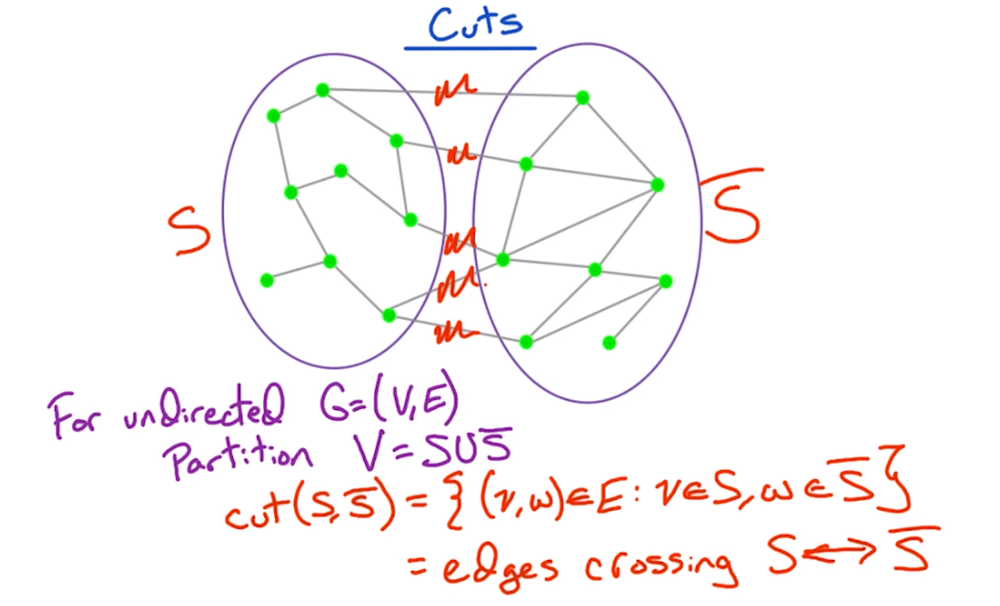
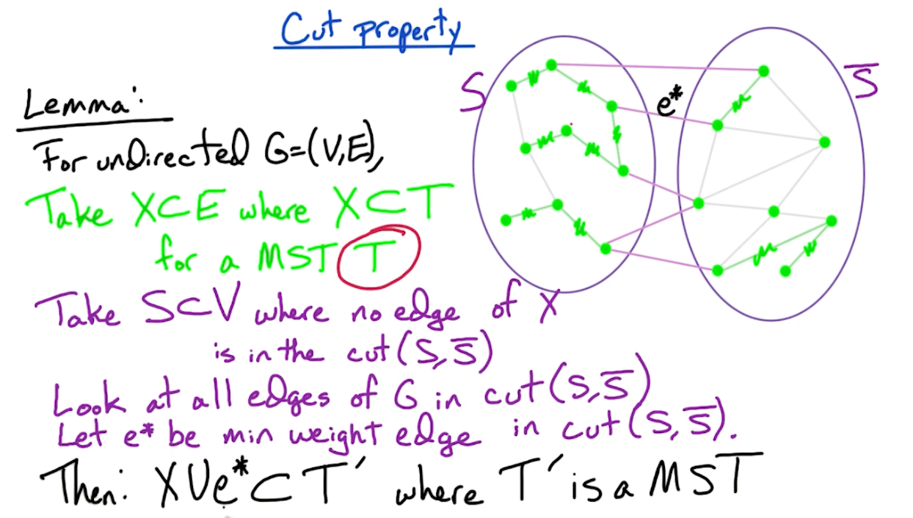
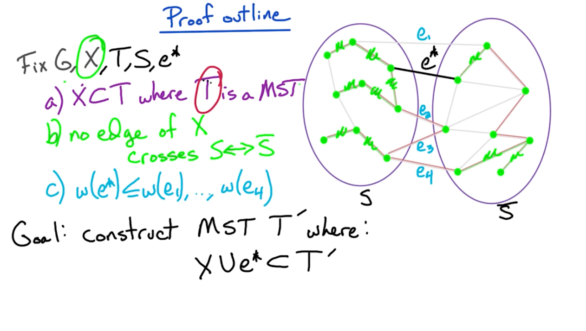
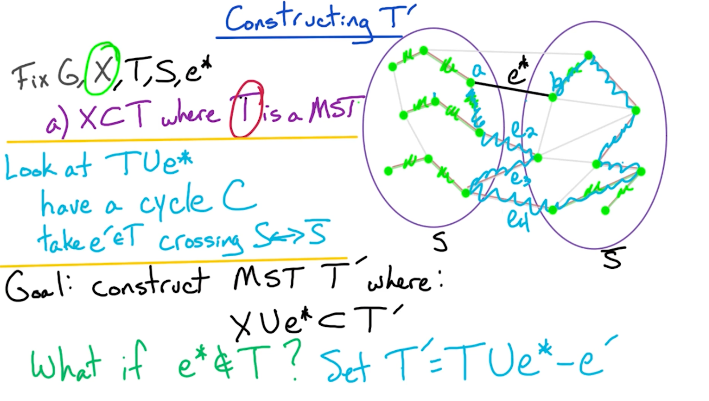
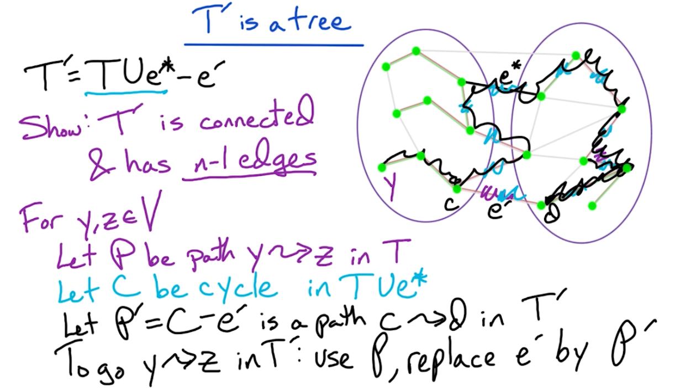
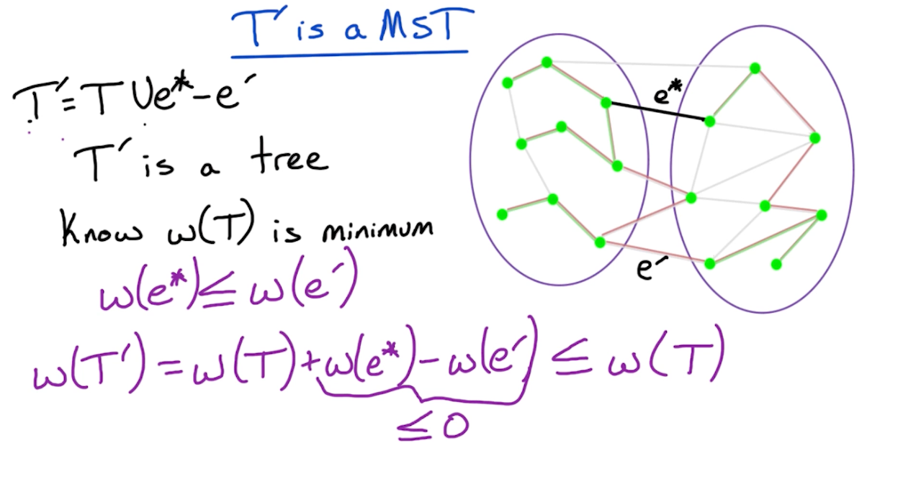

### Strongly Connected Components (GR1)

Here is a recap on DFS (for a undirected graph)

```
DFS(G):
  input G=(V,E) in adjacency list representation
  output: vertices labeled by connected components
  cc = 0
  for all v in V, visited(v) = False, prev(v) = NULL
  for all v in V:
    if not visited(v):
      cc++
      Explore(v)
```

Now lets define `Explore`:

```
Explore(z):
  ccnum(z) = cc
  visited(z) = True
  for all (z,w) in E:
    if not visited(w):
      Explore(w)
      prev(w) = z
```

The `ccnum` is the connected component number of $z$.

The overall running time is $O(n+m), n = \lvert V \lvert, m = \lvert M \lvert$. This is because you visit each node once, and, at each node, you try the edges, hence the total run time is total nodes and total edges in order to reach all nodes.


What if our graph is now directed? We can still use DFS, but add pre or postorder numbers and remove the counters.

Notice hte difference nad adding of the `clock` variable:

```
DFS(G):
  clock = 1
  for all v in V, visited(v) = False, prev(v) = NULL
  for all v in V:
    if not visited(v):
      cc++
      Explore(v)
```

Now lets define `Explore`:

```
Explore(z):
  pre(z) = clock;clock++
  visited(z) = True
  for all (z,w) in E:
    if not visited(w):
      Explore(w)
      prev(w) = z
  post(z) = clock; clock++
```

Here is an example:


digraph { 
    bgcolor="lightyellow"
    rankdir=LR;
    node [shape = circle];
    A -> D
    B -> A
    B -> E
    B -> C
    C -> F
    D -> E
    D -> G
    D -> H
    E -> A
    E -> G
    F -> B
    F -> H
    H -> G
}


Assuming we start at B, this is how our DFS looks like define as Node(pre,post):

Blue edge reflects that it is "used" during DFS but not used because the node has been visited.


digraph { 
    bgcolor="lightyellow"
    rankdir=LR;
    node [shape = circle];
    A -> D [color = black, xlabel = "A(2,11)"]
    B -> A [color = black, xlabel = "B(1,16)"]
    B -> E [color = blue]
    B -> C [color = black, xlabel ="C(12,15)"]
    C -> F [color = black, xlabel ="F(13,14)"]
    D -> E [color = black, xlabel = "D(3,10)"]
    D -> G [color = blue]
    D -> H [color = black, xlabel="H(8,9)"]
    E -> A [color = blue]
    E -> G [color = black, xlabel = "E(4,7)"]
    F -> B [color = blue]
    F -> H [color = blue]
    H -> G [color = blue]
    G [xlabel="G(5,6)"]
}


There are various type of edges, for a given edge $z \rightarrow w$:

* Treeedge such as $A\rightarrow B, B\rightarrow D$
  * where $post(z) > post(w)$, because of how you recurse back up during DFS
* Back edges $B \rightarrow A, F\rightarrow B$
  * $post(z) < post(w)$
  * Edges that goes back up.
* Forward edges $D \rightarrow G, B \rightarrow E$ 
  * Same as the tree edges
  * $post(z) > post(w)$
* Cross edges $F \rightarrow H, H \rightarrow G$
  * $post(z) > post(w)$

Notice that only for the back edges it is different in terms of the post order and behaves differently from the other edges.

**Cycles**

A graph $G$ has a cycle if and only if its DFS tree has a back edge. 

Proof:

Given $a \rightarrow b \rightarrow  c \rightarrow  ... \rightarrow  j \rightarrow  a$
which is a cycle. Suppose somewhere down the line we have this node $i$, then the sub tree (descendants) of $i$ must contain $i-1$ which contains a backedge to $i$.

For the other direction, it is obvious, Consider the back edge $B \rightarrow A$, then the cycle exists.

**Toplogical sorting**

Topologically sorting a DAG (directed acyclic graph that has no cycles): order vertices so that all edges go from lower $\rightarrow$ higher. Recall that since it has no cycles, it has no back edges. So the post order numbers must be $post(z) > post(w)$ for any edge $z \rightarrow w$. 

So, to do this, we can order vertices by decreasing post order number. Note that for this case, since we have $n$ vertices, we can create a array of size $2n$ and insert the nodes according to their post order number. So, our sorting of post order numbers runtime is $O(n)$.


digraph { 
    bgcolor="lightyellow"
    rankdir=LR;
    node [shape = circle];
    X -> Y
    Y -> U
    Y -> W
    Y -> Z
    Z -> W
}


What are the valid Topological order? : $XY(ZWU\lvert ZUW\lvert UZW)$

Note, for instance, XYUWZ is not a valid topological order! (Basically Z must come before W) - Because there's a directed edge from Z to W, Z must come before W in any valid topological ordering of this graph.

Analogy: Imagine you're assembling a toy. Piece Y is needed for both piece Z and piece W. But, piece Z is also needed for piece W.  You must attach Y to Z first, then Z to W.  Even though Y is needed for W, you don't attach it directly to W.

**DAG Structure**

* Source vertex: no incoming edges
  * Highest post order
* Sink vertex = no outgoing edges 
  * Lowest post order

By now, you are probably thinking, what does all this has to do with strongly connected component (SCC)? We will show that it is possible to do so with two DFS search.

**Connectivity in DAG**

Vertices $v$ & $w$ are **strongly connected** if there is a path $v \rightarrow  w$ and $w \rightarrow  v$

So, SCC defined as strongly connected component, is the maximal set of strongly connected vertices.

Example:


digraph { 
    bgcolor="lightyellow"
    rankdir=LR;
    node [shape = circle];
    A -> B
    B -> C
    B -> D
    B -> E
    C -> F
    E -> L
    E -> B
    F -> G
    F -> I
    G -> F
    G -> C
    H -> I
    H -> J
    I -> J
    J -> H
    J -> K
    K -> L
    L -> I
}


How many strongly connected components (SCC) does the graph has? `5`

* `A` is a SCC by itself since it can reach many other nodes but no other nodes can reach A
* `{H,I,J,K,L}` Can reach each other 
* `{C,F,G}`
* `{B,E}`
* `{D}`

We can simplify the above graph to the following meta graph:


digraph { 
    bgcolor="lightyellow"
    rankdir=LR;
    node [shape = circle];
    A -> B
    B -> C
    B -> D
    B -> H
    C -> H
    B [label = "B,E"]
    C [label = "C,F,G"]
    H [label = "H,I,J,K,L"]
}


Notice that this meta graph is a DAG and it is always the case. This should be obvious because if two strongly connected components are involved in a cycle, then they will be combined to form a bigger SCC.

So, **every directed graph is a DAG of it's strongly connected components**. You can take any graph, break it up into SCC and then topologically sort this SCC so that all edges go left to right.

**Motivation**

There are many ways we can do this, such as start with sinking vertices or source vertices. But, instead we can find the sink SCC, so, we find SCC S, output it, and remove it and repeat it. It turns out, Sinks SCC are easier to work with!

Recall we take any $v \in S$, where $S$   is the sick SCC. For example from the earlier graph we run `Explore(v)`, and we run explore from any of of the vertices in `{H,I,J,K,L}`, we will explore these vertices and not any other because it is a sink SCC. 

What if we find a vertex in the source component? You ended up exploring the whole graph, too bad! So, how can we be smart about this and find a vertex that lies in a sink component? Because if we can do so (somehow magically select a vertex in the sink SCC), then we are guaranteed to find all the nodes in the sink SCC.

**So, how can we find such a vertex?** 

Recall that in a DAG, the vertex with the **lowest postorder** number is a sink. 

In a directed directed G, can we use the same property? Does the property for a general graph, such that v with the lowest post order always lie in a sink SCC? HA of course its not true, do you think it will be that easy?



digraph { 
    bgcolor="lightyellow"
    rankdir=LR;
    node [shape = circle];
    A -> B [label = "A(1,6)"]
    B -> A [label = "B(2,3)"]
    A -> C [label = "C(4,5)"]
}


Notice that B has the lowest post order (3) but it belongs to the SCC `{A,B}`. 

What about the other way around? Does v with the highest post order always lie in a source SCC? Turns out, this is true! How can we make use of this? Simple, just reverse it! So the source SCC of the reverse graph is the sink SCC!

So, for directed $G=(V,E)$, look at $G^R = (V,E^R)$, so, the source SCC in $G$ = sink SCC in $G^R$. So, we just flip the graph, run DFS, take the highest post order which is the source SCC in $G^R$, that will be the sink in $G$.

#### Example of SCC

lets consider the same graph but now we reverse it, and we start at node C 


digraph { 
    bgcolor="lightyellow"
    rankdir=LR;
    node [shape = circle];
    A -> B [dir=back, xlabel = "A(7,8)"];
    B -> C [dir=back, xlabel = "B(6,11)"];
    B -> D [dir=back];
    D [xlabel = "D(13,14)"]
    B -> E [dir=back];
    C -> F [dir=back, xlabel = "C(1,12)"];
    E -> L [dir=back, xlabel = "E(9,10)"];
    E -> B [dir=back];
    F -> G [dir=back, xlabel = "F(3,4)"];
    F -> I [dir=back];
    G -> F [dir=back, xlabel = "G(2,5)"];
    G -> C [dir=back];
    H -> I [dir=back, xlabel = "H(18,19)"];
    H -> J [dir=back];
    I -> J [dir=back, xlabel = "I(20,21)"];
    J -> H [dir=back, xlabel = "J(17,22)"];
    J -> K [dir=back];
    K -> L [dir=back, xlabel = "K(16,23)"];
    L -> I [dir=back, xlabel = "L(15,24)"];
}


We start from c from the reverse graph $G^R$, find the SCC at `{C, G, F, B, A, E}`, then we proceed to `{D}` before going to `{L}`. you may notice that the choosing of which vertex might be important, suppose you pick at any vertex at `{H,I,J,K,L}`, it will be able to reach all vertices except `{D}` so that starting vertex will still have the highest post number.

Then, we sort it and get this following order: `L, K, J, I, H, D, C, B, E, A, G, F`. So now, we run DFS from the original graph starting at $G$. 

* At first step, we start at $L$, so, we will reach `{L,K,J,I,H}` label as 1 and strike them out.
* We then visit $D$, and reach `{D}`, label as 2 and strike them out
* We do the same for $C$, reach `{C,F,G}` label as 3 and strike them out
* Then do the same for `{B,E}` label as 4
* and finally `{A}` label as 5

So, the `L, K, J, I, H, D, C, B, E, A, G, F` is mapped to `{1,1,1,1,1,2,3,4,4,5,3,3}`. Another interesting observation of the new labels `{1,2,3,4,5}` , we have the following graph:


digraph { 
    bgcolor="lightyellow"
    rankdir=LR;
    node [shape = circle];
    5 -> 4
    4 -> 1
    4 -> 3
    3 -> 1
    4 -> 2
}


Notice that this metagraph, they go from $5 \rightarrow to 1$. So, the  `{1,1,1,1,1,2,3,4,4,5,3,3}` also outputs the topological order in reverse order! So we can take any graph, run two iterations of DFS, finds its SCC, and structure these SCC in topological order.

#### SCC algorithm

```
SCC(G):
  input: directed G=(V,E) in adjacency list
  1. Construct G^R
  2. Run DFS on G^R
  3. Order V by decreasing post order number
  4. Run undirected connected components alg on G based on the post order number
```

Proof of claim:

Given two SCC $S$ and $S'$, and there is an edge $v \in S \rightarrow w \in S'$,
the claim is the max post number in $S$ is always greater than max post number of $S'$.

The first case is if we start from $z \in S'$, then, we finish exploring in $S'$ before moving to $S$, so post numbers in $S$ will be bigger.

The second case is if we start $z \in S$, then $z$ will be the root node since we can travel to $S'$ from $z$. Since $z$ is the root node, then it must have the highest post order number. 

#### BFS & Dijkstras 

DFS : connectivity 

BFS: 

input: $G=(V,E)$ & $s \in V$

output: for all $v \in V$, dist(v) = min number of edges from $s$ to $v$ and $prev(v)$.

Dijkstra's:

input: $G=(V,E)$ & $s \in V$, $\ell(e) > 0 \forall e \in E$

output: $\forall v \in V$, dist(v) = length of shortest $s\rightarrow v$ path.

Note, Dijkstra uses the min-heap (known as priority queue) that takes $logn$ insertion run time. So, the overall runtime for Dijkstra is $O((n+m)logn)$.

### 2-Satisfiability (GR2)

Boolean formula:
* $n$ variables with $x_1, ..., x_n$
* $2n$ literals $x_1, \bar{x_1}, ..., x_n, \bar{x_n}$ where $\bar{x_i} = \lnot x_i$
* We use $\land$ for the and condition and $\lor$ for the or condition.

#### CNF 

Now, we define CNF (conjunctive normal form):

Clause: OR of several literals $(x_3 \lor \bar{x_t} \lor \bar{x_1} \lor x_2)$
F in CNF: AND of m clauses: $(x_2) \land (\bar{x_3} \lor x_4) \land (x_3 \lor \bar{x_t} \lor \bar{x_1} \lor x_2) \land (\bar{x_2} \lor \bar{x_1})$

Notice that for F to be true, that means for each condition we need at least one literal to be true.

#### SAT

Input: formula f in CNF with $n$ variables and $m$ clauses 

output: assignment (assign T or F to each variable) satisfying if one exists, NO if none exists.

Example: $ f = (\bar{x_1} \lor \bar{x_2} \lor x_3) \land (x_3 \lor x_3) \land (\bar{x_3} \lor \bar{x_1}) \land (\bar{x_3})$

And an example that will work is $x_1 = F, x_2 = T, x_3 = F$.

#### K-SAT 

For K sat, the input is formula f in CNF with $n$ variables and $m$ clauses each of size $\leq k$. So the above function $f$ is an example. In general:

* SAT is NP-complete
* K-SAT is NP complete $\forall k \geq 3$
* Poly-time algorithm using SCC for 2-SAT

For example consider the following input f for 2-SAT:

$$
f = (x_3 \lor \bar{x_2}) \land (\bar{x_1}) \land (x_1 \lor x_4) \land (\bar{x_4} \lor x_2) \land (\bar{x_3} \lor x_4)
$$

We want to simplify unit-clause which is a clause with 1 literal such as $(\bar{x_1})$. This is because to satisfy $\bar{x_1}$ there is only one way to set $x_1 = F$.


* Take a unit clause say literal $a_i$ 
* Satisfy it (set $a_i = T$)
* Remove clauses containing $a_i$ and drop $\bar{a_i}$ 
* let $f'$ be the resulting formula 

For example:

$$
\begin{aligned}
f &= (x_3 \lor \bar{x_2}) \land (\cancel{\bar{x_1}}) \land (\cancel{x_1} \lor x_4) \land (\bar{x_4} \lor x_2) \land (\bar{x_3} \lor x_4) \\
&= (x_3 \lor \bar{x_2}) \land (x_4) \land (\bar{x_4} \lor x_2) \land (\bar{x_3} \lor x_4)
\end{aligned}
$$

So, the original $f$ is satisfiable if $f'$ is. Notice that there is a unit clause $(x_4)$ and we can remove it. Eventually I am either going to left with an empty set, or a formula where all clauses are of size 2.


#### SAT-graph

Take $f$ with all clauses of size $=2$, $n$ variables and $m$ clauses, we create a directed graph:

* $2n$ vertices corresponding to  $x_1, \bar{x_1}, ..., x_n, \bar{x_n}$
* $2m$ edges corresponding to 2 "implications" per clause

Consider the following example: $f = (\bar{x_1} \lor \bar{x_2}) \land (x_2 \lor x_3) \land (\bar{x_3} \lor \bar{x_1})$

* Notice that if we set $x_1 = T \rightarrow x_2 = F$, and likewise $x_2 = T \rightarrow x_1 = F$



digraph { 
    bgcolor="lightyellow"
    rankdir=LR;
    node [shape = circle, fixedsize = True];
    x1 -> _x2
    x2 -> _x1
    _x2 -> x3
    _x3 -> x2
    x1 -> _x3
    x3 -> _x1
}


In general given $(\alpha \lor \beta)$, then you need $\bar{\alpha} \rightarrow \beta$ and $\bar{\beta} \rightarrow \alpha$

If we observe the graph, we notice that there is a path from $x_1 \rightarrow \bar{x_1}$, which is a contradiction. If $x_1 = F$, then it might be ok? In general, if there are paths such that $x_1 \rightarrow \bar{x_1}$ and $\bar{x_1} \rightarrow x_1$, then $f$ is not satisfiable because $\bar{x_1},x_1$ is in the same SCC.

In general:

* If for some $i$, $x_i, \bar{x_1}$ are in the same SCC, then $f$ is not satisfiable. 
* If for some $i$, $x_i, \bar{x_1}$ are in different SCC, then $f$ is satisfiable. 

#### 2-SAT Algo

* Take source scc $S'$ and set $S' = F$
* Take sink scc $\bar{S'}$ and set $\bar{S'} = T$
* When we done this, then we can remove all these literals from the graph!

This works because of a key fact: if $\forall i$, $x_i \bar{x_i}$ are in different SCC's, then $S$ is a sink SCC if and only if $\bar{S}$ is a source SCC.

```
2SAT(F):
  1. Construct graph G for f
  2. Take a sink SCC S 
    - Set S = T ( and bar(S) = F)
    - remove S, bar(s)
    - repeat until empty
```

Proof:

The first claim is we show that path $\alpha \to \beta \iff \bar{\beta} \to \bar{\alpha}$

Take path $\alpha \to \beta$, say $\gamma_0 \to \gamma_1 \to ... \to \gamma_l$ where $\gamma_0 = \alpha, \gamma_l = \beta$

Recall that $(\bar{\gamma_1} \lor \gamma_2)$ is represented in the graph as $(\gamma_1 \to \gamma_2)$, since if $\gamma_1 = T$ then $\gamma_2$ must also be $T$. $(\bar{\gamma_1} \lor \gamma_2)$ is also represented in the graph as $(\bar{\gamma_2} \to \bar{\gamma_1})$. This shows that $\bar{\gamma_0} \gets \bar{\gamma_1} \gets ... \gets \bar{\gamma_l}$ which implies $\bar{\beta} \to \bar{\alpha}$ since $\gamma_0 = \alpha, \gamma_l = \beta$.

Using this claim, we can show 2 more things:

If $\alpha,\beta \in S$, then $\bar{\alpha}, \bar{\beta} \in \bar{S}$. This is true because if there are paths in $\alpha \leftrightarrow \beta$ since they are in the same SCC, this means that there are paths $\bar{\beta} \leftrightarrow \bar{\alpha}$ using the above claim and they belong to SCC.

It remains to show that $S$ must be a sink SCC and $\bar{S}$ is a source SCC.

We take a sink SCC S, for $\alpha \in S$, that means there are no edges from $\alpha \to \beta$ which implies no edges such that $\bar{\beta} \to \bar{\alpha}$. In other words, no outgoing edges from $\alpha$ means there is no incoming edges to $\bar{\alpha}$. This shows that $\bar{S}$ is a source SCC!

### MST (GR3)
 
For the minimum spanning tree, we are going to go through the **krusal** algorithm but mainly focus on the correctness of it. Note that krusal algorithm is a greedy algorithm which makes use of the **cut property**. This property is also useful in proving prim's algorithm. 

#### MST algorithm

Given: undirected $G=(V,E)$ with weights $w(e)$ for $e\in E$

Goal: find minimum size, connected subgraph of minimum weight. This connected subgraph is known as the spanning tree (refer this as T). So we want $T \subset E, w(t) = \sum_{e\in T} w(e)$

```
Kruskals(G):
  input: undirected G = (V,E) with weights w(e)
  1. Sort E by increasing weight
  2. Set X = {null}
  3. For e=(v,w) in E (in increasing order)
    if X U e does not have a cycle:
      X = X U e (U here denotes union)
  4. Return X
```

Runtime analysis:

1. Step one takes $O(mlogn)$ time where $m = \lvert E \lvert , v = \lvert V \lvert$
   1. This was a little confusing to me and why the lecture said $O(mlogm) = O(mlogn)$. It turns out that the max of $m$ is $n^2$ for a fully connected graph,so $O(mlogm) = O(mlogn^2) = O(2mlogn) = O(mlogn)$.
2. For this we can make use of [union-find data structure](https://en.wikipedia.org/wiki/Disjoint-set_data_structure).
   1. Let $c(v)$ be the component containing $v$ in $(V,X)$
   2. Let $c(w)$ be the component containing $w$ in $(V,X)$
   3. We check if $c(v) \neq c(w)$ (by them having different representative), then add $e$ to $X$.
   4. We then apply union to both of them.
3. The [union-find data structure](https://www.geeksforgeeks.org/union-by-rank-and-path-compression-in-union-find-algorithm/) takes $O(logn)$ time 
   1. Since we are doing it for all edges, then $O(mlogn)$.

**Cut property**

To prove the correctness, we first need to define the cut property:

{: width='400' }

In other words, the cut of a graph is a set of edges which partition the vertices into two sets. In later part, we will look at problems such as minimum/maximum cut to partition the graphs into two components.

{: width='400' }

The core of the proof is:
* Use induction, and assume that $X \subset E$ where $X \subset T$ for a MST $T$. The claim is when we add an edge from $S, \bar{S}$, we form another MST $T'$.

**Proof outline**

{: width='400' }

So, we need to consider two cases, if $e^* \in T$ or $e^* \notin T$.

* If $e^* \in T$, our job is done, as there is nothing to show.
* If $e^* \notin T$ (such as the diagram above), then we modify $T$ in order ot add edge $e^*$ and construct a new MST $T'$ 

{: width='400' }

Next, we show that $T'$ is still a tree:

{: width='400' }


* Remember if a tree with size $n$ has $n-1$ edges then it must be connected.

{: width='400'}

* Actually, it turns out that $w(T') = w(T)$, otherwise it would contradict the fact that $T$ is a MST. 

#### Prim's algorithm

MST algorithm is akin tio Dijkstra's algorithm, and use the cut property to prove correctness of Prim's algorithm.

The prim's algorithm selects the root vertex in the beginning and then traverses from vertex to vertex adjacently. On the other hand, Krushal's algorithm helps in generating the minimum spanning tree, initiating from the smallest weighted edge.


<!--  -->