### Ford-Fulkerson (MF1)

**Problem formulation**:

* Input: Directed graph $G=(V,E)$ designated $s,t \in V$ for each $e \in E$, capacity $c_e >0$
* Goal: Maximize flow $s \rightarrow t$, $f_e$ = flows along $e$ subjected to the following:
  * Capacity constraints: * $\forall e \in E, 0\leq f_e \leq c_e$
  * Conversation of flow: $\forall v \in V - \{S \cup T\}$, flow-in to $v$ = flow-out of $v$
  * $\sum_{\overrightarrow{wv} \in E} f_{wv} = \sum_{\overleftarrow{vz} \in E} f_{vz}$

Other details:

* For the max flow problems, the cycles are ok! 
* Anti parallel edges:

  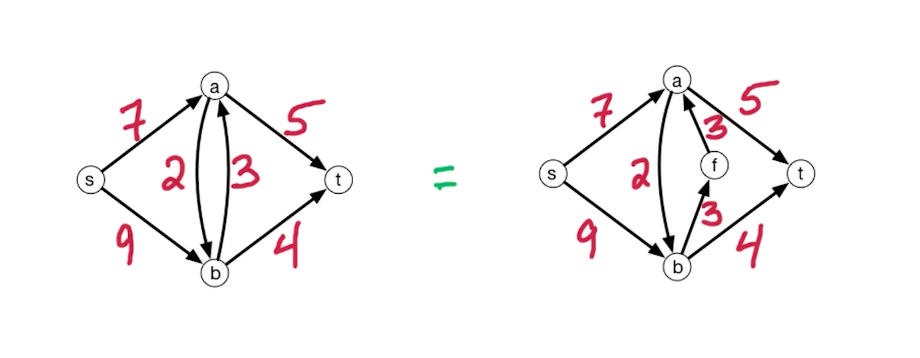{: width='400'}
* Notice the edge between $a\leftrightarrow b$, you want to break this anti parallel edges (Because of the residual network that we will see later)

**Residual Network**

Consider the following network, we initially run a path $s \rightarrow a \rightarrow b \rightarrow t$

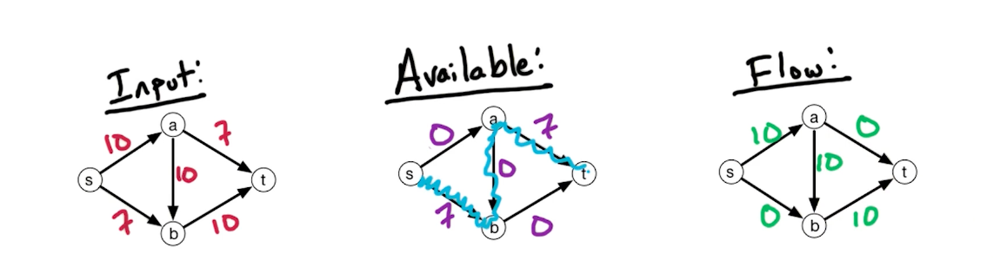{: width='400'}

But, it turns out that there is still capacity of $7$ left, what can we do? We build a backward edge with weights from the previous path, as shown with the red arrow below.

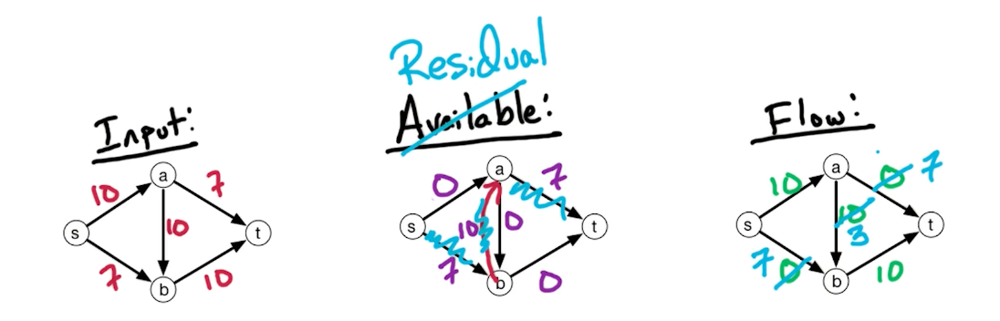{: width='400'}

Now, we can pass on a flow of $7$ and the max flow is $17$.

In general, the residual network $G^f = (V,E^f)$, for flow network $G=(V,E)$ with $c_e : e \in E$, and flow $f_e : e \in E$, 
* if $\overrightarrow{vw} \in E\ \&\ f_{vw} < c_{vw}$, then add $\overrightarrow{vw}$ to $G^f$ with capacity $c_{vw} - f_{vw}$ (remaining available)
* if $\overrightarrow{vw} \in E\ \&\ f_{vw} > 0$, then add $\overrightarrow{wv}$ to $G^f$ with capacity $f_{vw}$

In other words, if you flow is below capacity provided, add another edge in parallel with edge weight as the flow. If your flow is greater than 0 (and all capacity is used), add a backward edge with the capacity flow. Also, because we remove the parallel edges, we are allowed to add the forward edge and backward edge without inequalities. 

#### Ford-Fulkerson Algorithm

* Set $f_e = 0$ for all $ e \in E$
* Build the residual network $G^f$ for the current flow $f$
  * Initially it will all be zero
* Check for a path $s\rightarrow t$ in $G^f$ using DFS/BFS
  * If there is no such path, then output $f$.
  * If there is a path, denote it a $\mathcal{P}$
* Given $\mathcal{P}$, let $c(\mathcal{P})$ denote the minimum capacity along $\mathcal{P}$ in $G^f$
* Augment $f$ by $c(\mathcal{P})$ units along $\mathcal{P}$
  * For every forward edge, we increase the flow along that edge by this amount
  * For the backward edge, we decrease the flow in the other direction
* Repeat from the build residual network step (until you return output $f$)

The proof is based on max-flow = min-cut theorem, which will be covered in MF2.

For Time complexity, we assume all capacities are integers (Edmonds-Karp algorithm eliminates this assumptions). This assumption implies that whenever we augment hte flow, we augment by an integer amount. 
* This implies that the flow increases by $\geq 1$ unit per round 
* Let $C$ denote the size of max flow, then we have at most $C$ rounds.
* Since the graph is connected, $\mathcal{P}$ is $n-1$ edges, so to update the residual network takes $O(n)$
* To check for the path $\mathcal{P}$, either with BFS or DFS, takes $O(n+m)$, since the graph is connected, it reduces to $O(m)$. 
* Augment $f$ by $c(\mathcal{P})$ also takes $O(n)$
* So overall the complexity of each round is $O(m)$, over $C$ rounds, hence the total runtime is $O(Cm)$.

#### Other Algorithms

For Ford-Fulkerson
* the running time depends on the integer $C$, if you recall from knapsack, the running time is a pseudo-polynomial.
* We use BFS/DFS to find any path from $s\rightarrow t$

For Edmonds-karp
* Algorithm takes $O(m^2 n)$ time
* We take the shortest path from $s \rightarrow t$, in this case shortest means the number of edges and do not care about the weights on the edges. To find such a path, we run BFS. The number of rounds in this case is going to be $O(mn)$, and each round takes $O(m)$ time, the total is $O(m^2n)$.
  * So the runtime is independent of the max flow and no longer require it to be integer values 

Orlin
* $O(mn)$, generally the best for general graphs for the exact solution of the max-flow problem.

### Max-Flow Min-Cut (MF2)

Recall that the Ford-Fulkerson algorithm stop when there is no more augmenting path in residual $G^{f*}$. (star here means the max flow, i.e optimal solution)

Lemma: For a flow $f^*$ if there is no augmenting path in $G^{f*}$ then $f^*$ is a max-flow.

**Min-cut Problem**

Recall that a cut is a partition of vertices $V$ into two sets, $V = L \cup R$. Define st-cut to be a cut where $s\in L, t\in R$

Notice that a cut does not need to be connected, F is not connected to A and B in this subset. We are interested in the capacity of this st-cut. 

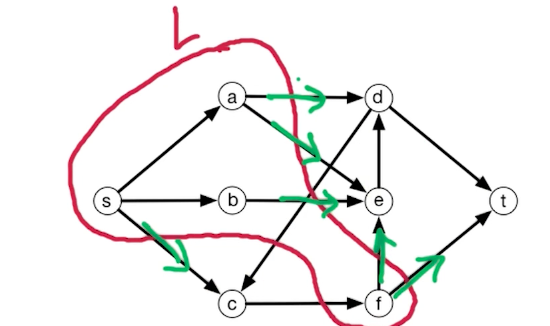{: width='400'}

Define capacity from $L\rightarrow R$

$$
Capacity(L,R) = \sum_{\overrightarrow{vw} \in E: v \in L, w \in R} c_{vw}
$$

Notice edges such as $C \rightarrow F$ do not count.

So the problem formulation of the min st-cut problem is as follows:

* Input: flow network
* Output: st-cut (L,R) with minimum capacity.

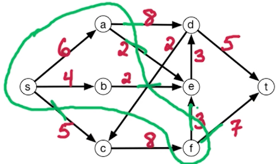{: width='400'}

For example consider this cut, the capacity is $8+2+2+3+7+5 = 27$ 

The cut with minimum capacity is as follows

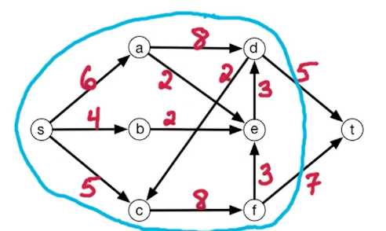{: width='400'}

The min st-cut is 12, which i is equal to the max-flow 12. $L$ contains everybody but $t$. So the theorem we want to prove is the size of hte max flow equals to the size of the min st-cut.

#### Theorem

Note, in the max-flow problem, it is always from s to t, but on the other side it is called the st-cut problem because we want the cut to separate s and t. There could be a minimum cut such that s,t belongs to the same set. 

To proof this, we show that max-flow $\leq$ min st-cut, and vice versa. This will show that max-flow == st-cut.

#### LHS

To show max-flow $\leq$ min st-cut, show that for any flow $f$ and any st-cut $(L,R)$:

$$
size(f) \leq capacity (L,R)
$$

Note - this is for any flow, which includes the max over f, and the minimum over the capacity. 

Claim: $size(f) = f^{out}(L) - f^{in}(L)$

$$
\begin{aligned}
& f^{out}(L) - f^{in}(L) \\
 &= \sum_{\overrightarrow{vw} \in E: v \in L, w \in R} f_{vw} - \sum_{\overrightarrow{wv} \in E: v \in L, w \in R} f_{wv} \\
&= \sum_{\overrightarrow{vw} \in E: v \in L, w \in R} f_{vw} - \sum_{\overrightarrow{wv} \in E: v \in L, w \in R} f_{wv} + \sum_{\overrightarrow{vw} \in E: v \in L, w \in L} f_{vw} - \sum_{\overrightarrow{wv} \in E: v \in L, w \in L} f_{wv} 
\end{aligned}
$$

Notice that the first term and the third term, when combined, you get all edges out of v, and likewise all edges into c, and we filter out the vertex $s$. Notice that the source vertex has no input.

$$
\begin{aligned}
& f^{out}(L) - f^{in}(L) \\
& = \sum_{v\in L} f^{out}(v) - \sum_{v\in L} f^{in}(v) \\
& = \sum_{v\in L-S} (\underbrace{f^{out}(v)-f^{in}(v)}_{0}) + f^{out}(s) + \underbrace{f^{in}(s)}_{0}\\
&= size(f)
\end{aligned}
$$

So, the total flow out of $f$, is the size of $f$!. Coming back, we have:

$$
size(f) = f^{out}(L) - f^{in}(L) \leq f^{out}(L) \leq capacity(L,R)
$$

The last part is true, because the total flow out of L, must be the capacity out of L to R. 

#### RHS

Now, we prove the reverse inequality:

$$
max_f size(f) \geq  min_{(L,R)} capacity(L,R)
$$

Take flow $f^\ast$ from Ford-Fulkerson algorithm, and $f^\ast$ has no st-path in residual $G^{f\ast}$. We will construct $(L,R)$ where:

$$
size(f^*) = cap(L,R)
$$

Similarly, this is for any size and any capacity, we can set the left to be the max, and right to be the min:

$$
max_f size(f) \geq size(f^*) = cap(L,R) \geq min_{(L,R)} capacity(L,R)
$$

Take flow $f^\ast$ with no st-path in residual $G^{f\ast}$. Let $L$ be the vertices reachable from $s$ in $G^{f\ast}$. We know that $t \notin L$ because there is no such path that exists. So, let $R = V-L$. This also implies that $t \in R$.

For $\overrightarrow{vw} \in E, v\in L, w \in R$, this edge does not appear in the residual network (Because there is no path from L to R). This means that the edge must be fully capacitated $f_{vw}^* = c_{vw}$, and therefore the forward edge does not appear in the residual network so the flow along this edge equals to its capacity. Now since every edge from L to R is fully capacitated, the total flow out of $L$ must be equal to capacity$(L,R)$. This shows that $f^{*out}(L) = capacity(L,R)$.

Consider the opposite, consider edges $\overrightarrow{zy}, z \in R, y \in L$, which is edges that are going from R into L. The flow $f^\ast_{zy} = 0$ because the reverse edge does not appear in the residual network. Because if there is an edge $\overrightarrow{zy}$, then it would be reachable from $L$, then it would be included in the set $L$. Since the back edge does not appear in the residual network, then the forward edge has to have flow zero. This shows that $f^{\ast in}(L) = 0$.

Combining this two, shows:

$$
size(f^*) = f^{*out}(L) - f^{*in}(L) = capacity(L,R)
$$

We have shown both sides of the inequality, which concludes that max-flow == min st-cut. We have also shown that for any flow that has no augmenting path in the residual network, we can construct a st-cut where the size of the flow equals to the capacity of the s-t cut $size(f^*) = cap(L,R)$. The only way to have equality here is if both of these are optimal, which is max flow and min st-cut to have the minimum capacity. 

Note, this theorem also gives us another way of finding the min cut. We basically find the max flow, and set L to be all vertices reachable from s in the residual $G^{f*}$. 

### Edmonds-Karp (MF4)

In Ford-Fulkerson, find augmenting paths using DFS or BFS with overall run time of $O(mC)$.

In Edmonds-Karp algorithm, it finds augmenting paths using BFS, and is able to make stronger guarantees on running time, in $O(m^2n)$ and only require capacities to be positive values (no constraint on edge capacity being integer values)

The algorithm is exactly the same as Ford-Fulkerson, but we need to use BFS

* Set $f_e = 0$ for all $ e \in E$
* Build the residual network $G^f$ for the current flow $f$
* Check for a path $s\rightarrow t$ in $G^f$ using $\cancel{DFS}$/BFS
* Given $\mathcal{P}$, let $c(\mathcal{P})$ denote the minimum capacity along $\mathcal{P}$ in $G^f$
* Augment $f$ by $c(\mathcal{P})$ units along $\mathcal{P}$
* Repeat from the build residual network step (until you return output $f$)

Notice that the residual network has to change by at least one edge in every round. In particular, at least one edge reaches full capacity. We augment along P until we reach the full capacity of at least one edge on that path. That edge which reaches its full capacity in the residual graph, will be removed from the residual graph in the next stage. Now that edge might be a forward edge oer a backward edge, but regardless it will be removed from the residual graph in the next stage. There may be additional edges which are removed and there might be other edges which are added back into the residual network - we need some understanding of which edges are added in or removed from the residual network.

The key property remains - at least one edge is removed in every stage.

**Proof**

To prove that the running time is $O(m^2n)$, we show that the number of rounds is at most $mn$.  

* BFS takes linear time, so assuming the number of edges is at least the number of edges, so that is order $O(m)$ time per round. Combine that with $mn$ gives $O(m^2n)$

In every round, residual graph changes, at least one edge is deleted from the residual graph in every round. This edge corresponds to the one with minimum capacity along the augmenting path. Now edges may get added back in to the residual path. In particular this edge might be deleted in this round and in later rounds might be added back in. 

The key lemma: for every edge $e$, we can bound the number of times that the edge is deleted in the residual graph and then reinsert it back later. In particular, $e$ is deleted and reinserted later at most $\frac{n}{2}$ times. Since there are $m$ edges in the graph and this holds for every edge of the graph, every edge is deleted at most $\frac{n}{2}$ times, and at least one edge is deleted in every round, therefore there is at most $\frac{n}{2} \times m$ total rounds. This give sour desired bound on the number of rounds of the algorithm.

**Properties of BFS**

BFS:

* Input: directed $G=(V,E)$, no edge weights, $s \in V$
* Output: for all $v \in V$, dist($v$) = min number of edges $s \rightarrow v$

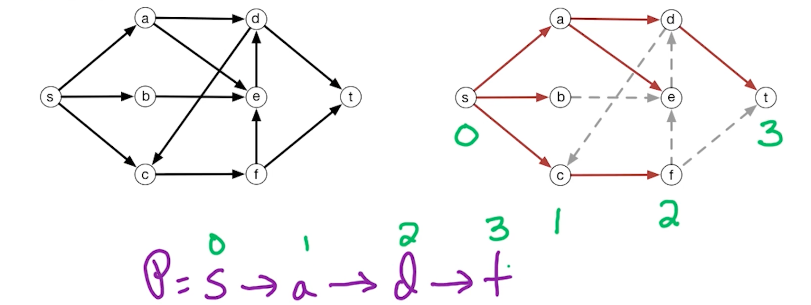{: width='400'}

The key insight here is for BFS, there is a level($v$), so the path that BFS finds from $s \rightarrow t$ is going to be a path where the level goes up by plus one at every edge, and this is the key property that we need from BFS.

So, the question is, how does level($z$) change as $G^f$ changes?
* edges can get deleted! - For example in the above graph what if $\overrightarrow{AD}$ gets deleted? Does that mean the level of $d$ becomes 3?
  * Need to show that when edges gets added or deleted, the level of the vertex is never going to decrease. 

The claim is, for every $z \in V$, level($z$) does not decrease.
* It can stay the same, or can increase in some levels, but it can never go down.

To prove this, we need to understand which edges are added into the residual network, and which edges are removed from the residual network.

How does $G^f$ change in a round? Consider each of the four cases for $\overrightarrow{vw} \in E$

* Add $\overrightarrow{vw}$ if flow was full and then reduced 
  * So $\overrightarrow{wv} \in \mathcal{P}$
* Remove $\overrightarrow{vw}$ if flow is now full
  * So $\overrightarrow{vw} \in \mathcal{P}$
* Add $\overrightarrow{wv}$ if flow was empty 
  * So $\overrightarrow{vw} \in \mathcal{P}$ 
* Remove $\overrightarrow{wv}$ if flow was positive and now empty 
  * So $\overrightarrow{wv} \in \mathcal{P}$

So the conclusion is:

* If add $\overrightarrow{yz}$ to $G^f$ then $\overrightarrow{zy} \in \mathcal{P}$
  * This is the opposite augmenting path
* If remove $\overrightarrow{yz}$ then $\overrightarrow{yz} \in \mathcal{P}$ 
  * Edge itself is on the augmenting path

To add an edge to the residual network, we have to increase the spare capacity. That means we have to decrease the flow along this edge. To decrease the flow, then the reverse direction must be augmented.

Similarly, remove an edge from the residual graph, that means we remove the leftover capacity, in order to remove the left over capacity, that means we have to increase the flow along this edge, so the edge must be on the augmenting path $\mathcal{P}$.

#### Proof of Edmonds-Karp

The claim is for every $z \in V$, level($z$) does not decrease. Now, this can only happen when we add an edge which results in a shorter path. So, we ignore the case about adding edges.

Suppose level($z$) = $i$, and we add $\overrightarrow{yz}$ to $G^f$, so $\overrightarrow{zy} \in \mathcal{P}$. Any Path in Edmonds-Karp must be a BFS path, which says that the level of the vertices increase by 1 along every edge. Therefore, level($y$) = level($z$) + $1$. But notice that we are referring to the edge $\overrightarrow{yz}$, so this edge does not decrease the level of z! 

What remains is the number of rounds - we need to show sometimes the level of the vertex strictly increases and this will give us a bound on the number of rounds of the algorithm.

Suppose level($v$) = $i$, and:

* If we delete $\overrightarrow{vw}$ from $G^f$ so $\overrightarrow{vw} \in \mathcal{P}$ 
  * level($w$) = level($v$) + 1 $\geq i+1$
* If we later add $\overrightarrow{vw}$ into $G^f$ so $\overrightarrow{wv} \in \mathcal{P}$ 
  * level($v$) = level($w$) + 1 $\geq i+2$

In conclusion, if we delete $\overrightarrow{vw}$ from $G^f$ and then later add $\overrightarrow{vw}$, then level($v$) increases by at least 2. The minimum level is 0, and the max level is $n$. Therefore the maximum times we can delete and add this edge back into the residual network is $\frac{n}{2}$ times, and since there are $m$ edges graphs, shows that there are at least $nm$ rounds.

### Max-Flow Generalization (MF4)

#### Max-flow with demands 

* input: flow network: directed $G=(V,E)$ with $s,t \in V$ capacities $c(e) > 0, e \in E$ and demands $d(e) \geq 0, e \in E$
* Output: flow is a flow $f$ where for $e \in E$, $d(e) \leq f(e) \leq c(e)$

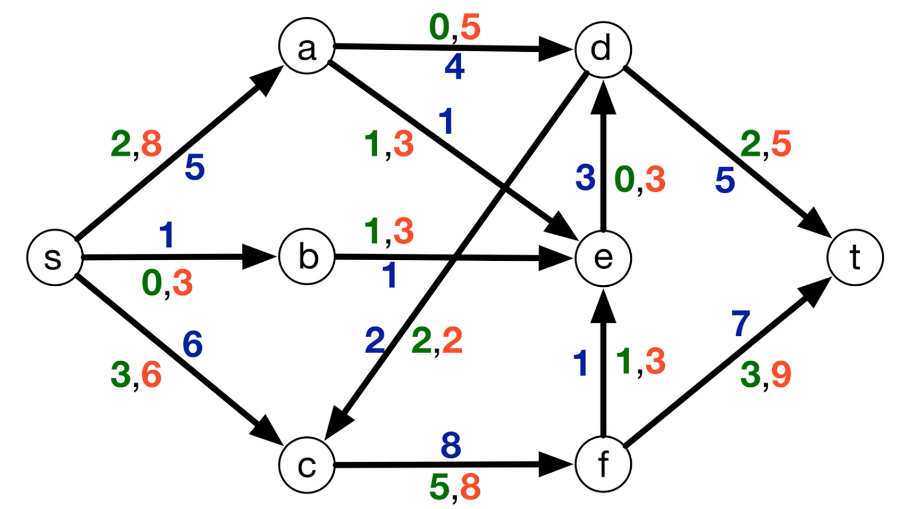{: width='400'}

* Red represents capacity 
* Green represents demands
* Blue is the actual flow

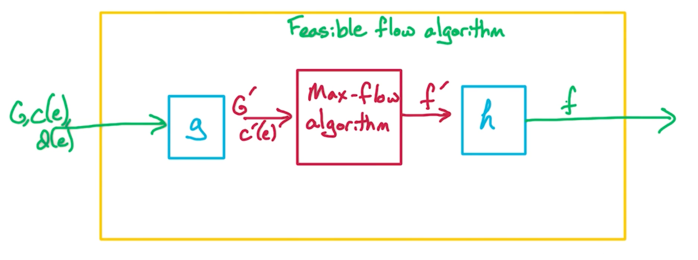{: width='400'}

The goal is to find a reduction $g,f$ so we can use the max-flow algorithm. So we want to find mappings $g$ and $h$.

The intuition is we want to capture is that there is a non-negative flow along an edge, if and only if we can construct a flow in the original network. 

$$
\begin{aligned}
f(e) \geq d(e) &\iff f'(e) \geq 0, \\
c(e) \geq f(e) &\iff c'(e) \geq f'(e)
\end{aligned}
$$

* so this flow $f'$ is going to be a shift of $f$ by $d$ units 
* And also shift the capacity as well by $d$ units 
  * $c'(e) = c(e) - d(e)$
   
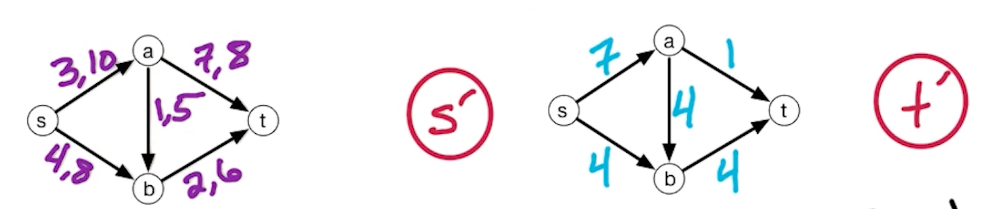{: width='400'}

Consider the right graph, where the flow into a and flow out of a is zero, which is a valid flow. But if we look at the left side, that means a has an inflow of 3 units, but outflow of 8 units, which is not a valid flow since in == out. So we need to offset / fix this somehow, so a valid flow on rhs will be a valid flow on lhs.

To do this, we define $s', t'$ where $s' \rightarrow v, v \rightarrow t', v \in V$. 

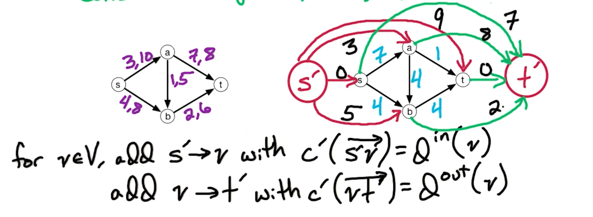{: width='400'}

There is still one more thing, notice that there is no flow in to $s$, so we add an edge from  $s \leftarrow t$ and set it to $\infty$.

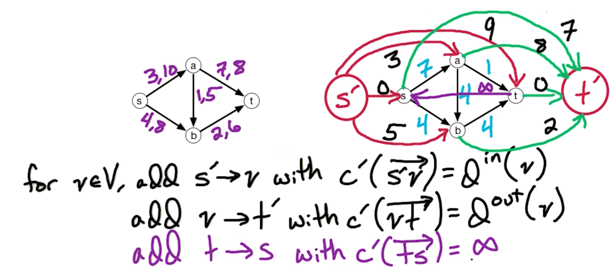{: width='400'}

#### Lemma - Saturating flows

And this is the final graph $G'$ with the following:

$$
\begin{aligned}
D &= \sum_{e\in E} d(e) = \underbrace{\sum_{v \in V} d^{in}(v)}_{C^{
  'out}(S')} = \underbrace{\sum_{v\in V} d^{out}(v)}_{C^{'in}(t')} \\
\end{aligned}
$$

For flow $f'$ in $G'$, size($f'$) $\leq D$, $f'$ is **saturating** if size($f'$) = $D$. This means that the flow $f'$ is of maximum size. 

Lemma: $G$ has a feasible flow if and only if $G'$ has a saturating flow

If this lemma is true, then we take our feasible flow problem, construct $G'$, run max-flow on $G'$ and check if the size of the max-flow is equal to $D$ and therefore it is saturating or not. If there exists a saturating flow, implies that there is a feasible flow.

#### LHS (Saturating flows)

Lets show that if it is a saturating flow, then it is a feasible flow.

Take saturating flow $f'$ in $G'$, construct feasible flow $f$ in $G$, which is shifted by the demand $D$

* Let $f(e) = f'(e) + d(e)$

We need to check:

* $f$ is valid, flow-in = flow-out, and each edge is within capacity. 
* $f$ must also be feasible - satisfies all the demands constraints 

To check that the demand and capacity constraints are met, and flows are non negative $f'(e) \geq 0$:

$$
f'(e) \geq 0 \implies f(e) \geq d(e)
$$

Then, for $G'$, each $c'(e)$:

$$
c'(e) \geq f'(e) \implies f(e) \leq c'(e) + d(e) = c(e) \\
\therefore f(e) \leq c(e)
$$

It remains to check that the flow is valid: $f^{in}(v) = f^{out}(v), v \in V-s-t$. Consider the graph $G'$ which is constructed with maxflow algorithm, so $f^{'in}(v) = f^{'out}(v)$.  

$$
\begin{aligned}
f^{'in}(v) &= f'(\overrightarrow{s'v}) + \sum_{u\in v}\underbrace{f'(\overrightarrow{uv})}_{f'= f -d} & \text{Total flow into v} \\
&=d^{in}(v) + \sum_{u\in v} (f(\overrightarrow{uv}) - d(\overrightarrow{uv})) & \text{s'v is total demand in} \\
&=\cancel{d^{in}(v)} + \sum_{u\in v} (f(\overrightarrow{uv}) \cancel{- d(\overrightarrow{uv})}) \\
&= f^{in}(v)
\end{aligned} 
$$

Similarly, we can show that $f^{'out} = f^{out}$. Therefore since:

$$
\begin{aligned}
f^{'in}(v) &= f^{'out}(v) \\
f^{'in}(v) &= f^{in}(v) \\
f^{'out}(v) &= f^{out}(v)\\
\therefore f^{in}(v) &= f^{out}(v)
\end{aligned}
$$

#### RHS (Saturating flows)

Take a feasible flow $f$, and construct saturating $f'$ in $G'$, and we construct the feasible flow as follows:

* for $e \in E$, let $f'(e) =f(e) - d(e)$
* for $v \in V$:
  * $f'(\overrightarrow{s'v}) = d^{in}(v)$
  * $f'(\overrightarrow{vt'}) = d^{out}(v)$
  * $f'(\overrightarrow{ts}) = size(f)$

We need to show that this is a valid flow. Because we assumed that $f$ is feasible, this implies (constraints are satisfied):

$$
\begin{aligned}
f(e) \geq d(e) &\implies f'(e) \geq 0 \\
f(e) \leq c(e) &\implies f'(e) \leq c(e) - d(e) = c'(e)
\end{aligned}
$$

Similarly, it remains to check $f^{'in}(v) = f^{'out}(v)$, this is the same as before, given that we know $f^{in}(v) = f^{out}(v)$:

$$
\begin{aligned}
f^{'in}(v) &= d^{in}(v) + \sum_{u\in v} (f(\overrightarrow{uv}) - d(\overrightarrow{uv})) \\
&= f^{in}(v)\\
f^{'out}(v) &= f^{out}(v)\\
\therefore f^{'in}(v) &= f^{'out}(v)
\end{aligned}
$$

#### Algorithm for feasible flow

Find a feasible flow $f$ for $G$, if one exists by checking whether the size of the max-flow equals $D$ and if it is a saturating flow. If it is, then there must be a feasible flow. Then we transform $f' \rightarrow f$.

Then, we can augment in residual graph of $G^f$ as follows:

$$
\begin{aligned}
c_f({\overrightarrow{vw}})&= \begin{cases}
c({\overrightarrow{vw}}) - f({\overrightarrow{vw}}) & \text{if } \overrightarrow{vw} \in E \\
f({\overrightarrow{wv}}) - d({\overrightarrow{wv}}), & \text{if } \overrightarrow{wv} \in E \\
0, & \text{otherwise } 
\end{cases}
\end{aligned}
$$

Notice that it is a similar flow as max flow, the difference from before is that this residual graph is slightly different. 

* The capacity, for the forward capacity still is the capacity minus the current flow. 
* For reverse edges, so if there is an edge from $w$ to $v$ in the original graph, then we add the edge from $v$ to $w$ if there is flow from $w$ to $v$. Normally in residual graph, the capacity of tis reverse edge will be the flow along this edge, but now we have the constraint that the flow can never go below the demand. So the amount we can decrease the flow along this edge from $wv$ is by how much the flow exceeds the demand. 

Example:

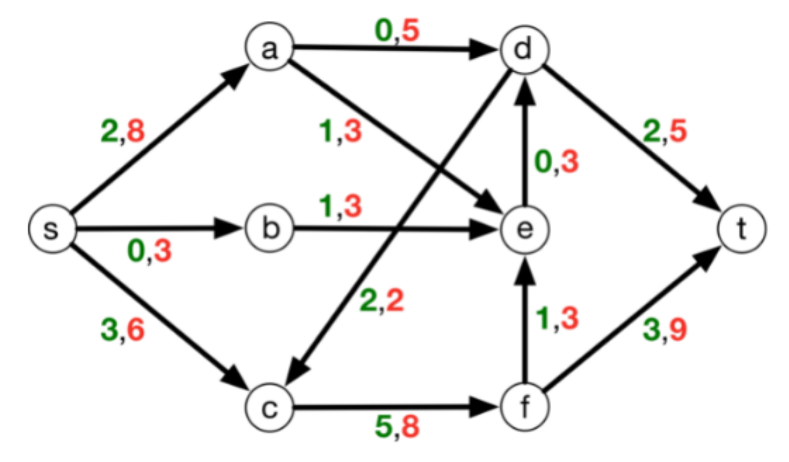{: width='400'}

Find the flow in the following:

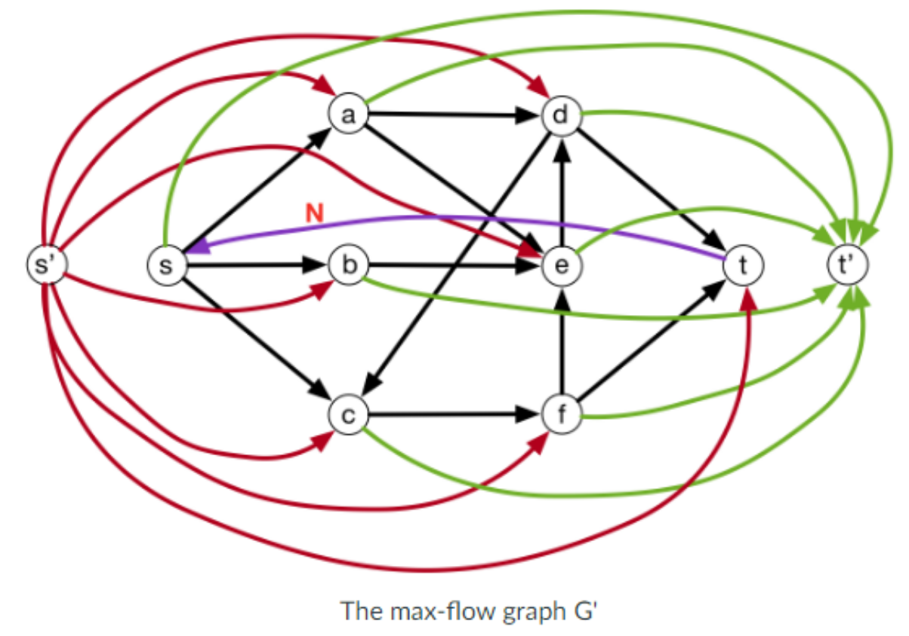{: width='400'}

Solution:

The max-flow $G'$ with capacities shown:

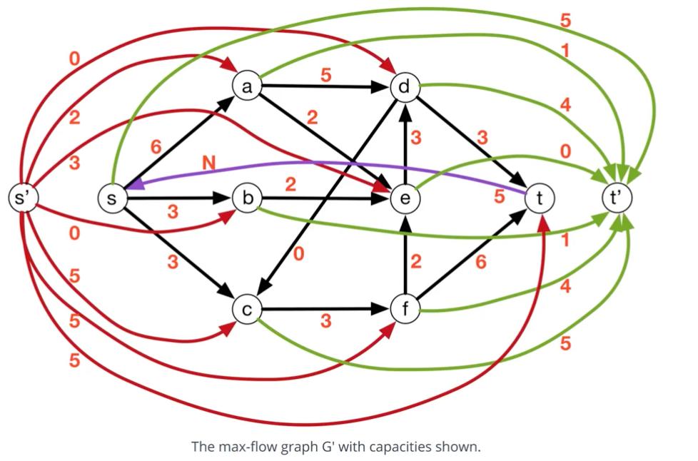{: width='400'}

The saturating flow:

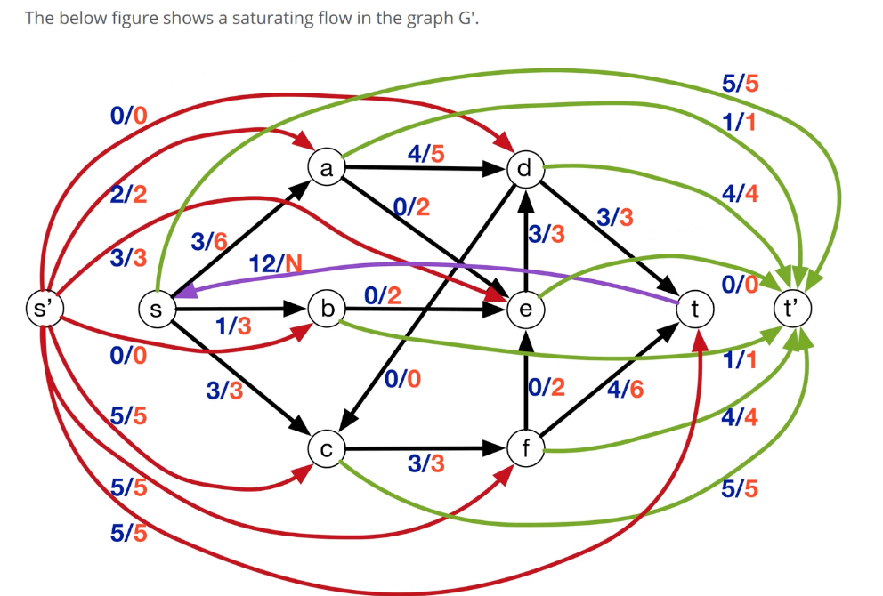{: width='400'}

And the solution:

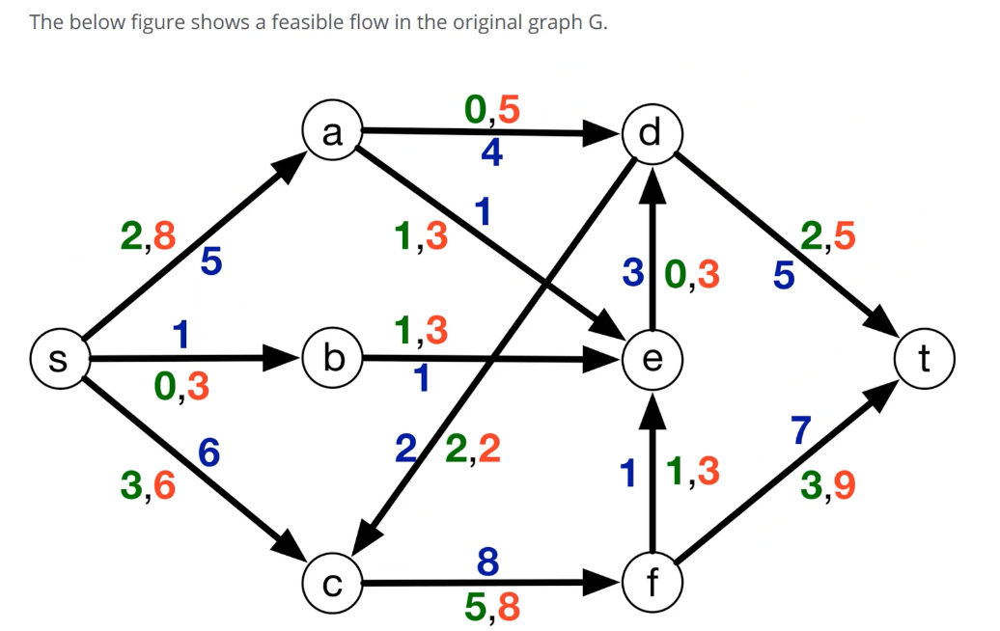{: width='400'}

<!--  -->