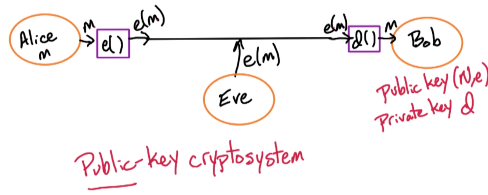

### Modular Arithmetic (RA1)

Short overview of topics:

* Math primer 
  * modular Arithmetic
  * multiplicative inverses
  * Euclid's GCD algorithm
* Fermat's little theorem 
  * RSA algorithm
* Primality testing
  * is a number a prime number? or a composite number
  * Generate random prime numbers

#### Huge integers

For huge n, consider n-bit integers, x,y, N, in the order of 1024 or even 2048 bits. 

#### Modular Arithmetic

For integer x, x mod 2 = least significant bit of x, which tells you if x is even or odd. We can also do this by x/2 and get the remainder.

For integer $N \geq 1: x mod N$ is the remainder of x when divided by N.

Some additional notation:

$$
X \equiv Y \bmod N
$$

means $\frac{X}{N}, \frac{Y}{N}$ have same remainder, another way of writing this is:

$$
x \bmod N = r \iff x = qN + r, q,r \in \mathbb{Z}
$$

Then we have the following:

if $x \equiv y \bmod N $ and $a \equiv b \bmod N$ then $x+a \equiv y+b \bmod N$ and $xa \equiv yb \bmod N$

#### Modular Exponentiation

n-bit numbers, compute $x^y \bmod N$.

Consider the simple algorithm:

$$
\begin{aligned}
x \bmod N &= a_1 \\
x^2 \equiv a_1x \bmod N &= a_2 \\
\vdots \\
x^y = a_{y-1}x \bmod N &= a_n
\end{aligned}
$$

Multiplying two n-bit numbers and dividing by a n-bit number takes $O(n^2)$ per round, since we have y rounds where $y \leq 2^n$, the overall time complexity is $O(n^2 2^n)$ which is horrible

$$
\begin{aligned}
x \bmod N &= a_1 \\
x^2 \equiv (a_1)^2 \bmod N &= a_2 \\
x^4 \equiv (a_2)^2 \bmod N &= a_4 \\
x^8 \equiv (a_4)^2 \bmod N &= a_8 \\
\vdots \\
\end{aligned}
$$

Then we can look at the binary representation of $y$ and find the appropriate $a_i$. For example if $y=25 = 11001$, then we need $a_{2^4=16} \ast a_{a^3 = 8} \ast a_{2^0=1} = a_{25}$

#### Mod-Exp algorithm

Note that for even $y$, $x^y = (x^{y/2})^2$, and for odd $y$, $x^y = x(x^{\lfloor y/2 \rfloor})^2$

```
mod-exp(x,y,N)
  Input: n-bit integers, x,y N >= 0
  Output: pow(x,y) mod N
  if y = 0, return(1)
  z = mod-exp(x, floor(y/2), N)
  if y is even:
    return (z^2 mod N)
  else:
    return (xz^2 mod N)
```

#### Multiplicative inverses

x is the multiplicative inverse of $z \bmod N$ if $xz \equiv 1 \bmod N$, which can be re-written as :

$$
x \equiv z^{-1} \bmod N
$$

Note that the $z$ is also the inverse of x, i.e $z \equiv x^{-1} \bmod N$

Note that the inverse is not guaranteed to exists, consider $N=14$, what is the inverse of $4 \mod 14$?

#### Inverse: Existence

The key idea here is if $x,N$ shares a common divisor, then it has no inverse.

Theorem: $x^{-1} \bmod N$ exists if and only if $gcd(x,N)=1$, gcd stands for greatest common divisor. This also means x and N are relatively prime.

In addition, if we always report $x^{-1} \bmod N$ in $0,1,...,N-1$ if it exists, it is unique and does not exists otherwise. For instance, $3^{-1} \equiv 4 \bmod 11$, but so is $15,26,-7$. Etc $3*-7 = -21 \bmod 11 = -1 $

Proof. Lets suppose $x^{-1} \bmod N$ has two inverses, $y \equiv x^{-1} \bmod N, z \equiv x^{-1} \bmod N, y\cancel{\equiv} z, 0 \leq y \neq z \leq N-1$.

This implies that $xy \equiv xz \equiv 1 \bmod N$. But if we multiply each by $x^{-1}$, then $x^{-1}xy \equiv x^{-1}xz \bmod N$ which implies $y \equiv z \bmod N$ which is a contradiction.

#### Inverse: Non existence 

if $gcd(x,N) > 1$ then $x^{-1} \equiv \bmod N$ does not exists. 

Lets assume $z = x^{-1} \bmod N \implies xz \equiv 1 \bmod N$ and $x,z$ shares a common divisor, $k > 1$.

This means that $xz = gN+1$,  which means $akz = g(bk)+1$, for some $a$ and $b$ since $x,N$ share some common divisor $k$. But this implies that $k(az-gb) = 1$, then $az-gb = \frac{1}{k}$  which shows that $az-gb$ is a fraction but $az-gb$ is an integer since a,z,g,b are integers and $k >1$, which is a contradiction. 

#### Euclid Rule

For integers x,y where $ x \geq y > 0$:

$$
gcd(x,y) = gcd(x \bmod y ,y)
$$

Proof: $gcd(x,y) = gcd(x-y,y)$, and if this is true we take x and minus y from it until we are no longer able to do so. This gives us exactly $x \bmod y$. 

Now, to proof $gcd(x,y) = gcd(x-y,y)$:
* if $d$ divides $x,y$ then $d$ divides $x-y$ 
* if $d$ divides $x-y, y$, then it divides $x$ since we can just sum them up.

#### Euclid's GCD algorithm

```
Euclid(x,y):
  input: integers (x,y) where x >= y >= 0
  output: gcd(x,y)

  if y = 0:
    return(x)
  else:
    return (Euclid(y, x mod y))
```

In the base case we are looking at y = 0, which is $gcd(x,0)$ What are the divisors of zero? How should we define this? What is a reasonable manner of defining the divisors of zero? Well, we got to this case by taking the GCD of sum multiple $x$ with $x$: 

$$
gcd(x,0) = gcd(kx, x) = x
$$

Before we analyize the runtime analysis, lets prove:

Lemma: if $x \geq y$ then $x \bmod y < \frac{x}{2}$.

* If $y \leq x/2$ then $x \bmod y \leq y-1 < y \leq x/2$
* If $y > x/2, \lfloor \frac{x}{y}\rfloor =1$ then $x \bmod y = x-y < x - \frac{x}{2} \leq \frac{x}{2}$
 


Note, because of the lemma, each rounds the values decreasings by half:

$$
(x,y) \rightarrow (y, x\bmod y) \rightarrow (\underbrace{x \bmod y}_{< \frac{x}{2}}, y\bmod x \bmod y ) \\
\implies 2n \text{ rounds}
$$

So there is a total of $2n$ rounds. We can now do our run-time analysis. 

Runtime analysis:

* `x mod y` takes $O(N^2)$ time to compute where $N$ is the number of bits, and this is for a single round.
* Total of $2n$ rounds
* Total of $O(n^3)$ runtime. 

#### Extended Euclid Algorithm

This is to compute the inverse of $x \bmod y$. Suppose $d = gcd(x,y)$ and we can express $d=x\alpha+y\beta$ and we have the following:

$$
d = gcd(x,y) = d=x\alpha+y\beta
$$

if $gcd(x,N) =1$ then $x^{-1} \bmod N$ exists and we have the following:

$$
\begin{aligned}
d = 1 &= x\alpha + N\beta \\
1 &\equiv x\alpha + \underbrace{N\beta}_{0} \bmod N \\
x^{-1} &\equiv \alpha \bmod N
\end{aligned}
$$

Similarly, 

$$
\beta = N^{-1} \bmod X
$$

```
Ext-Euclid(x,y)
  input: integers, x,y where x >= y >= 0
  output: integers d, α,β where d = gcd(x,y) and d = xα+yβ

  # remember gcd(x,0) = x, so we just set α = 1,β = 0
  if y = 0:
    return (x,1,0)
  else:
    d,α',β' = Ext-Euclid(y, x mod y)
    return (d, β', α' - floor(x/y)β')
```

The proof of the final expression can be found in the textbook, enjoy!

Runtime analysis:

* Similarly, $O(n^2)$ to compute $x \bmod y$ and calculating $\lfloor \frac{x}{y} \rfloor$
* $n$ rounds
* Total of $O(n^3)$


#### Summary:

* Fast Modular Exponentiation algorithm
* How to calculate multiplicative inverse
  * Euclid's GCD algorithm - $gcd(x,y)$
  * Extended Euclid's algorithm to compute $x^{-1} \bmod N$

### RSA (RA2)

#### Fermat's little theorem

If p is prime then for every $1 \leq z \leq p-1$, so $gcd(z,p) = 1$ then:

$$
z^{p-1} \equiv 1 \bmod p
$$

This is the basis of RSA algorithm and also allows us to test if a number $x$ is prime.

Proof: Let $S = \{1,2,3,...,p-1\}, S' = zS \bmod P = \{ i \times z \bmod p, i = 1, ..., p-1\}$. 

For example $p=7,z=4, S=\{1,2,...,6\}, S' = \{4,1,5,2,5,6\}$. Notice that the sets are the same, just in different order, and we are going to use
$S=S'$ to prove Fermat's little theorem.

To proof that $S=S'$, we need to show elements of $S'$ are distinct and non zero, which implies $\lvert S' \lvert = p-1$.

Part one - show that elements of $S'$ are distinct and we do this by contradiction, suppose for some $i \neq j$:

$$
iz \equiv jz \bmod P
$$

And since $P$ is a prime number, we know then that every element in $S$ has an inverse mod $P$, so $z$ is an element
in S since $z$ is between a number $1, P-1$. Recall that: $P$ is prime $\implies z^{-1} \bmod p$ exists, multiplying both sides by $z^{-1}$

$$
\begin{aligned}
izz^{-1} &\equiv jzz^{-1} \bmod P \\
i &\equiv j \bmod P
\end{aligned}
$$

which is a contradiction.

Part two - Show that they are non zero. Suppose we have an index $i$ such that:

$$
iz \equiv 0 \bmod P
$$

and since $z^{-1}$ exists,

$$
\begin{aligned}
izz^{-1} &\equiv 0z^{-1} \bmod P \\
i &\equiv 0 \bmod P
\end{aligned}
$$

which is also a contradiction since $i$ is between $1, P-1$.

Back to the proof of Fermat's little theorem, is to show that $z^{p-1} \equiv \bmod P$ if $P$ is prime. We have $S=S'$, then:

$$
\begin{aligned}
\prod_{i=1}^{P-1} i &\equiv \prod_{i=1}^{P-1} i \times z \bmod P\\
(P-1)! & \equiv z^{P-1} (P-1)! \bmod P \\
\text{Since } 1^{-1}, 2^{-1}, 3^{-1},...,&(P-1)^{-1} \text{ exists:} \\
\cancel{(P-1)!} & \equiv z^{P-1} \cancel{(P-1)!} \bmod P \\
1 &\equiv z^{P-1} \bmod P
\end{aligned}
$$

#### Euler's theorem

Euler theorem is the generalization of Fermat's little theorem    

For any $N,z$ where $gcd(z,N) =1$ then:

$$
z^{\phi(N)} \equiv 1 \bmod N
$$

where $\phi(N)$ is the number of integers between 1 and $N$ which are relatively prime to $N$, i.e the size of the set - $\lvert \{ x: 1\leq x \leq N, gcd(x,N) = 1\} \lvert$.
* $\phi$ is also known as Euler's totient function
* when $P$ is prime, then there is $P-1$ numbers relatively prime to $P$. So, $\phi(P) = P-1$.


So, for primes $p,g$ where $N=pq$, this implies that $\phi(N) = (p-1)(q-1)$

* Consider $N=pq$ as $1p, 2p, ... , qp$ so there are $q$ multiples of $p$.
* Likewise, $q, 2q, ..., pq$ there are $p$ multiples of $q$.
* So, we need to exclude all these numbers!
* Therefore we get $pq - p - q + 1$ which equals to $(p-1)(q-1)$
  * The $+1$ comes from $pq = pq$ which is a duplicate so we need to add 1 back.

With this, we can re-write Euler theorem as the following:

$$
z^{(p-1)(q-1)} \equiv 1 \bmod pq
$$

And this is going to allow us to use $p-1,q-1$ to generate a encryption and decryption key. 

#### RSA Idea 

**Fermat's Theorem:**

For prime $P$, take $b,c$ where $bc \equiv \bmod P-1$. This means we can re-write $bc = 1+ k(P-1)$ for some integer $k$. We then take a number $Z$ between $1$ and $P-1$:

$$
\begin{aligned}
z^{bc} &\equiv z^{1+K(P-1)} \bmod P \\
&\equiv z (\underbrace{z^{(P-1)}}_{1 \text{by Fermat's }})^k \bmod P \\
&\equiv z \bmod P
\end{aligned}
$$

The problem here is I need to tell everyone $P$, and given $b$, they are able to figure out $c$ which is the inverse of $b$ with respect to $\bmod P-1$. 

**Euler's theorem:**

Take $d,e$ where $de \equiv 1 \bmod (p-1)(q-1)$, and $N = pq$:

$$
\begin{aligned}
z^{de} &\equiv z \times (\underbrace{z^{(p-1(q-1))}}_{1})^k \bmod N \\
&\equiv z \bmod N
\end{aligned}
$$

Note the terms $D$ and $E$ decryption, encryption. So given a message $Z$, tell the other party $E$ and $N$:
* If the other party wants to send you the message $Z$
  * raise it to the power of $E$ and get $\bmod N$, i.e $z^E \bmod N$
  * send it over
* On my end, I compute $D$, which is the inverse of $D = E^{-1} \bmod (q-1)(p-1)$ which is my decryption key
* Take the encrypted message $z^E \bmod N$, raise to the power $D$ to get $z^{DE} \bmod N$ which gives me $Z$, the original message. 

Notice that the other party only knows $N$, is it possible for the other party to figure out $(p-1)$ or $(q-1)$? 
* Even if you tell the other party $pq$, the other party is also unable to get $(p-1)$ or $(q-1)$
* But I can compute $D$ since I know $p,q$ and $E$.

Here is an image to illustrate:

{: width='400'}

**Bob** 
* Bob picks $2$ n-bit random primes $p, q$
* Bob chooses $e$ relatively prime to $(p-1)(q-1)$
  * Let $N=pq$ and try $e=3,5,7,11...$
  * Good to keep encryption key small, easier for someone to encrypt information and send it to you. 
  * If you are unable to do so, usually you go back to the previous step
* Bob publishes his public key $(N,e)$
* Bob computes his private key 
  * $d \equiv e^{-1} \bmod (p-1)(q-1)$
  * We can do this because of the extended Euclid algorithm. 

**Alice**
 * Looks up Bob's public key $(N,e)$
 * Computes $y \equiv m^e \bmod N$
   * Using the fast mod-exp algorithm
 * Sends $y$ to bob

**Bob**
* Bob receives $y$
* Decrypts by computing $y^d \bmod N=m$
  * This is because $y = m^{ed} \bmod N$
  * $m^{ed} = m^{1+k(p-1)(q-1)} \bmod N$
  * $m^{1+k(p-1)(q-1)} \bmod N = m \bmod N$
    * This is because of euler theorem 
  * This also holds when $M,N$ has a common factor namely $P$ or $Q$
    * You can still prove this statement holds with the chinese remainder theorem

Now, the question is, how do we generate this random prime number to start with?

#### RSA Pitfalls

**Attack number one**
When $gcd(m,N) >1$, and $gcd(m,N) = p,  N=pq$

* $(m^e)^d \equiv \bmod N $ by the chinese remainder theorem
* $y \equiv m^e \bmod N$
* If $P$ divides $m, N$ since $gcd(m,N) = p$
  * Then it is also going to divide $y$
  * This means that $gcd(y,N) = p$
  * The attacker can then reverse engineer $q$

**Attack number two**
when $gcd(m,N) > 1$ and $m$ not too large, $m < N$ but $m < 2^n, N \geq 2^n$

But in this case, we $m$ cannot be too small, for example if $e=3$, then $m^3 < N$, we simply have $y = m^3$ since $\bmod N$ does nothing! To reverse the message we can simply just take the cube root.
* To avoid this we can choose a random number $r$, $m\oplus r$ or $m+r$, and we can send the padded message, as well as a second message that is r itself. 
  * As long as r is not too small, you will be fine.
  * Imagine you're the receiving user, you receive $m+r$ and $r$, you can then reverse engineer it to get $m$

**Attack number three**

Send the same $m$ for $e$ times, then we have $(N_1,3), (N_2,3), (N_3,3)$.

Then we have $Y_i, \equiv m^3 \bmod N_i$ and they can figure out $m$ by using the chinese remainder theorem. (DPV 1.44)


#### RSA Algorithm

* Choose primes $p,g$ let $N=pg$
* Find $e$ where $gcd(e,(p-1)(q-1))=1$
  * This means we want $e$ that is relatively prime to $(p-1)(q-1)$
  * This means $e$ has an inverse by Fermat's little theorem.
* Let $d \equiv e^{-1} \bmod (p-1)(q-1)$
  * Use the extended Euclid algorithm
  * Keep this private key $d$ secret
* Publish public key $(N,e)$
* Given a message $m$, Encrypt $m$ by $y \equiv m^e \bmod N$
  * Send over message $y$
* Decrypt $y$ by $y^d \bmod N = m$

Why RSA is hard to break - the whole world knows $N=pq$ but only we know $(p-1)(q-1)$, and therefore only we can compute the inverse of $e^{-1} \bmod (p-1)(q-1)$
* A natural question is, can you get $(p-1)(q-1)$ from $N$ without knowing $p$ and $q$ individually? 
* The assumption is no, it is not possible to do that. The only way to get $p-1,q-1$ is to factor $N$ into $p$ and $q$.


#### Random primes 

let r be a random n-bit number 

```
Choose random r 
  check if r is prime
    if yes:
      output r
    else:
      try again
```

A random number can be chosen by a n-bit strings.

Runtime: 

Primes are dense, $Pr(\text{r is prime}) \approx \frac{1}{n}$, so you can expect to have a random prime number after $n$ tries, so, complexity here is $O(n)$.

#### Primality: Fermat's test 

Recall that if $r$ is prime then for all $z \in \{1,. ..,r-1\}$, $z^{r-1} \equiv 1\bmod r$.

So, we need to find $z$ where $z^{r-1} \cancel{\equiv} 1 \bmod r \implies r$ is composite. We call this $z$ a **Fermat witness** with respect to Fermat's little theorem. 
 
* Does every composite $r$ have a Fermat witness? 
  * Surprisingly, YES!
* How do we find one?
  * In fact every composite number has multiple Fermat witness 
  * Some exceptions such as Pseudo Primes 

#### Fermat Witnesses 

Fermat witness for $r : z \text{ if } 1 \leq z \leq r-1 \text{ \& } z^{r-1} \cancel{\equiv} 1 \bmod r$, then the number $r$ is composite. 

First proof that every composite $r$ has $\geq 1$ Fermat witness. Since $r$ is composite, there is at least two divisors.

Take $z$ where $gcd(r,z) = z$ since $z \leq r-1$, and since $r$ is composite, we know this divisor is greater than one so $z > 1$. So any $z$ which is not relatively prime to $r$ and $r$ is composite will work. 

This implies that $z^{-1} \bmod r$ does not exists because it only exists if and only if the $gcd(r,z) = 1$ and this is also from the [inverse existence](#inverse-existence).

Suppose $z^{r-1} \equiv 1 \bmod r$, then we have $z^{r-2} \times z \equiv 1 \bmod r$, so $z^{-1} \equiv z^{r-2} \bmod r$ which is a contradiction. 

Feel free to see Dpv 1.3 for more information.

* Trivial Fermat witness : $z$ where $gcd(z,r) > 1$
* Non-trivial Fermat witness is where $gcd(z,r) = 1$
  * Some composite numbers have no non-trivial fermat witnesses, these are called pseudo primes, but those are relatively rare. 
  * For all other composite numbers, they have at least one non-trivial Fermat witness, and if they have at least one, they in fact have many Fermat witnesses.
  * Therefore, it will be easy to find a Fermat witness 
* Trivial Fermat witnesses always exists! 
  * Every composite number has at least two trivial Fermat witnesses!
  * They are dense and therefore easy to find 

#### Non-Trivial Witnesses 

$z$ is a nontrivial Fermat witness for $f$ if $z^{r-1} \cancel{\equiv} 1 \bmod r$ and $gcd(z,r)=1$.

* Carmichael numbers - sort of pseudoprime numbers 
  * They behave like primes with respect to Fermat's little theorem 
* A Carmichael number is a composite number $r$ with NO nontrivial Fermat witnesses 
* Such a number is going to be inefficient to use Fermat's test to prove that $r$ is a composite number 
  * Find a different way to deal with them
* These Carmichael numbers are rare
  * smallest one are 561 and 1105, 1729 and so on 
  * Ignore them for now

Lemma: if $r$ has $\geq 1$ non trivial Fermat witness, then $\geq \frac{1}{2}$ that $z \in \{1,2,..,r-1\}$ are Fermat witness.

* Proof is in the book, enjoy yourself as usual! 
* Question still remains, how to check a number is prime?
  * Take $z$ from the set $\{1,2,..,r-1\}$ and raise it to the power $r-1$ and look at $\bmod r$ and see whether it is one or not.

#### Simple Primality tests

```
For n-bit r

choose z randomly from {1,2,...,r-1}
Compute pow(z, r-1) === 1 mod r
if pow(z, r-1) === 1 mod r:
  then output r is prime 
else
  output r is composite (z is a witness to the fact that r is composite)
```

For prime $r$, $z^{r-1} \equiv 1 \bmod r$ is true because of Fermat's little theorem.
* So Pr(algorithm outputs $r$ is prime) = 1

For composite $r$ and assume that it is not a carmichael number. Sometimes the algorithm is going to be correct, it is going to output that $r$ is composite. This happens when it finds a $z$ which is a Fermat witness. $z^{r-1} \cancel{\equiv} 1 \bmod r$
* sometimes it is going to get confused, it is going to make a mistake, and it is going to find a $z$ which $z^{r-1} \equiv 1 \bmod r$, so it is going to think that $r$ is prime. 
* Recall that at most half of them are not witnesses
* The Pr(algorithm outputs $r$ is prime) $\leq \frac{1}{2}$

The question now is, can we improve this error probability of a false positive of $\frac{1}{2}$ 

#### Better primality test

Instead of choosing a particular $z$, we choose $k-z$ and run the algorithm k times.

Then Pr(algorithm outputs $r$ is prime) $\leq (\frac{1}{2})^k$. You can think of it as a coin toss each with probability $\frac{1}{2}$. So the probability that the coin toss is all tails with k flips is $(\frac{1}{2})^k$.

So you can take $k=100$, so $(\frac{1}{2})^{100}$ is a very small number and you will be willing to take the risk on that. 
* Again we assume that the numbers are not Carmichael
* to deal with these Carmichael, it is not that much more complicated of an algorithm


#### Dealing with Carmichael

So we know it is composite if there is a non trivial square root of $1 \bmod x$. Trivial square root of 1 means 1 or -1 since $1^2 , -1^2 = 1$.

For example, $x = 1729$ and choose $z = 5$, and note that $x-1 = 1728 = 2^6 \times 27$

$$
\begin{aligned}
5^{27} &\equiv 1217 \bmod 1729 \\
5^{2\times27} &\equiv 1217 \equiv 1065 \bmod 1729 \\
5^{2^2\times27} &\equiv 1065^2 \equiv 1 \bmod 1729 \\
5^{2^2\times27} &\equiv 1^2 \equiv 1 \bmod 1729 \\
&\vdots \\
5^{1728} &\equiv 1 \bmod 1729
\end{aligned}
$$

So, when Fermat tests fail, we see if there is a non trivial square root of 1 exists.

It turns out that for a composite number $X$, even if its Carmichael, for at least three quarters of the choices of $Z$, this algorithm works. 


 

<!--  -->