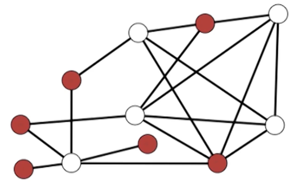
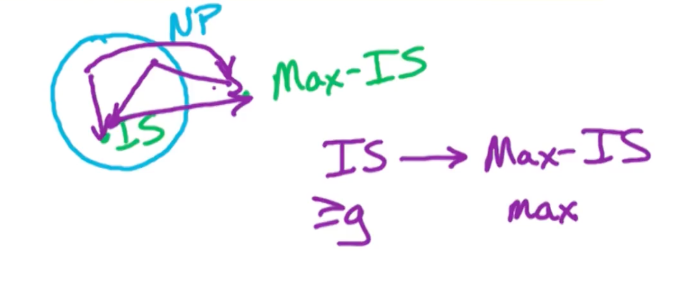

Consider watching this before you start!



### Definitions (NP1)

How do we prove that a problem is computationally difficult? Meaning that it is hard to devise an efficient algorithm to solve it for all inputs. 

To do this, we prove that the problem is NP-complete. 
* Define what is NP
* What exactly it means for a problem to be NP-complete 

We will also look at reductions and formalize this concept of reduction.

#### computational complexity 

* What does NP-completeness mean?
* What is $P=NP$ or $P\neq NP$ mean?
* How do we show that a problem is intractable? 
  * unlikely to be solved efficiently
    * Efficient means polynomial in the input size
  * To show this, we are going to prove that it is NP complete

#### P = NP

NP = class of all search problems. (In some courses it talks about decision problems instead which has a need for a witness for particular instances, but thats out of scope)

P = class of search problems that are solvable in polynomial time. 

The rough definition is the problem where we can efficiently verify solutions, so P is a subset of NP. If I can generate solutions in polynomial time then I can also verify in polynomial time. 

So if P = NP, that means I can generate a solution and verify it. If $P \neq NP$, means even if I can verify it, I might not be able to generate it.

Search Problems:
* Form: Given instance I (input),
  * Find a solution $S$ for $I$ if one exists
  * Output NO if I has no solutions
* Requirement: To be a search problem,
  * If given an instance I and solution S, then we can verify S is a solution to I in polynomial time (Polynomial in $\lvert I \lvert$)

Let's take a look at some examples


#### SAT problem

Input: Boolean formula in CNF with n variables and m clauses 
output: Satisfying assignment if one exists, NO otherwise

What is the running time to verify a SAT solution? 
* $O(nm)$

SAT $\in$ NP: 

Given f and assignment to $x_1, ..., x_n$,
* $O(n)$ time to check that a clause is satisfied
* $O(nm)$ total time to verify 

Therefore, SAT is a search problem and therefore SAT is in NP. 

#### Colorings

K-colorings problem:

Input: Undirected $G=(V,E)$ and integer $k > 0$
Output: Assign each vertex a color in $\{1,2,...,k\}$ so that adjacent vertices get different colors and NO if no such k-coloring exists

K-coloring $\in$ NP:

Given G and a coloring, in $O(m)$ time can check that for $(v,w) \in E$, color of v $\neq$ color of w.

#### MST

Input: $G=(V,E)$ with positive edge lengths
Output: tree T with minimum weight 

Is MST in the class P? - Can you generate a solution in polynomial time?
* MST is a search problem
* Can clearly find a solution, run Krushal's or pim

Is MST in class NP? Can you verify a given solution in polynomial time?
* Run BFS/DFS to check that T is a tree
* To check if its minimum weight, run Kruskal's or Prims to check that T has min weight.
  * May output different tree, but will have the same minimum weight.
  * Same runtime of $O(mlogn)$

#### Knapsack

Input: n objects with integer values $w_1, ... , w_n$ and integer values $v_1, ..., v_n$ with capacity $B$
Output: Subset S of objects with:
* Total weight $\leq B$
* Maximum total value

Two variants of knapsack, with and without repetition. 

Is Knapsack in the class NP?

Given a solution $S$, we need to check in polynomial time that $\sum_{i \in S} w_i \leq B$. This can be done in $O(n)$ time. 

The second thing to check is $\sum_{i \in S} v_i$ is optimal. Unlike MST, we cannot run the MST algorithm, and the running time for knapsack is $O(nB)$.
* The runtime is not polynomial in the input size. (Not in n, logB bits)
* Knapsack not known to be in NP
 
Knapsack is in NP, is incorrect. We do not know how to show that knapsack is in NP. Is knapsack not in NP? We cannot prove that at the moment, if we could prove that knapsack is not in NP, that would imply that P is not equal to NP. So as far as we know right now knapsack is not known to be in the class NP. 

Is Knapsack in the class P? Also No.

Similarly, Knapsack is not known to be in the class P. There might be a polynomial time algorithm for knapsack, P might be equal NP in which case knapsack will lie in NP. 

There is a simple variant of the knapsack problem which is in the class NP, what we are going to have to do is drop the optimization (max) and add in another input parameter. 
* That additional input parameter is going to be our goal for the total value and then we are going to check check whether our total value of our subset is at least the goal.
  * We can do binary search on that additional parameter, the goal for the total value. 

#### Knapsack-Search

Input: weights $w_1, ..., w_n$ values $v_1, ..., v_n$ with capacity B and **goal g**.

Output: subset S with $\sum_{i \in S} w_i \leq B$ and $\sum_{i \in S} v_i \geq g$

If no such subset $S$ exists, output NO.

Notice in the original version we are maximizing this sum of the total value, here we are simply finding a subset whose total value is at least $g$. Now, suppose that we could solve this version in polynomial time, how do we solve the maximization version? 

Well, we can simply do binary search over this $g$ and by doing binary search over $g$ and we find the maximum $g$ which has a solution, then that tells us the maximum total value that we can achieve. 

How many rounds in our binary search are we going to have to run? The maximum value is clearly all the items available:

$$
V = \sum_{i=1}^n v_i
$$

So we need to do binary search between 1 and $V$. So the total number of rounds in binary search is going to be $O(log V)$. Notice that to represent $v_1, ..., v_n$ is $log v_i$ bits. So this binary search algorithm is polynomial in the input size.

Now this version can be solved in NP time, need to check in poly-time:

Given input $w_1, ..., w_n, v_1, ..., v_n, B, g$ and solution $S$, 
* $\sum_{i \in S} w_i \leq B$
* $\sum_{i \in S} v_i \geq g$

Both of the above can be checked in $O(n)$ time. 

Special note, you might be confused why the sum is $O(n)$ but since the input size is $log W$ and $log V$, the sum of these is still $nlogW, nlogV$ which is still in polynomial time. 

#### P=NP revisited

* P stands for polynomial time. 
* NP stands for nondeterministic polynomial time 
  * problems that can be solved in poly-time on a nondeterministic machine
  * By nondeterministic time, it means it is allowed to guess at each step 

The whole point of this is to tell you that NP does not meant not-polynomial time, but it is nondeterministic polynomial time.

So recall that:

* NP = all search problems
* P = search problems that can be solved in poly-time
  * $P \subset NP$

{: width='200'}

The question now is, are there problems lie in NP which do not lie in P? That means $P\neq NP$ and there are some problems that we cannot solve in polynomial time.

#### NP-completeness

if $P\neq NP$ what are intractable problems? Problems that we cannot solve in polynomial time.
* NP-complete problems 
  * Are the hardest problems in the class NP

If $P\neq NP$ then all $NP$-complete problems are not in P.

The contra positive of this statement is:

If a NP-complete problem can be solved in poly-time, then all problems in NP can be solved in poly time. 

Hence to show a problem such as SAT, we have to show that if there is a polynomial time algorithm for SAT then there is a polynomial time algorithm for all problems in the class NP.
* To do that, we are going to take every problem in the class NP, and for each of these problems have a reduction to SAT. 
  * If we can solve SAT in polynomial time, we can solve every such problem in class NP in polynomial time. 

#### SAT is NP-complete 

SAT is NP-complete means:
* SAT $\in$ NP
* If we can solve SAT in poly-time, then we can solve every problem in NP in poly-time. 

{: width='200'}

* Reduce all problems to SAT! 

If $P\neq NP$ then SAT $\notin$ $P$, then we know that there are some problems in NP which cannot be solved in polynomial time, and therefore we cannot solve SAT in poly-time. 
* Because if we can solve SAT in poly-time then we can solve all problems in NP in polynomial time. 
* Or if you believe that nobody knows how to prove that $P=NP$ then nobody knows a polynomial time algorithm for SAT. 

It might occur to you that a polynomial time to solve SAT does not exists, otherwise we would have proven $P=NP$!

#### Reduction

For problems A and B, a reduction of can be represented as:

* $A \rightarrow B$
* $A \leq B$

Means we are showing that B is at least as hard computationally as A, i.e if we can solve B, then we can solve A. 

If we can solve problem B in poly-time, then we can use that algorithm to solve A in poly-time. 

#### How to do a reduction

Colorings $\rightarrow$ SAT

Suppose there is a poly-time algorithm for SAT and use it to get a poly-time algo for Colorings.

{: width='400'}

You can take any problem $I$, map it with $f$, and use SAT algorithm, get the results and map it back with $h$. If solution does not exists, just return NO.  

So we need to define $f, h$
* $f$ : input for colorings $(G,k) \rightarrow$ input for SAT, $f(G,k)$
* $h$ : solution for $f(G,k)$ $\rightarrow$ solution for colorings

Need to prove that if $S$ is a solution to $f$, then $h(S)$ is a solution to the original $G$. But we also need that if there was no solution to $f$, then there is no solution to the colorings problem.

$S$ is a solution to $f(G,k) \iff h(S)$ is a solution to $(G,k)$.

#### NP-completeless proof

To show: Independent sets is NP-complete

* Independent Sets (IS) $\in$ NP 
  * Solution can be verified in polynomial time 
* $\forall A \in NP, A\rightarrow IS$ 
  * Reduction of A to Independent Sets

Suppose we know SAT is NP-complete, $\forall A\in NP, A\rightarrow \text{ SAT}$, if we show

$$
\begin{aligned}
\text{SAT} \rightarrow \text{IS} &\implies A \rightarrow {SAT} \rightarrow \text{IS}\\
&\implies A \rightarrow \text{IS}
\end{aligned}
$$

Instead, to show IS is NP-complete, we need:
* IS $\in$ NP
* SAT $\rightarrow$ IS

### 3SAT (NP2)

The SAT is NP-complete, and known as the Cook-Levin Theorem (71). It was proved independently in 1971 by Steven Cook and Leonid Levin.

Karp'72 - 21 other problems are NP-complete

#### 3SAT 

Input: Boolean formula $f$ in CNF with n variables and m clauses where each clause has $\leq$ e literals

Output: Satisfying assignment, if one exists & No otherwise. 

Now, to show that 3SAT is NP-complete, need to show:
* 3SAT $\in$ NP
* SAT $\rightarrow$ 3SAT

Why do we care about this? Because if we an do this, then:

$$
\forall A\in \text{ NP}, A \rightarrow \text{ 3SAT}
$$

The implications is that if we have a polynomial time algorithm for 3SAT, then we have a polynomial time algorithm for every problem in NP, because we can reduce every problem in NP to 3SAT.

#### 3SAT in NP

Given 3SAT input $f$ and T/F assignments for $x_1, ..., x_n$. We want to show that 3SAT $\in$ NP.

To verify this assignment is a Satisfying assignment:
* For each clause $C\in f$ in $O(1)$ time can check that at least one literal in $C$ is satisfied. 
  * Order $O(1)$ time per clause, there are $M$ clauses so takes total $O(m)$ time.
  * It is $O(1)$ because fixed number of literals per clause.

#### SAT reduces to 3SAT

To do so, we need to take input $f$ for SAT:
* Need to create $f'$ for 3SAT
* Transform satisfying $\sigma'$ for $f' \rightarrow \sigma$ for $f$
  * $\sigma'$ satisfies $f' \iff \sigma$ satisfies $f$

{: width='400'}

Example:

$$
f = (x_3) \land (\bar{x_2} \lor x_3 \lor \bar{x_1} \lor \bar{x_4}) \land (x_2 \lor x_1)
$$

We can re-write $C_2 = (\bar{x_2} \lor x_3 \lor \bar{x_1} \lor \bar{x_4})$ as:

$$
C'_2 = (\bar{x_2} \lor x_3 \lor y ) \land (\bar{y} \lor \bar{x_1} \lor \bar{x_4})
$$

The claim is $C_2$ is satisfiable $\iff$ $C'_2$ is satisfiable

Forward direction, take satisfying assignment for $C_2$:
* if $x_2=F$ or $x_3 = T$ then set $y=F$
* if $x_1=F$ or $x_4 = F$ then set $y=T$

Backwards direction, take satisfying assignment for $C'_2$
* if $y=T$ then $x_1 = F$ or $x_4 = F$
* if $y=F$, then $x_2=F$ or $x_3=T$

#### Big Clauses 

Given $C=(a_1 \lor a_2 \lor ... \lor a_k)$ where $a_1, ..., a_k$ are literals:
* Create $k-3$ new variables, $Y_1, Y_2, ..., Y_{k-3}$
* Note that these variables are distinct for each clause, so if you have 2 clauses you will have two sets of new variables
  * So if you have $n$ clauses with $m$ literals then you have have order $nm$ new variables

$$
C' = (a_1 \lor a_2 \lor y_1) \land (\bar{y_1} \lor a_3 \lor y_2) \land  (\bar{y_2} \lor a_4 \lor y_3) \land \\
...  \land (\bar{y_{k-4}} \lor a_{k-2} \lor y_{k-3}) \land (\bar{y_{k-3}} \lor a_{k-1} \lor a_k)
$$

Now we need to show that $C$ is satisfiable $\iff$ $C'$ is satisfiable.

Forward implication: Take assignment to $a_1,...,a_k$ satisfying $C$.

Let $a_i$ be minimum $i$ where $a_i$ is satisfied. 
* Since $a_i = T \implies (i-1)^{st}$ clause of $C'$ is satisfied.
  * e.g if $a_i = a_4$ then $(\bar{y_2} \lor a_4 \lor y_3)$ is satisfied
    * It has $i=4$ which is the $i-1=3$ term
* Set $y_1=y_2=...=y_{i-2} = T$ to satisfy $1^{st} (i-2)$
* Set $y_{i-1} = y_i = ... = y_{k-2} = F$ to satisfy rest 

Reverse implication, take assignment to $a_1, ..., a_k, y_1, ..., y_{k-3}$ satisfying $C'$ 

* Suppose at least one $a_i = T$, then we can just use the original $a_i$
* Suppose otherwise $a_1 = a_2 = ... = a_k = F$, we will show it is not possible to satisfy $C$.
  * From clause $1 \implies y_1 = T$ 
  * From clause $2 \implies y_2 = T$ 
  * $...$
  * From clause $k-3 \implies y_{k-3} = T$ 
* $(\bar{y_{k-3}} \lor a_{k-1} \lor a_k)$ but this last literal is not set to true, it is all False. So the entire C is evaluated to be False.

#### SAT reduces to 3SAT cont

```
SAT->3SAT
Consider f for SAT
Consider f' for 3SAT:
  For each clause C in f:
    if |C| <= 3 then:
      add C to f'
    if |C| > 3 then:
      create k-3 new variables 
      and add C' as defined as before
```

It remains to show that $f$ is satisfiable $\iff$ $f'$ is satisfiable.
* Then, we need to show given a satisfying assignment to $f'$, how to map it back to $f$.
  * That will be straight forward because we just ignore these auxiliary variables and the setting for the original variables will give us a satisfying assignment to the original form. 

#### Correctness of SAT->3SAT

$f$ is satisfiable $\iff$ $f'$ is satisfiable

Forward direction: Given assignment $x_1,...,x_n$ satisfying $f$ 

* If $\lvert C \lvert \leq 3$ then we simply ignore it, otherwise:
* Remember that for each C, we define a new set $K-3$ of variables.
  * There is an assignment $k-3$ new variables so that $C'$ is satisfied

Backward direction: Given satisfying assignment for $f'$
* For $C' \in f \geq 1$ literal in C is satisfied
  * Otherwise there would be no way to satisfy this sequence of clauses $C'$
* Ignore the new variables and just look at the setting on the original n variables 

#### Satisfying assignment

Now, how do we get the mapping back? 

That is, we need transform our SAT assignment $\sigma'$ for $f'$ and get back $\sigma$, the SAT assignment for $f$

We can ignore the assignment for the new variables and keep the assignment for the original variables the same, then we get a satisfying assignment for $f$. So we take this satisfying assignment for $f$ prime, we ignore this assignment for all of the new variables and the assignment for the original variables gives us a satisfying assignment for $f$. And that completes our reduction. 

#### Size of problem?

$f$ has n variables, $m$ clauses. 

* $f'$ has $O(nm)$ variables in the worst case
* We are also replacing every clause by order $n$ clauses.
* So we also have $O(nm)$ clauses 

But this is ok! Because the size of $f'$ is polynomial in the size of $f$. So we have an algorithm which is polynomial running time in the size of $f'$.

### Graph Problems (NP3)

* Independent sets
* Clique
* Vertex cover

#### Independent Set

For undirected $G=(V,E)$, subset $S \subset V$ is an independent set if no edges are contained in $S$. i.e for all $x,y \in S, (x,y) \notin E$

An example:

{: width='200'}

Another example:

{: width='200'}

Trivial to find small independent sets:
* Empty set
* Singleton vertex

Challenging problem is to find the max independent set.

Question: The maximum independent set problem is known to be in NP, True or False?
* If you give me a solution, no way to verify that it is, in fact, of maximum size. 
* The only way to verify if it is of maximum size is it if I can solve this problem in polynomial time. 
  * Only holds if $P=NP$
* Assuming $P\neq NP$, the max independent set is not in the class NP.  
  * Similar scenario for the optimization version of knapsack problem 

#### Max independent set 

Input: undirected $G=(V,E)$ and goal g

Output: independent set $S$ with size $\lvert S \lvert \geq g$ and NO otherwise.

Theorem: The independent set problem is NP-complete.

Need to show:
* Independent Set $\in$ NP
  * Given input $G,g$ and solution $S$, verify that $S$ is a solution in polynomial time.
  * in $O(n^2)$ time can check all pairs $x,y \in S$ and verify $(x,y) \notin E$
  * in $O(n)$ time can check $\lvert S \lvert \geq g$

* Need to show that the independent set is at least as hard as every problem in the class NP.
  * Take something which is known to be at least as hard as everything in the class NP such as SAT or 3SAT.
  * Show a reduction from that known NP-complete problem to this new problem.
  * Show that $3SAT \rightarrow \text{Independent Set}$

3SAT is considered instead of SAT because it is easier.

#### 3SAT -> IS

Consider 3SAT input $f$ with variables $x_1,...,x_n$ and clauses $C_1,...,c_m$ with each $\lvert C_i \lvert \leq 3$. Define a graph G and set $g=m$.

Idea: For each clause $C_i$, create $\lvert C_i \lvert$ vertices.
* Since there are $m$ clauses, there is at most $3m$ vertices in graph $G$
* Going to add edges to encode this clause.
* Add additional edges between vertices in different clauses in order to ensure consistent assignment

#### Clauses edges 

Two types of edges, Clauses and Variables.

Clause $C = (x_1 \lor \bar{x_3} \lor x_2)$
* If another vertices shares $x_2$, we will have another vertex corresponding to $x_2$, multiple vertices corresponding to the same literal.

{: width='400'}

Independent set $S$ has $\leq 1$ vertex per clause. Since $g=m$, solution has $=1$ vertex per clause.

Since every independent set has at most one vertex per clause, in order to achieve our goal of an independent set of at least $m$, this solution has to have exactly one vertex per clause. 

This one vertex per clause will correspond to this satisfied literal in that clause. Now there may be other satisfied literals in the clause due to other copies of that literal in other clauses, but this property that we have exactly one vertex per clause will ensure that we have at least one satisfied literal in every clause, and therefore, this solution, this independent set will be able to relate it to a satisfying assignment for this original formula. 


Now, what happens if i take an independent set containing $x_1$ and $\bar{x_1}$, well in the above graph, this is in fact an independent set in this graph. And it can take one of $x_4, x_5$ and then I can have my independent set of my goal size of three. Now a natural way of converting this independent set into an assignment for the original formula is to satisfy each of the corresponding literals. 

So we set $x_1 =T$, $x_5=T$, $\bar{x_1} = F$ but this arrives at a contradiction. How do we ensure that my independent sets correspond to valid assignments? 

#### Variable edges 

{: width='400'}

For each $x_i$, add edges between $x_i$ and all $\bar{x_i}$

This will ensure that our independent set corresponds to a valid assignment. And then the clause edges will ensure that our independent set corresponds to an assignment which satisfies all the clauses. 
  
**Example**

{: width='400'}

Now an example independent set of size four in this graph:

{: width='400'}

Note that $z$ has no constraints.

Now lets prove that in general, that an independent set of size $m$ in this graph corresponds to a satisfying assignment of this formula, and a satisfying assignment of this formula corresponds to an independent set of size $m$.

#### Correctness 3SAT -> IS

$f$ has a satisfying assignment $\iff$ $G$ has an independent set of size $\geq g$

Forward direction: Consider a satisfying assignment for $f$ and we will construct an independent set in this graph of size at least $g$. 

For each clause $C$ at least one of the literals and that clause is satisfied, take 1 of the satisfied literals, add corresponding vertex to $S$. 
* $S$ contains exactly one vertex per clause.
* So $\lvert S \lvert =m = g$, and our goal $g$ is met. 

Since $S$ contains exactly one vertex per clause, and it never contains both $x_i, \bar{x_i}$. It cannot contain both since it corresponds to an assignment $f$, which sets either $x_i$ to be true or false. Because there is at most one vertex per clause, we know that there is no clause edges contained in this set $S$ and because we never include a vertex $x_i, \bar{x_i}$ in the assignment, we know that there are no variable edges contained in this set $S$.

Therefore, S is an independent set of size equal to $g$, our goal size. So we have constructed an independent set of size equal to $g$ in this graph. 

Backward direction: Take independent set $S$ of size $\geq g$ has exactly one vertex in each of the clauses, actually in each of the triangles corresponding to the clauses. 
* Now this vertex corresponds to a literal in the original formula so we set that corresponding literal to true. 
* Since every clause has a satisfied literal then we know every clause is satisfied and therefore the formula is satisfied. But does this clause belongs to an assignment?

Notice we have no contradicting literal in this set since we added edges between $x_i, \bar{x_i}$ so we can never include $x_i$ and a $\bar{x_i}$ in an independent set. Therefore we never attempt to set $x_i$ to be true and false at the same time. So this assignment we constructed corresponds to a valid assignment. 

So we taken an independent set of size at least $g$ and we construct a satisfying assignment. 

This proves that a reduction from 3SAT to independent set is correct and it shows how to take an independent set and construct a satisfying assignment. And if there is no independent set of size at least $g$ then there is no satisfying assignment. 

This completes the proof that the independent set problem is NP-complete. 

#### NP-HARD

In the Max-independent set problem, it is not known to lie in the class NP.
Notice that it is quite straight forward to reduce the independent set problem to max independent set problem. I am looking for an independent set of size at least $g$, while on the other side is looking for maximum independent set. IF i find the max independent set, and i check whether that size is at least $g$, that either gives me a solution or tells me there is no solution. 

So it is quite forward to reduce the search version to the optimization version. That means I have reduction from the independent set problem to the maximum independent set problem and in fact, I have a reduction from every problem in NP to the MAX independent set problem. Either going indirectly through or directly.

{: width='300'}

Theorem: The Max-Independent Set problem is NP-hard

NP-hard means it is at least as hard as everything in the class NP. So there is a reduction from everything in the class NP to this problem max independent set. So if we can solve max independent set in polynomial time, then we can solve everything in NP in polynomial to be NP-complete. 

#### Clique

For undirected graphs, $G=(V,E)$, $S\subset V$ is a clique if:
* for all $x,y \in S, (x,y) \in E$
  * All pairs of vertices in the subset $S$ are connected by an edge.

{: width='400'}


Want large cliques, small cliques are easy to find:
* For an example the empty set 
* Singleton vertex 
* Any edge (with two end points) 

Now, let's defined the clique problem:

Input: $G=(V,E)$ and goal $g$

Output: $S \subset V$ where $S$ is a clique of size $\lvert S \lvert \geq g$ if one exists, No otherwise. 
* Find the largest clique possible 

Theorem: The clique problem is NP complete

Clique $\in$ NP
* Given input $(G,g)$ and solution $S$.
* For all $x,y \in S$, check that $(x,y) \in E$ 
  * At most takes $O(n^2)$ for each pair
  * At most $O(n)$ time to check whether they are connected by an edge
  * Total of $O(n^3)$ with a trivial algorithm
    * You could do it easily in $O(n^2)$ as well
* Check that $\lvert S \lvert \geq g$ 
  * Order $O(n)$ time

Now, we need to show that the clique problem is at least as hard as other NP problems. We show reduction from a known NP-complete problem to the clique problem

Choices are SAT, 3SAT, IS - take the one most similar to clique, Independent Sets which is also a graph problem

#### IS -> Clique

The key idea is for clique, it is all edges within $S$, while independent set is no edges within $S$. So, they are actually opposite of each other. 

For $G=(V,E)$ transform the input for the independent set for the clique problem. We can take the opposite of $G$, denoted as $\bar{G}$

Let $\bar{G} = (V, \bar{E})$ where: $\bar{E} = \{ (X,y) : (x,y) \notin E\}$

Observation: $S$ is a clique in $\bar{G} \iff$ $S$ is an independent set in $G$

Recall that for independent sets, all pairs of vertices are not connected by an edge, which is the opposite for a clique. 

IS $\rightarrow$ clique: 

Given input $G=(V,E)$ and goal $g$ for IS problem, let $\bar{G},g$ be input to the clique problem.

* If we get solution $S$ for clique, then return $S$ for IS problem
* IF we get NO, then return NO.

#### Vertex cover

$S \subset V$ is a vertex cover if it "covers ever edge"

{: width='200'}

For every $(x,y) \in E$ either $x \in S$ and/or $y\in S$.

It is easy to find a large vertex cover, i.e all vertices in the vertex cover, but in this case we are trying to find the minimum vertex cover. 

Input: $G=(V,E)$ and budget $b$

Output: vertex cover $S$ of size $\lvert S \lvert \leq b$ if one exists, NO otherwise.

Theorem: vertex cover problem is NP-complete

Vertex Cover $\in$ NP
* Given input $(G,b)$ and proposed solution $S$, can we verify this in polynomial time? 
  * For every $(x,y) \in E, \geq 1$ of $x$ or $y$ are in $S$
    * Can be done in $O(n+m)$ time 
  * Check that $\lvert S \lvert \leq b$ 
    * Can be done in $O(n)$ time 

Now, we need to take independent set problem and reduce it to vertex cover 

{: width='400'}

The claim is $S$ is a vertex cover $\iff$ $\bar{S}$ is an independent set 

Forward direction: 

Take vertex cover $S$, for edge $(x,y) \in E: \geq 1$ of $x$ or $y$ are in $S$. 

* Therefore $\leq 1$ of $x$ or $y$ in $\bar{S}$
  * $\implies$ no edge contained in $\bar{S}$ since it only contains $x$ or $y$, so does not have the edge $(x,y)$
* Thus $\bar{S}$ is an independent set

Reverse direction: 

Take independent set $\bar{S}$
* For every $(x,y)$, $\leq 1$ of $x$ or $y$ in $\bar{S}$
  * implies that $\geq 1$ of $x$ or $y$ in $S$
  * $\therefore S$ covers every edge

#### IS -> Vertex cover

Claim: $S$ is a vertex cover $\iff$ $\bar{S}$ is an independent set 

For input $G=(V,E)$ and $g$ for independent set
* Let $b=n-g$
  * Run vertex cover on $G,b$ 

$G$ has a vertex cover of size $\leq n-g \iff G$ has an independent set of size $\geq g$ 

So now we have:

$(G,g)$ for independent set $\rightarrow$ $(G,b)$ for vertex cover.

* Given solution $S$ for vertex cover, return $\bar{S}$ as solution to independent set problem
  * We know that if $S$ is a vertex cover of size at most $b$, then we know that $\bar{S}$ is an independent set of size at least $g$
* If NO solution for VC return NO for IS problem. 


### Knapsack (NP4)

{: width='400'}

#### Subset-sum

Subset-sum

Input: positive integers $a_1, ..., a_n, t$

Output: Subset $S$ of $\{1, ..., n\}$ where $\sum_{i \in S} a_i = t$ if such a subset exists, NO  otherwise.

If using dynamic programming, we can solve this in $O(nt)$

This is not in P because this is the same as knapsack, the running time has to be $O(nlogt)$

#### Subset-sum is NP-complete 

First show that subset-sum $\in$ NP.

Given inputs $a_1,...,a_n, t$ and $S$, check that $\sum_{i \in S} a_i = t$. 

To compute this sum, there are are most $n$ numbers, and each number is at most $log t$ bits, so the total takes $O(nlogt)$. This is polynomial in input size.

Now we need to show the second part, is at least as hard as every problem in class NP. We are going to use the 3SAT problem.

The reduction will really illustrates why the order $O(nt)$ time algorithm is not efficient for this subset-sum problem.

#### 3SAT -> Subset sum

Input to subset-sum: $2n+2m+1$ numbers:

* $v_1, v_1', v_2, v_2', ..., v_n, v_n', s_1, s_1', ...,s_m, s_m'$ and $t$
  * $v_i'$ represents $\bar{x_i}$ and $s$ represents each clause. 
  * $n$ for the number of literals 
  * $t$ represents the desired sum

All these numbers are huge, all are $\leq n+m$ digits long and we are going to work in base 10. 
* This is so that if we add up any subset of numbers, there will be no carries between the digits. 
* This means $t \approx 10^{n+m}$

Lets take a deeper look:

* $v_i$ corresponds to $x_i$: $v_i \in S \iff x_i = T$
* $v_i'$ corresponds to $x_i$: $v_i \in S \iff x_i = F$ 

And assignment for the 3-SAT formula either sets $x_i$ to True or False. Therefore we need for the subset sum problem that either we include $v_i \in S$ or $v_i' \in S$, but we cannot include both and cannot include neither otherwise there is no assignment for $x_i$. 

To achieve this, in $i^{th}$ digit of $v_i, v_i', t$, put a $1$ and all other numbers put a 0.  Now by using base 10, we will ensure that there is no carries between the digits.  So each digit is going to behave independently. REcall that $t$ is our desired sum, so the only way to achieve a desired sum that has a one in the $i^{th}$ digit is to either include $v_i$ or $v_i' \in S$, not both and not neither. 

This specification ensures that our solution to the subset sum problem is going to correspond to an assignment. Whether it is satisfying or not is another issue. 

#### Example Reduction:

{: width='600'}

From here, Digit $n+j$ corresponds to clause $C_j$.
* if $x_i \in C_j$ put a 1 in digit $n+j$ for $v_i$.
* if $\bar{x_i} \in C_j$ put a 1 in digit $n+j$ for $v_i'$.
* Put a 3 in digit $n+j$ of $t$
* Use $s_j,s_j'$ to be buffer
  * put a 1 in digit $n+j$ of $s_j, s_j'$
* Put a 0 in digit $n+j$ of other numbers

{: width='600'}

Take $C_1$ for example, we set $S_1, S_1'$ to also be $1$. 
* So to get 3, we need at least one $v_i$ to be $1$. 

#### Correctness Subset sum

Now is to prove that subset-sum has a solution $\iff$ 3SAT $f$ is satisfiable

Forward direction:

Take solution $S$ to subset sum:
* For digit $i$ where $1\leq i \leq n$, to get a 1 in digit $i$, to include $v_i$ or $v_i'$ but not both (or neither)
* So the only way to get a sum of exactly 1 in digit $i$ is to include exactly 
  * If $v_i \in S$ then $x_i = T$
  * If $v_i' \in S$ then $x_i = F$
* $\implies$ get an assignment 

Now we need to show that this assignment is a satisfying assignment 
* For digit $n+j$ where $1\leq j \leq m$
  * Corresponds to clause $C_j$
  * To get a sum of 3 in digit $n+j$:
    * Need to use $\geq 1$ literal of $C_j$ and include $S_j, S_j'$
      * If we have two $C_j$ we just need to use either $S_j$, $S_j'$ and so on. 
      * If we satisfy all three $C_j$ then don't need either
      * If none are satisfied there is no way to achieve a sum of 3, therefore no solution exists
  * $\implies C_j$ is satisfied 

Backward direction:

Take a satisfying assignment for $f$ and construct a solution to the subset-sum instance in the following manner:
* If $x_i = T$, add $v_i$ to $S$
* If $x_i = F$, add $v_i'$ to $S$ 
  * $\implies i^{th}$ digit of $t$ is correct 
* For clause $C_j$, at least 1 literal in $C_j$ is satisfied 
  * The numbers corresponding to these literals gives us a sum one, two or three in the digit $n+j$. 
    * To get a sum of $3$ in digit $n+j$, use the numbers corresponding to these literals use $S_j,S_j'$ to get up to the sum of three. 
  * This ensures that digit $n+j$ is correct and therefore the last $m$ digits are correct and the first $n$ digits are correct. 
* Therefore we have a solution to the subset-sum instance 

#### Knapsack is NP-complete

Prove that the knapsack problem is NP-complete.
* USe the correct version of the knapsack problem, the version which lies in the class NP. 

As before, there is two parts:

* Knapsack $\in$ NP
* Known NP-complete problem $\rightarrow$ knapsack

We know that all problems in NP reduce to this known NP-complete problem, therefore if we show a reduction from this known NP-complete problem to the knapsack problem, we know all NP problems can reduce to the knapsack problem. 
* Try to use the subset-sum to show this 


<!--  -->