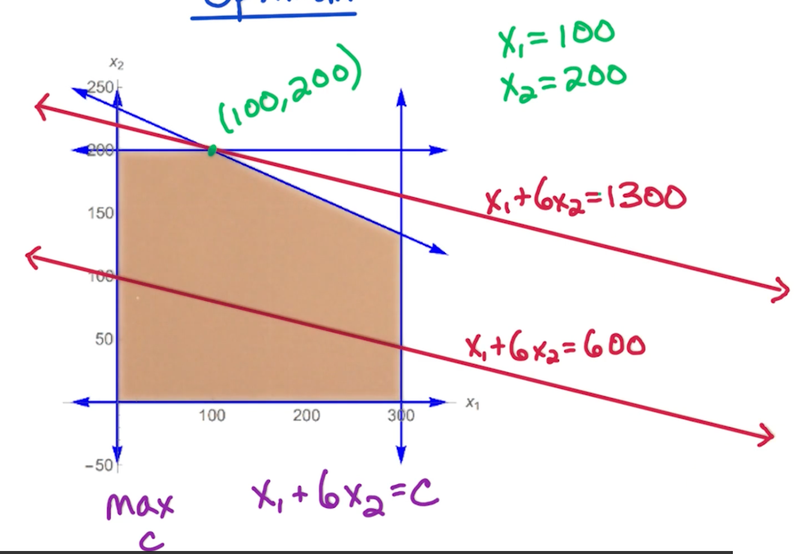
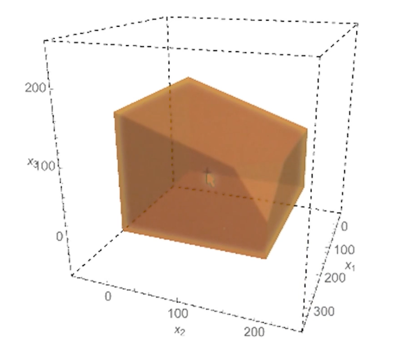

### LA1: Linear Programming

Will look at simple examples such as:
* max-flow
* simple production

Will look at standard form, and LP duality.

#### Maxflow via LP 

Input: Directed $G=(V,E)$ with capacities $c_e > 0$ for $e \in E$

LP: $m$ variables: $f_e$ for every $e \in E$

Objective function: $max \sum_{\overrightarrow{SV} \in E} f_{sv}$

Subject to:
* for every $e \in E, 0 \leq f_e \leq c_e$
* For every $v\in V-\{s,t\}$, $\sum_{\overrightarrow{wv}\in E} f_{wv} =  \sum_{\overrightarrow{vz}\in E} f_{vz}$

This should look familiar, which is the feasibility of a flow.

#### 2D example

Company makes A and B, how many of each to maximize profit?

* Each unit of A makes profit of $1, B makes $6 
* Demand: $\leq 300$ units of A and $\leq 200$ units of B 
* Supply: $\leq 700$ hours, A takes 1 hour, and B takes 3 hours. 

To express this as a linear program:

* Variables: let $x_1, x_2$ be the number of units of A and B respectively
* Objective function: max $x_1 + 6x_2$
* Demand: $0\leq x_1 \leq 300, 0\leq x_2 \leq 200$
* Supply: $x_1+3x_2 \leq 700$


Feasible Region - all possible solutions:

{: width='200'}

Finding the best solution involves drawing a line $x_1+6x_2$ and slowly moving up, something like sliding up a roller. 

{: width='300'}

In the above scenario, it touches the point $(100,200)$, so $x_1 = 100, x_2 = 200$

There a few key points:

* Optimum may be non-integer
  * We can round it - Will revisit this in Max-Set Approximation algorithm
* $LP \in P$
  * But Integer Linear Programming (ILP) is NP-complete 
* Optimal solution lies in a vertex (corner)
* Feasible region is convex
  * All points between two lines must be in the set
    * Optimal point at vertex
    * The whole line may be optimal, but it must end somewhere at a vertex / corner
  * If a vertex is better than its neighbors, it is the global optima 

This gives rise to the simplex algorithm which we will detail later.


#### 3D example 

* Profit: 1 for A, 6 for B, 10 for C.
* Demand: $\leq 300$ for A, $\leq 200$ for B, unlimited demand for C
* supply $\leq 1000$ A takes 1, B takes 3, C takes 2
* Packaging $\leq 500$ total, A requires no packaging, B takes 1, C takes 3.

LP formulation as follows:

Objective: max $x_1 + 6x_2 + 10x_3$
Constraints:
* $x_1 \leq 300, x_2 \leq 200$
* $x_1 + 3x_2 + 2x_3 \leq 1000$
* $x_2 + 3x_3 \leq 500$
* $x_1, x_2, x_3 \geq 0$

{: width='400'}


#### Standard form

Given n variables $x_1, x_2, ..., x_n$

Objective function:

$$
\text{max } c_1x_1 + c_2x_2 + ... + c_nx_n
$$

Constraints:

$$
\begin{aligned}
a_{11}x_1 + a_{12}x_2 + ... + a_{1n}x_n &\leq b_1\\
&\vdots \\
a_{m1}x_1 + a_{12}x_2 + ... + a_{mn}x_n &\leq b_m \\
x_1, ..., x_n &\geq 0
\end{aligned}
$$

#### Linear Algebra view

* Variables $x = (x_1,...,x_n)^T$
* Objective function $c = (c_1, ..., c_n)^T%
* Constraints matrix $A$ of size $m \times n$
* Constraints $ b= (b_1,...,b_m)^T$

Then it can be re-written as:

$$
\text{max } c^T x : Ax \leq b, x\geq 0
$$

Note, the non-negativity is important, because if the feasible region is non empty, the zero vector is a feasible point. So either there is a feasible point or the feasible region is empty. 

#### Conversions 


* from max to min can just multiplying everything by $-1$
* If we want a constraint $f(x) = b$, we can define $f(x) \leq b$ and $f(x) \geq b$
* Unconstrained $x$, replace $x$ with $x^+ - x^-$ and the following constraints:
  * $x^+ \geq 0, x^- \geq 0$

Note, for Linear programming, **strict inequalities** are not allowed so there is no way to convert this. 

#### General Geomertric view

In general we have $n$ variables $\rightarrow$ so we have n dimensions.
 
Since we have $m$ constraints and $n$ non negativity constraints, a total of $n+m$ constraints.

Feasible region is the intersection of the $n+m$ halfspaces defined by the constraints which corresponds to a convex polyhedron

Vertices are the corners of the feasible region. The question is, how do you gt these vertices?

#### Lp vertices

In general, in n dimensional space, a vertex of this convex polyhedron is points satisfied by:
* n constraints with =
  * So these constraints are satisfied with equality 
* m constraints with $\leq$
  * And check that the rest are still satisfied 

Can get a trivial upper bound on the number of vertices of this convex polyhedron by ${n+m \choose n}$ but this is still exponential in $n$. So there is still a huge number of vertices in this convex polyhedron. 

For a particular vertex, a neighbor would correspond to swapping out one constraint with equality with a different constraint. So we have n choices for which one we swap out, and then we have $m$ choices for which when we swap in.  So the number of neighbors for each vertex is at most $nm$. 

#### LP Algorithms

There are two polynomial time algorithms:
* Elliposid algorithm
  * More of theoretical interest
* Interior point method
  * Mainly focus on this
  * Mostly used in practice 

An important algorithm is the simplex algorithm, but has a worst case exponential runtime. Despite the worst case bound it is widely used because the output of the simplex algorithm is:
* guaranteed to be optimal 
* works quite efficiently even on HUGE LPs
  * Very fast LP solvers using the simplex algorithm

#### Simplex

Simplex alg:
```
Start at x = 0
  Check that this is feasible (If it is not just return not feasible)
Look for neighboring vertex with higher objective value
  (Worse case we check all nm neighbors)
  Move to vertex with higher objective value
  Repeat
Else: (No better neighbors)
  output x

```

Remember that the current search space is convex, so if a current solution is better than all of its neighbors, it must thus be optimal and be the global variable. 

#### 3D example  (Cont)

* Start at (0,0,0) with profit 0
  * This starts with $x_1, x_2, x_3 \geq 0$
  * Move to vertex defined by $x_1 \leq 300$ so drop $x_1 \geq 0$
* (300,0,0) with profit 300
  * Move to vertex defined by $x_2 \leq 200$ so also drop $x_2 \geq 0$
* (300, 200, 0) with profit 1500
  * Move to vertex defined by $x_1 + 3x_2 + 2x_3 \leq 1000$ and drop $x_3 \geq 0$
* (300, 200, 50) with profit 2000
  * Move to vertex defined by $x_2 + 3x_3 \leq 500$ and drop $x_1 \leq 300$ 
  * Note that we can derive the values of $x_1$ since we still have the condition  $x_1 + 3x_2 + 2x_3 \leq 1000$
* (200, 200, 100) with profit 2400
  * No other neighbors is better, done.

### LA2: Geometry

### LA3: Duality 

<!--  -->