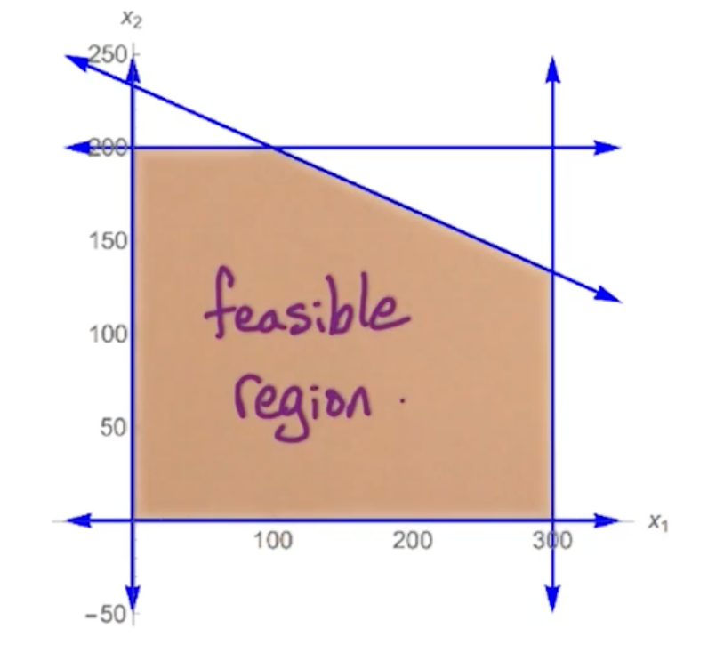

### Linear Programming (LA1)

Will look at simple examples such as:
* max-flow
* simple production

Will look at standard form, and LP duality.

#### Maxflow via LP 

Input: Directed $G=(V,E)$ with capacities $c_e > 0$ for $e \in E$

LP: $m$ variables: $f_e$ for every $e \in E$

Objective function: $max \sum_{\overrightarrow{SV} \in E} f_{sv}$

Subject to:
* for every $e \in E, 0 \leq f_e \leq c_e$
* For every $v\in V-\{s,t\}$, $\sum_{\overrightarrow{wv}\in E} f_{wv} =  \sum_{\overrightarrow{vz}\in E} f_{vz}$

This should look familiar, which is the feasibility of a flow.

#### 2D example

Company makes A and B, how many of each to maximize profit?

* Each unit of A makes profit of $1, B makes $6 
* Demand: $\leq 300$ units of A and $\leq 200$ units of B 
* Supply: $\leq 700$ hours, A takes 1 hour, and B takes 3 hours. 

To express this as a linear program:

* Variables: let $x_1, x_2$ be the number of units of A and B respectively
* Objective function: max $x_1 + 6x_2$
* Demand: $0\leq x_1 \leq 300, 0\leq x_2 \leq 200$
* Supply: $x_1+3x_2 \leq 700$


Feasible Region - all possible solutions:

{: width='200'}

Finding the best solution involves drawing a line $x_1+6x_2$ and slowly moving up, something like sliding up a roller. 

{: width='300'}

In the above scenario, it touches the point $(100,200)$, so $x_1 = 100, x_2 = 200$

There a few key points:

* Optimum may be non-integer
  * We can round it - Will revisit this in Max-Set Approximation algorithm
* $LP \in P$
  * But Integer Linear Programming (ILP) is NP-complete 
* Optimal solution lies in a vertex (corner)
* Feasible region is convex
  * All points between two lines must be in the set
    * Optimal point at vertex
    * The whole line may be optimal, but it must end somewhere at a vertex / corner
  * If a vertex is better than its neighbors, it is the global optima 

This gives rise to the simplex algorithm which we will detail later.


#### 3D example 

* Profit: 1 for A, 6 for B, 10 for C.
* Demand: $\leq 300$ for A, $\leq 200$ for B, unlimited demand for C
* supply $\leq 1000$ A takes 1, B takes 3, C takes 2
* Packaging $\leq 500$ total, A requires no packaging, B takes 1, C takes 3.

LP formulation as follows:

Objective: max $x_1 + 6x_2 + 10x_3$
Constraints:
* $x_1 \leq 300, x_2 \leq 200$
* $x_1 + 3x_2 + 2x_3 \leq 1000$
* $x_2 + 3x_3 \leq 500$
* $x_1, x_2, x_3 \geq 0$

{: width='400'}


#### Standard form

Given n variables $x_1, x_2, ..., x_n$

Objective function:

$$
\text{max } c_1x_1 + c_2x_2 + ... + c_nx_n
$$

Constraints:

$$
\begin{aligned}
a_{11}x_1 + a_{12}x_2 + ... + a_{1n}x_n &\leq b_1\\
&\vdots \\
a_{m1}x_1 + a_{12}x_2 + ... + a_{mn}x_n &\leq b_m \\
x_1, ..., x_n &\geq 0
\end{aligned}
$$

#### Linear Algebra view

* Variables $x = (x_1,...,x_n)^T$
* Objective function $c = (c_1, ..., c_n)^T%
* Constraints matrix $A$ of size $m \times n$
* Constraints $ b= (b_1,...,b_m)^T$

Then it can be re-written as:

$$
\text{max } c^T x : Ax \leq b, x\geq 0
$$

Note, the non-negativity is important, because if the feasible region is non empty, the zero vector is a feasible point. So either there is a feasible point or the feasible region is empty. 

#### Conversions 


* from max to min can just multiplying everything by $-1$
* If we want a constraint $f(x) = b$, we can define $f(x) \leq b$ and $f(x) \geq b$
* Unconstrained $x$, replace $x$ with $x^+ - x^-$ and the following constraints:
  * $x^+ \geq 0, x^- \geq 0$

Note, for Linear programming, **strict inequalities** are not allowed so there is no way to convert this. 

#### General Geomertric view

In general we have $n$ variables $\rightarrow$ so we have n dimensions.
 
Since we have $m$ constraints and $n$ non negativity constraints, a total of $n+m$ constraints.

Feasible region is the intersection of the $n+m$ halfspaces defined by the constraints which corresponds to a convex polyhedron

Vertices are the corners of the feasible region. The question is, how do you gt these vertices?

#### Lp vertices

In general, in n dimensional space, a vertex of this convex polyhedron is points satisfied by:
* n constraints with =
  * So these constraints are satisfied with equality 
* m constraints with $\leq$
  * And check that the rest are still satisfied 

Can get a trivial upper bound on the number of vertices of this convex polyhedron by ${n+m \choose n}$ but this is still exponential in $n$. So there is still a huge number of vertices in this convex polyhedron. 

For a particular vertex, a neighbor would correspond to swapping out one constraint with equality with a different constraint. So we have n choices for which one we swap out, and then we have $m$ choices for which when we swap in.  So the number of neighbors for each vertex is at most $nm$. 

#### LP Algorithms

There are two polynomial time algorithms:
* Elliposid algorithm
  * More of theoretical interest
* Interior point method
  * Mainly focus on this
  * Mostly used in practice 

An important algorithm is the simplex algorithm, but has a worst case exponential runtime. Despite the worst case bound it is widely used because the output of the simplex algorithm is:
* guaranteed to be optimal 
* works quite efficiently even on HUGE LPs
  * Very fast LP solvers using the simplex algorithm

#### Simplex

Simplex alg:
```
Start at x = 0
  Check that this is feasible (If it is not just return not feasible)
Look for neighboring vertex with higher objective value
  (Worse case we check all nm neighbors)
  Move to vertex with higher objective value
  Repeat
Else: (No better neighbors)
  output x

```

Remember that the current search space is convex, so if a current solution is better than all of its neighbors, it must thus be optimal and be the global variable. 

#### 3D example  (Cont)

* Start at (0,0,0) with profit 0
  * This starts with $x_1, x_2, x_3 \geq 0$
  * Move to vertex defined by $x_1 \leq 300$ so drop $x_1 \geq 0$
* (300,0,0) with profit 300
  * Move to vertex defined by $x_2 \leq 200$ so also drop $x_2 \geq 0$
* (300, 200, 0) with profit 1500
  * Move to vertex defined by $x_1 + 3x_2 + 2x_3 \leq 1000$ and drop $x_3 \geq 0$
* (300, 200, 50) with profit 2000
  * Move to vertex defined by $x_2 + 3x_3 \leq 500$ and drop $x_1 \leq 300$ 
  * Note that we can derive the values of $x_1$ since we still have the condition  $x_1 + 3x_2 + 2x_3 \leq 1000$
* (200, 200, 100) with profit 2400
  * No other neighbors is better, done.

### Geometry (LA2)

Recall that the LP problem is formulated as follows:

$$
\text{max } c^T x : Ax \leq b, x\geq 0
$$

* n variables
* m constraints

The feasible region is a convex set and the simplex algorithm walks on vertices (corners). So the optimum maximizing this objective function are going to be achieved at vertices of the feasible region. But, that is not always true.

So let's explore exactly when it is true.

#### LP optimum

Optimum of LP is achieved at a vertex of the feasible region except if:

* infeasible
  * Feasible region is empty
  * No points that satisfy the constraints
* Unbounded
  * Optimal is arbitrary large 

Example on Infeasible:

* Consider max $5x-7y$
* Constraints:
  * $x+y \leq 1$
  * $3x+2y \geq 6$
  * $x,y \geq 0$

{: width='400'}

* There is no area that satisfies both constraints!
* Note that the feasible region has nothing to do with the objective function. 

Example on LP Unbounded 

* Consider max $x+y$
* Constraints:
  * $x-y \leq 1$
  * $x+5y \geq 3$
  * $x,y \geq 0$

This is how the feasible region looks like:

{: width='400'}

If we draw out the objective function $x+y = c $

{: width='400'}

Notice that the feasible set is unbounded. One important point is the fact that this LP is unbounded is a function of this objective function. The optimal value of the objective function is achieved in this unbounded region of this feasible region. 

There could be some objective functions where their optimum are achieved at these vertices. For example, if we change the objective function to $2x-3y$:

{: width='400'}

Then we can see the objective function at the intersection point (marked by a blue mark)

To check whether an LP is unbounded, we need to look at the duality which will be covered in the next section. 


#### LP infeasible

Consider the LP in standard form:

$$
\text{max } c^T x : Ax \leq b, x\geq 0
$$

IS there any $x$ that is satisfying? Consider a new variable $z$

$$
\begin{aligned}
a_1x_1 + ... + a_n x_n + z \leq b
x_1, ..., x_n \geq 0
\end{aligned}
$$

The question is, whether there is a solution to this equation where $z \geq 0$. If we can find the solution to this equation where z is non negative, then we can drop $z$ and we still can have this condition satisfied.

Now, considering all $n$ constraints we can re-write it as:

* Objective: max $z$
* $Ax+z \leq b$, $x \geq 0$
* Note that there is no constraints on $z$. This LP is always feasible!

Our goal is to figure out whether there is a solution where $z$ is non-negative, then that point we can discard $z$ and the $x_i$ values also gives us a feasible starting point to the original LP which gives us a starting point for the simplex algorithm.

if $z$ is negative, then the LP is infeasible. 

### Duality (LA3)

Will look at the following:

* Motivating example
* General form
* weak duality Theorem
* strong quality Theorem

#### Example

Objective: max $x_1 + 6x_2 + 10x_3$
Constraints:
* $x_1 \leq 300$ - constraint 1
* $x_2 \leq 200$ - constraint 2
* $x_1 + 3x_2 + 2x_3 \leq 1000$ - constraint 3
* $x_2 + 3x_3 \leq 500$ - constraint 4
* $x_1, x_2, x_3 \geq 0$

Recall that the optimal solution is (200,200,100) with profit 2400.

The question is, can we verify that this is the optimal solution? I.e can we find an upper bound for profit? 

Let $y = (y_1,y_2,y_3,y_4) = (0, \frac{1}{3}, 1, \frac{8}{3})$. (Will come back how this values are calculated later)

* y is of size 4 because there are 4 constraints 

let $c(i)$ denote constraint $(i)$, we calculate $y_i c(i)$

$$
\begin{aligned}
x_1y_1 + x_2y_2 + x_1y_3 + 3x_2y_3 + 2x_3y_3 + x_2y_4 + 3x_3 y_4 \\
\leq 300y_1 + 200y_2 + 1000y_3 + 500y_4 \\
\end{aligned}
$$

We know that any feasible point $x$ satisfies this inequality for inequality for any non-negative y.
* This is because we are just summing up all of the constraints by a non negative number 
* if $y$ happen to have negative coordinates, then we have to worry about flipping the sign. 

Simplifying the above expression and substituting $y = (y_1,y_2,y_3,y_4) = (0, \frac{1}{3}, 1, \frac{8}{3})$:

$$
\begin{aligned}
x_1(y_1+y_3) + x_2(y_2+y_3+y_4) + x_3 (2y_3+3y_4) &\leq 300y_1 + 200y_2 + 1000y_3 + 500y_4  \\
x_1 + 6x_2 + 10x_3 &\leq 2400
\end{aligned}
$$

So for any feasible value $x$, the value of the objective function is at most 2400, therefore this point is optimal.


#### Dual LP

What we need is for $x_1(y_1+y_3) + x_2(y_2+y_3+y_4) + x_3 (2y_3+3y_4)$ is at least the objective function for some $y$. 

Recall that the objective function is $x_1+6x_2 + 10x_3$, so we need:
* $y_1 + y_3 \geq 1$
* $y_2 + 3y_3 + y_4 \geq 6$
* $2y_3 + 3y_4 \geq 10$

So the left hand side will be at least the value of the objective function. So the right hand side $300y_1 + 200y_2 + 1000y_3 + 500y_4 $ will serve as an upper bound on the left and side and therefore is also an upper bound on the original objective function, and we want to get the smallest possible.

We want to minimize $300y_1 + 200y_2 + 1000y_3 + 500y_4$ and this way we get the smallest possible upper bound. This is the dual LP and is also a linear program.

Dual LP:

Objective function: Min $300y_1 + 200y_2 + 1000y_3 + 500y_4$
Constraints:
* $y_1 + y_3 \geq 1$
* $y_2 + 3y_3 + y_4 \geq 6$
* $2y_3 + 3y_4 \geq 10$
* $y_1, y_2, y_3 \geq 0$

Any feasible $y$, gives us an upper bound for the original LP, called the primal LP.


#### Dual LP, General Form

Primal LP:

$$
\text{max } c^T x : Ax \leq b, x\geq 0
$$

This has $n$ variables and $m$ constraints so matrix $A$ 


Dual LP:

$$
\text{min } b^T y : A^T y \geq c, y \geq 0
$$

The dual LP has $m$ variables and $n$ constraints. 

Note that for the the primal LP has ot be in canonical form:
* Constraints must be $\leq \geq$ and not $\le, \ge$

{: width='400'}

#### Weak Duality 

**Theorem**: Given Feasible $x$ for primal LP and Feasible $y$ for dual LP

$$
c^Tx \leq b^T y
$$

**Corollary**: If we find feasible x and feasible y where $c^Tx = b^Ty$ then $x,y$ are both optimal.

Now, does there always exists a point $x$ in the primal LP and point $y$ in the dual LP where we have equality? Yes, under certain conditions thats the strong duality. 
* Need to have the optimal value for primal and dual.
  * Needs to be feasible and bounded

#### Unbounded LP

**Corollary**: If the primal LP is unbounded, then dual is infeasible and vice versa. If dual is unbounded, then primal is infeasible. 
* This is not an if and only if statement.
  * It can be the case that the primal is infeasible and the dual is infeasible

Remember that we can check for feasibility as follows: 

* Objective: max $z$
* $Ax+z \leq b$, $x \geq 0$

and there exists a $z \geq 0$ that means the LP is feasible.

So, if dual LP is infeasible, then primal is unbounded or infeasible. We can do so by checking whether it is feasible to rule out. In other words:

* Check if LP is feasible
* Then check if dual is infeasible 
  * Primal LP is unbounded 

#### Strong Duality 

Theorem:

Primal LP is feasible and bounded if and only if dual LP is feasible and bounded. 

Primal has optimal $x^\ast$ if and only if dual has optimal $y^\ast$ where $c^Tx = b^Ty$

This is related to our max flow, where the size of the max flow is equal to the capacity of the min st-cut and we can also use the strong duality to prove it.


### Max-Sat Approximation (LA4)

Recall SAT which is NP-complete.

* Input: Boolean formula $f$ in CNF with $n$ variables and $m$ clauses.
* Output: Assignment satisfying $f$, NO if no satisfying assignment.

Above is a search problem, and if we change it to the optimization problem, it is the Max-SAT problem:

* Input: Boolean formula $f$ in CNF with $n$ variables and $m$ clauses.
* Output: Assignment maximizing number of satisfied clauses

Max-SAT is NP-hard, it is no longer a search problem so it is no longer in the class NP, because we have no way of verifying that the number of clauses satisfied is maximum. But clearly this max-SAT problem is at least as hard as the SAT problem. 
* aim to approximate Max-SAT and use linear programming

#### Approx Max-SAT 

For a formula $f$ with $m$ clauses, let $m^\ast$ denote the max number of satisfying clauses.

* clearly $m^\ast \leq m$

Construct algorithm A on input $f$ and outputs $\ell$
* An assignment which satisfies $\ell$ clauses of $f$ 
* Going to guarantee that the output $\ell$ is at least $\geq \frac{m^\ast}{2}$

If this holds for every $f$, then this is a $\frac{1}{2}$ approx algorithm.

We are now going to look at 3 different algorithm:

* Simple algorithm: $\frac{1}{2}$ approx algorithm for Max-SAT
* LP-based: $(1-\frac{1}{e})$ approx
* Best of 2: $\frac{3}{4}$ approx

##### Simple scheme

Consider input $f$ with $n$ variables $x_1, ... , x_n$ and $m$ clauses $C_1, ...,C_m$. 

Random assignment: Set $x_i = T/F$ with probability $\frac{1}{2}$.

Let $w$ be the number of satisfied clauses, and $w_j$ be 1 if $C_j$ is satisfied and 0 otherwise. 

Note, given a unit clause $C_j$ of size $k$, the probability of success is  1- Failure, and failure is when all of them are set to False. So the probability is $1-\frac{1}{2}^{k} = 1-2^{-k}$. Since $k \geq 1$, $E[w_j] \geq \frac{1}{2}$.

$$
\begin{aligned}
w &= \sum_{j=1}^m w_j \\
E[w] &= \sum_{j=1}^m \underbrace{E[w_j]}_{\geq 1/2} \\
&\geq \frac{m}{2}
\end{aligned}
$$

So this randomized algorithm has $\frac{1}{2}$ approx in expectation. We can modify this to be a deterministic algorithm guaranteed to find a $\frac{1}{2}$ in approximation to the the number of satisfied clauses.

This uses the method of conditional expectations:

```
for i = 1 -> n:
  Try x_i = T and x_i = F,
  compute expected performance for each 
  Take better 
```

Note that this is not about the optimal number of satisfied clauses. For instance our formula $f$ might have 12 clauses, and maybe the maximum number of clauses that can be satisfied simultaneously is 10. so $m^\ast$ is 10, $m$ is 12. We are proving that a random assignment satisfies at least 6 of the clauses. Now since sets within a factor of 2 of the total number of clauses, therefore we are within half approximation of the maximum number of satisfied clauses. 

This also implies that every formula has an assignment which satisfies at least half of the clauses. Intuitively, if the average is at least m/2, then there must be at least one setting which achieves the average. 

#### Ek-SAT

Instead of max-SAT, let's consider max-Ek-SAT, so every clause has size exactly k. 

What if every clause has size 3? In that case Pr($C_j$ is satisfied) = $\frac{7}{8}$, therefore for the special case of max-E3-SAT, we achieve a $\frac{7}{8}$ approximation algorithm.

What if $size =k$? Then the probability its $(1-2^{-k})$ approx for max-Ek-SAT.

For max-E3-SAT, it is NP-hard to do any better than 7/8 for this case. If we achieve an algorithm which has guaranteed performance >  7/8, then that implies P=NP. Thus the hard case is when the formula has varying size clauses. If all the clauses are of the same size and they happen to be of size three, then we can achieve the best possible algorithm by just a random assignment.

#### Integer programming 

$$
\text{max } c^T x : Ax \leq b, x\geq 0, x \in \mathbb{Z}^n
$$

So now this becomes a grid, and we want to find the best grid point which maximizes this objective function. 

LP $\in$ P but ILP (integer linear programming) is NP-hard. We are going to reduce Max-SAT to ILP. 
* Many of the NP complete problems are easy to reduce to ILP.
* Also going to look at linear programming relaxation by ignoring $x \in \mathbb{Z}^n$ constraint, so look at best real number point $x$. 
  * Find a real point $x$ to approximate an integer point which is nearby that is going to give us a feasible solution
  * see how far it is from the optimal solution
  * That will also give us an approximation to the max-SAT problem


#### ILP is NP-hard

To do so we will reduce max-SAT $\rightarrow$ ILP

Take input $f$ for max-SAT. In ILP:

* For each $x_i \in f$ add $y_i$ to ILP
* For each $C_j$, add $z_j$ to ILP.
* Constraints $0\leq y_i \leq 1, 0\leq z_j \leq 1$ and $y_i, z_i \in \mathbb{Z}$

So this means $y_i, z_i$ can only be 0 or 1. 
* The $y_i$ correspond to whether variable $x_i$ is set to True or False 
* $z_j$ is going to correspond to whether this clause is satisfied or not 

An example:

Given $C = (x_5 \lor x_3 \lor x_6)$, we want if $y_5 = y_3 = y_6 =0$, then $z_j = 0$, else $z_j$ is 0 or 1. 
* We cannot control each $z_j$ but we can try to maximize these $z_j$ which will be our objective function, and then the optimal point will take value 1. 
* This can be re-written as: $y_5 + y_3+y_6 \geq z_j$ 

Another example:

Given $C = (\bar{x_1} \lor x_3 \lor x_2 \lor \bar{x_5})$, if $y_1=1, y_3=0, y_2=0, y_5 = 1$ then $z_j=0$. 
* This can be re-written as $(1-y_1) + y_3 + y_2 + (1-y_5) \geq z_j$

In general, for clause $C_j$:
* Let $C_j^+, C_j^-$ denote the positive and negative literals respectively.

#### CNF -> ILP

For CNF $f$ with $n$ literals and $m$ clauses: define ILP:

* Objective: max $\sum_{j=1}^m z_j$
* Constraints:
* $\forall i \in [1,n], 0\leq y_i \leq 1$
* $\forall j \in [1,m], 0\leq z_j \leq 1$
* $\forall j \in [1,m], \sum_{i\in C_j^+} y_i + \sum_{i\in C_j^-} (1-y_i)  \geq z_j$
* $y_i, z_j \in \mathbb{Z}$

In fact, this ILP is equivalent to the original max SAT problem. 

#### LP relaxation

Given ILP solution $y^\ast, z^\ast$, then:

Max number of satisfied clauses in $f = m^\ast = z_1^\ast + z_2^\ast + ... + z_m^\ast$

We cannot solve any ILP in polynomial time but we can solve LP in polynomial time. We can just drop the integer constraints. 

Define our LP solution with $\hat{y^\ast}, \hat{z^\ast}$, and since any feasible solution in ILP must also be a feasible solution in LP,

$$
m^\ast \leq \hat{m^\ast}
$$ 

Note that $\hat{m^\ast} = \hat{z_1^\ast} + \hat{z_2^\ast} + ... + \hat{z_m^\ast}$

So we can find a solution in LP, and try to find a solution to the ILP. It may not be the optimal solution but it will be feasible. 
* Convert the LP solution into a point on the grid - simplest way is to round them $\hat{y^\ast}$ to the nearest integer point in a probabilistic way.
* Then we have a valid T/F assignment for our set input F. 
* We are going to prove that this rounded integer point is not that far off than the original LP solution than the fractional solution. 

Since the fractional solution is at least as good as the optimal integer solution, then we know that the integer solution that we found is not that far off from the optimal integer solution. 


#### Rounding 

Given optimal LP  $\hat{y^\ast}, \hat{z^\ast}$, want integer $y_i, z_j$ which is close to $\hat{y^\ast}, \hat{z^\ast}$. 
* We want the integer point to be close to the fractional.
  * Show that the rounding procedure does not change the objective function too much so the integer point is close to the optimal fractional point
* How can we round form this fractional point to this integer point? 

Note, $0\leq \hat{y^\ast} \leq 1$ then we can:

$$
\begin{aligned}
\text{Set } y_i 
&= \begin{cases}
1, & \text{with prob. } \hat{y^\ast} \\
0, & \text{with prob. } 1-\hat{y^\ast} \\
\end{cases}
\end{aligned}
$$

This is known as randomized rounding. If $y_i = 1$, then set $x_i$ to be True and vice versa, thus we have a true-false assignment for $x$.

#### Expectation of rounding

Let $w$ be the number of satisfied clauses, and $w_j$ be 1 if $C_j$ is satisfied and 0 otherwise. 

$$
\begin{aligned}
w &= \sum_{j=1}^m w_j \\
E[w] &= \sum_{j=1}^m E[w_j] \\   
&= \sum_{j=1}^m \text{Pr($C_j$ is satisfied)}
\end{aligned}
$$

Lemma:

$$
\text{Pr($C_j$ is satisfied)} \geq (1-\frac{1}{e}) \hat{z^\ast}
$$

In some sense, this is like the probability that this LP satisfies this clause. Plugging in back:

$$
\sum_{j=1}^m \text{Pr($C_j$ is satisfied)} \geq (1-\frac{1}{e})\sum_{j-1}^m \hat{z_j^\ast}
$$

* $\sum_{j-1}^m \hat{z_j^\ast}$ is the value of the objective function for the linear program. 
* The linear program is at least as good as the integer program.

$$
(1-\frac{1}{e})\sum_{j-1}^m \hat{z_j^\ast} \geq (1-\frac{1}{e})m^\ast
$$

In conclusion, we can show that the expected performance of this algorithm, the number of satisfied clauses in expectation, is going to be at least the optimal number $\times (1-\frac{1}{e})$

This improves upon our one-half approximation algorithm. What remains is to prove this lemma. 

#### Lemma 

Look at $C_j = (x_1 \lor x_2 \lor .... \lor x_k)$

In the LP constraint: $\hat{y_1^\ast}+...+ \hat{y_k^\ast} \geq \hat{z_j^\ast}$

$$
\begin{aligned}
\text{Pr($C_j$ is satisfied)} &= 1-\text{Pr($C_j$ is unsatisfied)} \\
\text{Pr($C_j$ is unsatisfied)} &= \prod_{i=1}^k (1-\hat{y_i^\ast})
\end{aligned}
$$

How do we relate the product to the sum $\sum \hat{y_i^\ast}$ so we can relate it to $\hat{z_j^\ast}$? We are going to use Geometric mean, arithmetic mean inequality. 


#### AM-GM

AM is arithmetic mean, GM is geometric mean.

For $w_1,...,w_k \geq 0$

$$
\frac{1}{k}\sum_{i=1}^k w_i \geq \bigg( \prod_{i=1}^k w_i \bigg)^{\frac{1}{k}}
$$

In other words, the arithmetic mean is always at least the geometric mean, and this holds for any non negative weights.

Set $w_i = 1 -  \hat{y_i^\ast}$

$$
\begin{aligned}
\frac{1}{k}\sum_{i=1}^k  1 -  \hat{y_i^\ast} &\geq \bigg( \prod_{i=1}^k  1 -  \hat{y_i^\ast} \bigg)^{\frac{1}{k}} \\
\bigg[\frac{1}{k}\sum_{i=1}^k  1 -  \hat{y_i^\ast} \bigg]^k &\geq  \prod_{i=1}^k  1 -  \hat{y_i^\ast}
\end{aligned}
$$

Back to our original equation:

$$
\begin{aligned}
\text{Pr($C_j$ is satisfied)} &= 1- \prod_{i=1}^k (1-\hat{y_i^\ast}) \\
&\geq 1 - \bigg[\frac{1}{k}\sum_{i=1}^k  1 -  \hat{y_i^\ast} \bigg]^k \\
&= 1- \bigg[ 1- \frac{1}{k} \underbrace{\sum_i  \hat{y_i^\ast}}_{\hat{y_1^\ast}+...+ \hat{y_k^\ast} \geq \hat{z_j^\ast}} \bigg]^k\\
&\geq 1 - \bigg(1 - \frac{\hat{z_j^\ast}}{k} \bigg)^k
\end{aligned}
$$

Let $\alpha = \hat{z_j^\ast}$.

In addition, the following claim: 

$$
f(\alpha) = 1 - \bigg(1-\frac{\alpha}{k}\bigg)^k \geq \bigg(1-\big(1-\frac{1}{k}\big)^k\bigg)\alpha
$$

If the claim is true, then:

$$
\begin{aligned}
\text{Pr($C_j$ is satisfied)} &\geq 1 - \bigg(1 - \frac{\alpha}{k} \bigg)^k \geq \bigg[ 1- \bigg( 1- \frac{1}{k}\bigg)^k \bigg]\alpha
\end{aligned}
$$

Proof of claim: 

* Take second derivative and prove it is negative 
  * Therefore function is concave 
* Since $f'$ is concave, check when $\alpha = 0, 1$ that the condition holds.
  * We only check for $0,1$ because values of $z_j \in [0,1]$

$$
\begin{aligned}
\text{Pr($C_j$ is satisfied)} &= 1- \prod_{i=1}^k (1-\hat{y_i^\ast}) \\
&\geq 1 - \bigg(1 - \frac{\hat{z_j^\ast}}{k} \bigg)^k \\
&\geq \bigg[1 - \bigg(\underbrace{1 - \frac{1}{k}}_{\leq e^{-\frac{1}{k}}} \bigg)^k\bigg] \hat{z_j^\ast} \\
&\geq (1-\frac{1}{e})\hat{z_j^\ast}
\end{aligned}
$$

* The taylor series for $e^{-x} = 1 - x + \frac{x^2}{2!} - \frac{x^3}{3!} + ...$ so $e^{-x} \geq 1-x$
* So we can re-write it as $(1-\frac{1}{k}) \leq e^{-\frac{1}{k}}$

Therefore, we have a $(1-\frac{1}{e})$ approximation algorithm.

#### Summary

Take NP-hard problem:
* reduce it to ILP,
* relax to LP and solve (can use simplex)
* randomized round 
  * Gives us a feasible point to the ILP 
* and hopefully it is a reasonable heuristic for this solution of the optimal value of the ILP

Let's look at the comparison for Max-SAT on EK-sat:


| k    | simple        | LP-based                          |
| :--- | :------------ | :-------------------------------- |
| 1    | $\frac{1}{2}$ | $1$                               |
| 2    | $\frac{3}{4}$ | $\frac{3}{4}$                     |
| 3    | $\frac{7}{8}$ | $1-(\frac{2}{3})^3 \approx 0.704$ |
| k    | $1-2^{-k}$    | $1-(1-\frac{1}{k})^k$             |


* For k at least three, the simple scheme beats LP scheme.
* But for small clauses, the LP scheme is at least as good or even better. 

The key observation is that if you look at each row, the max in each row, the best of these two schemes for every $k$ is at least $\frac{3}{4}$
* So can we combine these two schemes to achieve a $\frac{3}{4}$ approximation?

#### Best of 2

Given $f$:

* Run simple algorithm - get $m_1$
* Run LP scheme - get $m_2$
* Take better of 2

So:

$$
E[\text{max}\{m_1, m_2\}] \geq \frac{3}{4} m^\ast
$$

The expected performance of this best of two algorithm is the expectation of the max of $m_1,m_2$. That follows from the fact that each of these algorithms for each row in the previous slide must be better than $\frac{3}{4}$. 

For every specific $k$, we get at least three quarters, and then we can analyze this in a clause by clause manner, so that we can get at least three quarters of the optima value. 

This combine algorithm gives a $\frac{3}{4}$ approximation algorithm for Max-SAT even when the formula has clauses of some small and some big. So even with formulas with varying length clauses, we achieve a $\frac{3}{4}$ approximation algorithm.


 
<!--  -->