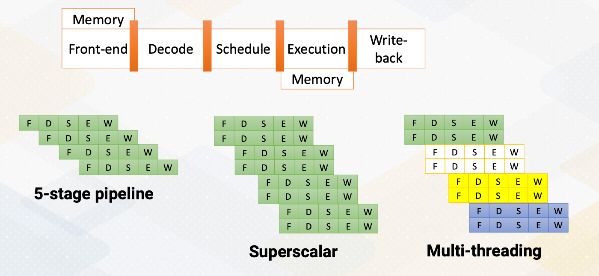

### Objectives

* Describe the basic backgrounds of GPU  
* Explain the basic concept of data parallel architectures  

### Readings

Required Readings:

* [CUDA Programming guide, section 1-2, section 4](https://docs.nvidia.com/cuda/cuda-c-programming-guide/index.html)
* [Performance analysis and tuning for general purpose graphics processing units (GPGPU) (Chapter 1)](https://galileo-gatech.primo.exlibrisgroup.com/discovery/fulldisplay?context=L&context=L&vid=01GALI_GIT:GT&vid=01GALI_GIT&docid=cdi_proquest_ebookcentral_EBC1092425&tab=default_tab&lang=en)

Optional Reading:
* [Patterns for Parallel Programming, Chapter 2](https://galileo-gatech.primo.exlibrisgroup.com/discovery/fulldisplay?docid=cdi_askewsholts_vlebooks_9780321630582&context=PC&vid=01GALI_GIT:GT&lang=en&adaptor=Primo%20Central)


### Module 1 Lesson 1: Instructor and Course Introduction

Course Learning Objectives:

* Describe how GPU architecture works and be able to optimize GPU programs
* Conduct GPU architecture or compiler research
* Explain the latest advancements in hardware accelerators
* Build a foundation for understanding the CUDA features (the course does not teach the latest CUDA features)

Course Prerequisites:

* Basic 5-stage CPU pipeline
* C++/Python Programming skill set
* Prior GPU programming experience is not necessary.

#### What is GPU? 

Have you ever wondered why GPUs are so relevant today? The answer can vary widely. While GPUs initially gained prominence in 3D graphics, they have since evolved into powerful parallel processors. Nowadays, GPUs are often associated with ML accelerators and high performance computing, showcasing their versatility. Let's briefly compare CPUs and GPUs. One key distinction lies in their target applications. CPUs are tailored for single threaded applications aiming for maximum speed. In contrast, GPUs excel in parallelism, handling numerous threads simultaneously. CPUs prioritize precise exceptions, crucial for program correctness and debugging. On the other hand, GPUs focus on parallel computation and don't prioritize precise exceptions as much. They leverage dedicated hardware for handling O/S and I/O operations, which naturally leads to that CPUs act as host and GPUs act as an accelerator.

### GPU ISA

ISA refers to instruction set architecture.

Let's touch on ISA. CPUs typically feature open ISAs, ensuring software compatibility across different hardware platforms. In contrast, GPUs operate in accelerator mode, with a driver translating code from one ISA to another for specific hardware. PTX was introduced to provide a public version of ISA, which is a virtual ISA. 

|    |      CPU      |  GPU |
|----------|:-------------:|------:|
|Target applications|Latency sensitive applications|Throughput sensitive applications|
| Support precise exceptions?|Yes|No|
|Host-accelerator|Host|Accelerator|
|ISA|Public or open|Open/Closed|
|Programming model|SISD/SIMD|SPMD|

Additional information:

* SISD - Single Instruction, Single Data
* SIMD - Single Instruction, Multiple Data
* SPMD - Single Program, Multiple Data

SIMD (Single Instruction, Multiple Data):

* Imagine a group of chefs in a kitchen, all performing the same chopping motion (instruction) on different vegetables (data) at the same time. That's SIMD!
* Strengths: Great for data-parallel tasks with repetitive operations on independent data elements. Think image processing, vector calculations, etc.
* Limitations: Requires data with consistent structure and can struggle with branching/conditional logic due to lockstep execution.

SPMD (Single Program, Multiple Data):

* Picture a team of artists, each working on a different section of the same painting (program) using their own techniques (data). That's SPMD!
* Strengths: More flexible than SIMD, able to handle diverse tasks with branching and conditional logic. Often used for algorithms with complex workflows and distributed computing across multiple processors.
* Limitations: May have overhead due to thread management and communication needs.

Lastly, the program model for CPUs primarily centers around single threaded or single data operations while GPUs employ the single program multiple data model emphasizing parallelism.

### Module 1 Lesson 2: Modern Processor Paradigms

Course Learning Objectives:

* Describe CPU design and techniques to improve the performance on CPUs


{: width='400' height='400'}

The foundation of CPU design consists of five stages; front-end, decode, rename, schedule, and execution.

* In the **fetch** stage, also called the front-end stage, instructions are fetched typically from an I-cache. In the decode stage, an instruction is decoded. In this stage, if this is an X86 instruction, a single instruction generates multiple micro uops.
* After instructions are **decoded**, typically registered files are accessed. 
* The **scheduler** selects which instructions would be executed. In an in-order processor, the scheduler selects instructions based on the program order. 
* For an **out-of-order processor**, it selects whichever ready to be excuted regardless of program order to find more ready instructions. 
* The **execution** stage performs actual computation or also access the memory. 
* In the **write- back** stage the result would be written back.
  
The above diagram illustrates the difference between a single issue processor versus superscalar processor. Superscalar processor enhances CPU performance by executing more than one instruction. They fetch, decode, and execute multiple instructions concurrently, effectively doubling performance. 

#### Increasing Parallelism (1)

There are several ways of increasing execution parallelism. Superscalar processor increases the parallelism by handling more than one instruction, which essentially increases **instruction level parallelism** (ILP). ILP is crucial for CPU performance, but it determines how many instructions can run in parallel. Processors seek independent instructions to improve ILP and overall efficiency. In the superscalar processor, IPC instruction per cycle would be greater than one.

#### Instruction Level Parallelism

If a machine has two execution units, how many instructions can be executed simultaneously? 

{: width='400' height='400'}

The slide shows two examples. In the first, two instructions are dependent, meaning they don't rely on each other's results. In this case, they can be executed concurrently, improving performance. In the second scenario, dependencies exist.

* Instructions are independent in case (a). Both instructions can be executed together.
* Instructions are dependent in case (b). Instruction #2 can be executed after instruction #1 is completed.
* Instruction level parallelism (ILP) represents parallelism.
* Out of order processor helps to improve ILP→find more independent
instructions to be executed
* Improving ILP has been one of the main focuses in CPU designs.

#### Increasing CPU Performance

There are two main approaches. First, a **deeper pipelines that increases a frequency**, but it requires a better branch prediction. Second, CPUs have **larger caches, which can reduce cache misses**, thereby reducing memory access time significantly.

#### Increasing Parallelism (2)

{: width='400' height='400'}

Another way of increasing parallelism is multi-threading. Multi-threading increase CPU performance by enabling multiple threads. By simply switching to another thread, it can examine more instructions that might be ready. Multi-threading is one of the key ingredients of high performance GPUs. Luckily, multi-threading does not require significant amount of hardware resource.

#### Multiprocessors 

{: width='400' height='400'}

Multiprocessors are another powerful way of increasing performance. It has many processors by increasing the entire resource. Multiprocessor techniques are commonly used in both CPUs and GPUs. In this video, we explored how CPUs can enhance their performance by optimizing insuction level parallesm, increasing operating frequency, and scaling the number of cores in the system.

### Module 1 Lesson 3: How to Write Parallel Programs

Course Learning Objectives:

* Describe different parallel programming paradigms
* Recognize Flynn’s classical taxonomy
* Explore a CUDA program example

#### Amdahl's law

Let's establish a fundamental concept in parallel programming known as Amdahl's law. Imagine it as the processor, can execute parallel task and we have many parallel processors. We can quantify this performance boost using the formula:

$$
\frac{1}{\frac{P}{N}+S}
$$

where P represents parallelism, S stands for the serial section, and the N is the number of processors involved.

{: width='400' height='400'}

Visualizing this, we see that we have ample parallelism is available and the serial sections are minimal. Our performance gains scale almost linearly with the number of processors at play. However, when serial sections get significant, the performance scalability takes a hit. This underscores the critical importance of parallelizing applications with  minimum serial sections and abundant parallelism. Even if you possess ample hardware resource, if a serial fraction exists, even 10%, it can impede your performance. 


#### What to Consider for Parallel Programming

When we can parallelize the work, we can use parallel processors. But how do we write effective parallel programs?

* Increase parallelism by writing parallel programs
* Let’s think of an array addition and find min/max value

#### Task decomposition

* One core performs addition.
* The other core performs min/max operation
* Array [A] has to be sent to both cores.

{: width='400' height='400'}


#### Data decomposition

* Split data into two cores
* Reduction operation is needed (both sum and min/max).

{: width='400' height='400'}

#### Flynn’s Classical Taxonomy

{: width='400' height='400'}

* SISD - Single Instruction, Single Data
* SIMD/SIMT - Single Instruction, Multiple Data / Thread
* MISD - Multiple Instruction, Single Data
* MIMD - Multiple instruction, Multiple Data

CPU Vs GPU:

* CPUs can be SISD, SIMD, and MIMD. 
* And GPUs are typically SIMT. 
  
The difference between SIMD and SIMT will be discussed later. Both fetches one instruction and operates multiple data. And CPU uses vector processing units for SIMD. And GPU have SIMT with many ALU (arithmetic logic unit) units.

Let's look for another terminology, **SPMD Programming**, Single Program Multiple Data Programming. GPUs for instance favor SPMD, single program multiple data programming.

* All cores(threads) are performing the `same work` (based on same
program). But they are working on `different data`.
* Data decomposition is the typical programming pattern of `SPMD`.
* `SPMD` is typical GPU programming pattern and the hardware’s execution model is `SIMT`.
* `GPU` programming uses SPMD programming style which utilizes `SIMT` hardware.

To exemplify SPMD, let's take a look at a CUDA program example. CUDA program has host and kernel. And here we'll focus on the kernel code which runs on GPU device. The sum of array is also done by the following code. Each thread runs on the GPU, performing a specific task, which is adding its own value to the Array A. Thread IDs differentiate the task and all execute in parallel.

```cpp
vector_sum() {
index ; // differentiate by thread ids
sum += A[index]; }
```

All cores(threads) are executing the same vector_sum().

### Module 1 Lesson 4: Introduction to GPU Architecture

Course Learning Objectives:

* Gain a high-level understanding of GPU architecture
* Describe key terms including “streaming multiprocessors” and ”warp” and “wave-front”
 
#### GPU Architecture Overview

{: width='400' height='400'}

* Each core can execute multiple threads.
* CPU Cores are referred to as “ streaming multiprocessors (SM)” in NVIDIA term or SIMT multiprocessors
* Stream processors (SP) are ALU units, SIMT lane or cores on GPUs.
* In this course core ≠ stream processor

This slide shows an overview of GPU architecture. A GPU is composed of numerous cores, each can execute multiple threads. These cores work in harmony to handle complex task. The concept of  CPU cores is more on streaming multiprocessor inside one SM you will find various components including an instruction cache decoder, shared memory, and multiple execution units referred to as stream processors in GPU terminology. These stream processors are essentially one SIMT lane or ALU and it is called cores on GPUs. To reduce the confusion between CPU cores and GPU cores in this course we will not refer SIMT lane as a core.

#### GPU Pipeline

{: width='400' height='400'}

This slide shows a GPU pipeline.

* This stage include the fetch stage
  *  where each work item is fetched and 
  *  multiple pieces registers are used to support multi threaded architectures.
  *  These are various schedulers such as the round-robin scheduler 
  *  or the more sophisticated greedy scheduler which  selects task based on the factors like cache miss or branch predictions.
*  The decode stage processes, the fetched instructions, and
*  the register values are read. 
*  Schedulers or score boarding select ready warps. 
*  Those selected warps would be executed by execution unit and
*  then the result would be written back.

#### Execution Unit: Warp/Wave-front

In this course warp and the wavefront would be used interchangeably.

Multiple threads are forming what's known as a **warp or wave-front which is a fundamental unit of execution and consists of multiple thread**. A single instruction is fetched per warp and multiple threads will be executed. In the world of micro architecture, the term warp size is pivotal. It has remained constant at 32 for an extended period but this can be changed in future.

{: width='400' height='400'}

This diagram illustrates a warp execution. Here is a program which has multiple instructions and programmer specifies a number of threads for a kernel and we have SIMT execution unit and threads are grouped as a warp. 

{: width='400' height='400'}

For a given instruction when source operands are ready the entire warp will be executed. When another warp is ready, this will be executed , and another one. So programmers specify 12 threads and in this example the warp size is four threads. And the entire four threads are executed one at a time.

### Module 1 Lesson 5: History Trend of GPU Architechtures

Course Learning Objectives:

* Describe the evolution history of GPUs
* Describe the evolution of traditional 3D graphics pipelines

#### Traditional 3D Graphics Pipeline

{: width='400' height='400'}

* Traditional pipelined GPUs: separate Vortex processing and pixel processing units
* Programmable GPUs: introduction of programmable units for vertex/pixel shader
* Vertex/pixel shader progression to CUDA programmable cores (GPGPU)
* Modern GPUs: addition of ML accelerator components (e.g., tensor cores), programmable features.

Let's look at a traditional 3D graphics pipeline. In the early days, GPUs were born from the 3D graphics tradition where their primary role was to proceed 3D primitives provide as input. These primitives underwent various stages, including geometry processing, eventually generating in the creation of 2D primitives, which were then rendered into pixel on your screen. 

This pipeline formed the core of early GPU architectures. As GPUs evolved, so did their capabilities. The shaders, which were initially fixed function units, gradually became more programmable. This transformation paved the way for unified shader architectures, a hallmark of the Tesla architecture. With this innovation, GPUs became versatile tools capable of handling both graphics and general purpose computing tasks. 

The era of GPGPU programming had begun. GPGPU term was used to differentiate, to use GPU for general purpose computing. Nowadays, GPU are more widely used for other than 3D graphics. So this differentiation is not necessary. With each iteration of GPUs extended their capabilities further, Vertex and pixel shader gave way to more powerful cores such as tensor cores, aimed at accelerating tasks beyond traditional graphics processing. The application space for GPUs expanded dramatically, encompassing tasks like machine learning acceleration and more.

#### Programmable GPU Architecture Evolution

* `Cache` hierarchies (L1, L2 etc.)
* Extend FP 32 bits to `FP 64` bits to support HPC applications
* Integration of `atomic` and `fast integer operations` to support more diverse workloads
* Utilization of `HBM` memory (High bandwidth memory)
* Addition of smaller floating points formats (`FP16`) to support ML
workloads
* Incorporation of `tensor cores` to support ML workloads
* Integration of `transformer cores` to support transformer ML workloads

Programmable GPU architectures have evolved in various directions. First, it introduces L1 and L2 caches. It also increased the precision of polluting point from single precision 32 bit to double precision 64 bit to accommodate more high performance computing applications. It also introduces atomic and fast integer operations to support more diverse workloads. 

The introduction of high bandwidth memory, HBM, marked another significant milestone. HBM integrate into the GPU's memory subsystem offered unprecedented data transfer rates. GPUs leveraged this cutting edge technology to meet the demands of modern workload. To increase ML computation parallelism, it also supports a smaller floating point format such as FP16. It also adopts tensor core and transformer core to support ML applications. 

#### NVIDIA H100

Let's look at 2023's latest NVIDIA GPU architecture which is H100. 

* They support various precisions, FP32, FP64, FP16, Integer 8 and FP8 formats. 
* It also has tensor cores similar to previous generation of GPUs, and 
* introduced new transformer engine, ML cores, GPU cores, and tensor cores play pivotal roles in meeting the demands of modern ML applications. 
* Increased capacity of large register files
* Concepts like tensor memory accelerator promise even greater capabilities.
* Furthermore, the number of stream multiprocessor (SMs) and the number of floating point (FP) units keep increasing to provide more compute capability.
* On top of that, it uses NVIDIA NVLink switch system to connect multiple GPUs to increase parallelism even more.

<!--  -->