### Objectives

* Describe the basic backgrounds of GPU  
* Explain the basic concept of data parallel architectures  

### Readings

Required Reading:
* [Introduction to Parallel Computing tutorial](https://hpc.llnl.gov/documentation/tutorials/introduction-parallel-computing-tutorial)

Optional Reading:
* [Parallel programming patterns, Chapter 3,  Appendix A, Appendix B](https://galileo-gatech.primo.exlibrisgroup.com/discovery/fulldisplay?docid=cdi_askewsholts_vlebooks_9780321630582&context=PC&vid=01GALI_GIT:GT&lang=en&adaptor=Primo%20Central)


### Module 2 Lesson 1: Parallel Programming Patterns

Course Learning Objectives:

* Provide an overview of different parallel programming paradigms


#### How to Create a Parallel Application

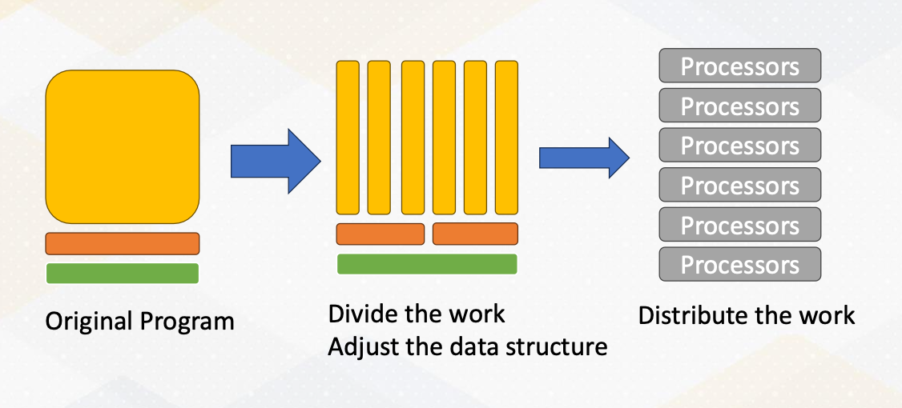{: width='400' height='400'}

The original program has many tasks. We divide the work and adjust the data structure to execute the task in parallel. Then we dispute the work to multiple processors

#### Steps to Write Parallel Programming

* Step 1, discover concurrency. 
  * The first step is to find the concurrency within your problem. This means identifying opportunities for parallelism in your task or problem. This is often the starting point for any parallel programming. 
* Step 2, structuring the algorithm. 
  * Once you've identified the concurrency, the next step is to structure your algorithm in a way that can effectively exploit this parallelism. Organizing your code is key to harnessing the power of parallelism.
*  Step 3, implementation. 
   *  After structuring your algorithm, it's time to implement it in a suitable programming environment. In this step, you choose which program language and tools to use. 
*  Step 4, execution and optimization. 
   *  With your code written, it's time to execute it on a parallel system. During this phase, you will also focus on fine- tuning the code to achieve the best possible performance.


#### Parallel Programming Patterns

There are five popular parallel programming patterns:

1. Master/Worker Pattern
2. SPMD Pattern (Single Program, Multiple Data)
3. Loop Parallelism Pattern
4. Fork/Join Pattern
5. Pipeline Pattern


#### Master/Worker Pattern

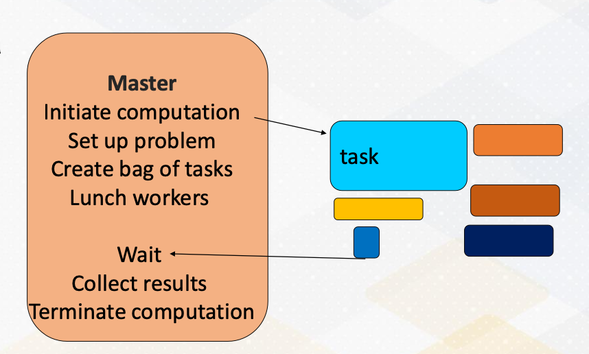{: width='400' height='400'}

First of all, we have the master worker pattern. It is single program and multiple data. There is a master process or thread which manages a pool of worker process/threads, and also a task queue. In this figure, orange box represents master threads. 

Then there are many workers and they execute tasks concurrently by dequeuing them from the shared task queue.

In this figure, different color boxes show worker threads who execute different tasks. This master/worker pattern is particularly useful for the task that can be broken down into smaller independent pieces.

#### Loop Parallelism PAttern

```cpp
for (i = 0; i < 16; i++)
  c[i] = A[i]+B[I];
```

Next, loop parallelism pattern. Loops are a common and excellent candidate for parallelism. What makes them appealing for parallel programming is that many loops involve repetitive independent iterations. This means that each iteration can be executed in parallel. Another note is that unlike master/work pattern, tasks inside the loops are typically the same. 

#### SPMD Pattern

Single program, multiple data

Now let's talk about SPMD programming pattern. SPMD stands for single program multiple data. In this approach, all processing elements execute the same program in parallel, but each has its own set of data. This is a popular choice, especially in GPU programming.

#### Fork/Join Pattern

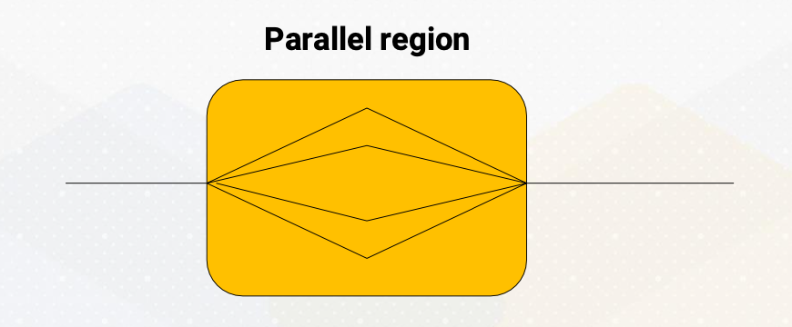{: width='400' height='400'}

The fourth paradigm is the fork/join pattern. Fork/join combines both serial and parallel processing. Parent task create a new task which is called fork, then wait for their completion which is called join before continuing with the next task. This pattern is often used in programming with a single entry point.

#### Pipeline Pattern


Finally, let's explore the pipeline pattern. The pipeline pattern resembles a CPU pipeline where each parallel processor works on different stages of a task. It's an ideal choice for processing data streams. Examples include: signal processing, graphics pipelines, and compression workflows, which consist of decompression, work, and compression.

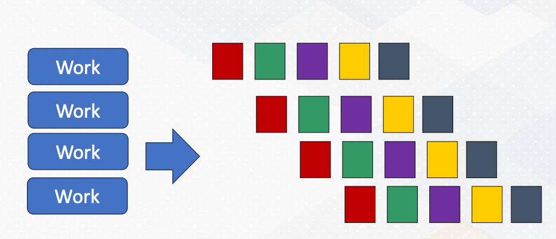{: width='400' height='400'}

This animation illustrates a pipeline programming pattern. Each color represents different pipeline stages. Data work is coming continuously, and by operating different work, it provides parallelism.

### Module 2 Lesson 2: Open MP vs. MPI (Part 1)

Explore shared memory programming, distributed memory programming, and take a closer look at the world of OpenMP.

Course Learning Objectives:

* Explain the fundamental concepts of shared memory programming
* Describe key concepts essential for shared memory programming
* Explore the primary components of OpenMP programming

#### Programming with Shared Memory

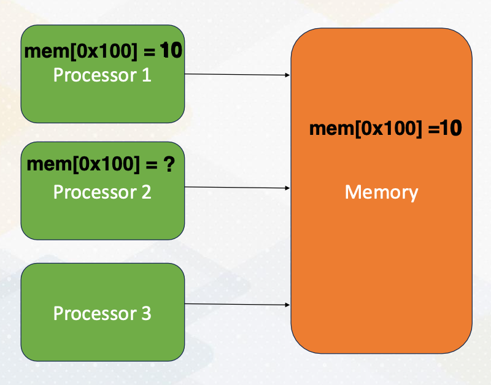{: width='400' height='400'}

Let's start by understanding shared memory programming, a core concept in parallel computing. In shared memory systems, all processors can access the same memory. The following animation illustrates the steps. First, processor 1 updates a value, then processor 2 can observe the updates made by processor 1, by simply reading values from the shared memory.

#### Programming with Distributed Memory

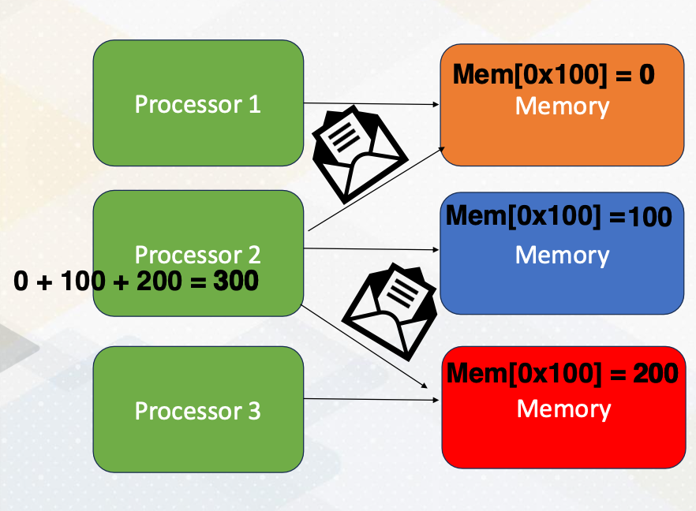{: width='400' height='400'}

Now let's just switch gears and explore programming with distributed memory. Unlike a shared memory system, in distributed memory systems, each processor has its own memory space. To access data in other memory space, processors send messages as the following. The same memory address is located in three different memory systems. Processor 2 requests messages from processor 1 and processor 3. Each processor sends data 0 from processor 1, and 200 from processor 3. The updated data are sent by messages, then the processor performs additions using the updated value. Then the updated value will be written back to the memory. 

#### Overview of Open MP

Before we dive deeper into shared and distributed memory, let's get an overview of OpenMP. OpenMP is open standard for parallel programming on shared memory processing system.

OpenMP is a collection of compiler directives, library routines, and environment variables to write parallel programs.


#### Key Tasks for Parallel Programming

Here are the key tasks for parallel programming:

* parallelization, 
* specifying threads count, 
* scheduling, 
* data sharing, 
* and synchronization.

#### What is Thread?

We'll go over these concepts. First, let me provide a little bit of background on thread, which plays a pivotal role in parallel computing. What is thread? Thread is an entity that runs on a sequence of instructions.

Another important fact to know is that a thread has its own register and stack memory. So is thread equivalent to core? No, thread is a software concept. One CPU core could run multiple threads or just a single thread. Please also note that the meaning of thread is different on CPUs and GPUs. 

#### Review: Data decomposition

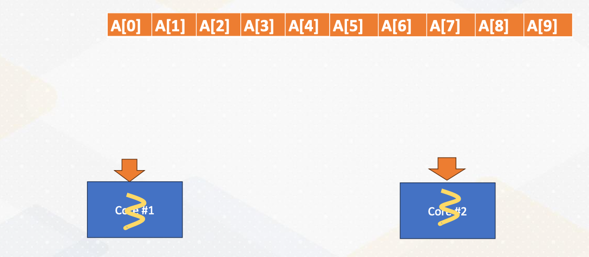{: width='400' height='400'}

Let's review data decomposition, which we saw in Module 1. Let's decide we want to use data decomposition method. Here we have a 10 element array. An array is split into two cores. 


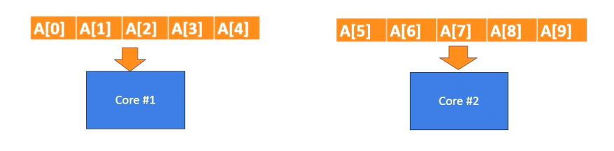{: width='400' height='400'}

The half of the data is sent to core 1, and the remaining half of the data is send to core 2 and they will be executed in parallel. In practice, modern CPUs can execute multiple threads within one core. However, for simplicity, we assume that one core executes one thread in this illustration. 

#### Example: Vector sum

```c
int main() {
  const int size = 10; // Size of the array int data[size];
  int sum = 0;
  for (int i = 0; i < size; ++i) { 
    sum += data[i];
    }
  std::cout << "Sum of array elements: " << sum << std::endl;
  return 0; 
  }
```

Here is a serial version of vector sum code. We have a for loop which iterates from 0 to 10 and then computes the sum of the elements.

#### Manual Parallelization processes

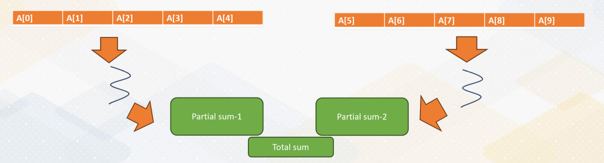{: width='400' height='400'}

This slide shows the actual parallelization steps. In the first step, we create two threads. In the second step, we split the array into two and give a half array to each thread. In the third step, we merge two partial sums. One of the challenges is how to merge values by two threads. This merge is one of the reduction operations.

#### Reduction Operation in Shared Memory

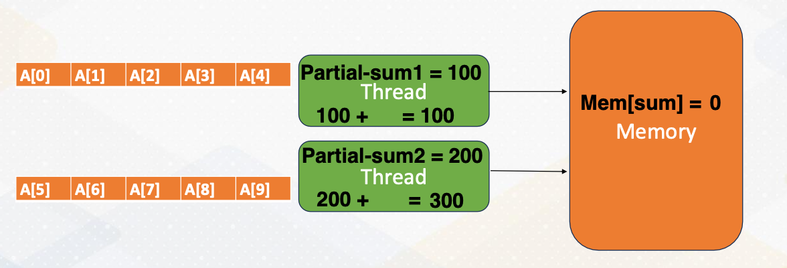{: width='400' height='400'}

Let's look at reduction operation in shared memory in detail. First, each thread computes partial sum. The one thread updates the total sum value in one memory. The memory gets updated. The other thread reads updated value from the memory, and then adds the partial sum into the total sum and updates total value in the memory. In this process, we need to make sure only one thread updates the total sum in the memory that can be handled by Mutex.

#### Mutex Operation

What is Mutex? Mutex, mutual exclusion ensures only one thread can access a critical section of code at a time. 

* What if both threads try to update the total sum. 
  * In previous example Some would be either 100, or 200 instead of 300.
*  We need to prevent both threads from updating the total sum variable in the memory because the sum variable is a `shared data`.
*  Updating shared variable is `critical section of code`.
*  **Mutex** ensures only **one thread** can access critical section of code. First, we use a **lock, which is acquiring a Mutex** to enter the critical section. 
*  After completing a critical section, it **unlocks which is releasing a mutex** so others are allowed to access the critical section.

#### Low Level Programming for Vector Sum

If we do this work using low level programming such as p-thread, it requires manual handling of thread creation, joining and Mutex operations.

#### Vector Sum in OpenMP

```c
#include <iostream> 
#include <omp.h>
int main() {
  const int size = 1000; // Size of the array int data[size];
  // Initialize the array
  int sum = 0;
  # pragma omp parallel for reduction(+:sum)
  for (int i = 0; i < size; ++i) { 
    sum += data[i];
  }
  std::cout << "Sum of array elements: " << sum << std::endl; 
  return 0;
}
```

Luckily, this step can be simplified by using OpenMP APIs. All we need to do is adding `pragma omp parallel for reduction +sum`. Parallel for invokes loop parallelism in pattern. It generates multiple threads automatically. 

#### pragma omp parallel for reduction(+:sum)

What is reduction + sum? 

* It is a compiler directive which is the primary construct. 
* It works for C/C++, or Fortran which is used widely in HPC applications. 
* Compiler replaces directives with calls to runtime library. 
* Library function handles thread, create/join. 
* The semantics are ` #pragma omp directive [ clause [ clause ] ... ]`.
  * Directives are the main OpenMP construct. For example, `pragma omp parallel` for Clause provides additional information such as `reduction (+:sum)`
* Reduction is commonly used, so it has a special reduction operation. 


### Module 2 Lesson 3: Open MP vs. MPI (Part 2)

We will describe key components of both OpenMP and MPI programming.

Course Learning Objectives:

* Extend your understanding of the concept of scheduling in OpenMP
* Describe key components of OpenMP and MPI programming

#### How many Threads?

The following for loop will be executed in parallel by the number of threads. Then the question is, can you control this number? 

```c
#pragma omp parallel for reduction(+:sum)
for (int i = 0; i < size; ++i) { 
  sum += data[i];
}
```

The answer is yes. You can specify the number of threads using the environment variable, `OMP_NUM_THREADS` By default, this number is the same as the hardware parallelism, such as the number of cores. Alternatively, you can use the `omp_set_num_threads()` function to define the number of threads directly within your code.


#### Scheduling

Now, let's tackle another important concept of a scheduling within parallel programming. Imagine a scenario where you have a vector of one million elements and you want to distribute this work among five threads, but you only have two cores. How do you ensure each thread makes progress evenly?

We probably want to give 200k elements to each thread. This works well if each thread can make the same progress. But what if each thread makes a different progress? Why would this happen? Because we have allocated a total of five threads. Here is the interesting part. One core has three threads while the other core has only two threads.

As a result, the three threads on one core would have significantly fewer resources compared to the case where each core has an equal number of threads.

#### Static Scheduling/Dynamic Scheduling


To address the challenges of uneven progress among thread, we have various scheduling options.

* Option 1 (static scheduling): still give 200K elements to each thread
  * in the first option known as static scheduling, we continue to allocate a consistent chunk of work to each thread. We will give 200k elements to each thread. This approach assumes that each thread will make roughly the same progress. 
* Option 2 (dynamic scheduling):  give 1 element to each thread and ask it to come back for more work when the work is done
  *  this option takes a different approach. In this scenario, we give just one element to each thread initially and allow them to come back for more work when they finish processing their assigned element. This dynamic nature allows threads to request additional work as needed, ensuring efficient resource utilization. This is called dynamic scheduling.
* Option 3 (dynamic scheduling): give 1000 elements to each of them and ask it to come back for more work when the work is done
  * asking more work for every element becomes too expensive. So in the third option, we initially allocate larger chunks of work saying 1,000 elements to each thread. As with Option 2, threads can return for more work once they complete their assigned portion. This approach aims to strike a balance between granularity and efficiency. 
* Option 4 (guided scheduling - chunk size varies over time): initially give 1000, but later start to give only 100 etc.
  * lastly, we have a guided scheduling where we start with the larger chunk sizes such as 1,000 elements, but progressively decrease the chunk size over time. This approach adapts to the run time conditions, ensuring that threads with varying progress rates can efficiently utilize resources. For example, if some threads finish faster, they receive larger chunks, while slow threads get smaller chunks.

Giving one element or 1,000 elements refers to different chunk sizes. And in guided scheduling, which is option 4, chunk size varies over time. Each of these scheduling options offer distinct advantages and trade-offs. The choice depends on the specific workload and the dynamic nature of the threads progress. By selecting the most suitable scheduling option, we can optimize resource utilization and overall program efficiency. Dynamic scheduling can adopt run time effect (maybe some threads got scheduled to an old machine etc.)

#### Data Sharing

Now let's shift our focus to data sharing, an essential consideration in parallel programming. Data sharing involves distinguishing between private and shared data. While partial sums are private data. The overall sum is shared among thread. And it's crucial for programmers to specify data sharing policies. 

#### Thread Synchronization

Thread synchronization is another critical aspect of parallel programming. It ensures correct execution. Barrier, critical section and atomics are examples of thread synchronization.

#### Barrier

A common synchronization construct is the barrier which is denoted by `#pragma omp barrier`. It ensures that all participating threads reach a specific synchronization point before proceeding. This is crucial for tasks like that have dependencies between tasks such as sorting and update. 

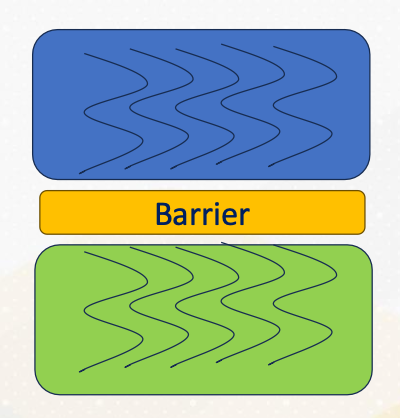{: width='400' height='400'}
* Synchronization point that all participating threads reach a point
* Green work won’t be started until all blue work is over.

#### Critical Section


```c
#pragma omp critical [(name)] 
  // Critical section code 
```

Critical section should only be updated by one thread at a time. They play a vital role in preventing data race conditions. For example, incrementing a counter. This can be done by denoting `#pragma omp critical [(name)]`.

```c
#pragma omp parallel num_threads(4) { 
  #pragma omp critical {
      //critical section code
  } 
}
```

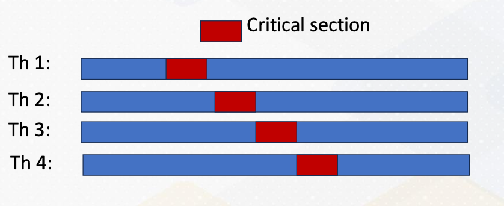{: width='400' height='400'}

As the following code example shows, critical section code is guarded by pragma omp critical directives. Even though there are four threads, only one thread would enter the critical section as illustrated in the above diagram. The red color represent critical section and only one thread enters the critical section. We have already studied mutex to perform this type of critical sections.

#### Atomic

Let's explore atomic operations in OpenMP, denoted by `#pragma omp atomic`.

These operations guarantee that specific tasks are performed atomically. Meaning that they either complete entirely or not at all. For instance, consider incrementing a counter. Here is a code example.

```c
#pragma omp parallel for
for (int i = 0; i < num_iterations; ++i) {
  #pragma omp atomic counter++;
  // Increment counter atomically
}
```

Counter value is incremented with atomic. Incrementing a counter requires loading the counter value, adding and storing, which are three different operations. Atomic operations ensure that all these three operations will happen altogether or none of them. Thereby, counter value is incremented by only one thread at once. These operations are vital for safeguarding data integrity and avoiding data race conditions. They can be implemented using Mutex or hardware support, depending on the specific scenario. 

#### Parallel Sections

Sometimes work needs to be done in parallel, but not within a loop. How can we express them? 


```c
#pragma omp parallel sections 
{
  #pragma omp section
  {
  // work-1
  }
  #pragma omp section
  {
  // work-2
  }
}
```

To address this, openMP provides the section directives. The code shows an example. Work 1 and work 2 will be executed in parallel. This directive can be combined with other constructions ordered or single. Work specified within sections can be executed in parallel. They are very useful with various programming patterns.

#### Example of Parallel Sections: Ordered

```c
#pragma omp parallel 
{
  #pragma omp for ordered
  for (int i = 0; i < 5; i++) {
    #pragma omp ordered 
    {
      // This block of code will be executed in order
      printf("Hello thread %d is doing iteration %d\n", omp_get_thread_num(), i); 
      }
    }
  }
```


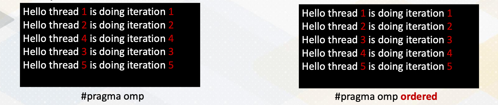{: width='400' height='400'}

Here is an example demonstrating the orderered construct within parallel sections. It ensures that threads are executed as an ascending order in the left side without ordered construct, threads are executed out of order. In the right side with ordered construct, threads are printing messages in order.

#### Example of Parallel Sections: Single


```c
#pragma omp parallel 
{
  #pragma omp single 
  {
    // This block of code will be executed by only one thread
    printf("This is a single thread task.\n"); 
  }
  // Other parallel work... 
}
```

Similarly, the single construct within parallel sections ensures that only one thread executes the specified task (no exception about which thread will do). It's useful for scenarios where no specific thread is expected to perform the work by only one thread. This can be used for different tasks such as initialization. So in this example, we see only one single printf message.


### Module 2 Lesson 4: Programming with MPI

Course Learning Objectives:

* Describe fundamental concepts of distributed memory parallel programming
* Gain understanding of MPI (Message Passing Interface) programming


#### Why Study OpenMP and MPI?

You might be wondering, why do we need to study OpenMP and MPI. Well, the answer lies in the complexity of GPU programming. CUDA programming combines elements of shared memory and distributed memory programming. Some memory regions are shared among all cores, while others remain invisible and need explicit communications.

#### MPI Programming

Now let's dive into MPI programming. MPI, or Message Passing Interface, is a powerful communication model for parallel computing. It allows processes to exchange data seamlessly.

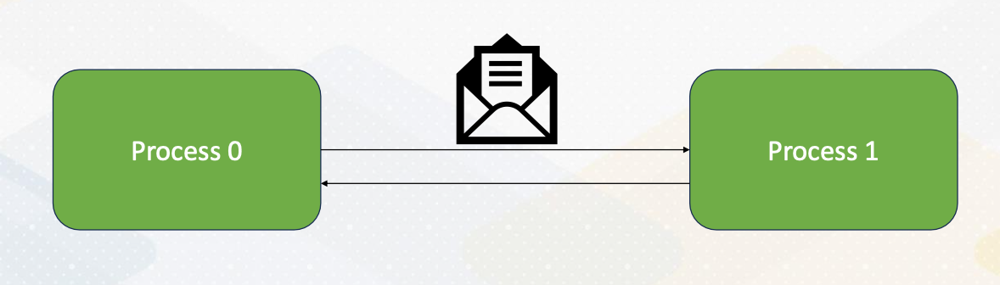{: width='400' height='400'}

Here the diagram illustrates that Process 0 sends an integer value to Process 1 using `MPI_send()` And Process 1 receives the value sent by Process 0 using `MPI_recv()`.

#### Broadcasting

MPI provides various communication functions, and one of them is `MPI_Bcast()` or broadcast. This function allows you to broadcast data from one process to all other processes in a collective communication manner. It's a valuable tool for sharing information globally.

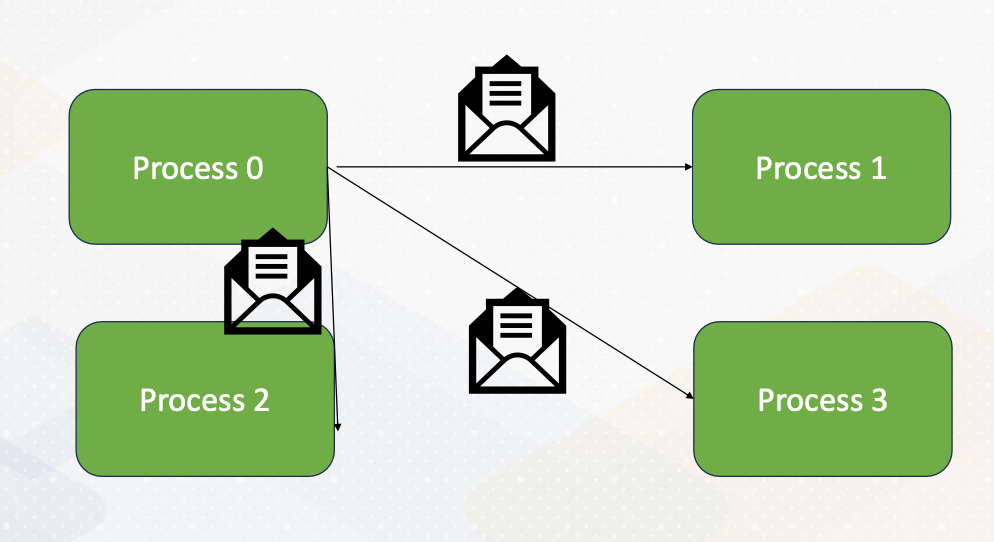{: width='400' height='400'}


#### Stencil Operations


To give a more explicit example of message passing, here we take a look at stencil operations, which is common in HPC, High-Performance Computing.

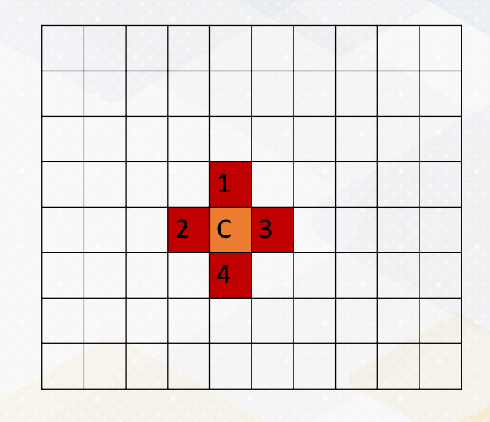{: width='400' height='400'}

This involves computations with the neighborhood data. For example, in this diagram, computing c is the average of 4 neighborhood, and we want to apply this operation to all elements in a dataset.

#### Stencil Operations (cont'd)

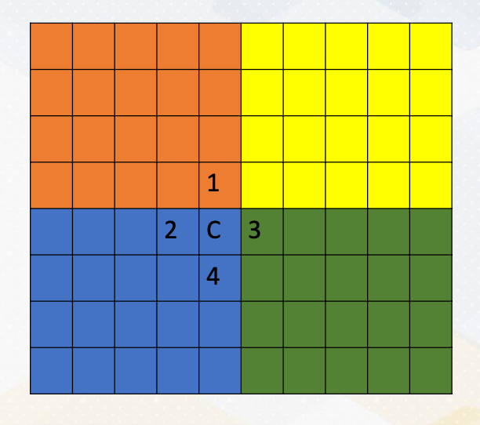{: width='400' height='400'}

Let's assume that:
* we want to compute the stencil operation with the four processes in the distributed memory systems. 
* It's important to note that in MPI, each process can access only its own memory regions.
* But what happens when you need to compute C, which requires access to data in other memory regions? This is where the challenge arises. (For example C where it requires numbers from orange and green area)


#### Communicating Boundary Information

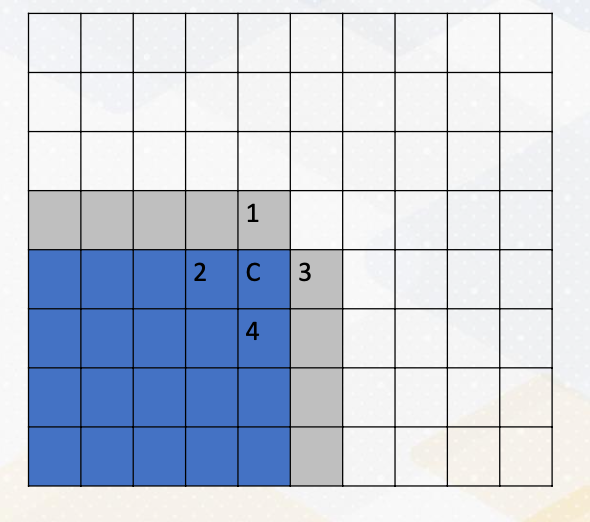{: width='400' height='400'}

To overcome the challenge of computing C, we need to communicate boundary information, which is the gray color in this diagram. This means sending data from one process to another using messages. It's a crucial aspect of MPI programming, especially in scenarios where data dependencies span across processes.

<!--  -->