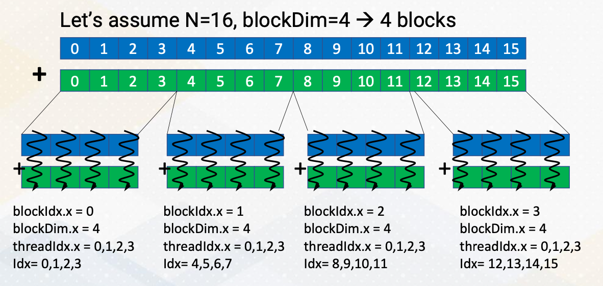
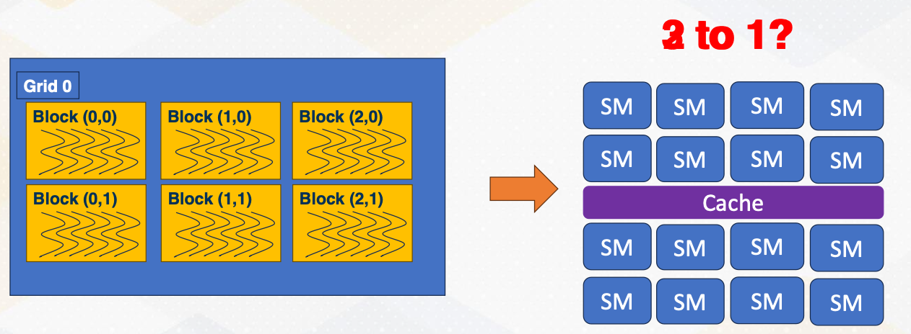

### Objectives

* Describe GPU programming basic  
* Be able to program using CUDA  

### Readings

* [CUDA Programming guide, Section 3](https://docs.nvidia.com/cuda/cuda-c-programming-guide/index.html)

### Module 3 Lesson 1: Programming with MPI

Course Learning Objectives:

* Write kernel code for Vector Addition
* Explain basic CUDA programming terminologies
* Explain Vector addition CUDA code example

#### Cuda Code Example: Vector Addition

Kernel code

```c
__global void vectorAdd(const float *A, const float *B, float *C, int numElements){
  int i = blockDim.x * blockIdx.x + threadIdx.x;

  if (i < numElements){
    C[i] = A[i] + B[i] + 0.0f
  }
}
```

Host Code

```c
int main(void) {
  // Allocate the device input vector A
  float *d_A = NULL;
  err = cudaMalloc((void **)&d_A, size);

  // copy the host input vectors A and B in host memory to the device input vectors 
  // in device memory

  printf("Copy input data from host memory to the CUDA device \n");
  err = cudaMemcpy(d_A, h_A, size, cudaMemcpyHostToDevice);
  vectorAdd<<<blocksPerGrid, threadsPerBlock>>>(d_A,d_B,d_C, numElements);

  // copy the device result vector in device memory to the host result vector in host memory
  printf("Copy output data from the CUDA device to the host memroy\n");
  err = cudaMemcpy(h_C, d_C, size, cudaMemcpyDeviceToHost);
}
```

Now let's take a look at the vector addition code example. This code shows both host code and kernel code. The host code, executed on the CPU sets up an environment such as reading data from file and setting memory. It also invokes the kernel to perform vector addition by using three angle brackets. When it calls the kernel, it also passes information such as the number of blocks per grid and threads per block as an argument using angle brackets. Kernel arguments are also passed d_A, d_B, d_C, and numElements. These are all vectorAdd  kernel arguments. This kernel code will be executed on the GPU, allowing for parallel processing. 


#### SPMD

Remember that GPUs execute code concurrently following single program multiple data SPMD paradigm.

{: width='400' height='400'}


In this program, four threads were executed in parallel, each printing the message "hello, I'm an OMSCS student" **without any specific ordering**. However, we need to make each thread execute different data.

#### threadIdx.x

{: width='400' height='400'}


To offload different tasks per thread, we must assign unique identifiers to each thread. These identifiers are represented by built-in variables such as `threadIdx.x`, which represents the x-axis coordinate. This way each thread operates on different elements, enabling parallel processing even with a single program. 

#### Vector Add with Thread Ids

```c
vectorAdd (/* arguments should come here */) {
  int idx= threadIdx.x; //* simplified version */
  c[idx] = a[idx] + b[idx]
}
```

{: width='400' height='400'}

Now, returning to vector addition, we notice that it utilizes `threadIdx.x`. Each thread accesses `a[idx]` and `b[idx]` and `idx` is determined by thread ID. Therefore, this approach ensures that each thread operates on different element with the vector enhancing parallelism.

#### Execution Hierarchy

CUDA introduces complexity beyond the warps, a group of threads involving hierarchical execution.

Threads are grouped into blocks, and these blocks can be executed concurrently. This might be very confusing initially, since we already discussed that a group of threads are executed together as a warp. Warp is a micro architecture concept. In earlier CUDA programming, programmers do not have to know about the concept of warp because it was a pure hardware's decision which we also call microarchitecture. Just note that in later CUDA, warp concept is also exposed to the programmer. 

However, block is a critical component of CUDA, 
* a group of threads form of block. 
  * Blocks and threads have different memory access scopes, which we will discuss shortly. 
* CUDA block: a group of threads that are executed concurrently.
* Because of the different memory scope, data is divided among blocks.
* To make it simple, let's assume that each block is executed on one streaming multiprocessor (SM). 
* There is no guaranteed order of execution among CUDA blocks.

#### Example of Data indexing

* `threadIdx.x`,`threadIdx.y`,`threadIdx.z`:threadindex 
* `blockIdx.x`, `blockIdx.y`: block index

```c
vectorAdd (/* arguments should come here */) {
  int idx= blockIdx.x * blockDim.x + threadIdx.x;
  c[idx] = a[idx] + b[idx]
}
```

{: width='400' height='400'}

Let's discuss an example where we divide 16 vector elements into four blocks. Each block contains four elements. ThreadId.x y z indicate thread index, similar to x, y, z coordinates. And blockId.x, y indicate block index, again similar to x and y coordinate. These indexes can be two dimensional or three dimensional and it can easily match with the physical size of images or 3D objects. To access all 16 elements, we combine block and thread IDs using block ID.x and threadId.x. 

In this example, we divide 16 elements with four blocks. and each block has four threads. Each thread has unique ids, from 0 to 3 and each block has a unique id from 0 to 3 as well. Using the combination of these CUDA block ids and thread ids, we should be able to generate element index, idx. Idx equals blockId.x times blockDim.x plus threadId.x. This is a typical pattern of indexing elements using block idx and thread idx.

#### Shared memory


{: width='200' height='200'}
*The green dot represents on chip storage*

Before we explore why this hierarchical execution is crucial, let's discuss shared memory. Shared memory serves as a scratch pad memory managed by software. It is indicated as `_shared_`, it provides faster access compared to global memory which resides outside the chip. Shared memory is accessible only within a CUDA block. Here is an example of CUDA that shows shared memory. 

```c
// CUDA kernel to perform vector addition using shared memory
__global__ void vectorAdd(int* a, int* b, int* c) {
__shared__ int sharedMemory[N]; // Each thread loads an element from global memory into shared memory
Int idx = threadIdx.x;
sharedMemory[idx] = a[idx] + b[idx]; // Wait for all threads in the block to finish loading data into shared memory
__syncthreads(); // Perform the addition using data from shared memory c[idx] = sharedMemory[idx];
}
```

#### Execution Ordering: Threads

{: width='400' height='400'}

This slide also illustrates the threads are executed in any order. The print message can be 4, 3, 2, 1 or 1, 3, 4, 2, or 1, 2, 3, 4 threads. 

#### Execution Ordering: Blocks

{: width='400' height='400'}

CUDA block execution also does not follow a specific order. 

* Blocks can execute in any sequence, such as ascending order in case 1,
* descending order in case 2, 
* and case 3, three blocks are executed together.

#### Thread Synchronizations

```c
__global__ void Kernel(){
// work-1
__synchthreads(); // synchronization 
// work-2
}
```

Since threads are executed in any order and can make progress with different speeds, to ensure synchronization among threads, we often use `__sync_threads()`, which synchronizes all threads until a specified point in the code. Interblock synchronization is achieved through different kernel launches. 

#### Typical Usage with Thread Synchronizations


The typical computation pattern involves loading data into shared memory, performing computations, and storing results. So load from the global memory to the shared memory, compute with the data in the shared memory, and then store the results into the global memory back. This programming model is called BSP, Bulk Synchronous Parallel.

```c
__global__ void Kernel(){
// Load to shared memory 
__synchthreads(); // synchronization 
// compute
__synchthreads(); // synchronization 
// store
}
```

{: width='200' height='200'}

All threads work independently and then it meets at the thread synchronization point. This slide also shows these three step computation example and also illustrates threads and thread synchronization. Due to potential data dependencies and threads can be executed in any order, thread synchronization is vital.

#### Kernel Lanuch

{: width='400' height='400'}

Now let's discuss kernel launch again. Kernel launch is initiated from the host code with three angle brackets and specifies the number of blocks and threads per block. The total number of threads in the grid is the product of these two values. Grid consists of multiple blocks and block is consisted of multiple threads. 

```c
int main() {
...
sortKernel <<<1 ,1,>>> (d_data, dataSize); // 1 Cuda Block & 1 Cuda Thread
addKernel<<<gridDim,blockDim>>>(d_data, d_data, d_result, dataSize); // gridDim x blockDim
storeKernel<<<1,1,>>>(d_result,dataSize);
...
}
```
Here in this example, it shows three different kernels, sort, add, and store to handle three different tasks. One more thing to note is that sort is done using only one thread. And then the main add computation is done with gridDim times blockDim, number of threads, and then store is also done with only one thread. Here is an example to show that multiple kernels can be used for different tasks with its grid and block dimensions. 

#### Memory Space and Block/Thread

{: width='400' height='400'}

Here is a summary of memory space and block/thread. Shared memory is available only within one CUDA block, and global memory is accessible by all blocks in a kernel. Local memory is only within a CUDA thread. Constant and texture are from 3D graphics. And constant memory is very small and stores very small amount of read only data such as the value of fhi. Texture memory is also read only but it also stores texture values. So it's structured for two dimensional accesses. For CUDA programmers, constant and texture memories are not widely used, so we will not discuss too much. 

Information sharing is limited across CUDA execution hierarchy. This is probably the crucial reason to have different execution hierarchy. Data in the shared memory is visible only within one CUDA, which means the data in the shared memory can stay only in one SM (cpu core). Which also means that data in the shared memory of one CUDA block needs explicit communication. And later we will discuss that CUDA also support thread block cluster to allow data sharing in the shared memory. 

### Module 3 Lesson 2: Occupancy

Course Learning Objectives:

* Explain the concept of occupancy
* Determine how many CUDA blocks can run on one Streaming Multiprocessor

#### How Many CUDA Blocks on One Stream Multiprocessor?

{: width='400' height='400'}

So far, we have assumed that each SM handles a single CUDA block, but the reality is much more complex. Multiple blocks can coexist on a single SM, but how many? Two blocks per SM or three blocks per SM? What decides this choice? 

#### Occupancy

How many CUDA blocks can be executed on one SM can be decided by the following factors.
* Number of registers, 
* shared memory, and 
* number of threads. 

Exact hardware configurations are varied by GPU microarchitecture and different by each generation.

Let's take a closer look at one example. We will explore the example with 256 threads and 64 kilobyte of register files and 32 kilobytes of shared memory. 

* In the software side, each CUDA block has 32 threads and two kilobytes of shared memory, and each thread has 64 registers.
* If the occupancy is constrained by running number of threads, the total number of CUDA blocks per SM would be 256/32, which means eight CUDA blocks. 
* If the occupancy is constrained by the registers, it will be 64*1,024/64*32, which means 32 CUDA blocks. 
* If the occupancy is constrained by the shared memory size, it will be 32 kilobyte divided by 2 kilobyte equals 16 CUDA blocks. 
* So the final answer is the minimum of all constraints, so it will be 8 CUDA blocks per SM. 

#### Number of Threads Per CUDA Block

* Host sets the number of threads per CUDA block, such as threadsPerBlock:
  ```c
  kernelName<<<numBlocks, threadsPerBlock>>>(arguments);
  ```
* Set up at the kernel launch time
* When it launches the kernel, the number of registers per CUDA block can be varied. Why?     
  * Because the compiler sets how many architecture registers are needed for each CUDA block. This will be also covered later part of this course. 
  * In case of CPU, the number of ISA decide the number of registers per thread such as 32. But in CUDA, this number varies. 
* Shared memory size is also determined from the code. 
* For example, the code says `__shared__ int sharedMemory[1000];`. So in this case four byte times 1,000 equals 4,000 bytes. (Remember int is 4 bytes) So the occupancy is determined by these factors. 

#### Why Do We Care about Occupancy?


Then why does the occupancy matter? 

* This is because higher occupancy means more parallelism. 
* Utilization - Utilizing more hardware resource generally leads to better performance. 
* Exceptional cases will be studied in later lectures.

{: width='400' height='400'}

In case A, only one CUDA block runs on each SM, and each CUDA block has six threads. In case B, each SM can execute two blocks, but each block has only four thread. So total eight threads per block is running per each SM, which is actually more than case A.

* Case A - 4 * 1 * 6 = 24
* Case B - 4 * 2 * 4 = 32


### Module 3 Lesson 3: Host Code

Course Learning Objectives:
* Write the host code for vector addition operation
* Explain the management of global memory

#### Managing Global Memory

{: width='400' height='400'}

Recap, we have discussed that shared memory is visible within only CUDA block. And global memory is visible among all CUDA blocks. But this global memory is located at the device memory, which is not visible on CPU side because they are connected with I/O interface. Hence, there should be explicit APIs to manage device memory from the host side.

#### Managing Global Memory (cont’d)

{: width='400' height='400'}

In this vector code example, we see two APIs that manage global memory. `cudaMalloc` and `cudaMemcpy`. `cudaMalloc` allocates memory in the GPU. In this example, `cudaMalloc` allocates `d_A` with the size. `cudaMemcpy` transfers data between CPU and GPU, either using `cudaMemcpytoHostto` Device or `cudamemcpyDevicetoHost`.  Later lecture we will discuss using unified memory which eliminates the need for explicit data copies.


#### Review Vector Addition


Now this is a full vector addition code. In the left side we have a kernel code which is executed by individual threads on GPUs. And on the right side it shows a host code which is executed on CPUs.

### Module 3 Lesson 4: Stencil Operation with CUDA

Course Learning Objectives:

* Be able to write a stencil code with CUDA shared memory and synchronization

#### Recap: Stencil Operations

{: width='400' height='400'}

As we discussed in earlier videos, stencil operations are common operations in high performance computing. For example, here, C value is computed by simply averaging 4 neighborhood elements East, West, North, and South.

Each CUDA block performs different elements. Different color zones represent the area that is computed by each CUDA block. So this follows data decomposition programming pattern. Each thread handles one element of the stencil operation. And the operation will be fully parallel.

You also notice that one element will be used at least four times. So these are good candidates for caching, and since programmers know the exact pattern of reuse it is good to utilize the shared memory to store in an on-chip storage.

#### Stencil Operations: Operations Per Thread

Let's use the shared memory for stencil operation. As we discussed, typical way of using shared memory is three stages. 

* In the first stage, the processor loads data from global memory to the shared memory, on-chip storage. 
* In the second stage, the processor actually performs stencil operation.
* In the third stage, the processor writes the result back eventually to the global memory.
* Typically thread synchronizations are between Stage 1 and Stage 2 to make sure the computation is performed after all the shared memory is loaded from the global memory.

#### How about Boundaries?

Using shared memory exposes another problem. If you remember shared memory is only accessible within one CUDA block. If we divide the memory area by colors, each CUDA block can access its own color zone. However, to compute the value in C location, we need the element in Location 1 in red area, 3 in green area.

{: width='400' height='400'}


Hence, the way it works is each shared memory brings boundary elements as well, such as the following. This is a somewhat similar to MPI programming where explicit communications are needed for boundaries. Here in CUDA, we just simply bring boundary data to the shared memory. We can do that because we make sure those data is only read only data. Here we show an example of using shared memory for stencil operation. Please note that to make the example more simpler, we use a filter to compute stencil operation, which is similar programming style with convolutional operations.

```c
// Load data into shared memory
__shared__ float sharedInput[sharedDim][sharedDim];
int sharedX = threadIdx.x + filterSize / 2;
int sharedY = threadIdx.y + filterSize / 2;
```

#### Use if-else to Check Boundary or Not

Maybe it looks obvious, but it was not clearly mentioned earlier. Is that if-else statement can be also used in the CUDA programming. Depending on the position of x, y values, the program can also decide whether it brings the data from the global memory or it fills with zero. This is implemented with if-else statement to check whether thread ID is belonged to a certain range. 

The program has to create more number of threads than actual color zone and threads only within the inner element. The original color zone area performs computation. In other words, more threads are created to bring the data from the global memory to the shared memory. The bottom code example shows the actual computation snippet again, This code uses convolutional operation style to make the example have less if-else statements.

* Load different values on boundaries
```c
if (x >= 0 && x < width && y >= 0 && y < height) { 
  sharedInput[sharedY][sharedX] = input[y * width + x];
} else {
  sharedInput[sharedY][sharedX] = 0.0f; // Handle boundary conditions 
}
```

* Perform computations only on inner elements
```c
// Apply the filter to the pixel and its neighbors using shared memory 
for (int i = 0; i < filterSize; i++) {
  for (int j = 0; j < filterSize; j++) {
    result += sharedInput[threadIdx.y + i][threadIdx.x + j] * filter[i][j];
  }
}
```

<!--  -->