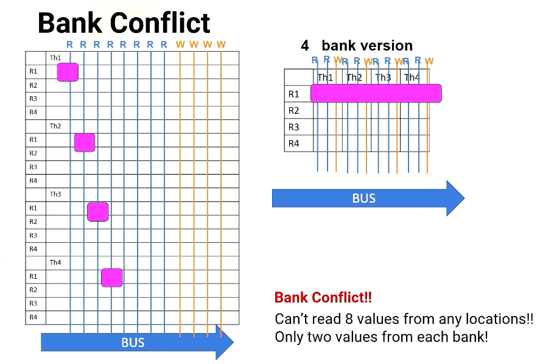
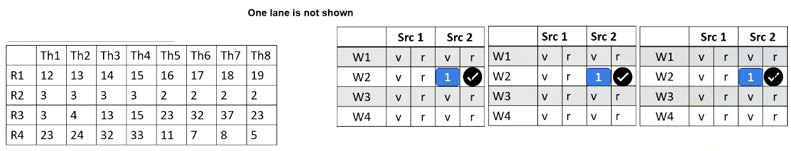
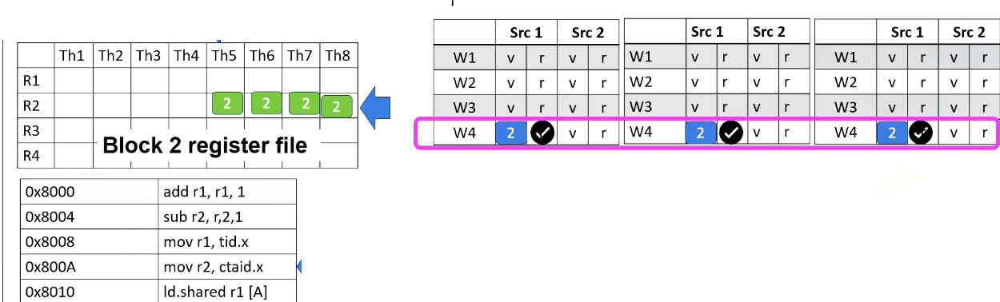

### Objectives

* Describe GPU microarchitecture  
* Be able to explain the basic GPU architecture terminologies 

### Readings

* [General-Purpose Graphics Processor Architectures ( Synthesis Lectures on Computer Architecture), Chapter 3](https://galileo-gatech.primo.exlibrisgroup.com/discovery/fulldisplay?context=L&context=L&vid=01GALI_GIT:GT&vid=01GALI_GIT&docid=alma9916162981502950&tab=default_tab&lang=en)

### Module 4 Lesson 1: Multi-threaded Architecture

Course Learning Objectives:

* Explain the difference between multithreading and context switch
* Describe resource requirements for GPU multithreading

In this module, we'll dive deeper into GPU architecture. Throughout this video, we'll explore the distinctions between multithreading and context switching in GPUs. We'll also discuss resource requirements for GPU multithreading. 


#### Recap: GPU 


{: width='400' height='400'}


Let's first recap the fundamentals of GPU architecture. 

* GPUs are equipped with numerous cores. 
* Each core features multithreading, 
  * which facilitates the execution of warp or wave front within the core. 
* Each core also has shared memory and hardware caches. 

#### Multithreading

{: width='400' height='400'}

Let's dive into multithreading. Imagine a GPU with a five stage pipeline and four instructions. In an ideal scenario, each instruction would proceed through the pipeline one stage at a time. However, in an in order processor, if an instruction has a cache miss, the following instructions have to wait until the first instruction completes. If you look carefully, the instruction 2 is not actually dependent on instruction 1. Hence, in an out of  order processor, instruction 2 doesn't have to wait.

{: width='400' height='400'}

So in an out of order processor, it starts to execute instruction 2 and 3 before instruction 1 completes. Once instruction 1 receives the memory request, instruction 4 can be executed. 

{: width='400' height='400'}

In multithreading, the processor just simply switches to another thread regardless of whether a previous instruction generates cache misses or not. Since they are from different threads, they're all independent. In this example, the processor executes four instructions from four different threads. Furthermore, the processor also generate four memory requests concurrently. 

#### Benefits of multithreading

To get the benefit of generating multiple memory requests, GPU utilize multithreading. Instead of waiting for stalled instructions, GPU start to execute instructions from another thread, allowing for parallel execution as well as more memory requests. 

* Multithreading's advantage is its ability to hide processor stall time, which is often contributed by
  * cache misses,
  * branch instructions or 
  * long latency instructions such as ALU instructions.
* GPUs leverage multithreading to mitigate such long latency issues. 
  * While CPUs employ out of order execution, cache systems, and instruction level parallelism (ILP) to tackle latency.
* Longer memory latency requires a greater number of threads to hide latency

#### Front-end Extension for Multithreading


The front end features multiple program counter (PC) values, each warp needs one PC register so supporting four warps requires four registers. It also has four sets of registers. So context switching in GPUs, means simply switching the pointer among multiple PC registers and register files.

{: width='400' height='400'}

#### CPU Context Switching

{: width='400' height='400'}

In contrast, CPUs implement context switches in a different way. When executing a thread, the instruction pipeline, PCs, and registers are dedicated to the specific thread.

{: width='400' height='400'}

If the CPU switches to another thread, for example, from T2 to T3, it stores T2's contents in memory and loads T3 content from the memory. 

{: width='400' height='400'}

Once it's done, it executes the original thread context. Context switches in CPUs incur substantial performance overhead due to the need to store and retrieve register contents from the memory.

#### Hardware Support for Multithreading

Now let's discuss the resourc e requirement for multithreading in more detail. 

* Front-end needs to have multiple PCs
  * One PC for each warp since all threads in a warp share the same PC 
  * Later GPUs have other advanced features, we'll keep it simple and assume one PC per warp.
* Additionally, a large register file is needed.
  * Each thread needs “K” number of architecture registers
  * total register file size requirement = K times $\times$ number of threads
  * “K” varies by applications
* Remember occupancy calculation?
  * Each SM (shared memory) can execute Y number of threads, Z number of registers, etc. 
  * Here, Y is related to the number of PC registers. So if the hardware has five PC registers, it can support up to 5 times 32, which is 160 threads. 
  * Z is related to K

#### Revisit Previous Occupancy Calculation Example

Let's revisit a previous example to calculate occupancy. If we can execute 256 threads, have 64 times 1024 registers and 32 kilobytes of shared memory, here 32 threads per warp is assumed. And then the question is how many PCs are needed? 
* The answer is 256 divided by 32, which is eight PCs. 

If a program has 10 instructions, how many times does one SM need to fetch an instruction? 
* The answer is simply put, 10 multiplied by 8 which is 80. 
                  
### Module 4 Lesson 2: Bank Conflicts

Course Learning Objectives:

* Explain SIMT behavior of register file accesses and shared memory accesses
* Describe techniques to enhance bandwidth in register and shared memory
accesses

#### CUDA Block/Threads/Warps

{: width='400' height='400'}


Let's revisit GPU architecture basics. In a GPU, multiple CUDA blocks run on one multiprocessor and each block has multiple threads. And a group of threads are executed as a warp. As shown in this animation, one warp  will be executed and then the other warp will be executed. Each thread in a warp needs to access the registers because the **registers are per thread**. Assume that each instruction needs to read two source operands and write one operand and the execution width is eight. In that case, we need to supply eight times three, two read and one write which is 24 values at one time.

#### Port vs Bank

Let's provide some backgrounds about ports and bank. Port is a hardware interface for data access. For example, each thread requires two read and one write ports. And if an execution width is a four, then there is a total of eight read ports and four write ports.

{: width='400' height='400'}

This figure illustrates eight read ports and four write ports per each register element. Read and write ports literally require wires to be connected. So it actually uses up quite a bit of space.

{: width='400' height='400'}

On the other hand, we can place register files differently and put only two read ports and one write port for each register element. This is called a four bank version which requires a much smaller number of ports.

What is a bank? Bank is a partition or a group of the register file. The benefit of bank is that multiple banks can be accessed simultaneously which means we do not need to have all read and write ports. We can simply have multiple banks with fewer read and write ports as shown in these diagrams. This is important because more ports means more hardware wiring, and more resource usage. 

#### Bank conflict

{: width='400' height='400'}
*Scenario #1: read R1 from T1,T2,T3,T4 (each thread on different banks)*

However, a challenge arises when multiple threads in a warp requires simultaneous access to the same bank, which causes bank conflict. For example, in Scenario 1, the processor needs to read R1 from thread 1, 2, 3, 4. And each thread register file is on different bank.

{: width='400' height='400'}
*Scenario #1: read R1 from T1,T2,T3,T4 (each thread on different banks)*

In no bank version it has eight read ports. So it can easily provide four read values, as does the four bank version, since all register file accesses are in different banks.

{: width='400' height='400'}
*Scenario #2: read R1, R2, R3, R4 from T1*

However, in Scenario 2, the processor has to read from R1, R2, R3, and R4. All are in the same thread or in the same bank. For 8 port version, no problem. It can read all four values simultaneously, but in the four bank version it can read only two values at a time. So it takes multiple cycles.


#### Variable Number of Registers per Thread


* Will Register File Have Bank Conflicts?
* Why do we worry about bank conflicts for registers? Don't we always need to access two registers from different threads anyway?


{: width='400' height='400'}

The challenge arise because CUDA programming will get benefits from different register counts per thread. Let's say that we want to operate instruction R3 = R1+R2. Here are two cases. 
* In the first case, four registers per one thread. 
* In the second case, two registers per one thread. And different colors means different banks.
* In Case 1, reading registers would not cause a bank conflict because each thr ead register file is located in a different bank. 
* However, in Case 2, read R1, R2 from multiple threads would cause a bank conflict because thread 1 and thread 2 are in the same bank. Same for Thread 3 and Thread 4. 
* Remember, GPU executes a group of threads (warp), so multiple threads are reading the same registers. Then how to overcome this problem? The first solution is using a compile time optimization.

#### Solutions to Overcome Register Bank Conflict

Then how to overcome this problem? The first solution is using a compile time optimization. The compiler can optimize code layout because register ID is known as static time.

#### Side Bar: Static vs. Dynamic

Let me just provide a little bit of background of static versus dynamic. In this course static often means before running code. The property is not dependent on input of the program. Dynamic means that the property is dependent on input of the program.

Here is an example. There is a code ADD and BREQ.

```
LOOP: ADD R1 R1 #1
    BREQ R1, 10, LOOP
```

Here is an example. There is a code ADD and BREQ. Let's say that this loop iterates 10 times. What would be static and dynamic number of instructions? Static number of instruction is 2, since this is what we see in the code, and dynamic number of instruction is 2 times 10 becomes 20. Also note that static time analysis means compile time analysis.

#### Solutions to Overcome Register Bank Conflict (Cont)

{: width='400' height='400'}

Going back to the solution to overcome register bank conflict, we try to use compile time analysis to change the instruction order or to remove bank conflict. But not all bank conflicts can be avoided.

So in a real GPU, GPU pipeline is more complex (beyond a 5-stage pipeline). First, register file access might take more than one cycle, maybe there is a bank conflict, or maybe because the register file might have only one read port, so the pipeline is actually expanded.

After value is read, the values are stored in a **buffer**. After that, scoreboard is used to select instructions. 

#### Scoreboarding

Scoreboard is widely used in CPUs to enable out of order execution. It is used for dynamic instruction scheduling.

However, in GPUs, it is used to check whether all source operands within a warp are ready and then it chooses which one to send to the execution unit among multiple warps. Possible policies is oldest first, and there could be many other policies to select warps.


#### Reading Register Values

{: width='400' height='400'}

Here is an example. Reading register files might take a few cycles. Ready register values are stored at a buffer. And this diagram shows the buffer and scoreboard.

{: width='400' height='400'}

Whenever a value is stored, it sets the ready bit. Here, Warp 1, src 1 is ready.

{: width='400' height='400'}

then Warp 2, src 2 is ready, 

{: width='400' height='400'}

then Warp 3, src 1, 

{: width='400' height='400'}

and then finally Warp 1, src 2 are ready.


{: width='400' height='400'}
{: width='400' height='400'}

When all values are ready, the scoreboard selects the warp, then the values are sent to the execution unit.


#### Shared Memory Bank Conflicts

Bank conflict can also happen in the shared memory on GPUs. Shared memory is on-chip storage and also scratch pad memory. Shared memory is also composed with banks to provide high memory bandwidth. Let's assume the following shared memory.

{: width='400' height='400'}

There are four banks and the number in a box represent memory addresses.

Here is a code which shows shared memory, shared input.

```
__shared__ float sharedInput[index1]; 
Index1= threadIdX.x *4
```

And the index to the shared memory is computed by simply multiplying threadIdX.x and 4. Which means that thread 1 needs to access memory address 4, and thread  2needs to access memory address 8, and thread 3 needs to access memory address 12, and so on. Unfortunately, all these addresses are all mapped to the same bank, so all threads will generate bank conflicts. The solution is changing the software structure, which we will cover more in later lectures.

In summary, in this video, we have learned the benefits of banks in register and shared memory. We have also studied the reasons of bank conflicts in register files and shared memory.

### Module 4 Lesson 3: GPU Architecture Pipeline

Course Learning Objectives:

* Describe GPU pipeline behavior ith multithreading and register file access
* Explain how mask bits are used.

#### GPU Pipeline (1)

{: width='400' height='400'}

Here is a GPU pipeline. 

{: width='200' height='200'}

Here it shows PC values for each warp. In this example, there are four warps, and the first warp should fetch from PC value 0x8000 and the first warp is from Block 1 and threads 1-4. The second warp is from Block 1 as well and threads 5-8. The third warp is from Block 2 and threads 1-4, and fourth warp is Block 2 threads 5-8. 

{: width='200' height='200'}

Here it shows register values for Block 1.

{: width='200' height='200'}

Here it shows an I-cache memory address and the instructions. You see `tid.x` at 8008. Tid.x is a special register to store thread ID within a block. And an instruction at 8000A has a `ctaid`, which is another special register to store block ID within a grid.

{: width='400' height='400'}

And here is a scoreboard. Okay, the front end fetches an instruction from 8000. Only one instruction is fetched for entire warp. Add r1, r1, 1. 

{: width='400' height='400'}

This instruction is brought to the front end, and then it is sent to the decode stage, and it will be decoded. Since the instruction itself has a constant value or immediate value 1, the value 1 will be broadcasted to the scoreboard.

{: width='400' height='400'}

So all source 2 operands are ready for the warp 1. And in the register file access stage, we access the source register 1, which is r1 for thread 1, 2, 3, 4. And values are read and sent to the scoreboard. So now, the processor checks the instruction and sees that all the source operands are ready, so this warp is selected. 

{: width='400' height='400'}

The warp is sent to the execution stage and it performs the additions, and the final result will be written back to the register file at the right back stage.

#### GPU Pipeline (2)


{: width='400' height='400'}

Now let's look at the second warp. It fetches an instruction from warp 2 which is Block 1 and thread 5-8. Again, the instruction is decoded, the constant value 1 is broadcasted to all source operand buffers. Here we omit the values for one execution unit due to the space limitation.

{: width='400' height='400'}

In the next stage, the processor accesses the register file and reads value r2 from thread 5-8. In this example, all source  values are all two. Now all source operands are ready, so the scheduler select Warp 2 and they will be executed even though they are all operating in the same values.

{: width='400' height='400'}

The hardware performs the same work for all thread in a warp, in the subtractions and perform 2 minus 1. And then the result will be written back at the write back stage just like the previous example. They will update the register values for thread 5-8.

#### GPU Pipeline (3)

{: width='400' height='400'}


Now let's assume the processor fetches from warp 4. The PC address is 8000A, which moves `ctid.x` to r2, The warp 4's block ID is 2, so `ctid.x` value is also 2. `Ctaid.x` value is read and stored inside the scoreboard. These values will be stored to r2 at the write back stage as shown in this animation.

#### GPU Pipeline (4)

{: width='400' height='400'}

Now, let's assume that instead of 8000A, the processor fetches from 8008 for warp 4. The instruction has `tid.x`. Since this is for threads 5-8, `tid.x` values will be 5, 6, 7, and 8. The `tid.x` values will be read and stored in the scoreboard, and in the write back stage, all these values will be written back to r1 as shown in this animation.

#### Mask bits

What if we do not need to execute r4 threads? GPU stores information, tells which thread or lane is active. One ALU execution path is called lane.

{: width='400' height='400'}

Active thread performs actual computation and inactive thread will not do any work. Mask bits tell which threads are active or not. Here scoreboard shows register values and ready bits. Warp 1 has 1111 in the mask bit, which means all threads in the warp 1 will actually perform the work. Warp 1 is selected and is executed. In the warp 2 case, the mask bit is 1110, so only the first three lanes or first three threads will do the work. 

In summary, in this video we have reviewed the GPU pipeline's instruction flow. We also studied the use of special registers for thread ID and block ID. The concept of active mask for identifying active SIMT lanes is also introduced in this video.


### Module 4 Lesson 4: Global Memory Coalescing

Course Learning Objectives:

* Explore global memory accesses
* Explain Memory address coalescing
* Describe how one warp can generate multiple memory requests

Let's look at more on global memory coalescing. In this video, we'll explore global memory accesses. You should be able to explain memory address coalescing and you should be able to describe how one warp can generate multiple memory requests. 

#### Global Memory accesses

{: width='400' height='400'}

Here the slide illustrates GPU and DRAM. In GPU architecture, one memory instruction could generate many memory requests to DRAM because one warp can generate up to 32 memory requests if we assume warp size is 32. So the total number of memory requests can easily be a larger number. For example, if we have 32 SMs and each SM has one warp to be executed, 32 times 32 In other words, 1024 requests can be generated in one cycle. Each memory request is 64 byte, so 64 kilobyte per cycle, and if we assume one GHz GPU, 64 terabyte per second memory bandwidth is needed.


#### Side Bar: DRAM vs. SRAM

{: width='400' height='400'}


Let me briefly provide a background on DRAM and SRAM. SRAM is composed of six transistors and combining multiple one bit SRAM cell makes SRAM, and SRAM is commonly used in caches. On the other hand, DRAM is composed of one bit transistor and DRAM chip has many one bit DRAM cells. Since each bit requires only one bit DRAM, DRAM can provide a large capacity but all communication in the DRAM chip require pins to communicate which can be a limiting factor.

HBM overcomes this problem. First, by stacking DRAM, it provides much higher density of DRAM. Then, by connecting memory with GPUs using silicon interposer, it avoids off chip communication. So all communications between GPU and DRAM are all inside the same package. Hence, HBM provides a significant amount of memory bandwidth.


#### Memory Coalescing

Even if the memory can provide high memory bandwidth, reducing memory request is still critical to performance. Because GPU cache is very small. It's very easy to saturate memory bandwidth. Here is an example of two global memory accesses. 

{: width='400' height='400'}

The first instruction, Ld.global, it uses register value R1 to generate memory addresses. R1's content within a warp is all sequential so the memory addresses are all sequential too. Therefore, all memory requests from the first load can be combined into one memory request, memory 0-28 or 0-63. And this is called coalesced.

{: width='400' height='400'}

On the other hand, the second load which looks the same as the first instruction, but the content of R2 is quite different, the R2 values are all stride apart by 128. So each memory request needs to be sent separately. Second load cannot be easily combined, which is called uncoalesced.


#### Coalesced Memory

Coalesced memory combines multiple memory requests into a single or more efficient memory request. Consecutive memory requests can be coalesced. Coalesced memory reduces the total number of memory request. This is one of the key software optimization techniques.

In summary, uncoalesced global memory requires significant amount of performance, so they can degrade the performance significantly. GPUs have the potential to saturate memory bandwidth because of a large number of concurrently running threads. Coalescing memory requests is crucial for efficient memory accesses and better GPU performance.
<!--  -->