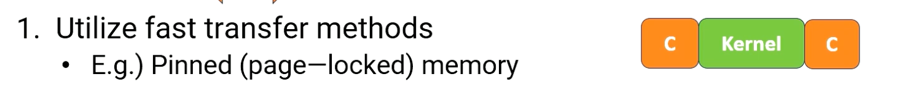

### Objectives

* Describe GPU microarchitecture  
* Be able to explain the basic GPU architecture terminologies 

### Readings

Required readings
* [General-Purpose Graphics Processor Architectures](https://galileo-gatech.primo.exlibrisgroup.com/discovery/fulldisplay?context=L&context=L&vid=01GALI_GIT:GT&vid=01GALI_GIT&docid=alma9916162981502950&tab=default_tab&lang=enLinks) ( Synthesis Lectures on Computer Architecture), Chapter 3 site. 
* [CUDA best practices](https://docs.nvidia.com/cuda/cuda-c-best-practices-guide/index.html) (sections 9, 10, 11)  
* [Shared memory](https://developer.nvidia.com/blog/using-shared-memory-cuda-cc/)
* [For Project #2 preparation](https://developer.nvidia.com/gpugems/gpugems2/part-vi-simulation-and-numerical-algorithms/chapter-46-improved-gpu-sorting)

Optional Suggested Readings:  

* [Nvisight](https://youtu.be/Iuy_RAvguBM?si=pfoTco_ASpzw6u9d)
* [NSight doc](https://docs.nvidia.com/nsight-systems/UserGuide/index.html#other_resources)
* [NVIDIA presentation](https://developer.download.nvidia.com/GTC/PDF/1083_Wang.pdf)
* [CUDA stream](https://developer.nvidia.com/blog/gpu-pro-tip-cuda-7-streams-simplify-concurrency/)
* [Data transfer](https://developer.nvidia.com/blog/how-optimize-data-transfers-cuda-cc/)
* [NSight Compute Video Series](https://developer.nvidia.com/nsight-compute-videos)
* [NSight Blog](https://developer.nvidia.com/blog/using-nsight-compute-to-inspect-your-kernels/)

### Module 5 Lesson 1: Advanced GPU Programming

Course Learning Objectives:

* Describe GPU optimization techniques
* Prepare for advanced technique materials

This video will provide an overview of various techniques to optimize the performance of GPUs so that you will be ready to read more advanced techniques in the reading list. This techniques will help you to optimize your GPU programming project.

#### Applications Suitable for GPUs

GPUs are good for tasks:
* Involving massive parallel data to take advantage of massive number of threads.
* Applications that have low dominance in host device communication costs are good for running on GPUs. 
* Furthermore, applications that have coalesced data accesses in the global memory accesses are good for running on GPUs. 

#### Profiling

* enables us to identify performance bottlenecks by identifying hotspots in our applications. 
* It provides key performance metrics such as 
  * reported throughput, 
  * the number of divergent branches, 
  * the number of divergent memory, both coalesced and uncoalesced, 
  * occupancy,
  *  and memory bandwidth utilization.

To achieve this, please use profilers provided by GPU vendors to analyze and optimize our kernel functions. Profiling is also useful before you convert your applications for GPUs to identify the key hotspots in CPUs.

#### Optimization Techniques

* GPU execution time can be broken into data transfer time, memory access time, and compute time.
* Hence, we have to look at all three aspects to optimize applications.
  * Reducing data transfer time,
  * optimizing memory access patterns, 
  * and reducing computation overhead. 
* Finally, if possible, please use provided libraries.

#### Data Transfer Optimizations

First, optimizing data transfer overhead between host and device is critical. Data transfer overhead occurs of using host and device memory connection fabric and it had, typically, a high overhead such as PCI-E. Since such overhead can be very harmful, faster communication is still actively developed. 

The figure in this slide illustrates the timeline for data copy and kernel execution. 

{: width='400' height='400'}

There are several methods to optimize.

{: width='400' height='400'}

First, if possible, use the fast transfer methods such as pinned memory. With pinned memory, it reduces the data copy time by reducing the overhead from the CPU side. Now, the data copy time box gets smaller. 

{: width='400' height='400'}

Second, overlap computation and data transfer. `cudaMemcpyAsync` API can be used for this purpose. The diagram shows that data copy and kernel compute time is overlapped.

{: width='400' height='400'}

Third, pipeline the data transfer and computations or it is also referred as concurrent copy and execute. This can be achieved by using stream feature in CUDA. This often requires breaking kernel and copy into multiple sessions.

Fourth, use direct host memory access if possible. 

{: width='400' height='400'}

* Zero copy allows access CPU data directly in the CPU and GPU integrated memory.
* Next, use unified virtual addressing, UVA. We'll discuss UVA again later. 
  * Briefly, in the UVA, driver and runtime system hide the physically separated memory spaces and provide an interface as if CPU and GPU can access any memory as if they are sharing the same memory space.
  * Ideally, there should be no data copy cost, but the implementation still requires data copy, so the overhead exists.

Not all these methods are applicable for all applications. Programmers need to try out different methods based on their systems and their target applications. 

#### Memory Access Pattern Optimizations

One of the most important optimization opportunities is reducing the global memory access overhead. 
* First, if possible, utilize cache as much as possible. 
* Second, make sure all global memory accesses can be coalesced and also aligned. 
* Reducing the number of data memory transactions is the key of optimizing for the performance. 
* Also check the average memory bandwidth consumption to see whether an application is fully taking advantage of memory's peak bandwidth. 
* Lastly, reduce shared memory bank conflict. 

#### Reduce Computation Overhead

* Reducing the competition overhead is also very important. 
  * You can use instruction level optimization, such as replacing the high cost instructions with the low cost instructions.
  * As an example, use shift operations instead of multiplications or divisions. 
* Second, use low precisions when possible, or use fewer number of bits, such as single precision or 16 bits, or even using 8 bits, if that's allowable.
* Next, use hardware built in special functions that are provided by the hardware such as rsqrtf() function.
* Utilizing math libraries often provide these opportunities automatically
* Reduce the branch statement
  * use predicated execution if possible
* Avoid atomic operations if possible.
  * The overhead of atomic operation has been reduced significantly, but still it is better to avoid.
* Use tensor operations and utilize the tensor cores. 
  * Again, if we are using libraries, it will typically use tensor cores whenever they are possible.

#### Newer CUDA Features

Let me also introduce a couple of newer CUDA features. Several warp level operations exist, such as warp **shuffle, vote, ballot**, etc. Modern GPUs have been adding new warp-level operations. 

* This is because communication between threads is very expensive.
* Since register files are unique to the thread, there is no easy way of accessing other threads' register contents without using shared memory.
  * That requires movement between register to shared memory and then back to register files which might also cause shared memory bank conflict.
* Hence, new hardware features are provided to allow data movement within a warp.

{: width='400' height='400'}

The figure illustrates the register values are swapped between threads. There are also other features, like cooperative groups, to utilize different formation of warps. 

Also, newer GPUs provide smaller warp-level operations instead of fixed warp sizes.
  * For example, independent thread scheduling was introduced in Volta architecture.

These new features are making:
*  GPUs be apart from SIMT execution. It even allows each thread could have different pieces and different thread group execution.
* In this course, we assumed shared memory is only accessible by only one CUDA block, but in newer GPU, this is no longer true.
  * It can specify that shared memory can be shared by multiple CUDA blocks. This makes more sense if those CUDA blocks are all scheduled to the same hardware SM.
* As a newer feature, unified memory for shared memory, L1 data cache, and texture memory are also introduced.
* And hardware acceleration for split arrive/wait barriers are also introduced since synchronization is quite expensive in many cases.

#### Cuda libraries

We also highlight continuously developing CUDA libraries including:
* cuBLAS for linear algebra, 
* cuSPARSE for sparse matrices,
* cuTENSOR for tensor based linear algebra. 
* Thrust for parallel algorithms and communication libraries like NCCL and NVSHMEM for multi GPU setups. 
* Deep learning programs will benefit from libraries like a cuDNN.

Please refer to latest library documentation to see more details. 

#### Other GPU Programming Platforms

Although this course focuses on using CUDA, there are many other programming languages and platforms libraries such as OpenCL, OneAPI/SysCL, OpenACC, HIP, Kokkos, and even popular languages like Python and Julia. These libraries open up programming GPU other than using CUDA. 

In summary, GPU programming optimization require reducing the amount of computation, reducing data transfer overhead between the host and device, and ensuring efficient memory access patterns in both global and shared memory. These techniques are essential for achieving the full potential of GPU performance.

<!--  -->