### Objectives

* Describe the performance issues related to divergent branches and the basic mechanisms for handling them. 
* Describe the opportunities for GPU register optimization. 
* Explain the differences between shared memory and register files. 
* Develop the ability to read GPU architecture papers 

### Readings

Required Readings:
* General-Purpose Graphics Processor Architectures ( Synthesis Lectures on Computer Architecture), [Chaper 3 Georgia Tech Library access](https://galileo-gatech.primo.exlibrisgroup.com/discovery/fulldisplay?context=L&context=L&vid=01GALI_GIT:GT&vid=01GALI_GIT&docid=alma9916162981502950&tab=default_tab&lang=en)
* [Wilson W. L. Fung, Ivan Sham, George Yuan, and Tor M. Aamodt. Dynamic warp formation and scheduling for efficient GPU control flow. In Proc. of the ACM/IEEE International Symposium on Microarchitecture (MICRO), pages 407–420, 2007.](https://ieeexplore.ieee.org/document/4408272)   
* [Hyeran Jeon, Gokul Subramanian Ravi, Nam Sung Kim, and Murali Annavaram. GPU register file virtualization. In Proc. of the ACM/IEEE International Symposium on Microarchitecture (MICRO), pages 420–432, 2015. DOI: 10.1145/2830772.2830784. 64.](https://ieeexplore.ieee.org/document/7856616)  
* [Mark Gebhart, Stephen W. Keckler, Brucek Khailany, Ronny Krashinsky, William J. Dally:  Unifying Primary Cache, Scratch, and Register File Memories in a Throughput Processor. MICRO 2012: 96-106](https://ieeexplore.ieee.org/document/6493611) 

Optional Readings:
* [V. Narasiman, M. Shebanow, C. J. Lee, R. Miftakhutdinov, O. Mutlu and Y. N. Patt, "Improving GPU performance via large warps and two-level warp scheduling," 2011 44th Annual IEEE/ACM International Symposium on Microarchitecture (MICRO), Porto Alegre, Brazil, 2011, pp. 308-317.](https://ieeexplore.ieee.org/document/7851481)
* [Mark Gebhart, Daniel R. Johnson, David Tarjan, Stephen W. Keckler, William J. Dally, Erik Lindholm, and Kevin Skadron. 2011. Energy-efficient mechanisms for managing thread context in throughput processors. In Proceedings of the 38th annual international symposium on Computer architecture (ISCA '11). Association for Computing Machinery, New York, NY, USA, 235–246.](https://ieeexplore.ieee.org/document/6307762) 
* [M. Gebhart, S. W. Keckler, and W. J. Dally, “A Compile-Time Managed Multi-Level Register File Hierarchy,” in International Symposium on Microarchitecture, December 2011, pp. 465–476.](https://ieeexplore.ieee.org/document/7851495) 

### Module 6 Lesson 1: Handling Divergent Branch

Course Learning Objectives:

* Explain the definition of divergent warps
* Apply hardware techniques to handle divergent warps

In this video, let's discuss divergent warps and how hardware handles divergent warps.

#### Divergent branches

As you all know by now, warp is a group of threads that are executed together. So far, we have assumed that all threads in a warp would execute the same program following SPMD, single program multiple data programming model. However, it is also possible that threads might execute different parts of the program.

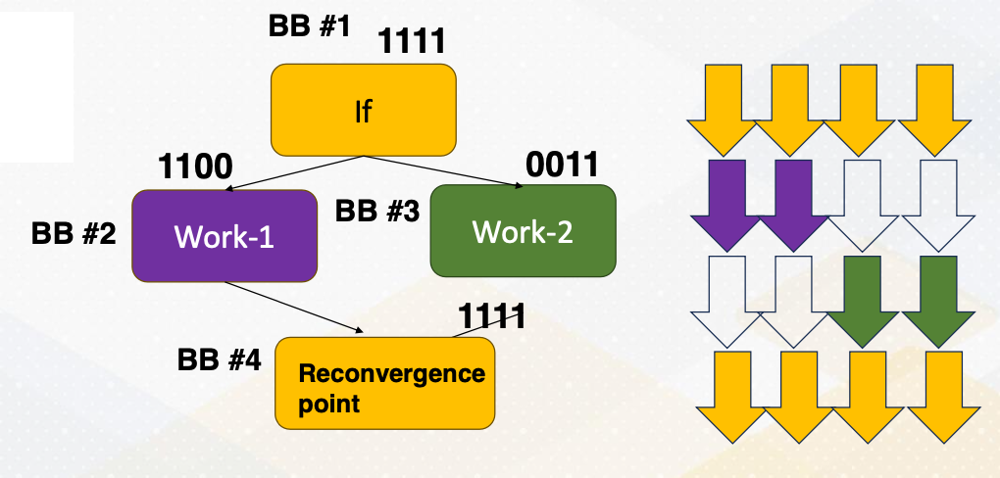{: width='400' height='400'}

Example can be found from if-else st	atement. There is an if-else statement and it checks whether thread ID is less than two or not in this slide example. This means that the thread ID less than two will execute one path, and the last will execute different path. Within a warp when not all threads need to fetch different parts of the program, it is called a divergent branch, and then the warp that executes divergent branch is called divergent warp.

In the divergent warps, we need to use active mask to indicate which threads are active or not. In the slide it shows that 1, 1, 1, 1 or 1, 1, 0, and these are indicating active mask bits, and which are next to the BB1 or two, and BB stands for basic block. The path is split after Basic Block 1, then it meets again at Basic Block 4. At the moment, all threads will be executed together again. And this point is called reconvergence point, and in the compiler's term, it is called immediate post dominator.

#### If-else Conversion: Predicated Execution

If-else conversion or predicate execution. Divergent branches can be eliminated with if-else conversion or predicated execution. In predicated execution, instructions are predicated, and whether an instruction is executed or not is dependent on the predicate value.

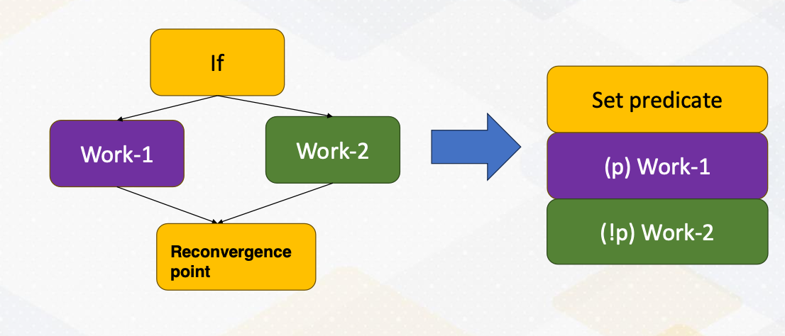{: width='400' height='400'}

The diagram shows that if-else statements are converted as a predicate execution. Work 1 and Work 2 are predicated with an opposite of predicate value. This change is called if-else conversion, and this is commonly used in vector processors. A branch that has a small amount of work, In other words, Work 1 and Work 2 are small. Then if-else conversion is often used even in modern CPUs. The biggest downside of predicated execution is that the work that won't be executed still needs to be fetched. So this if-else conversion needs to be used carefully if the amount of work such as Work 1 and Work P are really big.

#### GPU Execution Flow

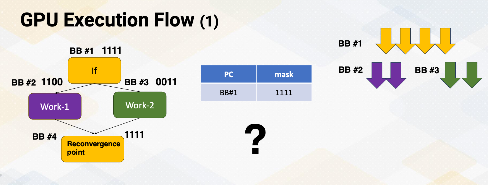{: width='400' height='400'}

Hence, most sub branches still remain as a branch instruction, and they can be divergent. When a processor fetches an instruction, it computes the next instruction address. First, it can detect whether a branch is divergent or not based on whether all PC values within a warp are the same or not. When PC values are different, it becomes a divergent branch and it needs to be handled differently. 

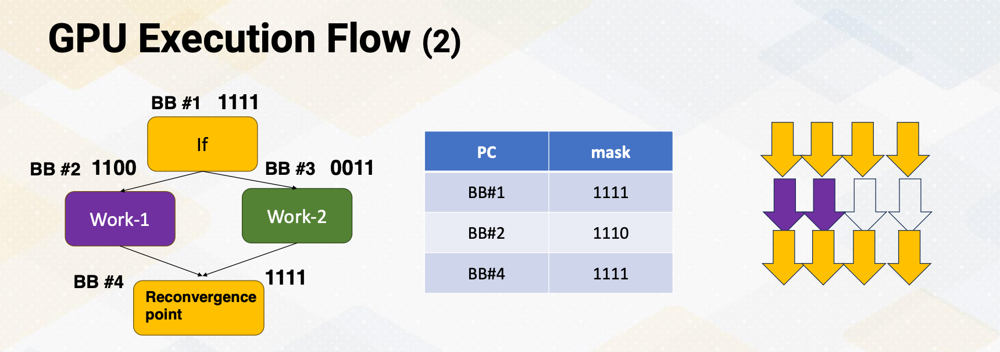{: width='400' height='400'}

Let's you assume that the processor fetches one path, in this case Basic Block 2 first. Once it executes Basic Block 2, then it will fetch execute Basic Block 4. In this scenario we are completely missing Basic Block 3. Now how should we know when to fetch Basic Block 3, and how to even know the address of Basic Block 3? 

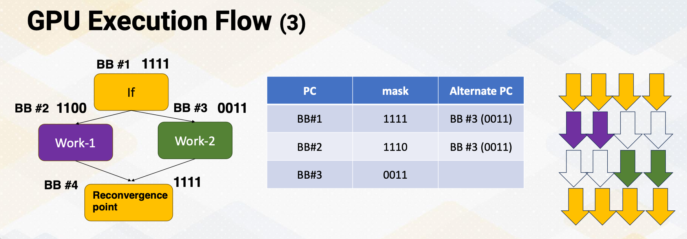{: width='400' height='400'}

So to overcome this problem, when a processor fetches and it detects a divergent branch, it needs to store the other PC address. So basic block stores the alternative PC value which is Basic Block 3 in the same place.

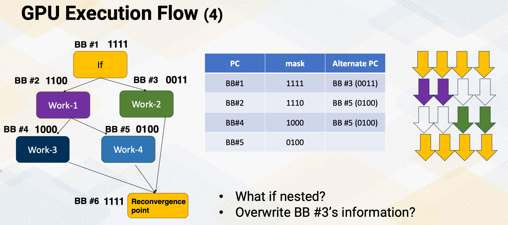{: width='400' height='400'}

However, this problem gets even more complicated if control flow get complex. What if a Basic Block 2 also has a branch instruction? It is called the nested branch. If we only have one place to store alternative PC value, then the alternative PC value will be overwritten as a Basic Block 5. In that case, it will lose information of Basic Block 3. So how can you overcome this problem? You might think about handling nested function calls. Yes, this is very similar to do that. 

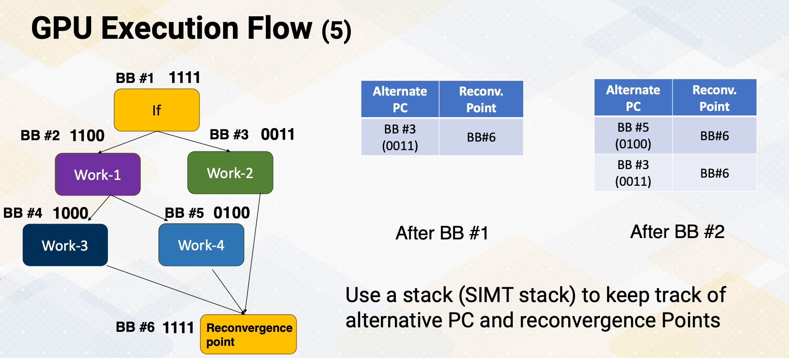{: width='400' height='400'}

We can use stacks, and stacks are good operations to handle this kind of behavior. We put a stack to keep track of alternative PC values. After the Basic Block 1, the processor puts alternative PC value and also reconvergence point in a stack. When it fetches another divergent branch, it pushes a new alternative PC value and reconvergence point in a Stack 2, and it continues to fetch and execute. This stack is called the SIMT stack, because it is very critical to support SIMT, single instruction multiple thread. We need this kind of stack.

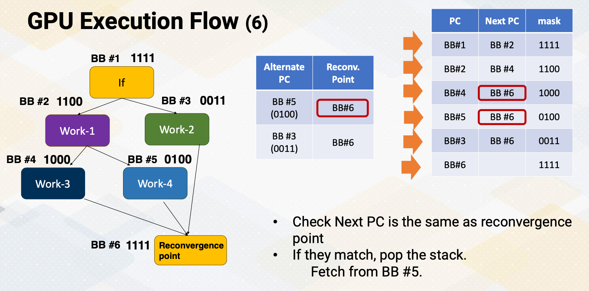{: width='400' height='400'}

Once the processor knows that the next PC address is the same as the reconvergence point in a stack, it pops alternative PC values from a stack and it starts fetching from this alternative PC. Here, this slide animates the instruction fetch process. This shows the stream of instructions. First, the processor fetches Basic Block 1, and it detects that it is a divergent branch. So it stores alternative PC value and reconvergence points in the SIMT stack. The next PC is BB2. It fetches the next PC BB2, and then it detects that this is another divergent branch. So the divergent branch information is stored in a stack, and then it goes to next PC which is Basic Block 4. At the moment, if it compute next PC value and realize that next PC value is the same as the reconvergence point on the top of the stack. When the next PC value matches the top of the stack of reconvergence point, instead of fetching from next PC, it fetches from the alternative PC value. It pops Stack 2. So if fetches Basic Block 6, and then compute the next PC value. The next PC value of basic block is six, which is the same as reconvergence point of the top of the step. So in that case, again, it pops a stack and fetches from alternative PC value, which is Basic Block 3, and then it continues to follow the next PC values. 

#### How to Know the Reconvergence Point?

Another question is how to identify this is reconvergence point, which is very critical to support the SIMT and divergent branches. 
* It is typically done at compile time and static time, using control flow graph analysis. Compiler can insert a marker to indicate reconvergence point or compiler inserts special instruction to indicate that. 

Typically hardware prefers to have a hardware stack to handle reconvergence point, it detects divergence and also stores reconvergence point purely based on hardware information.
* However, some cases compiler could insert explicit stack operation to specify when to push and pop this reconvergence point. 

Downside of this compiler approach is, divergent branch information needs to be detected at compilation time, which is very hard. So they can overclaim more branches as divergent branches. So hardware prefer these one time operations. 

#### Large Warps

* One thing to note that the width of warp is a micro architecture feature.
* The benefits of larger warps are 
  * one instruction's  fetch and execution can generate many number of execution instructions such as 32, 64, 120 etc. 
  * So larger width means it's wide execution machines and wide vector processors.  
* The downside is the chance of divergence is very high. 
  * A warp can be often easily be divergent, and when it's divergent it needs to go through these complex SIMT fetch operations. 
* And this is very specific to applications. Some application has more **uniform** execution width and path, and some application might have very frequent **divergent** branches. So we have to decide based on applications. 

#### Dynamic Warp Formation

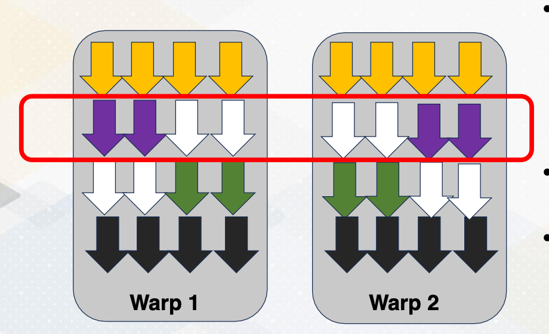{: width='400' height='400'}

You might also notice that once a divergent warp exist, the execution utilization becomes very low. In this example, only half of the execution units are utilized. To overcome this problem, some hardware optimizations are proposed to regroup different threads from different warps. Because the threads excute the same PC, we can easily group them as the same warp, then we can execute them with very high execution width utilizations. This decision needs to be done by hardware and it is often called dynamic warp formation because we're forming the warp at one time. There have been many optimizations that were proposed to increase the efficiency of this warp execution. And one of the critical challenges is how to avoid the register file conflict, because threads location within the warp often optimize to reduce register file read and write per conflict. When you regrouping this thread with the new warp, we have to preserve this conflict otherwise we might end up generating lots of register file conflicts.

In this lecture, we reviewed the concept of divergent branches. And we studied how GPU fetches divergent branches using SIMT stack. And we also studied the benefit of having large warps, and also we briefly studied the concept of dynamic warp formation, which are commonly used to optimize the hardware optimization performance.

### Module 6 Lesson 2: Register Optimizations

Course Learning Objectives:

* Explain the challenges of register file sizes and opportunities
* Discuss various optimization techniques aimed at increasing the size of register files effectively

In this video, let's discuss divergent warps and how hardware handles divergent warps.

In this video, we'll continue learning GPU architecture optimization techniques focusing on register file optimizations. The learning objective of this video is to explain the challenges of register file sizes and opportunities and to discuss various optimization techniques aimed at increasing the size of register file efficiency.

#### Register File Challenges

* As you recall, each SM has a large number of threads and that number of threads also has many registers. The hardware has to keep track of the number of threads times the number of registers, which it can be 64 kilobyte, 128 kilobyte, or even 256 kilobyte. 
* Large register size means it can be easily slow, and providing high bandwidth and fast latency is a very challenge.
  * In the GPUs world, the register file read bandwidth should be equal to the execution bandwidth.
* We can utilize other computer architecture optimization techniques for the GPU register files.
  * We could reduce the access latency by utilizing hierarchical approach to provide different access latency. 
  * We could also reduce the size by utilizing resource sharing.

#### Observation 1: Not All Threads are Active

First, let's look at some GPU specific register file usage characteristics. GPUs have many thread, but not all threads are active. GPUs use SPMD programming model and all threads have the same register file usage from the program's viewpoint. However, GPU execution is very asynchronous, so thread completion time varies a lot. Some threads might be finishing early, but some threads finish very late.

An interesting part is that the register files in the finished threads are **no longer needed**. Furthermore, as we studied in the previous video lecture, divergent branches execute different path of program which might result in different register file usages. So register file usage pattern can be varied at runtime.

#### Observation 2: Not All Registers are Live

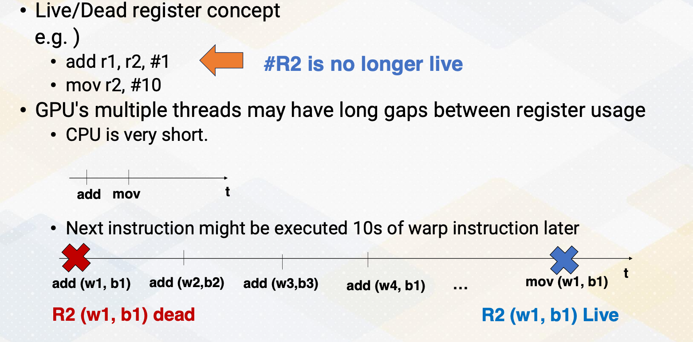{: width='400' height='400'}

Another observation is that not all register are live. Live register means that the value in the register file will be used and dead register means that the value is no longer needed. For example, add r1, r2, 1 and move instruction r2, 10. R2 value in the add instruction is no longer live because r2 value will be overwritten in the move instruction. So r2 register is dead after add instruction. 

You might think that this is not a big problem because in the CPU's world, add instruction and move instructions are typically executed back to back, just like in this illustration. However, in the GPU's case, the next instruction might be executed 10s of warp instruction later. Here is an animation. First, we execute add instruction from warp 1 and CUDA block 1. And then another add instruction from warp 2 and block 2. Another add instruction, warp 3 from block 3 and so on. We continue for a while until we execute add instruction on warp and block 1 again. So r2 in warp 1, block 1 is dead right after this first add instruction from the warp 1 and b1. And then, the move instruction is executed a long time later from the same thread, warp 1, block 1 and r2 becomes live at the moment. So this period between r2 is dead and live can be very long depending on the schedule's execution pattern.

#### Observation 3: Short Distance between Instructions

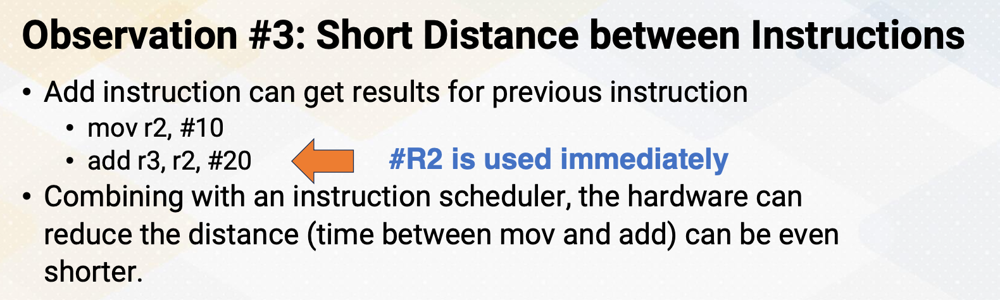{: width='400' height='400'}

Contrary to just what I described in this slide, sometimes there might be a very short distance between instructions. In a similar example, move instructions store value 10 to r2 register and the subsequent add instruction uses the value of r2 and r2 value will be used immediately. If a scheduler schedules the next instruction immediately after move instruction, then hardware can reduce the time between storing r2 value. So then it also brings a question whether it is necessary to store the value 10 into the register r2. 

#### Observation 4: Most Register Values are Read Only

{: width='400' height='400'}

This problem gets even more worse because most register values are read only once. Similar example shows that r2 value has a 10 and then soon after this r2 value will be overwritten after read only once. It was observed that almost 70% of register values are read only once on GPUs. This brings up question whether it is even necessary to store the value into a register file from the beginning, and can you just bypass this register value stores.

#### Optimization 1: Hierarchical Register Files

Based on these observations, several optimization techniques were proposed. 

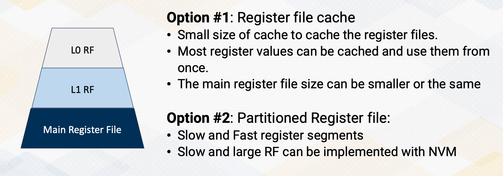{: width='400' height='400'}

The first optimization technique is using hierarchical register file. In this approach, there are two options to build hierarchical register files. And the first option is utilizing register file cache. Typically, smaller side of structure provides the fast accesses. So smaller side of register file cache can store the value and provide fast accesses. And the main register file size can be even also smaller if we avoid storing all the values into the main register file. Sometimes, the harderware decides to store all the values in that case the main register file size  needs to be the same. But regardless of that, by having this hierarchical structure, we can provide fast access to the L0 or L1 register file and have a slow access for the main register file.

This can even optimize further by having partitioned register file. We can use different technology to store slow and fast registers. We can even have using non-volatile memory to store large and slow register file to reduce energy consumptions.

#### Optimization 2: Register File Virtualizations

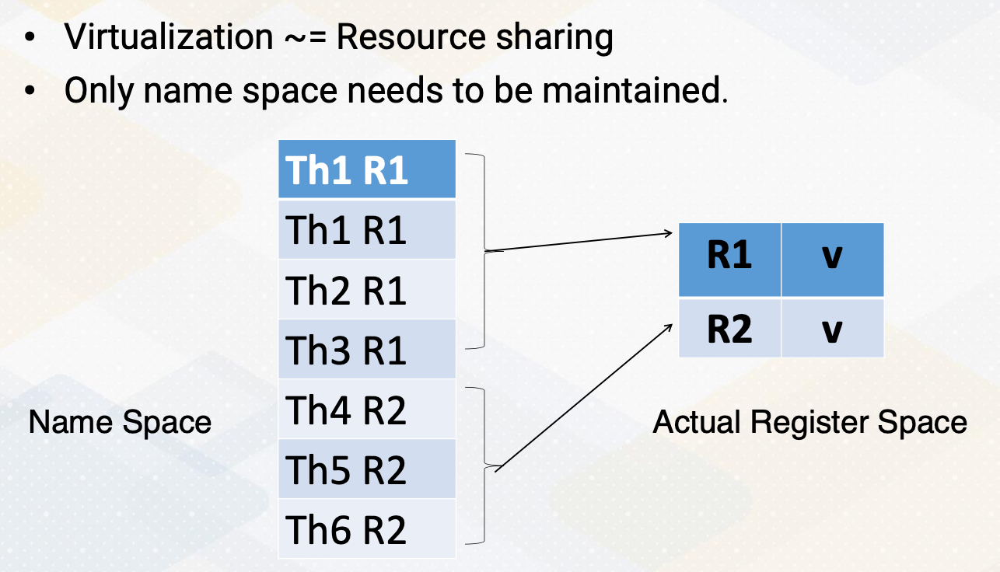{: width='400' height='400'}

Another approach is to use register file virtualizations. Here we use virtualizations for resource sharing purpose because as we discuss it in the observations, not all registers are actually needed to store the values. So instead of having a register file for every single register items, we can have a small physical register file to store the actual value and only keep the name space by having separate name space and physical register storage, we can still maintain the program characteristics, but we can have very small hardware features. 

So in summary in this video, we observed several GPU programming characteristics and have learned several opportunities to optimize for registers. And the main lessons are in several cases, not all registers are actively used. And we also have studied register file optimize techniques to increase the resource sharing and also to improve the latency.

### Module 6 Lesson 3: Unified Register File and Shared Memory

Course Learning Objectives:

* Explain optimization opportunities for unified memory and register file
* Differentiate between register files and memory
* Review the concept of occupancy in GPU programming

In this video, we'll continue GPU architecture optimization techniques by understanding unified register file and shared memory structure. The focus of this video will be to explain optimization opportunities for unified the memory and register file. We will also learn how to differentiate between register file and memory, and we will also review the concept of occupancy in GPU programming.

#### Review Occupancy

Let's review the occupancy concept. In cuda programming the resource constraints affect the maximum number of blocks on each streaming multiprocessor (SM). The shared memory requirements or register file size is a critical factor. 

For example, in hardware, each SM has 64 kilobyte registers and 32 kilobyte shared memory.
* In the one software example case, each block has 64 registers and no shared memory usages. 
* In another software example case each block has four registers and two kilobyte shared memory. 
* In Case 1, the shared memory will be underutilized because there is no shared memory usage. 
* In Case 2, register file size will be underutilized because at the end, four times number of total cuda blocks and number of threads will be used for the register file size. So in this example will be probably two kilobyte. 

So the question is what if we have the shared memory and register file and can we increase the occupancy? 

#### Hardware Cache vs. Software Managed Cache

Before we answer the question, let's review hardware managed cache, and software managed cache. 

* In hardware managed cache hardware decides which memory content will be cached based on LLU or other policies. 
* Because not all memory contents will be stored other address tag bits are needed to check whether an address is in the cache or not. 
* On the other hand, in software managed cache programmer specifies.
* So address tags are not needed because when the program says it is a software managed cache, that means that content will be inside the memory or inside the cache. 

#### Register File vs. Software Managed Cache

Let's also review register file and software managed cache. Software managed cache means typically on-chip memory which is very small.

The common characteristics are both are storing data only and both do not need to have a tag to check the address. And in both the location indicates the address. And so we can just go to the particular location and fetch the content. The difference is the number read and the number write ports can be different. Especially register typically access two source operands per instruction, whereas typical memory only access one address. 

Another benefit is in register files access patterns are known at static time because these instructions know which registers to access. So there could be more opportunities for the register file even though register file requires more read bandwidth.

#### Proposed Solution: Unified Structures

The proposed solution is unified structures of shared memory and register file. The benefit is because we are sharing the structure, it could increase occupancy. 
* But in order to do that, the critical requirement is  high memory bandwidth. 
  * It should have sufficient port for read and write and
  *  typically it is used bank structure, but now it needs to have more, even higher bank structures because register and shared memory have different access patterns. 
*  But this flexible resource sharing allows to reduce resource constraints.
   * Now we can consider the summation of register file size and shared memory size can be the constraining factor to decide the occupancy. 

So in summary, in this video, we reviewed differences between software managed cache and hardware cache and explored the benefit of unified memory and register file structure. And more kinds of this efficient resource sharing is needed for optimization of GPU performance and power.

<!--  -->