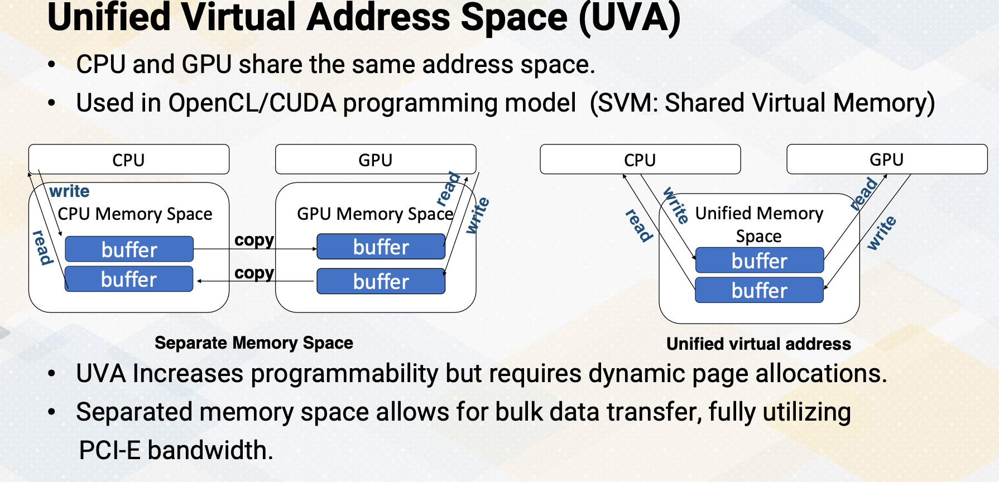

### Objectives

* Describe the performance issues related to divergent branches and the basic mechanisms for handling them. 

### Readings

Required Reading:
* Power, M. D. Hill, and D. A. Wood, “Supporting x86-64 address translation for 100s of gpu lanes,” in 2014 IEEE 20th International Symposium on High Performance Computer Architecture (HPCA), 2014,pp. 568–578. (https://ieeexplore.ieee.org/document/6835965)
* Narasiman, M. Shebanow, C. J. Lee, R. Miftakhutdinov, O. Mutlu and Y. N. Patt, "Improving GPU performance via large warps and two-level warp scheduling," 2011 44th Annual IEEE/ACM International Symposium on Microarchitecture (MICRO), Porto Alegre, Brazil, 2011, pp. 308-317.
* T. G. Rogers, M. O'Connor and T. M. Aamodt, "Cache-Conscious Wavefront Scheduling," 2012 45th Annual IEEE/ACM International Symposium on Microarchitecture, Vancouver, BC, Canada, 2012, pp. 72-83, doi: 10.1109/MICRO.2012.16.
keywords: {Benchmark testing;Instruction sets;Graphics processing units;Kernel;Limiting;Registers;Processor scheduling},

Optional Suggested Readings: 
* Mark Gebhart, Daniel R. Johnson, David Tarjan, Stephen W. Keckler, William J. Dally, Erik Lindholm, and Kevin Skadron. 2011. Energy-efficient mechanisms for managing thread context in throughput processors. In Proceedings of the 38th annual international symposium on Computer architecture (ISCA '11). Association for Computing Machinery, New York, NY, USA, 235–246. https://doi.org/10.1145/2000064.2000093
* Ganguly, D., Zhang, Z., Yang, J., & Melhem, R. (2019). Interplay between hardware prefetcher and page eviction policy in CPU-GPU unified virtual memory. In 2019 ACM/IEEE 46th Annual International Symposium on Computer Architecture (ISCA) (pp. 224-235). Phoenix, AZ.
* Jog, A., Kayiran, O., Nachiappan, N. C., Mishra, A. K., Kandemir, M. T., Mutlu, O., Iyer, R., & Das, C. R. (2013). OWL: Cooperative thread array aware scheduling techniques for improving GPGPU performance. In Proc. of the ACM Architectural Support for Programming Languages and Operating Systems (ASPLOS) 2013 DOI: 10.1145/2451116.2451158
* Jog, A., Kayiran, O., Mishra, A. K., Kandemir, M. T., Mutlu, O., Iyer, R., & Das, C. R. (2013). Orchestrated scheduling and prefetching for GPGPUs. In Proc. of the ACM/IEEE International Symposium on Computer Architecture (ISCA), 2013 DOI: 10.1145/2508148.2485951
* Ausavarungnirun, J. Landgraf, V. Miller, S. Ghose, J. Gandhi, C. J. Rossbach, and O. Mutlu, “Mosaic: A gpu memory manager with application-transparent support for multiple page sizes,” in 2017 50th Annual IEEE/ACM International Symposium on Microarchitecture (MICRO), 2017, pp. 136–150
* Li, J. Yin, Y. Zhang, and X. Tang, “Improving address translation in multi-gpus via sharing and spilling aware tlb design,” in MICRO-54: 54th Annual IEEE/ACM International Symposium on Microarchitecture, ser. MICRO ’21. New York, NY, USA: Association for Computing Machinery, 2021, p. 1154–1168.
* Hyojong Kim, Jaewoong Sim, Prasun Gera, Ramyad Hadidi, and Hyesoon Kim. 2020. Batch-Aware Unified Memory Management in GPUs for Irregular Workloads. In Proceedings of the Twenty-Fifth International Conference on Architectural Support for Programming Languages and Operating Systems (ASPLOS '20). Association for Computing Machinery, New York, NY, USA, 1357–1370. https://doi.org/10.1145/3373376.3378529

### Module 7 Lesson 1

Course Learning Objectives:

* Explain the concept of GPU virtual memory and its importance in modern GPU architectures
* Explain challenges of GPU address translation, including scalability and handling uncoalesced memory accesses
* Explore hardware optimization opportunities for GPU address translations to improve GPU performance and efficiency

In this video, we will explain the concept of GPU virtual memory and why it is essential in modern GPU architectures. We'll also discuss the challenges related to the GPU address translation, such as scalability concerns and managed uncoalesced memory accesses. Additionally, we'll explore opportunities for hardware optimizations in GPU address translations to enhance overall GPU performance and efficiency.

#### Supporting Virtual Memory

Let's explore two key aspects of virtual memory:  Address translation and page allocations.

* In the CPU, the operating system takes care of page allocations. 
* However, in the GPU, the process is slightly different. Initially, the CPU manages the pages in collaboration with the GPU driver. For memory allocation and data management, we rely on functions like cudaMalloc, cudaMallocManaged, and cudaMemcpy. 
* These functions are used to allocate memory and facilitate the transfer of managed data.

#### Review of Address Translations

Let's review address translation. First, programmers write programs assuming virtual addresses and these virtual addresses need to be mapped to physical addresses. There are several key terms, VPN, virtual page number, PFN, physical frame number, or PPN, physical page number, and PO, page offset.

{: width='400' height='400'}

In the address translation, VPN becomes PFN. Page offset stays the same. Typical common page sizes are four kilobyte and two megabyte. Pages are typically divided into fixed size chunks like four kilobyte or two megabyte. 

#### TLB and Page Size

* TLB as a translation look-aside buffer, is a cache to store address translation. TLB stores recently used address translation to speed up future accesses.
* Page table entry, PTE, stores mapping from VPN to PFN. PTE itself is the memory, So accessing PTE itself requires multiple memory accesses, hence TLB caches PTE so that it can avoid multiple memory accesses for PTE. 
* TLB miss requires a page table access to retrieve address translation. If an address isn't found in the TLB, the page table must be accessed, which takes more time.
* Page fault occurs when no physical page is mapped yet, and then OS needs to allocate a page.

#### 4 Level Address Translation

{: width='400' height='400'}

Here is an example of four level address translation. Similar structures are used in x86, ARM, and even GPUs. The reason we have four levels is that if we didn't have any levels, the number of table entries would be equal to 2 to the power of the number of VPN bits, which is 2 to the 48th power. All the tables would need to be stored in memory, result in a massive number of entries. Hence, we use multi-level tables. When we use multiple levels, we don't have to store all the tables. The best case scenario would be 2 to the power of level 4 index bits, which is 12 bits, plus 2 to the power of the number of level 3 index bits, plus 2 to the power of the number of level 2 index bits, and finally, 2 to the power of the number of level 1 index bit.

This results in thousands of entries as opposed to a trillion number of entries. The downside is that address translation needs to traverse through multiple levels of tables. First, it use sthe level 4 index to access the level 4 table and within the table entry, you will find the starting address of the corresponding table 3 entry. Then using the level 3 index bit, it accesses an entry in the level 3 table, which in turn provides a corresponding level 2 starting address. Continuing with the level 2 index bit, index table giving you the starting address of the level 1 table. This process repeats until you reach the level 1 entry which finally stores the PTE containing the PFN number and other metadata. Using the PFN and page offset, the system can compute the physical address.

Hence, with 4 level address translation, a single address translation requires at least four memory accesses. This process is often referred to as a walk. Address translation can be performed by hardware through a hardware page table walker, which is called PTW, or by software.

#### Virtual Memory on GPUs

Now let's discuss GPU virtual memory.

{: width='400' height='400'}

* In earlier GPUs, there was no virtual memory or it has only on-to-one mapping.
* As GPUs have become more programmable, the need for complex memory system support has risen such as unified virtual address.
* Address translation shares similar mechanisms with the CPUs except for address coalescing. 

The memory address stage is divided into address coalescing and TLB accesses. If a TLB miss occurs, the page table walker retrieves a new page table entry or the TLB miss handler manages the TLB misses. Typically, L1 cache accesses use virtual memory addresses, while L2 cache accesses use physical memory accesses.

#### Memory Coalescing and TLB Accesses

{: width='400' height='400'}

Let's consider an example where we assume a page size of 256 byte. In the previous example, the first load which is using R1 generate one memory request which result in one TLB access. Similarly, the next load generates only one TLB access with tag 0X00. In the second example, multiple memory requests (eight of them) are generated, but they won't be coalesced. Each of them generate separate TLB accesses. If we examine the TLB address tags, the first two addresses are actually combined into one TLB access, but the rest are separate TLB accesses. Therefore, one memory instruction ends up generating seven TLB accesses. In uncoalesced memory accesses, the total number of TLB requests from one warp would be the same as the number of width of a warp.

#### Challenges of GPU Address Translation

{: width='400' height='400'}

The challenge in GPU address translation lies in achieving scalability. A single warp TLB miss can lead to the generation of multiple TLB misses, particularly in case of uncoalesced memory accesses. Hence, the critical factor is having high bandwidth of the PTW, and one option is sharing a high bandwidth PTW across multiple SMs. 

#### Techniques to Reduce Address Translation Cost

{: width='400' height='400'}

Let's discuss techniques to reduce address translation cost, which can include segment mapping, large page sizes, and the concept of multiple levels in TLB hierarchies. In segment mapping, each virtual address space corresponds to a portion of the physical address space. For instance, each program requires the address space from 0x0000 to 0xFFFF. We assign the orange area, 0x000000, to 0x00FFFF to program 3, and the blue area to program 2, and the green area to program 1. With this arrangement, during address translation, we can simply add the upper 2 bits  (0,1, or 2) to access physical addresses result in very low cost address translation. The figure on the right slide illustrates two levels of TLB hierarchies.

#### Large Pages

{: width='400' height='400'}

Typical page sizes is four kilobyte with two megabyte pages. And in this case, the number of VPN is reduced from 51 bits to 42 bits. The number of TLB entries also reduced by 512. However, there is a downside to this approach, which is memory fragmentation. For example, if only one kilobyte of memory is needed, the system uses four kilobyte paging, it wastes three kilobyte of memory. This contrasts with the case when you use two megabyte memory system, it wastes 2 megabyte minus 1 kilobyte. In summary, memory address coalescing plays a critical role in address translation. Furthermore, ensuring scalable address translation is most important, which includes aspects like resource sharing and the use of large pages.

### Module 7 Lesson 2

Course Learning Objectives:

* Explain Unified Virtual Address Space (UVA)
* Explore challenges associated with on-demand page allocations

In this video we'll continue study GPU virtual memory. By the end of this video you should be able to explain Unified Virtual Address Space, UVA, and you should be able to explore challenges associated with on-demand page allocations.

#### Review: Global Memory Management

{: width='400' height='400'}

Let's review the host code of cuda. We can see three API calls, cudaMalloc and cudaMemcpy. Here cudaMalloc allocates memory in the GPU and cudaMemcpy transfers data between CPU and GPU.

#### GPU Memory Page Allocations

Let's discuss deeper into GPU page allocations. 

* In earlier GPUs they followed the copy then execute model. This model involves copying data from the CPU to the GPU before executing a kernel.
* It utilizes functions like cudaMalloc for GPU memory allocation and cudaMemcpy for data transfers. This ensures that all necessary data is available on the GPU for computation. This implies explicit data transfer. 
* Data must be explicitly moved between the CPU and GPU before launching a kernel. 
* The benefit includes efficient PCI-E bandwidth usage, allowing programmers to optimize PCI-E bandwidth.
* It's a part of pre-kernel preparation where GPU drivers set up and data management occur before kernel execution. 
* The downside of explicit page management is that it requires programmers to manually manage memory pages which can be complex. 

#### Unified Virtual Address Space (UVA)

{: width='400' height='400'}

Unified Virtual Address space. In UVA, CPU and GPU share the same address space. This approach is commonly used in the OpenCL/CUDA programming model and is known as SVM, Shared Virtual Memory. UVA increases programmability. SVM enhances programmability by allowing both the CPU and GPU to operate within the same address space. However, this approach requires dynamic page allocation to manage memory efficiently.

On the other hand, the separated memory space permits efficient bulk data transfer, making full use of PCI-E bandwidth. This is illustrated in the left figure. Logically there are two buffers, one for CPUs and one for GPUs. In the case UVA, logically there is only one buffer and it can be accessed by both CPUs and GPUs. For separate memory space, logically CPU writes only to CPU buffer and GPU writes into only GPU buffer and then there needs to be explicit copy.

#### Page Fault Handling Path

{: width='400' height='400'}

However in the UVA, those explicit copy are not needed. However, most GPUs are discrete GPUs in the modern high performance computing which has a separate physical memory system. To support UVA in a discrete GPU set up there needs to be a copy between CPU memory and GPU memory, which involves dynamic memory management. The cudaMallocManaged API handles this and this is also called on-demand memory management. The GPU generates a page default and the request needed to be sent to the CPU. The CPU's operating system and GPU's driver handles this page fault and then send the information back to the GPU. Consequently, the latency can be in the range of tens of milliseconds. 

#### Background: IOMMU

Let me briefly provide a background on IOMMU. 

* IOMMU, which stands for input-output memory management unit, 
* serves as a bridge between input-output devices and the memory management unit. Its primary function is to enable direct memory accesses, DMA accesses, using virtual addresses. 
* This means that it allows for I/O virtualization by utilizing virtual addresses for DMA operations instead of physical addresses.
* Both the CPU and GPU are equipped with their own IOMMUs. In the case of GPU, each virtual page management is seamlessly integrated into this unit. 
 
Previously, GPU memory was solely managed by IOMMU, as GPU memory was treated as peripheral devices. However, with the UVA, not only the IOMMU, but also the CPU actively involves in the management.

#### Challenges of On-Demand GPU Memory

{: width='400' height='400'}

What are the challenges of on-demand GPU memory, which is crucial for UVA? GPU page management is performed by the host processor. Retrieving page mapping from the CPU's IOMMU can be costly, involving the overhead of PCI-E communication and the CPU's interrupt service handler. This process often takes several tens of microseconds.

#### Techniques to Reduce the Overhead OnDemand

Certain techniques can help reduce overhead of on-demand memory allocation. For instance, we can employ techniques like on-demand or prefetching of pages to predict future memory addresses and bring them in advance. Another approach is shift page mapping measurement to the GPU side instead of CPUs. Additionally, cooperative effort between CPU and GPU driver can be beneficial, with the CPU handling large memory chunk while the GPU manages small pages within the same large chunk.

#### Background of Memory Prefetching

{: width='400' height='400'}

Let's look at the background of memory prefetching. Memory prefetching is a technique that involves predicting future memory accesses and fetching them in advance. For example, if we have a sequence of memory addresses like 0x01-3, the prefetching mechanism would preemptively fetch the next addresses such as 0x04 and 5. To illustrate this concept, consider the example of vector addition and the cuda version of the code is shown here. When accessing element in  array a and b using index idx, these accesses are typically done sequentially. Therefore, array a and b are good candidates for prefetching.

#### Page Prefetching

{: width='400' height='400'}

Similar to memory address prefetching, we can also apply this concept to page prefetching. This involves using sequential address predictions such as 0x01-3 and so on to 0x100. To simplify the example, a page size is again 512 byte instead of 4 kilobyte. Here, page addresses can often be easily predictable as shown in this illustration. So we can prefetch pages 1, 2, 3 and so on. However, it is important to note that the execution order of GPU thread block is not necessarily sequential. For example, in the illustration here each color represents data accesses from different thread blocks, highlighting their concurrent and non-sequential execution.

#### Tree-Based Neighborhood Prefetching

{: width='400' height='400'}

To address this issue of out of order execution of thread blocks, NVIDIA employs a tree-based neighborhood prefetching approach. Initially, it divides a 2 megabyte chunk into two 1 megabyte sections, then it creates 64 kilobyte nodes within these sections. If a page fault occurs within a node, the system fetches entire 64 kilobyte. Another node, if there is a page fault, it fetches all 64 kilobyte again. If multiple nodes generate prefetch request, it fetches the upper node of page which becomes 1 megabyte. This way it detects spatial locality but also limits the size of prefetched blocks.

#### GPU Memory Oversubscription

GPU memory oversubscription. It becomes an issue when allocating an excessive amount of virtual memory space to GPUs. This situation often leads to page eviction as there are not enough pages to accommodate the demand memory request. The question then arises, which pages should be evicted? Prefetching plays a critical role in addressing these challenges. As the demand on GPU kernel memory continues to increase, the problem of GPU memory oversubscriptions becomes even more pressing. In summary, this video highlights several challenges in Unified Virtual Address space, UVA, management and underscores the importance of employing page prefetching techniques to tackle these challenges. It also touches upon the comparisons between on-demand memory allocations and the copy and execute model.

### Module 7 Lesson 3

Course Learning Objectives:

* Explain the fundamentals of GPU warp scheduling policies
* Explore the challenges and considerations involved in GPU warp scheduling
* Explain Round-Robin, GTO and other scheduling policies

In this video, we'll discuss GPU Warp Scheduling. Our learning objectives for this video include gaining a solid understanding of GPU warp scheduling policies, we will explore the various challenges and considerations that come into play when it comes to GPU warp scheduling. Additionally, we'll explore different scheduling policies including Round-Robin and GTO to get a comprehensive view of this topic. 

#### Review: GPU Pipeline

{: width='400' height='400'}

We discussed GPU pipeline before which is fetch, decode, register file access, and scheduler and so on. So far we discussed  as if there is only one warp ready to be scheduled at a time. But what if there are multiple warps that are ready? Like in this example there are four warps that are ready which you want to choose to schedule. This is a warp scheduler's job.

#### CPU Instruction Scheduler

{: width='400' height='400'}

Let's begin by discussing the CPU instruction scheduler. In the context of CPU instruction scheduling, it selects from the available ready instructions. This process involves examining all instructions in the scheduler especially those that cannot be divided into multiple cycles. Within CPU instruction scheduling, several policies come into play including oldest first critical instruction first. And as an example of critical instruction first, there are load instructions first and instruction with many dependent instructions first.

For example, load instruction first policy it proves usefulness in generating memory requests as soon as the load address becomes ready. Additionally, prioritizing instructions with many dependent instructions can lead to other dependent instructions become ready sooner.

#### GPU Warp Scheduler

{: width='400' height='400'}

The GPU warp scheduler implements an in-order scheduler. However, even though it's an in-order scheduler, when there are multiple warps ready, it selects and executes whichever warp is ready. Hence if you examine the final execution of instruction stream, they all appear to be out of order execution. 

#### RR vs GTO

{: width='400' height='400'}

Let's discuss the two most basic GPU warp scheduling policies which are Round-Robin and GTO greedy-then-oldest. In this example, there are three instructions each represented by a different color for different warps. In the Round-Robin, it selects one instruction from one warp in a Round-Robin fashion like this. The third instruction which is a memory instruction generate cache miss and then switch it to another warp and so forth. Hence, all four memory requests are generated almost simultaneously. Therefore the latency cannot be hidden so the pipeline has a stall and once the first memory request from the warp 1 returns, it resumes execution and then continues.

On the other hand, GTO starts with only one warp initially, the oldest one, and then it switches to another one when there is a long latency event such as a cache miss, branches or lengthy tensor core operations. In this example the memory address generates a long event, and whenever there is a cache miss is switches to another warp 1,2,3 and then 4th. In this case, it actually generates memory request from the first warp early enough to reduce the overall stall cycles but benefit depending on the specific program characteristics.

#### Two-Level Scheduling

{: width='400' height='400'}

The challenge for the scheduler is that it has to probe to determine which instructions are ready. The task actually consumes a significant amount of power. Hence in a single level scheduler, it needs to search the entire scheduler queue just to schedule only one instruction. To reduce this inefficiency, a two-level scheduler was proposed. In the two- level scheduler, the warps are divided into two groups, pending warps and active warps. The scheduler only searches the active warps queue and choose one from there.

#### Warp Scheduling and Cache Behavior

{: width='400' height='400'}

Another interesting aspect of the wrap scheduler is impact on cache behavior. Let's assume there are four warps and each warp repetitively accesses the memory addresses A1, A2, A3, and A4. The diagram illustrates the Round-Robin scheduling policy and the memory addresses. Suppose there is a cache but it can only accommodate three blocks. Due to the LRU replacement policy when the 4th warp accessed A4 it evicts A1. When A1 is needed again it results in a cache miss and evicts A2 but insert A1. This pattern continues result in cache misses for all blocks. Now let's consider the GTO scheduling policy. It brings A1 and A1 remains in the cache. When it's time to start warp 2, it brings A2 and insert into the cache. Again, A2 will be in the cache for the rest of the warp execution. This repeats for all four warps. Hence in the GTO scheduling policy, only compulsory misses occur which is an ideal scenario.

#### Warp Scheduler and Working Set Size

The important part is that the warp scheduler's decision can have an impact on the working set size of the L1 cache. To make this previous example more formal, let's assume if each warp's working set size is SS_W and there are N warps in an SM, the working set size for Round-Robin scheduling policy will be SS_W $\times$ N. However, if we limit the number of schedular warps to SW then it would be SS_W $\times$ SW. It is important to note that in the case of GTO, SW may not necessarily be equal to one. As GTO may schedule to another warp in the event of a long latency instruction.

#### Cache Conscious Scheduling Policy (Roger 12)

{: width='400' height='400'}

A cache aware scheduler limits the number of schedulable warps to a small quantity. In the GTO when encountering a stall it selects warps from warp 1-3 and then it switches to another warp. However in the cache aware scheduler it selects instruction from warp 1-3 and once they are completed it processes to schedule instruction from warp 4. The challenge lies in case where a program involves thread synchronization and it must ensure that all warps are executed. Another challenge is determining the appropriate number of active warps to schedule. In general, having more warps increase parallelism. However, by limiting the number of warps, it might reduce the cache working set sizes but it also restricts warp level parallesm. Consequently depending on the cache behavior and program characteristics, the optimal number of active warps needs to be selected.

#### Other Warp Scheduling Polices

Here are some other warp scheduling policies. We have the prefetching aware warp scheduler which is built upon the two-level scheduler as discussed in Jog's work. The scheduler operates on the concept of fetching data from non-consecutive warps with the goal of enhancing bank-level parallelism. Another approach is a CTA-Aware Scheduling also presented by Jog. CTA-Aware scheduling takes into account the characteristics of Cooperative Thread Arrays and provide control over which CTAs are scheduled. In summary, we've covered scheduling policies like Round-Robin and Greedy-the- oldest. We learned that implementing a 2-level warp scheduler can lead to substantial energy savings. The warp scheduler's choices can influence the effective working set size with a cache conscious scheduling policy being one example. Additionally, we've explored various other opportunities for scheduling optimizations.

<!--  -->