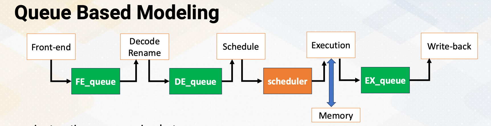
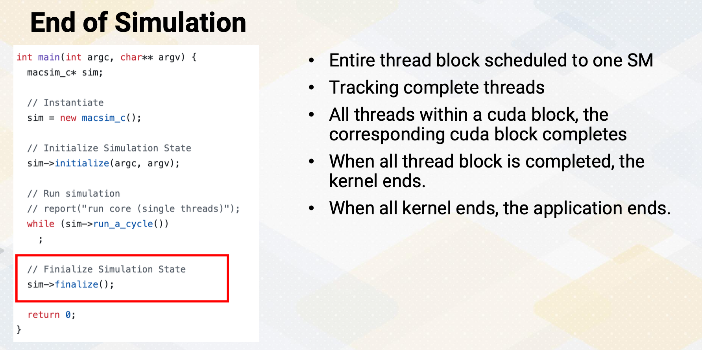
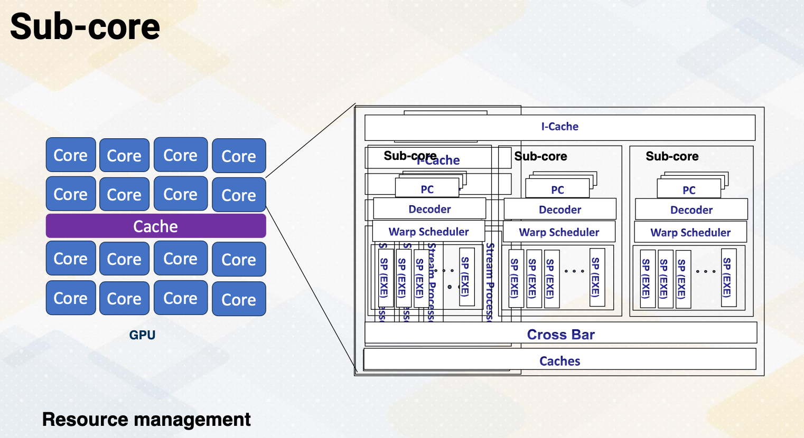

### Objectives

* Gain an understanding of the fundamental concepts required for modeling GPU architecture simulations.
* Learn how to employ analytical models for performance modeling of GPUs.

### Readings

Required Readings:
* Changxi Liu, Yifan Sun, and Trevor E. Carlson. 2023. Photon: A Fine-grained Sampled Simulation Methodology for GPU Workloads. In Proceedings of the 56th Annual IEEE/ACM International Symposium on Microarchitecture (MICRO '23). Association for Computing Machinery, New York, NY, USA, 1227–1241. https://doi.org/10.1145/3613424.3623773. (https://dl.acm.org/doi/10.1145/3613424.3623773)
* Samuel Williams, Andrew Waterman, and David Patterson. 2009. Roofline: an insightful visual performance model for multicore architectures. Commun. ACM 52, 4 (April 2009), 65–76. https://doi.org/10.1145/1498765.1498785

Optional Readings

* Computer Architecture Performance Evaluation Methods (Synthesis Lectures on Computer Architecture)https://link.springer.com/book/10.1007/978-3-031-01727-8 (local copy: https://gatech.instructure.com/files/49589403/download?download_frd=1)
* S. Karkhanis and J. E. Smith, "A first-order superscalar processor model," Proceedings. 31st Annual International Symposium on Computer Architecture, 2004., Munich, Germany, 2004, pp. 338-349, doi: 10.1109/ISCA.2004.1310786.
* Jen-Cheng Huang, Joo Hwan Lee, Hyesoon Kim, and Hsien-Hsin S. Lee. 2014. GPUMech: GPU Performance Modeling Technique Based on Interval Analysis. In Proceedings of the 47th Annual IEEE/ACM International Symposium on Microarchitecture (MICRO-47). IEEE Computer Society, USA, 268–279. https://doi.org/10.1109/MICRO.2014.59
* Sunpyo Hong and Hyesoon Kim. 2009. An analytical model for a GPU architecture with memory-level and thread-level parallelism awareness. In Proceedings of the 36th annual international symposium on Computer architecture (ISCA '09). Association for Computing Machinery, New York, NY, USA, 152–163. https://doi.org/10.1145/1555754.1555775Links to an external site.

### Module 8 Lesson 1 : GPU Cycle Level Simulation (Part 1)

Course Learning Objectives:

* Describe cycle-level performance modeling for CPUs and GPUs
* Explain queue-based performance modeling
* Describe the basic simulation code structures for CPUs and GPUs
* Get ready for the architecture modeling programming project

#### Performance Modeling Techniques

There are several performance modeling techniques: 
* cycle-level simulation, 
* event-driven simulation, 
* analytical model,
* sampling-based techniques, 
* database statistical and ML modeling, and 
* FPGA based emulation.

We will provide a brief introduction of these techniques.

#### Cycle Level Simulation

* First cycle-level simulation, this is commonly used in many architecture simulators, especially for the earlier hardware design time.
* In the cycle-level simulation, a global clock exists.
* In each cycle, events such as instruction fetch and decode are modeled. 
* Multiple clock domains can exist, like memory clock, processor clock, NoC clock domains.

#### Execution Driven vs. Trace Driven Simulation

In the cycle-level simulation, two types of simulation techniques exist, execution driven versus trace driven. In the execution driven, instructions are executed during the simulation. Depending on when an instruction is actually executed inside the simulator, there are also two different simulators, execute-at-fetch versus execute-at-execute. Execute-at-fetch means instructions are executed when an instruction is fetcheted. Execute-at-execute means instructions are executed at the execution stage. Most of the time this difference is not noticeable, but as execution driven simulator designers, this decision has to be made.

Trace driven is based on traces Here because traces are collected in advance, simulations and executions are decoupled. Benefits of execution driven is there is no need to store traces, and it can also model behavior that vary at runtime. On the other hand, trace driven cannot model run-time dependent behavior such as lock acquire, and barriers. In general, trace driven simulators are simpler and often lighter. So it's easier to develop. Also, you can just collect memory traces only for memory simulations or cache simulations.

#### Queue Based Modeling

{: width='400' height='400'}

In the cycle-level simulations, queue-based modeling is often used. In the five-stage pipeline between pipeline stages, we'll have queues except for scheduler. In this diagram, green box shows the queues, and this illustrates how we model five-stage pipeline using queues. Instructions move between queues. Scheduler selects instructions that will be sent to the execution stage among ready instructions. Hence, it is not implemented as a queue structure. Other queues are FIFO structures. When the instruction is complete, the dependent instructions are ready. The dependency chain needs to be modeled and broadcasting also needs to be modeled, just like the actual hardware. Cache and memory are modeled to provide memory instruction latency. Execution latency can be a simple look up table to find the latency if the latency does not depend on runtime behavior.

#### Modeling Parameters with Queue Based Modeling

Then let's discuss how to set the modeling parameters when you use queue based modeling. The number of cycles in each pipeline stage is simply modeled by the depth of the queue. How many instructions can move between queues represent pipeline width, such as issue/execution bandwidth. At this moment, you might wonder how we should know the latency of each instruction that we can model. You might wonder whether we need circuit level simulators to find the latency. The answer is we don't need to measure the instruction latency, instruction latency is given as a parameter such as ADD instruction takes one cycle and MUL instruction takes three cycles. Latencies can be obtained from literature, or we could use more detailed simulators like CACTI or RTL. There are many public documentations that discuss such instruction latency.

#### 5-stage CPU Processor Modeling

{: width='400' height='400'}

Here is an example of five-stage processor modeling code, which is from a macsim, a CPU and GPU simulator that is developed from Georgia Tech. In the main function, it instantiates macsim simulator. In the simulator, first, it initializes the parameters. After that it starts to call run a cycle of the simulator until the simulation can end. Inside the macsim module's run a cycle , it increments cycles. Then it goes through CPU memory Noc run a cycle. In the CPU run a cycle, it goes through each pipeline's run a cycle. The simulator is also built on hierarchical modules.

#### example

{: width='400' height='400'}

Each modeled instruction has an op data structure. The op structure will go through the pipeline from the front end to the decode stage to the scheduler, execution and write-back and then retires. This op data structure tracks instruction progress and cycles. For example, done_cycle in op data structure indicates the done_cycle by adding schedule time and instruction latency. Done cycle indicates when an instruction is completed. When the processor schedules an instruction, at that time we can know when the instruction is completed if the instruction has a fixed instruction latency. So when the scheduler is executed, it can compute this done cycle. The exception is if the latency is not fixed, such as cache misses. in that case, we use cache simulations which model cache hit and misses. Then we can know the memory instruction latency. And based on those instructions, we add the latency into the done cycle.

#### Scheduler 

The role of scheduler is to identify ready instructions. Scheduler also needs to handle research constraints. For example, even though there are multiple instructions already, this should schedule only the instruction that can be executed for the given resource. For example, number of floating point instructions, number of load and store queues, execution with ports in the cache systems. If an instruction takes multiple cycles, the resource contention should be also considered that. It should ensure that resources are available for multiple cycles.

#### GPU Cycle-Level Modeling

Now let's talk about how to model GPU cycle-level modeling. In some sense it is similar to CPU modeling. One of the biggest factor is the simulation execution unit is a warp instead of thread to model SIMT behavior. Warp instruction is model for fetch, decode, schedule, and execution. Scheduler chooses instructions from the head of each warp because it is an in order scheduler. The difference from CPUs is an in order scheduling within a warp, but it can be an out-of-order execution across warps. Major differences between CPU and GPU in terms of modeling are first handling divergent warps. Then warp, thread block, kernel concepts should be implemented to reflect GPU execution model. Scheduler also needs to be modeled significantly differently.

#### End of Simulation

{: width='400' height='400'}

Now let's discuss the end of simulation. First, entire thread block scheduled to one SM. The simulator needs to track complete threads, which means the end of the program instructions. When all threads within a cuda block completes, the corresponding cuda block completes and can be retired. When all thread block is completed, the corresponding kernel ends. When all kernel ends, the application ends. So the simulator also needs to follow the execution hierarchy. In summary, in this video, CPU and GPU cycle-level simulation techniques are reviewed. We also reviewed how to model latency and bandwidth using queues

### Module 8 Lesson 2 : GPU Cycle Level Simulation (Part 2)

Course Learning Objectives:

* Describe advanced GPU cycle- level modeling techniques such as divergent warps, coalesced memory
* Introduce several open source GPGPU simulators

In this video, we'll continue GPU cycle level simulation. Throughout this video, learning objectives are, first, to describe advanced GPU cycle-level modeling techniques such as divergent warps, coalesced memory. We'll also discuss several open-source GPGPU simulators.

#### Modeling Unit

In the GPU simulator, the modeling unit is a warp. 
* Instructions are modeled at a warp level, such as accessing I-cache and also accessing PC registers. 
* This reflects microarchitecture behavior. Because modeling unit is a warp, but not all threads within a warp might be executed together, 
* mask bits are needed to keep track of resource constraints.
* Then a question arise, how to model divergent warps and memory coalescing?

#### Recap: Divergent Branches

{: width='400' height='400'}

Let's recap divergent branches. Divergent branch is called when within a warp instruction takes different paths. We reviewed how microarchitecture is implemented using the SIMT stack. The architecture simulator also needs to model the SIMT stack. In case of execution driven simulation, it can be done by faithfully model SIMT stack. Different ways of handling SIMT stacks can be modeled in the execution driven simulation. In the trace driven simulation, it has to follow how the traces are collected. Hence, it's challenging to simulate different divergent branch handling mechanisms than the trace collection machines. To model divergence, the trace should contain all the paths such as BB #1 has 1111, but BB #2 has 1100, and BB #3 has 0011. And then branches are merged, so BB #4 has 1111. The trace needs to have these contents of the mask bits.

#### Memory Coalescing Modeling

Modeling memory coalescing is crucial. Memory requests need to be merged because it is critical to model the number of memory transactions and also bandwidth requirements. All memory source modeling is dependent on the number of memory transactions. Typically, this follows cache line sizes because memory requests are first accessed the cache and then it is already aggregated from the cache line granulity. 

{: width='400' height='400'}

Let's look at an example. A 64 byte cache line size is already assumed in this example. In the first memory request based on R1 register content, all memory access are coalesced and they generate only one memory request. In the second memory request, based on R2 register content, all memory requests are uncoalesced. Each individual memory request also generates 64 byte memory request.

#### Modeling Memory Coalescing with Trace

If you want to model memory coalescing traces, the trace should contain all the memory addresses from each work. The trace generator can insert all memory instructions individually, such as for va 1, 2, 3, 4 or trace generator already coalesces memory request, and this can reduce the trace size. In the previous example, the trace could contain separate memory requests such as address 0x0, 0x4, 0x8, 0x12, 0x16 etc., or it could just have 0x0 and the size information. The downside of this method is memory transaction size can be varied by microarchitecture. So this requires generate new traces if modeling microarchitecture use different memory transaction sizes.

#### Cache Hierarchy Modeling

{: width='400' height='400'}

After memory addresses are coalesced, memory requests can access TLB, L1, L2 caches depending on GPU microarchitecture. The simulator can be also modeled by having different cache hierarchies. This is fairly similar to CPU modeling, but in the GPU modeling, memory coalescing is very critical.

#### Sectored Cache Modeling

{: width='400' height='400'}

Modern GPUs adopt sectored cache. Sectored cache allows bringing a sector of the cache block instead of the entire cache block. The main benefit is it reduces the memory bandwidth. The main downside is it reduced spatial locality. In the previous example, the first instruction generates 64 byte request. So then we bring entire cache block. In the second instruction it generates 64 bytes of a memory request. But with a sectored cache, it can bring only one sector instead of the entire cache line, similar to here, only one 16 byte. And for the next memory request, again another 16 byte, for the next memory request, again, another 16 byte.

#### GPU Simulators

GPU simulators. Several open source GPU simulators are available. GPGPU-Sim which is the most popular simulator for modeling GPU models, NVIDIA PTX/SASS and it is an execution driven simulators. It is mainly targeting GPGPU. Accel-Sim which was developed by the same group as GPGPU-Sim is targeting for NVIDIA PTX/SASS and this is a trace driven and it is targeting more accelerators, MGPU-Sim models AMD GPU, and it is an execution driven. And the key feature is multi GPUs are supported. Macsim models NVIDIA and Intel GPU, and it is trace driven and execute heterogeneous computing. Gem5-GPGPU-Sim is combining Gem5, the most popular UCP simulator and the GPGPU-Sim. There are multiple versions. It could support AMD GPU or it could support NVIDIA GPU. It is also execution driven, and heterogeneous computing is modeled by executing both CPUs and GPUs. In this video, We reviewed CPU and GPU cycle-level simulation techniques. To support divergent warps, it is necessary to either model the SIMT stack or include mask bits inside the trace. Modeling memory coalescing is also one of the most critical part of the simulations.

{: width='400' height='400'}

### Module 8 Lesson 3 : Analytical Models of GPUs

Course Learning Objectives:

* *CPU and GPU cycle level simulation techniques are reviewed.
* Analytical model provides the first order of processor design parameters or application performance analysis.
* CPI computation was reviewed.
* Roofline was introduced.
* Compute bounded or memory bandwidth bounded is the most critical factor.

In this video, we will study analytical models of GPUs. Throughout this video, we'll describe analytical models of GPUs. We'll also apply analytical models to determine the first order of GPU design space explorations. And after this video, we should be able to explain CPI and interval-based analysis. The video will also describe the roofline model.

#### Analytical Models

Analytical models do not require the execution of the entire program. Analytical models are typically simple and capture the first order of performance modeling. Analytical models often provide insight to understand performance behavior. It's simple, but it is much  easier to understand. As an example of analytical model, let's first try to design the GPU architecture.

#### First Order of GPU Architecture Design (1)

Let's consider accelerating a vector dot product with a goal of 1T vector dot products per second. The target equation will be sum += x[i] * y[i]. For compute unit, we need to achieve 2T FLOPS operations, multiply and ADD, or 1T FMA/sec. FMA means floating point multiply and add, and many of FP operations are typically built for doing multiplication and accumulations. If GPU operates at 1 GHz, 1000 FMA units are needed. If it operates at 2GHz, 500 FMA units are needed. Memory units also need to supply two memory bytes for reading x and y array values, which means 2TB/sec memory bandwidth.

#### First Order of GPU Architecture Design (2)

{: width='400' height='400'}

500 FMA units are approximately equal to 16 warps, if we assume the warp width is 32. If each SM can execute one warp per cycle at 2 GHz and there are 16 SMs, then it can compute 1T vector dot products. Alternatively, we could choose to have 8 SMs and each SM can execute two warps per cycle.

#### First Order of GPU Architecture Design (3)

{: width='400' height='400'}

After we figure out the number of total FMA units, we also need to decide the multithreading design factors. In other words, we have to know the total number of active warps in each SM because in the previous slide it only computes the total execution time and bandwidth. To define the multithreading resource design factors, let me introduce the design parameters W_width and W_depth. W_width is number of threads that can run in one cycle such as 32. W_depth is the maximum numberof unique threads that can schedule during one stall cycle. So total W_width times W_depth number of threads can be executed in one SM. In this example, if you assume comp_inst and mem_inst for each warp. If there is one warp and if there is a memory instruction that generates a stall, then the pipeline has to be stalled until the memory cost is satisfied. If there are two warps, one additional warp can be scheduled during the stall cycle. If there are four warps, three additional warps can be scheduled, which can actually hide the stall cycles completely. W_depth indicates 1, 2, 4 in this example.

#### W_depth and W_width H/W Constraints

{: width='400' height='400'}

Then what decides W_depth and W_width in the hardware? W_width is determined by the number of ALU units, along with the width of the scheduler. W_depth is determined by the number of registers, along with the number of PC registers. W_depth 20 means 20 X 32, which is W_width assumption, times number of register per thread. In total, 20 X 32 times number register per thread, number of registers are needed. W_depth 20 also means that at least 20 X W_depth number of PC registers is needed.

#### Finding W_depth

How to decide W_depth? The design choice of W_depth is strongly correlated with the memory latency. If we use the dot product example and if we assume the memory latency 200 cycle, in the first case, there is 1 comp instruction and 1 memory instruction. Then to hide 200 cycles, 200/ (1 comp + 1 memory) which means 100 warps is needed. If you assume a different application, if you have 1 memory instruction per 4 compute instructions, to hide 200 cycles, 200/(1+4), which means 40 warps are needed.

#### Decision Factors for the Number of SMs

How do we also decide the number of SMs? Let's revisit the previous example, which has 500 FMA units. We could have 1 warp X 16 SMs or we could have 2 warps X 8 SMs. Both give the same total number of execution bandwidth. The first option means large but fewer number of SMs, and the second option means small but many SMs. When we consider number of SM design decisions, we also need to consider the cache and registers need to be split across SMs. In other words, in the first case, it will be large cache for fewer SMs, in the second case, it will be small cache but for many SMs. Again, both also give the same size of total cache capacity. Large cache increases cache access time, but having a large cache, which are shared by multiple thread blocks, might increase cache hits when they are data sharing among multiple CUDA blocks. So this is a trade-off and we need to be a little more detailed analytical model to consider this effect. Sub-core can be also used as a design decision factor. And many of these decisions require more detailed analysis, especially the trade-off analysis between the size and access time.

#### Sub-core 

{: width='400' height='400'}

Sub-core. This is mainly for the resource management. So far, we have assumed that one core has a PC and one scheduler and execution units. In the sub-core, there are multiple sub-cores which have a similar structure as previous diagram, PC, decoder, warp scheduler, but these multiple sub-cores inside one SM share the same I-cache and large caches. 

#### Roofline Model

{: width='400' height='400'}

Let's look at a roofline model. Here's a diagram for the roofline. The Y-axis shows performance and since the performance chart looks like a roof, the name comes from that. This is a great visual performance model to determine whether an application, or sometimes a processor is limited by the compute bandwidth or memory bandwidth. Here the X-axis means arithmetic intensity, which shows how much floating point operations per byte. Then first in the right side, the yellow bound shows the compute bounded and the blue side shows memory bounded. The fuller side shows hardware's peak flops, the compute peak performance. 

Let's look at an example. In the vector sum example, we need two bytes for one flops, which means arithmetic intensity is 0.5. This belongs to the memory bounded regions. But if you change an example to compute sum+=x[i]*x[i]*y[i]*y[i] in that case, we bring 2 bytes, the same as the vector sum x[i] and y[i], but we have to compute the 4 floating point operations. Then it increase arithmetic intensity to two. That moves this performance to this more in the compute bounded side. We can analyze the performance applications, whether these are memory bounded or compute bounded and whether there is room to improve performance by optimizing an application. 

#### CPI (Cycle per Instruction) Computation

Let's look at another example of performance modeling. The CPI, cycle per Instruction computation. The average CPI can be computed by CPI steady state plus CPA event1, event2, event3, etc. CPI steady state represent sustainable performance without any missed events. Then whenever there is a event, we can have CPI events. 

Let's look at an example of five stage in-order processor.

The CPI steady state equals 1. And CPI for branch misprediction event is three. And CPI for cache missed event is five. If an application has 2% instruction that has branch misprediction and 5% instruction that has cache misses then we can compute average CPI by computing 1+ 0.02*3, the frequency of event times the CPI of event. We can summate all this event. We also add 0.05 times five, which gives the average CPI. It's very easy to compute average performance. In this modeling all penalties are assumed to be serialized.

#### CPI Computation for Multi-threading

Then can you expand this CPI for multi threading? Ideally CPI for multi threading equals CPI single thread/W_depth. W_depth is the number of warps that can be scheduled during the stall cycles which we have used in this video. By considering this effect, CPI multi-threading can be CPI ideal multi threading plus any additional resource contentions. The resource contentions could be MSHR which is related to the number of memory misses and busy state of execution units, and DRAM bandwidth, etc. Since GPU is an extension of multi-threading, we can utilize CPI modeling to model the GPU performance.

#### Interval Based Modeling: Extension of CPI Modeling

{: width='400' height='400'}

An extension of CPI modeling is an interval based modeling. In the simplified Interval based modeling, first an interval is defined in such that one steady state and one long latency event. So there is a steady state which has the same performance as effective dispatch rate. And then there is a penalty period. During the penalty period, none of the instructions are executed. And the ratio between the base and penalty is dependent on event. To improve this model first-ordering modeling was proposed in ISCA 2004 which modeled the effect of pipeline drain and refill time. Instead of the pipeline being stalled abruptly it models the slow down of the execution, similar to drain the pipeline. And when the pipeline starts to execute, it slowly refills. You can also look at the diagram such as that y-axis is a number of instruction that can be executed. And this method is called interval based modeling. 

#### Applying Interval Analysis on GPUs

To develop an interval analysis for the GPU, the Naïve approach is to treat GPU as just a multi-threading processor. The major performance differences between GPU and multi threading processor would be caused by the following two important factors. First, branch divergence, because not all warps are active and some part of the branch code is serialized. Second, memory divergence, because memory latency can be significantly different depending on memory is coalesced or uncoalesced. To accurately model the GPU performance with interval analysis, these two factors need to be considered. And newer GPU interval analysis models improve the performance models by modeling sub-core, which we discussed briefly, and sectored cache and other resource contentions.

In summary, CPU and GPU cycle level simulation techniques are reviewed. Analytical model provides the first order of processor design parameters or application performance analysis. CPI computation was reviewed which has been used in many architecture studies. Roofline design was introduced. And compute bounded or memory bandwidth bounded is the most critical factor in deciding the performance aspect.

### Module 8 Lesson 4 : Accelerating GPU Simulation

Course Learning Objectives:

* Describe techniques to accelerate simulation speed
* Identify challenges in cycle- level simulation
* Explore techniques for accelerating simulation
* Describe sampling based techniques

Hello, We'll study techniques to accelerate GPU simulation. In this video, we're going to talk about ways to speed up simulations. We will also discuss the challenges we face when simulating GPU architecture. We will also explore different methods for making GPU simulations run faster. Finally, we introduce techniques that involve sampling.

#### Challenges of Cycle Level Simulation

First, the problem with the cycle level simulation is that it takes a very long time. To give you an idea, if we simulate a speed of one kilo instructions per second, it would take us roughly 28 hours to simulate one billion instructions, which is just one second on a real machine. Imagine simulating machine learning workload that takes hours in a native execution. Simulation of this workload would take the time that is equivalent to a century of real world simulation time.

#### Accelerating Simulations

Now, let's talk about how we can speed up our simulations. First, we can make the simulation itself run faster. Possible techniques are parallelizing the simulator to utilize parallel processors, event-driven simulation as opposed to a cycle level simulation. We can also simplify the model which might reduce accuracy, but often it increases the simulation speed significantly. Sampling techniques are commonly used. There is also statistical modeling and machine learning based modeling to build a simple model.

Second, reducing the workload itself,. We could use micro-benchmarks which represent the original program behavior. Or simply reduce the workload size such as use one iteration training phase instead of 1,000 iterations. If the workload is too complex, creating small representative workload is another approach.

#### Parallelizing Simulator

{: width='400' height='400'}

Parallelizing simulator. An easy way of parallelizing simulator is each thread models a core. However, there are some issues, especially with memory and communication between different parts of the cores. Although cores can be parallelized, such as communication, and memory would need to be serialized. Furthermore, these days most of the workfloads are memory bounded. So the modeling memory and communication would be performance bottlenecks. 

#### Event Driven Simulation

{: width='400' height='400'}

Event-driven simulation. Instead of going through each cycle, we can operate the simulator based on events. This can help us speed up simulations, especially when there are long delays involved, such as I/O operations. We write operations of NVM, which is known to be a long latency operation. With an event-driven simulation, the simulator just keeps adding new events to a queue and processes these events in order, and increments the time to the next event time.

#### Simplifying Models

Simplify models. Depending on what we're simulating, we can simplify our models. We might use average values such as average latency or throughput for events that aren't critical. Or the behavior is commonly consistent during the entire workload. It is important to know which events are critical to model or not. For example, when you model a pipeline processor, one option is to simplify the execution pipeline. Instead of modeling instruction/fetch/decode/execution, we could assume IPC is equal to issue width. Then model only caches and memory.

As a real example, z-sim CPU simulator simplifies the core pipeline. Another option is modeling a pipeline is to simplify the memory model as opposed to the first case. In this case, the simulator assumes memory system has a fixed latency. This is useful when it evaluates different computing models in a pipeline.

#### Sampling Techniques

{: width='400' height='400'}

Sampling technique involves taking samples of the simulation. We can do random sampling where we randomly pick certain parts to simulate. There are also execution-driven sampling which let us skip parts that don't need to simulate or use a checkpoint based method. Another method is trace-driven simulation where we generate traces for specific simulation sessions. When we use a sampling technique, we need to be careful how to handle state information. For example, for cache and branch predictors, warming up time is needed. Or by running a simulation for a long time, the initialization effect won't affect  the final simulation result. Instead of random sampling, detecting the program phase and simulating representative portion of the program is also very commonly used. Simpoint technique is commonly used for that purpose. As shown in the diagram, program has two phases, high IPC phase A which is represented as a green box area, and low IPC phase B which is represented as purple box area. And the program repeats these two phases. In this case, instead of simulating the entire application, we can simply simulate phase A and phase B only. 

#### GPU Sampling Techniques

For GPUs, sampling techniques are slightly different. As GPU executes SPMD style program, one single thread's execution length is too short. And instead, it has many number of threads. To address this, we can use block level sample, kernel level sampling, or warp level sampling. For example, in the CUDA block level sampling. We could simulate 100 CUDA blocks instead of thousands of CUDA blocks. Or for the kernel level sampling, we can simulate only one or two kernels instead of tens of kernels. These techniques can be very effective for machine learning workloads, since they repeat the same kernel for hundreds of times. Another approach is warp level sampling, which reduces the number of warps to simulate.

#### Reducing Workloads

Reducing workload techniques. As we discussed in the previous slide, we can reduce the number of iterations. Machine learning workload runs thousands iterations. Each iteration shows very similar characteristics. Hence, instead of 1,000 iterations, we can simulate only once. The second method is to reduce the input size. For example, a graph processing application traverses for one billion nodes. By reducing the input graph size, we could make the graph algorithm traverse only for one million nodes. In the third method, we just focus on the most important parts of a program or kernel to simulate. For example, a program has hundreds of functions, but only one or two functions dominate 90% of the application time. In that case, we can change the applications to run only those two kernels. 

#### Data-Driven Modeling

{: width='400' height='400'}

We might use data-driven modeling to figure out how to simplify the model instead of using cycle level simulator. This is somewhat similar to analytical model but instead of constructing the model based on the understanding the underlying architecture behavior, this approach is purely based on data to construct a model. First, by running an application on the hardware, it collects important statistics such as IPC. And then it collects other stats, such as the number of instructions, the number of loads, the number of divergent branches that can explain the program performance behavior. This step is similar to feature extractions. These events can be collected with hardware performance counters or using a simulator. And then use statistical or ML analysis to construct a model. A simple example can be following. The total cycle count is the sum of different event counter values times different coefficient values raise to a power. Such as cycle count is the sum of C1 times instruction count to the exponent 1 and C2 times floating point instruction count to the exponent 2, and C3 times memory instruction count to the exponent 3. The coefficients and exponent values can be found by collecting data and using a statistical or machine learning based modeling.

In summary, we talked about various techniques for making simulations run faster. We've placed a special emphasis on sampling and reducing the workload size.

<!--  -->