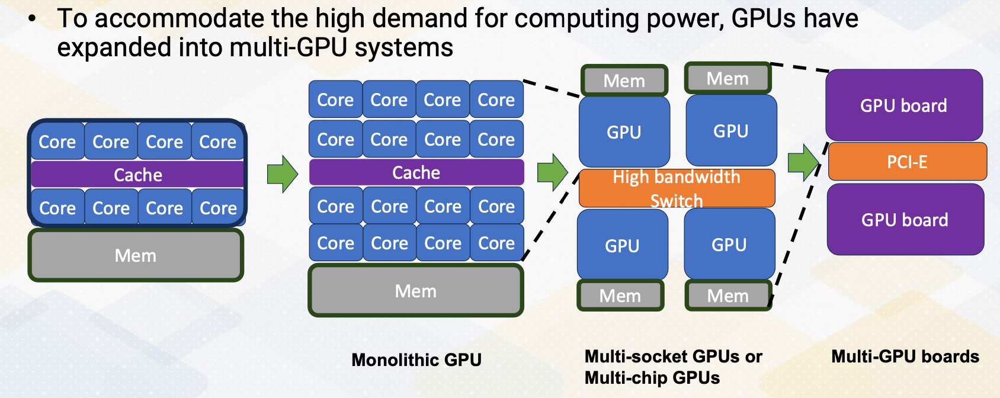

### Objectives

* Understand multi-GPU architecture
* Understand the challenges of multi-GPU architectures
* Understand how to increase concurrency on multi-GPUs 

### Readings

Required Readings:
* Arunkumar et al., "MCM-GPU: Multi-chip-module GPUs for continued performance scalability," 2017 ACM/IEEE 44th Annual International Symposium on Computer Architecture (ISCA), Toronto, ON, Canada, 2017, (https://ieeexplore.ieee.org/document/8192482)

Optional Readings:

* https://www.nvidia.com/en-us/data-center/nvlink/
* https://developer.nvidia.com/blog/upgrading-multi-gpu-interconnectivity-with-the-third-generation-nvidia-nvswitch
* https://docs.nvidia.com/cuda/gpudirect-rdma/index.html
* Yu, Fuxun, Di Wang, Longfei Shangguan, Minjia Zhang, Chenchen Liu and Xiang Chen. “A Survey of Multi-Tenant Deep Learning Inference on GPU.” ArXivabs/2203.09040 (2022): 
* Zhisheng Ye, Wei Gao, Qinghao Hu, Peng Sun, Xiaolin Wang, Yingwei Luo, Tianwei Zhang, and Yonggang Wen. 2024. Deep Learning Workload Scheduling in GPU Datacenters: A Survey. ACM Comput. Surv. 56, 6, Article 146 (June 2024), 38 pages. https://doi.org/10.1145/3638757
* https://docs.nvidia.com/deploy/pdf/CUDA_Multi_Process_Service_Overview.pdf

### Module 9 Lesson 1

Course Learning Objectives:

* Describe multi-GPU architecture
* Describe the challenges of multi-GPU systems
* Introduce thread block scheduling and memory management in multi-GPUs
* Explore alternative communication options in multi-GPUs

In this module we'll cover multi-GPUs, which are commonly used for data center GPUs. In this video, we'll discuss the hardware aspect of multi-GPU systems. The video will provide multi-GPU architecture and its core principles. The learning objectives of this video are, to understand the obstacles and complexities that multi-GPU systems present and how to address them. It will also provide an example of thread block scheduling and memory management techniques in the context of multi-GPUs. We'll also explore alternative communication options designed specifically for multi-GPUs, offering enhanced data exchange capabilities.

#### Multi-GPUs

{: width='400' height='400'}

As the computing demand gets higher, GPUs have involved to scale up. First, GPU has evolved by increasing number of cores. However, in the monolithic GPU approach, the scaling would face several challenges, including cost, reliability. To overcome those challenges, the next way of scaling up is by connecting GPU chips using silicon interposer, or multi-sockets. After that, it even scale up by connecting the GPU board with multiple PCI Express connections.

#### Multi-GPU Connections

{: width='400' height='400'}

Let's look at a little bit more on connecting multi-GPUs. To scale up packaging level integration of multi-GPU modules have shown up to build a larger logical GPUs, which can enable continuous performance scaling beyond Moore's law. To accommodate the high bandwidth requirements of DRAM request, 3D stack memory like HBM has been connected. The entire systems, I/O bandwidth needs to be shared. In the NVIDIA, the connections is also done with NVLINK technology. Although the inside GPUs is composed of multiple GPUs, for programmer's viewpoint, these are still just many SMs. All memories are accessible using global memory, which can be considered as a shared memory program space. The challenges is that memory is NUMA, non-uniform memory accesses which can be considered near memory and far memory in terms of memory latency and even for the bandwidth aspect, which brings two important questions.

How to schedule thread block in this GPU and how to allocate a page? One of the simple solution is to allocate the page in the near memory that the thread block is scheduled.

#### Thread Block Scheduling and Memory Mapping

{: width='400' height='400'}

Here is an example. Let's assume that there are several thread blocks and each of them use different memory areas.

{: width='400' height='400'}

In a round-robing scheduling, each GPU will get different thread blocks. To make it simple, we just assume each GPU gets only one thread block. When the thread block request to access a certain page, the page will be allocated to the corresponding GPUs DRAM. This is first touch based allocations.

{: width='400' height='400'}

And after that, additional thread block will be scheduled. For example, Thread 5 is scheduled where thread block was originally scheduled. 

{: width='400' height='400'}

In this case, it will bring Page 10, but for Page 8, it becomes a far memory accesses. So it's important to schedule a thread block on GPUs that utilize a memory locality.If the schedule allocates the thread block where Page 8 is located, Thread Block 5 would have only near memory accesses. As an alternative option, memory pages can be migrated if there are enough far memory accesses.

#### NVLink/NVSwitch

{: width='400' height='400'}

NVLink is an alternative communication option to PCI Express bus. It's a NVIDIA's communication protocol. It provides high speed communication between GPU to GPU. For example, fourth generation of NVLink provides 900 GB/s per GPU and it has 18 links per GPU. To give an idea, H100 has 3 TB/s memory bandwidth with HBM3. So NVLink has about one fourth of memory bandwidth. As the number of GPUs gets increased, to provide more scalability of point to point communications. NVIDIA introduced Switch which is called NVSwitch. Hence multi-GPUs are connected with the NVSwitch and NVLink, which provide higher bandwidth and shorter latency with many GPUs. 

#### Memory Space

{: width='400' height='400'}

When memories are located through PCI Express bus, it will use different memory spaces. GPUs are connected with the PCI Express with the CPUs. But it doesn't provide enough communication bandwith to communicate different GPUs memory spaces, hence across multi-GPUs board. It uses RDMA to communicate. This programming is more like distributed memory systems. The RDAM connections are point to point and all memories can be connected. But in this figure in the slide, to simplify this figure, we only show one RDAM connections.

#### Backgrounds: RDMA Technology

* Traditional communication
* Use TCP/IP like network to go through the network software stack
* Use CPU resource

{: width='400' height='400'}

* RDMA: Remote Direct Memory Access
* Similar to DMA (Direct Memory Access), the communication between memory to memory can be done without using CPU resource.
* Host-bypass technology

{: width='400' height='400'}

To provide a little bit background of RDMA. Traditional communication they use a TCP/IP like network, needs to go through the network of software stack and it uses the CPU resource to communicate. To send the contents of Buffer 1, it needs to go through CPU1 and CPU2 and then Buffer 2. This will use up CPU's resource and also it can be also limited by CPUs busy status. RDMA stands for Remote Direct Memory Access. It is similar to DMA, Direct Memory Access, as it enables communication between memory to memory without using CPU resource. It is a host-bypass technology. With RDMA from Buffer 4, it can go to Buffer 2 directly without going through CPUs.

#### GPUdirect RDMA

{: width='400' height='400'}

In case of GPU, It also allows to communicate directly buffer to buffer by network interface, which it uses NVLink and NVSwitch. It can be also used to communicate between GPUs and even other third party devices. This RDMA and NVLink and NVSwitch work together. Since there are so many GPUs need to communicate each other, PCI Express bus cannot meet this high demand. In summary, in this video we introduced how to scale GPU. We explained different communication methods in multi-GPU environment. We also introduce NVLink and communication benefits. We also introduced RDMA technology and provided some background knowledge and also explained how GPUs can benefit from RDMA.

### Module 9 Lesson 2

Learning Objectives

* Describe how to increase GPU utilization, particularly in the context of multi-GPUs
* Explore diverse strategies for efficiently managing multi-job workloads
* Discover different GPU concurrency mechanisms: Multi-Instance GPUs (MIG) and Multi Process Service (MPS), and Stream based programming

In this video, we will explore concurrency support on GPUs. Here, by the end of this video, we should be able to understand how to boost GPU usage, especially when dealing with multiple GPUs. We will explore various strategies to efficiently manage workload involving multiple jobs. We will discover different GPU concurrency methods including Multi-Instance GPUs, MIG, Multi-Process Service, MPS, and Stream based programming. Multi-GPUs offer impressive computing power. 

#### Increasing Utilization of GPUs

GPUs are great for handling multiple data tasks. Well, not all jobs can utilize the provided GPU computing power, so how can we make better use of them? This is even more critical for GPUs in data centers. Traditional data centers deal with multiple tenant jobs, whereas some workloads like LLM, consumes all GPU resource with just single tenant. The usage patterns are totally different from traditional data center workload. Therefore, some AI workload performance is limited by the slowest task.

#### GPU Concurrency Mechanisms

{: width='400' height='400'}

This slide illustrates different GPU concurrency support mechanisms. First we see the overview of GPU architecture. It shows SM which includes L1 cache and L2 cache. Then we have a DRAM. When you use stream feature in programming, multiple streams can be executed on GPUs. Only independent stream can be executed concurrently and stream is typically coming from one client. Multi-Process Service, MPS, where different clients are using different SMs, but the rest of the resource is shared. In Multi-Instance GPU, MIG, GPUs can be effectively separated for each client. 

#### Multi-Instance of GPUs (MIG)

{: width='400' height='400'}

Multi-Instance GPU, MIG, allows several jobs to run simultaneously on a single GPU. This provides to be an efficient way to harness the power of the large GPUS. MIG provides isolation for memory and GPU cores, accommodating multiple users. It also divides memory, L2 cache ports, DRAM memory bandwidth, and on-chip crossbar ports, ensuring quality of service, QoS. For instance, the A100 can host up to 7 instances, making it vital for cloud service providers in multi-tenant scenarios.

#### Multi Process Service (MPS) Support

On the other hand, spatial partitioning of multi process service support is available starting from V100 GPU. Before that it was only supported with only time slicing. It enables multiple jobs to run concurrently, but doesn't strictly partition resource, potentially leading to unpredictable performance. MPS methods can facilitate porting of MPI jobs to CUDA. In some cases, MPS may offer better utilization than MIG, especially when QoS isn't a critical concern.

#### Example of Stream Based Programming

{: width='400' height='400'}

Stream allows concurrent execution of multiple kernels. It allows multiple CPU threads to submit kernels. It overlaps between communication and computation across different streams. In the stream version, you will see Cuda MemCpyASYCN. OpenMP programs can be easily ported with the stream based programming. Scheduling among multiple streams can cause performance overhead because dependency needs to be checked. To overcome this, CUDA graph is proposed to construct dependency chain before a kernel launch.

#### Example of Programming for Multi-GPU

{: width='400' height='400'}

Now let's look at another example of using multiple GPUs. First, it allocates  memory for each GPU. So different GPUs have different memory object. We also call cudaSetDevice to indicate which device to use from the host side. Now we call gaussian_pdf   for each GPU, separate kernels are invoked. After that, we wait until all devices finish. Please also note that multi streams can be also used with multiple GPUs.

#### GPU Support for Multi-Tenant Computing

{: width='400' height='400'}

This table summarizes  different techniques streaming MPS, MIG. It shows different partitioning types and how the SMs are isolated, how memory bandwidth is isolated. And also explains each technique provides performing QoS and when these partitioning can be performed. In summary, we have explored GPU concurrency methods, including multi instance GPU, MIG and multi process service, MPS. Additionally, we also introduced the concept of stream based programming for multi-GPU scenarios.

<!--  -->