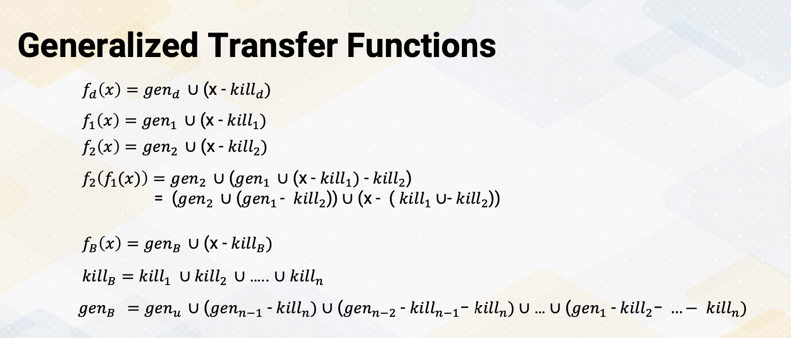

### Objectives

* Be able to explain comparisons with other GPU programming  

### Readings

Required Readings:
* OpenCL overview   

### Module 10 Lesson 1

Learning Objectives

* Demonstrate comprehension of the fundamental process of GPU program compilation
* Explore the components and stages involved in GPU compilation

In this module, we'll study backgrounds of compiler. In this video, first, let's understand the fundamental process of GPU program compilation. We'll also explore the components and stages involved in GPU compilation. 

#### Compiler Flow

{: width='400' height='400'}

Here is a typical compilation process. There is a source code and the front end compiler converts the source code into IR. And the compiler optimizer performs several optimizations using IR. And then backend code generation performs machine specific target optimizations and then it also emits a target program.

#### GPU Compilation Flow

{: width='400' height='400'}

Here, the GPU compilation process. It follows similar process. One interesting part of GPU code is that it has host code and device code. The code gets split and then they will go through the same compilation process. For NVIDIA GPU's case, it will eventually generate NV PTX code and then PTX assembly code will be combined with host and device code, then it becomes a fat binary.

{: width='400' height='400'}

Here is a diagram from NVIDIA which shows more complex steps. This includes also linking steps. NVIDIA uses runtime library which runs on the host code and also it has many libraries, so linking steps are crucial. Since PTX is a virtual ISA, the architecture is also called virtual architecture. You will find the descriptions about virtual architecture in this diagram.

#### GPU Compiler Pass 

{: width='400' height='400'}

This slide shows the first open source version of full CUDA program compilation tool chain. It shares similar passes with NVIDIA GPU compilation process. In the device code generation, it has a clang, and IR optimization and then NVPTX code generation.

#### Roles of CLANG

{: width='400' height='400'}

Just a couple of tool introduction. The roles of Clang are first, it is the front end parser. It is a tool chain for C-family languages, but lately it got extended to support other programming languages. It generates the abstract syntax tree AST. The right side of the slide shows an example of AST from Wikipedia. The figure is an AST from the bottom code which computes delta. This simple code can generate this much complex AST. The unit of definition in the node is depending on the usage of AST.

#### C++ PreProcessor

{: width='400' height='400'}

Next, C++ preprocessor. It performs text substitution for compilation. For example, in this slide it shows that there is a defined course Number 8803. After preprocessing, this course number is replaced with 8803. That's to be done by this C++ preprocessor.

#### IR Optimizations

What are in the examples of IR optimizations? IR is an intermediate representation, which will be discussed in the next video in more detail. They are in the back-end compiler process. IR provides a good way to share the compiler infrastructure across different program languages and different architectures. IR provides a good abstract and to perform many compiler optimizations. And IR also contains many meta data to carry program information to help compiler process.

#### PTX vs. SASS

Let us discuss a little bit more about PTX and SASS. PTX is a parallel thread execution, and PTX is a virtual ISA, which means it is architecture independent. And a PTX will be translated into machine code later. Because this is architecture independent, it doesn't have a target machine information, so PTX doesn't have register allocation. 

On the other hand, SASS is a real low level assembly language. It is an abbreviation of shader assembly. And this is architecture dependent assembly code, and it has target information so registers are allocated. If you have one version of a SASS code, and if we get a new GPU architecture, then the SASS code will be different in one or new version of GPU architecture, while in the PTX code will be the same across different GPU architectures.

#### Fat Binaries

In general, fat binaries contain execution files for multiple architectures. In the GPU's case, it supports multiple GPU versions and also it has host code. GPU compilation provides one binary, but this fat binary will be split. again for host and device at run time. And the device component will be sent to a device driver. And it is common that device driver code will recompile this device code and send it to the machine. In this video we recap the terminology of PTX, SASS, Clang, IR and fat binary. We also reviewed the overall compilation process for GPU programs, including its key stages and components.

### Module 10 Lesson 2

Learning Objectives
* Explain the basics of PTX
* Explore PTX instruction format
* Describe optional predicate information
* Understand PTX code examples

In this video, we will discuss PTX. The learning objectives of this video are explaining the basics of PTX, and exploring PTX instruction format, and describing optional predicate information. And then we'll be able to understand PTX code examples.

#### PTX Instruction

{: width='400' height='400'}

PTX instructions, here are the examples. PTX has zero to four operands. And it has optional predicate information following an @ symbol such as @p opcode, @p opcode a, etc. In @p opcode d, a, c, d is a destination operand and a, b, c are source operands. One of the important instructions in the PTX is setp, which writes two destination registers. It uses vertical bar to separate multiple destination registers. For example, setp.lt.s32 p vertical bar q, a, b. This instruction sets p = a less than b, and q is an opposite of p.

#### Predicated Execution

{: width='400' height='400'}

As we discussed earlier model, GPUs heavily use predicate execution to remove divergent branches. Predication is optional, so it follows @ symbol. And predicate registers can be declared as .reg, .pred, p, q,  r. And .pred type specifier is needed, because all registers are virtual in PTX, so we need to specify predicate register information. The slide's example shows if statement, and that is changed to predicate execution if i is less than n and j = j+1. This statement becomes two instructions. First setp instruction which is set up predicate value, and then the add instructions are predicated with p and add s32 j, j, 1. And here lt means less than. 

#### Example of PTX Code

{: width='400' height='400'}

Here is more examples of PXT code. PXT statement is either a directive or an instruction. Example of directives are target, address_size, function etc. Statement begins with an optional label and end with a semicolon. Here in this slide, we see directives to set up registers and global memory variables, and label start indicates a starting of program. And we see move, shift, load and add instructions. And we'll also see that all instructions have a type which indicates designation value types.

#### Other PTX Instruction examples

{: width='400' height='400'}

Here are other PXT instruction examples. Control flow instructions are bra targ1, which shows a branch instruction targeting label targ1. all func calls function name func, ret to indicate return from function call. There are also several synchronization instructions, membar, fence, those are for memory barrier and fence operations. Atomic instructions are indicated with atom prefix such as atom.add.f16. CUDA has many atomic operations including integers and floating point. So it is important to specify the type. There are also several special PXT registers. ntid is number of threads in a CTA, tid is thread ID, and sp is stack pointer. This is just a subset of PXT instructions, and you can find a complete set of PXT instruction in the PXT manual.

In this video, we reviewed PXT instructions. We also studied how PXT code is written for predicate execution to emphasize the importance of predicated execution. We also reviewed various examples of PTX instructions, including control flow, synchronization, and atomic instructions.

### Module 10 Lesson 3

Learning Objectives

* Describe intermediate representation (IR)
* Identify basic blocks within code
* Construct a control flow graph

In this video, we study IR and basic block. Here are learning objectives. This video will describe intermediate representation, IR, and it will also teach how to identify basic blocks within code, and it will also show an example of constructing a control flow graph.

#### IR

{: width='400' height='400'}

IR, is this an intermediate representation? Typically IR uses three address code such as A equals B op C. The equivalent version of this code in LLVM IR is %result = add i32 %a, %b. %result indicates a destination register and then also target variable. Add is an operation, and i32 indicates that the result of this instruction is 32 bit integer. And a and b indicate source operands. The corresponding PTX IR version will be add u32, r1, r2, r3 or add 32, r1, r2, r3 because PTX has a separate add for unsigned integer and also signed integer.

#### Basic block

What is basic block? Basic block is a **maximum** sequence of instruction streams within one entry and one exit. Since it has only one entry, only the first instruction in a basic block can be reached from outside. And since it has only one exit, once the program enters a basic block, all instructions inside a basic block needs to be executed. Typically, all instructions are **consecutively** executed. And it is also common that exit instruction is a control flow instruction.

One thing to note is optimizations within a basic block is typically **local code optimization** because it doesn't know outside of basic block and it optimizes the best it can do within a basic block scope.

#### Flow graph

{: width='400' height='400'}

Let's look at an example of flow graph. In the flow graph, each node represents a  basic block, and path indicates possible program execution path. A program typically has entry node, this is the first statement of the program. Here, if else statement that we have seen so far, in many cases, this if else statement will generate the following control flow graph. 

#### Example of if-else PTX Code (1)

{: width='400' height='400'}

Then let us look a little bit more realistic example in the PTX. Here is an if else code that's generated for PTX version. First, let's find the basic block from this example. In this code, blue font indicates labels. 

#### Algorithm to Find Basic Blocks

{: width='400' height='400'}

Here is an algorithm to find basic blocks. The first step is identifying a leader. Leader can be the first instruction in a program or any instruction that is the target of a conditional or unconditional jump or any instruction that immediately follows a conditional or unconditional jump. So in this example, first the first ld instruction is the first instruction in the program, so this is a leader. And the second the instruction, the label is_greater, is a target instruction of branch is greater. So this is also leader. And the instruction  is_smaller is also target of branch is smaller. 

So this is also leader instruction. Since that one of the condition says an instruction that immediately follows condition or unconditional jump is also a leader, this branch is smaller is also leader instruction because there is a branch is greater instruction. In step 2, we group instructions from a leader to the next leader, and then the group becomes a basic block. And here, the basic block 1, here basic block 2, and here basic block 3, and here basic block 4, etc.

#### Example of if-else PTX Code (2)

{: width='400' height='400'}

Once we identify a basic block, let's draw control flow graph. These basic blocks will generate the following control flow graphs. In basic block 1, it has a path to basic block 2 and basic block 3. And basic block 2 has unconditional jump to basic block 4, so it has a path. And basic block 3 has an unconditional jump to basic block 5. Both basic block 3 and basic block 4 means a basic block 5, which is an end_if label code. 

In this video, we covered intermediate representation, IR, and its significance. We explored the techniques for identifying and defining basic blocks, and we also demonstrated how to construct a control flow graph.

### Module 10 Lesson 4

Learning Objectives

* Explain global code optimization
* Understand example code optimizations
* Explain the basic concept of data flow analysis
* Explain the concept of reaching definitions

In this video, we study data flow analysis. Throughout this video, the learning objectives are: explaining global code optimization, understanding example code optimizations and also be able to explain the basic concept of data flow analysis. And also to be able to explain the concept of reaching definitions.

#### Global Code Optimizations

{: width='400' height='400'}

Global code optimizations. Local code optimization is optimization within a basic block. Global code optimization is optimization across basic blocks. And most global code optimization is based on data flow analysis. Since we need to understand how the property changes across basic blocks, we should have some mechanism to understand the property changes and that mechanism is based on data flow analysis. So most global code optimizations are based on data flow analysis. Data flow analysis, analyzes the effect of each basic block and analyses differ by examining properties. Please also note that the principal sources of optimization is compiler optimization must preserve the semantics of the original program. So the behavior of the program should be preserved even after you perform any optimizations. This is very critical to not to change any functionality of a program.

#### Examples of Code Optimizations

Examples of code optimizations. First, removing redundant instructions. Sometimes there are instructions that are doing the same work, in that case we want to remove such redundant instructions. Copy propagation. It finds constant values and it propagates those constants. And occasionally, after copy propagation we find redundant instructions. Dead code eliminations identifies the code that will never be executed. And so it eliminates such code. And code motions are performed to improve performance, it also detects induction variable because induction variable can have special optimizations and examples could be reduction strength.

#### Data-Flow Analysis Abstraction

Here, data-flow analysis abstraction. It is an execution of a program and it considers transformation of the program state.
* The input state is program point before the statement and 
* output state is program point after the statement.

#### Transfer Functions

{: width='400' height='400'}

It also uses the transfer function notations. OUT[B] = fB(IN[B]), the IN[B] is immediate before a basic block and OUT[B] is immediate after a basic block. fs is a transfer function of statement s and fB concatenates all these statements within a basic block. So it considers all the instructions inside a basic block. Often IN[B] is union or predecessors of basic block, the output values. So in the case IN[B] can be represented as, IN[B] = fB(OUT[B]) or OUT[B] equals a successor of basic block of IN[S]. Here is an example of control flow graph. Predecessor of basic block B means all blocks that are executed before the basic block B and successor of B is all blocks that are executed after the basic block of B. In this example basic block 5, the predecessors are basic block 3 and 4. And basic block 4 successor is basic block 5. So when you compute in our basic block 5, we should consider all the basic block 3 and basic block 4.

#### Reaching Definitions

{: width='400' height='400'}

Let's look at this transfer function a little bit more detail with reaching definitions. Reaching definition analyze whether a definition reaches or not. A definition d reaches a point p if there is a path from the point immediately following d to p without being killed, which means without being overwritten. In definitions, a variable is defined when it receives a value and use means when its value is read. For example, a = x+y and definitions a and uses x and y.

#### Gen and Kill

{: width='400' height='400'}

This can be also represented with gen and kill. There is a d statement u = v+w. It generates the definition d of variable u, at the same time it also kills all other definitions in the program that defines u. And with the transfer rotation, fd(x) = gen_d U (x-killd). And gen_d is the set of definitions generated by the statement and then killd is the set of all other definitions of U in the program.

{: width='400' height='400'}

Let's look at gen and kill set in more detail by looking at this example. It has a entry and it has four basic blocks and exit. Basic block B goes to basic block B2 and basic block B2 can go to basic block 3 or basic block 4. And then basic block B4 goes back to B2 or can exit. Basic block B1 has three statements, B2 has two and B3 has one and B4 has one statement.

First, basic block 1. The gen set is d1, d2, d3 because all these statements generate definitions. It generates definitions for i, j and a, which means it also kills all other definitions in a program that defines i, j, a. In this example, all the rest of the instructions d4, d5, d6, d7 defines one of i, j, a so the basic block 1 kills all other statement d4, 5, 6, 7. In basic block B2, it defines d4 and d5, which generates definition for i, and j. Again, that means it kills definitions of i, and j in the program,  d1, d2, and also d7. Basic block 3 generates definition in the statement d6, which generates definition of a, so then it also kills definition of a in other part of the program which is d3. In basic block 4, similarly, it generates definition for d7 which is an i, so that it kills definition of other statement that defines i, which is d1 and d4.

#### Generalized Transfer Functions

{: width='400' height='400'}

By having gen and kill set, we can apply these transfer functions to compute reaching definitions. We can first compute reaching definition for basic block 1, propagate the basic block 2. and then so on, so then we can generalize fB(x) = gen_B U(x-killB). And then killB is union of all the kill sets and genB is union of the previous basic blocks precessors. We will look at a more detailed example of this using transfer functions in next video.

In this video, we studied that global code optimization involves analyzing code across basic blocks. We saw that data flow analysis relies on transfer functions. We use reaching definitions within data flow analysis to illustrate an example.

### Module 10 Lesson 5

Learning Objectives
* Apply transfer functions for reaching definitions analysis
* Explore an example of reaching definitions in control flow analysis

In this video, we review the reaching definitions with an example. Here we apply the transfer functions to perform the reaching definition analysis. We will also explore an example of reaching definitions in the context of control flow analysis.

#### Continue the Example of Reaching Definitions

{: width='400' height='400'}

Let's continue the example of reaching definitions. In the previous video, we have created gen and kill set for each basic block. As a reminder, gen is the set of definitions generated by the statement in the basic block and the kill is the set of all other definitions of the corresponding variables in the basic block. So here we get basic block 1's gen and kill set and we have a basic block 2's gen and kill set and basic block 3 and 4 so on.

#### Control Flow Equations

{: width='400' height='400'}

In the control flow equations for reaching definitions, IN(B) is a union of all predecessors of out blocks. As a boundary condition, the entry of out is empty. With IN, the out of each basic block is IN minus the kill set in the corresponding basic block and then the union of genB set. Hence, the transfer function is fB(x) equals genB U ( x minus killB).

#### Algorithm

{: width='400' height='400'}

To compute this transfer function, the compiler implements the algorithm using an iterative process. First, we initialize out [ENTRY] as an empty set. For each basic block B, we also initialize Out[B] as null. In the iterative process, we go through each basic block. First we compute IN[B] by combining the out values of all predecessor blocks, then OUT[B] is computed using the transfer functions. Once we have processed all the basic blocks, we check for any changes in the OUT values. If there are changes, the iteration continues until none of the OUT values change.

#### Illustration of Reaching Definitions

{: width='400' height='400'}

Here is an example. First, all OUT[B] is initialized with zero and where each zero indicates the value of d1 to d7 as a 7-bit value. And here, this superscript indicates iterations. So here it shows the iterative initialization values and iterative 1s and iterative 2s. Let's start going through from the basic block 1. The basic block 1, the predecessor of basic block is entry and so the out of entry is zero, so IN[B] is also all zeros. And then OUT[B] is genB U (IN[B] - killB) so the kill set of B1 is d4, 5, 6, 7, but since IN is zero, this remain zero. And the union is a gen d1, d2, d3. So d1, d2, d3 values set is 111 and we have a 000. So this is out value for basic block 1. And now let's move to the basic block 2. Basic block 2 has the predecessors of B1 and also B4. So the union of out of B1 and B4. Here the B4 is still zeros, but out of B1 is 1110 so union which is actually the sum becomes 111 and 0000. And then from here we have the kill. The kill d1, d2, d7. So d1, d2 value will be cleared and then there is a gen which you need to get union value d4 and d5. So d4 and d5 value becomes 11. So the OUT B2 becomes 0011100. Now let's move to the basic block 3. In the basic block 3, the predecessor is only basic block B2. So B3's IN value is same as B2 OUT which is 001 1100. From here we have to subtract the kill which is d3, so d3 will get cleared. And then we add d6. So we set d6 6 bit as one. So OUT B3 becomes 000 1110. Let's move to the basic block 4. Basic block 4s predecessors are B3 and B2. So union of OUT B2 and B3, 001 1110 is IN of the B4. And here we subtract the kill d1 and d4. So we clear d1 which was already zero and d4. And then we add gen d7, so 7 bit becomes 1, so the final value is 001 01111. And then exit.

The exit block, the predecessor is only B4 so OUT of B4 001 01111 becomes IN. And exit block does not have any gen and kill set, so OUT value is the same as IN. So this is the end of the first iteration, and obviously the values are changed from the zero, the initialization value. So we have to go through the next iteration. So we start from again basic block 1. The basic block 1's input is the output of entry is still 000. That OUT of B1 is the same as the previous iteration, 111 000 and the basic block B2 the predecessors are B1 and B4, so union of OUT B1 and B4. So union of B1 and then there is B4's OUT value now has values. So union of these values B4's OUT and B1s are combined, becomes IN of B2 which becomes 111 and 0111. 111 comes from here, B4's OUT. And that becomes IN of B2. Again, here we subtract the kill set, d1, d2, d7, so d1, d2, d7 got cleared and then we add d4 and d5. So fourth value becomes 1 and 5 was already 1. So OUT of B2 becomes 001 1110. And then we move to B3, the B3's predecessor is only B2, so the IN value is same as B2's OUT 001 1110 and then here again, we clear d3 because a kill set, and then 1 becomes 0. And then we add d6, the gen. So we add the 1 which was already 1 so our value of B3 becomes 000 1110. And then we move to the basic block 4, the basic block 4's predecessors are B3 and B2. So union of these OUT values, B2 and B3 becomes the IN value, so 001 1110. Which happened to be the same as the previous iteration, so OUT value will be the same as the previous iterations, 001 01111, then exit value is the IN value will be the same as the OUT B4. And then OUT exit value will be also the same. This is end of the second iteration. Although we did not show the third iteration, if you repeat this process, the OUT value remains the same. So this will end this iterative process.So this is showing an example how we can compute the reaching definitions with the iterative algorithm.

So here in this video, we apply the iterative algorithm to find reaching definitions and review the algorithms. First, we compute the gen and kill set for each basic block and identify predecessors of each basic block. Then we apply the transfer function to all basic blocks and then the iterative process starts when there are no changes in the OUT for all basic blocks.
<!--  -->