### Objectives

* Be able to explain comparisons with other GPU programming  

### Module 11 Lesson 1

Learning Objectives

* Explain the concept of Liveness Analysis
* Explore the application of Liveness Analysis in register allocation
* Identify data-flow equations and explain their role in analysis

In this module, we'll continue on compiler backgrounds. Here are learning objectives. In this video, we want to explain the concept of liveness analysis. We also want to explore the application of liveness analysis in  register allocation. We'll also identify data flow equations and explain their role in analysis.

#### Live-Variable (Liveness) Analysis

* Liveness analysis helps determine which variables are live (in use) at various program points.
* Usage: register allocation. Register is allocated only for live variables, ensuring registers are allocated only to live variables.

Liveness analysis is a critical technique used to identify which variables remain in use at different program points during code execution. One of its key applications is in the field of register allocation. When allocating registers, liveness analysis ensures that registers are reserved exclusively for variables that are actively in use at a given point in the program. This approach optimizes register spills. so it enhances overall program performance.

#### Data-Flow Equations

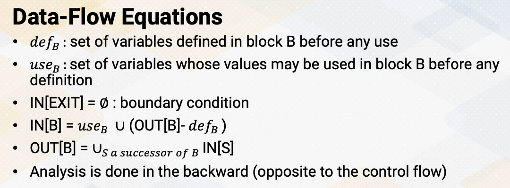{: width='400' height='400'}

Let's look at data flow equations, defB is a set of variables defined in block B before any use. useB is set of variables whose values may be used in block B before any definition. IN[EXIT] is a boundary condition, it specifies the boundary which means there's no variables alive on exit from the program. IN[B] = useB union (OUT[B]-defB) says that a variable is live, coming into a block if either it is used before redefinition in the block or it is coming out of the block and is not redefined in the block. OUT[B] is a successor of block's IN values. It says the variable is live coming out of block if and only if it is live coming into one of its 
successors. And this analysis is done in the backward which is opposite from the reaching definition analysis. 

#### Algorithm

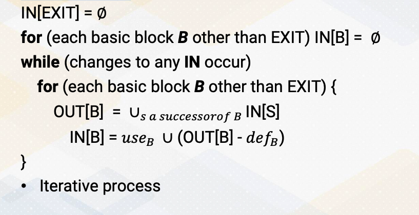{: width='400' height='400'}

Let's look at the algorithm. First, we initialize EXIT IN value as 0. And we also initialize all the IN values as 0 other than EXIT. Then we'll start iterative process until there's no changes in value. Within an iterative process, we go to the full loops. The full loops go through each basic block. OUT[B] is IN values of any successor of basic block B. Then we combine all the values. The IN[B] = useB  U  (OUT[B]-defB). And then we iterate process.

#### Example of Live-Variable Analysis

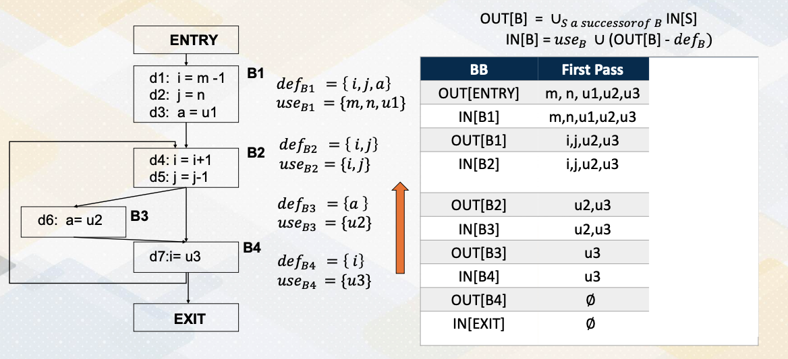{: width='400' height='400'}

Let's look at an example for the live variable analysis. We have the same control flow graph that we saw in the previous example. First, let's compute the def and use set. For the basic block B1, basic block B1 defines variables i, j, a. So that is a def set. And also use m, n, u1. So that's a use set. So reading values becomes a use set and the writing values become the def set. In basic block B2, we define i, n, j, we also use i, n, j. So i, n, j are used and redefined inside basic block B2. And B3 use u2 and it defines value a. So def set is a, use set is u2. In basic block 4 use u3 and then it defines i value. So so def is i and use is u3. Now we go through this liveness analysis, which is the backward process. First we initialize IN EXIT as 0 and OUT B4 as also 0. Then IN B4 is OUT B4-def before union B4. Since OUT B4 is 0 and definition doesn't subtract any value and then we compute union use B4, so IN B4 becomes u3. Then we move to the basic block 3. basic block 3 has successors before, so OUT B4 is union of successors, so the B4's input becomes OUT B3, so it'll be the same value. And IN B3, the first OUT B- def. So u3-def in the basic block 3 is A, so u3 becomes u3. And then union of use B3 which is u2, so union of u2 and u3 becomes IN B3. And then now we move on to basic block B2. B2 has two successors, B3 and B4. So OUT of B2 is union of IN B3 and IN B4, so u2 and u3 and u3 union becomes OUT B2, same as u2 and u3. 

And then we compute IN B2, first we compute OUT B-def, so u2, u3-def is i, j. And then we union i, j, so IN B2 becomes i, j, u2, and u3. So let's move on to the basic block B1. B1 has only one successor B2, so OUT B1 is the same as IN B2, so i, j, u2, and u3. And now let's compute IN B1. From the OUT B1, we subtract the def i, j, a and then we add use m, n, u1. So we subtract i, a, j and then we add m, n, u1, so final value of IN B1 becomes m, n, u1, u2, and u3. Then OUT ENTRY, because entry of successor is only B1, the same as IN B1. This end the first pass, and then we repeat the same process for the second pass. Again repeat the same, starting from the backward, the OUT B4, the B4's successor. The B4's successor is B2. So IN B2's values becomes OUT B4, so i, j, u2, u3 becomes OUT B4. And then based on this i, j, u2, u3-def_B4 is we eliminate i, and then we add u3, the use value, so the value becomes j, u2, and u3. That becomes IN B4. And then for the B3, the successor is only B4, so IN B4 becomes same as OUT B3. And then we subtract a and then we add u2 so that we get same value j, u2, and u3. And B2 have two successor, B3 and B4. So we have a union of B2 and B3 IN values. So B3's and B4's values successors are combined and then becomes OUT B2, j, u2, and u3. Based on that, we also compute IN again, now we subtract defB2 and then add use here, because def and use are the same, the value becomes the same. And then we move on to this OUT B1. The B1's successor is only B2, so OUT B1 is same as IN B2. At this moment, our values are the same as the first pass, so the second pass IN B1 becomes the same as first pass and then OUT ENTRY value will be the same. Third pass will show the same value as second pass, so iterative process will end after third pass.

#### Register Allocations and Live-Variable Analysis

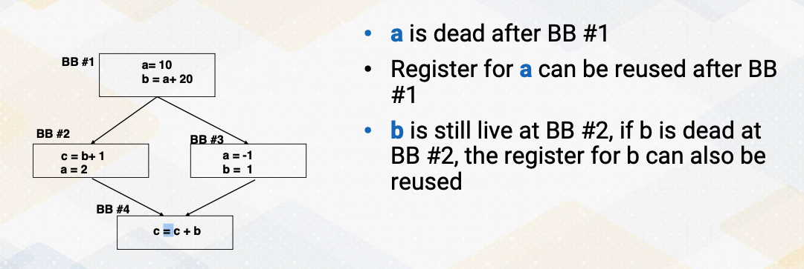{: width='400' height='400'}

So using these live variable analysis, we can decide when we allocate registers. Here shows an example. These A values are used here defined here and then redefine basic block B2 and B3. So register for a will not be reused after the basic block B1 so that we can reuse variable a's registers for something else. In the other case, B is still live at basic block B2, so we have to keep the register for variable B. If B is also dead, then we can also reuse the register value for B. So that's the usefulness of live variable analysis.

#### Register Allocations

So register allocations for the purpose is only live variables needs to have registers. This means that the compiler allocate registers to variables that are actively used in a specific program section. Sometimes and actually most of the time, there aren't enough registers available to accommodate all live variables. So the compiler needs to perform registers, spills, and fills. So it temporarily stores values in the memory stack to free up registers for other variables. It's important to note that PTX assumes an infinite number of registers, which is to simplify the process, therefore, stack operations are not shown in the PTX code.

#### Summary of Data-Flow Analysis

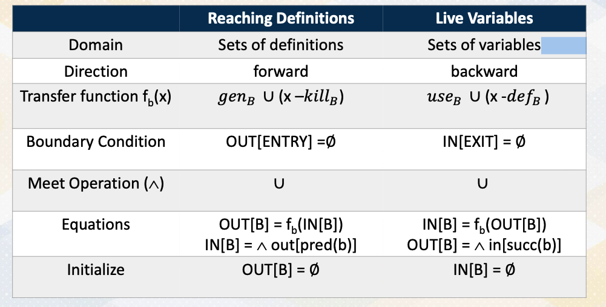{: width='400' height='400'}

Here is a summary of data flow analysis. The domain of reaching definition is set of definitions and domain of live variable is set of variables. Analysis directions for reaching definition is forward and live variables are backward. Here is transfer functions for the reaching definition genB union x-killB and for live variable useB union x-defB. Both share very similar transfer functions. Instead of using a gen kill set in live variables, you use use and def set. The boundary conditions for reaching definitions is initializing OUT ENTRY, whereas in live variable initialize IN EXIT. That's because the direction of analysis is one is forward and the other is backward. Both of the meet operations when control flowers are meet are using a union set, and this is another representation of equations and initializations. So in this video, we study data follow analysis for live variable analysis. As a recap, reaching definition analysis uses forward analysis, but live variable analysis uses backward analysis.

### Module 11 Lesson 2

Learning Objectives

* Explain the concept of SSA (Static Single-Assignment) form
* Explore the basics of converting code to SSA form
* Explain how to merge values from different paths

In this video, let's learn SSA in more detail. Throughout this video, we should be able to explain the concept of SSA, static single-assignment form. We'll also explore the basics of converting code to SSA form, and we also discuss how to merge values from different paths.

#### SSA

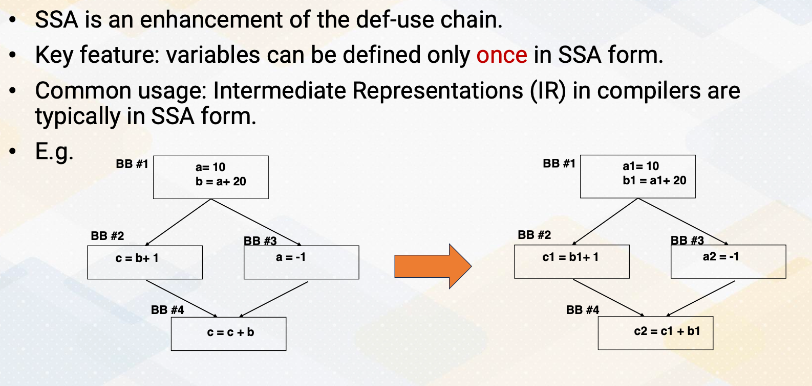{: width='400' height='400'}

SSA, or static single-assignment, is a form used in compiler optimization and intermediate representations IRs that improves upon the traditional def use chain. One of the fundamental characteristics of SSA is that each variable is assigned a unique definition point, meaning it can only be defined once within the program. This property simplifies analysis and optimizations as it eliminates the need to track multiple definitions of the same variable. Compiler designers often use SSA form as the basic for their intermediate representations because it provides a structured and efficient way to represent program information. This form simplifies various compiler optimization passes. Here in this example, we have a and b, and c. And throughout the SSA forms, they will receive a1, a2, b1 and c1 and c2. So there will be new versions whenever there is new definitions.

#### SSA and Control Flow Graphs

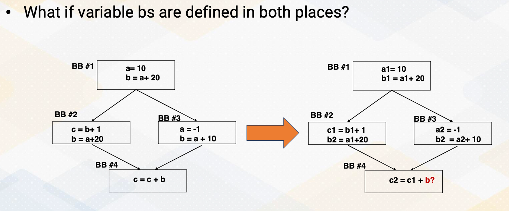{: width='400' height='400'}

One challenge is what if the variable bs are defined in both places? In this example, the variable bs are defined in  basic block b2 and b3 and basic block 4 is using variable b, where we don't know which one will be used, and this will be decided at one time.

#### Phi functions

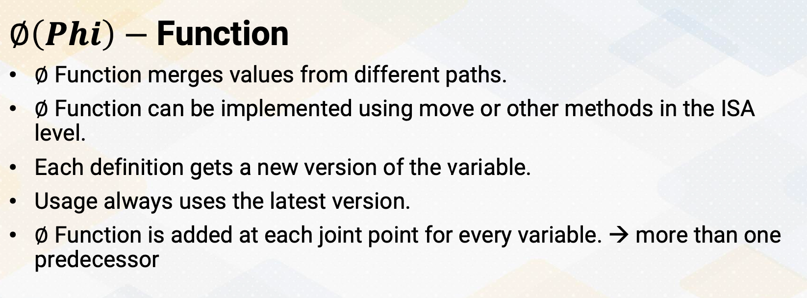{: width='400' height='400'}

To solve this problem, Phi function is defined in SSA. The Phi function is probably the most intelligent and interesting part of SSA. The Phi function merges values from different paths. Phi function can be implemented using move or other method in the ISA level such as select or conditional move. And each definition gets a new version of the variable, and the usage always use the latest version and the Phi function is added at each joint point for every variable and when there are more than one predecessors.

#### SSA Conversion Example

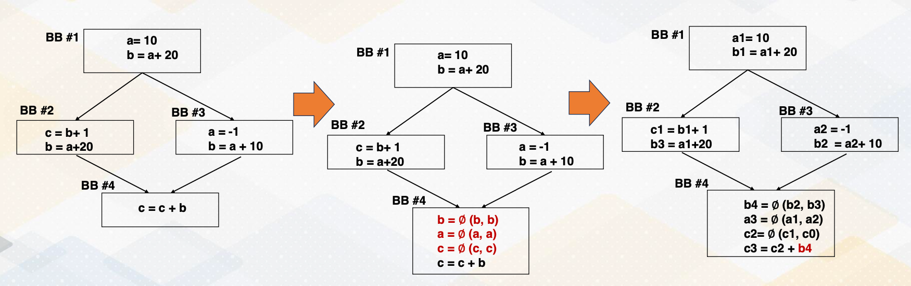{: width='400' height='400'}

Now with the Phi function, let's convert this control flow graph with SSA form. First, we insert Phi functions for the variable b, a, and c because b are defined in both places, a are defined and c has only definition in only one path. and each of the definition will receive the new versions, a1, b1, a2, b2, and c1 and b3. Phi functions combine the variables in the both paths and b2 and b3 or in a1 which comes from this path or a2 which is redefined in the basic block 3. And c2 is also combined in c1, or if it comes from this path, the original definition of c0 will be used. And after that, the c3 use b4 which is newly defined in this basic block.

#### When to Insert ∅ Function ?

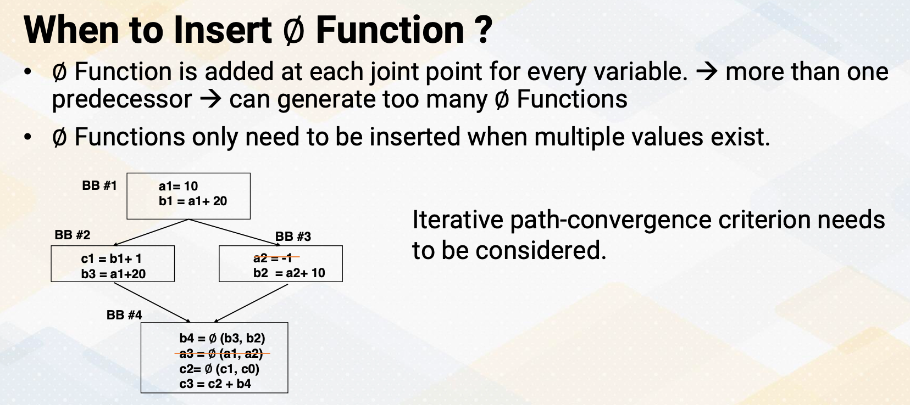{: width='400' height='400'}

Then the question becomes when to insert the Phi functions? The Phi function is added at each joint point for every variable. But if we do that, it might generate too many Phi functions. We only want to add Phi functions if there are multiple values exist on the path. To do so, iterative path convergence criterion is needed to solve this problem. In this example, if a2 definition is not here in basic block 3, then we don't also need to have Phi function for a3. So we want to know when we don't need to insert these Phi functions. 

#### Path-Convergence Criterion

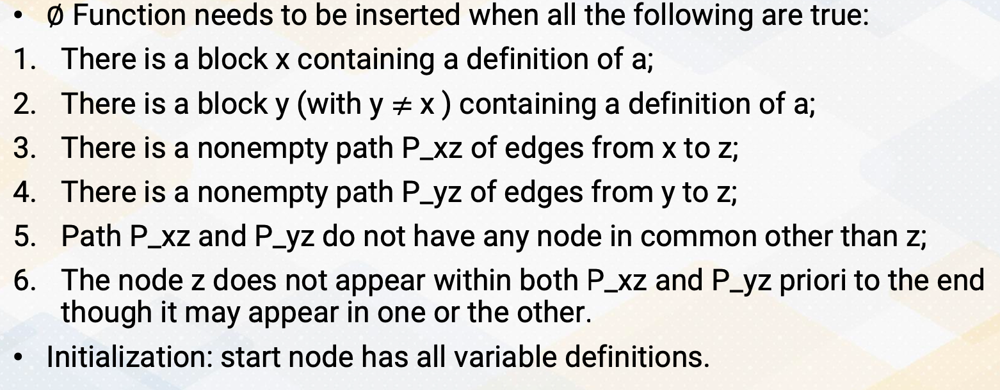{: width='400' height='400'}

Path-convergence criterion is Phi function needs to be inserted when all the followings are true. First, there is a block x containing a definition of a. And second, there is a block y, y is not equal to x containing a definition of a. And there should be a non empty path, edges from x to z. And also non empty path from y to z and this path x to z and path y to z do not have any node in common other than z. Node z might appear other places, but it should not appear prior to P_xz and P_yz. So first, we initialize the start node have all variable definitions.

#### Applying Path-Convergence Criterion

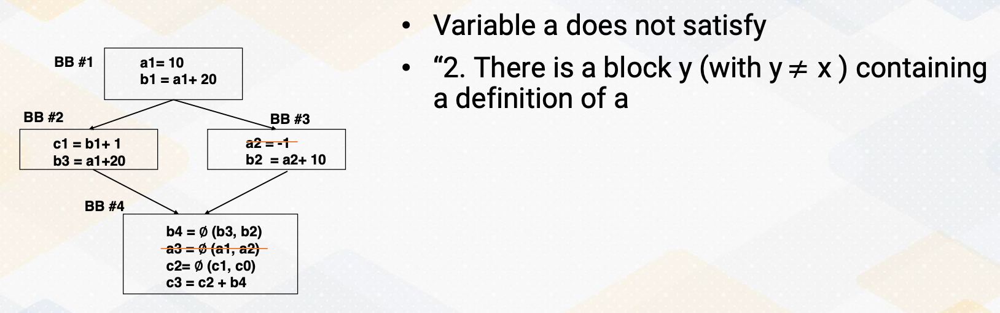{: width='400' height='400'}

And if you use these path convergence criterions , and variable a, there is no block that contains the definition of variable a from path b1 to b4 because there is no definition of b2 and b3. If we assume a2 = -1 doesn't exist, so then we can say we remove this Phi function.

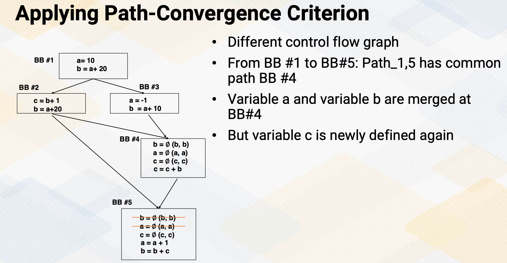{: width='400' height='400'}

But let's look at a little bit different control flow graph which is similar. So first, there is a path for this b and a, so that we insert the Phi functions of a, b, c in the basic block 4. But because when it comes from b1 to b5 or b5 through the b3, there is a common path in basic block 4. So because of this common path insert Phi functions in here. So then from here to here, we do not need to insert basic blocks for a, b, c. But because c is new defined, we need to keep the Phi function for the c and b defined basic block 2 is merged here. So we don't also need to insert Phi function.

#### ∅ Function in LLVM

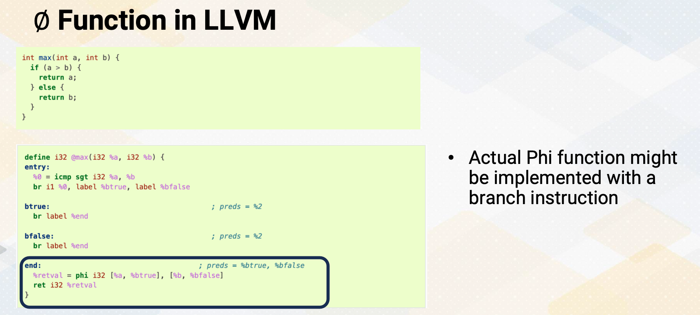{: width='400' height='400'}

And let's look at Phi function in LLVM here. This if max function, if else and this is converted SSA form and these SSA form, these Phi functions are also used in the Phi function, the name, literally in LLMV as well. So LLMV treated Phi functions as the same definition of SSA. And back up the ISA, this Phi function will be converted back to if else statement or conditional move depending on the ISA. Here's a summary. SSA, static single-assignment form enhances SSA data follow analysis by allowing variables to be defined only once. The Phi function is used to merge values from different paths in SSA form. The path convergence criterion helps decide when to insert Phi function during SSA conversion. SSA form simplifies data flow analysis and enables more effective optimizations.

### Module 11 Lesson 3

Learning Objectives

* Explain the fundamental concepts of compiler optimizations
* Explore specific optimization techniques, including Loop Unrolling, Function Inlining, and more

In this video, we'll study examples of compiler optimizations. Here we will cover the following learning objectives. First, we'll explain the fundamental concepts of compiler optimizations, and second, we'll explore specific optimization techniques such as loop unrolling, function inlining, and more. And by the end of this video, you should have a clear understanding of these topics.

#### Loop Unrolling

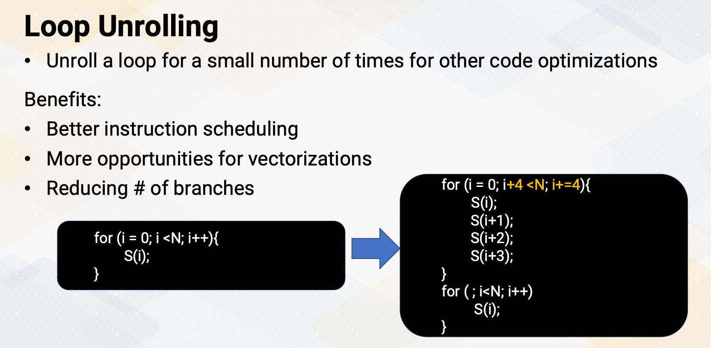{: width='400' height='400'}

Loop unrolling is a technique where loop is manually or automatically expanded to execute its iteration for a small number of times. This optimization offers several benefits, including improved instruction scheduling, increased opportunities for vectorization, and also a reduction in the number of branches in the code. Here is an example. The for loop contains a statement for each loop iteration. And then through the loop unrolling, instead of incrementing the loop by one iteration, it increments by four, which is unrolling the loop by a factor of four. Additionally, there is an epilog loop for remaining loop iterations if a loop needs to be iterated more than a multiple of four. 

#### Function Inlining

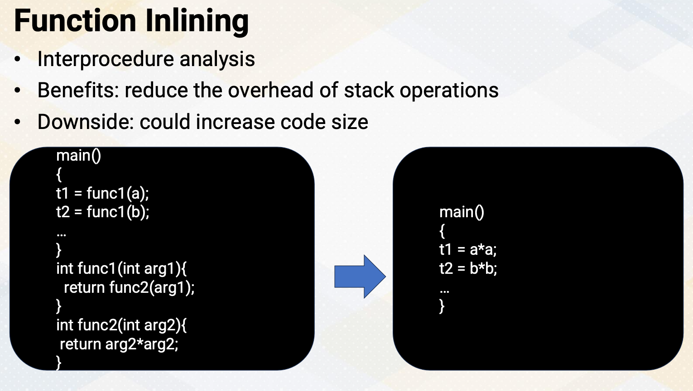{: width='400' height='400'}

Function inlining is a compiler optimization that replaces function calls with the actual function code. It reduces stack operations overhead and also it might introduce more compiler optimizations. It is an inter-procedure analysis, so it is one of the global optimizations. However, it might increase code size due to duplicated code. So we have to be very careful when we perform function inlining or not. For example, in this code, the left code shows two functions, func1 and func2. And instead of calling these two functions, t1 and t2 can be simply computed with a*a and b*b. 

#### Dead Code Elimination

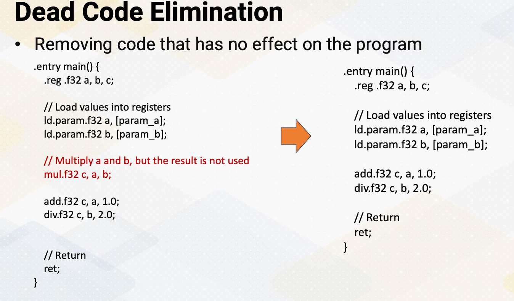{: width='400' height='400'}

Dead code elimination is a process that identifies and removes instructions which doesn't contain the fine output of a program. This optimization helps reduce the size of the code and potentially improve execution speed. Here is a simple example of PTX dead code elimination. The code example shows that the red font indicates the code that will be eliminated. Here, mul.f32 c, a, b and c values will not be reused, so it can be safely removed. as shown in the right side.

#### Constant Propagation

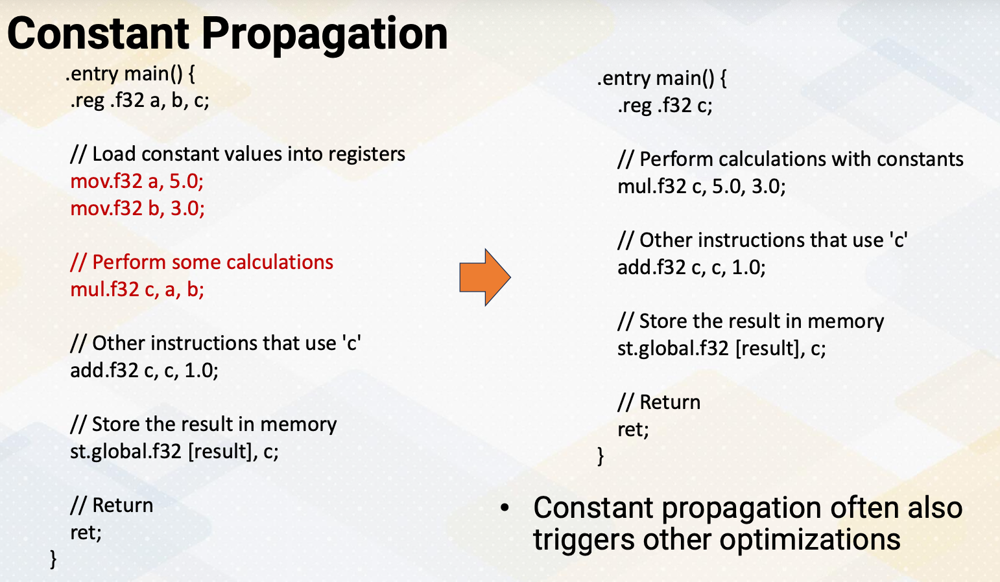{: width='400' height='400'}

Constant propagation is an optimization technique that replaces variables with their constant values in the code, eliminating unnecessary variable access. Here's another example of PTX code that demonstrates constant propagation. Instead of passing a and b, we can replace this value 5.0 and 3.0. Constant propagation often also triggers other optimizations. So mul.f32 c, 5.0, 3.0. could also be replaced with simply 15 and this constant can be propagated through the entire program.

#### Strength Redunction

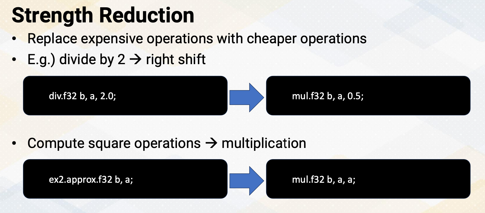{: width='400' height='400'}

Strength reduction is an optimization technique that involves replacing expensive operations with the cheaper ones. One common example of strength reduction is replacing the operation divided by 2 with more efficient operations such as right shift. Another example of strength reduction is replacing costly square operations with more efficient multiplication operations as shown in this example.

#### Code Motion: Loop-Invariant Instructions

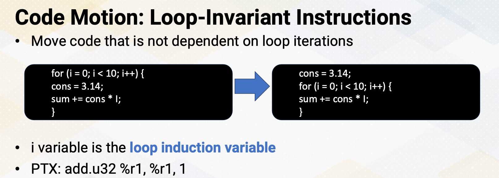{: width='400' height='400'}

Code motion, specifically, the technique of moving loop-invariant instructions, involves relocating code that does not depend on loop iterations outside of the loop. This can potentially reduce the number of dynamic instructions. In this example, the cons variable receives a value of 3.14 every single loop iteration in the left side of the code. By moving this assignment outside of the loop, the statement can be executed only once. Here I also want to point out that the i variable in the loop is commonly referred as a loop induction variable. It is used to control the number of iterations and typically increment and decrement with each iteration of the loop. Loop induction variables can often trigger other compiler optimizations, which is one of the main reasons why we want to detect this loop induction variable. A common pattern of PTX code for the loop induction variable is add.u32 r1, r1, 1. 

In this video, we have reviewed loop unrolling, function inlining, and strength reduction, which offer various optimization opportunities. We also saw the simple examples of these cases. And moving loop-invariant instruction is an example of code motion.

### Module 11 Lesson 4

Learning Objective
* Describe static code analysis techniques to detect warp divergence

In this video we'll show an example of one of the static GPU code analysis techniques, divergence analysis. The learning objective of this video is to describe static code analysis techniques to detect warp divergence.

#### Review: Divergent Branches

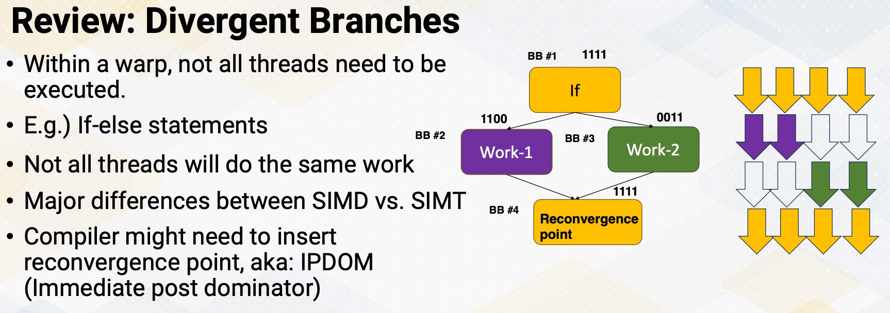{: width='400' height='400'}

Just to review divergent branches means within a warp, now all threads will execute the same code. We have already studied how the hardware support divergent branches using SIMT stack. Since handling divergent branches might require compiler's support, identifying divergent branch is important at compile time. In some cases, the compiler has to insert reconvergence point which is also known as immediate post dominator in the compiler's term at static time. So the code example shows if else statement, and some thread goes to Work 1 and some thread goes to Work 2 and then the reconvergence point which is basic block 4 might need to be indicated by the compiler. So the compiler needs to know whether this if branch might be a divergent branch or not. 

#### Divergence Analysis and Vectorization

Interestingly, divergent analysis has even longer history than GPUs. Converting loops into vector code, which is also called vectorization is the compiler's job. In order to perform vectorization, it is also necessary to check whether all instructions within a loop will execute in a lock-step. Even a loop also has a branch, if all instructions within the branch execute the same way, then the code inside the branch can be also vectorized. So the compiler algorithm has even evolved to detect divergence. And GPUs also inherited those traditional vectorization tests to detect divergences. When there is a simple if else statement, these tests are relatively easy. When complex control flow graphs are combined with synchronization, then this test gets complicated. 

#### Divergent Branches: Thread Dependency

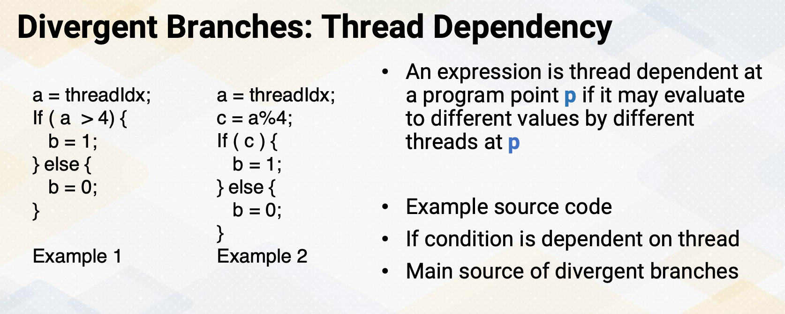{: width='400' height='400'}

In the GPU code, if a branch condition is dependent on the thread ids, it will be a divergent branch. The more formal way of saying it is, in a program point p, if it is dependent on thread, it may evaluate to different values by different threads at p. Here are examples of source code. In this example, a is a threadIdx. The first example, the condition of if is directly dependent on a and the second example, c is dependent on a and conditional branch is dependent on c. In both cases, essentially the conditional branches are dependent on thread Ids. So this branch can be divergent branches.

#### How to Check Thread Dependency?

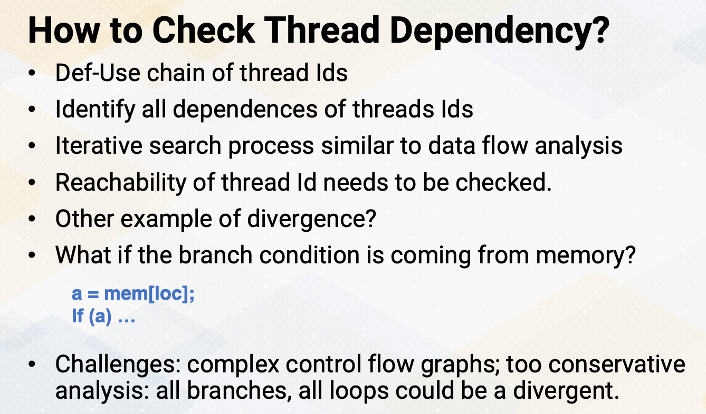{: width='400' height='400'}

Then how to check thread dependencies? We can construct def-use chain of thread Ids. There are similar techniques that we have studied using data flow analysis. This is simply checking whether a branch condition is dependent on thread Ids and thread Id definitions can be reached over to the branch conditions. So this also requires iterative searching process that we have seen in other data flow analysis. So we identify all the branch conditions that are dependent on thread Ids. You might also wonder, are there any other example of divergent branches which are not dependent on thread Ids? For example, what if the branch condition is coming from the memory, a equals memory location, and if branch condition is dependent on a. If the location variable is constant across all thread, then a value will be also constant across all thread, so the branch won't be divergent. But if the location variable is varied by thread Ids, then a value will be also changed. But in order to loop case of variable be dependent on thread Ids, they are essentially coming from thread Ids. so in general, if a branch, if they're dependent on thread Id, they will be divergent. Divergent analysis requires thread Id checks and it ends up inserting reconvergence point information and some other additional information. Very conservative analysis might indicate too many branches as divergent branches. For example, all loops could be divergent. So the compiler algorithms need to trim down the conditions that are non divergent and this might get even more complicated if the control flow graphs are complex. 

So in summary, we reviewed the conditions of work divergent check techniques. When the branches depend on thread Ids that becomes a divergent branches. This is an example of using the data flow analysis for GPU programming analysis.

<!--  -->