### Objectives

* Be able to understand the basic kernels of ML accelerators for GPUs 

Required Readings:
* https://resources.nvidia.com/en-us-tensor-core
Optional Readings:
* https://docs.nvidia.com/deeplearning/performance/dl-performance-matrix-multiplication/index.html
* https://images.nvidia.com/aem-dam/en-zz/Solutions/data-center/nvidia-ampere-architecture-whitepaper.pdf

### Module 12 Lesson 1 : GPU and ML

Learning Objectives
* Explain the basic operations of machine learning workloads
* Describe the benefits of GPU for ML workloads

Hello. In this model, we'll study how GPUs are used to accelerate ML applications. This video will help to understand the basic operations of machine learning workloads and describe the benefits of GPU for ML workloads. 

##### Why are GPUs Good for ML?

So why are GPUs good for ML? Because many ML workloads have many floating-point operations, and they are highly data parallel operations. And GPUs are good for handling many parallel data because GPUs have many floating point operation units. So essentially, most of transistors inside the GPUs are used for providing floating-point operations. Furthermore, GPUs have high memory bandwidth memory systems. Although providing high memory bandwidth is coming from the memory technology itself, because GPU chips and memories are directly connected, which makes it easy for GPUs to employ high bandwidth memory chips such as HBM. And also, GPUs can easily employ flexible data formats such as tensor format, brain floating point format, integer 4 etc. Also, ML workloads are statistical computings. It works well with the GPU's underlying execution models. For example, GPUs use weak memory consistency model and do not provide precise exceptions. Supporting those might require more hardware resource, but because GPUs do not require to support them, which goes well with ML statistical computing models.

#### DNN Operation Categories

In DNN operations, we can say that there are three major operations. 
* Elementwise operations, as an example, activation operations. 
* Reduction operations as examples are pooling maximum operations. 
* Also has dot-product operations commonly used in convolution operations or GEMM. 

And all these DNN operations are highly data parallel.

#### Background of GEMM

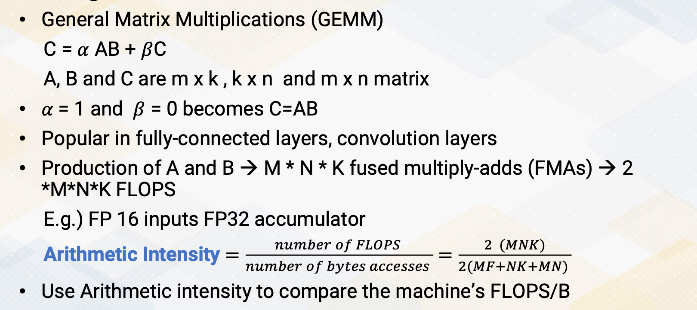{: width='400' height='400'}

One of the most common operations, the GEMM, which is general matrix multiplication, can be represented as C equals alpha AB plus beta C. A, B, and C are m times k, k times n, and m times n matrix. Alpha beta are constants and they can even become zero. So alpha equals one and beta equals zero becomes C equals A times B. These GEMM operations are popular in fully connected layers or convolution layers. Let's also think about arithmetic intensity.

In the GEMM operation. If we do a production of A and B, that requires M times N times K fused, multiply-adds, and one fused multiply-add includes two FLOPS. So total number of floating-points operations will be 2 times MNK. And if you assume, 16 bit of floating-point, although the accumulator is operated 32 bit, the number of bytes that each matrix data needs to bring will be 2 times MK+ NK+MN. Two is included because floating point 16 bit format requires to bring two bytes. Once you know the matrix sizes, you can compute this arithmetic intensity. Then you can compare whether the GPU machines can provide this arithmetic intensity. Although this assumption or this computation is based on the assumption that all these floating-point operation input values are coming from memory, which could have been also optimized by original caches, this gives the first order of approximations. Also, you can also use this arithmetic intensity to estimate if you optimize the memory data, what would be the arithmetic intensity and whether the GPU can support it or not.

#### Difference Between SIMD vs. Tensor

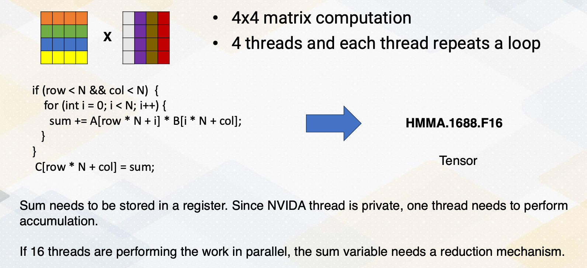{: width='400' height='400'}

GPUs already provide SIMD operations, but GPUs also provide accelerator, which is also called tensor core for matrix multiplications. Let's consider four by four matrix operations. To perform these four by four matrix multiplications, typically four threads are used and each thread repeats a loop, which is shown in this code. Because sum needs to be stored in a register, and since NVIDIA thread is private, one thread needs to perform these accumulations. So that requires the four loops within one thread. Four different threads can be performed in parallel, but these loops are executed in sequencer. Although, 16 threads could perform the work in parallel. In that case that some variable needs be accumulated in a different method such as using a shared memory, so that which might cause even more overhead. All these codes could be simplified if using a tensor core. Just simply say HMMA.1688.F16. That just simply says this is performing four by four matrix computations with 16 bit floating-point operations. This illustrates the difference between SIMD operations and tensor core operations.

#### SIMD/SIMT Operations of Matrix Multiplications

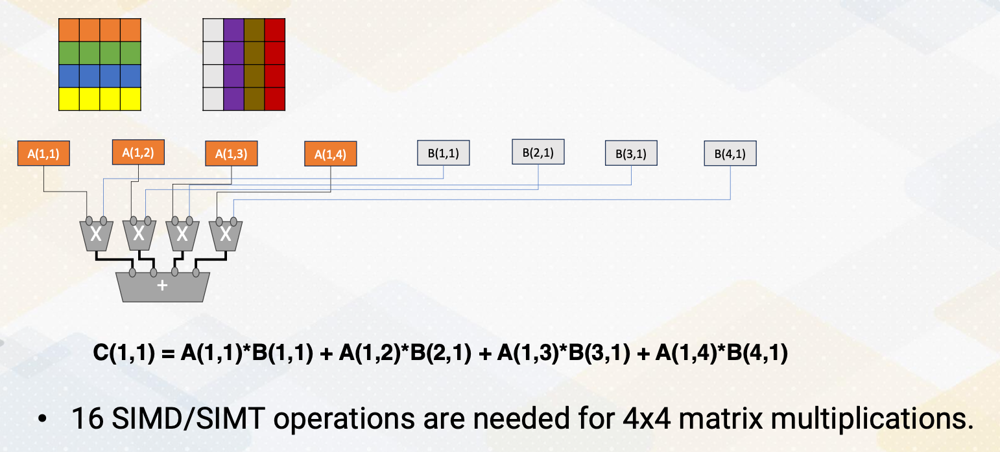{: width='400' height='400'}

Although we could parallelize by having multiple operations, A and B in parallel. So they can compute  this one element in sequence or in parallel. But that's essentially what the tensor operations are doing it. If we're using a SIMT operations, 16 SIMT or SIMD operations are needed to perform four by four matrix multiplications.

#### Tensor Cores

In tensor cores, it performs matrix multiply and accumulator calculations. And hundreds of tensor cores operating in parallel in one NVIDIA GPU, which enables massive increases in throughput and efficiency. To improve the performance even more, the sparsities are provided. As an example, A100 tensor core can execute 256 of FP 16 FMA operations. To improve the performance more, INT8 and INT4 or binary 1- bit predictions are added.

#### Matrix Multiplications with Systolic Arrays

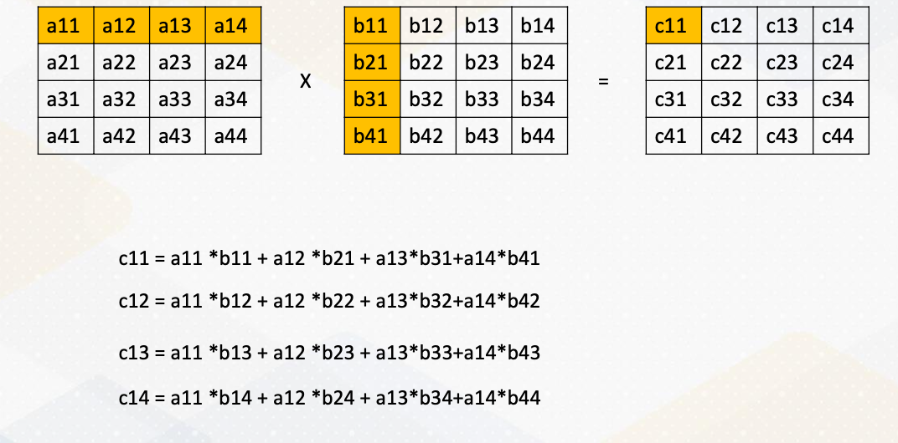{: width='400' height='400'}

Traditionally, matrix multiplications or accelerate with the systolic arrays. Here it shows the matrix multiplications and it spell out each of these output. And just to illustrate, only the c12  are shown here.

#### Systolic Arrays Operations

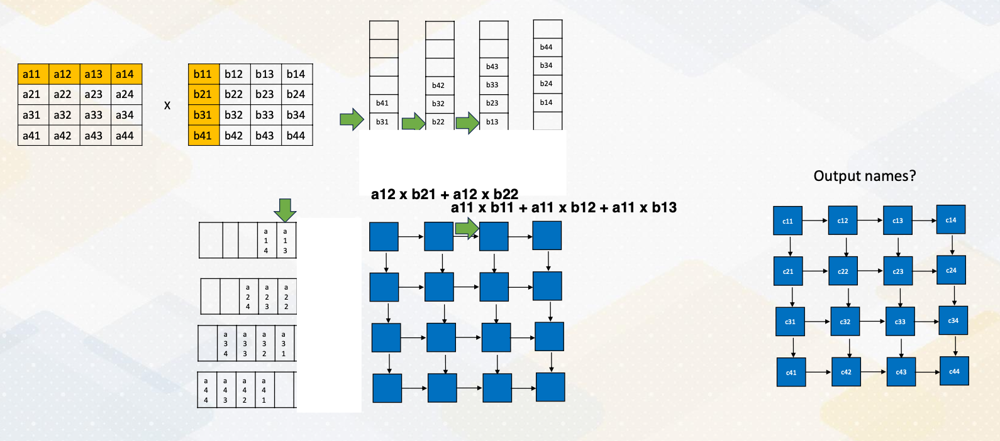{: width='400' height='400'}

Then let's consider how these operations can be performed in the systolic arrays. The basic idea of systolic arrays is data is moving across all these elements. Each of these blue box is performing matrix multiply and accumulation operations. First now to trying to fill out this input. The first rows are filled out here and this is second row and third rows and fourth rows. And this is storing these columns. And then each cycle one element or the element within these positions are feeding to here. And at the same cycle all these elements in these positions feed into here. So you can see that first elements will be computed from this a11 and b11, but these other positions are empty, which means the value will not be feed into this systolic array.  At cycle 1, a11 times b11. B11 will be feedind  here, a11 will be feeding here. And this blue box performs a11 times b11. In cycle 2, a11 value will be moved to the next element and b11 will be moved to this again, the next element. And the sum will stay here as a partial sum. Each of the blue arrays keeps storing the partial sums. So since now in this moment b12 is coming from here and a11 was coming from here will be performed the operations. The values was previous performed, a11*b11 is stored, and new value a12 times b21 will be performed and then added here. So each cycle, the a moves as row-wise and the b will move from the column wise. So in each cycle, they will receive the new values based on these positions. At the fourth cycles, we received all those elements we received the values. And each of these elements are performing the operations, that this one is performing the c11s, and this one performs c12, c13 and c14s. So this shows this output array format At the fourth cycles, all these elements are fully populated and it will take towards seven cycles to finish these operations. And here it shows the final outcomes.

#### Transformer Engine

New NVIDIA architecture also introduced a transformer engine which was introduced in the GH architecture. This was to accelerate the transfer layers. Transformer engine dynamically scales tensor data into representative range, which can also accelerate the performance. Furthermore, it supports FP8 operations. But one of the most important part of the transformer engine's characteristic is it brings a chunk of data efficiently to fully utilize the tensor units. So moving the data is so much critical as the computer operates so high to keep up with this tensor cores. They also use TMA to generate addresses using a copy descriptor.

In summary, GPU accelerates matrix multiplications in ML workload. The SIMD and SIMT accelerate matrix multiplications, but dedicated matrix multiplication units improve the performance even more. And with all these accelerators, fully utilizing memory bandwidth is so critical.

### Module 12 Lesson 2 : Floating Point Formats

Learning Objectives
* Describe IEEE Floating-point formats
* Explain the benefits of quantization

In this video, we'll discuss floating point format. We'll describe IEEE floating point format and we will also explain the benefits of quantization. 

#### FP 16 vs. FP 32

FP16 versus FP32. FP16 uses the half precision of FP32, and IEEE standards have 32 bits for single precision and 64 bit for double precisions. In traditional scientific computations, floating points are used to provide much high precision values such as single or double precisions.

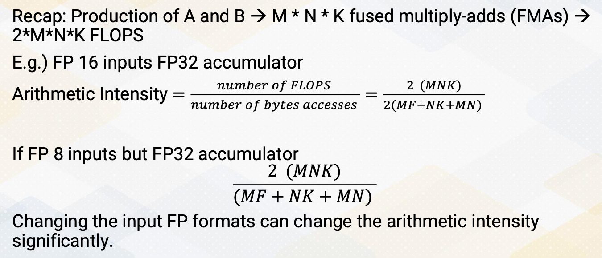{: width='400' height='400'}

But with the ML workload, now we're reducing the precisions. The reason is, if you think about arithmetic intensities, if you keep these accumulators the same, the number of floating point operations are the same, but number of bytes that needs to be bring can be changed significantly depending on what kind of floating point format we are using. So instead of FP16, if you use FP8, then even though the number of FLOPs are the same, number of bytes that needs to be accesses can be reduced by half, therefore, the arithematic intensity will be increased by double. So this is an easy way of changing the input format and also changing arithmetic intensity significantly. So this is an easy way of changing the arithmetic intensity by simply changing the input floating point format.

#### Benefits of Quantization

What are the benefits of quantization? It reduce the storage size, it increase arithmetic intensity, and the newer floating point excution units also increase the throughput if we reduce the floating point precisions. And ideally, if you perform FP8, then this might be 2x performance of just doing FP16 by considering the number of bits. This was the case in the earlier time of floating point operations. The quantizations that reduced input sizes, but the number of floating points operation per cycle will remain the same. But newer ML workloads, newer ML accelerators, as we reduce the floating point operation size, the throughputs also increased.

#### Floating Point Basics

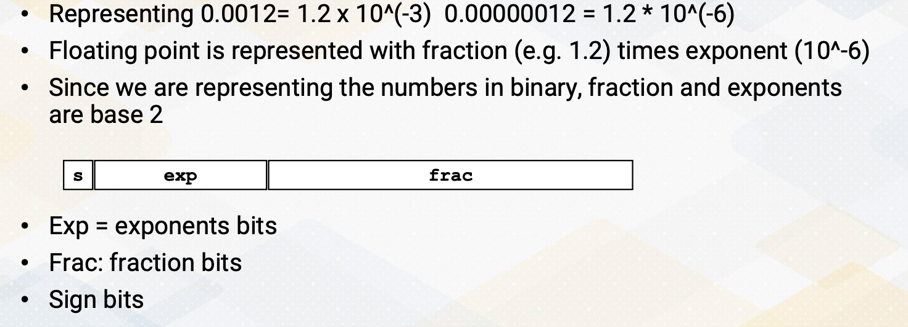{: width='400' height='400'}

Let's just review the floating point basis. Let's say, we want to represent value 0.0012. This could have been represented by 1.2 times 10^-3. Similarly, 0.000012 will be 1.2 times10^-6. Floating point is represented with a fraction, 1.2 times exponent. In both case, fraction values are the same, only the exponent values are different. Since we are representing the numbers in binary, fraction and exponents are based on 2. So simple floating point format will be sign bit, exponent bit, and fraction bit.

#### Different Floating Point Formats

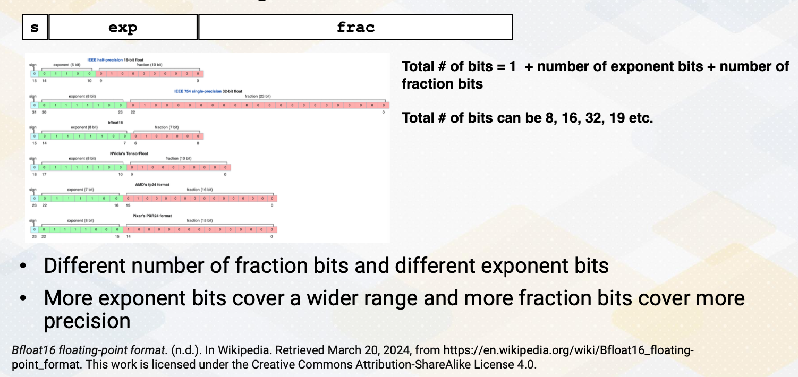{: width='400' height='400'}

And there are several different floating point formats. The total number bit is 1 for sign bit, plus number of exponent bit plus number of fraction bit. By reducing total number bits, then we can reduce the total data size. So there are a lot of emphasis of reducing total number bits. There can be 8, 16, 32 or it can be some odd number such as 19. Now within this total sum, it could also have different number of bits for fraction and different number of bits for exponent. Typically, more exponent bit cover a wide range of values, and more fraction bit covers more precisions.

#### Some More Details

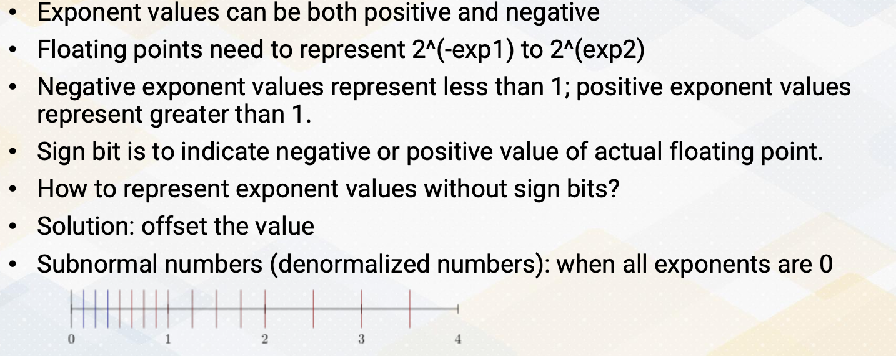{: width='400' height='400'}

And there are some more details regarding the floating point operations. First, exponent values can be both positive and negative. Because floating point needs to be represented to 2 to the exponent, and exponent can be negative number or positive number, then negative exponent represent a value less than 1 and positive exponent represent value greater than 1. The sign bit that represent floating point format actually means the actual floating point value is sign bit. So in order to indicate exponent values are negative or positive, the IEEE standard used offset to indicate the values. And then there are other more complications such as representing subnormal values or denormalized values when all exponents are zero.

#### Floating Point Number Representations

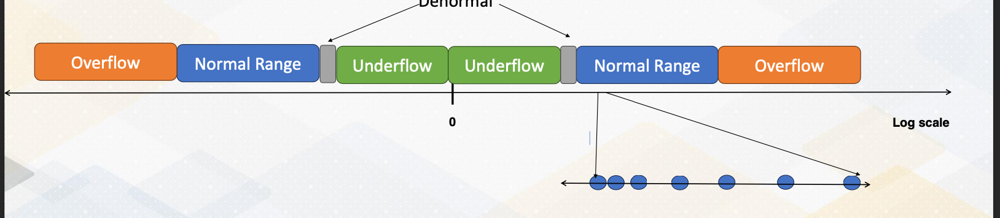{: width='400' height='400'}

This diagram illustrates the floating point of value representations. There is a value, and very close to zero are on the flow that cannot be represented. To increase the value that can represent the bar close to 0, we use denormalized values, which will be indicated by gray colors. And then there is a huge normal range, since the figure is shown at low scale, the normal range is much bigger. And then after the end of the normal range, there's overflow. But if you're also zooming the normal range, the values that are close to zero are much more fine grain represented, And as it goes more close to overflow regions, the values loose precisions.

#### IEEE 754 Formats

So IEEE 754 formats indicate how you represent sign, exponent, and fraction or mantissa bit. And there are also special values, positive and negative zero, positive and negative input values and narrow numbers, and also represented the denormalized values. And also rounding modes such as round up and round down. 

#### Quantization

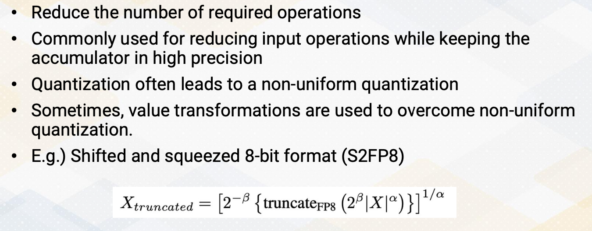{: width='400' height='400'}

So quantization reduce number of bits that also reduce number of required operations. It's commonly used for reducing the input operations while keeping the accumulator in high precisions. And quantizations often leads to a non-uniform quantization. Sometimes the value transformations are used to overcome this non-uniform quantization. One of the example is shifted and squeezed 8-bit format that uses the following transformation equations to convert the values. Such transformations are needed to provide more high precision value that close to zero, because the values that are close to zeros are much more valuable in ML workload. In summary, quantizations can improve the estimate intensity and also reduce data movement cost by reducing the storage size. And quantization can also improve the efficiency of computations.

### Module 12 Lesson 3 : Tensor Core

Learning Objectives
* Describe the architecture design methods for ML accelerator components on GPUs
* Explain the main design criteria

In this video, we'll discuss how to design ML accelerators on GPUs. The learning objectives of the video are to describe the architecture design method for ML accelerator components on GPUs. We will also discuss the main design criteria.

#### Designing ML Accelerator Units on GPUs

Let's sit back and think about how to design ML accelerators on GPUs. We want to consider the following factors. What functionalities we want to design and what benefit we'll get over the existing GPUs by having a dedicated accelerator. How we want to design the compute units, and how many of them we want to add. What would be the data storage and movement to send the data to these accelerators.

#### Common Steps of Designing Accelerators

The common steps of design accelerators will be, first, we want to identify frequently executed operations. This can be done by understanding the algorithm or by doing a profiling.

Second, we want to understand the performance benefit because the underlying architecture already have highly data parallel execution unit, so we need to understand how much performance benefit we'll get by having a dedicated accelerator. Using the existing GPU memes software approaches, using the existing ISAs, and hardware approaches can simplify some of the operations with research from the hardware. 

When you add more hardware, that means we have to design the interface and how to program those new hardware. What ISA to add and how we feed the data into the accelerator? What storage format we're going to use. We're going to use registers and memories as private shared registers.

After that, we also want to consider whether we want to combine multiple accelerator component into one component. Typically, by having multiple features in the one hardware improve the programmabilities and usabilities, but that comes with overhead of more hardware and might even incur timing overhead. So this design decision needs to be done very carefully.

#### Matrix Multiplication Accumulator

GPUs chose to use matrix multiplication accumulator as additional hardware component because these operations are mostly commonly used in ML workload. Although SIMD operations are good, but it still requires row by row operations. If we use a larger matrix multiplication unit, this could have been implemented with the systolic arrays. So here are the design decisions, do you want to have a many small matrix multiplication units or do we want to have a larger matrix multiplication unit? We also need to consider area and programmability choices. As we dedicate more area to the matrix multiplication unit, we lose the hardware resource that can be used for other GPU operations. NVIDIA started with the 4 by4 matrix multiplication unit. Matrix multiplication accelerators are also commonly used in other architecture such as Intel and R. And Intel's AMX, advanced matrix extensions, support 16*16 matrixes.

#### Possible Matrix Multiplication Unit Design

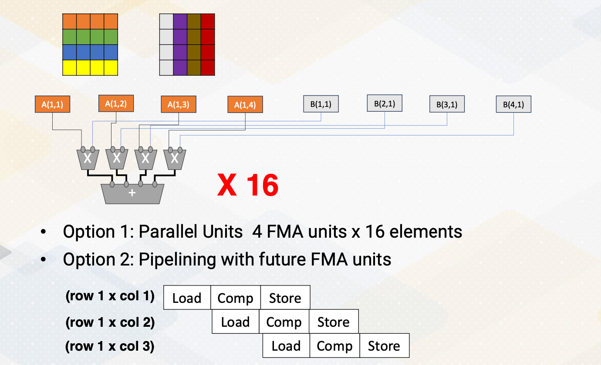{: width='400' height='400'}

How do you design the matrix multiplication unit? We could go for the systolic arrays, but you can see in the previous video, systolic array requires filling time and draining time. With a smaller matrix multiplication unit such as filling and draining time might be wasteful, so we might want to consider other options. One of the option is, we can just have  many parallel units, the matrix multiplications that which performs one role in one column, and we can have 16 of them to support matrix multiplication unit.

Another option can be using a pipeline method that you share the same hardware, and first it performs first row times first column, and the next cycle it performs first row and second column, and so on. Each of this operation requires load and compute and store times. By doing a pipeline, we can improve the throughput. So this is a trade-off. In terms of throughput-wise, we could have a mini parallel unit or we could have the multiple  pipelining of PMM unit.

#### Data Storage and Movement

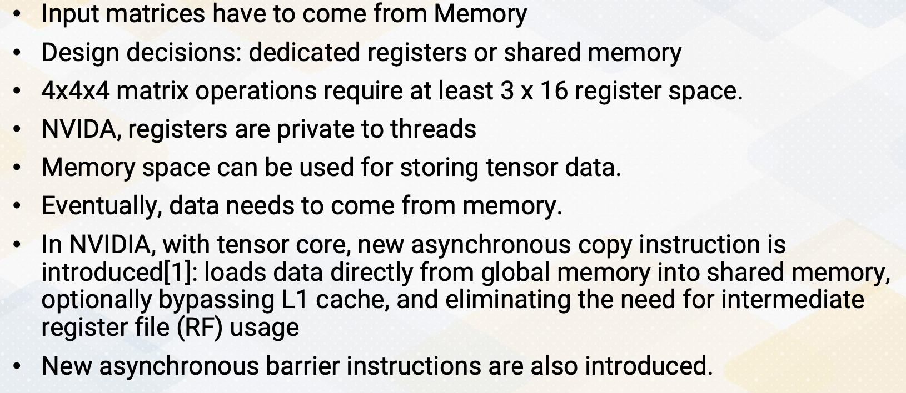{: width='400' height='400'}

Another important factor to consider is, what kind of format do you want to use, and how do you send the data to this matrix multiplication unit? Because input matrix have to come from the memory, a few design decisions need to be made. Do you want to have  dedicated registers or use shared memory? 4 by 4 by 4 matrix operations require any 3 times16 register space. And NVIDIA's registers are private  thread makes even more complicated design choices. So it could use memory space to store the tensor data, but this memory space close the tensor unit, and the original matrix will be stored in the global memory. So it is required to send a lot of data from the global memory to the memory space that are closed the matrix multiplication unit. Hence in NVIDIA, the new asynchronous copy instructions are introduced that loads data directly from the global memory into the shared memory. And optionally bypassing L1 cache and eliminating the need for intermediate register file usages. They also introduce asynchronous barrier instructions along with these asynchronous copy instructions.

#### Supporting Sparse Operations

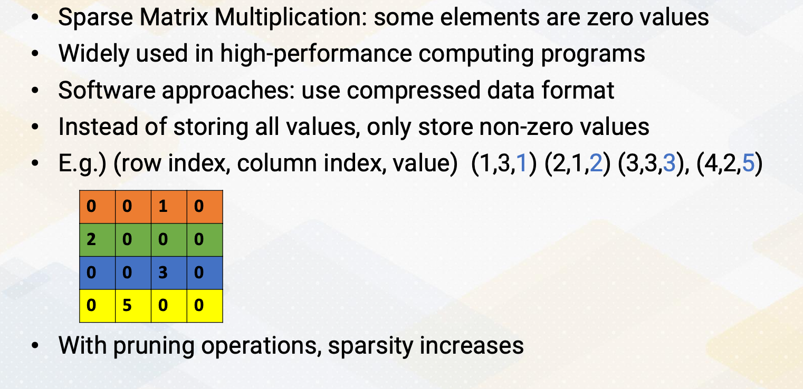{: width='400' height='400'}

So NVIDIA GPU architecture also supports sparsity operations to improve the performance. In general, sparse matrix multiplications are the matrix operation that some elements are zero values which are widely used in high performance computing programs, especially graph workload. Software approaches use the compress data format instead of storing all the values, only storing non-zero values. In the following matrix, for 4 by 4 matrix, instead of storing all the 0, 0, 1, 0, etc, we could just store row index value, column index value, and the value of this matrix, for example, 1,3,1 2,1,2, etc. By having so, we can just have only four element, but there are overhead of storing these index values. There are several sparse value storage format that even further simplify the row index values or column index values to compress it.

#### Supporting Sparsity in Hardware

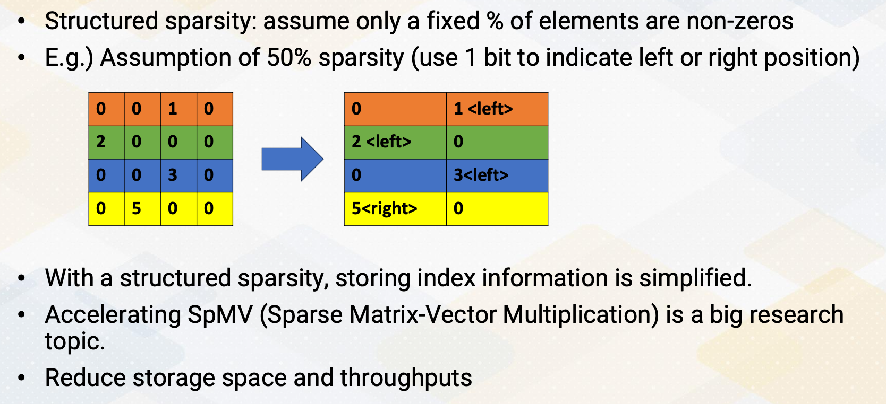{: width='400' height='400'}

With the ML algorithms pruning operations, this sparsity increases and supporting sparsity operations becomes very critical. When it's supporting sparsity operations in hardware, it is critical to support structured sparsity to simplify the hardware. Structured sparsity means, it assumes a certain percent of the elements are non-zeros. For example, if you assume the 50% sparsities, then this 4 by 4 element, the 16 element can be represented with only eight element, because we assume 50% of sparsities. And this compressed data also needs to have an index bit, but it can be simplified with one bit to indicate whether the compressed values coming from the left side of these columns or right side of the columns. The first two 0,0 becomes just 0, second 1, 0 becomes 1, and we need to indicate this 1 comes from the left side of the column. 2,0 becomes 2, and 0,0 becomes 0, etc, 0,0,0, and three zeros. And 0, 5, the 5 is coming from right side that column, so we need to indicate this 5 is coming from the right-side columns. So with structured sparsity, storing index information becomes very simplified. And also, building hardware becomes much more simpler by just assuming this fixed sparsities. Accelerating this SpMV, sparse matrix-vector multiplication is a big research topic that actively going on. Supporting sparsity reduces storage space and also improves the throughput.

In this video, we reviewed the design trade-offs of design ML accelerators on GPUs and the steps. We also reviewed the GEMM and SPMV operations.

<!--  -->