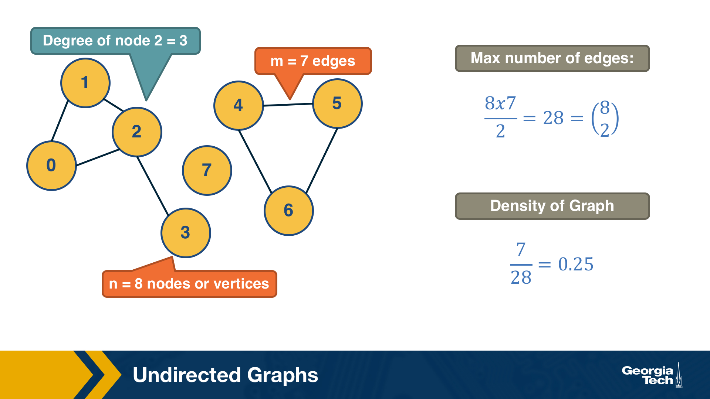
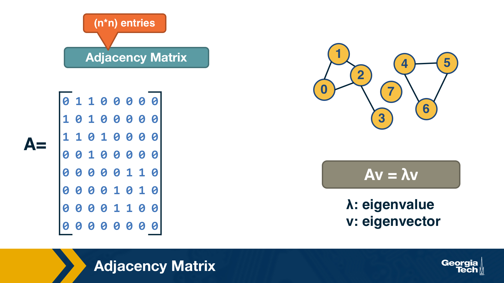
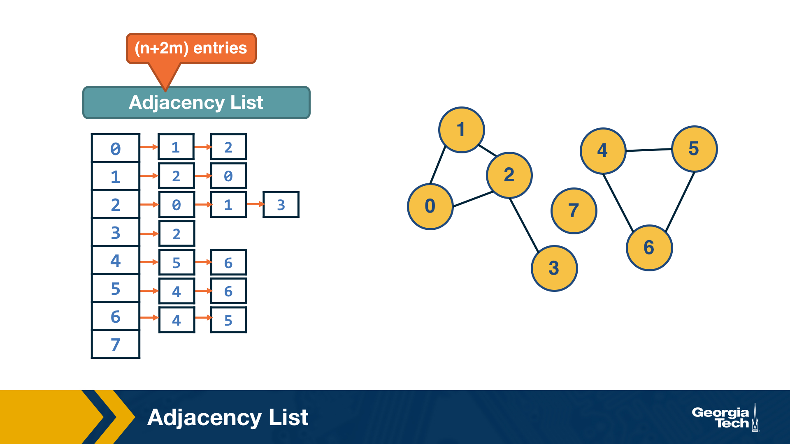

### Overview

Required Reading

* Chapter-2 from A-L. Barabási, [Network Science](http://barabasi.com/networksciencebook/) 2015.
* Chapter-2 from D. Easley and J. Kleinberg, [Networks, Crowds and Markets](https://www.cs.cornell.edu/home/kleinber/networks-book/) Cambridge Univ Press, 2010.

Recommended Reading

* [Fibonacci Heap. Wikipedia.](https://en.wikipedia.org/wiki/Fibonacci_heap)
* [Kosaraju's Algorithm. Wikipedia.](https://en.wikipedia.org/wiki/Kosaraju%27s_algorithm)

### An Introduction

This visualization shows the seven bridges of Königsberg. The birth of graph theory took place in 1736 when Leonhard Euler showed that it is not possible to walk through all seven bridges by crossing each of them once and only once. 

> **Food for Thought**
> 
> Try to model this problem with a graph in which each bridge is represented by an edge, and the landmass at each end of a bridge is represented by a node. The graph should have four nodes (upper, lower, the island in the middle, and the landmass at the right) and seven edges. What is the property of this graph that does not allow to walk through each edge once and only once? 
>
> You can start from any node you want, and end at any node you want. It is ok to visit the same node multiple times but you should cross each edge only once (this is referred to as a Eulerian path in graph theory).
>

### Undirected Graphs

Let’s start by defining more precisely what we mean by graph or network -- we use these two terms interchangeably. We will also define some common types of graphs.

A graph, or network, represents a collection of *dyadic* relations between a set of **nodes**. This set is often denoted by V because nodes are also called vertices.  The relations are referred to as **edges** or **links**, usually denoted by the set E. So, an edge (u,v) is a member of the set E, and it represents a relation between vertices u and v in the set V. 

The number of vertices is often denoted by n and the number of edges by m. We will often use the notation **G=(V,E)** to refer to a graph with a set of vertices V and a set of edges E. This definition refers to the simplest type of graph, namely undirected and unweighted. 

Typically we do not allow edges between a node and itself. We also do not allow multiple edges between the same pair of nodes. So the maximum number of edges in an undirected graph is 
$n(n-1)/2$– or “n-choose-2”.  The density of a graph is defined as the ratio of the number of edges m by the maximum number of edges (n-choose-2). The number of connections of a node v is referred to as the degree of v.  The example above illustrates these definitions. 

### Adjacency Matrix

A graph is often represented either with an Adjacency Matrix, as shown in this visualization. The matrix representation requires a single memory access to check if an edge exists but it requires n2 space. The adjacency matrix representation allows us to use tools from linear algebra to study graph properties.

For example, an undirected graph is represented by a symmetric matrix A – and so the eigenvalues of A are a set of real numbers (*referred to as the “spectrum” of the graph*). The equation at the right of the visualization reminds you the definition of eigenvalues and eigenvectors.

> **Food for Thought**
> 
> How would you show mathematically that the largest eigenvalue of the (symmetric) adjacency matrix A is less or equal than the maximum node degree in the network? Start from the definition of eigenvalues given above.
>

### Adjacency List

The adjacency list representation requires n+2*m space because every edge is included twice. 

The difference between adjacency matrices and lists can be very large when the graph is **sparse**. A graph is sparse if the number of edges m is much closer to the number of nodes n than to the maximum number of edges (n-choose-2). In other words, the adjacency matrix of a sparse graph is mostly zeros. 

A graph is referred to as **dense**, on the other hand, if the number of edges is much closer to n-choose-2 than to n.  

It should be noted that most real-world networks are sparse. The reason may be that in most technological, biological and social networks, there is a cost associated with each edge – dense networks would be more costly to construct and maintain.

> **Food for Thought**
> 
> Suppose that a network grows by one node in each time unit. The new node always connects to k existing nodes, where k is a constant. As this network grows, will it gradually become sparse or dense *(when n becomes much larger than k)*?
>

### Walks, Paths and Cycles

<!-- https://stackoverflow.com/questions/1745509/how-to-change-arrowhead-type -->
<!-- https://stackoverflow.com/questions/3462433/dot-graph-language-how-to-make-bidirectional-edges-automatically -->


digraph finite_state_machine {
    rankdir=LR;
    size="8,5"

    node [shape = doublecircle]; S;
    node [shape = point ]; qi

    node [shape = circle];
    qi -> S;
    S  -> q1 [ label = "a" ];
    S  -> S  [ label = "a" ];
    q1 -> S  [ label = "a" ];
    q1 -> q2 [ label = "ddb" ];
    q2 -> q1 [ label = "b" ];
    q2 -> q2 [ label = "b" ];
}


 


digraph {

    edge [arrowhead="none"];

    node [shape = circle];
    A -> B
    B -> C [dir="both"]

}



digraph {
  node [shape=circle, style=filled];
  S [fillcolor=green];
  A [fillcolor=yellow];
  B [fillcolor=yellow];
  C [fillcolor=yellow];
  D [shape=doublecircle, fillcolor=green];
  S -> A [label=a];
  S -> B [label=b];
  A -> D [label=c];
  B -> D [label=d];
  C -> D [label=e];
}


### Trees and Other Regular Networks
### Directed Graphs
### Weighted Directed Graphs
### (Weakly) Connected Components
### Strongly Connected Components
### Directed Acyclic Graphs (DAGs)
### Dijkstra’s Shortest Path Algorithm
### Random Walks
### Min-Cut Problem
### Max-flow Problem
### Max-flow=Min-cut
### Bipartite Graphs
### A Recommendation System as a Bipartite Graph
### Co-citation and Bibliographic Coupling
### Lesson Summary
