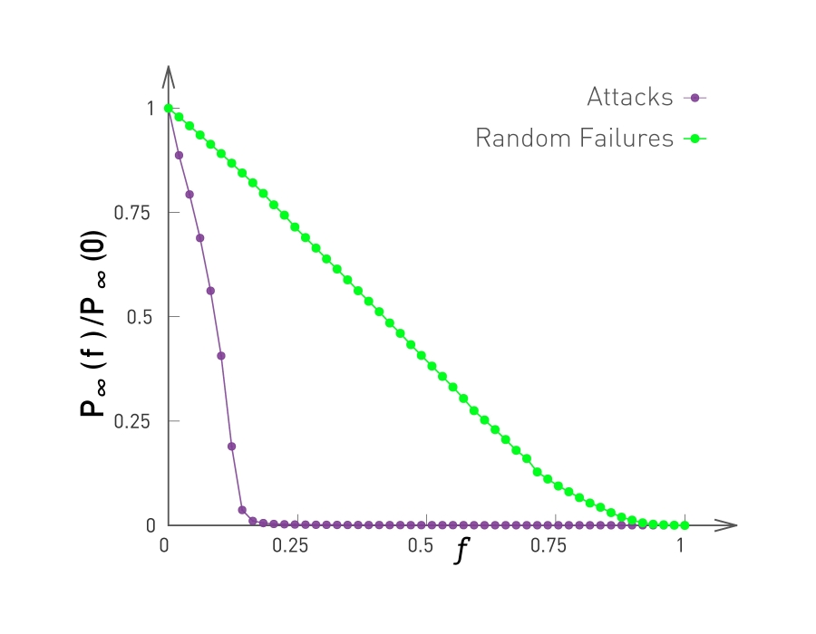
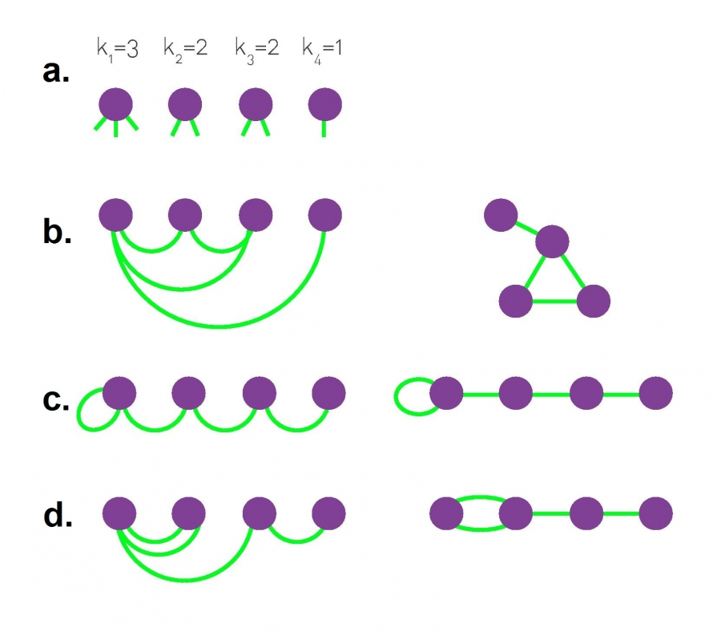

### Overview

Required Reading

* Chapter 4 (sections 4.1, 4.2, 4.3, 4.4., 4.7, 4.8, 4.12),  A-L. Barabási , [Network Science](http://barabasi.com/networksciencebook/), 2015. 
* Chapter 5 (sections 5.1, 5.2, 5.3),  A-L. Barabási ,[Network Science](http://barabasi.com/networksciencebook/) 2015
  
### Degree Distribution of Real Networks

What is the degree distribution of real networks?

* Scientists used to think that real networks can be modeled as random ER graphs.
* Such networks follow the binomial degree distribution.
* In the late 1990s, researchers observed that real networks are very different, with highly skewed degree distribution.
* For many networks, the power law degree distribution $p_k \sim k^{-\alpha}$ is a more appropriate model.

For instance, the plots that you see here illustrate the measured degree distribution of an older internet topology at the router level, a protein-protein interaction network, an email social network, which shows basically who sends email to whom and a citation network showing which papers cite other papers. 

Note that the last two networks are directed and so the corresponding plots show separately, the in-degree and the out-degree distributions. You can find more information about these networks in table 41 of your textbook. 

The plot also shows in green (the second plot), the poisson distribution with the same average degree as the observed network. 
c

Please note the following points about these plots:

* The poisson distribution is clearly a very bad model because it cannot capture the large variability and skewness of the degree distribution of these networks.
* The plots are shown in the log-log scale and the degree distributions decreases roughly as straight lines
* This means that the probability that a node has degree k drops as a power-law of $k:p_k \sim k^{-\alpha}$. The slope of that straight line corresponds to the exponent of the power-law $\alpha$.

This observation is not just a statistical technicality. The fact that the real world networks often follow a power-law degree distribution has major implications about the function robustness and efficiency as we will see later in the semester. 

To further visualize the differences between a poisson and power law distribution, here are two distributions in both linear-linear and log-log scales.

The poisson distribution has an average degree of 11 here, while the power-law distribution has a lowered average degree set to 3, and the exponent is 2.1. The linear-linear plot shows that almost bell-shaped form of the poisson distribution centered around its mean. The power-law distribution on the other hand is not centered around the specific value. The major difference between the two distributions becomes clear in log-log scale. We see that the poisson distribution cannot produce values that are much larger than its average. 

In this example, the maximum value of the poisson distribution is roughly 30,  almost 3 times larger than the mean. The power-law distribution extends over three orders of magnitude and there is a non negligible probability that we get values that are much greater than its mean.

The visualization here, shows 2 networks with 50 nodes. They both have the same average degree equal to 3. The network at the left follows the poisson distribution, while the network at the right follows a power-law distribution with exponent 2.1. 

The size of the nodes is drawn to be proportional to the degree. Note that the poisson network is uniform looking, there is not much variability in the degree of different nodes. The power-law network on the other hand, is very heterogeneous in that respect, some nodes are completely disconnected, many nodes have a degree of only 1 while 2 or 3 nodes have a much higher degree than the average. It is those nodes that we refer to as hubs. 

### Power-law Degree Distribution​

A **“power-law network”** has a degree distribution that is defined by the following equation:​

$$
p_k = ck^{-\alpha}
$$

In other words, the probability that the degree of a node is equal to a positive integer $k$ is proportional to $k^{-\alpha}$ where $\alpha$ >0. ​

The proportionality coefficient c is calculated so that the sum of all degree probabilities is equal to one for a given $\alpha$ and a given minimum degree $k_{\text{min}}$ (the minimum degree may not always be 1). ​

$$
\sum_{k=k_{\text{min}}}^\infty p_k = 1
$$

The calculation of **c** can be simplified if we approximate the discrete degree distribution with a continuous distribution:​

$$
\begin{aligned}
\,  \, \int_{k=k_{min}}^{\infty} p_k =  \, c\int_{k=k_{min}}^{\infty} k^{-\alpha} = - \frac{c}{\alpha-1} k^{-(\alpha-1)} |_{k_{min}}^{\infty} = \frac{c}{\alpha-1} k_{min}^{-(\alpha-1)} = 1
\end{aligned}
$$

which gives:

$$
c = \left(\alpha-1\right) \, {k_{min}^{\alpha-1}}​
$$

So, the complete equation for a power-law degree distribution is:​

$$
p_k= \frac{\alpha-1}{k_{min}} \, \bigg(\frac{k}{k_{min}}\bigg)^{-\alpha}​
$$

The Complementary Cumulative Distribution Function (C-CDF) is:​

$$
P[\mbox{degree} \geq k] = \bigg(\frac{k}{k_{min}}\bigg)^{-(\alpha-1)}​
$$

Note that the exponent of the CCDF function is $\alpha-1$, instead of $\alpha$. So, if the probability that a node has degree $k$ decays with a power-law exponent of 3, the probability that we see nodes with degree greater than $k$ decays with an exponent of 2. ​

For directed networks, we can have that the in-degree or the out-degree or both follow a power-law distribution (*with potentially different exponents*). ​

> **Food for Thought**
> 
> **Prompt 1**: Repeat the derivations given here in more detail. ​
>
> **Prompt 2**: Can you think of a network with n nodes in which all nodes have about the same in-degree but the out-degrees are highly skewed?​
{: .prompt-info }

### The Role of the Exponent of a Power-law Distribution

What is the mean and the variance of a power-law degree distribution? ​

More generally we can ask: what is the m’th statistical moment of a power-law degree distribution? ​
It is defined as: ​

$$
E[k^m] = \sum _{k_{min}}^{\infty} k^m p_k = c \sum _{k_{min}}^{\infty} k^{m-\alpha}​
$$

where **c** is the proportionality coefficient we derived in the previous page. ​

If we rely again on the continuous $k$  approximation, the previous summation becomes an integral that we can easily calculate:​

$$
E[k^m] = c \int_{k_{min}}^{\infty} k^{m-\alpha} {dk} = \frac{c}{m-\alpha+1} k^{m-\alpha+1} |_{k_{min}}^{\infty}
$$

Note that this integral diverges to infinity if $m -\alpha+1\geq 0$  and so, the m’th moment of a power-law degree distribution is well defined (finite) if $m < \alpha -1$.

Consequently, the mean (first moment) exists if $\alpha>2$ ​and the variance (second moment minus the square of the mean) exists if $\alpha>3$.

Of course the variance cannot be “infinite” if the network has a finite number of nodes (i.e., $k$  never ”extends to infinity” in real networks). For many real-world networks however, the exponent $\alpha$  is estimated to be between 2 and 3, which means that even though the distribution has a well-defined average degree, the variability of the degree across different nodes is extremely large. ​

{: width="400" height="400"}
*Standard Deviation is Large in Real Networks, Figure 4.8 from networksciencebook.com by Albert-László Barabási*

To illustrate this last point, let’s look at the relation between the average degree and the standard deviation of the degree distribution for several real-networks (for more details about these networks please review Table 4.1 of your textbook). ​

For a network with Poisson degree distribution (such as random ER graphs), the degree variance is equal to the average degree $\left(E[k]=\bar{k}=\sigma^2\right)$  and so  $\sigma = \sqrt{\bar{k}}$

Note that many real-world networks have much higher $\sigma$ than that --  in some cases $\sigma$ 
 is even an order of magnitude larger than $\bar{k}$. ​In the case of the WWW in-degree distribution, for example, the average in-degree is only around 4 while the standard deviation of the in-degree is almost 40!​

> **Food for Thought**
> 
> **Prompt**:  repeat the derivation for the m’th moment outlined above in more detail. ​
>
{: .prompt-info }

### How to Check if a Network Has Power-law Degree Distribution​

*Rescaling the Degree Distribution, Figure 4.23 from networksciencebook.com by Albert-László Barabási*

In practice, the degree distribution may not follow an ideal power-law distribution throughout the entire range of degrees. In other words, the empirical degree distribution may not be a perfect straight-line when plotted in log-log scale. Instead, it may look similar to the left plot at this page. There are two important points about this distribution:​​

1. For lower values of $k$, we observe a “low-degree saturation” that decreases the probability of seeing low-degree nodes compared to an ideal power-law. If this saturation effect takes place mostly for nodes with degree less than $k_{\text{sat}}$, we can capture  this effect by considering a modified power-law expression: $(k+k_{\text{sat}})^{-\alpha}$.

    Do you see why adding the term $k_{\text{sat}}$ causes a decrease in the probability of low-degree nodes (but it has a minor effect on high-degree nodes)? ​

2.  For very high values of $k$ there is again a deviation from the ideal power-law form. The reason is that in practice there are always some “structural” effects that limit the maximum degree that a node can have. For example, in a router-level computer network, the maximum degree is limited by the maximum number of interfaces that a router can have due to hardware or cost constraints. To capture such a high-degree cutoff point, we often need to constrain the upper-tail of the degree distribution up to a value $k_{\text{cut}}$. This value is determined by practical connectivity constraints for the network we analyze. ​

    In summary, when we want to check if a network follows a power-law degree distribution, we  need to consider whether that distribution drops almost linearly with $k$ in a range between $k_{\text{sat}}$ and $k_{\text{cut}}$
   
Another approach, that addresses the low-degree saturation effect, is to “rescale” the distribution so that we examine the behavior of the degree probability with $(k+k_{\text{cut}})$ (instead of $k$) -  still considering the range up to $k_{\text{cut}}$. This rescaling approach is shown at the plot at the right. ​

> **Food for Thought**
> 
> A more rigorous statistical approach to examine if a network has a power-law degree distribution is described at the following site: [Power-law Distributions in Empirical Data](https://aaronclauset.github.io/powerlaws/). You will experiment with this (or similar) method in an assignment. For now, you may just want to read the description of that method from the given URL. ​
>
{: .prompt-info }

### How to Plot Power-law Degree Distribution​

*Plotting a Degree Distributions, Image 4.22 from networksciencebook.com by Albert-László Barabási*

There are several ways to plot a power-law distribution – but not all of them are good and some of them can even be misleading. ​

This plot visualizes the same distribution, $p_k = c' (k + k_0)^{-\alpha}$, with $k_0 = 10$ and $\alpha=2.5$, in four different ways. The term $k_0 = 10$ causes the “low-degree saturation” that you see at the left tail of the distribution, decreasing the probability of lower-degrees.

**The four plots are:​**

1. linear-linear scale. This is clearly a bad way to plot a power-law distribution. ​
2. log-log scale but with linear binning (the bin width of the histogram increases linearly with $k$). This is also not an appropriate approach because the bins of the histogram for high values of $k$ are quite narrow and they often include 0 or 1 measurements, creating the “plateau” that you see at the tail of the distribution. ​
3. log-log scale but with logarithmic binning (the bin width of the histogram increases exponentially with $k$). Note how the tail of the distribution drops almost linearly with $k$
when the degree is higher than about 50-100. A potential issue with this approach is that we still need to figure out how fast to increase the bin width with $k$. ​
4. the Complementary Cumulative Distribution Function (C-CDF), which shows the probability $P_k$
that the degree is higher or equal than $k$ (all previous plots show the probability $p_k$ that the degree is equal to $k$). This is the best approach because we do not need to determine an appropriate sequence of bin-widths. Please note however that the slope of the C-CDF is not the same as the slope of the degree distribution. In this example, $\alpha=2.5$ and so the exponent of the C-CDF is 1.5.​

### Scale-free Nature of Power-law Networks​

{: width="300" height="300"}
*Lack of an Internal Scale, figure 4.7 from networksciencebook.com by Albert-László Barabási*

One of the first things we learn in statistics is that the Normal distribution describes quite accurately many random variables (due to the Central Limit Theorem), and that according to that distribution 99.8% of the data are expected to fall within 3 standard deviations from the average.

Qualitatively, this is true for all distributions with exponentially fast decreasing tails, which includes the Poisson distribution and many others. In networks that have such degree distributions, the average degree represents the “**typical scale**” of the network, in terms of the number of connections per node (see green distribution at the visualization). ​

On the other hand, a power-law degree distribution with exponent $2<\alpha<3$ has finite mean but infinite variance (any higher moments, such as skewness are also infinite). The infinite variance of this statistical distribution means that we cannot expect the data to fall close to the mean. On the contrary, the mean (the average node degree in our case) can be a rather uninformative statistic in the sense that a large fraction of values can be lower than the mean, and that many values can be much higher than the mean (see purple distribution  at the visualization). ​

For this reason, people often refer to power-law networks as “**scale-free**”, in the sense that the node degree of such networks does not have a “**typical scale**”. In the rest of this course, we prefer to use the term “**power-law networks**” because it is more precise. ​

### The Maximum Degree in a Power-law Network​

Let us now derive an expression for the maximum degree we can expect to see in a power-law network with $n$ nodes, and to compare that with the corresponding maximum degree we can expect to get from a network in which the degree distribution decays exponentially fast with the degree $k$. Recall that the Poisson distribution of $G(n,p)$ networks decays even faster than exponential distribution.

To make the calculations easier, let us work with the (continuous) exponential distribution $p_k = ce^{-\lambda k}$, where $k$ is the degree, $\frac{1}{\lambda}$ is the average degree, and $c$ is a normalization constant. ​​In a network in which the minimum degree is $k_{\text{min}} \geq 0$ (with 1 $\frac{1}{\lambda} > k_{\text{min}}$), the parameter $c$ should be equal to $\lambda e^{\lambda k_{\text{min}}}$, and so the probability that a node has degree $k$ is ​

$$
p_k = \lambda  e^{\lambda k_{min}}  e^{- \lambda k}
$$

​Suppose that the node with maximum degree $k_{\text{min}}$ is unique – so the probability of having a degree $k_{\text{max}}$ is $\frac{1}{n}$. ​

​Thus, relying on the continuous $k$ approximation again, we can write that:​

$$
\int_{k_{max}}^{\infty} p_k {dk} = \frac{1}{n}​
$$

​Substituting the previous expression for $p_k$ and calculating this integral, we can easily get that the maximum degree for the exponential degree distribution is:​

$$
k_{max} = k_{min} + \frac{\ln n}{\lambda}​
$$

​This means that the **maximum degree increases very slowly (logarithmically) with the network size $n$, when the degree distribution decays exponentially fast with $k$.**

​Let us now repeat these derivations but for a power-law network with the same minimum degree $k_{min}$ and an exponent $\alpha$.​

$$
p_k = \frac{\alpha-1}{k_{min}} \, (\frac{k}{k_{min}})^{-\alpha}​
$$

​Suppose that the node with maximum degree $k_{max}$ is unique – so the probability of having a degree $k_{max}$ is $\frac{1}{n}$

​Thus, relying on the continuous $k$ approximation, we can again write that:​

$$
\int_{k_{max}}^{\infty} p_k {dk} = \frac{1}{n}​
$$

​Substituting the previous expression for $p_k$ and calculating this integral, we can easily get that the maximum degree for a power-law network is:​

$$
k_{max} = k_{min} \, n^{1/(\alpha-1)}​​
$$

​This means that the **maximum degree in a power-law network increases as a power-law of the network size $n$. If $\alpha=3$ the maximum degree increases with the square-root of $n$.​**

**In the more extreme case that $\alpha=2$ the maximum degree increases linearly with $n$!**

​To put these numbers in perspective, consider a network with one million nodes, and an average degree of $\bar{k}=3$. If the network follows the exponential degree distribution, the maximum expected degree is only about 10 – not much larger than the average degree.  ​

If the network follows the power-law degree distribution with exponent $\alpha=2.5$ (recall that this is a typical value for many real-world networks), we get that the maximum degree is about 10,000!​

*Random vs. Scale-free Networks, Figure 4.6 from networksciencebook.com by Albert-László Barabási*

​The example above clearly illustrates a major difference between exponential and power-law networks: the latter have nodes with a much greater number of connections than the average node – we typically refer to those nodes as **Hubs**.  ​

The visualization at this page illustrates the difference between exponential and power-law networks focusing on the presence of hubs. The network of major interstate highways in the US follows a Poisson distribution, without any nodes (cities) that have a much larger degree than the average. On the other hand, the network of direct flights between the major US cities follows a power-law degree distribution and there are obvious hubs, such as the airports in Atlanta, Chicago or New York city.

> **Food for Thought**
> 
> Derive the integrals shown in this page yourself. ​
>
{: .prompt-info }

### Random Failures and Targeted Attacks in Power-law Networks

Another interesting characteristic of power-law networks is that they behave very differently than random ER-graphs (**or, more generally, networks with Poisson degree distribution**) in the presence of node failures. ​

Let us first distinguish between **random failures** (*where a fraction f of randomly selected nodes are removed from the network*), and **targeted attacks** (*where a fraction f of the nodes with the highest degree are removed from the network*). In a communication network, for instance, random failures can be caused by router malfunctions, while targeted attacks may be caused by a terrorist that knows the topology of the network and disrupts the highest-connectivity routers first. ​

{: width="400" height="400"}
*Scale-free Network Under Attack, Figure 8.11 from networksciencebook.com by Albert-László Barabási*

{: width="400" height="400"}
*Attacks and Failures in Random Networks. Figure 8.13 from networksciencebook.com by Albert-László Barabási*

The plots in this page compare the effect of both random failures and attacks on both power-law networks (left) and ER-graphs (right). In both cases, the networks have the same size (10,000 nodes and 15,000 edges). The exponent of the power-law distribution in the network at the left is 2.5 (meaning that the variance of the degree distribution is infinite) and the average degree is 3. ​

The y-axis of both plots shows the fraction of nodes that belong to the largest connected component, for a given fraction f of removed nodes (more precisely, the y-axis shows the ratio $P_{\infty}(f)/P_{\infty}(0)$, where the numerator is the probability that a node belongs in the largest connected component given a fraction f of removed nodes, while the denominator is the same probability but when  $f=0$). 

In terms of random failures, the power-law degree network is much more robust than the random network: the largest connected component includes almost all nodes, even as f approaches 100% of the nodes. On the other hand, the random network’s largest connected component disintegrates after f exceeds a critical threshold (*around 0.7 in this example*). This difference is mostly due to the presence of hubs in power-law networks: hubs have so many connections that they manage to keep the non-deleted nodes in the same connected component, even when f is close to 1. ​

The situation is very different from targeted attacks: power-law networks are very sensitive to those because an attacker would first delete the hub nodes, causing a disintegration of the largest connected component after f exceeds a critical threshold (*around 0.15 in this example*). That critical threshold is higher for Poisson networks because they do not have hub nodes. ​

In summary, power-law networks are more robust to random failures than Poisson networks – but they are also more sensitive to targeted attacks than Poisson networks. ​

### Degree-preserving Randomization​

*Degree Preserving Randomization, Figure 4.17 from networksciencebook.com by Albert-László Barabási*

Suppose that you analyze a certain network G and you find it has an interesting property P.  For example, P may be one of the robustness properties we discussed in the previous page about the size of the largest connected component under random or targeted node removals. How can you check statistically whether P is caused by the degree distribution of the network G (as opposed to other network characteristics)?​

One approach to do is to **”randomize”** the network G but without modifying the degree of any node. If we have a way to do so, we can create a large number of “**degree-preserving**” random networks – and then examine whether these networks also exhibit the property P. To make the analysis convincing we can also create another ensemble of randomized networks that do NOT have the same degree distribution with G but that maintain the same number of nodes and edges. Let us call these networks ”**fully randomized**”. ​

If the property P of G is present in the degree-preserving randomized networks – but P is not present in the fully randomized networks, we can be confident that the property P is a consequence of the degree distribution of G and not of any other property of G.​

To perform ”**full randomization**”, we can simply pick each edge (S1, T1) of G and change it to (S1, T2), where T2 is a randomly selected node. Note that this does not change the number of nodes or edges (and so the network density remains the same). The degree distribution however can change significantly. ​

To perform “**degree-preserving randomization**”, we can pick two random edges(S1, T1) and (S2, T2) and rewire them to (S1,T2) and (S2, T1). Note that this approach preserves the degree of every node. This approach is repeated until we have rewired each edge at least once. ​

The visualization at the lower part of the panel shows an example of a power-law network and two randomized networks. The degree-preserving network maintains the presence of hubs as well as the connected nature of the original network. The fully randomized network on the other hand does not have hubs (*and it could even include disconnected nodes – even though that does not happen in this example*). ​

> **Food for Thought**
> 
> There are more randomization approaches that can preserve more network properties than the degree distribution. How would you randomize a directed network so that the in-degree and the out-degree distributions remain the same? 
>
{: .prompt-info }

### The Average Degree of the Nearest Neighbor at a Power-law Network​

*Structural Disassortativity, Figure 7.7 from networksciencebook.com by Albert-László Barabási*

Recall the notion of “**average neighbor degree**” from Lesson-3 – which is the same with the expected degree of a node that is connected to a randomly sampled edge stub. ​

Under the assumption of a “**neutral network**” (i.e., no correlation between the degrees of two connected nodes), we derived that the average neighbor degree is: ​

$$
\bar{k}_{n} = \bar{k} + \frac{\sigma^2_k}{\bar{k}}​
$$

This shows one more interesting property of power-law networks: as we previously discussed, these networks can have very large degree variability in practice (i.e., $\sigma_k$ is much higher than $\bar{k}$). Consequently, the average neighbor degree can be much higher than the network’s average degree – intensifying the impact of the friendship paradox. ​

The visualization at this page shows a power-law network with 300 nodes, 450 edges, and exponent 2.2, generated by the configuration model. We highlight the two highest-degree hubs. Note that many nodes are connected to those hubs, increasing the average neighbor degree of those nodes. ​

### Configuration Model​

Suppose that a real-world communication network with one thousand nodes has a power-law degree distribution with exponent $\alpha=2.5$ –you may want to investigate how this network will perform when it grows to ten thousand nodes, assuming that its degree distribution exponent remains the same. 

How can we create a synthetic network that has a given degree distribution? This is a central question in network modeling. ​

​A general way to create synthetic networks with a specified degree distribution $p_k$ is the “configuration model”. The inputs to this model is 
1. the desired number of nodes n, and 
2. the degree ki of each node i.
The collection of all degrees specifies the degree distribution of the synthetic network. ​

*The Configuration Model, Figure 4.15 from networksciencebook.com by Albert-László Barabási*

​The configuration model starts by creating the n nodes: node $i$ has $k_i$ available “edge stubs”. Then, we keep selecting randomly two available stubs and connect them together with an edge, until there are no available stubs. The process is guaranteed to cover all stubs as long as the sum of all node degrees is even.​

​The configuration model process is random and so it creates different networks each time, allowing us to produce an ensemble of networks with the given degree distribution. ​

Additionally, note that the constructed edges may form self-loops (*connecting a node to itself*) or multi-edges (connecting the same pair of nodes multiple times). In some applications multi-edges and self-loops are not allowed – but the good news is that they are unlikely to happen when n is very large and the network is sparse. Removing them artificially is another option but it can cause deviations from the desired degree distribution. ​

​The visualization of this page shows three different networks with n=4 that can result from the configuration model, given the same degree distribution. Note that there are more than three different networks that could include self loops and multi-edges - can you find the rest?

> **Food for Thought**
> 
> What is the probability that the configuration model will connect two nodes of degree $k_i$ and $k_j$? 
>
{: .prompt-info }

### Preferential Attachment Model​

The configuration model can generate networks with arbitrary degree distributions – including power-laws with any exponent. However, the configuration model does not suggest any **“generating mechanism**” that explains how a network can gradually acquire a power-law degree distribution. ​

*Evolution of the Barabási-Albert Model, Figure 5.3 from networksciencebook.com by Albert-László Barabási*

One such generating model is known as “**preferential attachment**” (*or PA model or “Barabási-Albert” model*). In this model, the network grows by one node at each time step – so the network has t nodes after t time steps. Every time a new node is added to the network, it connects to m existing nodes (*m is the same for all new nodes – suppose that we allow self-loops and multi-edges for now*). The neighbors of the new node are chosen randomly but with a non-uniform probability, as follows.​

Suppose that the new node arrives at a point in time $t$, and let $k_i(t)$ be the degree of node $i$ at that time. The probability that the new node will connect to node $i$ is:​

$$
\Pi_i(t) = \frac{k_i(t)}{\sum_{j=1}^t k_j(t)} = \frac{k_i(t)}{2 m t}
$$

In other words, in the preferential attachment model, the network grows over time and new nodes are more likely to connect to nodes with higher degrees (see above plot). This is a ”**rich get richer**” effect because nodes with higher degree attract more connections from new nodes, making their degree even higher relative to other nodes. ​

Later in the course, we will return to this model and study its behavior mathematically.

For now, we only mention without proof that this model produces power-law networks with an exponent $\alpha=3$. The value of the parameter m (number of edges of new node) does not affect the exponent of the distribution.

The degree distribution at the plot below refers to a network that was created with the preferential attachment model, after generating n=100,000 nodes and with m=3 (the green dots show a log-binned estimate of the distribution while the purple dots show a linearly-binned histogram).​

*The Degree Distribution, Figure 5.4 from networksciencebook.com by Albert-László Barabási*

The main value of the preferential attachment model is that it suggests that power-law networks can be generated through the combined effect of two mechanisms: growth and preferential connecting to nodes with a higher degree. Either of these two mechanisms on its own would not be sufficient to produce power-law networks. ​

> **Food for Thought**
> 
> How would you modify the preferential attachment model so that you get an exponent $\alpha$
 between 2 and 3?​
>
{: .prompt-info }

### Link Selection Model​

{: width="200" height="400"}
*Link Selection Model, Figure 5.13 from networksciencebook.com by Albert-László Barabási*

Another very simple generating model that also creates power-law networks with exponent 3 is the “**link selection**” model.​

Suppose that each time we introduce a new node, we select a random link and the new node connects to one of the two end-points of that link (*randomly chosen*). In other words, the new node connects to a randomly selected edge-stub (*see visualization*).​

In this model, the probability that the new node connects to a node of degree k is proportional to k (*because the node of degree-k has k stubs*). But this is exactly the same condition with the preferential attachment model: a linear relation between the degree k of an existing node and the probability that the new node connects to that existing node of degree-k. ​

So, the link selection model is just a variant of preferential attachment and it also produces power-law degree distribution with exponent $\alpha=3$.

### What Does The Power-law Property Mean in Practice?

*Image source: https://www.nature.com/articls/35082140/figures/2Links*

The focus of this lecture so far has been on the statistical properties of networks with power-law degree distribution. What does this property mean in practice, however? And how does it affect network phenomena that all of us care about, such as the spread of epidemics? ​ 

​To answer the first question, let us consider the case of networks of sexual partners. There are several diseases that spread through sexual intercourse, including HIV-AIDS, syphilis or gonorrhea.The degree distribution in such networks relates to the number of sexual partners of each individual (node in the graph). The plots on this page are based on a 1996 survey of sexual behavior conducted in Sweden. The number of respondents was 2,810 and the age range was from 18 to 74 years old (*roughly balanced between men and women*). ​ 

The plot at the left is the C–CDF for the number of partners of each individual during the last 12 months, shown separately for men and women. Note that the distributions drop roughly linearly in the log-log scale plot, suggesting the presence of a power-law distribution (*at least in the range from 2 to 20*). ​ 

​The plot at the right is the corresponding C-CDF but this time for the entire lifetime of each individual. As expected, the range of the distribution now extends to a wider range (up to 100 partners for women and 1000 for men). Note the low-degree saturation effect we discussed earlier in this lesson, especially for less than 10 partners. The exponent of the C-CDF distributions is αtot = 2.1 ± 0.3 for women (in the range $k_{tot} > 20$), and $\alpha_{tot} = 1.6 \pm 0.3$ for men (in the range $20 < k_{tot} < 400$). Estimates for females and males agree within statistical uncertainty. Note that these exponents refer to the C-CDF – so the corresponding exponents for the degree distributions would be, on average, 3.1 for women and 2.6 for men. ​ 

​These exponent values suggest that, at least for men, the corresponding network of sexual contacts would have a power-law distribution with very high variability (theoretically, “**infinite variance**”). The distribution also shows the presence of hubs: individuals with hundreds of partners during their lifetime. The wide variability in this distribution justifies targeted intervention approaches that aim to identify the “**hub individuals**” and provide them with additional information, resources (such as condoms or treatment), and when available, vaccination. ​ 

### Case Studies: Superspreaders

#### Superspreaders in SARS epidemic

The SARS (Severa Acute Respiratory Syndrome) was an epidemic back in 2002-3. It infected 8000 people in 23 countries and it caused about 800 deaths.

*Source: Super-spreaders in infectious diseases [Richard A.Stein](https://www.sciencedirect.com/science/article/pii/S1201971211000245), International Journal of Infectious Diseases, August 2011 https://doi.org/10.1016/j.ijid.2010.06.020*

The plot shown here shows how the infections progressed from a single individual (labeled as patient-1) to many others. Such plots result from a process known as “contact tracing” – finding out the chain of successive infections in a population.

It is important to note the presence of a few hub nodes, referred to as **“superspreaders”** in the context of epidemics. The superspreaders are labeled with an integer identifier in this plot. The superspreader 1, for example, infected directly about 20 individuals.

The presence of superspreaders emphasizes the role of degree heterogeneity in network phenomena such as epidemics. If the infection network was more “**Poisson-like**”, it would not have superspreaders and the total number of infected individuals would be considerably smaller.

---

#### Superspreaders Versus The Average Reproductive Number $R_0$

*Source: Cellular Superspreaders: An Epidemiological Perspective on HIV Infection inside the Body Kristina Talbert-Slagle et al., 2014, https://doi.org/10.1371/journal.ppat.1004092*

Epidemiologists often use the basic “reproductive number”, $R_0$, which describes the average number of secondary infections that arise from one infected individual in an otherwise totally susceptible population.

One way to estimate $R_0$ is to multiply the average number of contacts of an infected individual by the probability that a susceptive individual will become infected by a single infected individual (“shedding potential”). So, the $R_0$ metric does not depend only on the given pathogen – it also depends on the number of contacts that each individual has. If $R_0$>1 then an outbreak is likely to become an epidemic, while if $R_0$<1 then an outbreak will not spread beyond a few initially infected individuals

It is important to realize however that $R_0$ is only an average – it does not capture the heterogeneity in the number of contacts of different individuals (*and it also does not capture the heterogeneity in the shedding potential of the pathogen at different individuals*). As we know by now, contact networks can be extremely heterogeneous in terms of the degree distribution, and they can be modeled with a power-law distribution of (theoretically) infinite variance. Such networks include hubs – and as we saw above, hubs can act as superspreaders during epidemic outbreaks.

The table in this page confirms this point for several epidemics. The third column shows R0 while the fourth column shows ”**Superspreading events**” (SSE). These are events during an outbreak in which a single infected individual causes a large number of direct or indirect infections. For example, in the case of the 2003 SARS epidemic in Hong Kong, even though $R_0$  was only 3, there was an SSE in which an infected individual caused a total of 187 infections (*patient-1 above*).

SSEs have been observed in practically every epidemic – and they have major consequences both in terms of the speed through which an epidemic spreads and in terms of appropriate interventions. For example, in the case of respiratory infections (such as COVID-19) “**social distancing**” is an effective intervention only as long as it is adopted widely enough to also include superspreaders.

### Lesson Summary

The goal of this module was to introduce you to real networks, their degree distributions and the differences they have with random networks. From there we explored the Power-law degree distribution, how to test for it, methods of plotting it, and the special properties of networks that have this distribution. These properties include the maximum degree, the robustness of these networks  reason that power-law network are sometimes also referred to as scale-free networks. Additionally, we introduced you to several models for generating real networks such as the configuration model, the link-selection model and the preferential attachment model.

Because real networks with power-law degree distributions are the ones that occur in nature, we will continue to build upon these concepts further in the remainder of the modules as we explore concepts such as sociological networks, communities within networks, and the dynamics of contagion spreading withing a network.

### Assortative, Neutral and Disassortative Networks

Let's look at some examples of science degree correlation plots from real world networks. The first network refers to the collaboration between a group of scientists, two nodes are connected if they have written at least one research paper together. Notice that the data is quite noisy especially when the degree K is more than 70. 

The reason is simply that we did not have a large enough sample of such nodes with large degrees. Nevertheless, we clearly see a positive correlation between the degree K and the degree of the nearest neighbor which is shown in the y axis.

If we model the data with a power law relation, the exponent $\mu$ is approximately 0.37 in this case. We can use this value to quantify and compare the sort of activity of different networks when the estimate is $\mu$ is statistically significant.

The second network refers to a portion of the power grid in the United States. the data in this case does not support a strong correlation between the degree K and the degree of the nearest neighbor. So it is safe to assume that this network is what we call neutral

The third network refers to a metabolic network where nodes here are metabolites and they are connected if two metabolites A and B appear in the opposite side of the same chemical reaction in a biological cell. The data shows a strong negative correlation in this case but only if the nodes have degree 5, 10, or higher. If we model the data with power law relation, the exponent $\mu$ is approximately minus 0.86. This suggests that complex metabolites such as glucose are either synthesized through a process called anabolism or broken down into through a process called catabolism into a large number of simpler molecules such as carbon dioxide.

### Lesson Summary

The main objective of this lesson was to explore the notion of “degree distribution” for a given network. The degree distribution is probably the first thing you will want to see for any network you encounter from now on. It gives you a quantitative and concise description of the network’s connectivity in terms of average node degree, degree variability, common degree modes, presence of nodes with very high degrees, etc.  

In this context, we also examined a number of related topics. First, the friendship paradox is an interesting example to illustrate the importance of degree variability. We also saw how the friendship paradox is applied in practice in vaccination strategies. 

We also introduced G(n,p), which is a fundamental model of random graphs – and something that we will use extensively as a baseline network from now on. We explained why the degree distribution of G(n,p) networks can be approximated with the Poisson distribution, and analyzed mathematically the size of the largest connected component in such networks.  

Obviously, the degree distribution does not tell the whole story about a network. For instance, we talked about networks with degree correlations. This is an important property that we cannot infer just by looking at the degree distribution. Instead, it requires us to think about the probability that two nodes are connected as a function of their degrees.  

We will return to all of these concepts and refine them later in the course.

<!-- Dummy line -->
<!--  -->