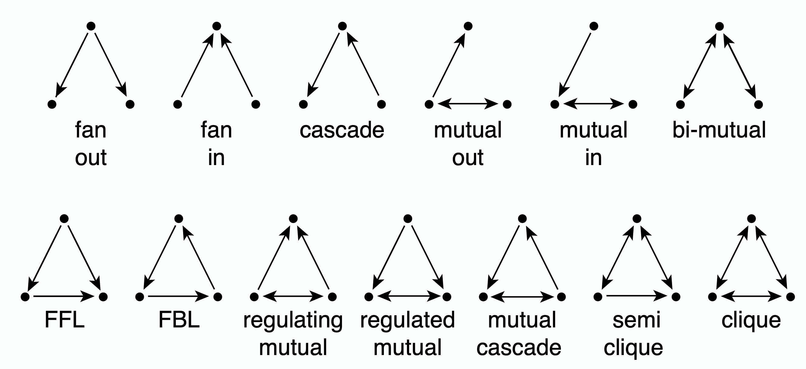
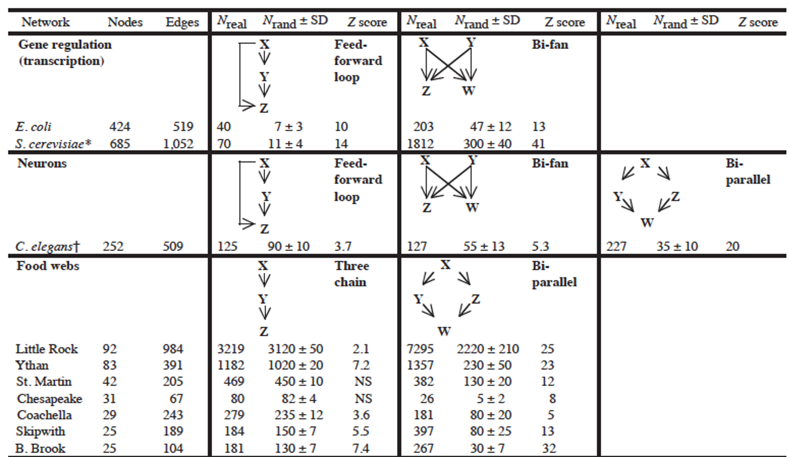

### Overview

Required Reading

* Sections 3.8, 3.9, 5.10 from A-L. Barabási, [Network Science](http://barabasi.com/networksciencebook/), 2015
* Sections 3.1, 3.2, 20.1, 20.2 -  D. Easley and J. Kleinberg, [Networks, Crowds and Markets](https://www.cs.cornell.edu/home/kleinber/networks-book/)., Cambridge Univ Press, 2010 (also available [online](https://www.cs.cornell.edu/home/kleinber/networks-book/networks-book.pdf)).
* [Structure and function of the feed-forward loop network motif](https://www.pnas.org/doi/full/10.1073/pnas.2133841100). S. Mangan and U. Alon, PNAS October 14, 2003 100 (21) 11980-11985

### Clustering Coefficient

In social networks, it is often the case that if A is a friend of B and C, then B and C are also likely to be friends with each other. In other words, A, B, and C form a “**friendship triangle**”. The presence of such triangles is quite common in almost all real-world networks.

To quantify the presence of such triangles of connected nodes, we can use the **Clustering Coefficient**. For a node-i with at least two neighbors, this metric is defined as the fraction of its neighbors’ pairs that are connected.

Mathematically, suppose that the network is undirected, unweighted, and described by an adjacency matrix A. The clustering coefficient for node-i is defined as:

$$
C_i = \frac{1/2 \, \sum_{j,m} A_{i,j}A_{j,m}A_{m,i}}{k_i (k_i-1)/2} = \frac{\sum_{j,m} A_{i,j}A_{j,m}A_{m,i}}{k_i (k_i-1)}
$$

The denominator at the left fraction is the number of distinct neighbor pairs of node-i, while the numerator is the number of those pairs that form triangles with node-i. If the degree of node-i is one or zero, the clustering coefficient is not well-defined.

{: width="400" height="400"}

The visualization at the top shows three examples in which node-i is the purple node. As you see, the clustering coefficient quantifies the extent to which node-i and its direct neighbors form an interconnected cluster. If they form a clique the clustering coefficient is maximized (one) – while if they form a star topology with node-i at the center the clustering coefficient is minimized (zero). 

We often want to describe the clustering coefficient not only of one node in the network – but of all nodes. One way to do so is with the plot at the below.

{: width="400" height="400"}

For every degree-k, the plot shows the average clustering coefficient C(k) of all nodes with degree k>1. Typically there is a decreasing trend in C(k) as k increases, suggesting that it becomes less likely to find densely interconnected clusters of many nodes compared to clusters of fewer nodes.

> **Food for Thought**
> 
> In signed social networks, where a positive edge may represent friends while a negative edge may represent enemies, the "triadic closure" property also relates to the stability of that triangle. Which signed triangles do you think are unstable, meaning that one or more edges will probably be removed over time?
>
{: .prompt-info }

### Average Clustering and Transitivity Coefficient

If we want to quantify the degree of clustering in the entire network with a single number, we have two options. The first is to simply calculate the **Average Clustering Coefficient** for all nodes with degree larger than one.

A better metric, however, is to calculate the **Transitivity (or global clustering coefficient)**, which is defined as the **fraction of the connected triplets of nodes that form triangles.**

Mathematically, the transitivity is defined as:

$$
T = \frac{\mbox{3} \times\mbox{Number of triangles}} {\mbox{Number of connected triplets}}
$$

A connected triplet is an ordered set of three nodes ABC such that A connects to B and B connects to C. For example, an A, B, C triangle corresponds to three triplets, ABC, BCA, and CAB. In contrast, a chain of connected nodes A, B, C, in which B connects to A and C, but A does not link to C, forms an open triplet ABC. The factor three in the previous equation is needed because each triangle is counted three times in the triplet count.

> **Food for Thought**
> 
> Note that the Transitivity and the Average Clustering Coefficient are two different metrics. They may often be close but there are also some extreme cases in which the two metrics give very different answers. To see that consider a network in which two nodes A and B are connected to each other as well as to every other node. There are no other links. The total number of nodes is n. What would be the transitivity and average clustering coefficient in this case (you can simplify by assuming that n is quite large)?
>
{: .prompt-info }

### Clustering in Weighted Networks

The definition of clustering coefficient can also be generalized for weighted networks as follows. Suppose that $w_{i,j}$ is the weight of the edge between nodes i and j.

First, in weighted networks, instead of the degree of a node we often talk about its “strength”, defined as the sum of all weights of the node’s connections:

$$
s_i = \sum_j A_{i,j} \, w_{i,j}
$$

Then, the weighted clustering coefficient of node i is defined as:

$$
C_{w}(i) = \frac{1}{s_i \, (k_i-1)} \sum_{j,h} \frac{w_{i,j}+w_{i,h}}{2} A_{i,j}A_{i,h}A_{j,h}
$$

{: width="400" height="400"}
*Comparison of weighted and unweighted clustering coefficient for an example graph.*

The normalization term $\frac{1}{s_i \, (k_i-1)}$ is such that the maximum value of the weighted clustering coefficient is one. 

The product of the three adjacency matrix elements at the right is one only if the nodes $i,j,h$ form a triangle. In that case, that triangle contributes to the clustering coefficient of node-i based on the average weight of the two edges that connect node i with j and h, respectively. Note that the weight between nodes j and h does not matter.

The visualization shows the unweighted and weighted clustering coefficient values for the darker node. That node has a stronger connection with a node that does not belong to the cluster of nodes at the lower-left side. This is why the weighted clustering coefficient is lower than the unweighted.

> **Food for Thought**
> 
> How would you generalize the definition of Transitivity for weighted networks?
>
{: .prompt-info }
### Clustering in G(n,p) networks

How large is the expected clustering coefficient at a random ER network (i.e., a network constructed using the G(n,p) model from Lesson-3)?

Recall that any two nodes in that model are connected with the same probability p. So, the probability that a connected triplet A-B-C forms a triangle (A-B-C-A) is also p. Thus, the expected value of the clustering coefficient for any node with more than one connection is p. Similarly, the transitivity (and the average clustering coefficient) of the whole network is also expected to be p.

In G(n,p), the average degree is $\bar{k}=p \, (n-1)$. So, if the average degree remains constant, we expect p to drop inversely proportional with n as the network size grows. This means that if real networks follow the G(n,p) model, we would see a decreasing trend between the clustering coefficient and the network size.

{: width="400" height="400"}
*Figure 3-13 from networksciencebook.com*

This is not the case with real networks however. The plot shows the average clustering coefficient, normalized by the average degree, as a function of the network size N. In the G(N,p) model, this normalized version of the average clustering coefficient should be equal to 1/N (shown as a green line in the plot). The various colored dots show the clustering coefficient for several real-world networks that appear in Table 3.2 of your textbook. These networks have widely different sizes, ranging from a thousand nodes to almost a million. Note that their clustering coefficient does not seem to get smaller as the network size increases.

The main message here is that the G(n,p) model predicts negligible clustering, especially for large and sparse networks. On the contrary, real-world networks have a much higher clustering coefficient than G(n,p) and its magnitude does not seem to depend on the network size.

> **Food for Thought**
> 
> The transitivity (*and clustering coefficient*) focuses on a microscale property of a network, in the sense that it shows how likely it is that connected triplets form triangles. How would you explain that the value of this metric does not seem to depend on the size of the overall network in practice? What does that imply about the mechanisms that guide the formation of such networks?
>
{: .prompt-info }
### Clustering in Regular Networks

{: width="400" height="400"}

On the other hand, regular networks typically have a locally clustered topology. The exact value of the clustering coefficient depends on the specific network type but in general, it is fair to say that “**regular networks have strong clustering**”. Further, the clustering coefficient of regular networks is typically independent of their size.

To see that, let's consider the common regular network topology shown at the visualization. The n nodes are placed in a circle, and every node is connected to an even number c of the nearest neighbors (c/2 at the left and c/2 at the right). If c=2, this topology is simply a ring network with zero clustering (no triangles). For a higher (even) value of c however, the transitivity coefficient is:

$$
T = \frac{3(c-2)}{4(c-1)}
$$

Note that this does not depend on the network size. Additionally, as c increases the transitivity approaches ¾.

> **Food for Thought**
> 
> Prove the previous formula for the transitivity coefficient.
>
{: .prompt-info }

### Diameter, Characteristic Path Length, and Network Efficiency

The notion of small-world networks depends on two concepts: how clustered the network is (covered in the previous pages) and how short the paths between network nodes are – that we cover next.

As you recall from Lesson-2 if a network forms a connected component we can compute the shortest-path length $d_{i,j}$ between any two nodes i and j. One way to summarize these distances for the entire network is to simply take the average such distance across all distinct node pairs. This metric L is referred to as **Average (shortest) Path Length (APL)** or **Characteristic Path Length (CPL)** of the network. For an undirected and connected network of n nodes, we define L as:

$$
L = \frac{2}{n(n-1)} \sum_{i < j} d_{i,j}
$$

A related metric is the harmonic mean of the shortest-path lengths across all distinct node pairs, referred to as the **efficiency** of the network:

$$
E = \frac{2}{n(n-1)} \sum_{i < j} \frac{1}{d_{i,j}}
$$

The efficiency varies between 0 and 1.

Another metric that is often used to quantify the distance between network nodes is the **diameter**, which is defined as the maximum shortest-path distance across all node pairs:

$$
D = \max_{i < j} d_{i,j}
$$

A more informative description is the distribution of the shortest-path lengths across all distinct node pairs, as shown in the visualizations below.

|||
|:--|:--|
|{: width="300" height="400"}|{: width="300" height="400"}|

At the left, the corresponding network is the largest connected component of the protein-protein interaction of yeast (2,018 nodes and 2,930 edges, the largest connected component include 81% of the nodes). The characteristic path length (CPL) is 5.61 while the diameter is 14 hops.

At the right, the network is based on the friendship connections of Facebook users (all pairs of Facebook users worldwide and within the US only). The CPL is between 4 and 5, depending on the network.

### Diameter and CPL of G(n,p) Networks

{: width="300" height="400"}

Let us now go back to the simplest random graph model we have studied so far, i.e., the ER or G(n,p) model. What is the diameter of such a network?

We can derive an approximate expression as follows.

Suppose that the average degree is $\bar{k}=(n-1)\, p > 1$ (so that the network has a giant connected component). We will further assume that the topology of the network is a **tree**.

We start from node i. Within one hop away from that node, we expect to visit $\bar{k}$ nodes. Within two hops, we expect to visit approximately $(\bar{k})^2$ nodes. And with a similar reasoning, after s hops we expect to visit approximately $(\bar{k})^s$ nodes.

The total number of nodes in the network is n however, and we expect to visit all of them with the maximum number of hops that is possible, which is the network diameter $D$.

So, $n \approx (\bar{k})^D$. Solving for D, we get that

$$
D \approx \frac{\ln n}{\ln{\bar{k}}}
$$

Even though this expression is a very rough approximation, it shows something remarkable: in a random network, even the longest shortest—paths are expected to grow very slowly (i.e., *logarithmically*) with the size of the network.

Here is a numerical example: suppose we have a social network that covers all people (around 7 billion today) and assumes that each person knows well 64 other people. According to the previous expression, any two people are connected to each other with a “social chain” (shortest-path) of 5.4 relations.

Additionally, the CPL is lower (or equal) than the diameter of the network. So the average shortest-path length is also upper bounded by the same logarithmic expression we derived above. 

---

#### The diameter of G(n,p) networks – more accurate expressions

Two approximate expressions that are often used in practice apply for sparse and dense networks, respectively.

Specifically, for very sparse networks, as k approaches to 1 from above (*so that the network is still expected to have a large connected component*), the diameter is expected to be

$$
D \approx 3 \frac{\ln n}{\ln{\bar{k}}}
$$

This is three times larger than the expression we derived in the previous page. For very dense networks, on the other hand, a good approximation for the diameter is:

$$
D \approx \frac{\ln n}{\ln{\bar{k}}} + \frac{2\ln n}{\bar{k}} + \ln n \frac{\ln \bar{k}}{(\bar{k})^2}
$$

Note that in both cases, the diameter is still increasing with the logarithm of the network size. So, the main qualitative conclusion remains what we stated in the previous page, i.e., the diameter of G(n,p) networks increases very slowly (logarithmically) with the number of nodes – and so the CPL cannot increase faster than that either.

> **Food for Thought**
> 
> * Enumerate all the assumptions we made in the derivation for the diameter of G(n,p) networks.
> * Go back to the example of the previous page (*a social network with 7 billion nodes and an average degree of 64*). What would be the diameter according to either of the previous two approximations?
>
{: .prompt-info }

### Diameter and Efficiency of G(n,p) Versus Regular Networks

Does the diameter of all networks increase logarithmically? Clearly not. Let's examine what happens in regular networks – and more specifically, in lattice networks.

In one-dimensional lattices, each node has two neighbors, and the lattice is a line network of n nodes -- so the diameter increases linearly with $n$.

In two dimensions, each node has 4 neighbors, and the lattice is a square with $\sqrt{n}$
 nodes on each side -- so the diameter increases as $O(n^{1/2})$

Similarly, in three dimensions each node has 8 neighbors, and the diameter grows as $O(n^{1/3})$
 – and so on in higher dimensions.

This suggests that in lattice networks the diameter grows as a power-law of the network size – this grows much faster than a logarithmic function. 

Let us go back to the hypothetical social network of 7 billion humans – and with an average of 64 connections per person. If this social network was a regular lattice, it would need to have 6 dimensions so that each node has 64 connections. So the diameter would be in the order of $n^{1/6}$, which is about 44 – this is much larger than the diameter we derived earlier for a random network of the same size and density.

These simple derivations show a major qualitative difference between regular networks and random networks: in the former, the diameter and CPL increase much faster than in the latter – as a power-law in the former and logarithmically in the latter.

> **Food for Thought**
> 
> Pick a non-lattice regular network and examine if the diameter still increases as a power-law.
>
{: .prompt-info }

### What Does “Small-world” Network Mean?

A **small-world network** is a network that satisfies the small-world property. To determine if a network has small-world property, we compare two of its characteristics against an ensemble of random G(n,p) networks with the same size n and density p.

For the first condition we check, is the clustering coefficient **much larger** than the random G(n,p) networks? This condition can be examined with an appropriate hypothesis test. For instance, the one-sample one-tailed t-test would examine, in this case, whether the clustering coefficient of the given network is significantly greater than the mean of the clustering coefficient values in the G(n,p) ensemble. 

For the second condition, we again check that the CPL of the given network is **not significantly greater** than the mean CPL value in the G(n,p) ensemble.

Please note that whether the previous conditions hold or not may depend on the significance level (“alpha value”) of the corresponding hypothesis tests. Additionally, it may be that even though the given network has a CPL (for instance) that is greater than the mean of the CPL values in the G(n,p) ensemble, the difference may be small in absolute magnitude (e.g., 2.1 versus 2.0).

#### Clustering and efficiency in real-world networks 

So far this lesson has focused on two network properties, the presence of clustering and the relation between diameter and network size. You may wonder what about real world networks? Where do they stand in terms of these two properties?

An important discovery by Watts and Strogatz in 1998 was that the networks we often see in practice have the following two properties:

1. They have strong clustering similar to that of lattice networks with the same average degree,
2. They have short paths similar to the characteristics path length and diameter we see in random Erdos-Renyi networks that we have same size n and density P as the real-world networks we were given.
   
We refer to such networks as small-world networks. They are small in the sense that the shortest paths between nodes increase only modestly with a size of the network. Modestly means logarithmically or even slower. At the same time, small world networks are not randomly formed.

On the contrary, the nodes form clusters of interconnected triangles, similar to what we see in social groups, such as families, groups of friends, or larger organizations of people. The table that you see here shows the characteristics of some real-world networks. 

The column shows the network name, the number of nodes n, the number of edges L, the average degree, the characteristic path length, the diameter, and the predicted diameter based on the formula we derived earlier in the last column. Note that the characteristic path length is the same order of magnitude with what we would expect from a $G(n,p) random network.

Additionally, this plot shows the clustering coefficient for each of these networks with different colors. All networks have a much larger clustering coefficient than what would be expected from a corresponding $G(n,p)$ network. 

#### Watt Strogatz Model

How can we create networks that have this small world property? Once such model was proposed by Watts and Strogatz in their 1998 paper that started the network science field. The model starts with a regular network with the desired number of nodes and average degree. The topology of the regular network is often the ring that we saw here (middle plot). With a small probability p, we select an edge and reassign one of its two stabs to a randomly chosen node as you see here. You may wonder, why do we expect that a small fraction of randomized edges will have any significant properties of this network?

It turns out that even if this rewiring probability p is quite small, the randomized edges provides shortcuts that reduce the length of the shortest path between node pairs. As we will see next, even a small number of such shortcuts, meaning a rewiring probability p close to 1% is sufficient to reduce the characteristic path length and the diameter down to the same level with a corresponding random $G(n,p)$ network. 

At the same time, the rewired network is still highly clustered at the small level with the regular network we started from, as long as p, of course, is quite small.

If this writing probability p was set to one, we should end up with a random $G(n,p)$ graph, which is what we see at the right. This network would have even shorter path, but it would not have any significant clustering. 

There have been analytical studies of the Watts-Strogatz Model that derived the clustering coefficient or the diameter as a function of the rewiring probability p. For our purposes, it is sufficient to see some simulation results only. The visualization here refers to a network of 1,000 nodes with an average degree of 10. 

It also shows the average clustering coefficient normalized by the corresponding coefficient when p is equal to zero with green dots. The plot also shows the average path length with purple dots, also normalized by the corresponding metric when p is equal to 0. Note that the logarithmic scale on the x-axis.

As you can see, when p is close to 1%, the clustering coefficient is still almost the same as the regular network we started with and the average path length is close to what we would expect from a random graph. 

#### Degree distribution of Watts Strogatz Model

In lesson 4, we focused on the degree distribution of real-world networks, and so that many such networks have a power law degree distribution. You may wonder, is the Watts-Strogatz Model able to product networks with a power law degree distribution? The answer is no. The degree distribution of that model depends on the rewiring probability p. if p is close to 0, most nodes have the same degree. As p approaches 1, we get the poisson degree distribution of a random graph. In either way, the resulting degree distribution is not sufficiently skewed towards higher values. It cannot be mathematically modeled as a power law and we do see hubs. In summary, even though the Watts-Strogatz Model was a great first step in discovering two important properties of real-world networks, clustering and short paths, it is not a model that can construct realistic networks because it does not capture the degree distribution of many real-world networks.

---

> **Food for Thought**
> 
> 1. Can you think of networks that have both weak clustering (similar to G(n,p)) and long paths (similar to regular networks)? Can you think of any real-world networks that may have these properties?
> 2. The Watts-Strogatz model described above is only one possible model to create small-world networks. Can you think of other approaches to create a network that is both highly clustered and with short paths (CPL ~ O(log(n)))? ​
> 3. Look at the literature for mathematical expressions that show the transitivity or average clustering coefficient as a function of n, $\bar{k}$, and p for the Watts-Strogatz model. Similarly, look for mathematical expressions for the average path length or diameter. ​
> 4. In Lesson-4, we briefly reviewed the preferential attachment model, which is able to produce power-law networks. How would you combine the Watts-Strogatz model with the Preferential Attachment model so that you get:
>   * Strong clustering
>   * Short paths
>   * Power-law degree distribution
{: .prompt-info }

### Clustering in PA Model

Lesson-4 described the Preferential Attachment (PA) model and we saw that it generates networks with a power-law degree distribution (with exponent=3). Are those networks also **small-world**, the way we have defined this property in this Lesson?

{: width="400" height="400"}

The plot at the top shows the average clustering coefficient for networks of increasing size (the number of nodes is shown here as N). The networks are generated with the PA model, with m=2 links for every new node. Note that the clustering coefficient is significantly higher than that of random G(N,p) random graphs of the same size and density (p=m/(N-1)). It turns out (even though we will not prove it here) that the average clustering coefficient of a PA network scales as $\frac{({\ln{N}})^2}{N}$ – this is much larger than the corresponding clustering coefficient in G(N,p), which is $O(\frac{1}{N})$.

However, this also means that the clustering coefficient of PA networks decreases with the network size N. This is not what we have seen in practice (see figure at the below). In most real-world networks, the clustering coefficient does not reduce significantly at least as the network grows. Thus, even though the PA model produces significant clustering relative to random networks, it does not produce the clustering structure we see in real-world networks.

{: width="300" height="400"}

> **Food for Thought**
> 
> Can you derive the mathematical expression we give here for the clustering coefficient of PA networks?
> 
{: .prompt-info }

### Length of Shortest Paths in PA Model

{: width="300" height="400"}

How about the length of the shortest paths in PA networks? How does their CPL scale with the network size N?

It turns out that the CPL in PA networks scales even slower than in G(n,p) random graphs. In particular, an approximate expression for the CPL in PA networks is $O(\frac{\ln{N}}{\ln{\ln{N}}})$, which has sub-logarithmic growth. This is shown with simulation results in the plot, where the PA networks were generated using m=2.

To summarize, the PA model generates networks with a power-law degree distribution (exponent=3), a clustering coefficient that decreases with network size as $\frac{({\ln{N}})^2}{N}$, and a CPL that increases sub-logarithmically as $O(\frac{\ln{N}}{\ln{\ln{N}}})$.

> **Food for Thought**
> 
> Look at the literature for a derivation of the previous formula for the CPL of PA networks.
> 
{: .prompt-info }

### Path Lengths in Power-law Networks

{: width="400" height="400"}

What about power-law networks with other exponent values? How does the CPL of those networks scale with network size?

As we saw in the previous page, when the exponent (shown as $\gamma$ in this plot) is equal to 3, we get the $O(\frac{\ln{N}}{\ln{\ln{N}}})$ expression of PA networks.

The value $\gamma=3$ is critical because the variance of the degree distribution becomes well-defined when $\gamma > 3$. In that case the power-law networks do not differ from G(N,p) random graphs in terms of their CPL – the average shortest path length increases as $O(\ln{N})$.

For $\gamma$ values between 2 and 3 (i.e., the mean is finite but the variance of the degree distribution diverges), the CPL scales even slower, following a double-log pattern: $O(\ln{\ln{N}})$. These networks are sometimes referred to as **ultra-small world** networks.

The plots at the lower part of the visualization show shortest-path length distributions for three different exponent values as well as for a corresponding G(N,p) random graph. As you see, the differences between all these networks are minor when the network is only a few hundreds of nodes. For networks with millions of nodes, however, we see a major difference in the resulting path length distributions, showing clearly the major effect of the degree distribution exponent as well as the critical value of $\gamma=3$.

> **Food for Thought**
> 
> Look at the literature for a derivation of the previous formula for the CPL of networks when $\gamma$ is between 2 and 3. 
> 
{: .prompt-info }

### Directed Subgraph Connectivity Patterns

{: width="400" height="400"}

So far, we have primarily focused on clustering in undirected networks. Such **undirected clustering** manifests through the presence of triangles of connected nodes. What about directed networks, however?

In that case, we can have various **types** of connected triplets of nodes. The upper part of the visualization shows the 13 different types of connection patterns between three weakly connected network nodes.

Note that each of the 13 patterns is distinct when we consider the directionality of the edges. Also, if you are not convinced that these are the only 13 possible patterns you can try to find any additional patterns (hint: you will not be able to!).

{: width="400" height="400"}

Each of these patterns is also given a name (e.g., FeedForward Loop or FFL). Instead of using the word “pattern”, we will be referring to such small subgraph types as network motifs.

A specific network motif (e.g., FFL) may occur in a network just based on chance. How can we check if that motif occurs much more frequently than that? What does it mean when a specific network motif occurs very frequently? Or the opposite, what does it mean when a network motif occurs much less frequently than expected based on chance? We will answer these questions next.

> **Food for Thought**
> 
> Given that we know that there are 13 motifs between 3 weakly connected nodes, how many network motifs exist between 4 weakly connected nodes?
> 
{: .prompt-info }

### Statistical Test For The Frequency of a Network Motif

{: width="400" height="400"}

Suppose we are given the 16-node network G at the left, and we want to examine if the FFL network motif (shown at the bottom left) appears **too frequently**. How would we answer this question?

First, we need to count how many distinct instances of the FFL motif appear in G. One way to do so is to go through each node u that has at least two outgoing edges. For all distinct pairs of nodes v and w that u connects to uni-directionally, we then check whether v and w are also connected with a uni-directional edge. If that is the case (u,v,w) is an FFL instance. Suppose that the count of all FFL instances in the network G is m(G).

We then ask: how many times would the FFL motif take place in a randomly generated network $G_r$ that:

1. has the same number of nodes with G, and 
2. each node u in $G_r$ has the same in-degree and out-degree with the corresponding node u in G? 
  
One way to create $G_r$ is to start from G and then **randomly rewire** it as follows: 

* Pick a random pair of edges of (u,v) and (w,z)
* Rewire them to form two new edges (u,z) and (w,v) 
* Repeat the previous two steps a large number of times relative to the number of edges in G. 

Note that the previous rewiring process generates a network $G_r$ that preserves the in-degree and out-degree of every node in G. We can now count the number of FFL instances in $G_r$ – let us call this count $m(G_r)$.

The previous process can be repeated for many randomly rewired networks $G_r$ (say 1000 of them). This will give us an ensemble of networks $G_r$. We can use the counts $m(G_r)$ to form an empirical distribution of the number of FFL instances that would be expected by chance in networks that have the same number of nodes and the same in-degree and out-degree sequences as G.

We can then compare the count $m(G)$ of the given network with the previous empirical distribution to estimate the probability with which the random variable $m(G_r)$ is larger than $m(G)$
in the ensemble of randomized networks. If that probability is very small (say less than 1%) we can have a 99% statistical confidence that the FFL motif is much more common in G than expected by chance.

Similarly, if the probability with which the random variable $m(G_r)$ is smaller than $m(G)$
is less than 1%, we can have 99% confidence that the FFL motif is much less common in G than expected by chance. The magnitude of $m(G)$ relative to the average plus (or minus) a standard deviation of the distribution $m(G_r)$ is also useful in quantifying how common a network motif is.

The method we described here is only a special case of the general **bootstrapping** method in statistics.

### Frequent Motifs and Their Function

Most real-world networks are either designed by humans (*such as electronic circuits or communication networks*) or they evolve naturally (such as biological or social networks) to perform certain functions.

Consequently, the frequent presence of a network motif in a network suggests that that specific connectivity pattern has a functional role in the network. For example, the frequent presence of the Feedback Loop motif (see FBL motif in previous pages) suggests that the network includes control loops that regulate the function of a three-node network path with feedback from the output node back to the input node.

Similarly, the absence of a network motif from a network suggests that that connectivity pattern is functionally “not allowed” in that kind of network. For example, a hierarchical network that shows who is reporting to whom at a company should not contain any motifs that include a directed cycle.

The research paper that we refer to in this page has analyzed a large variety of networks (gene regulatory networks, neuronal networks, food webs in ecology, electronic circuits, the WWW, etc) and identified the network motifs that are most frequently seen in each type of network. Their study did not consider only 3-node motifs but also larger motifs. For each type of network, the authors identify a few common network motifs and associated a plausible function for that motif.

For instance, in gene regulatory networks the FeedForward Loop (FFL) motif is a prevailing structure.

In that context, an FFL instance consists of three genes (X,Y,Z): two input transcription factors (X and Y), one of which regulates the other ($X\rightarrow Y$), both jointly regulating a target gene Z. The FFL has eight possible structural types, because each of the three interactions in the FFL can be activating or repressing. Four of the FFL types, termed incoherent FFLs, act as sign-sensitive accelerators: they speed up the response time of the target gene expression following stimulus steps in one direction (e.g., off to on) but not in the other direction (on to off). The other four types, coherent FFLs, act as sign-sensitive delays. For additional information about the biological function of the FFL motif, please see the following research paper:

[Structure and function of the feed-forward loop network motif, S. Mangan and U. Alon, PNAS October 14, 2003 100 (21) 11980-11985](https://www.pnas.org/doi/full/10.1073/pnas.2133841100)

In food webs, on the other hand, we rarely see the FFL motif. The reason is that if a carnivore species X eats a herbivore species Y, and Y eats a plant species Z, we rarely see that X also eats Z.  

<!-- Dummy line -->
<!--  -->